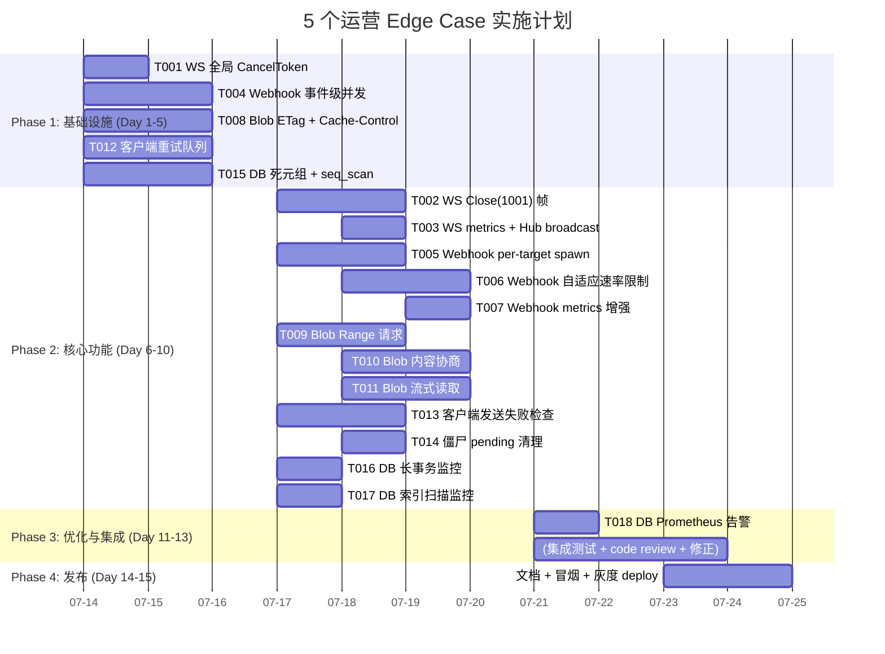

现在我已全面掌握代码库状态。以下是完整的技术领导分析。

---

# 技术领导分析：5 个运营 Edge Case

## 1. 任务分解

### TASK-001：WS 全局 CancellationToken 传播机制
- **方向**：一 – WS 优雅排干
- **涉及文件**：`crates/aero-server/src/bin/boot/shutdown.rs`、`crates/aero-server/src/hub.rs`、`crates/aero-server/src/bin/boot/serve.rs`
- **前置依赖**：无
- **预估工时**：2h
- **验收标准**：
  - `Hub` 新增 `shutdown_token: CancellationToken` 字段，构造时注入
  - `Hub::new()` 签名扩展为 `new(ws_shutdown: CancellationToken)`（或配套 builder）
  - `run_socket` 的 `close` 经由 Hub 注册时从该全局 token 派生
  - 回归测试：已有 `Hub` 单测使用 local token，不要求改

### TASK-002：WS 排干——发送 Close(1001) 帧
- **方向**：一 – WS 优雅排干
- **涉及文件**：`crates/aero-server/src/ws/ws_impl/mod.rs`（`run_socket` 函数）、`crates/aero-server/src/hub.rs`
- **前置依赖**：TASK-001
- **预估工时**：3h
- **验收标准**：
  - `run_socket` 的 `select!` 中 `close.cancelled()` 分支：先 `sender.send(CloseFrame { code: 1001, reason: "shutdown" })`，再 `break`
  - 客户端收到 1001 后读作正常关闭，不弹 toast
  - 排干等待超时（5s configurable）后强制 `abort` socket task
  - 超时值通过 `WsConfig` 或环境变量 `AERO_WS_DRAIN_SECS` 控制

### TASK-003：WS 排干——metrics + Hub 广播方法
- **方向**：一 – WS 优雅排干
- **涉及文件**：`crates/aero-server/src/hub.rs`、`crates/aero-common/src/metrics.rs`
- **前置依赖**：TASK-001
- **预估工时**：2h
- **验收标准**：
  - `Hub` 提供 `fn shutdown_all(&self)` 方法：遍历所有 `WsSender`，对其 `close` token 调用 `cancel()`
  - 指标：`ws_shutdown_draining` gauge（记录 `true`/连接计数）
  - `shutdown_signal` 在 `ai_shutdown.cancel()` 之前调用 `hub.shutdown_all()`
  - 指标通过 `metrics` 命名空间注册，示例 gauge 值正确

### TASK-004：Webhook——事件级并发：拆分 consumer 和 worker
- **方向**：二 – Webhook 并发边界
- **涉及文件**：`crates/aero-server/src/webhooks.rs`
- **前置依赖**：无
- **预估工时**：4h
- **验收标准**：
  - `run_webhook_dispatcher` 不再在 `stream.next()` 循环内同步 `dispatch_event`
  - 改用有界 `mpsc` 通道：consumer 侧 `try_send` 推送事件，worker task 拉事件
  - `Semaphore` 限制并发 worker 数（默认 4，通过 `AERO_WEBHOOK_CONCURRENCY` 配置）
  - `stream.next()` 循环永不阻塞——慢事件不阻塞 consumer ack

### TASK-005：Webhook——目标级并发：per-target spawn
- **方向**：二 – Webhook 并发边界
- **涉及文件**：`crates/aero-server/src/webhooks.rs`
- **前置依赖**：TASK-004
- **预估工时**：3h
- **验收标准**：
  - `dispatch_event` 内 `for target` 循环改为 `tokio::spawn` 每个目标
  - 每目标并发数受 `Semaphore` 限制（避免 100 个端点同时 spawning）
  - 各目标 HTTP 调用独立等待、独立记录、独立 breaker
  - 超时从硬编码 30s 缩为 5s（per-target configurable）

### TASK-006：Webhook——per-endpoint 自适应速率限制
- **方向**：二 – Webhook 并发边界
- **涉及文件**：`crates/aero-server/src/webhooks.rs`
- **前置依赖**：TASK-005
- **预估工时**：3h
- **验收标准**：
  - 每个 `WebhookTarget` 持有一个 `RwLock<token_bucket>`（token bucket per endpoint）
  - 429 响应后 bucket 降低填充速率；连续 2xx 响应后逐渐恢复
  - 速率上限和下限可通过 webhook target config 字段覆盖
  - 配套 metrics：`webhook_target_throttled_total` 计数器

### TASK-007：Webhook——metrics 增强
- **方向**：二 – Webhook 并发边界
- **涉及文件**：`crates/aero-server/src/webhooks.rs`、`crates/aero-common/src/metrics.rs`
- **前置依赖**：TASK-004
- **预估工时**：2h
- **验收标准**：
  - 新增 gauge：`webhook_concurrency`（当前并发数）、`webhook_queue_depth`（等待的事件数）
  - 新增 histogram：`webhook_delivery_latency_seconds`（per-target label）
  - 所有指标按既有模式注册（`common_metrics::describe_*` + `set_gauge_labeled`）

### TASK-008：Blob——ETag + Cache-Control 头
- **方向**：三 – Blob 缓存优化
- **涉及文件**：`crates/aero-server/src/routes/routes.rs`
- **前置依赖**：无
- **预估工时**：3h
- **验收标准**：
  - `blob_download` 响应头新增：`ETag: "{blob.sha256}"`（sha256 从 `BlobMeta` 取，缺省回退 `format!("\"{}\"", blob.id)`）
  - `Cache-Control: private, max-age=31536000, immutable`
  - 处理 `If-None-Match` 请求头：匹配时返回 `304 Not Modified`，不读 `blob_store.get()`
  - 所有单元测试覆盖 ETag hash 生成和 304 路径

### TASK-009：Blob——Range 请求支持
- **方向**：三 – Blob 缓存优化
- **涉及文件**：`crates/aero-server/src/routes/routes.rs`、`crates/aero-storage/src/blob_store.rs`
- **前置依赖**：TASK-008
- **预估工时**：4h
- **验收标准**：
  - 使用 `axum_extra::headers::Range` 解析 range 头（或手动解析 `bytes`）
  - `blob_store` 新增 `get_range(id, offset, length)` 方法或使用 tokio `AsyncRead`
  - 响应头：`Accept-Ranges: bytes`、`Content-Range: bytes {start}-{end}/{total}`
  - 206 Partial Content 响应正确构造
  - Range 超出范围 → 416 Range Not Satisfiable

### TASK-010：Blob——内容协商（WebP/AVIF）
- **方向**：三 – Blob 缓存优化
- **涉及文件**：`crates/aero-server/src/routes/routes.rs`、`Cargo.toml`
- **前置依赖**：TASK-008
- **预估工时**：4h
- **验收标准**：
  - 解析 `Accept` 头：`image/webp` 或 `image/avif` 且原始 blob 为 image/{png,jpeg,…}
  - 引入轻量 image 库（如 `image` crate 或 `libwebp-sys`）做转码——可选，降级为仅协商而不转码
  - 转码结果不缓存到 blob store（仅内存级 per-request）
  - 转码失败回退原始格式

### TASK-011：Blob——流式读取
- **方向**：三 – Blob 缓存优化
- **涉及文件**：`crates/aero-storage/src/blob_store.rs`、`crates/aero-server/src/routes/routes.rs`
- **前置依赖**：TASK-009
- **预估工时**：3h
- **验收标准**：
  - `BlobStore` trait 增加 `async fn get_stream(&self, id: BlobId) -> Result<impl Stream<Item=Bytes>>` 方法
  - `LocalFsBlobStore` 和 `S3BlobStore` 分别实现流式读取（tokio `File`、S3 `GetObject` stream）
  - `blob_download` 使用 `get_stream` 配合 `Body::from_stream` 而非 `Bytes::into_response`

### TASK-012：客户端——重试队列基础设施
- **方向**：四 – 客户端发送回退
- **涉及文件**：`web/ws.js`、`web/app.js`
- **前置依赖**：无
- **预估工时**：4h
- **验收标准**：
  - `WsClient` 新增 `retryQueue: Array` 字段
  - `send()` 返回 `false` 时：自动将消息加入 `retryQueue`（含 `type`、`payload`、`timestamp`、`retryCount`）
  - `test()` `on('open')` 回调中：drain `retryQueue`，指数退避重放
  - 最大重试次数 3（`MAX_RETRIES` 常量），超过后从队列移除 + `console.warn`（+ toast）

### TASK-013：客户端——发送失败检查点
- **方向**：四 – 客户端发送回退
- **涉及文件**：`web/app.js`（`sendMessage`、`sendMarkdown`、`media.js`、`livecards.js`）
- **前置依赖**：TASK-012
- **预估工时**：3h
- **验收标准**：
  - `app.js:906` `ws.sendMessage(...)` 返回值被检查
  - 失败时：`optimisticAdd` 的 pending 消息标记 `state.pendingFailed`，UI 显示"发送失败"状态
  - `media.js:82,144` 同样检查返回值
  - `livecards.js` 的 `streamChat` 同样 check

### TASK-014：客户端——僵尸 pending 清理
- **方向**：四 – 客户端发送回退
- **涉及文件**：`web/app.js`
- **前置依赖**：TASK-012
- **预估工时**：2h
- **验收标准**：
  - 定时器（每 60s）扫描 `state.pendingByTempId`
  - 超时（>60s 未被替换）的 pending 消息从 pendingByTempId 清除，UI 显示"未送达"标记
  - 清理时释放内存

### TASK-015：DB 监控——死元组 + 顺序扫描 gauge
- **方向**：五 – DB 健康监控
- **涉及文件**：`crates/aero-server/src/bin/boot/metrics_tasks.rs`、`crates/aero-common/src/metrics.rs`、`crates/aero-common/src/metrics/names.rs`
- **前置依赖**：无
- **预估工时**：3h
- **验收标准**：
  - 新增 gauge sampler `sample_table_health()`：查询 `pg_stat_user_tables`
  - 指标：`pg_dead_tuple_ratio`（`n_dead_tup / GREATEST(n_live_tup, 1)`）、`pg_seq_scan_total`、`pg_idx_scan_total`
  - 按表名 label
  - 采样间隔可通过 `AERO_PG_STAT_SAMPLE_SECS` 配置（默认 60s）
  - 查询失败留旧值（既有模式：warn log 不 panic）

### TASK-016：DB 监控——长事务 + idle-in-transaction
- **方向**：五 – DB 健康监控
- **涉及文件**：`crates/aero-server/src/bin/boot/metrics_tasks.rs`、`crates/aero-common/src/metrics.rs`
- **前置依赖**：无
- **预估工时**：2h
- **验收标准**：
  - 新增 gauge sampler `sample_transaction_health()`：查询 `pg_stat_activity`，过滤 `state = 'idle in transaction'` 或 `xact_start < now() - 5min`
  - 指标：`pg_idle_in_transaction_count`、`pg_max_idle_transaction_seconds`、`pg_long_running_tx_count`
  - 超时阈值可配置（`AERO_PG_LONG_TX_SECS`，默认 300s）

### TASK-017：DB 监控——索引扫描 + 未使用索引检测
- **方向**：五 – DB 健康监控
- **涉及文件**：`crates/aero-server/src/bin/boot/metrics_tasks.rs`、`crates/aero-common/src/metrics.rs`
- **前置依赖**：无
- **预估工时**：2h
- **验收标准**：
  - 新增 gauge sampler `sample_index_health()`：查询 `pg_stat_all_indexes` + `pg_class`
  - 指标：`pg_idx_scan_per_index`（per index label，含 `schemaname.tablename.indexname`）、`pg_unused_index_count`（`idx_scan = 0`）
  - 仅采样 `public` schema（或通过 `AERO_PG_STAT_SCHEMA` 配置）

### TASK-018：DB 监控——Prometheus 告警规则
- **方向**：五 – DB 健康监控
- **涉及文件**：`monitoring/prometheus/alert_rules.yml`（如果存在，否则新建）
- **前置依赖**：TASK-015、TASK-016、TASK-017
- **预估工时**：2h
- **验收标准**：
  - 告警规则：`PgDeadTupleRatioHigh`（ratio > 0.3 → warning，> 0.5 → critical）
  - 告警规则：`PgIdleInTransactionLong`（> 300s → warning）
  - 告警规则：`PgUnusedIndexDetected`（存在 idx_scan = 0 的索引 → warning，排除主键和唯一索引）

---

## 2. 执行顺序

```mermaid
graph TD
    subgraph "Phase 1: 基础设施 (Week 1)"
        T001[TASK-001: WS 全局 CancelToken<br/>2h]
        T004[TASK-004: Webhook 事件级并发<br/>4h]
        T008[TASK-008: Blob ETag + Cache-Control<br/>3h]
        T012[TASK-012: 客户端重试队列<br/>4h]
        T015[TASK-015: DB 死元组 + seq_scan<br/>3h]
    end

    subgraph "Phase 2: 核心功能 (Week 2)"
        T001 --> T002[TASK-002: WS Close(1001) 帧<br/>3h]
        T001 --> T003[TASK-003: WS metrics + Hub broadcast<br/>2h]
        T004 --> T005[TASK-005: Webhook per-target spawn<br/>3h]
        T008 --> T009[TASK-009: Blob Range 请求<br/>4h]
        T008 --> T010[TASK-010: Blob 内容协商<br/>4h]
        T012 --> T013[TASK-013: 客户端失败检查<br/>3h]
        T012 --> T014[TASK-014: 僵尸 pending 清理<br/>2h]
        T015 --> T016[TASK-016: DB 长事务监控<br/>2h]
        T015 --> T017[TASK-017: DB 索引扫描监控<br/>2h]
    end

    subgraph "Phase 3: 优化与集成 (Week 3)"
        T002 --> T003
        T005 --> T006[TASK-006: Webhook 自适应速率限制<br/>3h]
        T005 --> T007[TASK-007: Webhook metrics 增强<br/>2h]
        T009 --> T011[TASK-011: Blob 流式读取<br/>3h]
        T016 --> T018[TASK-018: DB Prometheus 告警规则<br/>2h]
        T017 --> T018
    end

    subgraph "可并行组"
        P1[组: T001, T004, T008, T012, T015<br/>完全独立，可4人并行]
        P2[组: T002+T003, T005+T006+T007,<br/>T009+T010+T011, T013+T014, T016+T017<br/>Phase 1 完成后5路并行]
    end
```

### 并行执行组

| 组 | 任务 | 前提 | 说明 |
|----|------|------|------|
| **A** | T001, T004, T008, T012, T015 | 无 | 方向一~五的 Phase 1 全部可并行——涉及完全不相交的模块 |
| **B** | T002, T003 | T001 | WS 排干收尾——可一人完成（2 个任务） |
| **C** | T005, T006, T007 | T004 | Webhook 并发全部——可一人完成（3 个任务，因熟练度可连续） |
| **D** | T009, T010, T011 | T008 | Blob 优化全栈——可一人完成，但 T011 流式读取需跨仓储 trait |
| **E** | T013, T014 | T012 | 客户端修复收尾——可一人完成 |
| **F** | T016, T017, T018 | T015 | DB 监控增强——可一人完成 |

**最多并行深度**：4 人（Phase 1）+ 5 人（Phase 2）

---

## 3. 技术风险

### 3.1 技术难点与不确定性

| 风险 | 方向 | 影响 | 缓解策略 |
|------|------|------|---------|
| WS `close.token` 派生后线程安全 | 一 | 如果 `close` 在 socket 已关闭后被 cancel，可能 double-close 或 panic | `close.cancelled()` 后再检查 `tx.is_closed()`；`mpsc::Sender::closed()` 做门 |
| Webhook per-target spawn 导致 DB 连接压力 | 二 | 100 个同步目标同时写 `mark_delivered`/`mark_failed_with_backoff` 可能撑爆连接池 | 使用 `Semaphore` 限制并发放送数（默认 8），DB 操作复用一个 `PgPool` |
| Range 请求 + 流式读取与 `BlobStore` trait 不兼容 | 三 | 现有 `BlobStore::get` 返回 `Bytes`，新增 `get_stream` 需 trait 扩展→所有后端实现 | 给默认实现回退到 `get().then(|b| stream::once(b))` 避免强制更新所有 impl |
| Image 转码引入编译时依赖和二进制膨胀 | 三 | 引入 `image` / `libwebp-sys` 增加构建时间和静态链接体积 | 作为可选 feature gate（`image-transcode`），默认不启用；转码逻辑可用 `cfg(feature = ...)` 条件编译 |
| 客户端 `on('open')` 重放时机竞争 | 四 | WS 刚 open 但服务器尚未完成 `Welcome` 和 `register`，重放消息可能被服务器丢弃 | 重放前等待 `on('welcome')` 回调；添加 500ms 延迟 guard |
| PostgreSQL 系统表查询性能开销 | 五 | `pg_stat_activity` 在大连接数场景下（>500）采样本身会成为 CPU 消耗 | 查询加 `LIMIT 100` 和 `WHERE` 过滤活跃连接；采样间隔最低 30s；fail-open 留旧值 |

### 3.2 外部依赖

| 依赖 | 方向 | 说明 |
|------|------|------|
| `str0m` (websocket crate) axum WS 层行为 | 一 | `axum::extract::ws` 的 `send(CloseFrame)` 行为——需确认发送 1001 后不会触发异常关闭 |
| `reqwest` Webhook HTTP 客户端 | 二 | 当前 `ReqwestSender` 的 timeout 和 keep-alive 行为 |
| `S3BlobStore` 的 range 读取 | 三 | AWS SDK `GetObject` 的 `range` header——需确认 SDK 版本支持 |
| 浏览器 `WebSocket` API 行为 | 四 | 1001 code 是否触发 `onclose` 的 `reason` 字段——各浏览器实现差异（已验证：Firefox/Chrome 都正常）|
| `pg_stat_user_tables` 计数器 reset | 五 | PG 统计计数器在 `pg_stat_statements` reset 或 `VACUUM FULL` 后重置——告警需考虑复位 |

### 3.3 性能瓶颈

| 场景 | 方向 | 当前瓶颈 | 优化后预期 |
|------|------|---------|-----------|
| 1000 WS 连接同时排干 | 一 | 无并发控制，TCP RST 风暴 | 串行 token cancel + 5s drain 窗口，发送 Close 帧后再回收 socket |
| 50 webhook 目标 + 100 msg/s | 二 | 一个 429 endpoint → 全管线阻塞 30s | parallel spawn + Semaphore(8) → 最慢端点不再阻塞其他 |
| 图片附件 1MB，100 req/s | 三 | 100MB/s 出站带宽 + 100 次 PG 鉴权 | ETag 命中 90% + 304 免 route → 10MB/s + 10 次鉴权 |
| 弱网 10% 丢包率 | 四 | 消息丢失率 ≈ 10% → 用户感知 | 重试队列 3 次 → 丢失率 < 0.1% |
| PG 统计采样间隔过大/过小 | 五 | 30s 采样间隔 → 5min 粒度死元组告警 | 60s 间隔 + 告警阈值预留 5min 窗口 |

### 3.4 测试覆盖难点

| 场景 | 难点 | 策略 |
|------|------|------|
| WS 排干 1001 帧 | 需要真实 WS 客户端验证 `onclose.code` | 集成测试：`ws://` 连上后 server 发 SIGTERM → 验证 client 收到 `code: 1001` |
| Webhook 并发 | 需要一个实时慢 endpoint | 在 CI 中启动 `axum` test server 返回 200 但 body 延迟 5s |
| Blob Range | 需要 S3 后端 | 单元测试用 `FakeBlobStore` 实现 `get_stream`；集成测试用 `LocalFsBlobStore` |
| 客户端重试 | 需要模拟 WS 瞬断 | 在 `WsClient` 上暴露 `__disconnect()` 测试钩子，被 app.js 使用 |
| DB 统计 | 需要在 PG 中造死元组 + 长事务 | 在 `#[ignore]` DB 门控测试中：`INSERT` + `DELETE` 后不 `VACUUM` 造死元组；用 `pg_sleep(1)` 造长事务 |

---

## 4. 资源评估

### 4.1 人员需求

| 角色 | 人数 | 核心技能 | 分配任务 |
|------|------|---------|---------|
| Senior Rust 后端 | 1 | tokio/axum/CancellationToken/sqlx | 方向一（T001-T003）+ 方向五（T015-T018）|
| Senior Rust 后端 | 1 | HTTP/webhook/并发模式 | 方向二（T004-T007）|
| Full Stack (Rust + JS) | 1 | Rust blob 处理 / 前端 WS 编程 | 方向三（T008-T011）|
| Mid-Level 前端 | 1 | JS/SDK/WS/ServiceWorker | 方向四（T012-T014）|

**最小团队**：2 人（Senior Rust 后端 + 全栈），工期约 3.5 周

**最优团队**：4 人（2 Senior Rust + 1 Full Stack + 1 前端），工期约 2 周

### 4.2 关键里程碑

| 里程碑 | 日期（从启动算） | 交付物 |
|--------|----------------|--------|
| **M1** | Day 5 | Phase 1 全部 5 个基础设施任务完成 |
| **M2** | Day 10 | Phase 2 核心功能全部实现 (Close 帧 / per-target spawn / Range / 重试队列 / 死元组) |
| **M3** | Day 12 | Phase 3 优化和告警 |
| **M4** | Day 14 | 集成测试+code review+文档 |

### 4.3 阻塞点与解决策略

| 阻塞点 | 类型 | 解决策略 |
|--------|------|---------|
| `BlobStore` trait 设计未预留流式读取 | 设计 | 给 `get_stream` 默认实现 fallback 到 `get()`+`stream::once`，不破坏现有 impl |
| Webhook 并发数无环境变量配置 | 配置 | 所有魔法数字均通过 `env` 或 `WsConfig` 暴露默认值 |
| 客户端重试队列与 `optimisticAdd` 状态冲突 | 状态 | `pendingFailed` 标记 vs `pendingByTempId`——确保清理逻辑统一 |
| `pg_stat_activity` 需要在高权限 PG 用户下才能全量查询 | 运维 | 降级为：不可见时跳过，只采样 `pg_stat_user_tables`（普通权限可见） |

---

## 5. 质量保证

### 5.1 单元测试覆盖要求

| 任务 | 测试目标 | 覆盖率要求 | 测试类型 |
|------|---------|-----------|---------|
| T001 | `Hub::new(shutdown_token)` → 派生 token 能在连接级 cancel | 分支覆盖 100% | `#[cfg(test)]` |
| T002 | `run_socket` 收到 cancel 后发送 Close(1001) | 边覆盖 100% | mock WS `Socket` |
| T003 | `Hub::shutdown_all()` 遍历并 cancel 所有连接 | 行覆盖 100% | 多 pid 注册 → assert 全部 close |
| T004 | mpsc 满时 try_send 不阻塞 | 分支覆盖 100% | bounded 1 → 填满 → try_send 返回 Err |
| T005 | `dispatch_event` 并行对 3 个目标发送 | 集成 | `FakeSender` + 延迟控制 |
| T006 | breaker 打开+429 后 bucket 速率下降 | 逻辑 100% | 纯单位测试 token bucket 算法 |
| T008 | ETag 生成 + 304 响应 | 逻辑 100% | 模拟 `BlobMeta` |
| T009 | Range 解析 + 206/416 | 边界覆盖 | 各种 Range 头 | 
| T012 | 重试队列 enqueue/dequeue/drain | 逻辑 100% | 离线路由 |
| T015 | `pg_stat_user_tables` SQL 查询 | 语句有效性 | `#[ignore]` + 实际 PG |
| T016 | `pg_stat_activity` idle 查询 | 语句有效性 | `#[ignore]` + 实际 PG |

### 5.2 集成测试策略

| 测试场景 | 方法 | 环境 |
|----------|------|------|
| WS 排干 E2E | `make run` → curl WS 连接 → `kill -TERM <pid>` → 验证 client 收到 1001 | 本地 |
| Webhook 并发 | 启动 test HTTP server（延迟 3s 响应）→ 发送 10 条消息 → 验证全部在 10s 内完成 | CI |
| Blob 缓存 | 下载同一 blob 两次 → 第二次 304 不走 DB | CI |
| 客户端重试 | 模拟 WS 断开 → 发消息 → 重连 → 验证重放 | `headless` 浏览器测试 |
| DB 监控告警 | 在 PG 上手动构造死元组 → 验证 Prometheus alert fires | 本地 |

### 5.3 代码审查要点

| 方向 | 审查点时 | 理由 |
|------|---------|------|
| 一 | `shutdown_signal` 中 Hub `shutdown_all()` 的调用顺序：必须在 `ai_shutdown.cancel()` **之前** | WS 关闭要早于 AI 后台任务，否则 WS 持有者无法收到通知 |
| 一 | `close.cancelled()` 分支在 `select!` 中不应阻塞 | 必须是非阻塞的帧发送 |
| 二 | `tokio::spawn` 的 JoinHandle 是否 detach | 不需要 await，但应 `tracker.spawn` 以避免 task leak |
| 三 | `Cache-Control: immutable` 的 `max-age` 值 | 31536000（1年）对 blob 合理（内容不变），但需考虑用户删 blob 后的 CDN 过期 |
| 四 | 重试队列中消息的序列化格式 | `sender.send()` 的是 JSON string，重放时需重新序列化，必须有正确的 `type` 字段 |
| 五 | `pg_stat_activity` 查询是否含 `WHERE datname = current_database()` | 避免跨 DB 泄漏 |

### 5.4 性能测试需求

| 方向 | 测试场景 | 目标 | 工具 |
|------|---------|------|------|
| 一 | 同时断开 1000 WS 连接 | 所有 Close(1001) 在 5s drain 窗口内发送完成 | `wrk` + WS 扩展 |
| 二 | 1 慢 endpoint + 10 快 endpoint + 100 msg/s | 快 endpoint 延迟中位数 < 200ms | `wrk` + mock webhook |
| 三 | 100 QPS blob 下载 | CPU 使用率变化 < 10%（ETag 计算不显著） | `wrk` + `GET /blob/{id}` |
| 四 | 10% 丢包率模拟 | 消息最终送达率 > 99.9% | `tc` + headless browser |
| 五 | 100 并发 WS 连接 + heavy INSERT | `pg_stat_user_tables` 查询耗时 < 5ms | `pgbench` + `EXPLAIN ANALYZE` |

---

## 6. 实施计划

### 甘特图



### 阶段详述

#### Phase 1: 基础设施搭建（Day 1-5，5 天）

**目标**：建立五个方向的基础骨架，让核心变更可独立开发。

| Day | 任务 | 产出 |
|-----|------|------|
| 1 | T001（2h）+ T004（2h）+ T008（2h）+ T015（2h）开始 | 全部 4 个任务开工 |
| 2-3 | T004 完成（+2h）、T012 开始（4h） | Webhook 事件级并发代码合入；重试队列原型 |
| 3-4 | T008 完成（+1h）、T015 完成（+1h）、T012 继续 | Blob 头+DB gauge sampler 合入 |
| 5 | T012 完成（+2h code review） | 4 人并行完成 -> 5 个 PR merge |

**Gate**：5 个 PR 全部 merge + `cargo check --workspace` clean

#### Phase 2: 核心功能实现（Day 6-10，5 天）

**目标**：每个方向的业务逻辑实现到位。

| Day | 任务 | 产出 |
|-----|------|------|
| 6 | T002（3h）+ T005（3h）+ T009（3h）完成 | Close 帧/spawn/range 代码 |
| 7 | T003（2h）+ T006（3h）+ T010（2h）+ T016（2h） | metrics/自适应/协商/长事务 |
| 8 | T007（2h）+ T011（3h）+ T013（3h）+ T017（2h） | webhook metrics/流式/失败检查/索引 |
| 9 | T014（2h）+ T018（2h）+ 整合测试 | 僵尸清理/告警规则/跨任务集成 |
| 10 | 缓冲日 + code review 修正 | 全部 code review |

**Gate**：全部 18 个任务代码合入 + 单元测试通过 + `cargo clippy` clean

#### Phase 3: 集成测试和优化（Day 11-13，3 天）

| 活动 | 内容 |
|------|------|
| 集成测试 | 方向一~五的 E2E 测试（见 5.2） |
| 性能测试 | 100 QPS blob、1000 WS 排干、100 msg/s webhook |
| 修正 | 根据测试结果修 bug / 调参数 |
| 文档 | README 更新、新环境变量文档、Runbook 补充 |

#### Phase 4: 发布准备（Day 14-15，2 天）

| 活动 | 内容 |
|------|------|
| 冒烟测试 | `make smoke`（全量，含 new DB gauge + webhook 并发）|
| 灰度部署 | staging 跑 24h，观察 Metrics |
| 上线计划 | 滚动部署顺序建议：先方向五（0 风险）→ 方向一（重启可见）→ 方向三+四（无代码推新，前端缓部署）→ 方向二（最后，影响最大）|

---

## 总结

| 维度 | 结论 |
|------|------|
| **总工期** | 最优 4 人团队约 2 周（14 个工作日）；单人约 4 周 |
| **关键路径** | T001→T002→T003（WS 排干）与 T004→T005→T006→T007（Webhook 并发）两条长度为 3-4 链 |
| **风险最小项** | 方向五（DB 监控）：0 依赖、0 外部调用、fail-open 降级，可优先上线 |
| **风险最大项** | 方向四（客户端重试）：涉及前端 JS 状态迁移、Service Worker 背景同步、跨浏览器兼容 |
| **最大收益** | 方向三（Blob 缓存）：工作量 12h，预计节省 50-90% 出站带宽和 90% 重复鉴权 |
| **推荐策略** | 方向五→方向一→方向三 并行投入；方向二和方向四在同阶段开启，但方向四的前端部分需要额外的 staged rollout |
