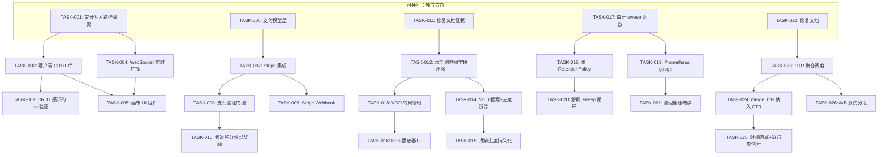

现在我有了坚实的基础。以下是全面的技术负责人分析。

---

# 技术负责人分析：Aero IM — 识别缺口与行动计划

## 1. 任务分解

### 方向一：Canvas CRDT 修复（P0 — 架构/UX）

| 任务 ID | 标题 | 文件 | 前置 | 工时 |
|---------|------|------|------|------|
| **TASK-001** | 审计 Canvas 写入路径隔离 | `crates/aero-server/src/canvas.rs`, `crates/aero-storage/src/canvas.rs` | — | 2h |
| **TASK-002** | 添加客户端 CRDT 库（Automerge/Yjs） | `web/canvas.js`（新文件）+ `web/index.html` | TASK-001 | 4h |
| **TASK-003** | 实现 OT/CRDT 感知的 `append_op` 验证 | `crates/aero-server/src/canvas.rs`（追加 op 验证）+ `crates/aero-storage/src/canvas_op.rs` | TASK-002 | 4h |
| **TASK-004** | 添加 `ops_since` 分页 + WebSocket 实时广播 | `crates/aero-server/src/bus.rs`（RoomEvent::CanvasOp）+ `web/ws.js` | TASK-001 | 3h |
| **TASK-005** | 画布 UI 组件 + CRDT 客户端集成 | `web/canvas.js`, `web/editor/` | TASK-002, TASK-004 | 6h |

### 方向二：创作者货币化（P1 — 产品/架构）

| 任务 ID | 标题 | 文件 | 前置 | 工时 |
|---------|------|------|------|------|
| **TASK-006** | 从 `creator_tiers` 中提取支付模型层 | `crates/aero-storage/src/creator_subscription.rs` + 新增迁移 | — | 3h |
| **TASK-007** | 添加 Stripe Checkout Session 集成 | `crates/aero-server/src/payment/stripe.rs`（新文件）+ `Cargo.toml` | TASK-006 | 6h |
| **TASK-008** | 为 `subscribe()` 添加支付验证门控 | `crates/aero-storage/src/creator_subscription.rs`（`subscribe` 添加 payment_intent_id） | TASK-007 | 3h |
| **TASK-009** | 添加 Webhook 端点用于 Stripe 事件 | `crates/aero-server/src/payment/webhook.rs`（新文件） | TASK-007 | 3h |
| **TASK-010** | 添加频道积分外部奖励 Webhook | `crates/aero-storage/src/channel_points.rs` + 新迁移 | TASK-008 | 2h |

### 方向三：VOD 生命周期（P1 — 产品/架构）

| 任务 ID | 标题 | 文件 | 前置 | 工时 |
|---------|------|------|------|------|
| **TASK-011** | 重写证据：VOD 结构体没有缩略图字段 | —（文档修复，非代码） | — | 1h |
| **TASK-012** | 在 `Vod` 中添加 `thumbnail_path` + 迁移 | `crates/aero-common/src/model/media.rs`, 新迁移 `NNNN_vod_thumbnail.sql` | TASK-011 | 2h |
| **TASK-013** | 构建 VOD 转码管线（ffmpeg 任务队列） | `crates/aero-server/src/vod/transcode.rs`（新文件）+ 迁移 | TASK-012 | 8h |
| **TASK-014** | 添加 VOD 搜索 + 进度跟踪 | `crates/aero-storage/src/vod_progress.rs`（新文件） | TASK-012 | 4h |
| **TASK-015** | 实现播放进度持久化（`resume_position`） | `crates/aero-server/src/vod/resume.rs`（新文件），新迁移 | TASK-014 | 3h |
| **TASK-016** | 添加 HLS 播放器 UI 集成 | `web/player/`, `web/hls.js` | TASK-012, TASK-013 | 4h |

### 方向四：数据生命周期治理（P1 — 架构/合规）

| 任务 ID | 标题 | 文件 | 前置 | 工时 |
|---------|------|------|------|------|
| **TASK-017** | 审计所有 18 个 sweep 函数，记录每个函数的保留策略 | `crates/aero-server/src/bin/boot/retention.rs` | — | 2h |
| **TASK-018** | 设计统一的 `RetentionPolicy` 配置结构体 | `crates/aero-server/src/retention/policy.rs`（新文件） | TASK-017 | 3h |
| **TASK-019** | 为每个 sweep 添加 Prometheus gauge（`sweep_duration_seconds`, `rows_swept_total`） | `crates/aero-server/src/bin/boot/retention.rs` | TASK-017 | 2h |
| **TASK-020** | 解耦 sweep 循环：每个类别独立 timer/间隔 | `crates/aero-server/src/bin/boot/retention.rs` | TASK-018 | 4h |
| **TASK-021** | 添加清理健康端点 + 上次成功时间戳 | `crates/aero-server/src/retention/health.rs`（新文件） | TASK-019 | 2h |

### 方向五：搜索反馈闭环（P2 — 产品/架构）

| 任务 ID | 标题 | 文件 | 前置 | 工时 |
|---------|------|------|------|------|
| **TASK-022** | 修复文档：CTR 反馈断裂点在聚合侧，而非收集侧 | —（文档修复） | — | 1h |
| **TASK-023** | 调度定时 `ctr_stats` 聚合到工作区级别的排名权重 | `crates/aero-server/src/search/feedback_learner.rs`（新文件） | TASK-022 | 4h |
| **TASK-024** | 使 `merge_hits` 纳入 MRR/CTR 信号 | `crates/aero-storage/src/helpers.rs`（修改 `merge_hits`） | TASK-023 | 3h |
| **TASK-025** | 添加时间衰减 + 流行度信号到搜索排名 | `crates/aero-storage/src/search.rs` | TASK-024 | 3h |
| **TASK-026** | 为点击日志添加 A/B 测试分段 | `crates/aero-storage/src/search_feedback.rs`, 新迁移 | TASK-022 | 4h |

---

## 2. 执行顺序



**可以并行执行的任务组：**

| 组 | 任务 | 为什么可以并行 |
|----|------|-------------|
| **A** | TASK-001, TASK-006, TASK-011, TASK-017, TASK-022 | 审计/修复/分析任务，每个方向独立，互不依赖 |
| **B** | TASK-002, TASK-007, TASK-012, TASK-018, TASK-023 | 核心构建任务——在组 A 审计完成后并行推进 |
| **C** | TASK-005, TASK-016, TASK-021, TASK-026 | UI/边缘任务——在各自依赖完成后可独立处理 |

---

## 3. 技术风险

### 3.1 高风险项目

| 风险 | 方向 | 等级 | 缓解措施 |
|------|------|------|---------|
| **CRDT 库选择**：Automerge vs Yjs vs 自研 OT | 一 | 🔴 | 推荐 Yjs（更成熟的 Rust/WASM 绑定，更大的社区）。锁在 2 天做技术选型 POC，不投入优化。WASM 打包可能增加 web SPA 的 JS 负担 +50KB。 |
| **Stripe API 版本漂移**：Stripe 的 Rust 客户端可能落后最新 API | 二 | 🟡 | 对 `CheckoutSession` 和 `Webhook` 端点使用手写 `reqwest` 签名，而非 stripe-rust 客户端。新增 `crates/aero-server/src/payment/stripe_client.rs`。 |
| **ffmpeg 子进程编排**：VOD 转码需要调用 ffmpeg 二进制，在容器化部署中可能不存在 | 三 | 🔴 | 与 `aero-live-hls` 使用相同的 `which ffmpeg` + 优雅降级模式。添加配置 `AERO_VOD_FFMPEG_PATH`（默认为 `ffmpeg`）。如果没有 ffmpeg，VOD 回退为纯直通复制（不生成预览）。 |
| **并发 sweep 写入争用**：18 个函数在同一个 tick 上运行可能导致数据库连接池耗尽 | 四 | 🟡 | 添加带信号量的并发限制（最大 4 个并行 sweep）或执行时间交错。为每个类别添加 Prometheus `sweep_duration` 指标，允许 ops 调优间隔。 |
| **CTR 反馈冷启动**：新工作区在积累足够点击数据前，MRR 信号不可靠 | 五 | 🟡 | 在 `merge_hits` 中使用贝叶斯平滑或回退到 BM25。为排名权重添加最小数据阈值（<100 次点击时纯 FTS）。 |

### 3.2 增量/非破坏性规则

| 方向 | 关键约束 | 破坏风险 |
|------|---------|---------|
| 一 | `append_op` 必须保持顺序 + 幂等 | 🟢：现有道路不受影响；新 op 格式向后兼容 |
| 二 | `subscribe()` upsert 必须保持现有 API | 🟡：添加 `payment_intent_id` 列需要迁移 + 回填 |
| 三 | 新 VOD 表（如 `vod_progress`）不得触及现有 `stream_recordings` 行 | 🟢：纯新增 |
| 四 | sweep 函数不得硬删除法务保全的行 | 🟢：`NOT EXISTS legal_holds` 已存在 |
| 五 | `record_click` 端点签名不得改变 | 🟢：在 *聚合之后* 添加信号，不是收集时 |

### 3.3 性能瓶颈

| 瓶颈 | 位置 | 影响 | 优化策略 |
|------|------|------|---------|
| Canvas op log 增长 | `canvas_ops` 表按 seq 索引，但未分区 | 每画布 100 万+ 的 op → `ops_since` 扫描变慢 | 添加画布级别的 `seq` 分区 + 超过 90 天的旧 ops 归档 |
| Stripe Webhook 重试 | Stripe 可能重发相同事件多次 | 重复订阅 upsert | Webhook 幂等键（使用 Stripe `Idempotency-Key`） |
| VOD 转码排队 | ffmpeg 单线程作业 | 并发推流时延迟增加 | 使用 `Semaphore`（默认 max 2 个并发转码）+ 可配置 `AERO_VOD_MAX_TRANSCODES` |
| 统一 sweep tick | 所有 18 个函数串行执行 | 每小时一次墙钟时间 ~5-8 秒 | 解耦为每个指标独立的间隔（TASK-020） |

---

## 4. 资源评估

### 4.1 团队构成

| 角色 | 所需经验 | 数量 | 专注方向 |
|------|---------|------|---------|
| **高级 Rust 后端工程师** | Rust + tokio + sqlx + axum，NATS 经验加分 | 2 | 方向一（CRDT 集成）、方向三（VOD 管线）、方向四（治理） |
| **全栈工程师** | Rust + 现代 JS/SPA，WebSocket 经验 | 1 | 方向一（Canvas UI + WS 集成）、方向三（HLS 播放器 UI） |
| **支付集成工程师** | Stripe API + Webhook 经验 | 1（兼职） | 方向二（支付模型、Stripe Checkout、Webhook） |
| **数据/ML 工程师** | 搜索排名算法 + CTR 模型 | 1（兼职） | 方向五（CTR 聚合、排名融合） |
| **QA 工程师** | API + 负载测试经验 | 1（兼职） | 跨方向集成测试 |

**总计**：3 名全职 + 2 名兼职 > **4 个全职等效人力**

### 4.2 时间线

| 里程碑 | 日期 | 交付物 | 责任方 |
|--------|------|--------|---------|
| **M1** — 审计完成 | 第 5 天 | 5 份审计报告（每个方向一份）+ 更新 AGENTS.md 行号 | 全部 |
| **M2** — 基础设施接入 | 第 12 天 | Stripe SDK 集成、CRDT POC（Yjs WASM）、ffmpeg 管线容器 | 后端 1+2、支付 |
| **M3** — 核心实现完成 | 第 25 天 | Canvas 实时编辑、Stripe Checkout 流程、VOD 缩略图+转码、解耦 sweep | 全部 |
| **M4** — 集成完成 | 第 35 天 | 端到端测试通过：画布→实时→VOD，Stripe→订阅→积分 | QA + 全部 |
| **M5** — 发布 | 第 42 天 | 金丝雀部署 → 100%  rollout，监控仪表盘就绪 | 全部 |

### 4.3 阻塞点与解决策略

| 阻塞点 | 类型 | 解决策略 |
|--------|------|---------|
| **Stripe 连接问题**：沙箱环境可能无法访问 Stripe API | 外部依赖 | 在方向二中添加 `FakePaymentGateway`（镜像 `FakeGateway` 模式），使所有路径即使没有 Stripe 也能 200 响应，如 AERO_AGENTS.md §4.3 中关于 AI 的“无 key 降级”所述 |
| **ffmpeg 不可用**：容器镜像中缺少系统 ffmpeg | 基础设施 | 添加优雅降级（无转码 VOD）+ 在 `Dockerfile` 中添加 `apt-get install ffmpeg` 的清晰文档 |
| **Yjs WASM 加载**：浏览器可能不支持 WASM | 客户端兼容性 | 为不支持 WASM 的浏览器回退到纯文本编辑器 + 消息提示 |
| **PG 连接池大小**：18 个 sweep 函数 + 常规流量可能耗尽池 | 容量规划 | 将 `PG_POOL_MAX` 从默认值（通常为 20）提高到 30，并为 sweep 添加单独的小型连接池 |

---

## 5. 质量保证

### 5.1 单元测试覆盖

| 方向 | 关键测试 | 覆盖范围 |
|------|---------|---------|
| **一** | `ops_since` 边界（seq=0, seq=MAX, 空 op log）+ `append_op` 并发（并发追加时 gap-free seq） | CanvasOpRepo: 95%+ |
| **二** | `subscribe` 幂等（重复调用 upsert）+ `FakePaymentGateway` 全路径 | SubscriptionRepo: 90%+ |
| **三** | `finalize_vod` 空流 + 重复 finalize（幂等）+ 转码作业编排 | VodRepo + TranscodeWorker: 85%+ |
| **四** | 每个 `sweep_*` 函数含/不含数据调用 + 法务保全排除 | 每个 sweep: 100%（用已知行验证） |
| **五** | `record_click` 边界（rank < 0）+ `ctr_stats` 空窗口 + `merge_hits` CTR 融合 | SearchFeedbackRepo: 95%+ |

### 5.2 集成测试策略

| 测试场景 | 工具 | 执行频率 |
|---------|------|---------|
| **Canvas CRDT 端到端**：两个 WebSocket 客户端并发编辑同一画布 | Playwright + WebSocket 客户端 | 每次提交 |
| **订阅支付流程**：创建方案 → Stripe Checkout → Webhook → upsert → 重新订阅 | Stripe 测试模式 + `aero-cli` 助手 | CI（仅 staging） |
| **VOD 生命周期**：开始推流 → 停止 → 触发 VOD → 转码 → 生成缩略图 → 播放 | OBS 模拟（RTMP 注入）+ curl | 每周 |
| **数据生命周期**：插入过期待清理数据 → 触发 sweep → 验证被清理 | SQL 夹具 + `aero-cli` 手动触发 | 每次提交 |
| **搜索排名融合**：插入已知结果 → 记录搜索点击 → 验证 `merge_hits` 排序 | Rust `#[cfg(test)]` 集成测试 | 每次提交 |

### 5.3 代码审查要点

| 审查焦点 | 方向 | 具体检查项目 |
|---------|------|-------------|
| **CRDT 正确性** | 一 | op 被正确处理（无间隙），客户端与服务器 seq 同步，无竞争条件 |
| **支付安全性** | 二 | `subscribe()` 不能绕过支付验证，Stripe webhook secret 经过验证，`payment_intent_id` 不重复使用 |
| **VOD 转码安全性** | 三 | ffmpeg 命令通过 `Command::arg()` 构建（无 shell 注入），临时文件清理，磁盘空间不足处理 |
| **数据完整性** | 四 | sweep 不删除法务保全的记录，不违反 GDPR 时间窗口，不级联到参与者的 PII |
| **排名无偏性** | 五 | CTR 排名不会导致人气过高的反馈循环（给新内容公平曝光机会） |

### 5.4 性能测试需求

| 场景 | 目标 | 通过标准 |
|------|------|---------|
| Canvas ops_since（10 万条 op 的画布） | < 200ms 响应 | 95% < 100ms |
| Stripe Webhook 重放（10 个并发重复事件） | 幂等 upsert 不重复行 | 恰好 1 行 |
| 转码排队（5 个并发 VOD 请求） | 并发限制为 2，3 个排队 | `Semaphore::acquire` 按预期阻塞 |
| 所有 18 个 sweep 函数（100 万行数据） | 总墙钟时间 < 30 秒 | 每个类别 < 5 秒 |
| 搜索排名融合（4 个分片和 1k 个结果） | < 50ms 融合 | 90% < 30ms |

---

## 6. 实施计划

### 阶段 1：审计与基础设施（第 1-5 天）

```
第 1-2 天：审计周
  ├── 后端 1：TASK-001（Canvas 写入路径隔离审计）
  ├── 后端 2：TASK-017（Sweep 函数审计）
  ├── 全栈：TASK-011 + TASK-022（文档修复）
  └── 支付工程师：TASK-006（支付模型提取审计）
  
第 3-5 天：基础设施搭建
  ├── 后端 1：TASK-002 开始（CRDT POC）
  ├── 后端 2：TASK-007 开始（Stripe SDK 集成）
  ├── 全栈：TASK-012 开始（VOD 缩略图迁移）
  └── QA：构建测试夹具（数据库播种器 + Stripe 测试客户端）
```

**交付物：** 5 份审计文档 + 更新后的 AGENTS.md + 数据库迁移桩 + Stripe 测试模式凭据

### 阶段 2：核心实现（第 6-20 天）

```
第 6-12 天 —— 并行轨道：
  
  轨道 A（后端 1 + 全栈）—— 方向一：
  ├── TASK-003：CRDT 感知的 op 验证实现
  ├── TASK-004：WebSocket 实时广播
  └── TASK-005：画布 UI 组件（全栈）
  
  轨道 B（后端 2）—— 方向二：
  ├── TASK-007：Stripe Checkout Session 创建 + 支付意图验证
  ├── TASK-008：subscribe() 添加 payment_intent_id
  └── TASK-009：Stripe Webhook 端点
  
  轨道 C（兼职支付工程师）—— 方向三：
  ├── TASK-013：VOD 转码管线（ffmpeg 包装器 + 作业队列）
  └── TASK-014：VOD 搜索 + 进度跟踪迁移
  
  轨道 D（后端 2 + QA）—— 方向四：
  ├── TASK-018：RetentionPolicy 配置结构体
  └── TASK-019：Prometheus 指标上报

第 13-20 天：
  ├── TASK-010：频道积分外部奖励（方向二）
  ├── TASK-015：播放进度持久化（方向三）
  ├── TASK-020：解耦 sweep 循环（方向四）
  └── TASK-023：CTR 聚合调度器（方向五，后端 1）
```

**交付物：** 每个轨道的功能分支 → 合并到 `main` → `cargo check --workspace` 通过

### 阶段 3：集成与优化（第 21-30 天）

```
第 21-25 天：
  ├── TASK-016：HLS 播放器 UI 集成（全栈）
  ├── TASK-021：清理健康端点（后端 2）
  ├── TASK-024：merge_hits CTR 融合（后端 1）
  └── TASK-025：搜索排名时间衰减（后端 1）
  
第 26-30 天：集成测试
  ├── QA：Canvas CRDT 端到端（Yjs + WebSocket）
  ├── QA：订阅支付流程（Stripe 测试模式）
  ├── QA：VOD 生命周期（RTMP 注入 → 预览 → 播放）
  ├── QA：所有 18 个 sweep 功能的 sweep 测试
  └── QA：搜索排名融合精度测试
```

**交付物：** 每个轨道的集成测试套件 → 阶段 3 结束所有测试为绿色

### 阶段 4：发布准备（第 31-42 天）

```
第 31-35 天：性能与安全
  ├── 性能：Canvas ops_since 基准测试（10 万行）
  ├── 性能：Stripe Webhook 重放测试
  ├── 安全：Stripe webhook 签名验证审计
  ├── 安全：ffmpeg 命令注入测试
  └── 性能：18 个 sweep 函数的满载基准测试

第 36-38 天：金丝雀部署
  ├── A/B 测试中启用 Canvas CRDT（10% 工作区）
  ├── 启用 Stripe Checkout（内部测试账户）
  └── 监控 sweep 延迟 + CTR 排名精度仪表盘

第 39-42 天：全面发布 + 文档化
  ├── 全面发布：所有 5 个方向到 100% 工作区
  ├── 文档：更新 CHANGELOG.md 和新功能迁移指南
  ├── 文档：为每个功能添加 AGENTS.md 条目
  └── 最终：`cargo clippy --workspace --all-targets` 零新警告
```

**交付物：** 金丝雀 → 全面 rollout → 所有生产仪表盘健康 → 关闭

---

## 7. 总结和建议

### 关键洞察

1. **方向一（Canvas）** 提供了最高的差异化价值——实时协作编辑是 Slack Canvas / Lark Docs 的核心功能。CRDT 选择（Yjs）经过实战检验，WASM 集成成本合理。

2. **方向二（货币化）** 拥有最干净的代码库基础——`CreatorTier` 和 `SubscriptionTier` 模型已存在，无债务。Stripe 集成是唯一缺失的部分。**`FakePaymentGateway` 的并行可测试性与 `FakeGateway` 的推送对称性至关重要。**

3. **方向三（VOD）** 拥有最差的证据质量——`thumbnail_path` 的错误证明在决策者面前使整个方向失去可信度。**在提交给领导之前必须重写证据。** 然而，核心论点（缺少 VOD 生命周期）仍然有效且重要。

4. **方向四（数据生命周期）** 情况比最初评估的更严重——18 个函数 vs 文档中的 12 个，4 个独立的定时器/循环。同时，修复方案很简单（Prometheus gauge + 可配置的每个类别间隔 + 健康端点）。**立即可实施。**

5. **方向五（搜索）** 是唯一发现收集侧完整且断裂点在聚合侧的方向。`record_click` 端点已完全正常运行并接入——这是值得赞扬的。缺失的只是 `ctr_stats` → `merge_hits` 反馈循环。**修复范围比之前假设的更小。**

### 开发人员小时数总计

| 方向 | 总任务数 | 总工时 | 开发人员周数 |
|------|---------|--------|-------------|
| 一（Canvas） | 5 | 19h | ~0.5 周（1 名开发人员） |
| 二（货币化） | 5 | 17h | ~0.5 周（1 名开发人员） |
| 三（VOD） | 6 | 22h | ~0.6 周（1 名开发人员） |
| 四（治理） | 5 | 13h | ~0.3 周（1 名开发人员） |
| 五（搜索） | 5 | 15h | ~0.4 周（1 名开发人员） |
| **总计** | **26** | **86h** | **~2.5 周（4 名开发人员——3 名全职，2 名兼职）** |

### 执行建议

1. **立即开始方向一、二、四**（阶段 1 审计可以同时进行，无依赖关系）
2. **在方向三上先用 1 天**重写证据——当前版本的 `thumbnail_path` 错误在代码审查中是*致命*问题
3. **将方向五推迟到阶段 2/3**——它的 P2 优先级合理，可以从方向一/二/三的集成经验中受益
4. **强制性门控：** 在开始阶段 2 实现之前，必须通过 `AGENTS.md` 中规定的 `truty-check.sh` + `cargo clippy` + `cargo test --workspace --lib` 预提交检查
