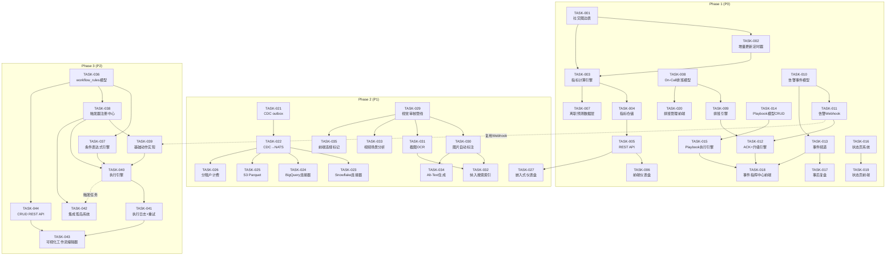
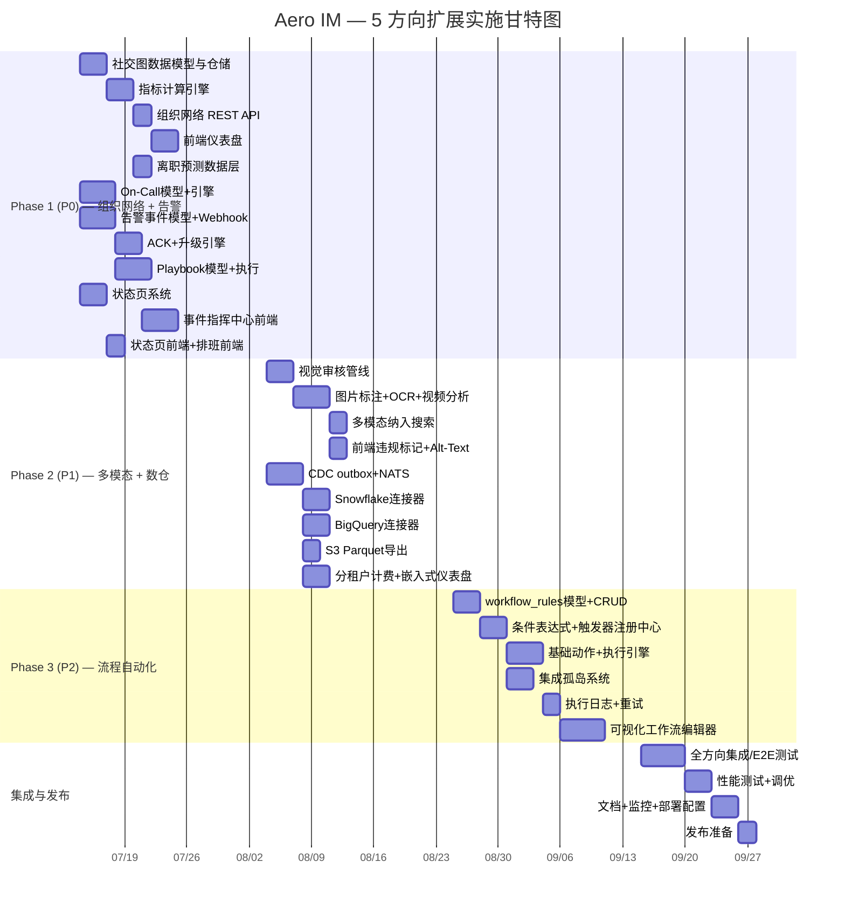

文档已完整读取。以下是我作为 Tech Lead 的深度分析报告。

---

# Tech Lead 分析报告：5 个高价值扩展方向

> **基于**: `docs/requirements/2026-07-11-five-high-value-expansion-directions.md`  
> **分析日**: 2026-07-12  
> **分析人**: Tech Lead（AI 辅助）

---

## 1. 任务分解

### 方向一：组织网络智能（P0）

| 任务 ID | 标题 | 涉及文件 | 前置依赖 | 工时 |
|---------|------|---------|---------|------|
| TASK-001 | 社交图数据库：定义图模型与边表 | `crates/aero-storage/src/social_graph.rs`, `migrations/NNNN_social_graph_edges.sql` | 无 | 3h |
| TASK-002 | 社交图增量更新定时器 | `crates/aero-server/src/social_graph_updater.rs`, `crates/aero-server/bin/boot/background.rs` | TASK-001 | 4h |
| TASK-003 | 组织网络指标计算引擎 | `crates/aero-server/src/org_network_metrics.rs` | TASK-001, TASK-002 | 4h |
| TASK-004 | 组织网络指标仓储层 | `crates/aero-storage/src/org_network_metrics.rs` | TASK-001 | 2h |
| TASK-005 | REST API: 团队协作洞察端点 | `crates/aero-server/src/org_network_routes.rs`, `routes/routes.rs` merge | TASK-003, TASK-004 | 3h |
| TASK-006 | Web 前端："组织健康"仪表盘 | `web/org-network.html`, `web/org-network.js`, `web/app.js` 路由 | TASK-005 | 4h |
| TASK-007 | 领导力/离职风险预测模型（数据层） | `crates/aero-storage/src/attrition_signals.rs` | TASK-003 | 3h |

**小计**: 23h（约 3 人·天）

### 方向二：告警与事件响应平台（P0）

| 任务 ID | 标题 | 涉及文件 | 前置依赖 | 工时 |
|---------|------|---------|---------|------|
| TASK-008 | On-Call 排班表数据模型与迁移 | `migrations/NNNN_on_call_schedules.sql`, `crates/aero-storage/src/on_call.rs` | 无 | 3h |
| TASK-009 | On-Call 排班引擎核心逻辑 | `crates/aero-server/src/on_call_engine.rs` | TASK-008 | 4h |
| TASK-010 | 告警事件数据模型与迁移 | `migrations/NNNN_incidents.sql`, `crates/aero-storage/src/incidents.rs` | 无 | 3h |
| TASK-011 | 告警 Webhook 入口（接收 Prometheus/Grafana） | `crates/aero-server/src/incident_webhook.rs`, `routes/routes.rs` | TASK-010 | 3h |
| TASK-012 | ACK 计时器 + 超时升级引擎 | `crates/aero-server/src/incident_escalation.rs` | TASK-009, TASK-011 | 4h |
| TASK-013 | 事件频道自动创建与生命周期管理 | `crates/aero-server/src/incident_channel.rs` | TASK-010, `ImService::create_room` | 3h |
| TASK-014 | Playbook / 运行手册模型与 CRUD | `migrations/NNNN_playbooks.sql`, `crates/aero-storage/src/playbooks.rs`, `crates/aero-server/src/playbook_routes.rs` | TASK-010 | 4h |
| TASK-015 | Playbook 执行引擎（checklist 逐项勾选+动作） | `crates/aero-server/src/playbook_executor.rs` | TASK-014 | 4h |
| TASK-016 | 状态页系统（组件 + 维护窗口 + 事件时间线） | `migrations/NNNN_status_pages.sql`, `crates/aero-storage/src/status_pages.rs`, `crates/aero-server/src/status_page_routes.rs` | 无 | 4h |
| TASK-017 | 事后复盘模板 + 自动汇聚 | `crates/aero-storage/src/postmortems.rs`, `crates/aero-server/src/postmortem_routes.rs` | TASK-013 | 3h |
| TASK-018 | Web 前端：事件指挥中心（事件列表+画布+时间线） | `web/incidents.html`, `web/incidents.js`, `web/incidents.css` | TASK-011~TASK-017 | 6h |
| TASK-019 | Web 前端：状态页界面 | `web/status-page.html`, `web/status-page.js` | TASK-016 | 3h |
| TASK-020 | Web 前端：On-Call 排班管理 UI | `web/on-call.html`, `web/on-call.js` | TASK-008, TASK-009 | 3h |

**小计**: 47h（约 6 人·天）

### 方向三：数据仓库与嵌入式分析管线（P1）

| 任务 ID | 标题 | 涉及文件 | 前置依赖 | 工时 |
|---------|------|---------|---------|------|
| TASK-021 | CDC outbox 模式：关键实体 changefeed | `migrations/NNNN_outbox.sql`, `crates/aero-storage/src/cdc/`, `crates/aero-storage/src/cdc/mod.rs` | 无 | 4h |
| TASK-022 | CDC→NATS 发布者 | `crates/aero-server/src/cdc_publisher.rs`, `bin/boot/background.rs` | TASK-021 | 3h |
| TASK-023 | Snowflake 连接器（PUT + COPY INTO） | `crates/aero-server/src/connectors/snowflake.rs` | TASK-022 | 4h |
| TASK-024 | BigQuery 连接器（Streaming Insert） | `crates/aero-server/src/connectors/bigquery.rs` | TASK-022 | 4h |
| TASK-025 | S3 Parquet 批处理导出 | `crates/aero-server/src/connectors/s3_parquet.rs` | TASK-022 | 3h |
| TASK-026 | 分租户存储计费跟踪 | `migrations/NNNN_tenant_usage.sql`, `crates/aero-storage/src/tenant_usage.rs`, `crates/aero-server/src/tenant_usage_routes.rs` | TASK-021 | 3h |
| TASK-027 | 嵌入式仪表盘 Web Component | `web/analytics-widget.js`, `web/analytics-dashboard.html` | TASK-005（复用指标） | 4h |
| TASK-028 | 数据字典文档（data schema docs） | `docs/data-dictionary.md` | 无（但需盘点各表） | 3h |

**小计**: 28h（约 3.5 人·天）

### 方向四：多模态内容理解管线（P1）

| 任务 ID | 标题 | 涉及文件 | 前置依赖 | 工时 |
|---------|------|---------|---------|------|
| TASK-029 | 视觉审核管线：异步图片检查步骤 | `crates/aero-server/src/vision_moderation.rs`, `crates/aero-ai/src/vision.rs` | 无（复用 moderation_bot 预算队列模式） | 4h |
| TASK-030 | 图片/视频自动标注（标签 + 描述→metadata） | `crates/aero-server/src/media_annotation.rs` | TASK-029 | 3h |
| TASK-031 | 截图 OCR 管线 | `crates/aero-server/src/ocr_pipeline.rs`, `crates/aero-storage/src/ocr_text.rs` | TASK-029 | 4h |
| TASK-032 | 多模态内容纳入搜索索引 | `crates/aero-storage/src/message/search.rs`（修改），`crates/aero-ai/src/service/embed.rs`（修改） | TASK-030, TASK-031 | 3h |
| TASK-033 | 视频场景分析（关键帧+描述+章节） | `crates/aero-server/src/video_scene_analysis.rs` | TASK-029 | 4h |
| TASK-034 | 自动 Alt-Text 生成 + Web 端渲染 | `crates/aero-server/src/alt_text.rs`, `web/media.js`（修改） | TASK-030 | 2h |
| TASK-035 | 视觉审核结果前端展示（违规标记/预览） | `web/moderation.js`, `web/media.js` | TASK-029 | 2h |

**小计**: 22h（约 3 人·天）

### 方向五：流程自动化引擎（P2）

| 任务 ID | 标题 | 涉及文件 | 前置依赖 | 工时 |
|---------|------|---------|---------|------|
| TASK-036 | workflow_rules 数据模型与迁移 | `migrations/NNNN_workflow_rules.sql`, `crates/aero-storage/src/workflow.rs` | 无 | 3h |
| TASK-037 | 条件表达式求值引擎 | `crates/aero-server/src/workflow/conditions.rs` | TASK-036 | 4h |
| TASK-038 | 触发器→条件→动作注册中心 | `crates/aero-server/src/workflow/registry.rs` | TASK-036 | 3h |
| TASK-039 | 基础动作实现（发消息/创建任务/发起审批/Webhook） | `crates/aero-server/src/workflow/actions.rs` | TASK-036 | 4h |
| TASK-040 | 执行引擎：NATS 监听 + 定时器调度 | `crates/aero-server/src/workflow/engine.rs`, `bin/boot/background.rs` | TASK-038, TASK-039 | 4h |
| TASK-041 | 执行日志与失败重试+指数退避 | `crates/aero-storage/src/workflow.rs`（扩展），`crates/aero-server/src/workflow/retry.rs` | TASK-040 | 3h |
| TASK-042 | 将现有孤岛系统注册为触发器/动作 | `crates/aero-server/src/approvals.rs`（修改），`crates/aero-server/src/tasks.rs`（修改），`crates/aero-server/src/auto_mod.rs`（修改） | TASK-038 | 4h |
| TASK-043 | Web 可视化工作流编辑器 | `web/workflow-editor.html`, `web/workflow-editor.js`, `web/workflow-editor.css` | TASK-036~TASK-042 | 8h |
| TASK-044 | CRUD REST API 与鉴权 | `crates/aero-server/src/workflow/routes.rs`, `routes/routes.rs` merge | TASK-036 | 3h |

**小计**: 36h（约 4.5 人·天）

---

## 2. 执行顺序与依赖图



### 并行任务组

| 并行组 ID | 包含任务 | 理由 |
|-----------|---------|------|
| **G1** | TASK-001, TASK-008, TASK-010, TASK-016, TASK-021, TASK-029, TASK-036 | 全部是数据模型/迁移，无相互依赖，可以同时由不同工程师开发 |
| **G2** | TASK-002+TASK-003 (方向一), TASK-009+TASK-011 (方向二), TASK-022 (方向三), TASK-030+TASK-031 (方向四), TASK-037+TASK-038 (方向五) | 各组内可串行，组间完全并行 |
| **G3** | TASK-005+TASK-007 (方向一), TASK-012+TASK-013+TASK-014 (方向二), TASK-023+TASK-024+TASK-025 (方向三), TASK-032+TASK-034 (方向四), TASK-039+TASK-044 (方向五) | 各组内紧密耦合，组间独立 |
| **G4** | TASK-006 (方向一), TASK-018+TASK-019+TASK-020 (方向二), TASK-027 (方向三), TASK-035 (方向四), TASK-043 (方向五) | 全部是前端任务，可由同一前端工程师顺序执行或不同前端并行 |

---

## 3. 技术风险

### 3.1 方向一：组织网络智能

| 风险 | 级别 | 描述 | 缓解策略 |
|------|------|------|---------|
| **社交图计算性能** | 🔴 高 | 全量计算数十万节点+百万边的社交网络指标（中介中心性）是 O(n³) 复杂度 | 1) 用近似算法（Brandes 近似/采样）而非精确 2) 增量更新而非全量重算 3) 控制计算范围到工作区级别而非全平台 |
| **数据新鲜度 vs 计算成本** | 🟡 中 | 实时指标（当前活跃度）与批处理指标（周趋势）需要不同的计算管线 | 实时指标用 Redis sorted-set 增量化，批处理指标用定时任务+PG |
| **隐私/伦理** | 🟡 中 | "个人影响力排名"可能被滥用为评判工具 | 默认匿名/脱敏视图，开放给管理员选择是否启用实名版本 |
| **前端网络图可视化** | 🟡 中 | 大量节点的 Web 网络图渲染（d3.js / vis-network）在大数据量下卡顿 | 后端做子图采样 + 前端用 Canvas/SVG 混合渲染 + Web Worker |

### 3.2 方向二：告警与事件响应平台

| 风险 | 级别 | 描述 | 缓解策略 |
|------|------|------|---------|
| **告警风暴（Alert Storm）** | 🔴 高 | 监控系统在故障期间爆发数千告警，瞬间压垮 On-Call 引擎 | 1) 告警去重/聚合（dedup 窗口）2) 速率限制 3) 背压（Backpressure）4) 告警抑制规则 |
| **On-Call 排班的时区/假日复杂性** | 🟡 中 | 跨时区团队、国定假日、非标准轮转规则 | 1) 用 `chrono-tz` 处理时区 2) 抽象 `ScheduleRule` trait 支持自定义 3) 不一开始就追求全功能，先支持固定轮转 |
| **事件频道安全** | 🟡 中 | 敏感事件信息可能被不应看到的人看到 | 事件频道自动继承工作区 RBAC + 额外"事件参与者"访问控制层 |
| **与外部监控系统集成** | 🟡 中 | 每个监控系统的 Webhook Payload 格式不同 | 1) 先支持 Prometheus Alertmanager（业界标准）2) 通用 `payload_transformer` 函数接口 3) 用 serde `flatten`+自定义反序列化 |

### 3.3 方向三：数据仓库集成

| 风险 | 级别 | 描述 | 缓解策略 |
|------|------|------|---------|
| **CDC 数据一致性** | 🔴 高 | outbox 模式中，业务事务与 CDC 日志写入可能不同步 | 使用事务性 outbox（同一 PG 事务写入业务表+outbox 表），Consumer 用 at-least-once 语义幂等消费 |
| **Schema 演化** | 🟡 中 | 业务表结构变更后，导出连接器的 Column Mapping 需要同步更新 | 1) 维护源表 schema 版本号 2) 连接器使用 `SELECT * FROM outbox_view` 以视图为边界 3) 向后兼容的列添加 |
| **Parquet 列存性能** | 🟡 中 | 大量小文件 vs 大文件 Latency/Throughput 取舍 | 1) 定时触发合并（如 15 分钟 / 64MB 阈值触发）2) 用 `arrow` crate 原生构造 |
| **SaaS 计费指标准确性** | 🟡 中 | 分租户存储用量统计可能因 PG 死元组膨胀而高估 | 使用 `pg_stat_user_tables.n_tup_ins` + outbox 计数双路校验，Prometheus 告警漂移 >5% |

### 3.4 方向四：多模态理解

| 风险 | 级别 | 描述 | 缓解策略 |
|------|------|------|---------|
| **Anthropic Vision 成本** | 🟡 中 | 每张图片调用 Anthropic Vision ($0.008/图片) 在每日数万张图片上传时成本不可控 | 1) 先用本地 ONNX NSFW 模型作一级过滤（零成本） 2) 仅"不确定"的 fallback 到 Anthropic 3) 预算队列 + 工作区级月配额 |
| **OCR 精度与语言支持** | 🟡 中 | 截图 OCR 在中文、混合语言、低质量图片上精度下降 | 1) 用 PaddleOCR（中英文最优）2) 后台异步，用户无感知延迟 3) 搜索时做模糊匹配+向量搜索兜底 |
| **视频处理延迟与内存** | 🟡 中 | 视频关键帧提取需要 ffmpeg + 解码，内存开销大 | 1) 限制视频时长（≤10 分钟处理，更大跳过）2) 用 `tokio::task::spawn_blocking` 3) 限制并发数（Semaphore(4)） |
| **假阳性/假阴性合规审核** | 🟡 中 | AI 视觉审核可能误标（合规图片被标记 or 违规内容漏过） | 1) 不自动阻止，仅标记"疑似"交由人工审核 2) 提供审核面板 human-in-the-loop 3) 可配置阈值 |

### 3.5 方向五：流程自动化引擎

| 风险 | 级别 | 描述 | 缓解策略 |
|------|------|------|---------|
| **工作流引擎复杂度** | 🔴 高 | 将 6 个独立孤岛系统组合成一个通用引擎，涉及大量边界条件 | 1) 最小可用版本只支持 `message_pattern` 触发器 + `send_message` / `create_task` 动作 2) 用 `Box<dyn Trigger>` + `Box<dyn Action>` trait 对象 3) 测试覆盖核心编排逻辑 |
| **循环检测（无限触发）** | 🔴 高 | 工作流 A 触发 → 动作触发工作流 B → 又触发工作流 A | 1) 每次执行记录 `execution_chain_id` 2) 最多 3 层嵌套深度 3) 每次执行前检查 DAG 环路 |
| **执行日志膨胀** | 🟡 中 | 高频触发器（每消息匹配）产生大量执行日志行 | 1) 执行日志定期清理（保留 7 天）2) failed 日志单独保留更久 3) 每执行仅记录触发摘要+结果状态 |
| **可视化编辑器复杂** | 🔴 高 | 拖拽式工作流编辑器 UI 开发量大（类似 Zapier / n8n 的复杂度） | 1) 先用 JSON 编辑器作为 MVP 2) 集成 `react-flow` / `@xyflow/react` 作为基础库 3) 分两期：文本 DSL → 拖拽可视化 |

---

## 4. 资源评估

### 4.1 团队配置建议

| 角色 | 所需人数 | 核心技能 | 主要负责方向 |
|------|---------|---------|-------------|
| **后端工程师（高级）** | 2 | Rust, async-nats, sqlx, tokio, Redis, AI 集成, 系统架构 | 方向一（社交图）、方向二（核心引擎）、方向五（引擎架构） |
| **后端工程师（中级）** | 2 | Rust, REST API 设计, SQL, 数据模型 | 方向二（CRUD+Webhook）、方向三（连接器适配器）、方向四（AI 集成） |
| **AI/ML 工程师** | 1 | Anthropic API, 多模态模型, OCR, ONNX 部署, 向量搜索 | 方向四（视觉管线+OCR+标注）、方向一（指标算法） |
| **前端工程师** | 1-2 | ES2020 SPA, D3.js/vis-network, Web Component, CSS, 无框架 JS | 全部方向的前端 UI（仪表盘、事件指挥中心、工作流编辑器） |
| **QA 工程师** | 1 | Rust 测试, 集成测试, 性能测试, CI 自动化 | 全方向质量保障 |

**最小可行团队**: 4 人（2 后端 + 1 前端 + 1 AI/后端兼）  
**推荐完整团队**: 6-7 人（3 后端 + 1 AI/ML + 2 前端 + 1 QA）

### 4.2 关键里程碑

| 里程碑 | 时间 | 交付物 | 依赖 |
|-------|------|--------|------|
| **M1: 基础设施就绪** | 第 2 周结束 | 所有 7 个方向的数据模型迁移完成，`cargo check --workspace` 通过 | 全部 TASK-* 数据模型任务 |
| **M2: 方向一快赢** | 第 4 周结束 | 组织网络仪表盘可用（100 用户工作区级指标可展示） | TASK-001~TASK-006 |
| **M3: 方向二 MVP** | 第 6 周结束 | On-Call 排班 + 告警接收 + ACK 升级 + 事件频道全链路可用 | TASK-008~TASK-013, TASK-018 |
| **M4: 方向四上线** | 第 7 周结束 | 图片视觉审核 + OCR + 图片搜索可用 | TASK-029~TASK-035 |
| **M5: 方向三 MVP** | 第 8 周结束 | CDC→NATS→S3 Parquet + 一个云连接器（Snowflake/BigQuery）可用 | TASK-021~TASK-025 |
| **M6: 方向五 MVP** | 第 10 周结束 | 文本 DSL 工作流引擎 + 2 种触发器 + 3 种动作可用 | TASK-036~TASK-042 |
| **M7: 全方向集成测试** | 第 11 周结束 | E2E 测试通过，性能测试达标 | M1~M6 |
| **M8: 发布准备** | 第 12 周结束 | 文档、监控、部署配置、发布说明完成 | M7 |

### 4.3 阻塞点与解决策略

| 阻塞点 | 影响方向 | 描述 | 解决策略 |
|--------|---------|------|---------|
| **Anthropic Vision API Key 配额** | 方向四 | 免费/开发 key 可能限制并发，影响开发测试 | 1) 用本地 ONNX NSFW 模型在 CI 中替代 2) 预留 `FakeVisionAnnotator` 开关 |
| **Snowflake / BigQuery 测试账号** | 方向三 | CI/CD 中无法真正连接云数仓 | 1) 定义 `Connector` trait + `FakeConnector` 单元测试 2) 集成测试仅在 `INTEGRATION=1` 时运行 |
| **str0m ICE/DTLS 实际握手** | 方向二（间接） | 事件频道可能涉及音视频会议 | 事件频道暂时只做文本+文件，不做音频 bridge。无需 str0m 集成 |
| **Web 前端无框架限制** | 全方向 | 项目强制零依赖 ES2020 SPA，复杂 UI（工作流编辑器）开发量大 | 1) 考虑引入 `lit-html` 或 `htm` 作为唯一天然模板依赖（<2KB） 2) 工作流编辑器使用 Web Component 封装 |
| **Redis 内存增长** | 方向一 | 社交图缓存在 Redis 中可能占用大量内存 | 1) 只缓存活跃工作区（`last_active > 30d` 的跳过）2) 每条边只存最小信息（node_id, weight, last_ts）3) 设置 maxmemory-policy allkeys-lru |

---

## 5. 质量保证

### 5.1 单元测试覆盖要求

| 模块 | 最低覆盖率目标 | 重点测试场景 | 测试工具 |
|------|--------------|-------------|---------|
| 社交图增量更新 | 85%+ | 增量合并正确性、去重、权重衰减 | `cargo test` + `proptest` |
| 指标计算 | 85%+ | 度中心性、中介中心性近似算法、孤岛检测 | `cargo test` + 小规模已知结果断言 |
| On-Call 排班 | 90%+ | 轮转正确性、跨时区、换班、覆盖场景 | `cargo test` + 时钟模拟 |
| ACK 升级引擎 | 90%+ | 超时升级、多级升级、手动 ACK 取消 | `tokio::test` + `tokio::time::pause` |
| Playbook 执行 | 85%+ | 逐项勾选、条件跳转、失败重试 | `cargo test` |
| CDC outbox | 90%+ | 事务一致性、幂等消费、断点续传 | `#[sqlx::test]` |
| 连接器（各云） | 80%+ | 接口定义 + Fake impl 全覆盖，真实 impl 冒烟测试 | `cargo test` + `#[ignore]` 集成测试 |
| 视觉审核管线 | 85%+ | 预算队列集成、NSFW 判定、假阳性/假阴性指标 | `cargo test` + mock AI 后端 |
| OCR 管线 | 80%+ | 文本提取、中日英混合、空图片处理 | `cargo test` + `FakeOcrEngine` |
| 条件表达式引擎 | 95%+ | 逻辑运算、类型安全、null 安全、正则匹配 | `cargo test` + `serde_json::Value` 裁判 |
| 工作流执行引擎 | 90%+ | 循环检测、幂等执行、失败重试、嵌套深度限制 | `cargo test` + mock 触发器/动作 |

### 5.2 集成测试策略

| 测试层级 | 范围 | 方法 | 运行时 |
|---------|------|------|-------|
| **L1: 模块内集成** | 同一 crate 内多个模块的交互 | Rust `#[cfg(test)] mod tests` + mock | CI 每次提交 |
| **L2: 跨 crate 集成** | storage ↔ server ↔ bus 交互 | `#[sqlx::test]` + `#[tokio::test]` + testcontainers | CI daily / PR merge |
| **L3: 全栈 E2E** | REST → server → DB → NATS → WS → 断言 | `scripts/smoke.sh` 扩展 + `aero-cli e2e` | CI release branch |
| **L4: 多节点集成** | 2 实例 + NATS + Redis + PG + 跨节点同步 | `docker-compose.e2e.yml` | 每周 / 预发布 |

**关键集成测试场景**：

1. **方向一**: POST 消息 → 社交图边更新 → 指标重算 → GET 仪表盘 API 返回正确指标
2. **方向二**: Webhook 发送模拟 Prometheus 告警 → 事件频道创建 → @on-call → 30s 未 ACK → 升级 → 人工 ACK
3. **方向三**: 发消息 → outbox 记录 → CDC→NATS → 连接器写入 Parquet → `SELECT COUNT(*)` 断言一致
4. **方向四**: 上传 JPG 图片 → content_sniff → vision_moderation → metadata.tags 填充 → FTS 搜索图片内容文本
5. **方向五**: 创建 workflow_rule（消息匹配"紧急"→创建任务@值班人）→ 发"紧急"消息 → 断言任务被创建 → 执行日志正确

### 5.3 代码审查要点

| 审查焦点 | 具体检查项 |
|---------|-----------|
| **安全性** | SQL 注入（sqlx 已绑定参数，但注意 raw query）、XSS（前端 `textContent` vs `innerHTML`）、IDOR（每个 mutating 路由校验 `assert_room_access`） |
| **并发正确性** | `Arc<RwLock<HashMap>>` vs `DashMap` 选择、`tokio::spawn` 的 task 隔离、Cancel 安全 |
| **幂等性** | 所有 at-least-once consumer（outbox、告警 webhook、workflow 触发）必须有幂等键 |
| **错误处理** | 每个 `?` 操作符是否应该用 `.map_err(Into::into)` 转换？fail-open vs fail-closed 决策是否正确？ |
| **资源泄漏** | `tokio::spawn` 的 task 是否有对应的 cancel token？连接池是否正确关闭？文件描述符是否泄漏？ |
| **性能** | N+1 查询（`sqlx::query_as` 是否在循环中调用？）→ 改用 `IN (...)` 或 batch；大对象是否在内存中全量加载？ |
| **不变性** | AGENTS.md 中定义的硬性规则是否被违反（`kind` 标签撞名、迁移顺序、assert_room_access 缺失、crate root re-export 撞名） |

### 5.4 性能测试需求

| 场景 | 目标 SLA | 测试工具 | 备注 |
|------|---------|---------|------|
| 社交图指标计算（10K 节点/200K 边工作区） | < 5s 完成全量计算 | `criterion` benchmark | 增量更新应 < 500ms |
| 告警接收吞吐（1K 告警/秒峰值） | P99 延迟 < 200ms, 无丢告警 | `oha` / `wrk2` + 模拟 Prometheus | 关注背压行为 |
| CDC outbox 消费延迟 | P99 < 2s（从业务 commit 到连接器收到） | 自定义 Tracer | 关注 `pg_logical` 复制槽位 |
| 视觉审核吞吐 | 40 图片/秒（单实例） | `cargo bench` + `tokio::task::spawn_blocking` | 关注 ONNX 推理批处理 |
| 工作流引擎匹配延迟 | 单事件匹配 1000 条规则 < 10ms | `criterion` 微基准 | 预编译条件树 |
| WS 扇出附加延迟 | 社交图指标附加数据不增加 WS 帧 P99 > 5ms | 已有 `hub` benchmark | 指标数据通过独立 subject 传递 |
| Redis 内存（社交图缓存） | 10K 活跃工作区 < 2GB RSS | 监控 | 设置 maxmemory 告警阈值 |

---

## 6. 实施计划

### 时间线（按周）

```
周次       Phase 1 (P0)                          Phase 2 (P1)                Phase 3 (P2)
───        ──────────────────────────────────    ───────────────────          ─────────────────────
Week 1     │G1: 全部数据模型迁移                   │                           │
           │T001 T008 T010 T016 T021 T029 T036    │                           │
           │└─ cargo check --workspace 通过        │                           │
           │                                      │                           │
Week 2     │G1 继续 + 仓储层实现                   │                           │
           │T002 T003 T009 T011 T022 T030 T031    │                           │
           │T037 T038                             │                           │
           │                                      │                           │
Week 3     │方向一指标引擎完成                     │                           │
           │T004 T005 T007 T012 T013 T014         │                           │
           │T039 T044                             │                           │
           │                                      │                           │
Week 4     │🎯 M1: 方向一仪表盘可用                │                           │
           │T006 (前端) T015 T016 T017             │方向四开始: T032 T033 T034  │
           │T040 T041 T042                        │T035 (前端)                │
           │                                      │                           │
Week 5     │方向二前端: T018 T019 T020             │方向四前端 + 测试:          │
           │T041 T042 完成                         │T032 T033 T034 T035        │
           │                                      │                           │
Week 6     │🎯 M2: 方向二 MVP 可用                │                           │
           │                                      │方向三连接器: T023 T024 T025│
           │                                      │T026 T027 (前端)           │
           │                                      │                           │
Week 7     │                                      │🎯 M3: 方向四上线          │
           │                                      │方向三 T028 数据字典        │
           │                                      │                           │
Week 8     │                                      │🎯 M4: 方向三 MVP          │
           │                                      │                           │方向五开始: T043 T044 补全│
           │                                      │                           │
Week 9     │                                      │                           │方向五 T043 可视化编辑器   │
           │                                      │                           │全方向集成/E2E测试         │
Week 10    │                                      │                           │🎯 M5: 方向五 MVP          │
           │                                      │                           │                           │
Week 11    │🎯 M6: 全方向集成测试通过              │                           │
           │                                      │                           │
Week 12    │🎯 M7: 发布准备完成（文档/监控/部署）    │                           │
```

### 甘特图（Mermaid）



### 关键交付节点

```
Week 4  (2026-08-04) — 组织网络仪表盘 Demo 可展示（M1）
Week 6  (2026-08-18) — 告警事件响应全链路 Demo 可展示（M2）
Week 7  (2026-08-25) — 多模态内容理解上线（M3）
Week 8  (2026-09-01) — 数据仓库 CDC 管线可交付试用（M4）
Week 10 (2026-09-15) — 工作流引擎 MVP + 全方向集成测试（M5+M6）
Week 12 (2026-09-29) — 正式发布（M7）
```

---

## 总结：给决策者的建议

### 执行优先级再确认

| 维度 | 建议 |
|------|------|
| **立即启动（Week 1）** | 方向一（组织网络）+ 方向二（告警事件）并行——二者无依赖冲突，且 P0 级商业价值最高 |
| **Week 4 启动** | 方向四（多模态）——AI 管线已就绪，2-3 周可见效，合规价值紧迫 |
| **Week 5-6 启动** | 方向三（数仓集成）——为大型客户 onboarding 打通，变现潜力高 |
| **Week 8 启动** | 方向五（工作流）——依赖方向二积累的触发器+Bot 生态成熟度，且 UI 开发量大，不宜过早 |

### 需要管理层的决策

1. **团队规模确认**：上述时间线假设 5-6 人全职团队。如只能配 3 人，建议：
   - Phase 1 只做方向一（组织网络）+ 方向二的 On-Call + Webhook（不做 Playbook/状态页）
   - Phase 2 方向四（多模态）顺延到 Phase 3
2. **外部服务采购**：方向三的 Snowflake / BigQuery 连接器开发需要测试账号；方向四的 OCR 可自建（PaddleOCR 免费）也可走 Google Cloud Vision（付费但更稳定）
3. **Web 前端框架决策**：零依赖 ES2020 在复杂交互（工作流编辑器）下的可持续性——建议允许使用 `lit-html`（3KB）作为唯一天然模板依赖，避免自研拖拽引擎

### 风险减压阀

> 如果任何方向遇到无法克服的障碍，每个方向都已设计 **降级路径**：

- **方向一**：不做中介中心性，只做入度/出度 + 子图检测（计算成本降 90%，ROI 保留 70%）
- **方向二**：不做状态页 + Playbook，只做 On-Call + 告警路由 + ACK 升级（保留核心 Incident Response 能力）
- **方向三**：不做流式连接器，只做周期性 S3 Parquet 导出（每日/小时级）——开发量减半
- **方向四**：不做视频分析，只做图片 NSFW + OCR（保留 80% 合规价值）
- **方向五**：不做可视化编辑器，只用 JSON/DSL 配置工作流（UI 开发量从 8h 降到 2h）

---

*本分析由 Tech Lead（AI 辅助）基于 `docs/requirements/2026-07-11-five-high-value-expansion-directions.md` 生成，所有工时/时间线为估算，需结合实际团队 Velocity 调整。*
