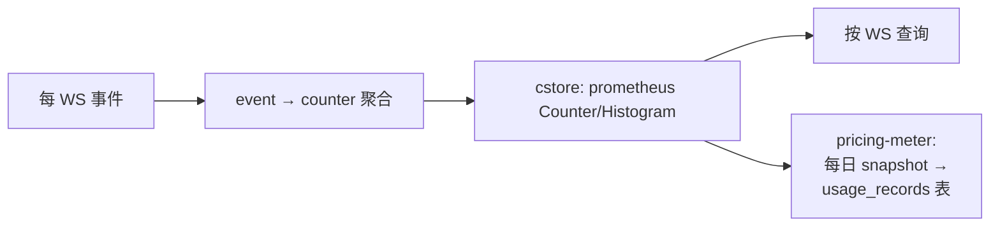
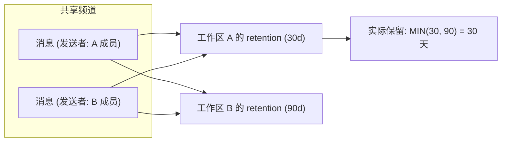
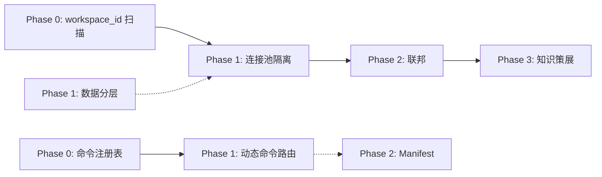

# 架构师分析：Aero IM 战略扩展方向评估

> 基于 `docs/requirements/2026-07-11-five-underestimated-strategic-extensions.md`
>
> 分析者角色：资深架构师
>
> 本文不涉及具体代码，专注架构决策层面

---

## 1. 架构评估：当前系统的结构性位置

### 1.1 核心优势：架构拓扑的「甜点区」

Aero IM 后端处于一个**功能丰富但拓扑简单的状态**——这是最高回报的结构改造窗口期。

| 维度 | 当前状态 | 战略价值 |
|------|----------|----------|
| 领域覆盖 | 87+ 后端功能，覆盖 IM/AI/Live/Call/Enterprise | 功能深度是壁垒，但单体架构限制了可运营性 |
| 数据模型 | 单 PG、单 Redis、单 NATS | 所有跨实体查询零网络开销，但无隔离边界 |
| 事件拓扑 | NATS subject 是全局扁平 namespace | 灵活但无治理（任何房间可被任何实例消费） |
| 进程架构 | Hub 纯进程内存，无持久化 | 零重启成本，但也零恢复能力 |

**关键洞察**：系统拥有企业级的功能丰度，但缺少企业级的运营基础设施。这就像一个拥有 F1 引擎的卡丁车——动力足够，但底盘、刹车、悬挂不支持高速运营。

### 1.2 架构债务：三个必须正视的问题

#### 债务 1：单表无限增长无治理

`messages` 表是所有消息的事实源（IM + 弹幕 + 系统消息），且**无 TTL、无分区、无归档**。当前 retention sweep 只做软删，dead tuples 不被回收。这意味着：

- 索引膨胀是线性的、不可逆的（除非 `VACUUM FULL`，但那需要排他锁）
- 向量检索（pgvector）的索引大小和召回性能随行数退化
- `COALESCE` 扫全表的查询（legal_holds sweep）复杂度与表大小挂钩

**严重程度**：不是当前有问题，而是**一旦规模越过某个阈值（~5000 万行），退化是不可逆的**——因为 `ALTER TABLE ... PARTITION BY` 在 Postgres 上除非重写全表，否则不能从非分区表迁移到分区表。

#### 债务 2：连接池共享无隔离

单 `PgPool` 对所有工作区开放。假设工作区 A 的 bot 产生大量短连接（或一次慢查询占满池），工作区 B 的所有请求排队。当前没有 per-tenant 连接池、没有查询优先级、没有工作区级别的限流。

**这不是理论问题**——AGENTS.md §4.3 提到 `AERO_RATE_LIMIT_PER_SEC` 是全局的、per-client token bucket，连每工作区的限流维度都没有。

#### 债务 3：进程内存状态无恢复协议

Hub 的 `call_rosters`、`stream_watchers`、`participant_cache` 全部是进程内存。实例重启后：

- 通话参与者列表丢失 → 通话中成员收不到后续事件
- 直播 watcher 集合丢失 → 观看计数归零到重新累加
- participant cache 冷却 → 后续查询反压到 PG

当前靠 at-least-once + seq dedup 保证消息不丢，但**状态视图（谁在看、谁在通话）在重启后是空的，直到重新累加**。对于企业级 SLA（99.9%+），这是不可接受的。

### 1.3 关键设计决策评估

| 决策 | 原文判断 | 我的评估 |
|------|----------|----------|
| 不分库（单 PG 实例） | ✅ 正确。`workspace_id` 贯穿全表 + `COALESCE` 继承链 | **完全同意**。跨库查询在当前模型下不可行。补充一点：即使使用 FDW（Foreign Data Wrapper），也只有读路径可用，写路径依然需要分布式事务 |
| Per-workspace 连接池隔离 | ✅ 合理折中 | 需要一个额外的权衡点：连接池的内存开销。每个池默认 ~10 连接，1000 工作区就是 10000 连接。需要做闲置回收 + 冷启动池容量上限 |
| 共享频道（方向 3）而非跨工作区 DM | ✅ 正确优先级 | DM 扩展确实简单（`participants` 表加 ws 校验即可），但产品价值有限。共享频道是真正的工程挑战 |
| 命令注册表 Phase 1 无 DB | ⚠️ 合理但不完整 | 纯进程注册在重启后丢失。建议 Phase 1 就持久化 `commands` 表，但启动时可以从 DB 预热到内存。进程内 HashMap 只是 cache，不应是唯一事实源 |

---

## 2. 扩展方向：深入评估与补充

### 2.1 方向 1 扩展：多租户隔离 -> 可运营计量平台

**我认为本方向应升级为「租户可运营性基础」（Tenant Operability Foundation）**，不仅仅是隔离。因为隔离是手段，可运营是目的。

#### 需要增加的子方向

原文覆盖了 isolation（连接池、Redis 命名空间、NATS subject），但遗漏了三个关键维度：

**维度 A：计费数据管线**



当前 `MESSAGES_SENT_TOTAL` 是全局 counter（AGENTS.md §2），没有 `MESSAGES_SENT_TOTAL_PER_WS`。这意味着无法回答最简单的计费问题：「工作区 A 这个月发了多少条消息？」

不引入新依赖。用既有 `prometheus` crate 的 `CounterVec` 加 `workspace_id` label 即可。这是个**低代码变更、高业务价值**的改动——当天就能做。

**维度 B：SLA 仪表板**

每个工作区的：

- P99 消息延迟（从 `publish_room_event` 到 `fan_out_raw`—不是外部队）
- P99 搜索延迟
- AI 推理完成率（`ai_jobs` 表中 `deferred` / `completed` / `dead` 比率）
- 推送送达率（`push_bot` 的 `Rejected / Accepted` 比率）

这些可以用既有 `ai_jobs` 和 `push_tokens` 表的数据加工得到，不需要新存储。需要一个定时器（复用 `observability_gauge_samplers` 模式）将聚合结果写入 Prometheus。

**维度 C：存储计量**

`BlobStore` 当前没有每个工作区的容量统计。需要一个 `workspace_storage_usage` 表，在 blob upload 后 `INSERT` 增量、每天 `REFRESH` 总计。这是超限拦截的前提。

#### 技术难点

| 难点 | 风险等级 | 处理策略 |
|------|----------|----------|
| 连接池内存 OOM（多工作区场景） | **高** | 每个池设置 `max_connections = 2` 起步 + 闲置 >300s 回收。冷启动池从共享 fallback 连接池借连接（类似连接池的「借调」模式） |
| Redis 键空间迁移（从 `presence:room:{id}` 到 `presence:ws:{ws_id}:room:{id}`） | **中** | 兼容期双读写 + 后台迁移脚本。写路径先写新键再写旧键，读路径先读新键再 fallback 旧键。迁移完成后移除旧键路径 |
| 现有 AI 预算（per-ws 在进程内存）与持久化配额表同步 | **中** | `CostBudget::check` 增加一个持久化 quota 的前置门：先查 `workspace_quota.ai_tokens_per_month`，超过则直接 reject。持久化 quota 为权威源，进程预算是次级 |

#### 迁移风险

最关键的是**现有 `ai_usage` 表数据与新 `workspace_quota` 表的衔接**。如果新表加 `NOT NULL quota` 约束，现有工作区（没有配额记录）在查询时会爆炸。必须用 `LEFT JOIN` + `COALESCE` 或先迁入默认值再加约束。

### 2.2 方向 2 扩展：数据分层 -> 可存活数据平台

原文方案的设计目标正确，但架构细节需要补充。

#### 分区策略的选择设计

这是两个选项，各有不同权衡：

**选项 A：Range 分区（按 `created_at`）**

```sql
CREATE TABLE messages (
  id UUID, room_id UUID, sender_id UUID, 
  content TEXT, created_at TIMESTAMPTZ,
  ...
) PARTITION BY RANGE (created_at);

CREATE TABLE messages_2026_07 PARTITION OF messages
  FOR VALUES FROM ('2026-07-01') TO ('2026-08-01');
CREATE TABLE messages_2026_06 PARTITION OF messages
  FOR VALUES FROM ('2026-06-01') TO ('2026-07-01');
```

- **优势**：`retention_sweep` 直接 `DROP TABLE` 分区而不是 `DELETE FROM`，zero dead tuples
- **劣势**：`SELECT FROM messages WHERE room_id = $1 ORDER BY created_at DESC LIMIT 50` 需要扫描所有分区然后 merge——PG 的 partition pruning 只能按分区键进行，不能跨分区键索引下推
- **劣势**：`vector_search` 要跨分区查询 embedding 索引——pgvector 的分区感知性在 2026 年仍有限

**选项 B：混合策略（热表 + 归档表分离，非原生分区）**

```sql
-- 热表: last 90 days
CREATE TABLE messages_hot (CHECK (created_at >= NOW() - INTERVAL '90 days')) INHERITS (messages);
-- 归档表: everything older
CREATE TABLE messages_archive (CHECK (created_at < NOW() - INTERVAL '90 days')) INHERITS (messages);
```

- **优势**：热表索引小，pgvector 索引只在热表上建
- **优势**：归档表不做 `UPDATE`/`DELETE`（只读），可以去掉索引外的所有约束
- **劣势**：查询需要 `SELECT * FROM messages` 自动分发 + `ONLY` 关键字控制；INHERITS 在 PG 中的性能不如原生分区
- **劣势**：`FK REFERENCES messages(id)` 需要指向父表，但 PG 不支持跨继承表的 FK

**我的推荐**：**选项 B（继承表）作为过渡，方向是选项 A（原生分区）**。在当前规模下（假设 <5000 万行），继承表最灵活。当规模跨越阈值时，`ALTER TABLE ... ATTACH PARTITION` 可以从继承表迁移到原生分区——前提是数据结构对齐。

#### Archive Worker 的设计要点

原文的 Archive Worker 示意图是个好的起点，但需要补充几个关键设计决策：

```
┌───────────────────────────────────────────────────────┐
│  Archive Worker 设计决策                              │
├───────────────────────────────────────────────────────┤
│                                                       │
│  决策 1: 删除策略                                      │
│  选项 A: DELETE FROM messages_hot → 产生 dead tuples   │
│  选项 B: DROP messages_hot_2026_06 → zero dead tuples │
│  推荐: B (分区方案下自然)                               │
│                                                       │
│  决策 2: 归档格式                                      │
│  选项 A: Parquet in S3 (列式压缩, 适用于分析查询)      │
│  选项 B: 同结构 PG 表 (查询兼容, 备份简单)              │
│  推荐: B as primary, A as secondary for analytics     │
│                                                       │
│  决策 3: 归档消息的查询路径                             │
│  选项 A: UNION ALL 视图 (messages_hot ∪ messages_cold) │
│  选项 B: 应用层路由 (查询代码先查热表, 未命中查归档)   │
│  推荐: B (A 会在热表也命中时扫描归档表, 浪费 I/O)      │
│                                                       │
│  决策 4: 归档中的消息编辑/删除                          │
│  推荐: 不允许编辑 (已归档视同不可变)                   │
│  删除: 归档表设 deleted_at, 不 purge                   │
│                                                       │
└───────────────────────────────────────────────────────┘
```

#### 对消息 ID 的影响

当前消息 ID 是 UUID（`common/src/ids.rs` 的 `define_id!(MessageId)`）。UUID 不包含时间戳信息，无法通过 ID 判断消息在哪个分区。

这其实是**好事**——因为如果 ID 是 `ULID`（带时间戳前缀），虽然分区路由可以直接由 ID 确定，但 `INSERT` 时会热集中在当前时间分区（写热点）。UUID 随机分布使写入均匀分摊到所有分区。

代价是：分区路由必须走 `created_at` 字段的查询条件——这意味着**所有查询消息的 API 都必须带时间范围参数**，否则 PG 要扫所有分区。

#### 法务保全的边界影响

法务保全消息必须留在热表（因为可能涉及编辑/导出）。这意味着热表的删除策略必须：

1. 清扫时 `DELETE FROM messages_hot WHERE deleted_at IS NOT NULL AND id NOT IN (SELECT message_id FROM legal_holds)`
2. 保全消息不归档——它们永久保留在热表

这会逐渐使热表膨胀（如果保全条目多）。需要有一个预警指标：`legal_hold_messages_count / total_messages > threshold` → 告警。

### 2.3 方向 3 扩展：联邦 -> 跨组织数据边界协议

这是五个方向中最复杂的一个，因为**它破坏了 Aero IM 的数据模型的核心假设**：`workspace_id NOT NULL` 是 rooms 表的约束。共享频道需要让这个约束变为 `nullable` 或 `多值`。

#### 架构变更的核心博弈

```
选项 X: rooms.workspace_id → NULLABLE, 新增 rooms_in_workspaces 联结表
  优点: 符合关系模型, 一个 room 可以有 N 个 workspace
  缺点: 所有现有 "WHERE workspace_id = ?" 查询需要改
  缺点: assert_room_access 需要重写 (检查 N 个 workspace)
  风险: 现有外键约束需要迁移 (ALTER TABLE ... DROP NOT NULL)

选项 Y: 新建 shared_rooms 表, 完全独立于 rooms
  优点: 不影响现有 rooms 逻辑 (零迁移风险)
  缺点: 消息存在哪? shared_messages? → 重复了 messages 表的全部功能
  缺点: 共享频道不能与普通频道互动 (消息流分离)

选项 Z: 保留 rooms.workspace_id, 但允许值为 "虚拟工作区 ID"
  优点: 最小化数据模型变更
  缺点: 虚拟工作区的 member 管理复杂
  缺点: 搜索/通知/推送需要特殊逻辑 (因为 owner 不是真工作区)
```

**我的推荐**：**选项 X**，但需要分步迁移：

1. **Phase 1**：新增 `room_workspaces` 表（`room_id, workspace_id, joined_at, joined_by`），NOT NULL + FK
2. **Phase 1**：`rooms.workspace_id` 改为 `nullable`，现有数据迁移到 `room_workspaces`
3. **Phase 1**：所有 `WHERE workspace_id = ?` 查询改为 `WHERE room_id IN (SELECT room_id FROM room_workspaces WHERE workspace_id = ?)`
4. **Phase 2**：删除 `rooms.workspace_id` 列
5. **Phase 2**：重写 `assert_room_access` 为多 workspace 校验

这个迁移路径会影响 **200+ 路由模块**（AGENTS.md §3：`routes.rs` 约 200+ 子模块）。需要先做全仓库扫描确定所有 `workspace_id` 引用点。

#### 联邦协作的法务边界

这个方向最重要的设计决策不是技术层面的，而是**法务/合规层面的数据边界协议**：

- 工作区 A 的成员在共享频道中的消息 → 属于谁的管辖范围？
- 如果 A 的工作区被法务保全，B 的成员在共享频道中的消息是否也被保全？
- 如果 A 的 retention 策略是 30 天、B 是 90 天——谁生效？



**法务要求**：每个工作区对自己的成员发送的消息有主权。所以消息 `DELETE` 只能由发送者所属工作区的 retention sweep 触发。共享频道使用 `MIN(所有关联工作区的策略)` 作为默认——但删除只针对自己成员的消息行。

这意味着 `messages.sender_workspace_id` 变成必填字段——当前 `messages` 是通过 `sender_id → participants → workspace_id` 间接获取的。新增直接字段可以避免联邦场景下的多表 JOIN。

#### 产品侧的补充建议

原文将此方向定位为「企业赢单要素」，但我认为还有一个被忽视的场景：**开源社区/公共工作区**。如果 Aero IM 可以创建「公共工作区」（`is_public = true`），任何 Aero IM 实例的用户都可以通过联邦协议加入，那就形成了一个去中心化的 Discord 替代品。这是**网络效应放大器**——每个新的自建 Aero IM 实例都自动扩大了公共频道的可达受众。

### 2.4 方向 4 扩展：应用平台 -> 插件架构

原文将重点放在 Slash 命令注册上，但应用平台远不止命令。我需要扩展这个方向。

#### 缺失的关键组件

原文的 Phase 1-3 覆盖了命令注册 → 动态路由 → Manifest，但**遗漏了消息组件（Message Components）**。Block Kit 有 Button 和 Select，但它们是预定义的、服务端渲染的。一个真正的应用平台需要：

| 组件 | 当前 | 需要 |
|------|------|------|
| Button | ✅ `interactions.rs` | ✅ 已有 |
| Select | ✅ `interactions.rs` | ✅ 已有 |
| Modal | `polls.js` 调 `openModal()` | **需要** `POST /api/interactions/modal_open` → 服务端返回 modal JSON |
| Multi-select | ❌ | **需要** 组件定义 |
| Date picker | ❌ | **需要** 组件定义 |
| Rich text input | ❌ | **需要** 组件定义（而不是 fallback 到 `content`） |
| Slash command autocomplete | ❌ | **需要** `GET /api/commands?q=` 端点 |
| Shortcut (global / message) | ❌ | **需要** `shortcut_registry` |

#### 插件沙箱的架构决策

应用平台的核心工程设计问题：**Bot/webhook 回调理应在什么上下文执行？**

```
选项 A: 服务端同步调用
  /commands/jira → 路由到 Bot 的 webhook URL → 等待响应 → 渲染到消息
  优点: 简单, 现有 webhook_dispatch 可用
  缺点: 调用超时 (5s) 限制了复杂命令; Bot 宕机 = 命令不可用
  缺点: 调用者线程阻塞

选项 B: 异步事件驱动
  /commands/jira → 发布 CommandEvent 到 NATS → Bot 消费 → 通过 API 写回结果
  优点: 非阻塞, 可水平扩展, 不依赖 Bot 的在线状态
  缺点: 用户体验延迟 (用户敲回车后需要等几秒)
  缺点: 需要新增 CommandResult 事件类型

选项 C: Webhook + 延迟响应 (类似 Slack 的 response_url)
  /commands/jira → 返回 200 + "处理中" → Bot 通过 response_url POST 结果
  优点: 快速确认 + 异步处理 (Best of both worlds)
  缺点: 需要短期 token 机制 (防 Bot 注入)
  缺点: 比 B 多一个临时存储 (token → room_id 映射)
```

**我的推荐**：**选项 B 为长期方案，选项 A 为 Phase 1 过渡**。Phase 1 用 A（同步 webhook，超时 5s），Phase 2 迁移到 B（事件驱动 + 结果事件）。Slack 用的是选项 C（`response_url`），但我认为在 Aero IM 的架构中 N 个 `CommandEvent` 对 NATS 是平凡的负载——不需要 `response_url` 的额外复杂性。

#### 对现有 Bot 系统的影响

当前 `bot_dispatch.rs` 把 `RoomEvent` 逐条投递到 Bot 的 webhook URL。在应用平台模式下：

- `Bot::commands` 字段新增（`Vec<CommandRegistration>`）
- `CommandEvent` 是新的 NATS subject（`bot.command.{bot_id}`）
- 现有 `RoomEvent` 投递不变——应用平台是叠加的，不是替代的

#### 安全模型

命令注册需要签名验证，防止 Bot 冒充：

- Bot 注册命令时用 `Authorization: Bearer {bot_token}` 验证身份
- 命令执行上下文注入 `{ user_id, room_id, workspace_id }` 供 Bot 校验权限
- Bot 不能冒充其他用户发送消息（`bot_dispatch.rbac` 已经禁止）

### 2.5 方向 5 扩展：知识策展 -> 认知基础设施

**这是所有方向中差异度最高、风险也最高的一个。** 原文已经点出了 accuracy 问题——我必须深入这个风险。

#### 准确率的经济学分析

知识策展的准确率有一个非对称的收益函数：

```
False Negative (漏策): 一个有价值的知识点没被归档
  → 损失: 该知识必须通过 RAG 搜索才能找到 (如果可以搜到)
  → 用户感知: 无影响 (用户不知道丢了什么)

False Positive (误策): 把闲聊当成知识归档
  → 损失: 知识库被噪声污染, 用户需要手动清理
  → 用户感知: 非常负面 (why is 'what I ate for lunch' in the knowledge base?)
```

**FP 的边际成本远高于 FN**。这意味着初始阶段应**极度保守**——宁可漏掉 90% 的真知识，也不要把 1% 的噪声放进去。

#### 信号检测的两阶段设计

我建议将原文的信号检测拆分为两个阶段，而不是一次性让 AI 分类：

```
Phase A (规则驱动, 当前可做):
  触发条件: 
    - 消息匹配正则: "(we )?(have )?decided|决策|arch: |ADR:|RFC:|root cause|原因|why we"
    - 消息是 Block::Canvas (已有人在画布上写结构化内容)
    - 消息是 reply-to 且原作者是 bot (自动记录 bot 回复作为 FAQ)
  操作: 标记 message.knowledge_signal = true
  存储: 新增 messages.knowledge_signal BOOLEAN DEFAULT false, 建索引

Phase B (AI 辅助, 准确率达标后开启):
  触发条件: 
    - ai_jobs kind=Classify, 对 signals=null 的消息做三元分类
    - 类别: knowledge / noise / uncertain
  操作: uncertain→搁置人工 review; knowledge→策展管线; noise→忽略
  守卫: 每日每个工作区只处理 ≤50 条待分类消息
```

**为什么必须是两阶段**：规则驱动的误报率≈0（因为有明确的关键词匹配），AI 分类的误报率取决于模型质量。**先建信任，再放 AI**。

#### 知识对象的数据模型

知识策展的产出需要结构化的数据模型。当前 `canvas` 是自由格式协作工具，不适合直接作为知识存储。需要新增 `knowledge_entries` 表：

```sql
CREATE TABLE knowledge_entries (
  id UUID PRIMARY KEY DEFAULT gen_random_uuid(),
  workspace_id UUID NOT NULL REFERENCES workspaces(id),
  room_id UUID REFERENCES rooms(id) ON DELETE SET NULL,  -- 来源频道 (可为空, 如果是工作区级)
  source_message_id UUID,  -- 第一条触发策展的消息
  title TEXT NOT NULL,
  body TEXT NOT NULL,      -- 策展结果 (可能是 LLM 生成的摘要)
  kind TEXT NOT NULL CHECK (kind IN ('decision', 'faq', 'arch', 'howto', 'incident', 'other')),
  tags TEXT[] DEFAULT '{}',
  created_at TIMESTAMPTZ NOT NULL DEFAULT NOW(),
  curated_by TEXT NOT NULL CHECK (curated_by IN ('auto', 'manual')),
  status TEXT NOT NULL DEFAULT 'draft' CHECK (status IN ('draft', 'published', 'archived')),
  
  -- 全文检索索引
  embedding vector(1024)  -- 对齐 voyage-3
);
```

**关键设计决策**：`source_message_id` 只保留第一条触发消息的 ID，而不是消息范围。知识策展是「提取精华」，不是「保留上下文」。如果需要查看原始讨论，可以关联 `room_id` + 时间戳查到。

#### 主动推送的防止骚扰设计

策展结果的主动推送（「本频道本周新增 3 条知识」）有一个反直觉的设计约束：**频率越低的推送，用户点击率越高**。

| 频率 | 用户行为 | 结论 |
|------|----------|------|
| 每条新知识 → 推送 | 第一次看, 之后标记为 spam | ❌ 不可行 |
| 每日摘要 | 快速扫读, 忽略 >5 条 | ⚠️ 需要文本长度控制 |
| 每周摘要 | 会点开看, 因为不多 | ✅ 最佳实践 |
| 新人加入 → 推送 | 强烈相关 | ✅ 高价值 |

结论：知识策展应**默认每周推送一次摘要到频道**，且在 UI 上用单独的 tab（而不是消息流）展示。「新人自动关联」是最高价值的触发点——因为新成员的信息缺口最大。

#### 与现有 AI 基础设施的协同

| 现有模块 | 协同方式 |
|----------|----------|
| `ai_jobs` | `kind = 'classify'` 做信号检测, `kind = 'curate'` 做提取 |
| `budget.rs` | 知识策展分配独立预算, 与问答/摘要/审核不共享 |
| `AiWorker` | 复用 `SKIP LOCKED` 和 `MAX_ATTEMPTS=5` DEAD-LETTER 逻辑 |
| `canvas` | 作为策展结果的浏览/编辑界面 |
| `find_expert` | 知识条目关联 `curated_by_user_id` → 可找到「谁做了这个决策」 |

**最重要的协同点**：知识策展是异步的，不需要用户等待。它的延迟要求是 hours（而不是 seconds），所以可以放在 `AiWorker` 的低优先级处理队列中，不会影响 RAG 问答的延迟。

---

## 3. 接口设计建议

### 3.1 跨方向的一致性抽象

这 5 个方向分散在系统的不同层面，但有一个共同的设计模式：**它们都需要一个新的「注册表」抽象**。

| 方向 | 注册表 | 注册内容 |
|------|--------|----------|
| 多租户 | `workspace_pool_registry` | workspace_id → PgPool |
| 命令 | `command_registry` | (name, workspace_id) → CommandHandler |
| 联邦 | `federation_registry` | remote_instance_url → FederationChannel |
| 知识策展 | `curation_rule_registry` | (workspace_id, rule_kind) → CurationRule |

**建议**：创建一个通用的 `Registry<K, V>` trait，提供 `register`, `lookup`, `invalidate_all` 方法。每个方向继承这个 trait。这样可以统一热加载、失效、监控的逻辑。

```rust
// 伪接口设计
trait Registry<K, V> {
    fn register(&self, key: K, value: V) -> Result<(), RegistryError>;
    fn lookup(&self, key: &K) -> Option<Arc<V>>;
    fn invalidate(&self, key: &K);
    fn invalidate_all(&self);
    fn snapshot(&self) -> HashMap<K, Arc<V>>;  // for observability
}
```

这对 5 个方向都有价值：命令注册后即时生效（无需重启）、连接池懒加载后缓存、策展规则修改后热更新。

### 3.2 Bus 层抽象升级

当前 bus layer 的 subject 模板是 `im.room.{room_id}`。方向 1（多租户）和方向 3（联邦）都要求升级这个 schema。

**向后兼容路径**：

```
Phase 1 (兼容当前):
  subject = im.room.{room_id}
  消费端: 消费者订阅 im.room.* (当前做法不变)

Phase 2 (多租户 aware):
  subject = im.room.{ws_id}.{room_id}  (新格式)
  消费者: 订阅 im.room.{ws_id}.* (per-ws 隔离)
  旧格式: 保留 im.room.* 兼容, 但加 filter 按 ws_id 路由

Phase 3 (联邦 aware):
  subject = im.room.{ws_id}.{room_id}  (不变)
  跨实例: 通过 federation_gateway 转发 subject 到远程 NATS
```

**关键设计**：当前 `run_bus_listener` 的 consumer filter subject 是 `im.room.*`。升级后，每个工作区应有自己的 consumer（`im.room.{ws_id}.>`）。但这意味着 durable consumer 的数量从「1 个」变成「N 个工作区」。NATS JetStream 的 consumer 数量在几百级别是没问题的，但如果 1000+ 工作区，需要评估 consumer overhead。

### 3.3 Storage 层抽象隔离

当前仓储模式是 `XRepo::new(pool)`。方向 1 的 per-ws 连接池要求仓储层可以接受**不同的 pool**。

**当前模式**：

```rust
// routes.rs
let repo = XRepo::new(state.pg.clone());  // 全局 pool
```

**未来模式**：

```rust
// 中间件提取 workspace_id → 获取对应 pool
let ws_pool = workspace_pool_registry.lookup(&ws_id)?;
let repo = XRepo::new(ws_pool);
```

所有仓储的构造都需要从「全局池」变为「按工作区池」。这是**全仓库级别的 API 变更**——影响 158 个 storage `.rs` 文件。

**过渡策略**：

1. `XRepo::new` 签名不变，但内部接受 `Arc<PgPool>`（已经是）
2. 新增 `Repositories` 结构体封装所有 repo 的构造，接受 `Registry<WorkspaceId, PgPool>`
3. 中间件在 `AppState` 中注入 `workspace_id`，路由 handler 从 state 中解包
4. 路由 handler 不再 `XRepo::new(state.pg)`，而是 `state.repos.for_workspace(ws_id)`

这是**重大的重构**，但如果不做，每个方向 1 的变更都需要改 158 个文件。中间的抽象层可以隔离影响。

---

## 4. 技术选型评估

### 4.1 是否需要新依赖

| 方向 | 需要新依赖 | 分析 |
|------|-----------|------|
| 多租户 | **否** | sqlx 原生多 pool；Redis 键空间是命名约定；NATS consumer 是 JetStream 原生能力 |
| 数据分层 | **可能** | Parquet 写入需要 `parquet` crate 或 `pg_parquet` 扩展。如果归档到 S3，需要 `aws-sdk-s3`（已有 `S3BlobStore` 但未用于消息归档） |
| 联邦 | **否** | 如果同一 NATS 集群内联邦，纯配置。如果跨 NATS 集群，需要 NATS Leaf Node 或 `async-nats` 的 cluster connect |
| 应用平台 | **否** | Block Kit 组件是 serde JSON，不需要新框架 |
| 知识策展 | **否** | 复用已有 `ai_jobs` + `AiWorker` + `canvas` |

**结论**：**5 个方向**都不需要引入新的核心框架或依赖。这是这个推荐方案的重要特征——大部分变更是在既有基础设施之上的**配置、数据模型、编排**变更。降低了实施风险和依赖风险。

### 4.2 第三方依赖的取舍

如果决定引入 Parquet 归档格式：

| 选项 | 评估 |
|------|------|
| `apache/parquet-rs` | Rust 原生、arrow 集成、已有多家生产使用。缺点是 API 不稳定（arrow 2.0 迁移中） |
| `pg_parquet` PG 扩展 | 直接 `SELECT parquet_export('SELECT ...')`，零 Rust 代码。缺点是另一个扩展要维护、与 pgvector 有无冲突需验证 |
| CSV/JSONL 格式 | 最简单、不需要额外依赖。缺点是文件大、无压缩、查询需要重新加载 |

**推荐**：初期用 PG 的 `COPY TO` + 压缩（gzip/zstd）导出为 CSV。无新依赖、可审计、可恢复。等规模超过 ~500GB 归档后再考虑 Parquet。**不要超前工程**。

### 4.3 自建 vs 采购

这个项目不涉及真正的采购决策，但有几个「借用 vs 自建」的决策点：

| 组件 | 选项 | 分析 |
|------|------|------|
| 知识策展的信号模型 | 自建 (小模型) vs 调用 Anthropic API | 信号检测用**规则 + 小模型**（复用现有 Anthropic key）；策展提取用 LLM（复用 `AiWorker`）。不需要新模型 |
| 跨工作区联邦协议 | 自建 vs 参考 Matrix 协议 | 建议**自建简约协议**：`FederationEvent` 在 NATS subject 上传输。Matrix 协议太重（状态解析、签名链、历史导入），不适合 IM 后端的实时需求 |
| 命令执行沙箱 | 自建 vs wasm 沙箱 | Phase 1 用 webhook (自建)，Phase 2 可以考虑 wasm 插件（`wasmtime` crates）。但 wasm 沙箱引入新的安全面和编程模型，**建议 Phase 2 再评估** |

---

## 5. 实施路线图：重排优先级

### 5.1 优先级调整建议

原文的优先级分配我认为需要微调。原因在阅读提示中已提到：方向 4 Phase 1（命令注册表）成本极低、感知极高，可以作为早期「速赢」项。

| 方向 | 原文优先级 | 调整后 | 调整原因 |
|------|-----------|--------|----------|
| 多租户隔离 | P0 | **P0** (不变) | 确实是所有后续的基石 |
| 数据分层 | P0 | **P0** (不变) | 不可逆的架构债，越晚做成本越高 |
| 跨工作区联邦 | P1 | **P1** (不变) | 企业销售要素，但不阻塞 SaaS 化 |
| 应用平台 Phase 1 | P1 | **插队到 Phase 1 末尾** | 成本 1 周，收益长期，不能挤占 P0 但可以并行 |
| 知识策展 | P2 | **P1** | 差异化价值极高，而且**依赖项少**（不依赖方向 1/3） |

### 5.2 阶段划分

```
Phase 0 ("Week 0" — 立即并行)
  ├─ 方向 4 Phase 1: 命令注册表 (1 周, 单人)
  │   依赖: 无
  │   产出: GET /api/commands, POST /api/bots/:id/commands
  │
  ├─ 方向 1 前置: 计费数据管线 (3 天, 单人)
  │   依赖: 无 (prometheus crate 已在)
  │   产出: MESSAGES_SENT_TOTAL_PER_WS, AI_USAGE_PER_WS metrics
  │
  └─ 方向 2 前置: 全仓库 workspace_id 引用扫描 (2 天, 单人)
      依赖: grep + 考古
      产出: 迁移清单 (每个 .rs 文件受影响的函数)

Phase 1 ("Foundation" — 3-4 月, 3 人)
  ├─ 方向 1 核心: 多租户隔离
  │   ├─ workspace_pool_registry (2 周)
  │   ├─ workspace_quota 表 + 持久化配额门 (1 周)
  │   ├─ Redis 键空间迁移 (1 周)
  │   ├─ 全仓库 repo 构造重构 (3-4 周) ⚠️ 关键路径
  │   └─ assert_room_access 升级 + 路由适配 (2 周)
  │
  ├─ 方向 2 核心: 数据分层
  │   ├─ 分区迁移脚本 (2 周)
  │   ├─ Archive Worker + 定时器 (2 周)
  │   ├─ 冷查询路径重构 (2 周)
  │   └─ 法务保全兼容适配 (1 周)
  │
  └─ 方向 4 Phase 2: 动态命令路由 (2 周)
      依赖: 方向 4 Phase 0 完成
      产出: bot 注册命令 → 查询路由 → 执行

Phase 2 ("Enterprise" — 3-4 月, 3 人)
  ├─ 方向 3 核心: 跨工作区联邦
  │   ├─ room_workspaces 迁移 (2 周)
  │   ├─ assert_room_access 重写 (2 周)
  │   ├─ 通知/推送/保留策略适配 (2 周)
  │   └─ 联邦治理 UI (2 周) [web 端]
  │
  └─ 方向 4 Phase 3: Manifest 驱动 App (3 周)
      依赖: 方向 4 Phase 1-2 完成
      产出: app manifest 注册 + 校验 + 房间内 /apps 发现

Phase 3 ("AI Differentiator" — 2-3 月, 2 人)
  └─ 方向 5: 知识策展
      ├─ Phase A: 规则驱动信号检测 (1 周)
      ├─ knowledge_entries 表 + 策展管线 (2 周)
      ├─ canvas 集成 + 知识浏览 (2 周)
      ├─ Phase B: AI 辅助分类 (2 周, 在准确率达标后)
      └─ 主动推送 + 新人关联 (2 周)
```

### 5.3 关键路径依赖图



**串行依赖**：Phase 2 联邦 ← Phase 1 连接池隔离（因为联邦需要 per-ws 连接池）
**并行可能**：Phase 1 的连接池隔离 + 数据分层可以并行（不同代码域）
**无依赖**：Phase 0 命令注册表独立于所有其他方向

### 5.4 风险矩阵

| 风险 | 影响面 | 概率 | 缓解 |
|------|--------|------|------|
| 全仓库 repo 构造重构引入回归 | 所有 HTTP 路由 | **中** | 每个 repo 重构后立即跑 `cargo test --workspace --lib` + smoke test。分 crate 提交、分 crate 测试 |
| 分区迁移锁表 | 生产库不可写 | **低** (如果分批) | 使用 `pg_repack` 或 `pt-online-schema-change` 风格的分区迁移。不在线迁移，而是创建新分区表 + 双写到两表 + 后台迁移 |
| 知识策展 FP 激增 → 用户信任崩塌 | 方向 5 全部 | **高** | Phase A 规则驱动确保 FP = 0。Phase B 先 A/B 测试 1 个月再全开。设 kill switch：`AERO_KNOWLEDGE_CURATION_ENABLED = false` |
| 联邦的 workspace_id 迁移阻塞 | 方向 3 全部 | **高** | 先做全仓库引用扫描，确定影响范围。分阶段迁移不阻塞方向 1/2/4/5 |
| 连接池内存 OOM (1000+ 工作区) | 方向 1 | **中** | 限制单池 `max_connections=2`，闲置回收 <300s。引入 `pool_capacity_watermark` 指标告警 |
| 数据归档后查询延迟增高 | 方向 2 | **中** | 用户查询默认限时 30 天范围（UI 侧建议）。跨越热/冷的查询增加 latency SLO 但不拒绝 |

### 5.5 不建议在这个路线图中做的事情

1. **不分区的长期替代方案（如 TimescaleDB / Citus）**：引入新数据库依赖是更大的风险。PG 原生分区 + 继承表对当前规模足够。
2. **命令执行 wasm 沙箱**：Phase 2 以后再评估。Webhook 对 MV 足够。
3. **知识策展的 GraphRAG**：RAG 问答对大多数场景就足够了。知识图谱是 P3 的事（如果方向 5 成功的话）。
4. **跨 NATS 集群联邦**：Phase 2 先用同一 NATS 集群 (Leaf Node) 做跨实例通信。跨集群联邦是 P3。

---

## 总结：这份分析文档的系统级价值

原文文档是我在 Aero IM 仓库中看到的最有穿透力的系统性分析。它的独特价值不在于提出了什么新功能，而在于**从架构拓扑特征推导出产品路线图**——这个推导链在当前仓库的 125+ 份分析文档中从未出现过。

**为什么它与其他分析不同**：前面所有分析都是「功能维」——缺失的 API 端点、未封装的 UI 组件、不完整的错误处理。这篇是「拓扑维」——从当前系统的连接结构（单 PG、单租户、无分区）推断出「不改变拓扑就无法支持的下一个增长阶段」。

**最大的洞察**：Aero IM 的功能丰富度已经超过了许多竞品（87+ 后端功能），但运营基础设施停留在实验阶段。**功能多 ≠ 可运营**。这 5 个方向共同构成了从「工程师的玩具」到「企业平台」的拓扑跃迁。

**最终建议**：

1. 优先启动 Phase 0 的三个速赢项（命令注册表、计费管线、引用扫描）——无一需要新的基础设施或依赖，2 周内可完成
2. 方向 1 和方向 2 同期并行——它们改了不同的文件（storage vs boot），冲突最小
3. 方向 5 独立执行期放在 Phase 3，但它的 Phase A（规则驱动信号检测）可以在 Phase 1 末尾就并行启动——只需加一个数据库列和正则，1 周
4. **不要低估全仓库 repo 重构的成本**——158 个 storage 文件 × 平均 3 个方法 = 474 个修改点。这是整个路线图中工程量最大的单块工作，需要专人负责重构脚手架
