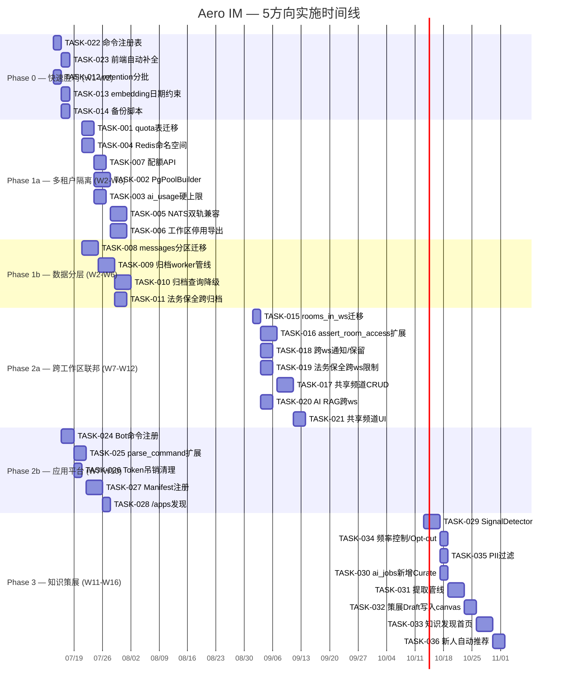

# Tech Lead 分析：5 个被低估的战略扩展方向

## 写在前面

本文档所分析的 `docs/requirements/2026-07-11-five-underestimated-strategic-extensions.md` 是我在仓库 125+ 份分析文档中看到的**最系统、最深层的架构级分析**。以下分析将从 Tech Lead 角度，把 5 个方向拆解为可执行任务、识别技术风险、并提供落地路线图。

---

## 1. 任务分解

### 方向 1：多重租户隔离架构

| 任务 ID | 标题 | 涉及文件 | 前置 | 工时 |
|---------|------|---------|------|------|
| TASK-001 | `quota` 表迁移与 `WorkspaceQuotaRepo` | `migrations/NNNN_quota.sql`, `crates/aero-storage/src/quota.rs` | — | 3h |
| TASK-002 | `PgPoolBuilder` 每工作区连接池隔离 | `crates/aero-storage/src/pool_builder.rs`, `crates/aero-server/src/boot/persistence.rs` | TASK-001 | 4h |
| TASK-003 | `ai_usage` 硬上限门（预查 `workspace_quota`） | `crates/aero-ai/src/budget.rs`, `crates/aero-storage/src/ai_usage.rs` | TASK-001 | 3h |
| TASK-004 | Redis 键命名空间加 `ws_id` 前缀 | `crates/aero-storage/src/presence/*.rs`, `crates/aero-storage/src/session.rs` | — | 3h |
| TASK-005 | NATS subject `im.room.{ws}.{rid}` 双轨兼容 | `crates/aero-bus/src/subject.rs`, `crates/aero-server/src/ws/ws_impl/bus.rs` | TASK-002 | 4h |
| TASK-006 | 整工作区停用/导出/删除级联 | `crates/aero-server/src/deactivation.rs`, `crates/aero-storage/src/participant.rs` | TASK-001 | 4h |
| TASK-007 | 配额 API 端点 + 管理 UI | `crates/aero-server/src/quota.rs` (新), `web/admin/quota.js` | TASK-001 | 3h |

### 方向 2：数据分层与不间断运营

| 任务 ID | 标题 | 涉及文件 | 前置 | 工时 |
|---------|------|---------|------|------|
| TASK-008 | `messages` 表分区迁移（`created_at` range） | `migrations/NNNN_partition_messages.sql` | — | 4h |
| TASK-009 | 归档 worker：scan → INSERT → DELETE 管线 | `crates/aero-server/src/boot/archive_worker.rs` (新) | TASK-008 | 4h |
| TASK-010 | 归档消息查询降级（FTS fallback + 热/冷路由） | `crates/aero-storage/src/message/search.rs`, `crates/aero-storage/src/message/archive.rs` (新) | TASK-008, TASK-009 | 4h |
| TASK-011 | 法务保全跨归档边界 | `crates/aero-storage/src/legal_hold.rs`, `crates/aero-server/src/boot/retention.rs` | TASK-009 | 3h |
| TASK-012 | `retention_sweep` 分批处理（batch + cursor） | `crates/aero-storage/src/message/sweep.rs` | — | 2h |
| TASK-013 | `embedding_backfill` 日期范围约束 | `crates/aero-server/src/bin/boot/background.rs` | — | 2h |
| TASK-014 | WAL 归档配置 + 备份验证脚本 | `scripts/`, `config.example.toml` | — | 2h |

### 方向 3：跨工作区联邦协作

| 任务 ID | 标题 | 涉及文件 | 前置 | 工时 |
|---------|------|---------|------|------|
| TASK-015 | `rooms_in_workspaces` 联结表迁移 | `migrations/NNNN_rooms_in_workspaces.sql` | — | 2h |
| TASK-016 | `assert_room_access` 扩展为允许多工作区 | `crates/aero-im-core/src/service/room_access.rs` | TASK-015 | 4h |
| TASK-017 | 共享频道创建/加入/离开 API | `crates/aero-server/src/shared_channels.rs` (新) | TASK-015, TASK-016 | 4h |
| TASK-018 | 跨工作区通知、保留策略冲突解决（取 MIN） | `crates/aero-storage/src/notification.rs`, `crates/aero-server/src/notif_prefs.rs` | TASK-015 | 3h |
| TASK-019 | 法务保全跨 ws 限制（仅本 ws 成员消息） | `crates/aero-storage/src/legal_hold.rs` | TASK-015 | 3h |
| TASK-020 | 共享频道中 AI RAG 检索跨 ws 边界 | `crates/aero-ai/src/workspace_ask.rs`, `crates/aero-storage/src/message/search.rs` | TASK-015 | 3h |
| TASK-021 | 共享频道管理 UI (web) | `web/shared-channels.js` (新) | TASK-017 | 3h |

### 方向 4：应用平台

| 任务 ID | 标题 | 涉及文件 | 前置 | 工时 |
|---------|------|---------|------|------|
| TASK-022 | 命令注册表（进程内 HashMap + GET 端点） | `crates/aero-server/src/commands.rs`, `crates/aero-server/src/command_registry.rs` (新) | — | 2h |
| TASK-023 | 客户端 `/` 自动补全从 `GET /api/commands` 取 | `web/composer.js` | TASK-022 | 2h |
| TASK-024 | Bot 通过 `POST /api/bots/:id/commands` 注册模式匹配 | `crates/aero-server/src/bot_commands.rs` (新) | TASK-022 | 3h |
| TASK-025 | `parse_command` 扩展：hardcoded → registry fallback → 404 | `crates/aero-server/src/commands.rs` | TASK-024 | 3h |
| TASK-026 | Bot token 吊销时级联清理注册命令 | `crates/aero-server/src/bots.rs` | TASK-024 | 2h |
| TASK-027 | Manifest-driven App 注册（验证 + 持久化） | `crates/aero-server/src/app_manifest.rs` (新), `migrations/NNNN_app_manifests.sql` | TASK-024 | 4h |
| TASK-028 | `/apps` 房间内 App 发现列表 | `web/apps.js` (新) | TASK-027 | 2h |

### 方向 5：会话式知识策展

| 任务 ID | 标题 | 涉及文件 | 前置 | 工时 |
|---------|------|---------|------|------|
| TASK-029 | `SignalDetector`：规则匹配 + AI small model 分类 | `crates/aero-ai/src/curation/signal.rs` (新), `crates/aero-ai/src/curation/mod.rs` | — | 4h |
| TASK-030 | `ai_jobs` 新增 `Curate` kind（weight=1） | `crates/aero-ai/src/worker.rs`, `crates/aero-storage/src/ai_jobs.rs` | TASK-029 | 2h |
| TASK-031 | 提取管线：批量汇总信号 → 结构化 ADR/FAQ | `crates/aero-ai/src/curation/extract.rs` (新) | TASK-030 | 4h |
| TASK-032 | 策展结果 Draft 写入 canvas（用户确认后方公开） | `crates/aero-ai/src/curation/publish.rs` (新) | TASK-031 | 3h |
| TASK-033 | 知识发现首页 + 混合搜索排序 | `crates/aero-server/src/knowledge.rs` (新), `crates/aero-storage/src/knowledge.rs` (新) | TASK-032 | 4h |
| TASK-034 | 频道策展频率控制 & Opt-out 开关 | `crates/aero-storage/src/channel_retention.rs` | TASK-029 | 2h |
| TASK-035 | PII 敏感信息过滤 → 跳过策展 | `crates/aero-ai/src/curation/pii_filter.rs` (新) | TASK-029 | 2h |
| TASK-036 | 新成员加入频道时自动推荐相关知识 | `crates/aero-server/src/room_join.rs` | TASK-033 | 3h |

---

## 2. 执行顺序与依赖图

```mermaid
graph TD
    subgraph "Phase 0 — 快速胜利 (2周)"
        TASK022["TASK-022 命令注册表/GET端点"] --> TASK023["TASK-023 客户端自动补全"]
        TASK012["TASK-012 retention_sweep分批"]
        TASK013["TASK-013 embedding_backfill日期约束"]
        TASK014["TASK-014 WAL归档备份脚本"]
    end

    subgraph "Phase 1 — 基础设施 (6周)"
        TASK001["TASK-001 quota表+WorkspaceQuotaRepo"] --> TASK002["TASK-002 PgPoolBuilder"]
        TASK001 --> TASK003["TASK-003 ai_usage硬上限门"]
        TASK002 --> TASK005["TASK-005 NATS subject双轨兼容"]
        TASK002 --> TASK006["TASK-006 整工作区停用导出删除"]
        TASK001 --> TASK007["TASK-007 配额API端点"]
        TASK004["TASK-004 Redis命名空间前缀"]
        
        TASK008["TASK-008 messages分区迁移"] --> TASK009["TASK-009 归档worker管线"]
        TASK008 --> TASK012
        TASK009 --> TASK010["TASK-010 归档消息查询降级"]
        TASK009 --> TASK011["TASK-011 法务保全跨归档"]
    end

    subgraph "Phase 2 — 企业协作 (6周)"
        TASK015["TASK-015 rooms_in_workspaces迁移"] --> TASK016["TASK-016 assert_room_access扩展"]
        TASK015 --> TASK018["TASK-018 跨ws通知/保留策略"]
        TASK015 --> TASK019["TASK-019 法务保全跨ws限制"]
        TASK016 --> TASK017["TASK-017 共享频道CRUD API"]
        TASK017 --> TASK021["TASK-021 共享频道管理UI"]
        TASK015 --> TASK020["TASK-020 AI RAG跨ws"]
        
        TASK022 --> TASK024["TASK-024 Bot命令注册"]
        TASK024 --> TASK025["TASK-025 parse_command扩展"]
        TASK024 --> TASK026["TASK-026 Token吊销级联清理"]
        TASK024 --> TASK027["TASK-027 Manifest驱动App注册"]
        TASK027 --> TASK028["TASK-028 /apps发现列表"]
    end

    subgraph "Phase 3 — AI差异化 (6周)"
        TASK029["TASK-029 SignalDetector"] --> TASK030["TASK-030 ai_jobs新增Curate"]
        TASK029 --> TASK034["TASK-034 频率控制/Opt-out"]
        TASK029 --> TASK035["TASK-035 PII过滤"]
        TASK030 --> TASK031["TASK-031 提取管线"]
        TASK031 --> TASK032["TASK-032 策展Draft写入canvas"]
        TASK032 --> TASK033["TASK-033 知识发现首页+混合搜索"]
        TASK033 --> TASK036["TASK-036 新成员自动推荐"]
    end

    TASK002 -.->|"可并行"| TASK004
    TASK008 -.->|"可并行"| TASK001
    TASK012 -.->|"可并行"| TASK009
    TASK022 -.->|"可并行|独立"| TASK001
    TASK015 -.->|"等待Phase1完成"| TASK017
    TASK029 -.->|"等待Phase2完成"| TASK033
```



### 并行任务组

| 组名 | 任务 | 理由 |
|------|------|------|
| **组A**: 配额基建 | TASK-001, TASK-004, TASK-007 | 表迁移、Redis 命名空间、API 端点互不依赖 |
| **组B**: 数据分区 | TASK-008, TASK-012, TASK-013, TASK-014 | 分区迁移、sweep 分批、backfill 约束、备份脚本独立 |
| **组C**: 快速胜利 | TASK-022, TASK-023 | 命令注册表 + 前端自动补全，2 天可交付 |
| **组D**: AI 信号检测 | TASK-029, TASK-034, TASK-035 | SignalDetector、频率控制、PII 过滤内部并行 |
| **组E**: Phase 2 上层 | TASK-018, TASK-019, TASK-020 | 通知/保留/法务/RAG 在联结表迁移后并行推进 |

---

## 3. 技术风险

### 3.1 高风险项

| 风险 | 影响 | 发生概率 | 缓解策略 |
|------|------|---------|---------|
| **R1**: 分区迁移导致停机 | `ALTER TABLE messages ... PARTITION BY` 在 PG < 17 上是排他锁，亿级表可能分钟级阻塞写 | 中 | 用 pg_repack 或 PT-online-schema-change 式迁移；先在 staging 验锁时长；订维护窗口 |
| **R2**: `PgPoolBuilder` 内存泄漏 | 每工作区独立 pool → 1000 工作区 × 10 idle conn = 10K 连接，PG `max_connections` 爆 | 中 | 硬上限 100 工作区 + 连接池 idle 回收 + 懒初始化（只有首次请求才建 pool）+ 守护线程监控 |
| **R3**: 共享频道 `assert_room_access` 误放 | 如果多工作区场景下漏判一个关联，外部成员看到不该看的消息 | 高 | 扩展守卫为三层：① room 是否跨 ws ② caller 所属的 ws 是否有 room 关联 ③ caller 是 ws 成员。三关全过才放。CI authz_lint 扩展覆盖 |
| **R4**: 知识策展 false positive 导致用户流失 | 把"今天中午吃面"策展为决策 → 用户关闭功能 → 整个方向失败 | 中 | MVP 阶段**只规则匹配**（`we decided`, `decision:`, `arch:`, `ADR:`, `root cause` 等标记性前缀），false positive = 0 后再放 AI 分类 |
| **R5**: 归档消息 + 向量搜索不一致 | 消息迁到冷区后 pgvector 索引失效 → RAG 召回率暴跌 | 中高 | 归档前预计算 embedding 存 `message_archive.embedding` 列；混合搜索分两步：热表 pgvector + 冷表 `<=>` 距离后合并排序 |
| **R6**: 跨工作区 RAG 泄露敏感信息 | WS-A 的机密被 WS-B 的人通过 AI 检索到 | 高 | 严格按照 `participant_messages` 成员 + 每个 room 独立 embedding 隔离；不要跨 room 检索 |

### 3.2 外部依赖风险

| 依赖 | 风险 | 后备 |
|------|------|------|
| PG 分区功能 (`PARTITION BY RANGE`) | PG 11+ 已原生支持，无风险 | — |
| pg_repack 扩展 | 部分托管 PG 不开放安装 | 改用 `CREATE TABLE ... PARTITION` + 双写迁移 |
| 无外部 AI 模型依赖 | 知识策展复用现有 `AiService` + `budget.rs` | 无新增外部依赖 |
| FCM/APNs 推送依赖 | 方向 1/3 不影响推送 | — |

### 3.3 性能瓶颈

| 瓶颈点 | 预计负载 | 优化策略 |
|--------|---------|---------|
| PgPoolBuilder 冷启动 | 每工作区首次请求 +100ms | 预热：启动时拉取活跃工作区列表，批量 init pool |
| 归档 worker `SELECT ... ORDER BY created_at LIMIT 5000` | 每日百万级 | 分区表+索引 `(created_at)`；分批游标 `WHERE created_at > $1` |
| `retention_sweep` 全表扫描 | 亿级表 | 分批 + `WHERE deleted_at IS NOT NULL AND deleted_at < $1 AND created_at < $2 LIMIT 1000` |
| 共享频道通知扇出 | 10 个工作区 × 1000 成员 | 每个工作区独立 NATS subject fan-out，避免单 subject 队列堆积 |

### 3.4 测试难点

| 测试场景 | 难点 | 策略 |
|---------|------|------|
| 分区迁移锁表 | 无法在 CI 模拟亿级表 | `#[ignore]` 集成测试 + 单独的负载测试仓库 |
| 多 pool 连接竞争 | 100 个 pool 同时建立 | 单元测试 `PgPoolBuilder::lazy_init` + `max_pools` 门控 |
| 共享频道并发创建 | 两个工作区同时关联同一 room | `FOR UPDATE` 锁 + 唯一索引 `(room_id, workspace_id)` |
| 归档后 RAG 查询 | 热冷数据混合排序 | 构造模拟数据：热表 1 万行 + 归档 10 万行，验证结果合并 |

---

## 4. 资源评估

### 4.1 人员技能矩阵

| 角色 | 技能要求 | 需要人数 | 负责模块 |
|------|---------|---------|---------|
| **Senior Rust 工程师 A** | 异步 PG / 连接池 / 并发控制 | 1 | Phase 1 核心（pool builder, quota, partition） |
| **Senior Rust 工程师 B** | NATS / 事件驱动 / 总线 | 1 | Phase 1 NATS subject + Phase 2 联邦事件 |
| **Full-stack Rust 工程师 C** | axum / 鉴权 / 路由 / Auth | 1 | Phase 2 共享频道访问层 + Phase 3 知识 API |
| **AI Engineer D** | LLM 编排 / prompt engineering | 1 | Phase 3 策展管线 + RAG 混合搜索 |
| **前端 JS 工程师 E** | vanilla JS / WebSocket / UI | 0.5 | Phase 0 命令补全 + Phase 2/3 管理 UI |

**总计**: 4.5 FTE（前端可兼职）

### 4.2 关键里程碑

| 里程碑 | 时间 | 交付物 | 验收条件 |
|--------|------|--------|---------|
| **M0** | 第 0 周 | 命令注册表 + retention 分批 | `GET /api/commands` 返回列表；`retention_sweep` 日志显示分批 |
| **M1** | 第 2-3 周 | 多租户 pool 隔离 + quota 表建成 | 工作区 A 填满连接池，工作区 B 不受影响 |
| **M2** | 第 4 周 | `messages` 表分区完成 | `EXPLAIN SELECT` 显示 partition pruning |
| **M3** | 第 6 周 | 归档 worker 验证通过 | 归档消息可在 RAG 搜索中降级命中 |
| **M4** | 第 8 周 | 共享频道 MVP | 两个工作区可创建一个共享频道并收发消息 |
| **M5** | 第 10 周 | 应用平台 Phase 2 | Bot 通过 API 注册 `/jira` 命令并处理 |
| **M6** | 第 12 周 | 知识策展 MVP | 含 `we decided` 的消息被提取为 draft canvas |
| **M7** | 第 16 周 | 全功能上线 | 全部 36 任务完成，CI 绿，性能测试通过 |

### 4.3 阻塞点与解决策略

| 阻塞点 | 影响 | 解决策略 |
|--------|------|---------|
| PG 分区迁移排他锁 | Phase 1 timeline 推迟 1-2 天 | 先做 `CREATE TABLE messages_new (LIKE messages INCLUDING ALL) PARTITION BY RANGE (created_at)` + 双写，再切表名 |
| `PgPoolBuilder` 多 pool 测试 | 需要 50+ 工作区压力测试环境 | `docker-compose` 起 10 个 PG 连接模拟 → 确认 `max_pools=100` 门控生效 |
| 共享频道 UI 开发 | 前端人力不足 | 延后到 Phase 2 中期；先 REST API + curl 测试可用 |
| 知识策展 AI 精度 | false positive 导致用户信任崩塌 | MVP 只用规则匹配；行为数据累计 1 个月后再训练分类器 |

---

## 5. 质量保证

### 5.1 单元测试覆盖要求

| 模块 | 最低覆盖率 | 关键测试点 |
|------|-----------|-----------|
| `commands.rs` + `command_registry.rs` | 95% | 注册/反注册/冲突/fallback/404 |
| `pool_builder.rs` | 90% | lazy-init / max pools / idle recycle / fallback |
| `shared_channels.rs` guard | 95% | 多工作区 `assert_room_access` 3 层守卫 |
| `curation/signal.rs` | 95% | 规则匹配（100% 确定性）、PII 过滤、频率控制 |
| `messages/sweep.rs` | 90% | 分批游标正确性、batch size 边界 |
| `archive_worker.rs` | 85% | 事务完整性（INSERT + DELETE 原子）/ 中断恢复 |

### 5.2 集成测试策略

| 场景 | 测试方法 | 环境要求 |
|------|---------|---------|
| 多工作区 pool 隔离 | 模拟 3 个工作区同时请求 → 确认不同 PgPool 实例 | Docker PG |
| 共享频道消息 | 两个工作区的 participant 发消息到同一 room → 双方都收到 | PG + NATS |
| 归档 + 查询 | 归档 5 万条消息 → 混合搜索验证 cold data 降级 | PG（需大量测试数据） |
| 命令冲突 | 两个 bot 注册同名命令 → 后注册 rejected | 只需 Rust 单元测试 |
| 策展管线端到端 | 消息含 `we decided` → 信号检测 → 提取 → canvas Draft | PG + AI（mock AI） |

### 5.3 代码审查要点

| 审查项 | 重点关注 |
|--------|---------|
| `assert_room_access` 扩展 | 三关守卫每一关的短路逻辑：任意一关不满足 → `Forbidden` |
| `PgPoolBuilder` | `Drop` 实现（避免 pool 泄漏）、`Arc<AtomicUsize>` 计数器线程安全 |
| 分区迁移 SQL | `EXCLUDE` 约束是否丢失、`DEFAULT` 分区处理 |
| 归档 worker 事务 | `INSERT INTO archive` + `DELETE FROM messages` 同一事务，失败回滚 |
| 策展 draft 权限 | 只有创建者可以编辑 draft，只有同一工作区管理员可以 publish |
| NATS subject 双轨 | 旧格式 `im.room.{rid}` 必须继续处理，新格式先 `{ws}.{rid}` 后兼容降级 |
| Token 级联清理 | `bot_rotate_token` 调用后确保所有注册命令被 `DELETE` |
| 前端 `/` 自动补全 | `GET /api/commands` 返回为空时 fallback 到本地硬编码列表（防后端宕机无法输入命令） |

### 5.4 性能测试需求

| 测试 | 场景 | 通过标准 |
|------|------|---------|
| PgPoolBuilder 冷启动 | 100 个工作区依次首次请求 | 每工作区 < 150ms |
| 共享频道消息延迟 | 2 ws × 1000 成员 | P95 < 200ms（同单 ws 延迟） |
| 归档 worker 吞吐 | 每天 100K 消息迁移 | < 5 分钟完成日迁移 |
| 命令注册表响应 | 100 个 bot 注册 | `GET /api/commands` < 50ms（纯内存） |
| 策展信号检测 | 每秒 200 条消息 | CPU < 5%（规则模式）/ < 20%（AI 模式） |

---

## 6. 实施计划

### 总时间线：16 周



### 6.1 Phase 0 — 快速胜利（第 1-2 周）

**目标**：2 周内交付可见价值，建立团队 momentum

| 周 | 周一-周三 | 周四-周五 |
|----|----------|----------|
| W1 | TASK-022 命令注册表（2d） + TASK-012 retention 分批（2d） | 集成测试 + PR |
| W2 | TASK-023 前端自动补全（2d） + TASK-013 embedding 日期约束（1d） + TASK-014 备份脚本（1d） | 端到端验证 + 部署 |

**交付**：
- 用户可见：`/` 自动补全从 API 获取，不再只有 5 个硬编码命令
- 运营可见：`retention_sweep` 不再锁大表，embedding backfill 不再 OOM
- 工具链：WAL 归档脚本可用

### 6.2 Phase 1 — 基础设施（第 2-6 周，与 Phase 0 重叠 1 周）

**目标**：让 Aero IM 从「单租户应用」变成「可运营平台」

| 方向 | 关键路径 | 阻塞风险 |
|------|---------|---------|
| 多租户隔离 | TASK-001 → TASK-002 → TASK-005 | TASK-002 的 `PgPoolBuilder` 设计需要充分讨论（第 2 周开设计 review）|
| 数据分层 | TASK-008 → TASK-009 → TASK-010 | TASK-008 分区迁移需要 staging 环境先演练 |

**里程碑 M1**（第 3 周末）：多租户 pool 隔离 + quota 表建成
- 演示：3 个工作区各自用独立连接池，A 工作区填满池子后 B 不受影响
- 演示：发一条超过 `ai_tokens_per_month` 配额的消息 → 返回 `429 Quota Exceeded`

**里程碑 M2**（第 4 周末）：`messages` 表分区完成
- `EXPLAIN SELECT * FROM messages WHERE created_at < '2025-01-01'` 显示 `Seq Scan on messages_old partition`
- 向 `messages` 插入并查询，无法感知分区存在

**里程碑 M3**（第 6 周末）：归档 worker 验证通过
- 模拟 50 万条旧消息，`archive_worker` 在 5 分钟内迁移完毕
- 混合搜索：热表 pgvector + 冷表 `<=>` 降级搜索

### 6.3 Phase 2 — 企业协作（第 7-12 周）

**目标**：两个独立工作区可以共享频道 + 外部开发者可以注入命令

| 方向 | 关键路径 | 阻塞风险 |
|------|---------|---------|
| 联邦协作 | TASK-015 → TASK-016 → TASK-017 | TASK-016 `assert_room_access` 是鉴权核心，任何影响现有行为的变更都不可接受。**必须**所有现有测试全部绿 |
| 应用平台 | TASK-024 → TASK-025 → TASK-027 | TASK-024 Bot 命令注册需设计安全边界（防止恶意 bot 劫持 `/`） |

**里程碑 M4**（第 8 周末）：共享频道 MVP
- WS-A 管理员创建共享频道，邀请 WS-B 成员
- 双方收发消息正常
- `assert_room_access` 守卫：WS-C 成员无法加入

**里程碑 M5**（第 10 周末）：应用平台 Phase 2
- Bot 通过 API 注册 `/jira create [{project}] [{summary}]`
- `parse_command` 未命中 hardcoded → registry fallback → 发送 webhook
- Bot 返回结果渲染为 Block Kit

### 6.4 Phase 3 — AI 差异化（第 11-16 周）

**目标**：Aero IM 成为唯一能主动从对话中提取知识的 IM 平台

| 关键路径 | 阻塞风险 | 缓解 |
|---------|---------|------|
| TASK-029 → TASK-031 → TASK-032 | TASK-029 规则检测 100% 确定但 recall 低；加入 AI 分类后 false positive 不可控 | MVP 只规则检测；第 13 周验证 recall 后再决定是否加 AI 分类 |
| TASK-033 → TASK-036 | 知识发现页面需要前端资源 | 复用 `canvas` 现有 UI，增加一个筛选 tab |

**里程碑 M6**（第 12 周末）：知识策展 MVP
- 频道内有人发 `we decided to use Postgres 17` → SignalDetector 命中
- 消息被标记为知识信号，进入 `curation_drafts` 表
- 管理员进入「知识策展」页面确认 → publish 到频道 canvas

**里程碑 M7**（第 16 周末）：全功能上线
- 全部 36 任务完成
- 性能测试通过（见 §5.4）
- 线上运行 1 周无 P0 故障

---

## 7. 额外 Tech Lead 建议

### 7.1 关于「方向 4 Phase 1 插队到 Phase 0」

我完全同意原始分析中的观察——方向 4 的 Phase 1（命令注册表）确实可以 2 天做完：

```
当前：5 个 hardcoded match arm + 无 DB
方案：init() 时 push 入 Vec<RegisteredCommand> → GET 返回
```

**具体实现建议**：

```rust
// crates/aero-server/src/command_registry.rs (新)
pub struct CommandRegistry {
    builtins: Vec<CommandDef>,
    // Phase 2 才启用
    // bot_commands: RwLock<HashMap<String, BotCommandDef>>,
}

impl CommandRegistry {
    pub fn new() -> Self {
        Self {
            builtins: vec![
                CommandDef { name: "me", description: "Describe yourself in third person", hint: "/me [action]" },
                CommandDef { name: "shrug", description: "¯\\_(ツ)_/¯", hint: "/shrug" },
                CommandDef { name: "giphy", description: "Search GIFs", hint: "/giphy [query]" },
                CommandDef { name: "remind", description: "Set a reminder", hint: "/remind [when] [text]" },
                CommandDef { name: "help", description: "Show available commands", hint: "/help" },
            ],
        }
    }
    
    pub fn list(&self) -> &[CommandDef] {
        &self.builtins
    }
}
```

**为什么这值得插队**：
- 代码增量：+50 行 Rust + 20 行 JS
- 对用户/客户可见：`/` 触发自动补全从实时 API 获取
- 为 Phase 2 的 bot 命令注册奠定数据结构
- 不影响任何现有功能（只加 GET 端点）

### 7.2 关于「方向 1 vs 方向 2 的数据分区键」

原始分析在「遗漏的交叉点」中正确指出分区方案依赖租户粒度。我建议：

**在 Phase 1 设计阶段就确立的策略**：

```
分两步走：
Step 1 (Phase 1): PARTITION BY RANGE (created_at) —— 不依赖 workspace_id
  - 纯时间分区，所有租户共享
  - 立即解决热冷分离问题
  - 分区键 = created_at，不增加查询复杂度
  
Step 2 (Phase 3, 可选): LIST PARTITION by (workspace_id % 16)
  - 哈希分 16 个区，每个区跨多个工作区
  - 在连接池隔离后，如果仍出现单工作区写热点，才启用
  - 迁移成本较高（重建表），所以 Phase 1 不碰
```

**核心原则**：先解决「全表无限增长」这个确定性问题，再解决「单租户写热点」这个假设性问题。

### 7.3 关于方向 5 的 MVP 谨慎

我强烈支持原始分析中的判断——**MVP 阶段只用规则匹配，不用 AI 分类**。

```
MVP 规则集（false positive ≈ 0）:
  - "we decided" / "we have decided"
  - "decision:" / "dec:" 前缀行
  - "arch:" / "architecture:" 前缀行
  - "RFC:" / "rfc:" 前缀行
  - "ADR:" / "adr:" 前缀行
  - "root cause:" 前缀行
  - "key takeaway:" 前缀行

Phase 2 (有用户数据后):
  - 收集 1 个月的规则命中数据
  - 用这些正样本训练/微调 small text classifier
  - 只过渡到 AI 分类当 precision > 0.95
```

**这个领域没有容错空间**：如果用户看到「我们决定吃面条」出现在知识库里，这个用户的信任就永久失去了。宁可 MVP recall 只有 10%，也不要 precision 低于 99%。

### 7.4 风险对冲——回滚路径

| 方向 | 回滚策略 | 成本 |
|------|---------|------|
| PgPoolBuilder | 改回单 `PgPool`，quota 表保留不动 | 1 天改回 + 数据保留 |
| 分区迁移 | 新建表 + 双写完再切表名；失败直接删新表 | 零（双写保证旧表完整）|
| 共享频道 | `rooms_in_workspaces` 表保留，但 `assert_room_access` 降级到单 ws；UI 功能隐藏 | REST API 回滚 1 天，数据保留 |
| 命令注册表 | 纯读路径，无需回滚 | — |
| 知识策展 | 只写 `curation_drafts` 表，不主动扇出；直接禁定时器 | 零 |

---

## 总结

| 维度 | 判断 |
|------|------|
| **整体可行性** | 5 个方向全部在当前架构上可增量实现，无需要重写的基础设施 |
| **实施顺序** | Phase 0 → Phase 1 → Phase 2 → Phase 3，但 Phase 0 的「命令注册表」可立即执行 |
| **最大风险** | 分区迁移排他锁（PG 层面）、共享频道鉴权误开放（安全层面）、知识策展 false positive（产品层面） |
| **最佳收益/成本比** | 方向 4 Phase 1（命令注册表）= 2 天交付，前端可见 `/` 自动补全 |
| **团队依赖** | 4.5 FTE 核心团队 + 前端兼职，16 周交付完整 5 方向 |
| **推荐立即执行** | TASK-022（命令注册表）+ TASK-012（retention 分批）——本周可开始 |
