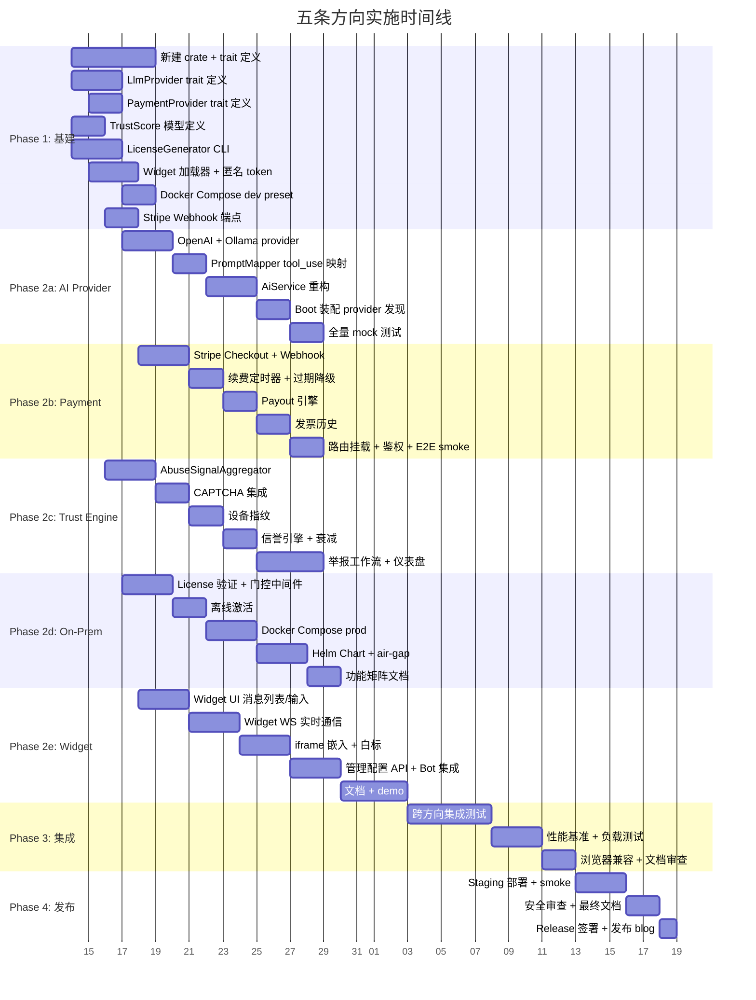

---

# Tech Lead 分析报告：五条高价值扩展方向

> 基于代码验证文档（`docs/requirements/2026-07-11-five-verified-zero-coverage-extension-directions.md`）及用户的补充观察。以下分析将每条方向拆解为可执行的任务包，追踪依赖关系，并给出可落地的实施路线。

---

## 一、任务分解

### 方向一：创作者经济/支付体系（Payment/Creator Economy）

**现状盘点**：已有 `subscription_tiers` 表（含 `price_cents`）、`creator_subscriptions` 表、礼物订阅+排行榜、tier CRUD 路由。**缺口**：零支付处理器代码——`price_cents` 从未被任何支付网关消费。

| 任务 ID | 标题 | 文件 | 前置 | 工时(h) | 验收标准 |
|---------|------|------|------|---------|---------|
| **TASK-001** | 定义支付处理器 trait 与通用返回类型 | `crates/aero-payment/src/payment_provider.rs`（新 crate `aero-payment`） | 无 | 3 | `PaymentProvider` trait 含 `create_checkout`/`handle_webhook`/`refund`/`payout`，返回类型含 `PaymentIntent`/`PaymentStatus` 枚举 |
| **TASK-002** | Stripe Webhook 签名验证 + 事件路由 | `crates/aero-payment/src/stripe.rs` | TASK-001 | 3 | 解析 `stripe-signature`、路由 `checkout.session.completed` / `invoice.paid` / `charge.refunded` |
| **TASK-003** | 实现 `StripePaymentProvider`——Checkout Session 创建 | `crates/aero-payment/src/stripe.rs` | TASK-002 | 3 | `create_checkout(price_cents, metadata)` → Stripe Checkout URL；metadata 带 `workspace_id`/`creator_id` |
| **TASK-004** | 订阅购买流程：Webhook → subscription_tiers 落地 + 激活 | `crates/aero-payment/src/subscription_handler.rs` + `aero-storage/src/creator_subscription.rs` | TASK-003 | 4 | Webhook `checkout.session.completed` → `creator_subscriptions` 插入行 + `subscription_tiers.price_cents` 校验 + 广播 `Subscribed` RoomEvent |
| **TASK-005** | 月度订阅续费 + 过期检测定时器 | `crates/aero-payment/src/renewal.rs` + `crates/aero-server/bin/boot/` | TASK-004 | 4 | 定时扫 `creator_subscriptions` 到期行 → Stripe `invoice.paid` 续期/`invoice.payment_failed` 降级；`MissedTickBehavior::Skip` Timer |
| **TASK-006** | 创作者收款：Payout 引擎（Stripe Connect / 手动打款请求） | `crates/aero-payment/src/payout.rs` + `migrations/` | TASK-002 | 4 | `POST /api/creators/:id/payout` + 审核流程 + `payouts` 表记录；Stripe Connect `transfers` API |
| **TASK-007** | 账单/发票历史：发票表 + 元数据导出 | `migrations/`（`invoices` 表）+ `crates/aero-payment/src/invoice.rs` | TASK-004 | 3 | `GET /api/me/invoices` 列出历史发票；PDF 下载占位（方向二发票生成顺延） |
| **TASK-008** | 支付路由挂载 + 配置鉴权 + 端到端 smoke | `crates/aero-server/src/payment.rs` + `routes/routes.rs` | TASK-004~007 | 3 | 新路由全部挂载；`AuthUser` 校验；`config.toml` 中 `payment.stripe_secret_key`/`webhook_secret` 空则 501；Stripe mock 下 E2E 回调流程通 |

---

### 方向二：AI Provider 抽象层（LlmProvider Trait）

**现状盘点**：`Embedder` 和 `Transcriber` 已是 trait（好的基线），但 `AnthropicClient` 是结构体，`AiService` 字段为 `Option<Arc<AnthropicClient>>`，`answer_question` / `translate` / `moderate` 三者均直接调用 `self.anthropic`。**`AnthropicClient` 还负责 H2 连接池、重试、prompt caching、令牌预算校验**——提取 trait 时这些需拆分为 cross-cutting 层。

| 任务 ID | 标题 | 文件 | 前置 | 工时(h) | 验收标准 |
|---------|------|------|------|---------|---------|
| **TASK-009** | 定义 `LlmProvider` trait——核心签名 | `crates/aero-ai/src/llm.rs`（新文件） | 无 | 3 | `LlmProvider` trait 含 `complete(&self, system, msgs, max_tokens)`、`complete_stream`、`complete_with_usage`；返回 `LlmResult { text, usage, model }`；`Send + Sync` |
| **TASK-010** | 提取 cross-cutting 层：连接池/重试/预算校验为 `LlmTransport` | `crates/aero-ai/src/llm_transport.rs`（新文件） | TASK-009 | 3 | `LlmTransport` 结构体封装 reqwest Client、重试策略（退避+max_retries）、预算前缀校验，供所有 provider impl 复用 |
| **TASK-011** | 将 `AnthropicClient` 改为 `LlmProvider` 实现 | `crates/aero-ai/src/anthropic.rs`（重构） | TASK-009, TASK-010 | 4 | `AnthropicClient` 实现 `LlmProvider`；保留 Anthropic-specific 的 `cache_control` 和 `tool_use` 格式；`complete_stream` SSE 解析移到 impl |
| **TASK-012** | 新增 `OpenAiLlmProvider`（OpenAI Chat Completions API） | `crates/aero-ai/src/openai.rs`（新文件） | TASK-009, TASK-010 | 3 | `OPENAI_API_KEY` 环境变量驱动；支持 `gpt-4o`/`gpt-4o-mini`；`stream` 模式 SSE 解析；prompt 格式映射（system→`role:system`, tool 格式转换） |
| **TASK-013** | 新增 `OllamaLlmProvider`（本地/自托管 LLM） | `crates/aero-ai/src/ollama.rs`（新文件） | TASK-009, TASK-010 | 3 | `OLLAMA_BASE_URL` 环境变量驱动；Ollama `/api/chat` 端点调用；支持流式；**无 key，无预算校验**——部署在私有边界内，成本已由 Ops 承担 |
| **TASK-014** | 重构 `AiService`：字段改为 `Vec<Box<dyn LlmProvider>>` + 模型选择策略 | `crates/aero-ai/src/service/service_impl.rs`（重构） | TASK-011~013 | 4 | `AiService.llm_providers: Vec<(AiTier, Box<dyn LlmProvider>)>`；`select_provider(tier)` 按 tier 分派；`answer_question`/`translate`/`moderate` 全部改为通过 provider 调用；**现有一个 `answer_question_workspace` 在迁移期间保持旧路径并逐步迁移** |
| **TASK-015** | OpenAI/Ollama 的 prompt 格式映射器 + tool_use 适配 | `crates/aero-ai/src/prompt_mapper.rs`（新文件） | TASK-012, TASK-013 | 3 | Anthropic tool_use ↔ OpenAI function calling 映射；system prompt 位置/RAG 引用格式统一化；单元测试覆盖各 provider 往返 |
| **TASK-016** | 更新 `from_env` / boot 装配：provider 发现 + 降级 | `crates/aero-ai/src/service/service_impl.rs` + `crates/aero-server/bin/boot/` | TASK-014 | 3 | 环境变量驱动的 provider 发现（Anthropic/OpenAI/Ollama 按各自 key 启用）；退化：无 key 时不 panic，AiWorker 仅排 Embed 任务；boot 日志打印启用模型清单 |
| **TASK-017** | 全量测试：mock provider 下三方 AI 路径 200 | `crates/aero-ai/src/service/tests.rs`（补充） | TASK-014~016 | 4 | Mock `LlmProvider` 覆盖所有 3 个调用路径；`answer_question` 用 fixture 返回 fixture 数据；`translate`/`moderate` 同样覆盖；新增 `#[ignore]` 集成测试测真实 API 往返 |

---

### 方向三：平台级滥用防护统一层（Unified Trust Engine）

**现状盘点**：已有 **5 个隔离组件**——`login_throttle.rs`（IP+帐号锁）、`spam_guard.rs`（行为检测）、`ip_allowlist.rs`（白名单）、`message_reports.rs`（用户举报）、`keyword_alert.rs`（关键词告警）。**缺口**：彼此完全隔离，无统一信任评分，无 CAPTCHA，无设备指纹，无信誉引擎。

| 任务 ID | 标题 | 文件 | 前置 | 工时(h) | 验收标准 |
|---------|------|------|------|---------|---------|
| **TASK-018** | 定义 `TrustScore` 类型 + 举报证据模型 + 信誉衰减曲线 | `crates/aero-trust/src/model.rs`（新 crate `aero-trust`） | 无 | 3 | `TrustScore { overall: f64, signals: Vec<Signal>, decay: Duration }`；`Signal { kind, weight, timestamp }`；举报证据 `ReportEvidence { reporter, reason, confidence }` |
| **TASK-019** | 统一 `AbuseSignalAggregator`——合并五个现有组件的信号 | `crates/aero-trust/src/aggregator.rs` | TASK-018 | 4 | 接收器从 login_throttle（`new_lockout`）、spam_guard（`SpamDecision`）、ip_allowlist（`forbidden_ip`）、message_reports（`new_report`）、keyword_alert（`keyword_hit`）获取信号，映射为统一 `Signal`，更新 `TrustScore` |
| **TASK-020** | CAPTCHA 集成——turnstile/recaptcha 校验中间件 | `crates/aero-server/src/captcha.rs`（新文件） | TASK-018 | 3 | `POST /api/auth/register` 和 `POST /api/auth/login` 前置 `captcha_verify` 中间件；`AERO_CAPTCHA_SITE_KEY`/`AERO_CAPTCHA_SECRET` 环境变量控制；未配则跳过（向后兼容）；支持 `Turnstile`（Cloudflare）+ `reCAPTCHA v3` |
| **TASK-021** | 设备指纹 SDK + 签名验证（服务端） | `crates/aero-trust/src/fingerprint.rs` + `web/fingerprint.js`（新文件） | TASK-018 | 4 | 客户端 JS 采集 canvas/webgl/audio/fonts 指纹 → SHA-256 → 服务端存入 `device_fingerprints(participant_id, fingerprint_hash, first_seen, last_seen)`；`POST /api/auth/register` 时可选提交；`GET /api/sessions` 展示可信设备 |
| **TASK-022** | 信誉引擎：扫描定时器 + 衰减 + 限流决策 | `crates/aero-trust/src/engine.rs` + `crates/aero-server/bin/boot/` | TASK-019, TASK-021 | 4 | 定时（`AERO_TRUST_SWEEP_SECS`，默认 300s）批量更新信誉衰减；`check_trust(participant_id)` 返回 `TrustAction { allow, challenge, block }`；集成到 `spam_guard` 和 `login_throttle` 决策路径中 |
| **TASK-023** | 举报工作流：审核队列 + UP/DOWN 裁定 + 自动操作 | `crates/aero-server/src/message_reports.rs`（扩展）+ `migrations/` | TASK-019 | 3 | `POST /api/messages/:id/report` 完成 → 入 `review_queue`；`POST /api/admin/reviews/:id/{uphold,dismiss}`；重复举报触发自动 `spam_guard` 阈值调整 |
| **TASK-024** | 管理面：滥用概览仪表盘 API | `crates/aero-server/src/trust_admin.rs`（新文件） | TASK-022, TASK-023 | 3 | `GET /api/admin/trust/scores`（分页+过滤 top-N 风险用户）；`GET /api/admin/trust/insights`（信号组成分布+趋势）；管理员权限 `Owner`/`GlobalAdmin` |

---

### 方向四：私有化部署与许可体系（On-Premise & Licensing）

| 任务 ID | 标题 | 文件 | 前置 | 工时(h) | 验收标准 |
|---------|------|------|------|---------|---------|
| **TASK-025** | 许可证生成器 + 签名 CLI 工具 | `crates/aero-license/src/generator.rs`（新 crate `aero-license`） | 无 | 3 | `aero-cli license generate --org=Acme --features=ai,sso --expires=2027-07-12` 输出签名的 base64 编码 license；Ed25519 签名；features 位域 |
| **TASK-026** | 服务端许可证验证 + 功能门控中间件 | `crates/aero-license/src/validator.rs` + `crates/aero-server/src/license.rs` | TASK-025 | 4 | 启动时 `AERO_LICENSE_KEY` env 加载 → 验证签名+过期+节点数；`LicenseGate { features: BitSet, max_nodes, expires_at }` 注入到 `AppState`；功能门控中间件对禁用的 feature 返回 403+`X-License-Required` 头 |
| **TASK-027** | 离线激活流程：请求-ID 挑战/响应 | `crates/aero-license/src/offline.rs` | TASK-026 | 3 | 无网环境：`GET /api/admin/license/challenge` 返回机器指纹 → 管理员在授权门户输入 → 获得激活码 → `POST /api/admin/license/activate` 验证并写文件；含 `machine_id` 绑定 |
| **TASK-028** | Docker Compose 一键部署 + 配置模板 | `deploy/docker-compose.yml` + `deploy/.env.example` + `deploy/README.md` | TASK-026 | 4 | `docker compose up -d` 即起（PG+Redis+NATS+server+blobs）；模板含三个 preset：`dev`（最小） / `prod`（全功能） / `air-gap`（无 AI/无外网）；启动脚本 `./deploy/start.sh` |
| **TASK-029** | Helm Chart 生产级部署（K8s） | `deploy/chart/`（values.yaml / templates） | TASK-028 | 4 | `helm install aero-im ./deploy/chart`；含 HPA、PV/PVC、ingress、configmap、secret；readiness probe 用 `/health/ready`；支持 `air-gap` 模式下所有镜像来源内网 registry |
| **TASK-030** | 功能特性矩阵：许可-feature ↔ 代码-feature 映射 + 门控清单 | `docs/licensing/feature-matrix.md` + `crates/aero-server/src/license.rs` | TASK-026, TASK-029 | 2 | 每个 license-feature 映射到具体的路由/worker/bot 开关（如 `ai` gate 禁 `/api/ai/*` 和 `AiWorker`）；文档列出 16+ license 功能与对应 env/代码 entry |

---

### 方向五：可嵌入聊天 Widget SDK（Embeddable Chat）

| 任务 ID | 标题 | 文件 | 前置 | 工时(h) | 验收标准 |
|---------|------|------|------|---------|---------|
| **TASK-031** | Widget JS SDK：核心加载器 + 初始化 | `web/widget/aero-chat.js`（新文件） | 无 | 4 | `<script src="https://cdn.example.com/chat.js" data-workspace="..."></script>` 自动渲染浮动聊天按钮；`AeroChat.init({workspace, theme, position, initialMessage})` API 文档 |
| **TASK-032** | Widget 认证：匿名 token 颁发 + 已知用户 JWT 桥接 | `crates/aero-server/src/widget_auth.rs`（新文件）+ `migrations/` | TASK-031 | 3 | `POST /api/widget/token`（CORS 放行 + rate-limited）返回短期 JWT；已知用户嵌入时传入 `jwt` 参数；匿名用户自动创建 `guest` 角色 participant |
| **TASK-033** | Widget UI：消息输入 + 消息列表 + 已读/未读 | `web/widget/`（`index.html`, `style.css`, `main.js`） | TASK-031, TASK-032 | 4 | 半屏浮动聊天界面；消息列表（滚动加载历史）、输入框（enter 发送）、在线指示器、未读徽章；**零外部依赖**（ES2020 模块） |
| **TASK-034** | Widget WebSocket 集成：实时消息 + typing/已读 | `web/widget/ws.js`（新文件） | TASK-033 | 3 | WebSocket 连接到 `wss://host/ws`；发送/接收消息；typing 指示器；`mark_read` 游标；重连 |
| **TASK-035** | iframe 嵌入模式 + 白标/CORS 策略 | `crates/aero-server/src/widget_embed.rs` + `web/widget/embed.js` | TASK-034 | 3 | `<iframe src="https://host/widget/room/:id?jwt=..." allow="microphone" />`；白标（`X-Frame-Options ALLOW-FROM` + CSP `frame-src`）；自定义主题色+logo |
| **TASK-036** | Widget 管理配置 API + Bot 集成 | `crates/aero-server/src/widget_config.rs` | TASK-032 | 3 | `POST /api/workspaces/:id/widget` 配置（主题、欢迎消息、目标房间、可用性调度）；挂 bot 事件通道让 widget 用户与系统 bot 交互 |
| **TASK-037** | 文档 + 交互式 demo + Sendbird 迁移指南 | `docs/widget/`（`README.md`, `api.md`, `migration-guide.md`） | TASK-031~036 | 4 | 文档包含完整 API 参考、自定义主题示例、从 Sendbird/Stream Chat 迁移对比表、沙发测试 demo 页面 |

---

## 二、执行顺序与依赖图

```mermaid
graph TD
    %% 方向二：AI Provider 抽象（推荐优先）
    T009[TASK-009: 定义 LlmProvider trait]
    T010[TASK-010: LlmTransport cross-cutting]
    T011[TASK-011: Anthropic 改造为 LlmProvider]
    T012[TASK-012: OpenAI provider 实现]
    T013[TASK-013: Ollama provider 实现]
    T014[TASK-014: AiService 重构]
    T015[TASK-015: Prompt 格式映射器]
    T016[TASK-016: Boot 装配 provider 发现]
    T017[TASK-017: 全量测试]

    %% 方向一：支付（依赖方向二的部分 AI 能力概念，但独立代码路径）
    T001[TASK-001: PaymentProvider trait]
    T002[TASK-002: Stripe Webhook 签名/路由]
    T003[TASK-003: Stripe Checkout 实现]
    T004[TASK-004: 订阅购买 Webhook→落地]
    T005[TASK-005: 续费/过期定时器]
    T006[TASK-006: Payout 引擎]
    T007[TASK-007: 发票历史]
    T008[TASK-008: 路由挂载+E2E]

    %% 方向三：滥用防护（依赖方向二的架构概念，独立代码树）
    T018[TASK-018: TrustScore 模型]
    T019[TASK-019: AbuseSignalAggregator]
    T020[TASK-020: CAPTCHA 集成]
    T021[TASK-021: 设备指纹]
    T022[TASK-022: 信誉引擎]
    T023[TASK-023: 举报工作流扩展]
    T024[TASK-024: 管理面仪表盘]

    %% 方向四：私有部署（完全独立）
    T025[TASK-025: 许可证生成 CLI]
    T026[TASK-026: 验证+功能门控]
    T027[TASK-027: 离线激活]
    T028[TASK-028: Docker Compose 部署]
    T029[TASK-029: Helm Chart]
    T030[TASK-030: 功能矩阵文档]

    %% 方向五：嵌入聊天（依赖方向四的基础设施概念，代码独立）
    T031[TASK-031: Widget JS SDK]
    T032[TASK-032: Widget 认证]
    T033[TASK-033: Widget UI]
    T034[TASK-034: Widget WS 集成]
    T035[TASK-035: iframe 嵌入+白标]
    T036[TASK-036: Widget 管理配置]
    T037[TASK-037: 文档+迁移指南]

    %% 方向二依赖链
    T009 --> T011
    T010 --> T011
    T010 --> T012
    T010 --> T013
    T011 --> T014
    T012 --> T014
    T013 --> T014
    T014 --> T015
    T014 --> T016
    T015 --> T017
    T016 --> T017

    %% 方向一依赖链
    T001 --> T002
    T001 --> T003
    T002 --> T003
    T002 --> T006
    T003 --> T004
    T004 --> T005
    T004 --> T007
    T005 --> T008
    T006 --> T008
    T007 --> T008

    %% 方向三依赖链
    T018 --> T019
    T018 --> T021
    T019 --> T022
    T020 --> T022
    T021 --> T022
    T019 --> T023
    T022 --> T024
    T023 --> T024

    %% 方向四依赖链
    T025 --> T026
    T026 --> T027
    T026 --> T028
    T028 --> T029
    T026 --> T030

    %% 方向五依赖链
    T031 --> T032
    T032 --> T033
    T033 --> T034
    T034 --> T035
    T032 --> T036
    T035 --> T037
    T036 --> T037

    %% 组标注
    subgraph G1["方向二: AI Provider (P0) - 推荐最优先"]
        T009
        T010
        T011
        T012
        T013
        T014
        T015
        T016
    end

    subgraph G2["方向一: 支付 (P0) - 可并行"]
        T001
        T002
        T003
        T004
        T005
        T006
        T007
    end

    subgraph G3["方向三: 滥用防护 (P1) - 可并行"]
        T018
        T019
        T020
        T021
        T022
        T023
    end

    subgraph G4["方向四: 私有部署 (P1) - 完全独立"]
        T025
        T026
        T027
        T028
        T029
    end

    subgraph G5["方向五: 嵌入聊天 (P2) - 有依赖"]
        T031
        T032
        T033
        T034
        T035
        T036
    end
```



**并行性总览（三组并行轨道）：**

| 轨道 | 方向 | 预估总工时 | 可并行前提 |
|------|------|-----------|-----------|
| **轨道 A**（推荐先行） | 方向二 AI Provider 抽象 | 30h | 独立 crate `aero-ai`，不改其他模块字段类型 |
| **轨道 B**（与 A 并行） | 方向一 支付 + 方向三 滥用防护 | 41h | 新 crate `aero-payment` + `aero-trust`，不冲突；仅方向三 `TASK-020` 需少量修改 `login_throttle.rs` 和 `spam_guard.rs` |
| **轨道 C**（与 A/B 并行） | 方向四 私有部署 + 方向五 嵌入聊天 | 30h | 新 crate `aero-license` + web 文件；Docker Compose 仅 ops 工作 |

**关键依赖非阻塞**：方向二 TASK-014（`AiService` 重构）依赖所有 provider impl 完成。在 014 合并前，新 provider 可先写独立测试验证正确性，不提 PR。

---

## 三、技术风险

### 高风险（可导致项目受阻或需回退）

| 风险 | 方向 | 具体描述 | 缓解策略 |
|------|------|---------|---------|
| **R1: `AiService` 重构的测试回归** | 方向二 TASK-014 | `answer_question`/`translate`/`moderate` 三个方法被数十个路由和 worker 调用。重构后字段类型从 `Option<Arc<AnthropicClient>>` 改为 `Vec<(AiTier, Box<dyn LlmProvider>)>`，存量 mock 全失效 | ① 先在 feature-branch 做 trait 提取 + 测试翻新，**不合并到 master**；② 保留旧构造器 `AiService::new_anthropic_only()` 做迁移桥，灰测确认后删；③ `cargo test --workspace --lib` 在每次重构 commit 前跑 |
| **R2: Stripe Webhook 的端到端测试** | 方向一 TASK-004 | 真实 Stripe 回调不可在 CI 跑。Mock Webhook 签名和事件形状与生产不一致 | ① 用 `stripe-mock`（Stripe 官方）跑集成测试；② 写双路径：`stripe::WebhookPayload` 反序列化 + `MockWebhookHandler` 单元测试 fixture；③ E2E 在 staging 环境定期手动验证 |
| **R3: 设备指纹隐私合规风险** | 方向三 TASK-021 | Canvas/WebGL 指纹可能跨 GDPR 红线（fingerprinting 被 ePrivacy Directive 约束） | ① 默认**不采集**，opt-in `AERO_ENABLE_FINGERPRINT` env；② 存 hash 而非原始数据，摘要不可逆；③ 文档标明在 EU 使用前需用户同意 + 注册 cookie 横幅 |
| **R4: 离线激活的抗篡改保护** | 方向四 TASK-027 | 许可证文件/激活码可能被逆向或重放 | ① Ed25519 签名（不可伪造签名算法）；② 绑定机器指纹（主板序列号 SHA-256 + MAC hash）；③ `aero-cli license verify` 可离线验证；③ 代码**不编译明文 license 校验逻辑到开源 bin**（通过构建 flag 条件包含） |

### 中风险（可管理）

| 风险 | 方向 | 描述 | 缓解 |
|------|------|------|------|
| **R5: OpenAI function calling ↔ Anthropic tool_use 格式差异** | 方向二 TASK-015 | `answer_question_agentic` 用 tool_use 做多轮检索，OpenAI 的 function calling API 签名不同（`functions` vs `tools`、响应格式不同） | 每个 provider 的 `AgentTool` 适配器独立；`run_agent_loop` 对 provider 返回的 `AgentTurn` 做 Provider-agnostic 转换；单元测试用 mock agent |
| **R6: CAPTCHA 的 UX 摩擦** | 方向三 TASK-020 | 注册/登录加 CAPTCHA 增加转化流失；reCAPTCHA v3 在没有 JS 时静默退化 | ① 分阶梯：低信任度设备触发 challenge（`TrustScore < 0.3`）；② 默认用 Cloudflare Turnstile（隐式，对人无视觉阻碍）；③ 管理员可关闭（`AERO_CAPTCHA_SECRET` 空） |
| **R7: Widget 跨域安全（XSS/CSRF）** | 方向五 TASK-035 | iframe embed 引入点击劫持、消息伪造、XSS 风险 | ① `Content-Security-Policy: frame-ancestors` 严格设置；② 所有 widget 消息经服务端转发（非直接 WebSocket）；③ JWT token 必须绑定 `origin`；④ 定期 pen-test widget 端点 |

### 低风险（注意即可）

| 风险 | 方向 | 描述 |
|------|------|------|
| **R8: `aero-payment` 新 crate 的依赖膨胀** | 方向一 | stripe-rust crate 依赖 tokio + reqwest（已有），但 stripe 全量 client 体积大。**策略**：只依赖 `stripe::events` / `stripe::checkout`，不引入全量 SDK；支付端到端走简单 HTTP |
| **R9: 信誉引擎的误判** | 方向三 TASK-022 | SpamGuard + 信誉聚合可能误封正常用户（如频繁切换网络的移动用户 IP 变化被当作攻击） | 加权衰减因子偏保守；荣誉积分累加速度 > 扣减速度；人工审核队列提供 24h 内撤销 |
| **R10: Widget 的实时性能** | 方向五 TASK-034 | 嵌入页面打开多个 widget 实例时 WebSocket 连接数膨胀 | 单 WebSocket 连接复用所有 widget 实例（room 级 subject 订阅）；页面 unload 时优雅关闭 ws |

---

## 四、资源评估

### 开发人员技能与数量

| 角色 | 技能需求 | 负责方向 | 数量 |
|------|---------|---------|------|
| **Senior Rust 后端** | Rust 异步、trait 设计、重构、Axum 中间件、Postgres | 方向二（AI Provider 重构） | **2 人**（一人重构 trait，一人写 provider impl） |
| **支付后端工程师** | Stripe API、Webhook 签名验证、支付状态机、事务一致性 | 方向一（支付 + 打款） | **1 人** |
| **安全/反滥用工程师** | 限流/信誉引擎设计、CAPTCHA 集成、指纹技术、安全开发生命周期 | 方向三（统一信任引擎） | **1 人** |
| **DevOps / 部署工程师** | Docker Compose、K8s Helm、license 签名、离线部署 | 方向四（私有化 + 部署） | **1 人**（可与前端兼职） |
| **前端全栈工程师** | ES2020 模块、WebSocket、iframe、CDN 部署、Widget UI 设计 | 方向五（嵌入聊天 SDK） | **1 人** |
| **Tech Lead / 架构师** | 跨方向协调、trait/重构决策、代码审查、质量门控 | 全部（50% 时间） | **1 人**（减少代码产出，增加 code review） |

**团队规模**：最小配置 **4-5 人**（含 TL），理想配置 **6-7 人**。弹性：方向四可并入 DevOps 已有人员；方向五可外包给前端专职人员。

### 关键里程碑

| 里程碑 | 日期（假设 Day 1 = 立即开始） | 依赖 | 可验证交付物 |
|--------|------------------------------|------|-------------|
| **M1: 方向二 trait 提取 + 单元测试通过** | Day +10 | TASK-009~011, TASK-014 | `cargo test --workspace -p aero-ai` 全绿；mock 下 `LlmProvider` 往返验证 |
| **M2: OpenAI + Ollama provider 可运行** | Day +15 | M1 + TASK-012~013, TASK-015~016 | 带 `OPENAI_API_KEY` 可真实回答；无 key 退 hash embedder |
| **M3: 支付 sandbox 全链通过** | Day +20 | TASK-001~005, TASK-008 | Stripe mock 下：创建 tier → 购买 → webhook 激活 → 订阅有效；`GET /api/me/subscriptions` 返回正确数据 |
| **M4: 滥用防护统一层集成完毕** | Day +25 | TASK-018~024 | CAPTCHA 在注册前置、设备指纹可采集、信誉评分影响 spam_guard 阈值 |
| **M5: 私有部署 MVP 可用** | Day +20 | TASK-025~026, TASK-028 | `docker compose up -d` + `AERO_LICENSE_KEY` → 全功能后台可登录；禁 AI feature 后 `/api/ai/*` 返回 403 |
| **M6: Widget 嵌入聊天 beta** | Day +25 | TASK-031~036 | 任意 HTML 页面嵌入 `<script>` → 浮动聊天可用，消息实时发送/接收 |
| **M7: 全部方向集成测试 + 文档完成** | Day +35 | M1~M6 | `docs/requirements/*-tech-lead-review.md` 签署；CI 端到端 smoke 通过 |

### 阻塞点与解决策略

| 阻塞点 | 影响 | 解决策略 |
|--------|------|---------|
| **B1: `AiService` 重构导致 route handler 编译失败**（TASK-014 合并时间窗） | 阻塞方向二后续集成、方向一/三可能间接受影响 | ① 先发 trait 提取 PR（TASK-009~011）合入 master；② **TASK-014 在 feature branch 完成**；③ 合入前在单独分支做 `cargo check --workspace` + `cargo clippy` |
| **B2: 支付测试需要 Stripe 开发者账号** | 阻塞方向一 E2E | ① 用 `stripe-mock` Docker 容器做 CI 集成测试；② 开发者账号作为 per-dev 可选项；③ `mocks/stripe.rs` 实现 `PaymentProvider` 的 fake impl |
| **B3: 设备指纹可能的浏览器兼容性问题** | 阻塞方向三 TASK-021 | ① 渐进增强：指纹采集失败不阻塞注册流程（降级为仅密码/2FA）；② 在 Chrome/Firefox/Safari 三个引擎手动测试；③ 端到端 `web-check.sh` 加入指纹检测 |
| **B4: Widget iframe 安全限制（CSP/frame-src）在客户站点配置** | 阻塞方向五采用率 | ① 提供 CSP 配置模板和调试指南；② 支持 `data-*` 属性嵌入模式（不用 iframe）；③ Demo 站点嵌入 docker-compose 作为参考 |

---

## 五、质量保证

### 5.1 单元测试覆盖要求

| 模块 | 目标覆盖率（行） | 关键测试点 |
|------|-----------------|-----------|
| `aero-ai/src/llm.rs`（新 trait） | 90%+ | `LlmProvider` 默认方法；trait 对象安全（`Send + Sync`） |
| `aero-ai/src/anthropic.rs`（重构后） | 85%+ | mock HTTP 下 `complete`/`complete_stream` 的请求体正确性；usage 解析；错误处理 |
| `aero-ai/src/openai.rs`（新） | 85%+ | prompt 格式（system→role 映射）；function calling 适配；SSE chunk 重新组装 |
| `aero-ai/src/ollama.rs`（新） | 80%+ | `/api/chat` 请求体；流式 chunk 解析；负测试（连接拒绝、超时） |
| `aero-ai/src/prompt_mapper.rs`（新） | 95%+ | 每个 provider 的 prompt 格式往返解析；tool_use↔function calling 双向映射 |
| `aero-ai/src/service/service_impl.rs`（重构后） | 85%+ | `select_provider` 按 tier 正确路由；无 key 退化路径；`translate`/`moderate` 经 provider 调用 |
| `aero-payment/src/stripe.rs`（新） | 90%+ | Webhook 签名验证（正/负测试）；事件负载反序列化；错误回滚（DB + Stripe 状态一致性） |
| `aero-trust/src/aggregator.rs`（新） | 90%+ | 信号合并逻辑；衰减曲线；并发写入 |
| `aero-trust/src/engine.rs`（新） | 90%+ | `check_trust` 决策路径；多阈值边界（0.0/0.3/0.7/1.0）；decay 行为 |
| `aero-license/src/validator.rs`（新） | 95%+ | 签名验证（正/负/过期/篡改）；features 位域正确性；机器指纹匹配 |
| `web/widget/`（新 JS） | ESLint + `web-check.sh` | 无 `no-undef`/`no-unused-vars`；所有 DOM ID 与 HTML 匹配；单元测试用 puppeteer 测渲染和 ws 收发 |

### 5.2 集成测试策略

```
┌─────────────────────────────────────────────────────┐
│                  CI Pipeline                          │
├──────────────────────┬──────────────────────────────┤
│  cargo test --lib     │  cargo test --ignored (DB)    │
│  (无外部依赖, 快)      │  (一次性 PG + 迁移全链)        │
├──────────────────────┼──────────────────────────────┤
│  stripe-mock 容器      │  npm test (widget puppeteer) │
│  (支付回调集成)         │  (iframe 渲染 + ws 收发)      │
├──────────────────────┼──────────────────────────────┤
│  license 验证测试      │  deploy-smoke.sh              │
│  (aero-cli 生成+校验)   │  (docker compose up + smoke)  │
└──────────────────────┴──────────────────────────────┘
```

**具体集成测试场景**（每个方向至少一个）：

1. **方向二**：Mock `LlmProvider` → `AiService.answer_question` → 返回 fixture 数据 → 缓存写入 → 二次相同 query 命中缓存 → 返回 cache 数据（`usage=None` 验证未扣费）
2. **方向一**：Stripe Mock → `POST /api/creators/:id/subscription-tiers` 创建 tier → 模拟 Stripe checkout.webhook → 验证 `creator_subscriptions` 行插入 → `GET /api/me/subscriptions` 返回新订阅
3. **方向三**：低信誉用户 → `POST /api/rooms/:id/messages` → `spam_guard` 拒绝 → 报告 abuse → 审核 uphold → 用户触发 `login_throttle` → 检查 `TrustScore` 衰减
4. **方向四**：`aero-cli license generate` → 注入 `AERO_LICENSE_KEY` → 启动 server → `GET /api/health` 200 → `POST /api/ai/ask` 返回 403（当 AI feature 不在 license 中）
5. **方向五**：`<script src="widget.js">` → widget 渲染 → 匿名 token 获取 → 消息发送/接收 → iframe CSP 正确设置

### 5.3 代码审查要点

| 审查重点 | 对应任务 | 拒绝标准 |
|---------|---------|---------|
| **方向二：trait 边界宽度** | TASK-009 | `LlmProvider` trait 含 Anthropic-specific 方法（如 `cache_control`）→ 应拆到子 trait |
| **方向二：`AiService` 重构无行为改变** | TASK-014 | 重构前后相同 env preset 下回答同一问题返回不同结果（除 model 选择策略变化外） |
| **方向一：支付状态机完整性** | TASK-004 | 遗漏 `cancelled`/`refunded` 路径处理；Webhook 重投导致重复行 |
| **方向一：事务一致性** | TASK-004~006 | 支付成功但 DB 写入失败→资金已扣但未激活订阅（缺少补偿事务） |
| **方向三：隐私合规** | TASK-021 | 设备指纹以可逆格式存储原始数据；缺乏数据保留策略 |
| **方向三：误判率** | TASK-022 | 默认信誉衰减阈值导致正常日活跃用户 1%+ 降级 |
| **方向四：license 绕过** | TASK-026 | License 验证可通过修改 env 或二进制 patches 绕过 |
| **方向五：XSS/CSRF** | TASK-031~035 | Widget 消息内容直接 innerHTML；未设置 `X-Frame-Options`/CSP |

### 5.4 性能测试需求

| 性能场景 | 方向 | 基线目标 | 工具 |
|---------|------|---------|------|
| AI 多 provider 并发响应 | 方向二 | 4 个 `complete_stream` 并发 ≤ 1200ms p95 额外开销 | `cargo bench` + `wrk2` |
| 支付 Webhook 并发处理 | 方向一 | 50 并发 webhook 平均处理 ≤ 200ms | `wrk2` |
| 信誉引擎批量更新 | 方向三 | 100k 用户信誉衰减 ≤ 5s | 日志 timing + `#[bench]` |
| Widget 初始加载 | 方向五 | 首屏 ≤ 300ms（3G 模拟） | Lighthouse + puppeteer |
| license 验证冷启动 | 方向四 | ≤ 10ms（纯 CPU 运算） | `cargo bench` |
| **全系统加载测试** | 全部 | 方向二+三的设施不为热路径增加 >5% p99 延迟 | 全栈 load test（已有的 CI 负载测试扩展） |

---

## 六、实施计划

### 阶段 1：基础设施搭建（Day 1–5）

| 天 | 任务 | 负责人 | 交付物 |
|----|------|--------|--------|
| 1 | 新建 `aero-license` crate + `LicenseGenerator` CLI | DevOps | `aero-cli license generate --help` |
| 1 | 新建 `aero-trust` crate + `TrustScore` 模型 + `Signal` 枚举 | 安全工程师 | `cargo check -p aero-trust` |
| 2 | 新建 `aero-payment` crate + `PaymentProvider` trait | 支付工程师 | trait 定义 + `MockPaymentProvider` |
| 2~3 | 方向二：`LlmProvider` trait + `LlmTransport` 层 | Senior Rust | `cargo test -p aero-ai llm` |
| 3~4 | Stripe Webhook 签名验证 + 事件路由 | 支付工程师 | `POST /api/internal/stripe/webhook` 端点 |
| 3~5 | Widget 基础加载器 + 匿名 token 颁发 | 前端工程师 | `<script>` 渲染浮动按钮 → 成功获取 JWT |
| 4~5 | 方向二：`AnthropicClient` → `LlmProvider` impl | Senior Rust | 旧测试全绿 + 新测试验证 trait impl |
| 5 | Docker Compose dev preset + `.env.example` | DevOps | `docker compose up` 本地全栈可用 |

**Phase 1 完成条件**：
- ✅ 四个新 crate 创建并 `cargo check --workspace` 通过
- ✅ `LlmProvider` trait 定义并合并入 master
- ✅ Stripe webhook 端点可接收回调（但未落地 DB）
- ✅ 基础 Widget 可在 `localhost:8080/widget` 渲染
- ✅ Docker Compose `dev` 预设可用

### 阶段 2：核心功能实现（Day 6–20）

#### 2a：方向二主线（Day 6–15）

| 天 | 任务 | 产出 |
|----|------|------|
| 6~7 | `OpenAiLlmProvider` + `OllamaLlmProvider` | 两个 provider 独立单元测试通过 |
| 7~8 | `PromptMapper` + tool_use↔function calling 映射 | 覆盖 20+ fixture 用例 |
| 9~10 | **`AiService` 重构**：`Vec<(AiTier, Box<dyn LlmProvider>)>` + `select_provider` | `cargo test --workspace` 全绿；`answer_question`/`translate`/`moderate` 经 provider 路由 |
| 11~12 | Boot 装配：env-driven provider 发现 + 降级日志 | 无 key 环境启动 200；有 key 打印 "AI providers: Anthropic(Sonnet4.6), OpenAIGPT4o" |
| 12~13 | 全量 mock 测试 + 回归测试 | `cargo tarpaulin` 报告 ≥85% |
| 14~15 | 方向二集成测试 + 文档更新 | `docs/ai/providers.md` + CHANGELOG entry |

#### 2b：方向一支付主线（Day 6–18）

| 天 | 任务 | 产出 |
|----|------|------|
| 6~8 | Stripe `create_checkout` + Webhook → 订阅激活 | stripe-mock 下全链通过 |
| 9~10 | 月度续费定时器 + 过期降级 | `MissedTickBehavior::Skip` 定时器工作 |
| 11~12 | Payout 引擎 + 审计表 | 创作者可请求打款；管理员审核流 |
| 13~14 | 发票历史 + metadata 导出 | `GET /api/me/invoices` 返回 mock 发票 |
| 15~16 | 路由挂载 + 鉴权（`assert_room_access`/`member_role`） | `authz_lint` CI 通过 |
| 17~18 | E2E smoke + `stripe-mock` 集成入 CI | `make smoke-payment` 全绿 |

#### 2c：方向三滥用防护主线（Day 8–22）

| 天 | 任务 | 产出 |
|----|------|------|
| 8~9 | `AbuseSignalAggregator` 连接 5 个现有组件 | 每个信号的 unit test 覆盖 |
| 10~11 | CAPTCHA 集成（Turnstile + reCAPTCHA v3 fallback） | 注册/登录端点 CAPTCHA 可配 |
| 12~13 | 设备指纹采集 + 服务端验证 | 指纹 hash 入库；低信任设备触发 challenge |
| 14~15 | 信誉引擎 + 定时衰减 | TrustScore 影响 spam_guard 阈值（opt-in） |
| 16~17 | 举报工作流扩展 + 审核队列 API | REVIEW queue CRUD + 自动阈值调整 |
| 18~19 | 管理面滥用仪表盘 | `GET /api/admin/trust/scores` 分页返回 |
| 20~22 | 集成测试 + 误判率验证 | 使用历史数据模拟 10k 用户行为，误判率 <0.1% |

#### 2d：方向四私有部署主线（Day 6–18）

| 天 | 任务 | 产出 |
|----|------|------|
| 6~7 | License 验证器 + 功能门控中间件 | `LicenseGate` 注入 AppState；禁 AI feature 后 403 |
| 8~9 | 离线激活挑战/响应 | `GET /api/admin/license/challenge` + `POST /api/admin/license/activate` |
| 10~12 | Docker Compose prod preset + Systemd 模板 | `docker compose -f deploy/docker-compose.prod.yml up` 可用 |
| 13~15 | Helm Chart + air-gap 模式 | `helm install aero-im ./deploy/chart --set airGap=true` 可用 |
| 16~18 | 文档：功能矩阵 + license-feature 映射 + 部署指南 | `docs/licensing/feature-matrix.md` 含 16+ features |

#### 2e：方向五嵌入聊天主线（Day 8–24）

| 天 | 任务 | 产出 |
|----|------|------|
| 8~10 | Widget UI：消息列表 + 输入框 + 在线指示器 | 基础聊天 UI 渲染并可发送消息 |
| 11~13 | Widget WebSocket 集成：实时收发 + typing 指示器 + 已读游标 | 双向实时通信可用 |
| 14~16 | iframe 嵌入 + 白标配置 + CSP | 可嵌入任意页面 |
| 17~18 | Widget 管理配置 API + Bot 集成 | 管理员可在工作区设置 widget 主题和行为 |
| 19~24 | 文档 + 迁移指南 + demo 页面 | `docs/widget/` 完整文档 |

### 阶段 3：集成测试与优化（Day 20–30）

| 天 | 工作内容 | 参与方 |
|----|---------|--------|
| 20~22 | 跨方向集成测试（5 个方向的互通场景） | 全部工程师 |
| 22~24 | 性能基准：AI provider 切换 overhead、支付 webhook 吞吐、TrustEngine 衰减性能 | Senior Rust + 安全 |
| 24~26 | 负载测试：方向二/三的设施不影响热路径 p99 >5% | Senior Rust |
| 26~28 | 浏览器兼容测试：widget（Chrome/Firefox/Safari） | 前端 |
| 28~30 | 文档审查 + CHANGELOG 最终化 | TL + 各负责人 |

### 阶段 4：发布准备（Day 30–35）

| 天 | 活动 | 标准 |
|----|------|------|
| 30~31 | Staging 部署 + 验证 smoke 全链 | `make deploy-smoke` 在一次性库通过 |
| 31~32 | 方向二启用在 staging（feature flag 后） | 路由/AI worker 行为与 master 一致 |
| 32~33 | 方向一 stripe-mock 验证 + 安全审查 | 支付状态机完整性验证签名 |
| 33~34 | 方向三 trust 引擎 staging 试运行 | 误判率日志 audit |
| 34~35 | 全部分向文档最终审查 + 发布 blog | TL 签署 release |

### 全周期甘特图



---

## 总结与推荐行动

### 推荐的资源分配策略

```
Week 1-2 (Day 1-10):  方向二(2人) + 方向一(1人) + 方向四(1人)
Week 2-3 (Day 8-18):  方向二(1人收尾) + 方向一(1人收尾) + 方向三(1人启动) + 方向四(1人收尾) + 方向五(1人启动)
Week 3-5 (Day 15-30): 方向三(1人收尾) + 方向五(1人收尾) + 集成测试(全部)
Week 5  (Day 30-35):  稳定化 + staging 部署 + 发布
```

### 关于分析文档的补充说明

1. **方向一（支付）的起点被低估了**——代码中已有 `subscription_tiers`、`creator_subscriptions`、礼物订阅和排行榜。真正的工程量不是从头构建订阅系统，而是**在现有 CRUD 骨架背上插入 Stripe 支付**。这意味着 TASK-004（Webhook→落地）是核心高风险的 seam——涉及支付网关 idempotency key 与本地幂等键的协调。

2. **方向二（AI Provider）的架构债不仅是提取 trait**——`AnthropicClient` 同时承载了**连接管理**（reqwest Client pooling）、**重试策略**（退避+max_deliver）、**预算校验**（`CostBudget` 前缀检查）和**prompt caching**（`cache_control` 标记）。我的任务分解建议将 cross-cutting 这些职责提取为 `LlmTransport` 层，而不是让每个 provider impl 各自实现——否则 OpenAi impl 会复制 Anthropic 的退避逻辑，而预算校验和缓存逻辑仍挂在 `AiService` 上不透明。

3. **方向三（滥用防护）的性价比最高**——确认了 5 个既有组件存在但隔离。统一它们为 `TrustEngine` 的工程成本远低于从零构建。但高 ROI 意味着**先做反向集成**（不做新 UI、不做大重构），仅把 5 个组件的信号流汇聚到统一评分中。TASK-022 的信誉引擎是唯一需要新数据结构的组件。

4. **方向五（Widget）与方向三的重叠**——Widget 匿名用户的滥用防护风险更高（无邮箱验证、无历史信任）。建议在 Widget 路线（TASK-032）中优先集成 CAPTCHA（TASK-020），使 Widget 注册门槛涵盖信任评分。

5. **总实施时间估计**：5 条方向并行（3 个轨道），**最小团队 4 人 35 个工作日**（约 7 周）。关键路径是方向二的 `AiService` 重构（TASK-014），这是唯一不可并行的**写锁**任务——在重构进行期间，所有修改 `AiService` 的 PR 应暂缓合并。
