好的，我已完整阅读分析文档。这份文档确实如其所言，是「真正未被覆盖的」——它通过客户端绑定扫描和 API 存在性验证找到了 5 个被 100+ 份既有分析系统性忽略的方向。以下是我的完整 Tech Lead 分析。

---

# Tech Lead 分析报告：5 个未被覆盖的扩展方向

## 1. 任务分解

### 方向一：客户端事件处理缺口

| 任务 ID | 标题 | 涉及文件 | 前置依赖 | 工时(h) | 验收标准 |
|---------|------|---------|---------|---------|---------|
| TASK-001 | 服务端 `explicit_recipients` 优化——Interaction 只扇出给发帖人+交互者 | `im-core/service/events.rs`（`explicit_recipients` 方法） | 无 | 2 | Interaction 事件不再广播全房间；单元测试覆盖新路由逻辑；确认 `explicit_recipients` 返回向量的正确性 |
| TASK-002 | Web 客户端注册 `msg:message_seen` 处理器 | `web/app.js`（`hookWs()` 添加新 handler） | 无 | 2 | `ws.on('msg:message_seen', …)` 注册；收到帧后在状态树记录；控制台 log 可验证收到事件 |
| TASK-003 | Web 客户端注册 `msg:interaction` 处理器 | `web/app.js`（`hookWs()` 添加新 handler） | TASK-001 | 2 | `ws.on('msg:interaction', …)` 注册；收到帧后更新对应 Block 的交互状态；与 TASK-004 配合验证 |
| TASK-004 | 渲染 `MessageSeen` 精确已读指示器（消息下方小头像条） | `web/render.js`（消息渲染函数）+ `web/context.js`（状态管理） | TASK-002 | 3 | 消息下方出现「X、Y 已读」头像条；与房间级 `Read` 帧的 `read-strip` 共存不冲突；500ms 内渲染 |
| TASK-005 | 服务端 `MessageSeen` 限频/聚合 | `im-core/service/events.rs` + `ws/ws_impl/frame.rs` | 无 | 2 | 同一房间同一用户每秒最多发出 1 条聚合后的 `MessageSeen` 事件；限频逻辑单元测试；不影响首次发送 |
| TASK-006 | 渲染 `Interaction` 事件驱动 Block 状态更新 | `web/render.js`（Button/Select 渲染逻辑）+ `web/context.js` | TASK-003 | 2 | 收到 `Interaction` 帧后对应 Button 变为禁用态/Select 选项更新；与 `POST /api/messages/:id/interact` 的响应一致性 |

### 方向二：Web SPA 架构债

| 任务 ID | 标题 | 涉及文件 | 前置依赖 | 工时(h) | 验收标准 |
|---------|------|---------|---------|---------|---------|
| TASK-007 | 引入 esbuild 作为 bundler，合并 11 个 JS 为 2-3 个 bundle | `web/package.json`(新) + `web/esbuild.config.mjs`(新) + `web/index.html`(script 引用修改) | 无 | 4 | `npm run build` 产出一个 vendor bundle + 一个 app bundle；`npm run dev` 支持 watch mode；CDN 依赖（hls.js）打包入 vendor；production build 产出物 < 200KB gzip |
| TASK-008 | 抽取 `i18n.js` 模块 + 建立 `zh.json` 语言包 | `web/i18n.js`(新) + `web/locales/zh.json`(新) + `web/locales/en.json`(新) | TASK-007 | 4 | 80+ 处硬编码字符串迁移到 `t('key')` 调用；`i18n.js` 导出 `t()` 函数；浏览器语言检测自动切换 zh/en；回退策略（fallback to zh） |
| TASK-009 | 添加 `service-worker.js` 实现 App Shell + 消息历史 IndexedDB 缓存 | `web/service-worker.js`(新) + `web/index.html`(register) + `web/context.js`(Cache 集成) | TASK-007 | 4 | 断网后显示 App Shell（房间列表 + 缓存消息）；`CacheFirst` 策略缓存静态资源；`NetworkFirst` 策略缓存 API 响应；`CacheStorage` 限容 50MB |
| TASK-010 | 渐进式 TypeScript 类型定义——为 `context.js` 和 `api.js` 添加 `.d.ts` | `web/types/context.d.ts`(新) + `web/types/api.d.ts`(新) + `web/types/frames.d.ts`(新) | 无 | 3 | 所有 `ServerFrame`/`ClientFrame` 类型有 TypeScript 定义；`state` 对象有完整类型声明；`api.js` 返回类型已定义；不要求全量 `.ts` 迁移 |
| TASK-011 | 无障碍（a11y）基线改进 | `web/index.html` + `web/render.js` + `web/style.css` | 无 | 3 | 动态内容更新后 `aria-live` 区域宣告；消息列表元素有正确 `role` 和 `aria-label`；键盘导航完整（Tab/Enter/Escape）；WAVE 工具扫描无严重错误 |

### 方向三：SFU 复用群通话

| 任务 ID | 标题 | 涉及文件 | 前置依赖 | 工时(h) | 验收标准 |
|---------|------|---------|---------|---------|---------|
| TASK-012 | 将 `SfuRouter` 实例化从直播 crate 提升到 `aero-server` boot 层 | `server/bin/boot/`(新增 boot 模块) + `aero-live-webrtc/src/lib.rs`(导出 `SfuRouter` 构造) | 无 | 4 | `SfuRouter` 可通过 `AppState` 从任意 crate 访问；直播服务和通话服务共享同一 `SfuRouter` 实例；不影响现有直播功能 |
| TASK-013 | 扩展 WS 信令——定义 `CallJoinSfu` / `CallSfuOffer` 帧 + 服务端处理 | `ws/ws_impl/mod.rs`(新增 `ClientFrame`/`ServerFrame` variant) + `im-core/service/call.rs`(处理逻辑) | TASK-012 | 4 | 帧定义在 `ClientFrame`/`ServerFrame` 枚举中；服务端收到 `CallJoinSfu` 后创建 `SfuPeer` 并返回 `CallSfuOffer`；单元测试覆盖信令流程 |
| TASK-014 | 服务端 `CallOrchestrator` 集成 SFU 模式——创建/加入/离开 SFU 通话 | `aero-im-call/src/orchestrator.rs`(新增 SFU 模式分支) + `server/src/call_routes.rs` | TASK-013 | 4 | 调用 `CallOrchestrator::create_call` 时可选 SFU 模式；参与者加入时通过 NATS 通知 SFU 节点；离开时清理 `SfuPeer`；集成测试覆盖 3 人 SSFU 通话 |
| TASK-015 | Web 端 `calls.js` 新增 SFU 模式——发流到 SFU + 订阅远端流 | `web/calls.js`(新增 `startSfuGroupCall` / `joinSfuCall` 方法) | TASK-013 + TASK-007 | 6 | `startGroupCall` 可选参数 `mode: 'sfu'`；发本地流到服务端 SFU；通过 WS 信令订阅远端流；与 mesh 模式切换无冲突 |
| TASK-016 | 通话录制——SFU 接入 `HlsWriter` 录流 | `aero-live-webrtc/src/record.rs`(新) + `aero-im-call/src/record.rs`(新) | TASK-014 | 3 | SFU 转发的媒体流可被 `HlsWriter` 录为 TS 片段；录制完成后生成可播放的 HLS playlist；录制元数据持久化到 `call_recordings` 表 |

### 方向四：审计/合规管理 UI

| 任务 ID | 标题 | 涉及文件 | 前置依赖 | 工时(h) | 验收标准 |
|---------|------|---------|---------|---------|---------|
| TASK-017 | 审计事件浏览器 UI——时间范围/事件类型/参与者过滤 | `web/audit.js`(新) + `web/index.html`(入口按钮 + 模态框) + `web/style.css`(样式) | TASK-007 | 4 | 管理员可在 UI 中选择时间范围、`audit_kind` 类型、参与者；支持分页浏览；支持 CSV 导出（调用已存在的 `export_audit_csv` API）；无后端修改 |
| TASK-018 | 合规 Dashboard——聚合展示法务保全/隔离墙/留存/IP 白名单状态 | `web/compliance.js`(新) + `web/admin/index.html`(新) + `web/style.css` | TASK-007 | 3 | Dashboard 显示：活跃法务保全令数量+到期日、信息隔离墙对数、各工作区留存期概览、IP 白名单状态；数据来源为已有 API；30s 自动刷新 |
| TASK-019 | 法务保全令管理器 UI——房间选择 + 到期日 + 创建/撤销 | `web/legal-holds.js`(新) + 挂载到 `index.html` | TASK-007 + TASK-018 | 3 | 管理员可用房间/工作区选择器指定目标；设置到期日期；一键创建/撤销保全令；列表视图可搜索筛选 |
| TASK-020 | 会话管理 UI——当前设备列表 + 远程登出 | `web/sessions.js`(新) + `web/index.html`(设置页) | TASK-007 | 2 | 显示当前用户所有活跃会话；显示设备类型/IP/最后活跃时间；每个会话有「远程登出」按钮；调用 `DELETE /api/sessions/:id` |

### 方向五：Bot 生态开放平台

| 任务 ID | 标题 | 涉及文件 | 前置依赖 | 工时(h) | 验收标准 |
|---------|------|---------|---------|---------|---------|
| TASK-021 | Bot 管理面板——Bot 列表/创建/编辑/删除 UI | `web/bots.js`(新) + `web/index.html`(入口) + `web/style.css` | TASK-007 + TASK-010 | 4 | Bot 列表显示名称/头像/状态/最近投递状态；创建表单（名称+头像+初始权限）；编辑（名称+头像）；删除（确认对话框）；调用 `POST/GET/DELETE /api/bots` |
| TASK-022 | Bot 订阅管理 UI——事件类型/过滤器配置 | `web/bot-subscriptions.js`(新) + `web/index.html`(bot 详情弹层) | TASK-021 | 3 | 为 Bot 添加/删除事件订阅；过滤器维度：`room_id`/`workspace_id`/`action_id`；显示已注册的订阅列表；调用 `POST/GET/DELETE /api/bots/:id/subscriptions` |
| TASK-023 | Bot 投递日志查看器 | `web/bot-deliveries.js`(新) | TASK-021 | 2 | 查看 Bot 最近的投递日志；显示投递状态/HTTP 状态码/响应体/时间戳；支持按状态（success/failed）过滤；调用 `GET /api/bots/:id/deliveries` |
| TASK-024 | Bot token 轮换 UI——页面上生成新 token | `web/bots.js`(扩展) | TASK-021 | 1 | Bot 详情页面中「轮换 token」按钮；点击后调用 `POST /api/bots/:id/token` 并显示新 token；旧 token 即时失效 |
| TASK-025 | Bot 投递重试——数据库扩展 + 背退重试 Worker | `storage/migrations/NNNN_bot_retry.sql`(新) + `server/bin/boot/bot_retry_worker.rs`(新) + `aero-storage/src/bot.rs`(Repo 方法) | 无 | 4 | `bot_delivery_log` 表添加 `retry_count` + `next_retry_at` + `max_retries` 列；背退重试 Worker 按 `next_retry_at` 轮询（`FOR UPDATE SKIP LOCKED`）；最大重试 5 次后标记 dead；单元测试覆盖重试逻辑 |
| TASK-026 | Bot webhook HMAC 签名修复——`hmac_secret` 列 + 真实签名 | `storage/migrations/NNNN_bot_hmac.sql`(新) + `aero-storage/src/bot.rs` + `aero-im-core/bot_dispatch.rs` | TASK-025 | 3 | `bot_event_subscriptions` 表添加 `hmac_secret` 列；bot 创建时自动生成随机 secret；bot_dispatch 用真实 secret 做 HMAC-SHA256 签名；单元测试验证签名正确性 |

---

## 2. 执行顺序与依赖图

```mermaid
graph TD
    %% 方向一：客户端事件处理
    T001[TASK-001<br/>explicit_recipients Interaction 优化<br/>2h ★ 服务端]
    T002[TASK-002<br/>msg:message_seen 处理器<br/>2h ★ 客户端]
    T003[TASK-003<br/>msg:interaction 处理器<br/>2h ★ 客户端]
    T004[TASK-004<br/>MessageSeen 精确已读指示器<br/>3h ★ 客户端]
    T005[TASK-005<br/>MessageSeen 限频/聚合<br/>2h ★ 服务端]
    T006[TASK-006<br/>Interaction Block 状态更新<br/>2h ★ 客户端]
    
    %% 方向二：Web SPA 架构债
    T007[TASK-007<br/>esbuild bundler 引入<br/>4h ★ 基础设施]
    T008[TASK-008<br/>i18n 模块 + 语言包<br/>4h ★ 产品化]
    T009[TASK-009<br/>Service Worker + App Shell<br/>4h ★ 离线]
    T010[TASK-010<br/>TypeScript .d.ts 定义<br/>3h ★ 类型安全]
    T011[TASK-011<br/>a11y 无障碍基线<br/>3h ★ 合规]
    
    %% 方向三：SFU 复用群通话
    T012[TASK-012<br/>SfuRouter 提升到 boot 层<br/>4h ★ 架构]
    T013[TASK-013<br/>WS 信令扩展 CallJoinSfu<br/>4h ★ 信令]
    T014[TASK-014<br/>CallOrchestrator SFU 集成<br/>4h ★ 编排]
    T015[TASK-015<br/>calls.js SFU 模式<br/>6h ★ 客户端]
    T016[TASK-016<br/>通话录制 HLS 集成<br/>3h ★ 录制]
    
    %% 方向四：审计/合规 UI
    T017[TASK-017<br/>审计事件浏览器<br/>4h ★ UI]
    T018[TASK-018<br/>合规 Dashboard<br/>3h ★ UI]
    T019[TASK-019<br/>法务保全管理器<br/>3h ★ UI]
    T020[TASK-020<br/>会话管理 UI<br/>2h ★ UI]
    
    %% 方向五：Bot 生态
    T021[TASK-021<br/>Bot 管理面板<br/>4h ★ UI]
    T022[TASK-022<br/>Bot 订阅管理 UI<br/>3h ★ UI]
    T023[TASK-023<br/>Bot 投递日志查看器<br/>2h ★ UI]
    T024[TASK-024<br/>Bot token 轮换 UI<br/>1h ★ UI]
    T025[TASK-025<br/>Bot 投递重试 Worker<br/>4h ★ 服务端]
    T026[TASK-026<br/>Bot HMAC 签名修复<br/>3h ★ 服务端]
    
    %% 依赖
    T001 --> T003
    T001 --> T006
    T002 --> T004
    T003 --> T006
    T007 --> T008
    T007 --> T009
    T007 --> T017
    T007 --> T018
    T007 --> T020
    T007 --> T021
    T007 --> T022
    T007 --> T023
    T007 --> T024
    T012 --> T013
    T013 --> T014
    T013 --> T015
    T014 --> T016
    
    %% 并行组
    subgraph P1_D1_P["P1 方向一　服务端（可并行）"]
        T001
        T005
    end
    subgraph P1_D1_C["P1 方向一　客户端（T002→T004，T003→T006）"]
        T002
        T003
        T004
        T006
    end
    subgraph P1_D2_INFRA["P1 方向二　基础设施（T007 阻塞全部 UI 任务）"]
        T007
    end
    subgraph P1_D2_A11Y["P1 方向二　可并行"]
        T010
        T011
    end
    subgraph P2_D3_SFU["P2 方向三　全链路"]
        T012
        T013
        T014
        T015
        T016
    end
    subgraph P2_D4_AUDIT["P2 方向四　全在 T007 之后（并行）×3"]
        T017
        T018
        T019
        T020
    end
    subgraph P2_D5_BOT["P2/P3 方向五　服务端+客户端"]
        T025
        T026
        T021
        T022
        T023
        T024
    end
```



### 组间依赖声明

```
T007 (esbuild bundler) 阻塞所有 UI 任务 = T008, T009, T017-024
  原因：bundler 引入后 module 路径变更，旧 script 顺序引入在新模块体系下不兼容。
  未完成 T007 就开 T017（审计 UI）会导致两次重写。

T003 (Interaction 客户端 handler) 依赖 T001 (服务端路由)
  原因：改完 explicit_recipients 后确认预期 payload shape 再写客户端逻辑。

T006 (Interaction Block 渲染) 依赖 T001 + T003
  原因：Block 状态更新需要服务端发正确的帧 + 客户端解析正确的帧。

T013 (WS 信令扩展) 依赖 T012 (SfuRouter 共享)
  原因：没有共享 SfuRouter，信令处理没有媒体背板。

T015 (calls.js SFU 模式) 依赖 T013 (WS 信令)
  原因：客户端需要先完成 WS 帧协商，再建立 SFU 媒体面。

T014 (CallOrchestrator SFU) 依赖 T013 (WS 信令)
  原因：编排层需要信令流到媒体背板的连接。

T016 (通话录制) 依赖 T014
  原因：录制器需要 `SfuForwarder` 的 feed 作为输入源。
```

---

## 3. 技术风险

### 3.1 高风险（需提前规避）

| 风险 | 所属方向 | 描述 | 缓解策略 |
|------|---------|------|---------|
| **crate 循环引用** | 方向三 | `aero-server` boot 层同时依赖 `aero-live-webrtc`（SfuRouter）和 `aero-im-call`。当前 `aero-live-webrtc` 是明确的直播专用 crate，如果直接暴露 `SfuRouter` 给 `aero-server` 会引入新依赖边。 | 在 `aero-server` 中新建 `sfu_bridge.rs` 模块作为薄适配层；SfuRouter 通过 trait 暴露而非具体类型；用 feature gate 控制编译期依赖。 |
| **WebRTC 信令流重设计** | 方向三 | 当前 `calls.js` 的信令走的是 NATS 广播 + WS 帧的路径，但 SFU 模式需要服务端做 SDP 协商中介（Offer/Answer 中继）。这需要修改 WS 消息时序。 | 定义清晰的 3 阶段握手时序（Join→Offer→Answer→ICECandidates）；参考 WHIP/WHEP 已有的服务器端 SDP 处理代码做模式复用。 |
| **esbuild 迁移破坏现有 JS 加载顺序** | 方向二 | 11 个文件通过 `import` /export 恢复依赖顺序；如果现有代码有隐含的全局变量依赖（如 `state` 对象在 `context.js` 定义后其他文件隐式使用），迁移时会报 `ReferenceError`。 | 先在 `context.js` 中显式 `export` 所有全局对象；用 esbuild 的 `--bundle` + `--format=iife` 做渐进迁移；上线前用 `make web-check` + 手动 smoke test 全覆盖。 |
| **Bot 投递重试的幂等性** | 方向五 | Bot webhook 重试可能造成重复投递。`bot_delivery_log` 目前没有幂等键（`idempotency_key`），重试可能产生重复的 POST 请求。 | `bot_delivery_log` 添加 `idempotency_key`（UUID v7）列；重试时发送相同的 `Idempotency-Key` header；文档要求 Bot 端按此 key 去重。 |

### 3.2 中等风险（需设计评审）

| 风险 | 所属方向 | 描述 | 缓解策略 |
|------|---------|------|---------|
| `MessageSeen` 的带宽放大 | 方向一 | 如果在活跃大群（500 人）中每条消息都广播 `MessageSeen`，即使限频每秒每人 1 条，也意味着每秒最多 500 条 `MessageSeen` 帧扇出。 | 在服务端做服务端聚合——不是每人一条，是每消息一个聚合帧（含最近 N 个已读用户 ID 列表）。限频窗口 2s/条。 |
| **i18n 迁移遗留硬编码** | 方向二 | 80+ 处字符串大部分在 `notifications.js` 和 `render.js` 中，可能存在动态拼接的字符串（`"第" + idx + "人"`）难以直接用 `t()` 覆盖。 | 建立 i18n 迁移检查清单：对所有 `.innerText` / `.textContent` 赋值点做 grep；动态拼接字符串用 ICU MessageFormat 模板替代。 |
| **中间件/路由级别对 SPA 的影响** | 方向一~五 | 新 UI 页面（`/bots`、`/admin/compliance`）需要路由支持。当前 `index.html` 是单页应用，路由由 hash 或 `app.js` 内的 `switch` 控制。 | 保持 SPA 路由在客户端侧（hash-based）；后端只需确保 200 返回 `index.html`。新增页面不需要后端路由改动。 |
| **旧客户端兼容** | 方向三 | 部分客户端可能只支持 mesh 模式。升级必须向前兼容。 | `CallMode` 枚举在通话创建时确定，旧客户端 join 通话时自动降级为 mesh；`CallOrchestrator` 检查所有参与者的客户端版本。 |

### 3.3 低风险（已知但可控）

| 风险 | 描述 |
|------|------|
| **AGENTS.md §4.4「禁区」冲突** | 通话录制注意不触碰「VOD 独立转码管线」边界——录制骑既有 HLS writer，不新造转码管线。 |
| **迁移计数「加迁移必先 build」** | 方向五有 2 个新迁移（bot_retry, bot_hmac）。按 AGENTS.md §4.2，加迁移后必先 `cargo build` 再 migrate，且计数器以 `ls` 为准。 |
| **APNs/FCM 推送沙箱不可用** | 方向四/Bot 无沙箱依赖——纯 UI + HTTP API，不碰推送。 |
| **str0m 依赖位置** | AGENTS.md 明确 str0m 仅限 `aero-live-whip` / `aero-live-webrtc` 声明，不往 root `Cargo.toml` 加。方向三的任务在 `aero-live-webrtc` 内操作，合规。 |

### 3.4 测试覆盖难点

| 难点 | 方向 | 原因 | 应对 |
|------|------|------|------|
| **WebSocket 帧端到端测试** | 一、三 | `msg:interaction` 和 `CallJoinSfu` 的处理需要 WS 连接 + 服务端正确处理事件流。现有 CI 中没有 WS 联合测试。 | 用 `ws://` 集成测试（`tokio_tungstenite`）在测试中创建真实 WS 连接，发送 `ClientFrame`，断言收到正确 `ServerFrame`。不要求 100%，但关键路径必须覆盖。 |
| **SFU 媒体面传输** | 三 | str0m DTLS/SRTP 握手在 CI 中不可用（需真实浏览器对端）。 | 服务端逻辑（SDP 协商、peer 管理、转发决策）可用模拟 RTP 包测试。`SfuForwarder` 的 `on_rtp` 方法已有单元测试（单测 + localhost 测）。CI 中只跑单元测试 + 信令集成测试。 |
| **Service Worker 缓存策略** | 二 | SW 生命周期在 Puppeteer/Playwright 中可测，但当前 CI 没有 headless browser。 | 在 CI 中引入 Playwright（~100MB 安装，可接受）。至少覆盖：SW 注册成功、断网消息缓存显示、恢复联网后 sync。 |

---

## 4. 资源评估

### 4.1 开发人员需求

| 角色 | 数量 | 必备技能 | 承担任务 |
|------|------|---------|---------|
| **Senior Rust 后端工程师** | 2 人 | Rust / tokio / NATS / WebRTC / SFU | TASK-001, TASK-005, TASK-012, TASK-013, TASK-014, TASK-016, TASK-025, TASK-026 |
| **Senior Frontend 工程师** | 2 人 | 原生 JS / esbuild / Service Worker / i18n | TASK-002~004, TASK-006~011, TASK-015, TASK-017~024 |
| **QA 工程师** | 1 人 | Playwright / WebSocket 测试 / 性能测试 | 编写端到端测试（WS 帧、SFU 信令、SW 缓存）；性能基准（方向二 bundle size） |

> **估算依据**：任务总数 26 个，单人产能按 6h/人·天（含代码审查、文档、知识传递），5 人并行约 6-7 个工作日完成核心实现 + 1.5 周测试打磨。

### 4.2 关键里程碑

| 里程碑 | 时间节点 | 交付物 | 验收条件 |
|--------|---------|--------|---------|
| **M1** | Day 3 | 方向一全部 + esbuild 基础设施 | TASK-001~006 全部完工；`cargo test` + `npm run build` 通过 |
| **M2** | Day 7 | Web 架构债（除 i18n 后续轮次）+ 审计 UI | TASK-007~011 + TASK-017~020 完工；Playwright smoke test 通过 |
| **M3** | Day 10 | Bot 生态开放平台（全量） | TASK-021~026 完工；Bot 管理面板可用；重试 Worker 后台运行 |
| **M4** | Day 14 | SFU 群通话（核心路径） | TASK-012~015 完工；3 人群通话走 SFU 可用（localhost + 2 浏览器） |
| **M5** | Day 18 | 全系统集成测试 + 性能基准 | 所有任务端到端测试通过；perf 基准与基线无退化；`cargo clippy` 无新增警告 |

### 4.3 阻塞点与解决策略

| Block | 所属任务 | 阻塞原因 | 解决策略 |
|-------|---------|---------|---------|
| **AGENTS.md §4.1「多 agent 并行集成」约束** | 全部 | 文档规定每 agent 管一个不相交单元，`git reset --hard master` 校准，集成时手动接共享文件（`routes.rs`、`lib.rs`、`RoomEvent` match 臂）。分布式开发时冲突概率高。 | 建立共享文件变更日志（`GIT_MERGE_GUIDE.md`）；每次集成前白板对齐共享文件修改点；使用 `cargo check --workspace` 作为合入 gate。 |
| **方向三的 str0m 版本兼容性** | TASK-012 | `aero-live-webrtc` 的 str0m 0.19 可能与 `aero-im-call` 的依赖冲突。 | 设 feature gate `sfu-calls` 仅在 `aero-server` 启；版本锁定在 `[patch.crates-io]` 中统一。 |
| **CI 中缺少 Playwright 环境** | TASK-007~024 | Service Worker 测试和 Bundle 体积断言需要 headless Chrome。 | CI 加入 `playwright-docker` step；仅在 `web/` 变更时触发；安装缓存化（target cache）。 |
| **法务保全/审计 API 实际可用性验证** | TASK-017~019 | 文档说 API 已全，但未经验证的 API 可能有隐藏问题（参数缺失、鉴权不完整）。 | 开工前先抓 HTTP 请求/响应确认：`curl GET /api/audit`、`curl POST /api/legal-holds` 返回预期 200；如有修复作为 TASK-017 的前置（pre-task）。 |

---

## 5. 质量保证

### 5.1 单元测试覆盖要求

| 模块 | 最低行覆盖率 | 核心测试场景 |
|------|-------------|-------------|
| `explicit_recipients` Interaction | 90% (新增代码) | 发帖人 = 交互对象∨≠交互对象；批量扇出只包含发帖人+交互者；空 recipients 处理 |
| `MessageSeen` 限频 | 90% | 1 秒内同一房间同一用户多发→仅第 1 条通过；2 秒后第 2 条通过；不同用户不受限；不同房间不受限 |
| `CallOrchestrator` SFU 模式 | 85% | 创建 SFU 通话→roster 记录 mode=SFU；加入→通知 SFU 节点；离开→清理 SfuPeer；mesh 模式向下兼容 |
| Bot 重试 Worker | 90% | 首次失败→schedule retry after backoff；最大尝试次数后→dead；成功→update delivery_log；`FOR UPDATE SKIP LOCKED` 并发安全 |
| Bot HMAC 签名 | 95% | 空 secret→不签名；真实 secret→HMAC-SHA256 header；签名验证（接收方侧）+ 防篡改 |
| `SfuRouter` 共享 | 85% | 多 crate 访问同一实例；直播流和通话音频同时转发 |

### 5.2 集成测试策略

| 测试套件 | 工具 | 覆盖场景 | 运行频率 |
|---------|------|---------|---------|
| WebSocket 帧集成 | `tokio_tungstenite` + `test WS server` | Interaction/MessageSeen/CallJoinSfu 帧序列 | PR 提交时 |
| SPA 渲染集成 | Playwright | 消息已读指示器渲染；Bot 管理面板表单提交；审计事件浏览器数据加载 | 每日 CI |
| SFU 信令集成 | `str0m` mock + NATS test | TASK-013/014/015 信令握手流程 | PR 提交时 |
| Bot 投递重试集成 | docker-compose with Mock HTTP server | 投递失败→重试→dead；幂等 retry | 每日 CI |
| esbuild bundle 集成 | `npm run build` + `scripts/web-check.sh` | bundle 体积 ≤ 200KB(gzip)；无 `undefined is not a function`；`import` 全部解析成功 | PR 提交时 |
| Service Worker 集成 | Playwright | 离线 App Shell 渲染；断网后消息列表缓存 | 每周 |

### 5.3 代码审查要点

| 审查领域 | 审查人 | 关键检查点 |
|---------|-------|-----------|
| **Rust 服务端** | 后端 TL | `unsafe_code = "forbid"` 无违规；`clippy::pedantic` 无新增 warn；AGENTS.md §4.2 的 crate 依赖方向无逆流；迁移 `CREATE TABLE IF NOT EXISTS` 幂等 |
| **Web 前端** | 前端 TL | esbuild 配置正确（`format=iife` / `splitting` / `external`）；i18n `t()` 调用覆盖所有用户可见字符串；SW `CacheFirst` / `NetworkFirst` 不缓存认证数据；`aria-*` 属性不缺失 |
| **WebSocket 帧** | 后端 TL | 帧枚举不破坏已有序列化格式；`kind` tag 不撞名（参照 `CallEvent::Invite` 的 `call_kind` rename）；新帧不引发已有 handler 误解析 |
| **SFU 信令** | 后端 TL + 架构师 | SDP 交换不引入 DTLS 降级风险；CallMode 枚举的序列化向后兼容；旧客户端 join SFU call 降级逻辑完整 |
| **迁移兼容性** | 后端 TL | 新迁移不破坏已有运行中实例（`ALTER TABLE ... ADD COLUMN IF NOT EXISTS` / `DEFAULT`）；`_sqlx_migrations` 账本验证通过 |

### 5.4 性能测试需求

| 测试场景 | 工具 | 基线 | 目标 | 说明 |
|---------|------|------|------|------|
| **MessageSeen 广播吞吐** | wrk + WS client | 无（当前不处理） | 500 人房间下每人每秒 1 条 MessageSeen，服务端聚合后扇出 ≤ 500 msg/s | 方向一新增的限频/聚合确保服务端不会收到 500 条/s × 500 人的帧 |
| **esbuild bundle 体积** | `npm run build -- --analyze` | 11 个 JS = 239KB (uncompressed) | bundle ≤ 200KB gzip | 方向二的关键体验指标 |
| **SFU 群通话延迟** | `str0m` ping/pong frame | mesh 3 人 50ms 同级拓扑 | SFU 3 人 ≤ 60ms (增加 ≤ 20%) | 方向三的 QOS 目标 |
| **Bot 投递重试延迟** | synthetic test | 无限重试无背退（当前） | 总重试窗口 ≤ 5min (1+2+4+8+16+32s backoff) | 方向五 |

---

## 6. 实施计划

### 6.1 甘特图（Gantt）

```mermaid
gantt
    title Aero IM — 5 方向扩展实施计划
    dateFormat  YYYY-MM-DD
    axisFormat  %m-%d

    section 方向一　客户端事件处理
    TASK-001 explicit_recipients 优化          :d1, 2026-07-14, 1d
    TASK-005 MessageSeen 限频/聚合              :d1, 2026-07-14, 1d
    TASK-002 msg:message_seen 处理器             :d1, 2026-07-14, 1d
    TASK-003 msg:interaction 处理器              :after d1 d1_1, 1d
    TASK-004 MessageSeen 已读指示器渲染          :after d1 d1_2, 1.5d
    TASK-006 Interaction Block 状态更新          :after d1_1 d1_3, 1d

    section 方向二　Web SPA 架构债
    TASK-007 esbuild bundler                    :d2, 2026-07-14, 2d
    TASK-010 TypeScript .d.ts                   :d2, 2026-07-14, 1.5d
    TASK-011 a11y 无障碍                        :d2, 2026-07-15, 1.5d
    TASK-008 i18n 模块 + 语言包                  :after d2 d2_1, 2d
    TASK-009 Service Worker                     :after d2 d2_2, 2d

    section 方向四　审计/合规 UI
    TASK-017 审计事件浏览器                      :after d2 d4_1, 2d
    TASK-018 合规 Dashboard                     :after d2 d4_2, 1.5d
    TASK-019 法务保全管理器                      :after d2 d4_3, 1.5d
    TASK-020 会话管理 UI                        :after d2 d4_4, 1d

    section 方向五　Bot 生态
    TASK-025 Bot 投递重试 Worker                :d5, 2026-07-14, 2d
    TASK-026 Bot HMAC 签名                      :d5, 2026-07-15, 1.5d
    TASK-021 Bot 管理面板                        :after d2 d5_1, 2d
    TASK-022 Bot 订阅管理 UI                    :after d2 d5_2, 1.5d
    TASK-023 Bot 投递日志查看器                  :after d2 d5_3, 1d
    TASK-024 Bot token 轮换 UI                  :after d2 d5_4, 0.5d

    section 方向三　SFU 群通话
    TASK-012 SfuRouter 提升到 boot 层            :d3, 2026-07-16, 2d
    TASK-013 WS 信令扩展                        :after d3 d3_1, 2d
    TASK-014 CallOrchestrator SFU 集成           :after d3_1 d3_2, 2d
    TASK-015 calls.js SFU 模式                  :after d3_1 d3_3, 3d
    TASK-016 通话录制 HLS                       :after d3_2 d3_4, 1.5d

    section 集成测试 & QA
    M1 验收 (方向一全量)                         :milestone, 2026-07-16, 0d
    M2 验收 (方向二+四全量)                      :milestone, 2026-07-18, 0d
    M3 验收 (方向五全量)                         :milestone, 2026-07-21, 0d
    M4 验收 (方向三核心路径)                     :milestone, 2026-07-24, 0d
    全量集成测试 + 回归                          :qt, 2026-07-25, 3d
    性能基准 + 修复                              :perf, 2026-07-28, 2d
    代码冻结合入 master                          :milestone, 2026-07-30, 0d
```

### 6.2 阶段计划详述

#### 阶段 1：基础设施搭建（Day 1-2，2026-07-14 ~ 07-15）

**并行任务组 A**（后端 2 人）：
- TASK-001: `explicit_recipients` Interaction 优化（4h）
- TASK-005: MessageSeen 限频/聚合（3h）
- TASK-025: Bot 投递重试 Worker — 迁移 + Worker 代码（6h）
- TASK-026: Bot HMAC 签名 — 迁移 + dispatch 修改（4h）

**并行任务组 B**（前端 2 人）：
- TASK-002: msg:message_seen 处理器（3h）
- TASK-007: esbuild bundler 引入（6h）——**前端 core 基础设施**
- TASK-010: TypeScript .d.ts 定义（4h）——类型先行
- TASK-011: a11y 无障碍（4h）——与 bundler 无依赖

**交付门**：`cargo test --workspace --lib` 全绿；`npm run build` 产出 bundle；方向一服务端修改单测通过。

#### 阶段 2：核心功能实现（Day 3-7，2026-07-16 ~ 07-20）

**前端冲刺（2 人）**：
- TASK-003: msg:interaction 处理器（3h）→ TASK-006: Block 状态更新（3h）
- TASK-004: MessageSeen 精确已读指示器（4h）
- TASK-008: i18n 模块 + 语言包（6h）→ 需要 `t()` 覆盖 + 检测
- TASK-009: Service Worker + App Shell（6h）

**审计 UI 并行（2 人都可接）**：
- TASK-017: 审计事件浏览器（5h）
- TASK-018: 合规 Dashboard（4h）
- TASK-019: 法务保全管理器（4h）
- TASK-020: 会话管理 UI（3h）

**交付门**：方向一全量 WS 帧可端到端验证；审计 UI 可用 `curl` 验证；i18n `t()` 检测通过。

#### 阶段 3：SFU + Bot 深度集成（Day 8-14，2026-07-21 ~ 07-27）

**SFU 后端（2 人）**：
- TASK-012: SfuRouter 提升到 boot 层（5h）
- TASK-013: WS 信令扩展（5h）
- TASK-014: CallOrchestrator SFU 集成（6h）
- TASK-016: 通话录制（4h）

**SFU 前端 + Bot UI（2 人）**：
- TASK-015: calls.js SFU 模式（8h）——**最重任务**
- TASK-021: Bot 管理面板（5h）
- TASK-022: Bot 订阅管理 UI（4h）
- TASK-023: Bot 投递日志查看器（3h）
- TASK-024: Bot token 轮换 UI（2h）

**交付门**：SFU 群通话 localhost 验证（2 个浏览器 + 1 str0m peer）；Bot 管理面板所有 CRUD 操作可用。

#### 阶段 4：集成测试 + 性能 + 发布（Day 15-18，2026-07-28 ~ 07-31）

| 日期 | 活动 | 参与人 |
|------|------|--------|
| D15 | 全量集成测试回归：`cargo test --workspace` + Playwright 端到端 + Service Worker 离线测试 | 全部 5 人 |
| D16 | 性能基准：方向二 bundle 体积对比；方向一 MessageSeen 吞吐；方向三 SFU 延迟 | QA + 后端 TL |
| D17 | 修复发现的回归/性能问题；跨团队代码审查合流 | 全部 |
| D18 | 合入 master + 打 tag + 部署预发布 + smoke test | 全部 |

### 6.3 团队协作方案

```
Day 1-2（阶段 1）
  后端 A: TASK-001 → TASK-005
  后端 B: TASK-025 → TASK-026
  前端 A: TASK-002 → TASK-007
  前端 B: TASK-010 → TASK-011
  QA:     WS 帧集成测试框架 + Playwright 环境搭建

Day 3-7（阶段 2）
  后端 A: 支援前端 → TASK-003 → TASK-006
  后端 B: TASK-017 → TASK-018(部分)
  前端 A: TASK-004 → TASK-008
  前端 B: TASK-009 → TASK-018(剩余) → TASK-019
  QA:     方向一 + 方向四 E2E 测试

Day 8-14（阶段 3）
  后端 A: TASK-012 → TASK-013 → TASK-014
  后端 B: TASK-016 + 方向五后端（TASK-025/026 完善）
  前端 A: TASK-015
  前端 B: TASK-021 → TASK-022 → TASK-023 → TASK-024
  QA:     SFU 信令集成测试 + Bot UI smoke

Day 15-18（阶段 4）
  全部 5 人：集成测试 → 性能修复 → 合入
```

### 6.4 风险缓冲

| 缓冲类型 | 天数 | 用途 |
|---------|------|------|
| **技术债务缓冲** | 2 d | esbuild 迁移遇到兼容性问题时回滚/修复 |
| **SFU 信令调试缓冲** | 2 d | WebRTC SDP 协商在真实浏览器上可能遇到兼容性问题 |
| **PR 合入冲突缓冲** | 1 d | `routes.rs` / `RoomEvent` / `lib.rs` 共享文件合入冲突 |
| **总计缓冲** | 5 d | 项目总周期 18 d + 5 d 缓冲 = 22 d 日历 |

---

## 附录 A：全量任务汇总表

| 任务 | 方向 | 优先级 | P 值 | 工时 | 类型 | 依赖 | 风险等级 |
|------|------|--------|------|------|------|------|---------|
| TASK-001 | D1 | P1 | 架构改进 | 2h | 服务端 | 无 | 低 |
| TASK-002 | D1 | P1 | 功能补全 | 2h | 客户端 | 无 | 低 |
| TASK-003 | D1 | P1 | 功能补全 | 2h | 客户端 | TASK-001 | 低 |
| TASK-004 | D1 | P1 | 功能补全 | 3h | 客户端 | TASK-002 | 低 |
| TASK-005 | D1 | P1 | 架构改进 | 2h | 服务端 | 无 | 低 |
| TASK-006 | D1 | P1 | 功能补全 | 2h | 客户端 | TASK-001,003 | 低 |
| TASK-007 | D2 | P1 | 基础设施 | 4h | 基础设施 | 无 | 中 |
| TASK-008 | D2 | P1 | 产品化 | 4h | 客户端 | TASK-007 | 中 |
| TASK-009 | D2 | P1 | 产品化 | 4h | 客户端 | TASK-007 | 中 |
| TASK-010 | D2 | P1 | 基础设施 | 3h | 客户端 | 无 | 低 |
| TASK-011 | D2 | P1 | 合规 | 3h | 客户端 | 无 | 低 |
| TASK-012 | D3 | P2 | 架构改进 | 4h | 服务端 | 无 | 高 |
| TASK-013 | D3 | P2 | 协议扩展 | 4h | 服务端 | TASK-012 | 高 |
| TASK-014 | D3 | P2 | 功能开发 | 4h | 服务端 | TASK-013 | 高 |
| TASK-015 | D3 | P2 | 功能开发 | 6h | 客户端 | TASK-013 | 高 |
| TASK-016 | D3 | P2 | 功能开发 | 3h | 服务端 | TASK-014 | 中 |
| TASK-017 | D4 | P2 | 合规 UI | 4h | 客户端 | TASK-007 | 低 |
| TASK-018 | D4 | P2 | 合规 UI | 3h | 客户端 | TASK-007 | 低 |
| TASK-019 | D4 | P2 | 合规 UI | 3h | 客户端 | TASK-007 | 低 |
| TASK-020 | D4 | P2 | 合规 UI | 2h | 客户端 | TASK-007 | 低 |
| TASK-021 | D5 | P2 | 平台 UI | 4h | 客户端 | TASK-007 | 低 |
| TASK-022 | D5 | P2 | 平台 UI | 3h | 客户端 | TASK-021 | 低 |
| TASK-023 | D5 | P2 | 平台 UI | 2h | 客户端 | TASK-021 | 低 |
| TASK-024 | D5 | P2 | 平台 UI | 1h | 客户端 | TASK-021 | 低 |
| TASK-025 | D5 | P2 | 功能开发 | 4h | 服务端 | 无 | 中 |
| TASK-026 | D5 | P2 | Bug 修复 | 3h | 服务端 | 无 | 中 |

**总计工时**: 26 任务 = 80h（10 人·天）= **按 5 人并行算 6-7 个工作日集中开发 + 5 个工作日测试+修复 + 3 天缓冲 = 3.5 周日历**

## 附录 B：与 AGENTS.md 约束的自检清单

| 约束 | 本计划遵守情况 |
|------|--------------|
| §4.1「迁移 → 仓储 → 路由 → 鉴权 → 实时」配方 | ✅ TASK-025/026 按照迁移(in storage) → 仓储(in storage bot.rs) → Worker(in boot/) 路线 |
| §4.1「批量 Vec 必须有上限」 | ✅ Bot 订阅过滤器不超过 10 个/次；审计事件浏览器分页 50/页 |
| §4.2「加迁移必先 cargo build」 | ✅ 明确标注在验收标准中 |
| §4.2「assert_room_access(participant, room)」 | ✅ 审计/合规路由已有 participant 校验；Bot 管理面板同理 |
| §4.2「tagged-enum `kind` 标签撞名陷阱」 | ✅ TASK-013 新增 WS 帧 variant 已注明检查 `kind` 重名（参考 `CallEvent` 的 rename） |
| §4.2「token helper 不可在 root re-export」 | ✅ 无新增 helper 冲突 |
| §4.2「workspace lints 不引新警告」 | ✅ 验收条件含 `cargo clippy --workspace --all-targets` |
| §4.2「AI 无 key 退化逻辑路径不变」 | ✅ 不涉及 AI 修改 |
| §4.2「缓存写读两面」 | ✅ Bot 管理面板涉及 `participant_cache` 的清除标注 |
| §4.2「at-least-once 状态机」 | ✅ TASK-025 Bot 投递重试含幂等键 + `FOR UPDATE SKIP LOCKED`；TASK-005 MessageSeen 限频聚合含幂等性 |
| §4.3「server 只能前台跑」 | ✅ 所有 Worker 在 `tokio::spawn` 中跑，不阻塞主线程 |
| §4.3「config 前缀双下划线」 | ✅ 无新 env 引入 |
| §4.4「禁区」不触碰 | ✅ 不碰 MLS、联邦、移动 SDK、VOD 独立转码管线 |
| §4.5「str0m 仅限 whip/webrtc crate」 | ✅ TASK-012 在 `aero-live-webrtc` 内操作，不往 root 加 str0m |
