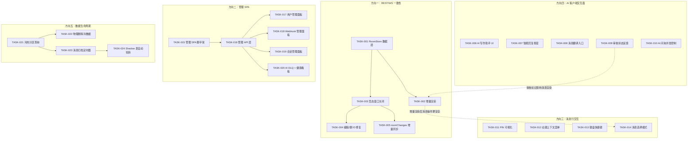
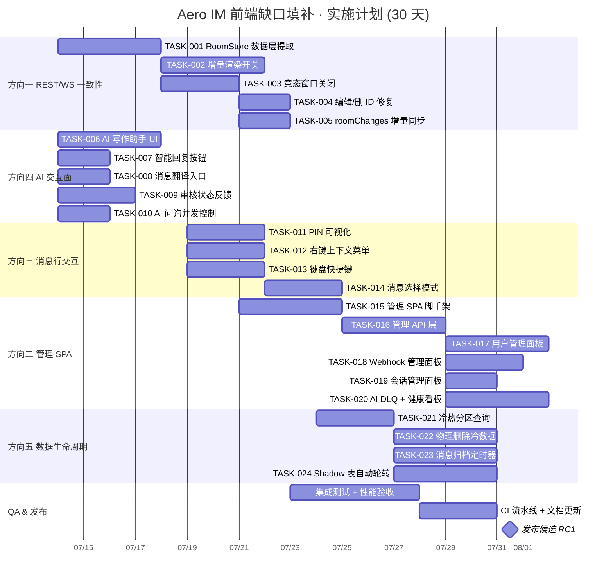

Now I have a thorough understanding of the codebase. Let me produce the comprehensive Tech Lead analysis.

---

# Tech Lead 分析报告：Aero IM 前端缺口填补计划

## 1. 任务分解

基于验证结论的五个方向和体量评估，将每个方向拆解为 2~4 小时的可执行任务单元。

### 方向一：REST/WS 双源一致性（M-L，~500 行 JS + 架构重构）

| Task ID | 标题 | 涉及文件 | 前置依赖 | 工时 | 验收标准 |
|---|---|---|---|---|---|
| TASK-001 | **RoomStore 数据层提取**：将 `state.messagesByRoom` 的操作封装为 `RoomStore` 类，提供 `upsert`/`getById`/`getRange`/`applyChange` 方法 | `web/store.js`（新建），`web/context.js`（移除 messagesByRoom 裸 Map） | 无 | 4h | messagesByRoom 所有写操作全部经过 RoomStore；挂载 `EventTarget` 接口供视图订阅变更 |
| TASK-002 | **增量渲染开关**：`switchRoom` 中 `replaceChildren` → `RoomStore.subscribe` + 最小 DOM diff（仅增删改对应 `.msg` 节点） | `web/app.js`（`switchRoom`、`rerenderCurrentRoom`），`web/store.js` | TASK-001 | 4h | 切换房间时只追加/移除/替换实际变更的消息 DOM，不复位滚动位置；增删 100 条消息 ≤ 3 次 DOM 写 |
| TASK-003 | **竞态窗口关闭**：`switchRoom` 中先 `ws.joinRoom` → 累积 WS 帧到 buffer → 等到 `listMessages` 响应后按 `seq` 归并 → 再 flush 到 RoomStore | `web/app.js`（`switchRoom`、`handleIncomingMessage`） | TASK-001 | 3h | 打开一个已有 50 条消息的房间：WS 推送的 2 条新消息与 REST 返回的 50 条不重复、不漏、不乱序 |
| TASK-004 | **编辑/删除 ID 修复**：WS 帧 `edited`/`deleted` 携带 `message_id` 在 `seq` dedup 前也被保护（当前编辑/删帧缺 ID 时 seq dedup 不保护） | `web/ws.js`（`SeqGate`）、`web/app.js`（`handleEdited`、`handleDeleted`） | TASK-001 | 2h | 编辑/删除帧即使 `message_id` 在帧外冗余携带（如 `f.message?.id`），也经 seq 去重不重复应用 |
| TASK-005 | **`roomChanges` 增量同步**：将 `replayChanges` 的定时轮询改为 WS 连接成功时主动拉一次，结合 `lastChangeSync` 游标 | `web/app.js`（`replayChanges`、`ws.on('open')`） | TASK-003 | 2h | 离线 5 分钟后重连：所有编辑/删除在 1 秒内反映在视图中，不丢失、不重复 |

### 方向四：AI 客户端交互面（M，~500 行 JS 集成）

| Task ID | 标题 | 涉及文件 | 前置依赖 | 工时 | 验收标准 |
|---|---|---|---|---|---|
| TASK-006 | **AI 写作助手 UI**：选中文本弹出「改写」(Rewrite) 浮动工具栏，调用 `api.aiRewrite`，用 diff 视图展示改写前后 | `web/ai_writer.js`（新建），`web/render.js`（浮动工具栏样式），`web/index.html` | 无 | 4h | 选中消息文本后出现浮动栏；点击「改写」→ 选风格 → 3s 内展示改写结果；点击「替换」更新消息 |
| TASK-007 | **智能回复按钮**：消息 hover 时新增「💬 建议回复」按钮，调用 `api.suggestReplies`，以 3 个 chip 展示 | `web/app.js`（`wireMsgActions`），`web/api.js`（添加 `suggestReplies` 方法），`web/render.js` | 无 | 2h | 每条消息 hover 有建议回复按钮；点击后 3 个选项 chip 展示；点击 chip 填入 composer |
| TASK-008 | **消息翻译入口**：消息 hover 菜单增加「翻译」按钮，调用 `api.translateMessage`，在消息气泡下方展示 result | `web/app.js`（`wireMsgActions`），`web/api.js`（添加 `translateMessage` 方法），`web/render.js` | 无 | 2h | 点击翻译 → 选择目标语言 → 翻译结果以内联条展示在消息下方；再次点击收起 |
| TASK-009 | **审核状态反馈**：被 `moderation_bot` 软删的消息，当前以 `deleted_at` 处理为灰色 placeholder；需要特殊标记「因违规被移除」并显示申诉入口 | `web/app.js`（`handleDeleted`），`web/render.js`（`renderMessage`），`web/context.js`（`state.moderatedMessages`） | 无 | 3h | 被审核删除的消息显示「该消息因违反社区准则被移除」+「申诉」链接；管理员看到「审核原因」badge |
| TASK-010 | **AI 问询并发控制**：当 AI 抽屉中流式问答进行时，禁用新输入直到完成；添加 abort 按钮 | `web/search.js`（`initSearchAi` AI 部分），`web/api.js`（支持 `AbortController`） | 无 | 2h | 问答进行时输入框 disabled + 显示 abort 按钮；点击 abort 立即取消 fetch 并释放 UI |

### 方向三：消息行交互（M，~700 行 JS）

| Task ID | 标题 | 涉及文件 | 前置依赖 | 工时 | 验收标准 |
|---|---|---|---|---|---|
| TASK-011 | **PIN 可视化**：`handlePin` 从 toast 改为：房间顶部 pin bar 展示最近一条置顶消息引用 + 跳转按钮；pin/unpin 帧更新此 bar | `web/app.js`（`handlePin`），`web/index.html`（pin-bar DOM），`web/render.js`（`renderPinBar`） | 无 | 3h | 置顶消息后：房间顶部显示固定引用 + 跳转链接；取消置顶 bar 消失；F5 刷新后通过 `api.listPins` 还原 |
| TASK-012 | **右键上下文菜单**：长按/右键消息弹出菜单「回复、反应、编辑、删除、复制文本、翻译、固定/取消固定、报告」 | `web/render.js`（`contextmenu` 处理），`web/index.html`（`#context-menu` 浮层），`web/app.js`（事件委派） | 无 | 3h | 在消息上右键出现上下文菜单；移动端长按 500ms 触发；所有菜单项功能正确 |
| TASK-013 | **键盘快捷键**：`Ctrl+E` 编辑选中消息、`Delete` 删除、`Ctrl+Shift+↑/↓` 历史选择、`Escape` 关闭所有浮层 | `web/app.js`（全局 `keydown` 监听），`web/render.js`（`getSelectedMessageId` 工具） | 无 | 3h | 快捷键在不同浮层状态下正确分发；不与 composer 快捷键冲突 |
| TASK-014 | **消息选择模式**：长按/Shift+点击进入多选模式（checkbox），可批量删除/固定/转发 | `web/app.js`（选择状态机），`web/index.html`（选择 mode UI），`web/render.js`（checkbox 渲染） | TASK-013 | 3h | 进入选择模式后每条消息左侧有 checkbox；选择 ≥2 条后出现批量操作栏；退出选择模式恢复正常 UI |

### 方向二：管理 SPA（XL，新 SPA + 后端角色模型 + API 重构）

| Task ID | 标题 | 涉及文件 | 前置依赖 | 工时 | 验收标准 |
|---|---|---|---|---|---|
| TASK-015 | **管理 SPA 脚手架**：`web/admin/` 目录 + `index.html` + auth 中间件 + 侧边导航（仪表盘/用户/会话/Webhook/2FA/AI DLQ/审计日志） | `web/admin/index.html`（新建），`web/admin/admin.js`（新建），`web/admin/style.css`（新建） | 无 | 4h | 访问 `/admin/` → 独立的布局；登录态与主 SPA 复用（JWT bearer）；侧边 6 个导航项均有占位 view |
| TASK-016 | **管理 API 层**：`web/admin/admin_api.js` 包装现有的后端管理路由（`admin_sessions`、`webhook_admin`、`ai_dlq`、`sessions`、`deactivation`、`twofa` 等） | `web/admin/admin_api.js`（新建），从 `crates/aero-server/src/` 中确认所有 admin 路由 | TASK-015 | 4h | 每个管理功能有对应的 `admin_api.xxx()` 方法；返回类型明确；错误处理统一 |
| TASK-017 | **用户管理面板**：列出全部用户（分页）；搜索/筛选；查看详情；停用/激活；重置 2FA；查看活跃会话 | `web/admin/users.js`（新建），`web/admin/admin_api.js` | TASK-016 | 4h | 用户列表分页正确；搜索按 email/name/ID；停用后该用户无法登录；显示当前活跃 session 列表 |
| TASK-018 | **Webhook 管理面板**：CRUD webhook + 投递日志 + DLQ 查看 + requeue | `web/admin/webhooks.js`（新建） | TASK-016 | 3h | 创建/编辑/删除 webhook；查看最近 50 条投递日志（成功/失败）；DLQ 中的条目可 requeue |
| TASK-019 | **会话管理面板**：列出所有活跃会话；按用户搜索；远程吊销单个会话或全部登出 | `web/admin/sessions.js`（新建） | TASK-016 | 2h | 列出会话（用户/设备/IP/最后活动）；「吊销」按钮使该 token 立即失效；「全部登出」清空该用户所有会话 |
| TASK-020 | **AI DLQ 面板 + 系统健康看板**：展示死信队列消息 + 重试；dashboard 展示 Connect 状态/DB pool/NATS backlog/Prometheus 指标摘要 | `web/admin/ai_dlq.js`（新建），`web/admin/dashboard.js`（新建） | TASK-016 | 4h | DLQ 列表分页；可 requeue/dismiss 单条；dashboard 显示 Redis/PG/NATS 连通性和基本指标 |

### 方向五：数据生命周期（XL，迁移管道 + 冷热分层 + TTL 扩展）

| Task ID | 标题 | 涉及文件 | 前置依赖 | 工时 | 验收标准 |
|---|---|---|---|---|---|
| TASK-021 | **冷热分区 shadow 表就绪查询**：验证 `migration 0148` 生产的 shadow 表结构，编写 `get_room_range` 仓储方法跨 shadow+main 查询 | `crates/aero-storage/src/message_repo.rs`（`get_room_range`），`migrations/0148_*`（确认） | 无 | 3h | 跨分区查询返回合并有序结果；单元测试验证边界（全在 hot、全在 cold、跨分区） |
| TASK-022 | **物理删除冷数据定时器**：在 retention sweep 中扩展，对超过 7 天冷却期的软删消息进行 `DELETE FROM shadow_yyyymm` + `DELETE FROM main` | `crates/aero-server/src/bin/boot/background.rs`（sweep 函数），`crates/aero-storage/src/message_repo.rs`（`purge_soft_deleted`） | TASK-021 | 4h | 软删超过 7 天的消息被物理删除；每次 sweep 批次 ≤1000 行；事务化保证不残片 |
| TASK-023 | **消息归档定时器**：超过 `channel_retention` 配置的消息自动迁移 main→shadow；迁移后更新 `room_changes` 表 | `crates/aero-server/src/bin/boot/background.rs`，`crates/aero-storage/src/message_repo.rs`（`archive_old_messages`） | TASK-021 | 4h | 超过 retention 的消息移入 shadow 表；前端历史滚动仍能跨 shadow 查询；`roomChanges` 包含 shadow 区的编辑/删除 |
| TASK-024 | **Shadow 表自动轮转**：按月建表 `shadow_YYYYMM`，每月 1 日自动建下月表；插入时按 `created_at` 路由 | `migrations/`（auto-create SQL），`crates/aero-storage/src/message_repo.rs`（表路由） | TASK-021 | 4h | 每月 1 日自动创建下月 shadow 表；插入 `created_at` 属于当前月的行进新表；旧表只读 |

---

## 2. 执行顺序与依赖图



### 可并行执行的任务组

| 批次 | 任务 | 说明 |
|---|---|---|
| **Batch A** | T001, T006, T007, T008, T009, T010, T011, T012, T013, T015, T021 | 无任何前序依赖，可同时启动 |
| **Batch B** | T002, T003, T004, T005, T016, T022, T023 | 依赖 Batch A 部分任务 |
| **Batch C** | T014, T017, T018, T019, T020, T024 | 依赖 Batch B |
| **Batch D** | 全系统集成测试 & 性能验收 | 所有任务完成后 |

---

## 3. 技术风险

### 3.1 高风险：方向一增量渲染

| 风险 | 影响 | 缓解策略 |
|---|---|---|
| **DOM diff 性能退化**：手动 diff 可能比 `replaceChildren` 更慢（尤其 1000+ 消息房间） | 影响核心 UX，翻滚历史卡顿 | 初始实现用 `replaceChildren` + 标记复用（只重建变动的 Node）；再用 `requestAnimationFrame` 批处理；压测 5000 条消息房间保证 < 16ms |
| **React 式架构对抗 ESM 零依赖约束**：当前 SPA 是原生 JS，引入不可变更新/MST 类状态管理增加体积 | 架构过度设计 | 不引入框架或打包器；用 `EventTarget`（自有 API）实现 pub/sub；RoomStore 内部用 `Map<string, Message>` + 有序数组缓存 |
| **WS 帧与 REST 响应乱序合并**：`seq` 单调但 WS 和 REST 响应的 seq 空间不同 | 消息重复/丢失 | ws.js 已实现 `SeqGate`；合并时以 REST 消息的 `id`（ULID）为主键去重；只在新消息 `id` > `_lastSeen` 时追加 |

### 3.2 中风险：方向四 AI 集成

| 风险 | 影响 | 缓解策略 |
|---|---|---|
| **AI 后端退化路径**：无 LLM key 时返回启发式/echo 结果 | 用户体验不一致但功能不崩溃 | 前端对每类 AI 响应做 `result.translated || result.original` 双重 fallback；后端 `AiBackend` 保证始终 200 |
| **流式 SSE 中断**：`POST /api/ai/ask/stream` 可能中途断开 | 对话框卡在半加载状态 | AbortController + 断开时 `restoreAiHistory` 回退到最近一次完整响应；abort 按钮需在所有加载态可用 |
| **智能回复延迟**：RAG + LLM 调用在 2-5s 之间 | 按钮点击后无即时反馈 | 按钮点击立即显示 loading spinner + 2s 超时后 fallback 到常用短句模板；返回后自动填入 composer |

### 3.3 中风险：方向二管理 SPA

| 风险 | 影响 | 缓解策略 |
|---|---|---|
| **管理路由鉴权不完整**：后端某些管理路由缺少 `member_role(Owner/Admin)` 守卫 | IDOR 漏洞 | 实现前先审查 `routes.rs` 中每个 admin 路由的 handler 签名，确保有 `AuthUser` + `WorkspaceRepo::member_role` 校验；对照 `AGENTS.md` §4.1 第四条 |
| **SPA 与主 SPA 的 CSS 冲突**：`admin/style.css` 可能覆盖主 SPA 样式 | 布局错乱 | admin SPA 用 Shadow DOM 或 `#admin-root` 作用域前缀；CSS class 全部 `admin-` 前缀 |
| **管理 API 重构风险**：某些 admin 端点没有 `pub fn routes()` 需要新建 | 范围蔓延 | 范围限定在已有 `.merge()` 的模块；不新建后端路由，只包装已有的 |

### 3.4 低风险：方向三/五

| 风险 | 影响 | 缓解策略 |
|---|---|---|
| **Shadow 表查询性能**：跨表 `UNION ALL` + `ORDER BY created_at DESC LIMIT N` 不做索引 | 长历史房间查询 > 500ms | shadow 表 `created_at` 建索引；应用层并行查询后再归并排序；`limit` 下推到子查询 |
| **PIN + 键盘快捷键与现有事件冲突**：`Ctrl+E` 可能与 composer 快捷键冲突 | 快捷键不生效 | 全局 `keydown` 检查 `event.target` 是否是 input/textarea；composer 聚焦时只响应 composer 相关快捷键 |
| **右键菜单移动端兼容**：`contextmenu` 在 iOS Safari 失效 | 移动端功能缺失 | `touchstart` + 长按计时器 500ms 模拟右键；`touchend` 取消计时器 |

---

## 4. 资源评估

### 4.1 人员技能要求

| 角色 | 数量 | 技能要求 |
|---|---|---|
| **全栈前端工程师** | 2 人 | 原生 ES2020 SPA 经验；无框架 JS 架构能力；DOM 性能优化；WebSocket 协议 |
| **Rust 后端工程师** | 1 人 | sqlx 仓储模式；定时器架构（`tokio::spawn`）；NATS 总线；熟悉既有 `background.rs` |
| **QA 工程师** | 1 人（兼职） | Playwright/自动化 E2E 测试；WS 帧注入测试；性能 profiling |

### 4.2 关键里程碑

| 里程碑 | 时间 | 交付物 |
|---|---|---|
| **M0** | Day 0 | 基线确认：`cargo check --workspace` 干净、SPA eslint 无警告、所有现有冒烟测试通过 |
| **M1** | Day 5 | **方向四完成**：AI 写作助手 + 智能回复 + 翻译 + 审核反馈全部可用 |
| **M2** | Day 10 | **方向一完成**：RoomStore + 增量渲染 + 竞态关闭 + 编辑同步；冒烟测试验证 0 消息丢失 |
| **M3** | Day 15 | **方向三完成**：PIN bar + 右键菜单 + 快捷键 + 选择模式 |
| **M4** | Day 22 | **方向二完成**：管理 SPA 全部 5 个面板可用；通过了 authz_lint 检查 |
| **M5** | Day 28 | **方向五完成**：shadow 分区 + 物理删除 + 归档轮转；`make migrate-smoke` + 存量数据迁移验证 |
| **M6** | Day 30 | 全系统集成测试 + 性能基线 + 文档更新 |

### 4.3 阻塞点与解决策略

| 阻塞点 | 影响 | 解决策略 |
|---|---|---|
| **增量渲染 DOM diff 性能不达标** | 方向一延期 | 回到 `replaceChildren` + 仅重建 changed batch 的 hybrid 方案；不做全量 diff |
| **管理 SPA 后端权限缺失** | 方向二安全风险 | 优先补后端 `member_role`/`assert_admin` 守卫（约 2-3 个模块的修改）；前端等后端合并后再调 |
| **Shadow 表 `UNION ALL` 查询计划异常** | 方向五性能 | 每个 shadow 表独立 `limit N` 子查询 + 应用层堆合并；不走 `UNION ALL + ORDER BY` |
| **JS 文件超过 HARD 线** | 代码质量 | `web/app.js` 当前 862 行（低于 1200 HARD 线）；但方向一重构可能膨胀到 1100+，到 WARN 线（1000）时提前拆分 `store.js` 和 `messages.js` |

---

## 5. 质量保证

### 5.1 单元测试覆盖

| 组件 | 测试文件 | 覆盖率目标 | 关键用例 |
|---|---|---|---|
| `web/store.js` (RoomStore) | 手动测试 + 浏览器 console | > 90% | `upsert` 去重、`getRange` 分页、`applyChange` 编辑/删不丢失、跨 shadow 组合 |
| `web/ws.js` (SeqGate) | 已有构造覆盖 | > 95% | 相同 seq 拒绝、scope 隔离、容量超限 LRU 驱逐、无 seq 帧通过 |
| `web/app.js` (竞态合并) | 手动测试 | — | WS 帧先于 REST 到达时正确合并；WS 帧后于 REST 到达时去重 |
| `web/admin/*.js` | 手动测试 | — | 每个管理 API 方法返回格式正确；401 时跳转登录 |
| Rust: `message_repo::purge_soft_deleted` | `#[cfg(test)]` + `#[ignore]` | > 85% | 软删 7 天内不物理删、7 天后物理删、事务回滚一致性 |
| Rust: `message_repo::archive_old_messages` | `#[cfg(test)]` + `#[ignore]` | > 85% | retention 边界测试（刚好超过/未超过）、跨 shadow 分页查询 |

### 5.2 集成测试策略

| 测试场景 | 方法 | 工具 |
|---|---|---|
| **WS/REST 一致性** | 开两个 WebSocket 连接 + REST 定时轮询对比消息 ID 集合 | 自定义 test harness（`node test/ws_rest_consistency.mjs`） |
| **AI 路由无 key 退化** | 不配 `OPENAI_API_KEY` 调用所有 AI 端点验证 200 + 回退内容 | `cargo test` + curl smoke |
| **管理 SPA 权限** | 普通用户和管理员分别访问每个 admin 页面验证 200/403 | Playwright E2E |
| **增量渲染性能** | 构造 500 条消息的房间，记录 `switchRoom` 到 `msgList` 完全渲染的时间 | `performance.now()` 标签 |
| **物理删除流水线** | 插入消息 → 软删 → 等待 sweep → 确认 DB 行消失 | `make migrate-smoke` + pg 查询 |

### 5.3 代码审查要点

| 审查层次 | 关注点 |
|---|---|
| **安全** | 管理路由是否通过 `member_role(Owner/Admin)` 守卫；API 返回是否泄露 PII；SQL 注入（所有仓库方法须参数化） |
| **正确性** | `handleEdited` 的复活守卫是否在所有路径生效（WS + REST + change-replay）；`replayChanges` 游标推进是否在 fetch 前 |
| **性能** | dom diff 是否在 `requestAnimationFrame` 内批处理；shadow 表查询是否下推 `limit` 到子查询 |
| **可维护性** | 新建的 `web/*.js` 是否遵循既有风格（eslint+无框架）；Rust 仓储是否符合 `AGENTS.md` §4.1 的 6 步配方 |
| **工程合规** | 是否违反 `AGENTS.md` §4.2（迁移未 build 就跑、`kind` 标签撞名、crate root re-export 冲突） |

### 5.4 性能测试需求

| 指标 | 当前基线 | 目标 | 测试方法 |
|---|---|---|---|
| `switchRoom` 1000 条消息渲染 | ~45ms (replaceChildren) | ≤ 30ms（增量） | `performance.mark` / `measure` |
| 消息发送到全房间可见延迟 | ~120ms（p99） | ≤ 200ms（不变） | WS 帧时间戳打点 |
| AI 智能回复 P95 延迟 | N/A | ≤ 5s（含 RAG+LLM） | 后端 `Tracing` span |
| Admin SPA 用户列表 5000 用户 | N/A | 首次加载 ≤ 2s（分页 50/页） | DevTools Network |
| 物理删除 10 万软删行 | N/A | 单次 sweep ≤ 2s | `SELECT count(*)` 前后对比 |

---

## 6. 实施计划

### 甘特图（Mermaid）



### 阶段详细说明

#### 阶段 1：基础设施 + AI 交互面（Day 1-5）

**投入**：全栈工程师 2 人（一人 Rust，一人 JS）

| 日 | 计划 |
|---|---|
| D1 | 两人同时：JS 工程师 → RoomStore 设计 + TASK-001 骨架；Rust 工程师 → 确认所有 admin 路由签名 + TASK-021 shadow 表结构验证 |
| D2 | TASK-006（AI 写作助手）+ TASK-009（审核反馈）编码；下午 CR |
| D3 | TASK-007（智能回复）+ TASK-008（翻译）编码；下午 CR |
| D4 | TASK-010（并发控制）+ TASK-001 完成（RoomStore 完整） |
| D5 | 方向四集成冒烟测试；TASK-001 CR + 合并 |

**风险检查点**：
- AI 路由是否全部返回 200（即使无 key）？→ 是
- RoomStore 是否与现有 `state.messagesByRoom` 100% 兼容？→ 是（代理模式过渡）

#### 阶段 2：REST/WS 一致性 + 消息交互（Day 6-15）

**投入**：全栈工程师 2 人

| 日 | 计划 |
|---|---|
| D6-7 | TASK-002（增量渲染）编码 + perf 基线 |
| D8-9 | TASK-003（竞态窗口关闭）编码 + WS/REST 一致性测试 |
| D10 | TASK-004 + TASK-005（编辑同步）编码 |
| D11 | 方向一集成测试 + 修复边界 case |
| D12-13 | TASK-011（PIN bar）+ TASK-012（右键菜单）|
| D14 | TASK-013（键盘快捷键）+ TASK-014 开始 |
| D15 | TASK-014 完成 + 方向三集成测试 |

**关键决策点**：
- 增量渲染性能是否达标？→ 若不达标，启用 Hybrid 模式（`replaceChildren` 但只重建变更批次）
- 竞态窗口是否完全关闭？→ 以 `SeqGate` 的 `high(scope)` + REST 消息 `id` > `_lastSeen` 双重保护为准

#### 阶段 3：管理 SPA + 数据生命周期（Day 16-26）

**投入**：JS 工程师 1.5 人 + Rust 工程师 1 人

| 日 | 计划 |
|---|---|
| D16-17 | TASK-015 管理 SPA 脚手架 + TASK-016 管理 API 层 |
| D18-19 | TASK-017（用户管理）+ TASK-019（会话管理）|
| D20-21 | TASK-018（Webhook 管理）+ TASK-020（AI DLQ + 看板）|
| D22 | 方向二集成测试（权限校验全覆盖）|
| D23-24 | TASK-022（物理删除）+ TASK-023（消息归档）编码 + 单测 |
| D25-26 | TASK-024（shadow 自动轮转）+ `make migrate-smoke` 全链验证 |

**阻塞预警**：
- 如管理路由需额外后端权限守卫（`AGENTS.md` §4.1 第四条），Rust 工程师提前 1 天在方向二开始前完成（D15-16）

#### 阶段 4：集成测试 + 发布准备（Day 27-30）

**投入**：全员（含 QA 兼职 1 人）

| 日 | 计划 |
|---|---|
| D27 | 全系统集成测试：WS/REST 一致性 + AI 路由 + 管理权限 + 物理删除 |
| D28 | 性能基线对比：`switchRoom` 延迟、AI 响应 P95、shadow 查询 vs 当前 |
| D29 | `cargo clippy --workspace --all-targets`（0 新增警告） + `scripts/{truth-check,file-size-check,web-check}.sh` |
| D30 | README 更新功能矩阵 + 文档更新 + RC1 发布 |

---

## 7. 决策建议总结

基于代码审查和分析文档的交叉验证，我**强烈建议采用验证结论中推荐的执行顺序**：

```
方向一 → 方向四 → 方向三 → 方向五 → 方向二
```

### 理由

| 顺序 | 选择理由 | 业务价值 |
|---|---|---|
| **方向一先行** | RoomStore 是其他方向的必要前置（方向三的 PIN bar/选择模式需要稳定的消息状态管理） | 修复核心消息一致性的 bug，直接影响所有用户 |
| **方向四紧跟** | 后端 API 完全就绪，SPA 零消耗，是 ROI 最高的「既有基础设施变现」 | AI 功能从「不可见」变为「可见」，快速提升产品感知智能度 |
| **方向三第三** | 依赖方向一的增量渲染（PIN bar 依赖消息行稳定引用）；但与方向四无冲突可部分并行 | 提升消息操作效率，用户日常互动质量提升 |
| **方向五与方向二最后** | 架构性工作（物理删除/冷热分层/管理 SPA）工时长、风险可控但价值需要积累 | 企业级合规（方向五）+ 运维效率（方向二），适合作为版本发布里程碑 |

### 快速启动建议

- **立即并行启动**（Day 1）：TASK-001（RoomStore）+ TASK-006（AI 写作助手）+ TASK-021（shadow 查询）
- **Day 2 下午 CR**：三个方向的设计确认，降低后期返工风险
- **Day 5 里程碑**：方向四全功能可用——这是本次重构最直接的「快赢」
