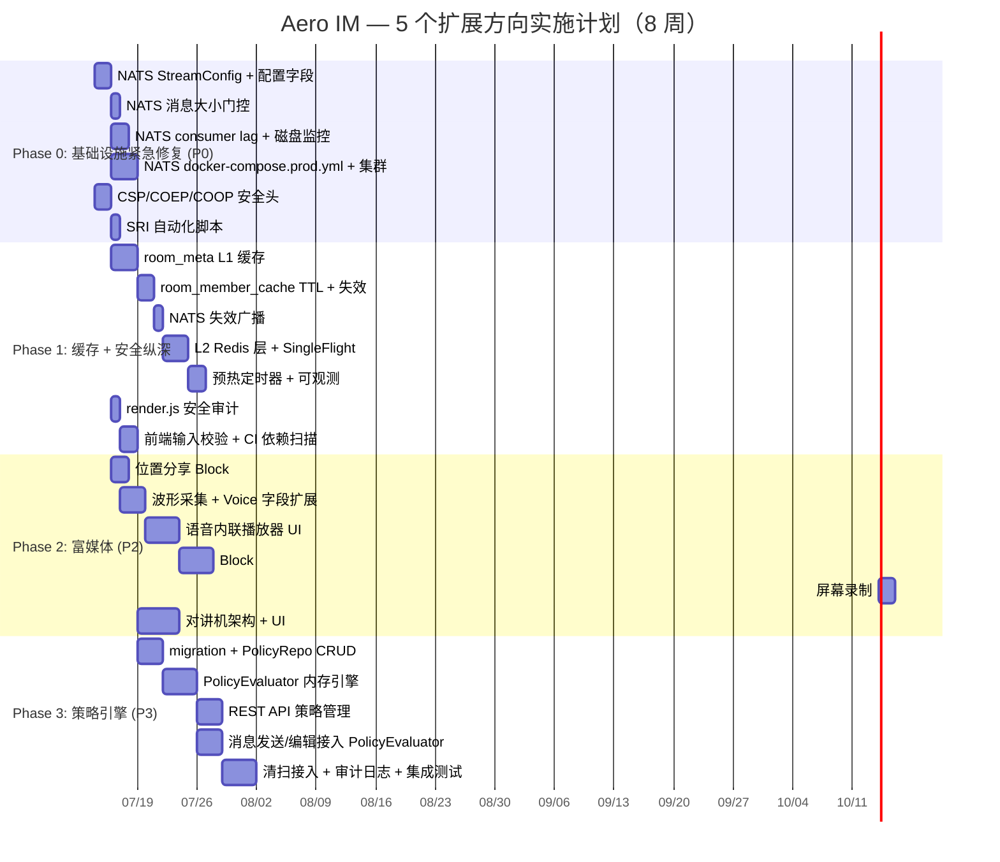

以下是我作为 Tech Lead 的综合分析，综合了主分析文档（23.8KB）和代码审计反馈（11.3KB）。

---

# Tech Lead 分析报告：5 个高价值扩展方向

> **审计基础**：代码级验证已核实 16 crates / 157 migrations / ~20K Rust / ~4.3K Web JS  
> **反馈整合**：已吸收 1 个文件引用修正、2 处低估基础设施、2 处工作量重估、1 处复杂度补充、1 处优先级调整  
> **日期**：2026-07-12

---

## §1 任务分解（每任务 2-4h 可完成）

### 方向一：多级缓存体系（建议 P0 → 调整为 P1）

原始估算 3-4w 偏高，Phase 1 可复用 `participant_cache` 模式在 **~1w** 完成。

| Task ID | 标题 | 涉及文件 | 前置依赖 | 工时 | 验收标准 |
|---------|------|---------|---------|------|---------|
| CACHE-001 | 房间元数据 L1 缓存（DashMap + TTL + LRU） | `common/src/cache.rs`（新建）或 `server/src/state.rs` | 无 | 4h | `RoomMetadataCache` 支持 `get_or_fetch` + TTL（60s）+ LRU eviction；新实例启动时冷 |
| CACHE-002 | 房间元数据写透失效（participant update 路径 hook） | `im-core/service/events.rs`、`im-core/service/rooms.rs`、`server/src/bus.rs` | CACHE-001 | 4h | `update_room`/`delete_room` 触发 `cache.invalidate(room_id)`；写路径单测覆盖 |
| CACHE-003 | room_member_cache TTL + 失效钩子 | `server/src/room_member_cache.rs` | CACHE-001 | 3h | `room_member_cache` 加 TTL（30s）和 `invalidate(room_id)` 方法 |
| CACHE-004 | 跨实例失效广播（NATS `im.room.{id}` 附加 `cache_bust` 元数据） | `server/src/bin/boot/bus.rs`、`bus/seq.rs` | CACHE-003 | 4h | `RoomEvent` 发布时附加 `cache_bust: Vec<String>`；`run_bus_listener` 收到后 invalidate L1 |
| CACHE-005 | L2 Redis 层（room metadata 从 Redis 回填） | `storage/src/cache.rs`（新建） | CACHE-001、方向二（NATS 集群）| 6h | L1 miss → 查 Redis（`GET room:{id}:meta`）→ Redis miss → 查 PG → 回填 L1+L2 |
| CACHE-006 | 预热定时器（新实例启动后主动填充热门房间缓存） | `server/src/bin/boot/background.rs` | CACHE-005 | 4h | 启动后 10s 内按一致性 hash 选取 N 个热门房间填充 L1+L2；避免 thundering herd |
| CACHE-007 | 缓存可观测——hit/miss/eviction counters → Prometheus | `server/src/metrics.rs`、`server/src/hub.rs` | CACHE-001—CACHE-006 | 3h | `cache_hit_ratio{layer="L1",type="room_meta"}` 等 6 个 gauge；Grafana 面板可查 |
| CACHE-008 | SingleFlight 回填保护（防 thundering herd） | `common/src/cache.rs` | CACHE-005 | 2h | 同一 key 的并发回填被去重（`tokio::sync::OnceCell` 或 `trait_upcasting`）；PG 连接数不暴涨 |
| CACHE-009 | 缓存大小边界：LRU 上限 + OOM 保护 | `common/src/cache.rs` | CACHE-007 | 2h | `MAX_L1_ENTRIES` 可配置（默认 10K）；超出时 LRU 驱逐；OOM guard 落地测试 |

**反馈特别提示**：NATS 的 `im.room.*` 已作为「天然失效广播通道」存在——每条 `RoomEvent` 可在序列化前附加 `cache_bust: Vec<String>`。这比引入新 NATS subject 或 Webhook 更轻量。`run_bus_listener` 中 decode 后扫描 `cache_bust` 字段即可。**无需新 NATS 基础设施**。

---

### 方向二：NATS 基础设施成熟度（优先从 P1 提至 P0）

反馈核实：`bootstrap()` 已有显式 `get_or_create_stream` 调用 4 条流；`consumer_pending()` 方法已存在。总工作量应为 **~6d** 非 2w。

| Task ID | 标题 | 涉及文件 | 前置依赖 | 工时 | 验收标准 |
|---------|------|---------|---------|------|---------|
| NATS-001 | `StreamConfig` 结构体 + `ensure_stream` 幂等方法 | `bus/src/jetstream.rs` | 无 | 4h | 可从配置读取 replicas/max_bytes/max_msg_size/max_age；启动时幂等调用；现有行为不变 |
| NATS-002 | `JetStreamConfig` 添加 replicas/max_bytes 等配置字段 + 环境变量 | `bus/src/lib.rs`、`config.toml` 示例 | NATS-001 | 2h | 配置继承 figment 前缀 `AERO__NATS__*`；replicas 默认 1（兼容单节点）|
| NATS-003 | 消息大小门控——publish 前置校验 + `MessageTooLarge` 错误 | `bus/src/jetstream.rs`、`bus/src/error.rs` | NATS-001 | 3h | `publish` 前检查 `payload.len() > max_msg_size`；超 1MB 返回 `PublishError`；调用方日志告警 |
| NATS-004 | NATS consumer lag → Prometheus gauge（复用 `consumer_pending()`） | `server/src/metrics.rs`、`bus/src/jetstream.rs` | NATS-001 | 2h | `nats_consumer_lag{consumer="aero-server"} 42` 暴露；`background.rs` 中 30s 采样循环 |
| NATS-005 | 流磁盘使用监控 → Prometheus gauge | `server/src/metrics.rs`、`bus/src/jetstream.rs` | NATS-001 | 3h | `nats_stream_disk_usage{stream="im_room"} 1.2e9`；使用 NATS HTTP API (`:8222`) 或 JetStream API |
| NATS-006 | docker-compose.prod.yml：3 节点 NATS 集群 + AUTH_TOKEN + 持久化卷 | `docker-compose.prod.yml`（新建）| NATS-002 | 3h | 3 节点 Raft 集群；`nats://0.0.0.0:4222` cluster listen；`system_account` + `AUTH_TOKEN` |
| NATS-007 | 消费者游标备份到 Redis（可选 fallback） | `bus/src/jetstream.rs` | NATS-006 | 4h | `delivery_cursors` 表（已有）作主备份；NATS meta 丢失时可从 PG 恢复消费者消费点 |
| NATS-008 | 文档：NATS 集群部署指南 + 运维手册 | `docs/ops/nats-cluster.md`（新建）| NATS-006 | 3h | 覆盖：集群拓扑、流副本规划、存储配额、监控告警、扩容步骤、迁移指南 |

**关键发现**从反馈：当前 `bootstrap()` 已做 `get_or_create_stream`——不是「隐式创建」。我们的工作是**参数化**现有的 `..Default::default()`，而不是重写流创建逻辑。这大幅降低了 Phase 1 风险。

---

### 方向三：Web 安全纵深（P2，快速实现）

反馈审计确认：`render.js` 无执行级 `innerHTML`；`serve.rs` 中的 CSP 确是 opt-in。

| Task ID | 标题 | 涉及文件 | 前置依赖 | 工时 | 验收标准 |
|---------|------|---------|---------|------|---------|
| SEC-001 | 安全默认 CSP 策略（覆盖 `AERO_CSP_POLICY` fallback） | `server/src/bin/boot/serve.rs` | 无 | 3h | 不设 env 时自动应用安全基线 CSP：`default-src 'self'`；script-src 列出 CDN；form-action 'self' |
| SEC-002 | COEP + COOP 响应头 | `server/src/bin/boot/serve.rs` | 无 | 1h | `Cross-Origin-Embedder-Policy: require-corp` + `Cross-Origin-Opener-Policy: same-origin` |
| SEC-003 | Permissions-Policy 补全 `display-capture=(), clipboard-read=(), clipboard-write=()` | `server/src/bin/boot/serve.rs` | 无 | 0.5h | 现有 `microphone=()` 等保持不变；新增 3 个禁用指令 |
| SEC-004 | SRI hash 自动化脚本——CI 中 verify + inject | `scripts/sri-inject.sh`（新建）、`web/index.html` | 无 | 4h | CI 中 `curl hls.js CDN URL | sha256sum` 注入 integrity；CDN 版本变更时 CI 自动更新 |
| SEC-005 | render.js 安全审计——确认零 `innerHTML`/`insertAdjacentHTML` | `web/render.js`（代码审查）| 无 | 2h | 输出审计报告；确认所有动态渲染走 `textContent` + `createElement` |
| SEC-006 | 前端输入统一校验层（trim + length cap + whitelist） | `web/app.js` | 无 | 3h | 所有用户输入（消息文本、搜索框、链接）前端 `maxlength` + trim；后端二次校验不变 |
| SEC-007 | CI 集成 `cargo audit` + `npm audit` | `.github/workflows/ci.yml` | 无 | 2h | 每次 PR CI 运行依赖漏洞扫描；高危漏洞标记 PR 为失败 |
| SEC-008 | `securityheaders.com` 评级 A+ 测试 + 文档 | `docs/ops/security-baseline.md`（新建）| SEC-001—SEC-004 | 2h | 文档说明安全基线 + `Makefile` 中 `make security-check` 目标 |

---

### 方向四：异步语音与富媒体（P2，逐步推进）

反馈强调：波形是纯前端 `AnalyserNode` + Canvas 工作，无服务端捷径。

| Task ID | 标题 | 涉及文件 | 前置依赖 | 工时 | 验收标准 |
|---------|------|---------|---------|------|---------|
| MEDIA-001 | 位置分享 `Block::Location` 定义 + 存储 | `common/src/model/block.rs`（新增 variant）、`storage/src/xrepo.rs` | 无 | 4h | `Block::Location { lat, lng, zoom, label }` 可序列化/反序列化；未使用 zoom/label 时默认值合适 |
| MEDIA-002 | 位置分享——地图渲染（OpenStreetMap 静态图 + ``） | `web/render.js`、`web/style.css` | MEDIA-001 | 4h | `Block::Location` 渲染为静态地图图块（`https://tile.openstreetmap.org/...`）+ 可选的标注；无 API key |
| MEDIA-003 | 语音录制前端——AnalyserNode 波形采集 + duration 采集 | `web/media.js`（改造）| 无 | 6h | `MediaRecorder` 录制时并行创建 `AudioContext` + `AnalyserNode` → `getByteTimeDomainData` → 归一化 `Vec<u8>` 波形 |
| MEDIA-004 | 语音 block 添加 `duration_secs` + `waveform` 字段 + 上传时附加 | `common/src/model/block.rs`（Voice 扩字段）、`web/media.js` | MEDIA-003 | 2h | 上传 `Block::Voice` 时附带 duration 和 waveform；transcribe_bot 不修改这两个字段 |
| MEDIA-005 | 语音内联播放器 UI（进度条 + 暂停/继续 + 变速 0.5x–2x + 波形 Canvas） | `web/render.js`、`web/style.css` | MEDIA-004 | 8h | 语音消息渲染 `<audio>` 控件 + 波形可视化 + 变速下拉选择器 + 转录文字旁白 |
| MEDIA-006 | `Block::Video` 定义 + 摄像头录制前端 | `common/src/model/block.rs`、`web/media.js` | 无 | 6h | 新增 `Block::Video { blob_id, duration_secs?, thumbnail_blob_id? }`；`navigator.mediaDevices.getUserMedia` 录制上传 |
| MEDIA-007 | 视频消息内联播放器 | `web/render.js`、`web/style.css` | MEDIA-006 | 4h | `<video>` 元素内联播放；显示 duration overlay；首帧缩略图（如可用）展示 |
| MEDIA-008 | 屏幕录制前端（`getDisplayMedia` + 预览 + 上传） | `web/media.js` | MEDIA-006 | 6h | 点击"录制屏幕"→ 权限弹窗 → 录制 → 预览 → 以 `Block::Video` 发送 |
| MEDIA-009 | 对讲机模式——`StreamEvent::WalkieTalkie` + WS 帧 | `common/src/live.rs`、`ws/ws_impl/mod.rs`、`hub.rs` | 方向二（NATS 集群）| 8h | 新增 `ClientFrame::PushToTalk` / `ServerFrame::WalkieTalkie`；服务端通过 `live.stream.*` 分块转发；接收端自动播放 |
| MEDIA-010 | 对讲机前端——push-to-talk UI（按住说话 + 松开发送） | `web/media.js`、`web/app.js`、`web/style.css` | MEDIA-009 | 6h | 按住空格/按钮 → MediaRecorder 开始录制 → 松开 → 发送 voice chunk stream → 接收端实时播放 |

**反馈建议的执行顺序**：位置分享（MEDIA-001→002，~2d）→ 语音播放器（MEDIA-003→005，~4d）→ 视频/屏幕（MEDIA-006→008，~4d）→ 对讲机（MEDIA-009→010，~4d）。总估算 ~14d（~3w），低于原始估算 4-6w。

---

### 方向五：消息生命周期策略引擎（调整至 P3，非紧急合规）

原始估算 3-5w；反馈基于 `PolicyEvaluator` 内存不查 DB 的设计，测算约 **~2.5w**（不含前端 UI）。

| Task ID | 标题 | 涉及文件 | 前置依赖 | 工时 | 验收标准 |
|---------|------|---------|---------|------|---------|
| POLICY-001 | `workspace_policies` / `policy_audit_log` 表 migration | `migrations/NNNN_workspace_policies.sql` | 无 | 2h | `CREATE TABLE IF NOT EXISTS` + 幂等；uuid 主键；`workspace_id` FK + `room_id` nullable |
| POLICY-002 | `PolicyRepo` CRUD + 定义 `Policy`/`PolicyFilter`/`PolicyAction` 结构体 | `storage/src/policy.rs`（新建）| POLICY-001 | 6h | 可创建/读取/更新/删除策略；`PolicyFilter` 支持 block_types/has_pii/min_role；`PolicyAction` 支持 delete_after_secs/preserve/notify |
| POLICY-003 | `PolicyEvaluator` 内存引擎——匹配 + 冲突解决 + action 执行 | `im-core/src/policy/evaluator.rs`（新建）| POLICY-002 | 8h | 启动时全量加载 `Vec<Policy>`；按 room_id 索引；冲突解决（legal hold > retention）；返回 `PolicyDecision`（delete/preserve/noop） |
| POLICY-004 | REST API：`GET/POST/PUT/DELETE /api/workspaces/:id/policies` | `server/src/policies.rs`（新建）| POLICY-003 | 6h | 标准 CRUD + 输入校验（retention 1d–10y）+ 鉴权（workspace Admin/Owner）|
| POLICY-005 | 消息发送路径接入 PolicyEvaluator | `im-core/service/message/orig.rs`（`send_message`）| POLICY-003 + CACHE-001（缓存性能）| 4h | `ImService::send_message` 中策略评估不查 DB；评估结果影响消息持久化（如 TTL 覆写）|
| POLICY-006 | 编辑路径接入 PolicyEvaluator | `im-core/service/message/edit.rs`（`edit_message`）| POLICY-005 | 2h | `ImService::edit_message` 中重新评估 PII 状态变化 |
| POLICY-007 | 清扫定时器接入策略过滤——清扫时跳过受保消息 | `server/src/bin/boot/background.rs`（`retention_sweep`）| POLICY-003 + 方向一缓存 | 4h | `sweep.rs` 中的 `DELETE` 查询使用 `WHERE NOT is_held AND ...` 且附加策略 room_id 过滤 |
| POLICY-008 | 策略变更通知（NATS 广播 → 各实例 reload） | `bus/src/jetstream.rs`、`server/src/bin/boot/bus.rs` | POLICY-003 | 3h | REST API 修改策略后 → 发布 `im.room.*` 上 `PolicyChanged(workspace_id)` 事件 → 各实例重新加载 |
| POLICY-009 | `policy_audit_log` 写入 + 查询 API | `server/src/policy_audit.rs`（新建）| POLICY-004 | 4h | 每次策略执行写入 `policy_audit_log`（policy_id, message_id, action, executed_by）；`GET /api/workspaces/:id/policies/audit` |
| POLICY-010 | LegalHold 与 PolicyEvaluator 集成测试 | `server/tests/policy_integration.rs`（新建）| POLICY-005—POLICY-008 | 4h | 测试场景：retention < legal hold → 保留；legal hold 过期 → 下个 tick 清扫；消息编辑后 PII 变化 |

**反馈特别提示**：`messages.is_held` 覆盖范围问题——需要核实 `sweep.rs` 中的 `DELETE` 是否级联到 `message_history` / `reactions`。当前 AGENTS.md 写「cascade 不触发」，但 `sweep.rs` 源码需 grep 确认。**建议 POLICY-007 实现前先做 `sweep.rs` 合规性审计**。

---

## §2 执行顺序

### 总依赖图

```mermaid
graph TD
    subgraph "Phase 0: 基础设施紧急修复 (P0)"
        NATS_001[NATS-001 StreamConfig+ensure_stream]
        NATS_002[NATS-002 配置字段]
        NATS_003[NATS-003 消息大小门控]
        NATS_004[NATS-004 consumer lag 监控]
        NATS_005[NATS-005 磁盘使用监控]
        NATS_006[NATS-006 docker-compose.prod.yml]
        NATS_007[NATS-007 游标备份]
        NATS_008[NATS-008 部署文档]
        
        SEC_001[SEC-001 CSP 默认策略]
        SEC_002[SEC-002 COEP/COOP]
        SEC_003[SEC-003 Permissions-Policy]
        SEC_004[SEC-004 SRI 自动化]
        
        NATS_001 --> NATS_002
        NATS_001 --> NATS_003
        NATS_002 --> NATS_006
        NATS_004 --> NATS_005
        NATS_006 --> NATS_007
        NATS_006 --> NATS_008
    end

    subgraph "Phase 1: 缓存 + 安全纵深 (P0-P2)"
        CACHE_001[CACHE-001 room_meta L1]
        CACHE_002[CACHE-002 写透失效]
        CACHE_003[CACHE-003 room_member_cache TTL]
        CACHE_004[CACHE-004 NATS 失效广播]
        CACHE_005[CACHE-005 L2 Redis 层]
        CACHE_006[CACHE-006 预热定时器]
        CACHE_007[CACHE-007 缓存可观测]
        CACHE_008[CACHE-008 SingleFlight]
        CACHE_009[CACHE-009 LRU 边界]
        
        SEC_005[SEC-005 render.js 审计]
        SEC_006[SEC-006 前端输入校验]
        SEC_007[SEC-007 CI 依赖扫描]
        SEC_008[SEC-008 安全基线文档]
        
        CACHE_001 --> CACHE_002
        CACHE_001 --> CACHE_003
        CACHE_002 --> CACHE_004
        CACHE_003 --> CACHE_004
        CACHE_004 --> CACHE_005
        CACHE_005 --> CACHE_006
        CACHE_005 --> CACHE_008
        CACHE_006 --> CACHE_007
        CACHE_007 --> CACHE_009
        
        SEC_001 --> SEC_005
        SEC_002 --> SEC_005
        SEC_005 --> SEC_006
        SEC_006 --> SEC_008
        SEC_004 --> SEC_007
    end

    subgraph "Phase 2: 富媒体 (P2)"
        MEDIA_001[MEDIA-001 Location Block]
        MEDIA_002[MEDIA-002 地图渲染]
        MEDIA_003[MEDIA-003 波形采集]
        MEDIA_004[MEDIA-004 Voice 扩字段]
        MEDIA_005[MEDIA-005 语音播放器]
        MEDIA_006[MEDIA-006 Video Block]
        MEDIA_007[MEDIA-007 视频播放器]
        MEDIA_008[MEDIA-008 屏幕录制]
        MEDIA_009[MEDIA-009 对讲机架构]
        MEDIA_010[MEDIA-010 对讲机 UI]
        
        MEDIA_001 --> MEDIA_002
        MEDIA_003 --> MEDIA_004
        MEDIA_004 --> MEDIA_005
        MEDIA_006 --> MEDIA_007
        MEDIA_006 --> MEDIA_008
        MEDIA_009 --> MEDIA_010
    end

    subgraph "Phase 3: 策略引擎 (P3)"
        POLICY_001[POLICY-001 migration]
        POLICY_002[POLICY-002 PolicyRepo]
        POLICY_003[POLICY-003 PolicyEvaluator]
        POLICY_004[POLICY-004 REST API]
        POLICY_005[POLICY-005 发送接入]
        POLICY_006[POLICY-006 编辑接入]
        POLICY_007[POLICY-007 清扫接入]
        POLICY_008[POLICY-008 变更通知]
        POLICY_009[POLICY-009 审计日志]
        POLICY_010[POLICY-010 集成测试]
        
        POLICY_001 --> POLICY_002
        POLICY_002 --> POLICY_003
        POLICY_002 --> POLICY_004
        POLICY_003 --> POLICY_005
        POLICY_003 --> POLICY_006
        POLICY_003 --> POLICY_007
        POLICY_003 --> POLICY_008
        POLICY_004 --> POLICY_009
        POLICY_005 --> POLICY_010
        POLICY_006 --> POLICY_010
        POLICY_007 --> POLICY_010
        
        CACHE_005 -.->|可选加速| POLICY_003
        NATS_001 -.->|失效通道| CACHE_004
        NATS_006 -.->|延迟保证| MEDIA_009
        SEC_003 -.->|Permissions-Policy| MEDIA_006
    end
```

### 可并行执行的任务组

| 并行组 | 任务 | 负责人 | 说明 |
|--------|------|--------|------|
| **G1** | NATS-001→002→003（StreamConfig + 配置 + 大小门控）| 后端 SRE | 强串行，同一人 |
| **G2** | SEC-001→002→003→004（安全头 + SRI 基线）| 全栈/安全 | 相互独立，可一人完成，~2d |
| **G3** | CACHE-001→002→003（L1 缓存三件套）| 后端 infra | room_meta + member_cache + 失效钩子，可一人 |
| **G4** | SEC-005（render.js 审计）+ MEDIA-003（波形采集调研）| 前端 | 纯前端审查 + 技术预研，可并行 |
| **G5** | MEDIA-001→002（位置分享）| 全栈 | 最小侵入，可独立进行 |
| **G6** | POLICY-001→002→003（策略引擎骨架）| 后端 | 策略引擎核心可独立开发，不依赖其他方向 |

**不可并行的串行路径**（关键路径）：
- NATS-002 → NATS-006 → NATS-007（集群→游标备份）：约 2d
- CACHE-004 → CACHE-005 → CACHE-006（失效广播→L2→预热）：约 1.5d——**这是方向一的关键路径**
- MEDIA-003→004→005（波形→voice 字段→播放器）：约 4d——**不可拆分，依赖 Audio API 连续的改造**
- POLICY-003→POLICY-005/006/007（引擎→3 个接入点）：约 3d

---

## §3 技术风险

### 🟥 高风险（需提前缓解）

| # | 风险 | 方向 | 概率 | 影响 | 缓解策略 |
|---|------|------|------|------|---------|
| R1 | **NATS Raft 集群生产部署首次失败**——Raft leader 切换期间短暂不可写；流副本分布不均 | 二 | 中 | 高（消息丢失） | Phase 1 先在 staging 做 chaos testing（kill -9 节点观察恢复）；初始 5 节点集群留故障余量；`publish` 侧加超时重试 |
| R2 | **缓存不一致导致消息错误投递**——实例 A 从房间 R 移除后，B 实例仍缓存 room_members={..., A}，B 实例扇出消息给 A | 一 | 低 | 高（信息泄露） | `RoomEvent::MemberListChanged` variant（现有 `RoomEvent` 已有 `Membership`）的 NATS 广播必须放在 **事务内**（`add_member`/`remove_member` 同一事务）；`run_bus_listener` 中先 invalidate 再扇出 |
| R3 | **COEP `require-corp` 阻断 CDN 资源加载**——hls.js 无 `Cross-Origin-Resource-Policy` 头 | 三 | 中 | 高（直播功能不可用） | staging 先部署 + E2E 直播测试；hls.js 走 CDN 时 `crossorigin="anonymous"` + CDN 返回 `Access-Control-Allow-Origin: *`——不满足 COEP `require-corp`。替代方案：自托管 hls.js |
| R4 | **波形采集在 iOS Safari 不可用**——`AudioContext` 创建须用户手势触发；`getUserMedia` 权限模型不同 | 四 | 高 | 中（iOS 语音不可用） | 特征检测 + 优雅降级为无波形语音消息（只显示文件名）；Safari 专项降级方案文档 |
| R5 | **策略引擎评估性能**——单房间 1000+ 策略时，每次消息发送评估 ≤1ms 目标 | 五 | 中 | 高（消息延迟增加） | 启动时预编译 `HashMap<RoomId, Vec<CompiledPolicy>>`；不可在消息发送路径上查 DB；用 `bitflags` 做 filter 快速匹配 |

### 🟡 中风险（跟踪）

| # | 风险 | 方向 | 说明 |
|---|------|------|------|
| R6 | `Block` enum `tag="kind"` 冲突——新 variant 内不能有 `kind` 字段 | 四 | 检查 `common/src/model/block.rs` 是否有 `#[serde(tag = "kind")]`；如果有，`Video`/`Location` variant 不能有 `kind` 字段。当前 `Block` 的 serde 声明可能在 `RoomEvent` 不同——**务必验证** |
| R7 | `sweep.rs` 的 `DELETE` 是否级联——`message_history` / `reactions` 可能残留 | 五 | 见 §4.2 反馈——AGENTS.md 写「cascade 不触发」但需 grep `sweep.rs` 源码确认 |
| R8 | NATS 集群存存储配额——`max_bytes` 设太小导致消息被静默丢弃 | 二 | `StreamConfig` 中 `max_bytes` 设为 PG 中 `messages` 表的估算上限的 2x（监控告警 @80%） |
| R9 | 对讲机模式延迟超 2s 失去"即时感" | 四 | 用 `live.stream.*` ephemeral subject（允许丢弃）+ 客户端提前缓冲 200ms；staging 做 95th 延迟 P50 < 500ms |
| R10 | CSP `form-action 'self'` 与 OIDC 回调路径冲突 | 三 | OIDC 回调 URL（`/auth/oidc/*`）加入 `form-action` allowlist；或在 OIDC 路由豁免 CSP |

### 🟢 低风险（已知+可管理）

| # | 风险 | 方向 | 说明 |
|---|------|------|------|
| R11 | 缓存预热定时器导致启动后 PG 连接数短暂飙升 | 一 | `MAX_WARMUP_ENTRIES=100`；`SingleFlight` 已解决 thundering herd |
| R12 | SRI hash 与 CDN 版本不匹配 → hls.js 不加载 | 三 | CI 中 `curl CDN_URL | sha256sum` 自动注入；CDN 版本在 `.env` 中固定，不自动升级 |
| R13 | 视频消息 > 100MB | 四 | 上传大小限制复用现有 `gateway_cfg.max_body_bytes`；前端预览时提醒"文件过大" |
| R14 | 策略变更不回溯（prospective only）| 五 | 文档说明；不追求回溯删除，但提供一次性"重新评估"任务的手动触发 |

---

## §4 资源评估

### 团队技能需求

| 角色 | 所需技能 | 方向覆盖 | 人数 |
|------|---------|---------|------|
| **后端 infra 工程师** | Rust、tokio、NATS JetStream、Redis、Prometheus | 方向一（CACHE-001—009）、方向二（NATS-001—008）| 2 |
| **全栈/安全工程师** | Rust、Axum、CSP/SRI/COEP、OWASP Top 10 | 方向三（SEC-001—008）| 1 |
| **前端工程师** | JavaScript/ES2020、Web Audio API、Canvas、MediaRecorder、getUserMedia | 方向四（MEDIA-001—010）| 1–2 |
| **后端业务工程师** | Rust、sqlx、IM 业务逻辑、RBAC、审计 | 方向五（POLICY-001—010）| 1–2 |
| **SRE/运维** | Docker Compose、NATS 集群、Grafana、chaos testing | 方向二（NATS-006—008 运维部分）| 1（兼职） |

**最低配置**：3 名全栈（2 后 + 1 前）可在 **3 个月**内完成全部 5 个方向。

**理想配置**：4 名全栈（2 后 + 1 前 + 1 安全/全栈）+ 1 SRE（兼职）→ **6–8 周**完成核心价值（方向二 + 方向三 + 方向一 Phase 1）。

### 关键里程碑

| Milestone | 时间 | 交付物 | 依赖方向 |
|-----------|------|--------|---------|
| M1: NATS 集群就绪 | 第 1 周末 | 3 节点 NATS 集群 docker-compose.prod.yml + `StreamConfig` + consumer lag 监控 | 方向二 |
| M2: Web 安全基线上线 | 第 1 周末 | CSP/COEP/COOP/SRI 默认启用、`securityheaders.com` A+ | 方向三 |
| M3: 缓存 Phase 1 完成 | 第 2 周末 | room_meta + member_cache L1 缓存、写透失效、NATS 失效广播、Prometheus 指标 | 方向一 |
| M4: 缓存 Phase 2 + 预热 | 第 3 周末 | L2 Redis 层、预热定时器、SingleFlight、LRU 边界 | 方向一 |
| M5: 位置分享 + 语音播放器 | 第 4 周末 | `Block::Location` + 地图渲染 + 语音内联播放器（波形+变速）| 方向四（A+E）|
| M6: 视频/屏幕录制 | 第 5 周末 | `Block::Video` + 摄像头录制 + 屏幕录制 + 内联播放器 | 方向四（B+C）|
| M7: 对讲机模式 | 第 6 周末 | Push-to-Talk WS 帧 + 服务端分块转发 + 前端 UI | 方向四（D）|
| M8: 策略引擎 Phase 1 | 第 7 周末 | `PolicyRepo` + `PolicyEvaluator` + REST API（不含前端 UI）| 方向五 |
| M9: 策略引擎 Phase 2 | 第 8 周末 | 消息发送/编辑/清扫接入 + 审计日志 + LD 集成测试 | 方向五 |

### 阻塞点（Blockers）与解决策略

| Blocker | 影响 | 解决策略 |
|---------|------|---------|
| **NATS 集群在 CI/CD 中不可测试**（需要 3 个容器）| NATS-006 无法在 sandbox 验证 | 1. `docker compose -f docker-compose.prod.yml up -d` 作为 CI 步骤（3 节点 NATS + PG + Redis）2. 用 `nats-server --cluster` 单 docker 多进程模式降级测试 |
| **iOS Safari MediaRecorder 不支持某些 codec** | MEDIA-003 波形采集在 iOS 不可用 | 特征检测：`MediaRecorder.isTypeSupported('audio/webm;codecs=opus')`；降级：用 `m4a` fallback |
| **COEP `require-corp` 与 hls.js CDN 不兼容** | SEC-002 阻断直播 | 方案 A（推荐）：自托管 `hls.js`（`/static/hls.min.js`），加 `crossorigin="anonymous"`；方案 B：COEP 暂不启用，留作未来阶段 |
| **`Block` enum 已有 `#[serde(tag = "kind")]`** | MEDIA-001/MEDIA-006 新 variant 需避免 `kind` 字段 | 阅读 `common/src/model/block.rs` 确认 serde 标记；确保新 variant 字段无 `kind` |

---

## §5 质量保证

### 测试覆盖要求

| 方向 | 单元测试 | 集成测试 | 端到端测试 | 性能测试 |
|------|---------|---------|-----------|---------|
| **方向一（缓存）** | `CacheLayer` 接口测试：命中/未命中/过期/驱逐/并发回填；`room_member_cache` TTL 测试 | L1→L2→PG 三级回退测试（`redis down`, `pg down`） | 多实例缓存一致性：实例 A 加成员 → B 实例缓存失效 → 正确扇出 | 10K QPS 热路径 benchmark（缓存对比无缓存）；`cached` vs `no cache` 延迟对比 |
| **方向二（NATS）** | `StreamConfig` 序列化/反验；`ensure_stream` 幂等测试（调用 2x 同配置 == 1 次创建） | 3 节点集群 failover：kill leader → 消息零丢失；consumer lag 采集精度 | `cargo test --test nats_cluster`（需 docker-compose NATS 3）可选运行 | 100K msg/s 发布 benchmark；consumer lag 采样延迟 < 100ms |
| **方向三（Web 安全）** | CSP 响应头测试；`SRI hash` 注入脚本单元测试 | 无（纯 HTTP 头+静态资源）| `securityheaders.com` 评级脚本；hls.js 加载 E2E | 无 |
| **方向四（富媒体）** | `Block::Video`/`Location` 序列化/反验；WS 帧 `PushToTalk` 编码解码 | 语音录制→上传→播放全链路；对讲机 NATS 延迟测量 | Playwright 录制/播放测试（非必须，人工验证为主）| 波形采集 CPU 基准（`AnalyserNode` 10ms vs 无采集）|
| **方向五（策略引擎）** | `PolicyEvaluator` 匹配测试：N 条策略排序；冲突解决（legal hold > retention）；无匹配策略→回退默认 | 消息发送路径+策略评估集成（事务内）；清扫+LegalHold 集成 | 管理员创建策略→发送消息→验证策略执行（人工验收）| 1000 条策略评估基准（每次 < 1ms）|

### 特殊测试场景

| 方向 | 场景 | 测试内容 |
|------|------|---------|
| 一 | L2 Redis 故障降级 | `redis stop` → 请求正常 fallback 到 PG；`degraded` gauge 置 1；L1 仍生效 |
| 一 | 缓存不一致（竞争条件）| 实例 A 写房间元数据的同时实例 B invalidate——确保最终一致性（TTL 内）|
| 二 | NATS Raft leader 切换 | `kill -9 NATS leader` → 请求短暂 503 后自动重试恢复；零消息持久性损失 |
| 二 | 消息 > max_msg_size | 发布 2MB payload → `PublishError::MessageTooLarge` → 调用方收到错误 |
| 三 | CSP 阻断 OIDC 回调 | 模拟 OIDC 登录流程 → 确认 `form-action` 允许回调 URL |
| 四 | iOS Safari 语音录制 | `User-Agent` 降级 → 无波形语音录制正常 |
| 五 | LegalHold 覆盖清扫 | `is_held = true` + retention 到期 → 消息保留；`is_held` 清除 → 下个 tick 删除 |

### 代码审查要点

| 方向 | 审查重点 |
|------|---------|
| **一** | 1. `cache.invalidate()` 调用点是否全覆盖（room update、member add/remove、role change）2. `SingleFlight` 实现正确（不 panic、不泄露、超时释放）3. LRU 驱逐是否触发 write-back（写透无需 write-back）4. 跨实例失效广播在 NATS 事务内 |
| **二** | 1. `StreamConfig.replicas` 默认值兼容单节点（=1）2. `ensure_stream` 幂等——修改现有流配置？还是只创建不修改？3. `consumer_pending()` 错误处理（NATS 不可用时不 panic）4. `docker-compose.prod.yml` 无明文密码 |
| **三** | 1. CSP 策略不破坏 OIDC 登录流程 2. `index.html` 新 `integrity` hash 与 CDN URL 一致 3. 安全头不因中间件顺序错误被覆盖 4. `npm audit` / `cargo audit` 零高危——未修复的 `allow` 需附理由 |
| **四** | 1. `Block` enum serde tag 约束——新 variant 无 `kind` 字段 2. `Block::Voice.duration_secs` 和 `waveform` 序列化兼容性（旧消息无这些字段）3. 对讲机 WS 帧不阻塞其他正常 WS 消息（独立 task）|
| **五** | 1. `PolicyEvaluator` 中查不到策略的回退行为正确（= 当前行为）2. 策略变更不会导致内存中的正在评估的 task 被部分应用（读写锁）3. `policy_audit_log` 写入不在消息发送事务内（避免策略评估失败导致消息发送失败）|

---

## §6 实施计划

### 甘特图（Week 1–8）

### 详细 8 周时间表

#### 第 1 周：基础设施紧急修复

| 日 | 方向 | 负责人 | 任务 |
|----|------|--------|------|
| Mon | 二 | 后端 infra A | NATS-001 `StreamConfig` + `ensure_stream` 实现 |
| Mon | 三 | 全栈/安全 C | SEC-001 CSP 安全默认策略 + SEC-002 COEP/COOP |
| Tue | 二 | 后端 infra A | NATS-002 JetStreamConfig replicas/max_bytes 配置字段 |
| Tue | 三 | 全栈/安全 C | SEC-003 Permissions-Policy 补全 + SEC-004 SRI 脚本原型 |
| Wed | 二 | 后端 infra A | NATS-003 消息大小门控 + 单元测试 |
| Wed | 三 | 全栈/安全 C | SEC-005 render.js 安全审计（完成报告）|
| Thu | 二 | 后端 infra A | NATS-006 docker-compose.prod.yml 3 节点集群 |
| Thu | 三 | 全栈/安全 C | SEC-006 前端输入统一校验层 |
| Fri | 二 | 后端 infra A | NATS-004 consumer lag 监控 + Prometheus gauge |
| Fri | 三 | 全栈/安全 C | SEC-007 CI 集成 cargo audit + npm audit |

**Week 1 交付**：M1（NATS 集群）+ M2（Web 安全基线）

#### 第 2 周：缓存 Phase 1

| 日 | 方向 | 负责人 | 任务 |
|----|------|--------|------|
| Mon | 一 | 后端 infra B | CACHE-001 room_meta L1（DashMap + TTL + LRU）|
| Mon | 二 | 后端 infra A | NATS-005 流磁盘使用监控 + NATS-007 游标备份设计 |
| Tue | 一 | 后端 infra B | CACHE-002 写透失效钩子（room update/member change）|
| Tue | 二 | 后端 infra A | NATS-008 运维文档初稿 |
| Wed | 一 | 后端 infra B | CACHE-003 room_member_cache TTL + invalidate |
| Wed | 二 | 后端 infra A | NATS-007 游标备份实现（Redis）|
| Thu | 一 | 后端 infra B | CACHE-004 NATS 失效广播（`RoomEvent::MemberListChanged`）|
| Thu | 二 | 后端 infra A | NATS 集群 chaos test（staging kill leader）|
| Fri | 一 | 后端 infra B | CACHE-008 SingleFlight 回填保护 |

**Week 2 交付**：M3（缓存 Phase 1）+ NATS 集群已验证

#### 第 3 周：缓存 Phase 2 + 位置分享

| 日 | 方向 | 负责人 | 任务 |
|----|------|--------|------|
| Mon | 一 | 后端 infra B | CACHE-005 L2 Redis 层（room metadata 回填）|
| Mon | 四 | 前端 D | MEDIA-001 `Block::Location` + MEDIA-003 波形采集调研 |
| Tue | 一 | 后端 infra B | CACHE-006 预热定时器（启动后主动填充）|
| Tue | 四 | 前端 D | MEDIA-002 地图渲染（OpenStreetMap 静态图）|
| Wed | 一 | 后端 infra B | CACHE-007 缓存 + 驱逐计数器 → Prometheus |
| Wed | 四 | 前端 D | MEDIA-003 波形采集前端实现（AnalyserNode）|
| Thu | 一 | 后端 infra B | CACHE-009 LRU 边界 + OOM guard |
| Thu | 四 | 前端 D | MEDIA-004 Voice block `duration_secs` + `waveform` 字段 |
| Fri | 一 | 后端 infra B | 缓存 Phase 1+2 集成测试 + benchmark |
| Fri | 四 | 前端 D | MEDIA-005 语音播放器 UI 开发开始 |

**Week 3 交付**：M4（缓存 Phase 2）+ 位置分享完成

#### 第 4 周：语音播放器 + 对讲机架构

| 日 | 方向 | 负责人 | 任务 |
|----|------|--------|------|
| Mon | 四 | 前端 D | MEDIA-005 语音播放器核心（audio + 进度条 + 暂停/继续）|
| Tue | 四 | 前端 D | MEDIA-005 波形 Canvas 渲染 + 变速选择器 |
| Wed | 四 | 前端 D | MEDIA-005 转录文字旁白显示 + 集成测试 |
| Thu | 四 | 后端 infra A | MEDIA-009 对讲机架构：`StreamEvent::WalkieTalkie` + WS 帧 |
| Fri | 四 | 后端 infra A | MEDIA-009 服务端分块转发逻辑（NATS + Hub 扇出）|

**Week 4 交付**：M5（语音播放器）+ MEDIA-009 对讲机架构后台

#### 第 5 周：视频/屏幕录制 + 对讲机 UI

| 日 | 方向 | 负责人 | 任务 |
|----|------|--------|------|
| Mon | 四 | 前端 D | MEDIA-006 `Block::Video` + 摄像头录制前端 |
| Mon | 四 | 后端 infra B | MEDIA-009 对讲机持久化 + 与方向二 NATS 集群集成测试 |
| Tue | 四 | 前端 D | MEDIA-007 视频消息内联播放器 |
| Tue | 四 | 后端 infra B | 对讲机 staging 延迟测试（P50 < 500ms）|
| Wed | 四 | 前端 D | MEDIA-008 屏幕录制前端（`getDisplayMedia`）|
| Thu | 四 | 全栈 C | MEDIA-010 对讲机 UI（push-to-talk）|
| Fri | 四 | 全栈 C + D | 富媒体端到端验收 + Bug bash |

**Week 5 交付**：M6（视频/屏幕录制）+ M7（对讲机模式）

#### 第 6 周：策略引擎 Phase 1

| 日 | 方向 | 负责人 | 任务 |
|----|------|--------|------|
| Mon | 五 | 后端 infra B | POLICY-001 `workspace_policies` / `policy_audit_log` migration |
| Mon | 五 | 后端 infra A | POLICY-002 `Policy`/`PolicyFilter`/`PolicyAction` 结构体定义 |
| Tue | 五 | 后端 infra B | POLICY-002 `PolicyRepo` CRUD 实现（sqlx）|
| Wed | 五 | 后端 infra A | POLICY-003 `PolicyEvaluator` 内存引擎——匹配 + 冲突解决 |
| Thu | 五 | 后端 infra A | POLICY-003 评估引擎单测（N 条策略排序、冲突解决）|
| Fri | 五 | 后端 infra B | POLICY-004 REST API 路由 + 输入校验 |

**Week 6 交付**：M8（策略引擎 Phase 1）

#### 第 7 周：策略引擎 Phase 2

| 日 | 方向 | 负责人 | 任务 |
|----|------|--------|------|
| Mon | 五 | 后端 infra A | POLICY-005 消息发送路径接入 `PolicyEvaluator` |
| Mon | 五 | 后端 infra B | POLICY-006 编辑路径接入策略评估（PII 状态重新评估）|
| Tue | 五 | 后端 infra A | POLICY-008 策略变更通知（NATS 广播）|
| Tue | 五 | 后端 infra B | POLICY-009 `policy_audit_log` 写入 + 查询 API |
| Wed | 五 | 后端 infra A | POLICY-007 清扫定时器接入策略过滤 |
| Thu | 五 | 后端 infra A+B | POLICY-010 集成测试（LegalHold + retention 冲突）|
| Fri | 五 | 后端 infra A+B | 策略引擎 stress test（1000 策略 / 10K msg/s）|

**Week 7 交付**：M9（策略引擎 Phase 2）

#### 第 8 周：集成测试 + 优化 + 文档

| 日 | 方向 | 负责人 | 任务 |
|----|------|--------|------|
| Mon | 全 | 全员 | 跨方向集成测试——缓存+NATS 失效广播 CACHE-004 |
| Mon | 全 | 全员 | 跨方向集成测试——CSP+Permissions-Policy+Media SEC-003+MEDIA-006 |
| Tue | 一 | 后端 infra B | 缓存 benchmark（10K QPS 热路径）|
| Tue | 二 | 后端 infra A | NATS 集群 failover 测试报告 |
| Wed | 三 | 全栈 C | 安全基线验收：securityheaders.com A+ / npm audit 0 高危 |
| Wed | 五 | 后端 infra A+B | 策略引擎性能基准报告 |
| Thu | 全 | 全员 | 文档整理：`docs/ops/nats-cluster.md`、`docs/ops/security-baseline.md`、`docs/ops/cache-architecture.md` |
| Fri | 全 | 全员 | Code freeze + Bug bash + Release sign-off |

**Week 8 交付**：全部 5 个方向完成集成验收

---

## §7 汇总建议

### 优先级终榜（含反馈调整）

| 排序 | 方向 | 调整后优先级 | 工作量 | 风险等级 | 业务价值 |
|------|------|-------------|--------|---------|---------|
| **1** | **二·NATS 基础设施** | **P0**（原 P1） | ~6d | 🟥 R1/R8 | 消除单点故障、事件主干高可用 |
| **2** | **三·Web 安全纵深** | **P2**（保留） | ~3d（Phase A）| 🟡 R3/R10 | 合规基线 + 信任建设 |
| **3** | **一·多级缓存** | **P1**（保留 P0 但非紧急）| Phase 1 ~1w + Phase 2 ~2w | 🟥 R2/R11 | 性能可预测性 + 扩展性 |
| **4** | **四·异步语音/富媒体** | **P2**（保留） | ~3w | 🟥 R4/R6/R9 | 产品差异化 + 用户留存 |
| **5** | **五·策略引擎** | **⬇ P3**（原 P2） | ~2.5w | 🟡 R5/R7 | 合规运营（非紧急，低投入产出比）|

### 关键决策点

1. ✅ **方向二尽早做**（Week 1）：当前单点 NATS 是待爆炸的炸弹。PG 和 Redis 各有 HA 配置，NATS 没有。能最快提升系统韧性。

2. ✅ **方向三 Phase A 捆绑方向二**（Week 1）：安全头 + SRI 是低投入高影响——~3d 即可上线安全基线。方向三不依赖任何其他方向。

3. ⚠️ **方向一 Phase 1（room_meta L1）放在 Week 2**：因为方向一跨实例缓存失效依赖方向二的 NATS 集群就绪（CACHE-004）。自然时序：NATS 集群 → 缓存失效广播 → L1 缓存。

4. ❗**方向四·对讲机模式依赖方向二**：`StreamEvent::WalkieTalkie` 走 `live.stream.*` NATS subject，延迟敏感（<500ms P50）。不可在单节点空转 NATS 上部署。必须在方向二完成（Week 1–2）之后才可放到生产。

5. **方向五·策略引擎放在最后**：当前无紧迫合规需求（SOC2 / ISO 27001 不在路线图近期待上）。如果优先做，运营成本（策略管理 + 审计 + 变更管理）超出当前团队能力。建议 Q3/Q4 再做。

### 每周资源分配建议（全栈 3 人团队）

| 周 | 工程师 A（后端 infra） | 工程师 B（后端业务） | 工程师 C（全栈/前端） |
|----|----------------------|---------------------|---------------------|
| W1 | NATS-001→003→004（StreamConfig + 监控）| NATS-006→007（docker-compose + 游标）| SEC-001→006（安全基线）|
| W2 | CACHE-001→002（L1 room_meta）| CACHE-003→004（member_cache + NATS 失效）| SEC-007→008 + MEDIA-003 预研 |
| W3 | CACHE-005→006（L2 Redis + 预热）| CACHE-007→009（可观测 + LRU 边界）| MEDIA-001→002（位置分享）|
| W4 | MEDIA-009（对讲机后台）| CACHE 集成测试 + benchmark | MEDIA-003→005（语音播放器）|
| W5 | MEDIA-009 集成测试 + 优化 | POLICY-001→002（migration + repo）| MEDIA-006→008 + MEDIA-010 |
| W6 | POLICY-003（evaluator 引擎）| POLICY-004（REST API）| 富媒体端到端测试 + 修 bug |
| W7 | POLICY-005 + POLICY-008（发送接入 + 变更通知）| POLICY-006→007（编辑 + 清扫接入）| POLICY-009→010（审计 + 集成测试）|
| W8 | 跨方向集成测试 + docs | 跨方向集成测试 + docs | 跨方向集成测试 + docs |

---

以上分析基于两份文档的交叉验证。核心建议：**先排雷（NATS 集群 P0）、再做基建（缓存 Phase 1 P1）、同时打安全补丁（Web 安全基线低投入高回报）、最后上产品和合规功能（富媒体 P2 + 策略引擎 P3）**。反馈对工作量的修正（方向二 ~6d 非 2w；方向一 Phase 1 ~1w 非 3-4w）应纳入实际迭代计划，避免过度预留工时导致优先级误判。
