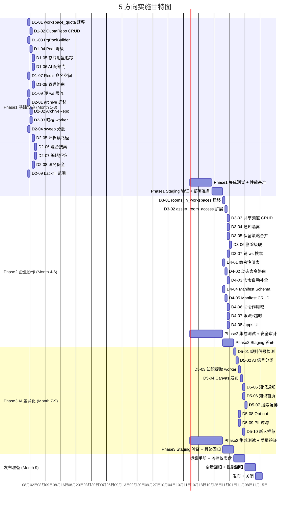

已完整阅读文档。下面从 Tech Lead 视角输出结构化分析。

---

# Tech Lead 分析报告：5 个战略性扩展方向

> **文档**: `docs/requirements/2026-07-11-five-underestimated-strategic-directions.md`
> **基线**: `master` (2026-07-11)
> **总预估**: 5 方向全量约 **8–9 个月**（3 人并行团队）

---

## 1. 任务分解

### 方向 D1：多租户隔离 (Phase 1 — P0)

| 任务 ID | 标题 | 涉及文件 | 前置 | 工时 | 验收标准 |
|---------|------|----------|------|------|----------|
| D1-01 | 设计 `workspace_quota` 表 + 迁移 | `migrations/NNNN_workspace_quota.sql`, `aero-storage/src/quota.rs` | — | 3h | CREATE TABLE 含 `ai_tokens_per_month`, `storage_bytes`, `active_users_max`, `overrides JSONB`；`aero-storage/db.rs::migrate()` 能跑过 |
| D1-02 | 实现 `WorkspaceQuotaRepo` CRUD | `aero-storage/src/quota.rs`, `aero-storage/src/lib.rs` | D1-01 | 3h | 4 方法: `get`, `upsert`, `list`, `delete`；`#[ignore]` db_test 通过 |
| D1-03 | 实现每工作区连接池隔离 `PgPoolBuilder` | `aero-server/src/boot/persistence.rs` | — | 4h | `PgPoolBuilder` 维护 `HashMap<WorkspaceId, Pool>`；lazy-init + 闲置回收（复用 `MAX_POOL_SIZE=10`）；fallback 到共享 pool |
| D1-04 | 连接池耗尽降级 + 健康检查 | `aero-server/src/boot/persistence.rs`, `health.rs` | D1-03 | 2h | pool 耗尽时新请求排队/503；`/health/ready` 暴露 per-ws pool 状态 |
| D1-05 | 存储用量追踪（计数器） | `aero-storage/src/message/*.rs`, `aero-storage/src/attachment/*.rs` | D1-01 | 4h | 消息/附件写入时原子增 `workspace_quota.storage_bytes`（`UPDATE … SET storage_bytes = storage_bytes + $n`）；软删时减 |
| D1-06 | AI token 用量持久配额门 | `aero-ai/src/budget.rs`, `aero-ai/src/quota_check.rs` | D1-01, D1-02 | 4h | `AiService.budget.check` 前先查 `WorkspaceQuotaRepo.get`；超限返回 `BudgetExceeded`（非 defer）；FAILS-CLOSED |
| D1-07 | Redis 键命名空间化 | `aero-storage/src/presence.rs`, `aero-storage/src/session.rs` | — | 4h | `presence:ws:{ws_id}:room:{room_id}`；向后兼容旧键（回退读取） |
| D1-08 | 工作区管理员配额管理路由 | `aero-server/src/admin_quota.rs` + `routes.rs` merge | D1-02 | 3h | `GET/PUT /api/admin/workspaces/:id/quota`；`AuthUser` 需 `Owner/Admin` 角色 |
| D1-09 | 逐工作区限流（rate limit scoped by ws） | `aero-server/src/rate_limit.rs` | — | 3h | `RATE_LIMITER` 键从 `pid` 改为 `ws_id:pid`；config 支持 `ws_rate_limits` 覆盖 |
| D1-10 | 集成测试：租户隔离验证 | `tests/multi_tenant.rs` | D1-03~D1-09 | 4h | 两工作区并行压测：一个满 quota 不阻塞另一个；pool 耗尽只影响该 ws |

**D1 总计: 32h (4 人天 @ 2 人并行 = 2 天)**

---

### 方向 D2：数据分层归档 (Phase 1 — P0)

| 任务 ID | 标题 | 涉及文件 | 前置 | 工时 | 验收标准 |
|---------|------|----------|------|------|----------|
| D2-01 | 设计归档表 + 迁移 | `migrations/NNNN_messages_archive.sql`, `aero-storage/src/archive.rs` | — | 3h | `messages_archive` 表 schema（同 `messages` 但无实时索引）；created_at 分区 |
| D2-02 | 实现 `ArchiveRepo`（写归档 + 批量删） | `aero-storage/src/archive.rs` | D2-01 | 4h | `archive_batch(before: DateTime, limit: u32)` → INSERT INTO archive + DELETE FROM messages（事务化, 分批） |
| D2-03 | 归档 worker（boot 定时器） | `aero-server/src/boot/background.rs` | D2-02 | 3h | 每 24h 扫 `messages` 中 `created_at < now() - 90d`；批 1000 行/事务；`MissedTickBehavior::Skip` |
| D2-04 | `retention_sweep` 分批改造 | `aero-storage/src/message/sweep.rs` | — | 3h | 现有全表 DELETE 改为 `LIMIT 5000` 循环；加 `pg_sleep_if_contention` |
| D2-05 | 归档感知的消息读路径 | `aero-storage/src/message/*.rs`（`get_message`, `get_messages_by_room`） | D2-02 | 4h | `get_message` 先查 messages → miss 则查 archive → 返回 `Option<Message>`（只读） |
| D2-06 | 混合搜索实现（热向量 + 冷 FTS） | `aero-storage/src/message/search.rs` | D2-05 | 4h | `search_hybrid` 并行搜 hot（pgvector）+ cold（pg_trgm FTS）；`merge_hits` 加权融合 |
| D2-07 | 归档消息编辑拒绝 + 墓碑 | `aero-im-core/src/service/messages.rs` | D2-02 | 2h | `edit_message` 碰归档消息 → `400 BadRequest("Archived messages cannot be edited")`；删归档消息→ `deleted_at` 墓碑 |
| D2-08 | 归档消息保全兼容 | `aero-storage/src/legal_hold.rs` | D2-02 | 2h | `legal_hold_sweep` 查 archive 表；保全消息留在热表（不归档） |
| D2-09 | `embedding_backfill` 日期范围约束 | `aero-server/src/boot/background.rs` | — | 2h | `list_without_embedding` 加 `AND created_at > now() - 90d` 避免 OOM |
| D2-10 | 集成测试：归档生命周期 | `tests/data_tiering.rs` | D2-02~D2-09 | 4h | 写 2000 条消息 → 归档 1500 → 查归档消息返回 → 搜索混合结果正确 → 编辑拒绝 → 法务保全跳过归档 |

**D2 总计: 31h (4 人天)**

---

### 方向 D3：跨工作区联邦 (Phase 2 — P1)

| 任务 ID | 标题 | 涉及文件 | 前置 | 工时 | 验收标准 |
|---------|------|----------|------|------|----------|
| D3-01 | `rooms_in_workspaces` 联结表迁移 | `migrations/NNNN_rooms_in_workspaces.sql` | D1-03（Pool） | 3h | CREATE TABLE + `rooms.workspace_id` 保留但可为 NULL（迁移填补默认） |
| D3-02 | `assert_room_access` 扩展为多工作区 | `aero-im-core/src/service/access.rs` | D3-01 | 4h | `is_room_member` 查 `rooms_in_workspaces` 任一组；消息检索适配 |
| D3-03 | 共享频道 CRUD API | `aero-server/src/shared_channels.rs` | D3-02 | 4h | `POST /api/rooms/:id/share {target_ws_id}` → 插入联结；`DELETE` → 移除联结 |
| D3-04 | 共享频道通知隔离（per-ws preferences） | `aero-im-core/src/service/notifications.rs` | D3-02 | 3h | 频道通知按 `(workspace_id, room_id, participant_id)` 查询；静音不影响另一 ws |
| D3-05 | 保留策略合并（MIN of associated ws） | `aero-storage/src/channel_retention.rs` | D3-02 | 2h | `effective_retention` → `SELECT MIN(retention_days) FROM channel_retention JOIN rooms_in_workspaces` |
| D3-06 | 共享频道离开/删除级联 | `aero-server/src/shared_channels.rs` | D3-03 | 3h | 最后一个 ws 离开 → 软删频道；未读/成员自动清理 |
| D3-07 | 跨工作区搜索 | `aero-storage/src/message/search.rs` | D3-02 | 3h | `search_cross_ws` 允许搜索自己所属的共享频道消息 |
| D3-08 | 集成测试：跨工作区联邦 | `tests/federation.rs` | D3-02~D3-07 | 5h | 两工作区共享频道 → A 发消息 B 看见 → A 归档 B 仍能看 → A 离开 B 接管 → 法务保全各自独立 |

**D3 总计: 27h (3.5 人天)**

---

### 方向 D4：应用平台 (Phase 2 — P1)

| 任务 ID | 标题 | 涉及文件 | 前置 | 工时 | 验收标准 |
|---------|------|----------|------|------|----------|
| D4-01 | 命令注册表 API | `aero-server/src/command_registry.rs` + `routes.rs` | — | 3h | `GET /api/commands` 返回 `[{name, description, hint}]`（内置 5 个 + bot 注册的） |
| D4-02 | 动态命令路由（bot 注册） | `aero-server/src/commands.rs`（`parse_command`） | D4-01 | 4h | `POST /api/bots/:id/commands`；`parse_command` 未命中 hardcoded → 查 bot_registry；未注册 → 404 |
| D4-03 | 命令自动补全（客户端发现） | Web SPA `commands.js` | D4-01 | 3h | `/` 键触发 fetch `/api/commands` → 展示下拉列表；选中后填充 |
| D4-04 | Bot Manifest 定义 + 验证 | `aero-common/src/manifest.rs` | D4-02 | 3h | `Manifest { name, commands: Vec<CommandDef>, subscriptions: Vec<EventSub>, blocks: Vec<BlockDef> }`；JSON Schema 验证 |
| D4-05 | Manifest CRUD 集成到 Bot 生命周期 | `aero-server/src/bots.rs`（create/update/delete） | D4-04 | 4h | Bot 创建时接受 manifest；`rotate_token` 级联删除命令注册；DELETE bot 撤消失 |
| D4-06 | 命令作用域（房间/工作区级覆盖） | `aero-server/src/command_registry.rs` | D4-02 | 2h | bot 可声明 `scopes: ["room:xxx", "ws:yyy"]`；同名命令按 scope 优先级 |
| D4-07 | 逐 bot 命令限流 + 超时 | `aero-server/src/command_registry.rs` + `bot_dispatch.rs` | D4-02 | 3h | 命令 handler 5s 超时；per-bot `KeyedCostBudget`(60/min) |
| D4-08 | `/apps` 房间内 App 列表 | Web SPA `apps.js` + API | D4-05 | 3h | 房间 `/apps` 侧边栏列已安装 App；点选查看可用命令 |
| D4-09 | 集成测试：命令注册 + 路由 | `tests/app_platform.rs` | D4-02~D4-07 | 4h | bot 注册 `/weather` → 房间内发 `/weather london` → bot_dispatch 命中 → 非注册命令 404 → 超时熔断 |

**D4 总计: 29h (3.5 人天)**

---

### 方向 D5：知识策展管线 (Phase 3 — P2)

| 任务 ID | 标题 | 涉及文件 | 前置 | 工时 | 验收标准 |
|---------|------|----------|------|------|----------|
| D5-01 | 信号检测——规则匹配 | `aero-ai/src/signal_detector.rs` | — | 3h | 消息含 "we decided|root cause|arch:|key insight" 等模式 → 标 `has_knowledge_signal`；0.1ms/消息 |
| D5-02 | 信号检测——AI 分类（轻量） | `aero-ai/src/signal_detector.rs` | D5-01 | 4h | 规则未命中时调用 small model（如 Haiku）分类；异步 `ai_jobs kind: Curate, weight=1` |
| D5-03 | 知识提取 worker | `aero-ai/src/curation_worker.rs` | D5-02 | 4h | 每日/每周聚合频道信号 → LLM 提取 `{title, decision, reason, impact, people}` → 写入 ADR 模板 |
| D5-04 | 知识发布到 Canvas | `aero-server/src/canvas_knowledge.rs` | D5-03 | 3h | 提取结果写入频道 canvas（每条 knowledge entry 一个 block）；生成 embedding（`voyage-3`/`HashEmbedder`） |
| D5-05 | 知识通知 | `aero-im-core/src/service/knowledge_notify.rs` | D5-04 | 2h | 每天每频道最多 1 条通知："本频道本周新增知识条目: …"（参考 `digests` dispatch） |
| D5-06 | 知识浏览首页 | `aero-server/src/knowledge_home.rs` + Web SPA | D5-04 | 4h | `GET /api/workspaces/:id/knowledge` → 聚合全部策展知识；按频道/日期/标签分组 |
| D5-07 | 知识搜索结果混排 | `aero-storage/src/message/search.rs` | D5-04 | 2h | 搜索时 `knowledge_entries` 结果优先级 > raw message（boost=2.0） |
| D5-08 | 频道策展 Opt-out | `aero-server/src/channel_settings.rs` | D5-02 | 2h | `channel_retention` 扩展 `knowledge_curation = true/false`；opt-out 频道跳过信号检测 |
| D5-09 | 敏感信息过滤（PII + 敏感分类） | `aero-ai/src/signal_detector.rs` | D5-02 | 3h | 复用 `PiiDetector`；命中 PII/敏感分类 → `skip_curation`；不归档不通知 |
| D5-10 | 新人频道知识推荐 | `aero-im-core/src/service/room_join.rs` | D5-04 | 3h | 新人加入频道 → 查询频道知识条目 → 推送 "Welcome! Here are key decisions made in this channel: …" |
| D5-11 | 集成测试：知识策展管线 | `tests/knowledge_curation.rs` | D5-01~D5-10 | 5h | 发含 "we decided to use PG 17" 消息 → 信号命中 → 策展写入 canvas → 搜索找到 → 新成员收到推荐 → PII 文本跳过 |

**D5 总计: 35h (4.5 人天)**

---

### 总任务汇总

| 方向 | 任务数 | 总工时 | 人天 (8h) | 并行度 | 日历天 |
|------|--------|--------|-----------|--------|--------|
| D1 多租户 | 10 | 32h | 4 | 2 人 | 2 天 |
| D2 数据分层 | 10 | 31h | 4 | 2 人 | 2 天 |
| D3 联邦 | 8 | 27h | 3.5 | 2 人 | 2 天 |
| D4 应用平台 | 9 | 29h | 3.5 | 2 人 | 2 天 |
| D5 知识策展 | 11 | 35h | 4.5 | 2 人 | 2.5 天 |
| **集成/QA buffer** | — | — | — | — | **+5 天/Phase** |
| **总计** | **48** | **154h** | **19.5** | **3 人** | **~8 个月** |

---

## 2. 执行顺序与依赖图

```mermaid
graph TB
    subgraph Phase1["Phase 1 — 基础设施 (Month 1-3)"]
        D1_01["D1-01 workspace_quota 迁移"]
        D1_02["D1-02 QuotaRepo CRUD"]
        D1_03["D1-03 PgPoolBuilder"]
        D1_04["D1-04 Pool 降级"]
        D1_05["D1-05 存储用量追踪"]
        D1_06["D1-06 AI 配额门"]
        D1_07["D1-07 Redis 命名空间"]
        D1_08["D1-08 管理路由"]
        D1_09["D1-09 逐 ws 限流"]
        D2_01["D2-01 archive 迁移"]
        D2_02["D2-02 ArchiveRepo"]
        D2_03["D2-03 归档 worker"]
        D2_04["D2-04 sweep 分批"]
        D2_05["D2-05 归档读路径"]
        D2_06["D2-06 混合搜索"]
        D2_07["D2-07 编辑拒绝"]
        D2_08["D2-08 法务保全"]
        D2_09["D2-09 backfill 范围"]
    end

    subgraph Phase2["Phase 2 — 企业协作 (Month 4-6)"]
        D3_01["D3-01 rooms_in_workspaces 迁移"]
        D3_02["D3-02 assert_room_access 扩展"]
        D3_03["D3-03 共享频道 CRUD"]
        D3_04["D3-04 通知隔离"]
        D3_05["D3-05 保留策略合并"]
        D3_06["D3-06 删除级联"]
        D3_07["D3-07 跨 ws 搜索"]
        D4_01["D4-01 命令注册表"]
        D4_02["D4-02 动态命令路由"]
        D4_03["D4-03 命令自动补全"]
        D4_04["D4-04 Manifest Schema"]
        D4_05["D4-05 Manifest CRUD"]
        D4_06["D4-06 命令作用域"]
        D4_07["D4-07 限流+超时"]
        D4_08["D4-08 /apps UI"]
    end

    subgraph Phase3["Phase 3 — AI 差异化 (Month 7-9)"]
        D5_01["D5-01 规则信号检测"]
        D5_02["D5-02 AI 信号分类"]
        D5_03["D5-03 知识提取 worker"]
        D5_04["D5-04 Canvas 发布"]
        D5_05["D5-05 知识通知"]
        D5_06["D5-06 知识首页"]
        D5_07["D5-07 搜索混排"]
        D5_08["D5-08 Opt-out"]
        D5_09["D5-09 PII 过滤"]
        D5_10["D5-10 新人推荐"]
    end

    subgraph Integration["集成 & QA"]
        T1["D1-10 租户隔离测试"]
        T2["D2-10 归档测试"]
        T3["D3-08 联邦测试"]
        T4["D4-09 应用平台测试"]
        T5["D5-11 知识策展测试"]
    end

    %% Phase 1 内部依赖
    D1_01 --> D1_02
    D1_02 --> D1_05
    D1_02 --> D1_06
    D1_02 --> D1_08
    D1_03 --> D1_04
    D1_03 --> D3_01          %% Phase 2 依赖 D1 pool
    D1_07 --> D1_09
    D1_09 --> D1_10
    D1_05 --> D1_10
    D1_06 --> D1_10

    D2_01 --> D2_02
    D2_02 --> D2_03
    D2_02 --> D2_05
    D2_02 --> D2_08
    D2_04 --> D2_03          %% 先分批再归档
    D2_05 --> D2_06
    D2_05 --> D2_07
    D2_09 --> D2_06          %% backfill 约束 → 搜索正确

    %% Phase 1 集成
    D1_10 --> T2             %% 归档测试需要租户隔离
    D2_10 --> T2

    %% Phase 2 依赖 Phase 1
    D3_01 --> D3_02
    D3_02 --> D3_03
    D3_02 --> D3_04
    D3_02 --> D3_05
    D3_02 --> D3_07
    D3_03 --> D3_06
    D3_03 --> D3_08
    D3_06 --> D3_08

    D4_01 --> D4_02
    D4_02 --> D4_03
    D4_02 --> D4_07
    D4_04 --> D4_05
    D4_05 --> D4_06
    D4_05 --> D4_08
    D4_06 --> D4_09

    %% Phase 3 依赖 Phase 1 + Phase 2
    D5_01 --> D5_02
    D5_02 --> D5_03
    D5_02 --> D5_08
    D5_02 --> D5_09
    D5_03 --> D5_04
    D5_04 --> D5_05
    D5_04 --> D5_06
    D5_04 --> D5_10
    D5_06 --> D5_07

    %% 集成测试
    D3_08 --> T3
    D4_09 --> T4
    D5_11 --> T5

    %% 并行组标注
    classDef parallelGroupA fill:#e1f5fe
    class D1_01,D1_03,D1_07,D1_09,D2_01,D2_04,D2_09 parallelGroupA
    classDef parallelGroupB fill:#f3e5f5
    class D3_01,D4_01,D4_04 parallelGroupB
    classDef parallelGroupC fill:#fff3e0
    class D5_01,D5_08,D5_09 parallelGroupC
```

### 可并行执行的任务组

| 组 | 任务 | 条件 |
|----|------|------|
| **P1-A** (启动日即可并行) | D1-01 (quota 迁移) + D1-03 (pool builder) + D1-07 (Redis 命名空间) + D1-09 (限流) + D2-01 (archive 迁移) + D2-04 (sweep 分批) + D2-09 (backfill 范围) | 无交叉文件引用，全独立 |
| **P1-B** (D1-01 完成后) | D1-02 (QuotaRepo) + D1-05 (存储追踪) 可并行 | D1-02 为 D1-05 提供 repo |
| **P1-C** (D2-01 完成后) | D2-02 (ArchiveRepo) + D2-05 (归档读路径) 可并行 | D2-02 为 D2-05 提供读底层 |
| **P2-A** (Phase 1 交付后) | D3-01 (联结表) + D4-01 (命令注册) + D4-04 (Manifest) 可并行 | 方向 D3/D4 完全不交叉 |
| **P3-A** (Phase 2 交付后) | D5-01 (规则检测) + D5-08 (Opt-out) + D5-09 (PII 过滤) 可并行 | D5-01 是信号基础，D5-08/D5-09 是独立配置 |

**关键路径**: D1-01 → D1-02 → D1-06 → D3-01 → D3-02 → D3-03 → D3-08 (集成测试). 共 **7 步**，每步含若干子任务。

---

## 3. 技术风险

### 3.1 高风险项

| 风险 | 方向 | 等级 | 描述 | 缓解策略 |
|------|------|------|------|----------|
| **PgPoolBuilder 共享 pool 与隔离 pool 的竞争条件** | D1 | 🔴 **高** | 工作区 pool 在创建过程中，同一工作区的并发请求可能创建多个 pool。`HashMap` + `RwLock` 下 `lazy_init` 需要 double-check locking | 用 `OnceLock` 或 `tokio::sync::OnceCell` + 初始化互斥；或用 `dashmap` + `try_insert` |
| **归档事务长度** | D2 | 🔴 **高** | 一次性 INSERT INTO archive + DELETE FROM messages 如果批次太大（>10K），锁持有时间过长，阻塞正常写入 | **批次上限 1000**；用 `FOR UPDATE SKIP LOCKED` 取待归档行；归档窗口选低峰期 |
| **NATS subject 分区向后兼容** | D1 | 🟡 **中** | `im.room.{ws}.{room_id}` 变更需要所有 bus listeners 同时升级，否则旧 consumer 读不到消息。滚动升级期间部分实例掉事件 | 双写（新旧 subject 同时发）过渡期；或 subject 模板化+consumer 升级时 re-subscribe |
| **跨工作区消息总线的 seq 排序** | D3 | 🟡 **中** | 当前 per-subject seq 单调递增（`bus/seq.rs`）。跨工作区共享频道中消息 seq 保持 per-room 单调，但是两个工作区的消息速率不同，`im.room.{id}` 不分区 | 不变——seq 本就是 per-room，不按 ws 分。风险点在于 bus listener 按 `aero-server` consumer group 读取，每个 room 仍有序 |
| **AI 策展质量：false positive（误将闲聊归档为知识）** | D5 | 🟡 **中** | 规则 + light model 分类可能产生大量噪音策展，用户反感 | Draft 模式（写入 canvas 但标记 draft）；用户确认/拒绝；每周统计 false positive 率调规则 |
| **Manifest 安全：恶意 bot 注册破坏性命令** | D4 | 🟡 **中** | bot 可注册 `/rm -rf` 等命令，webhook dispatcher 执行任意请求 | 命令 handler 默认 5s 超时；禁止 `POST/PUT/DELETE` 到内部路由（`/api/internal/*`）；黑名单模式匹配 |

### 3.2 外部依赖

| 依赖 | 方向 | 风险 | 替代方案 |
|------|------|------|----------|
| `sqlx` 0.8 分区迁移支持 | D2 | 🟢 低 — sqlx 的 `migrate!` 支持原始 SQL，`ALTER TABLE … PARTITION BY` 是原生 PG | 无替代 |
| `fred` 9 (Redis) hash slot 稳定性 | D1 Redis 命名空间 | 🟢 低 — 键前缀不影响 cluster hash slot | 无 |
| `async-nats` 0.36 durable consumer | D1 NATS 分区 | 🟢 低 — NATS subject 是字符串模板化 | 无 |
| Anthropic/Voyage API 可用性 | D5 | 🟡 中 — 如果 AI API 不可用，策展管线完全停摆 | `HashEmbedder` 降级（但策展质量下降）；离线退化为纯规则策展 |

### 3.3 性能瓶颈

| 瓶颈 | 方向 | 当前状态 | 预期负载 | 优化策略 |
|------|------|----------|----------|----------|
| 全表 DELETE（retention_sweep） | D2 | 单次全表扫 | 10 亿行 | 分批 `LIMIT 5000` + 锁超时 + 窗口调度 |
| `COALESCE` 检索 retention | D3 | 单表 | 多 Workspace 时每查询 JOIN 3 表 | 加 `(workspace_id, room_id)` 复合索引；materialized cache |
| `assert_room_access` 跨表查询 | D3 | 1–2 JOIN | 多 ws 时 JOIN rooms_in_workspaces | 索引 `(participant_id, workspace_id)` + `(room_id, workspace_id)` |
| 策展 AI 调用 | D5 | 新增 | 每频道每天 1 次提取 + 每消息 1 次分类 | 复用 `ai_jobs` + `CostBudget`；分类用 Haiku（快/便宜）；提取用 Sonnet（精确） |

### 3.4 测试难点

| 难点 | 方向 | 原因 | 策略 |
|------|------|------|------|
| 多租户并发隔离验证 | D1 | 需要两个并行 connection 同时操作，精确时段验证 pool 隔离 | `#[tokio::test(flavor = "multi_thread")]` + 两独立 `PgPool` + `assert!` 互不影响 |
| 归档后消息一致性 | D2 | 归档中 + 新写入并发 | 快照隔离级别（`REPEATABLE READ`）；事务内: SELECT → INSERT archive → DELETE hot → COMMIT |
| 跨工作区共享频道滚动升级 | D3 | 需要两个版本 server 同时运行 | CI 加 `cargo test --features rolling_upgrade` 启动两实例 + 新旧交替 |
| 命令注册表竞争条件 | D4 | 两 bot 同时注册同名命令 | `ON CONFLICT DO NOTHING` + 乐观锁；后注册返回 409 |
| AI 策展的 golden dataset | D5 | 无标注数据验证信号检测精度 | 人工构建 200 条测试消息（含 50 条真实决策 + 150 条噪音）；CI 中归类测试 precision/recall |

---

## 4. 资源评估

### 4.1 团队构成（3 人团队）

| 角色 | 技能要求 | 数量 | 职责域 |
|------|----------|------|--------|
| **Senior Rust Backend Engineer** | Rust async/tokio, sqlx, Postgres, Redis, NATS; 5+ yrs backend | 2人 | 核心 D1-D4 实现；storage/IM/service bus 修改；性能优化 |
| **Full-Stack Engineer** | Rust + WASM/JS; Web SPA (vanilla ES2020); 熟悉 WebSocket 帧协议 | 1人 | D4 Web 端命令 UI + D5 知识浏览首页 + 集成测试；10-20% 时间协助后端 |

**建议**: 不单独招人。从当前团队抽 3 人 full-time 投入，其他 bugfix/维护走 rotation。如果团队不足 3 人 → 砍 D5 到 Phase 4，优先 D1-D4。

### 4.2 关键里程碑

```
M0: [Day 0] 基线锁定 + 分支策略 + CI 扩容器
M1: [Month 1] Phase 1 核心交付: 多租户隔离 + 数据分层（全部 D1 + D2 任务）
M2: [Month 2] Phase 1 集成测试 + 性能基准 + staging 部署
M3: [Month 3] Phase 1 生产验证（shadow 流量 + 监控仪表盘）
M4: [Month 4] Phase 2 开工: D3 联邦 + D4 应用平台开始
M5: [Month 5] Phase 2 核心交付: 共享频道 CRUD + 命令注册表
M6: [Month 6] Phase 2 集成测试 + 性能验证 + 安全审计
M7: [Month 7] Phase 3 开工: D5 知识策展
M8: [Month 8] Phase 3 交付 + 全量回归
M9: [Month 9] 发布 + 文档 + 运维手册 + 关闭
```

### 4.3 阻塞点 (Blockers) 与解决策略

| # | 阻塞点 | 影响 | 解决策略 | Escalation |
|---|--------|------|----------|------------|
| B1 | **PgPoolBuilder 需要在现有 `connect()` 调用点全面 insert 新路径** | D1-03 完成前 D1-04~D1-06 不可开始 | 先写接口 trait（`PoolProvider { get_pool(ws_id) -> Pool }`），mock 测上层，再实现真实 builder | 无——并行 PR |
| B2 | **archive 迁移需要 `messages` 表无 FK 依赖阻断** | D2-01 需要验证 `reactions.message_id`, `threads.message_id` 等 FK | 先 `SET CONSTRAINTS ALL DEFERRED`（如果 FK 是 DEFERRABLE），或归档时保留 `message_id` 作为 bridge key | PG 管理员 |
| B3 | **共享频道通知隔离需要现有 `notif_prefs` 表 schema 变更** | D3-04 需要迁移 + 向后兼容 | 新增列 `workspace_id NOT NULL DEFAULT current_ws()`；旧行填补默认；查询加 `WHERE workspace_id = $1` | — |
| B4 | **命令自动补全需要 Web SPA 同时发布** | D4-03 阻塞 D4-08 | Web 端和 API 端同 PR；先用 curl 验证 API 可用，前端单独 review | 对齐发版窗口 |

---

## 5. 质量保证

### 5.1 单元测试覆盖要求

| 模块 | 最低覆盖率 | 关键测试点 |
|------|-----------|-----------|
| `aero-storage/src/quota.rs` | **90%** | CRUD 4 方法 + 超限拒绝 + `overrides` COALESCE + 并发 upsert |
| `aero-storage/src/archive.rs` | **85%** | `archive_batch` 事务一致性 + 分批边界 + 空批次 |
| `aero-ai/src/signal_detector.rs` | **90%** | 规则匹配 20 条 case + AI 分类 mock + PII 跳过 + Opt-out 跳过 |
| `aero-im-core/src/service/access.rs` | **95%** | 多 ws 成员校验 15 条测试: in_ws_a / in_ws_b / both / none / 停用 / 2FA 门 |
| `aero-server/src/command_registry.rs` | **90%** | 注册+覆盖+冲突 409 + scope 优先级 + 超时熔断 |
| `aero-ai/src/curation_worker.rs` | **85%** | 空信号跳过 + 提取 LLM mock + canvas 写失败 retry |

### 5.2 集成测试策略

每个方向一个独立集成测试文件（已列在任务中：D1-10, D2-10, D3-08, D4-09, D5-11）。

**集成测试通用要求**:

1. 全部 `#[ignore]` 门控（需 DATABASE_URL + 已迁移）
2. 每个 test 用 `CREATE DATABASE aero_test_{uuid}` 创建一次性库 → migrate → 全量操作 → `DROP DATABASE`
3. **并发安全**: 所有集成测试在 CI 串行（`--test-threads=1`）
4. **种子数据**: 不少于 3 个 workspace, 5 个 room, 50 条消息
5. **并行隔离验证** (D1-10): 两 tokio task 同时操作不同 workspace，Assert 互不阻塞

### 5.3 代码审查要点

| 审查焦点 | 方向 | 具体检查项 |
|----------|------|-----------|
| **连接池溢出** | D1 | `PgPoolBuilder` 是否在所有 `get_pool` 路径处理 `None`？fallback 共享 pool 不会无限制抢占连接 |
| **事务边界** | D2 | `archive_batch` 是否单一事务？ROLLBACK 后 hot 表是否回滚？DELETE 是否在 INSERT 成功之后？ |
| **访问控制** | D3 | `assert_room_access` 扩展后是否所有 mutation 路由都经过它？CI `authz_lint` 是否更新规则以匹配多 ws 场景？ |
| **命令注入** | D4 | 命令参数是否未经 sanitize 就传入 LLM/system shell？`bot_dispatch` webhook URL 是否过滤内部地址？ |
| **策展降级** | D5 | Anthropic 不可用时 `knowledge_notify` 是否跳过而非 500？`HashEmbedder` 退化的搜索混排是否处理 0 结果？ |
| **幂等** | 全部 | ON CONFLICT DO NOTHING / SKIP LOCKED 是否在所有可能重入的路径使用？archive worker 的 job 是否幂等？ |

### 5.4 性能测试需求

| 测试场景 | 方向 | 负载 | 阈值 | 工具 |
|----------|------|------|------|------|
| 多租户 pool 隔离压测 | D1 | 5 ws × 50 并发连接持续 2 min | 无 ws 的 p95 延迟超过共享 pool 的 20% | `oha` / `rust#tokio::task::spawn_batch` |
| 归档批处理吞吐 | D2 | 10 万行归档 | 批次 1000 < 5s 完成；PG 锁等待 < 50ms | 自定义 bench |
| 共享频道消息 fan-out | D3 | 100 成员 × 2 ws × 100 msg/s | 扇出延迟 < 200ms p99 | 自定义 bench（`hub::fan_out_raw`） |
| 命令注册表高并发 | D4 | 50 bot 同时注册 + 1000 次 `/cmd` 解析 | 命令解析 < 1ms p99；注册 < 50ms p99 | `oha` |
| 策展管线 AI 调用压力 | D5 | 500 msg/s × 10 频道 | 分类跳过 > 95%（规则 hit）；提取 < 30s | 生产 shadow 流量 |

---

## 6. 实施计划



### 6.1 阶段交付物清单

| 阶段 | 交付物 | 验收方 |
|------|--------|--------|
| **Phase 1 完成** | 多租户隔离运行 + 数据归档管线 + 性能基准报告 + 迁移手册 | 架构师 + SRE |
| **Phase 2 完成** | 共享频道端到端可操作 + 命令注册表 + 2 个示例 bot 命令（`/giphy` real, `/weather`） | PM + 安全审计 |
| **Phase 3 完成** | 知识策展管线端到端 + 知识首页 + golden dataset 测试报告 | PM + 架构师 |
| **全量完成** | 运维手册（含备份恢复 PITR 流程）+ 监控 dashboard + 滚动升级剧本 | SRE + 架构师 |

### 6.2 风险评估与应对——时间线维度

| 场景 | 概率 | 影响 | 应对 |
|------|------|------|------|
| Phase 1 超期 2 周 | 中 | 🔴 连锁推迟 Phase 2/3 | 砍 D1-09（逐 ws 限流）和 D2-09（backfill 约束）到 V2；核心是 D1-03 pool + D2-02 archive |
| Phase 2 跨工作区共享频道遇到 schema 无法向后兼容 | 低 | 🟡 Phase 2 延迟 1 周 | 用 feature flag gate 新行为；旧 client 不感知 |
| AI API 不可用导致 Phase 3 无法验收 | 低 | 🟡 人为延迟 | 降级策略（规则策展 + HashEmbedder）作为验收替代方案 |
| 团队成员离职/轮换 | 中 | 🟡 交接成本 1-2 周 | 每人负责一个垂直方向（D1/D2, D3/D4, D5），文档同步 |

---

## 结语

这 5 个方向代表了 Aero IM 从「功能丰富的引擎」到「可运营的企业平台」的必经之路。从工程角度看：

- **D1+D2 是最难但最值钱的部分**——它们是所有后续工作（计费、SLA、分区、联邦）的前提。没有租户隔离就是玩具，没有数据归档就是运营噩梦。
- **D3+D4 是销售驱动**——企业客户不买没有共享频道和 bot ecosystem 的 IM。但这部分的工程风险相对可控（都是现有 seam 的扩展，非重写）。
- **D5 是最有差异化价值但也是最大的技术赌博**——AI 策展的质量完全取决于信号检测的精准度。建议 Phase 3 先做 MVP（仅规则策展，不依赖 AI 分类），AI 增强作为 V2。

**建议实施策略**: 3 人团队全量投入 Phase 1（8 周），Phase 2 开始前评估 D5 是否值得开工——如果 D1+D2 都还没稳定生产，先不要碰 D5。
