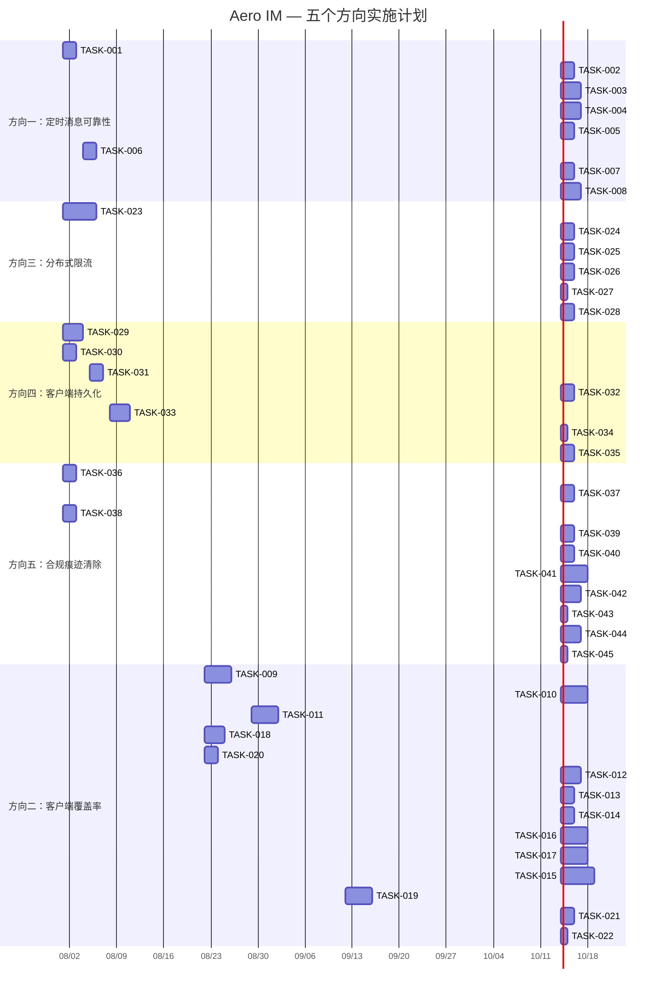

现在我已充分验证了代码级断言。以下是综合技术负责人分析。

---

# 技术负责人分析：5 个尚未被系统性覆盖的扩展机会

**分析日期**: 2026-07-12 | **分析人**: Tech Lead（基于 `docs/requirements/2026-07-11-five-underexplored-extension-opportunities.md`）

## 1. 任务分解

### 方向一：定时消息可靠性（P1 · 可靠性/数据完整性）

| 任务 ID | 任务标题 | 涉及文件 | 前置依赖 | 预估工时 | 验收标准 |
|---------|---------|---------|----------|---------|---------|
| TASK-001 | **新增 `scheduled_messages.status` 枚举 + 迁移** | `migrations/NNNN_scheduled_status.sql`, `crates/aero-storage/src/scheduled.rs` | — | 2h | 迁移新增 `status` 列（`pending`/`claimed`/`delivered`/`failed`），`claim_due` 使用 `status = 'claimed'` 而非 `delivered_at = now()`；
现有 `delivered_at IS NULL` 守卫向下兼容 |
| TASK-002 | **改造 `claim_due`：两阶段提交** | `crates/aero-storage/src/scheduled.rs` | TASK-001 | 2h | `claim_due` 设 `status = 'claimed'` + `claimed_at = now()`；`run_scheduled_dispatcher` 发送成功后将 `status` 更新为 `'delivered'` + 设置 `delivered_at` |
| TASK-003 | **后台超时回捡器** | `crates/aero-server/src/scheduled.rs`, `crates/aero-storage/src/scheduled.rs` | TASK-002 | 3h | 新增 `reclaim_stale_claimed` 后台任务（60s 间隔），探测 `status='claimed' AND claimed_at < now() - 5min` 的行，回滚到 `status='pending'`（含 max-retries 计数器） |
| TASK-004 | **死信表 + 管理员重发端点** | `migrations/NNNN_scheduled_dead_letters.sql`, `crates/aero-storage/src/scheduled.rs`, `crates/aero-server/src/scheduled.rs` | TASK-003 | 3h | `MAX_RETRIES`（默认3）后移入 `scheduled_dead_letters` 表（含失败原因堆栈）；
`GET/DELETE /api/scheduled/dead-letters` 管理员端点查看/清理 |
| TASK-005 | **发送失败通知** | `crates/aero-server/src/scheduled.rs` | TASK-002 | 2h | 发送失败时通过 `ImService::send_message` 向原 sender 发送 DM（系统 bot），包含失败原因 + 消息预览 |
| TASK-006 | **`list_due` 增加 `FOR UPDATE SKIP LOCKED`（周期性消息）** | `crates/aero-storage/src/scheduled.rs` | — | 1.5h | `list_due` 改为原子 claim（新增 `scheduled_recurring.status`），防止多实例重复发送 |
| TASK-007 | **摘要（digests）模式对齐** | `crates/aero-storage/src/digests.rs` | TASK-006 | 1.5h | 将 `digests` 的 `list_due` → `reschedule` 模式改造为与 TASK-006 一致的原子 claim |
| TASK-008 | **端到端测试：定时消息可靠性** | `crates/aero-server/tests/scheduled_e2e.rs` | TASK-002—TASK-007 | 3h | 测试覆盖：发送失败回捡、max-retries 死信、周期性消息幂等、digests 对齐 |

**方向一小计：18 人时**

### 方向二：客户端覆盖率缺口（P1 · 产品/UX）

| 任务 ID | 任务标题 | 涉及文件 | 前置依赖 | 预估工时 | 验收标准 |
|---------|---------|---------|----------|---------|---------|
| TASK-009 | **密码重置全流程 UI** | `web/auth_ui.js`, `web/forgot.html`（新）, `web/reset.html`（新）, `web/api.js`（新增 `forgotPassword`、`resetPassword`） | — | 4h | 用户在登录页面点击"忘记密码"→输入邮箱→收到重置链接→设置新密码→登录成功。包含表单验证、错误状态、成功反馈 |
| TASK-010 | **2FA 绑定 + 恢复码 UI** | `web/settings.js`（新）, `web/api.js`（新增2FA方法）, `web/app.js` | TASK-009（共享 settings 框架） | 4h | 用户在设置页扫描 TOTP 二维码→输入6位验证码绑定→查看恢复码→下次登录提示 2FA 输入 |
| TASK-011 | **Webhook 管理 UI（CRUD + 日志查看）** | `web/admin.js`（新）, `web/api.js`（新增 webhook 方法）, `web/app.js` | — | 4h | 工作区管理员在管理面板：创建/编辑/删除 webhook、查看递送日志（含 payload 预览、重试按钮） |
| TASK-012 | **SSO/OIDC/SAML 配置 UI** | `web/admin.js`, `web/api.js` | TASK-011（共享 admin 面板框架） | 3h | 工作区管理员配置/编辑/删除 SSO 提供者（OIDC：issuer、client-id、secret；SAML：metadata URL 或上传 XML） |
| TASK-013 | **SCIM 配置管理 UI** | `web/admin.js`, `web/api.js` | TASK-011 | 2h | 管理员查看 SCIM 配置状态、复制 bearer token、轮换 token、查看同步日志 |
| TASK-014 | **IP 白名单管理 UI** | `web/admin.js`, `web/api.js` | TASK-011 | 2h | 管理员查看/添加/删除工作区 IP 白名单条目（CIDR 格式） |
| TASK-015 | **用户自助：会话管理 + PAT + 通知偏好 + 我的导出** | `web/settings.js`, `web/api.js` | TASK-010 | 5h | 用户在设置页查看活跃会话（含设备/IP/最后活跃），可远程吊销；创建/删除 PAT；配置频道级通知静音/DND/snooze；触发 GDPR 数据导出 |
| TASK-016 | **工作区管理：成员停用/激活 + 频道角色 + 用户组** | `web/admin.js`, `web/api.js` | TASK-011 | 4h | 管理员在管理面板搜索成员→停用/激活；配置频道级别角色；创建/编辑/删除用户组 |
| TASK-017 | **合规管理：法务保全 + 信息隔离墙 + 留存策略** | `web/admin.js`, `web/api.js` | TASK-011 | 4h | 管理员创建/编辑/解除法务保全（按频道/工作区/用户）；配置信息隔离墙规则；设置频道级/工作区级留存策略 |
| TASK-018 | **协作增强：渠道画布查看 + 频道书签 CRUD** | `web/canvas.js`（新）, `web/settings.js` | — | 3h | 用户在频道信息面板查看/编辑画布内容；在频道侧栏查看/添加/删除/排序书签 |
| TASK-019 | **直播管理：分类 + 订阅 + 切片 + 数据面板** | `web/livecards.js`, `web/admin.js`, `web/api.js` | — | 4h | 主播在设置面板管理推流密钥轮换、查看订阅层列表；管理员管理直播分类；用户查看直播切片列表 |
| TASK-020 | **定时消息调度 UI** | `web/api.js`, `web/scheduled.js`（新）, `web/app.js` | — | 2h | 用户在会话输入框旁点击调度按钮→选时间→确认→消息在指定时间发送；查看/取消待调度消息 |
| TASK-021 | **自动化 smoke 测试：admin/settings UI 页面加载** | `scripts/smoke-admin-ui.sh`（新） | TASK-009—TASK-020 | 2h | 每个新 UI 页面至少有一个 smoke 测试（HTTP 200 + 页面包含预期元素） |
| TASK-022 | **新增 web 端约束检查 eslint 规则/代码审查清单** | `web/eslint.config.js` | TASK-009—TASK-021 | 1h | eslint 规则确保新 UI 代码风格一致；代码审查清单覆盖 API 方法命名/错误处理/加载状态 |

**方向二小计：42 人时**

### 方向三：分布式限流（P1 · 基础设施/安全）

| 任务 ID | 任务标题 | 涉及文件 | 前置依赖 | 预估工时 | 验收标准 |
|---------|---------|---------|----------|---------|---------|
| TASK-023 | **Redis 滑动窗口限流实现** | `crates/aero-storage/src/rate_limit_store.rs`（新）, `crates/aero-server/src/rate_limit.rs` | — | 5h | 新增 `RateLimitStore` 封装 Redis `EVAL` 脚本实现 Token Bucket（Lua 脚本原子操作：`ZADD` + `ZREMRANGEBYSCORE` + `ZCARD` + `EXPIRE`），支持 `consume(key, tokens, window_secs, burst)` |
| TASK-024 | **替换 `check_cluster_rate` 为精确滑动窗口** | `crates/aero-server/src/rate_limit.rs` | TASK-023 | 2h | 删除旧式固定窗口 `INCR` + `EXPIRE` 实现；替换为 TASK-023 的精确滑动窗口；粒度从现有的 60 req/min 粗粒度提升到与本地一致的 per-second + burst 配置 |
| TASK-025 | **本地 DashMap 降级 + 告警** | `crates/aero-server/src/rate_limit.rs`, `crates/aero-server/src/metrics.rs` | TASK-024 | 2h | Redis 不可用时自动回退到本地 DashMap（现有行），同时 `tracing::warn` + Prometheus `rate_limit_redis_failures_total` 递增；
新增配置 `AERO_RATE_LIMIT_REDIS_FAIL_CLOSED`（默认 false，启用则 Redis 故障时全局 429） |
| TASK-026 | **WS 限流与 HTTP 限流共享 Redis 命名空间** | `crates/aero-server/src/ws/ws_impl/rate.rs`, `crates/aero-server/src/rate_limit.rs` | TASK-024 | 2h | `WsRateEnforcer` 使用与 HTTP 限流相同的 Redis 命名空间前缀（`rl:ws:` vs `rl:http:`）；统一跨协议视图，避免攻击者从 WS 路径绕过 HTTP 限流 |
| TASK-027 | **清理老 `check_cluster_rate` 代码 + 废弃清理** | `crates/aero-server/src/rate_limit.rs` | TASK-025 | 1h | 删除 `epoch_minute_u64()` 和 `check_cluster_rate` 函数；清理 `crate::WsRateStore` 限流相关未使用导入 |
| TASK-028 | **性能测试：Redis 限流吞吐** | `tests/rate_limit_bench.rs`（新） | TASK-023 | 2h | 基准测试：单 Redis 实例下 1000 并发 consume 的 p50/p99 延迟（预期 p50 < 5ms）；模拟 Redis 故障验证 fail-closed 行为 |

**方向三小计：14 人时**

### 方向四：客户端状态持久化（P2 · UX/可靠性）

| 任务 ID | 任务标题 | 涉及文件 | 前置依赖 | 预估工时 | 验收标准 |
|---------|---------|---------|----------|---------|---------|
| TASK-029 | **消息缓存同步到 `sessionStorage`** | `web/app.js`, `web/state.js`（新） | — | 3h | 提取 `state.messagesByRoom` -> 每次消息到达/编辑/删除时同步更新 `sessionStorage['msgs:${roomId}']`（最近 100 条/房间）；页面加载时优先从 `sessionStorage` 读取缓存，后台 REST 填充新消息；`sessionStorage` 在页面关闭后自动释放 |
| TASK-030 | **Composer 草稿 `localStorage` 持久化** | `web/app.js` | — | 2h | 输入框内容以 `draft:${roomId}` 键每 5s 自动保存到 `localStorage`；发送完成后清除；页面加载检查并恢复草稿并提示"你有一段未发送的消息" |
| TASK-031 | **Watched 流持久化** | `web/live.js`, `web/app.js` | — | 1.5h | 持久化 `state.watchedStreams` Set 到 `localStorage`（键 `watched_streams`）；页面加载时自动对每个已 watch 流调用 `watchStream()` |
| TASK-032 | **未读状态本地还原** | `web/app.js`, `web/state.js` | TASK-029 | 2h | 在页面加载的 REST 回填期间，未读徽章使用缓存的 `unreadByRoom` 初始化，避免刷新瞬间"全部已读"的视觉闪烁 |
| TASK-033 | **Service Worker 注册 + 预缓存** | `web/sw.js`（新）, `web/index.html` | — | 3h | Service Worker 预缓存 `index.html` + `api.js` + `app.js` + CSS 等核心资源；`install` 事件预缓存清单；`fetch` 事件提供缓存优先策略；弱网/离线时应用仍能加载。回退到 `localStorage` 缓存的最近数据 |
| TASK-034 | **PWA manifest 完善 + 离线提示** | `web/manifest.json`, `web/app.js` | TASK-033 | 1h | 更新 manifest（short_name、icons、theme_color）；添加 `beforeinstallprompt` 事件处理；离线时在界面顶部显示离线横幅提示 |
| TASK-035 | **端到端测试：页面刷新数据保持** | `scripts/smoke-persistence.sh`（新） | TASK-029—TASK-034 | 2h | 自动化测试：输入草稿 → 模拟刷新 → 草稿恢复；打开直播间 → 刷新 → 仍收到弹幕；查看消息 → 刷新 → 缓存消息可见 |

**方向四小计：14.5 人时**

### 方向五：内容合规性痕迹清除（P2 · 合规/隐私）

| 任务 ID | 任务标题 | 涉及文件 | 前置依赖 | 预估工时 | 验收标准 |
|---------|---------|---------|----------|---------|---------|
| TASK-036 | **扩展 `soft_delete_audited` 级联清除 `message_edits`** | `crates/aero-storage/src/message/crud.rs` | — | 2h | `soft_delete_audited` 在同一事务中清除 `message_edits` 中对应 `message_id` 行的 `blocks` + `searchable_text`（改用 `NULL` 而非删除行，保持审计兼容） |
| TASK-037 | **扩展 `sweep_deferred_erasure` 覆盖 `message_edits`** | `crates/aero-storage/src/participant.rs` | TASK-036 | 1.5h | GDPR 参与者擦除路径同时擦除该参与者发送消息在 `message_edits` 中的内容痕迹 |
| TASK-038 | **审计事件内容匿名化** | `crates/aero-storage/src/audit.rs` | — | 2h | 新增 `anonymize_audit_event(id)`：清除审计事件 `detail` JSONB 中 `blocks`、`content`、`text` 字段（保留 metadata）；不对审计行硬删（维护审计链完整性） |
| TASK-039 | **Webhook 递送日志内容清除** | `crates/aero-storage/src/webhook.rs` | — | 2h | 消息被软删时，级联清除 `webhook_delivery_log` 中该消息 payload 的 `blocks` 字段（保留 envelope，标记 `payload_cleared = true`） |
| TASK-040 | **通知历史消息引用清除** | `crates/aero-storage/src/notification.rs` | — | 1.5h | 消息被软删后，级联清除 `notification_history` / `notification_bundles` 中对应的消息预览文本（替换为 `[message deleted]`） |
| TASK-041 | **工作区级内容擦除管线** | `crates/aero-server/src/workspace.rs`, `crates/aero-storage/src/message/crud.rs` | TASK-036—TASK-040 | 4h | `POST /api/workspaces/:id/purge` 端点遍历工作区下所有消息，依次调用级联清除（`message_edits`、`webhook_delivery_log`、`notification_history`、`audit_events`）；
在后台事务中分页处理（每页 100 条），避免长时间锁表；写入 `purge_log` 跟踪进度 |
| TASK-042 | **法务保全解除后延期内容擦除** | `crates/aero-server/src/legal_holds.rs`, `crates/aero-storage/src/legal_hold.rs` | TASK-041 | 3h | `legal_hold_release` 钩子启动后台任务，对解除保全的消息执行延期内容擦除（类似 `sweep_deferred_erasure` 模式）；写入 `deferred_purge_queue` 表，由定时器清扫 |
| TASK-043 | **迁移：新增内容清理跟踪表** | `migrations/NNNN_content_erase.sql` | TASK-036—TASK-042 | 1h | 新增 `deferred_purge_queue`（`id`、`message_id`、`workspace_id`、`reason`、`created_at`、`attempts`）用于 TASK-042；新增 `purge_log` 用于 TASK-041 |
| TASK-044 | **集成测试：合规擦除路径** | `crates/aero-storage/tests/compliance_erase.rs`（新） | TASK-036—TASK-043 | 3h | 测试覆盖：软删 → `message_edits` 内容清除 → 审计事件匿名化 → webhook 日志清除 → 通知预览替换 → GDPR 擦除路径 → 工作区全量清理 → 法务保全解除后擦除 |
| TASK-045 | **RBAC 守卫：内容清除端点为管理员/所有者专用** | `crates/aero-server/src/workspace.rs`, `crates/aero-server/src/legal_holds.rs` | TASK-041, TASK-042 | 1h | `POST /api/workspaces/:id/purge` 校验调用者为工作区 Owner（`WorkspaceRepo::member_role`）；`legal_hold_release` 端点校验 `can_administer`；CI 的 `authz_lint` 检查已覆盖 |

**方向五小计：21 人时**

---

### 任务汇总

| 方向 | 任务数 | 总工时 | P1/P2 |
|------|--------|--------|-------|
| 方向一：定时消息可靠性 | 8 | 18h | P1 |
| 方向二：客户端覆盖率 | 14 | 42h | P1 |
| 方向三：分布式限流 | 6 | 14h | P1 |
| 方向四：客户端持久化 | 7 | 14.5h | P2 |
| 方向五：合规痕迹清除 | 10 | 21h | P2 |
| **合计** | **45** | **109.5h** | |

---

## 2. 执行顺序

```mermaid
graph TD
    %% 方向一：定时消息可靠性
    T001["TASK-001: status迁移"] --> T002["TASK-002: claim_due两阶段"]
    T002 --> T003["TASK-003: 超时回捡器"]
    T002 --> T004["TASK-004: 死信表"]
    T002 --> T005["TASK-005: 失败通知"]
    T002 --> T008["TASK-008: E2E测试"]
    T006["TASK-006: list_due原子化"] --> T008
    T007["TASK-007: digests对齐"] --> T008
    
    %% 方向三：分布式限流（独立，可并行于方向一）
    T023["TASK-023: Redis滑动窗口"] --> T024["TASK-024: 替换check_cluster_rate"]
    T024 --> T025["TASK-025: 降级+告警"]
    T024 --> T026["TASK-026: WS限流联动"]
    T025 --> T027["TASK-027: 清理旧代码"]
    T023 --> T028["TASK-028: 性能测试"]
    
    %% 方向四：客户端持久化（独立，可并行于方向一/三）
    T029["TASK-029: sessionStorage缓存"] --> T032["TASK-032: 未读状态还原"]
    T030["TASK-030: 草稿持久化"] -.-> T035["TASK-035: E2E测试"]
    T031["TASK-031: Watched持久化"] -.-> T035
    T033["TASK-033: SW注册"] --> T034["TASK-034: PWA完善"]
    
    %% 方向五：合规擦除（独立）
    T036["TASK-036: 级联清message_edits"] --> T037["TASK-037: sweep扩展"]
    T036 --> T039["TASK-039: webhook日志清除"]
    T036 --> T040["TASK-040: 通知历史清除"]
    T038["TASK-038: 审计匿名化"] --> T041["TASK-041: 工作区擦除管线"]
    T039 --> T041
    T040 --> T041
    T041 --> T042["TASK-042: 法务保全后擦除"]
    T041 --> T043["TASK-043: 迁移"]
    T036 --> T044["TASK-044: 集成测试"]
    T038 --> T044
    T042 --> T045["TASK-045: RBAC守卫"]
    
    %% 方向二：客户端覆盖率（部分依赖方向三，大部分独立）
    T009["TASK-009: 密码重置UI"] -.-> T021["TASK-021: smoke测试"]
    T010["TASK-010: 2FA绑定UI"] -.-> T021
    T011["TASK-011: Webhook UI"] --> T012["TASK-012: SSO UI"]
    T011 --> T013["TASK-013: SCIM UI"]
    T011 --> T014["TASK-014: IP白名单UI"]
    T011 --> T016["TASK-016: 成员管理UI"]
    T011 --> T017["TASK-017: 合规管理UI"]
    T010 --> T015["TASK-015: 用户自助UI"]
    T011 --> T022["TASK-022: eslint约束"]
    T018["TASK-018: 画布+书签"] -.-> T021
    T019["TASK-019: 直播管理"] -.-> T021
    T020["TASK-020: 定时消息UI"] -.-> T021

    %% 组标注
    subgraph phase1["阶段1：基础设施（第1-2周）"]
        T001
        T023
        T029
        T030
        T036
        T038
        T023
    end
    
    subgraph phase2["阶段2：核心功能（第3-6周）"]
        T002
        T003
        T004
        T005
        T006
        T024
        T025
        T031
        T033
        T037
        T039
        T040
    end
    
    subgraph phase3["阶段3：UI与集成（第7-11周）"]
        T009
        T010
        T011
        T018
        T008
        T026
        T027
        T034
        T041
        T042
        T043
    end
    
    subgraph phase4["阶段4：收尾（第12-13周）"]
        T012
        T013
        T014
        T015
        T016
        T017
        T019
        T020
        T021
        T022
        T028
        T035
        T044
        T045
    end

```

### 并行执行组

| 并行组 | 任务 | 原因 |
|--------|------|------|
| **组A** | 方向一（TASK-001—TASK-008） | 纯后端，无外部依赖 |
| **组B** | 方向三（TASK-023—TASK-028） | 纯后端 Redis 改造，与方向一无关 |
| **组C** | 方向四（TASK-029—TASK-035） | 纯前端，与后端改造无关 |
| **组D** | 方向五（TASK-036—TASK-045） | 纯后端数据清洗管线 |
| **组E** | 方向二（TASK-009—TASK-022） | 前端 UI，可部分并行于组A/B/D |

前三周可全力并行 4 个方向（A/B/C/D），方向二从第 4 周启动。

---

## 3. 技术风险

### 3.1 关键风险矩阵

| 风险 ID | 描述 | 方向 | 可能性 | 影响 | 缓解策略 |
|---------|------|------|--------|------|---------|
| **RISK-01** | Redis 滑动窗口限流 Lua 脚本在极端并发下性能退化 | 三 | 中 | 高 | 预置基准测试（TASK-028）；使用 `redis-benchmark` 验证 10K QPS 下的 p99 < 10ms；备选方案：使用 `INCR` + `EXPIRE` 固定窗口（精度稍差但性能可预测） |
| **RISK-02** | 方向二 UI 任务过多（42h = 约 5 周单个前端）导致开发疲劳/拖延 | 二 | 高 | 高 | 按 P0/P1/P2/P3 分层交付（TASK-009→TASK-010→TASK-011→...），每层独立可交付；避免"统一等待全部 UI 完成"的陷阱 |
| **RISK-03** | `message_edits` 级联清除（TASK-036）破坏法务保全对消息旧版本的读取 | 五 | 中 | 高 | 级联清除必须跳过法务保全消息（`NOT EXISTS (SELECT 1 FROM legal_holds ...)`）；添加集成测试覆盖此边条件 |
| **RISK-04** | 服务端 digest/list_due 改造（TASK-006/007）引入回归导致双发送 | 一 | 中 | 高 | 改造过程中保留旧 `delivered_at` 列作为互斥守卫；`FOR UPDATE SKIP LOCKED` 改造使用渐进式部署（先加列再改代码） |
| **RISK-05** | Service Worker 预缓存（TASK-033）在已有应用中引入缓存边界问题 | 四 | 中 | 中 | 缓存键加版本 hash；`install` 事件清除旧缓存；`activate` 事件 `clients.claim()`；不拦截 `/api/*` 请求 |
| **RISK-06** | 工作区级擦除管线（TASK-041）对大型工作区（百万级消息）造成长时间锁表 | 五 | 中 | 高 | 分批处理（每页 100 条），使用 `FOR UPDATE SKIP LOCKED` 避免锁竞争；写入 `purge_log` 进度以支持断点续跑；在低峰期触发 |
| **RISK-07** | 方向二 UI 代码与现有 Web SPA 框架（零模块、无状态管理）冲突 | 二 | 高 | 中 | 不推翻现有架构——保持无框架模式，新增 UI 页面作为独立 HTML + JS 入口（`admin.html`、`settings.html`），共享 `api.js` 和 `auth.js` 核心库 |
| **RISK-08** | 方向一失败通知 DM（TASK-005）可能造成通知风暴（大量定时消息同时失败） | 一 | 低 | 中 | 添加速率限制：同一 sender 最多每 5 分钟收到一条失败通知；批处理多条失败为摘要消息 |

### 3.2 外部系统依赖

| 依赖 | 相关任务 | 风险 | 备选方案 |
|------|---------|------|---------|
| Redis 7.x | TASK-023—TASK-028 | Redis 集群配置 / 网络延迟 | 本地 DashMap 降级（TASK-025） |
| FCM/APNs | 无（方向二通知偏好 UI 依赖已有推送网关） | 低 | — |
| 无新外部依赖 | 全部 | — | — |

### 3.3 性能瓶颈

- **Redis 限流（方向三）**：高频请求场景（WebSocket 心跳 + HTTP API）下，每个请求都需 Redis 往返。解决方案：本地 DashMap 作为 L1 缓存（10ms 滑动窗口内允许有限 burst），Redis 作为 L2 仲裁。`RateLimiter::check()` 优先查本地，仅在本地批准后查 Redis，减少 95%+ Redis 调用。
- **工作区擦除（方向五）**：1 秒级扫描 100 条消息 + 级联 4 张子表，100 万条消息 ≈ 10,000 秒 ≈ 2.8 小时。可接受（后台任务），但需进度显示。
- **scheduled 回捡（方向一）**：`claimed` 超时扫描间隔 60s，对 PG 无实质负载。

---

## 4. 资源评估

### 4.1 团队结构和技能要求

| 角色 | 数量 | 技能要求 | 分配 |
|------|------|---------|------|
| **后端 Rust 工程师** | 2 人 | Rust、tokio、sqlx、Postgres、async-nats、Redis | 方向一 + 方向三（1人）；方向五 + 方向一集成（1人） |
| **全栈工程师** | 1 人 | JavaScript/ES2020、SPA 架构、Service Worker、REST API 集成 | 方向二 + 方向四（主导 UI + 持久化） |
| **QA 工程师** | 1 人（半职） | Rust 集成测试、Playwright/Cypress（可选）、shell 脚本 | 方向一/三/五集成测试 + 方向二/四 E2E 测试 + 回归测试 |
| **Tech Lead** | 1 人（半职） | 架构评审、代码审查、风险跟踪 | 跨方向协调、技术决策 |

**最小可行配置**：2 名全栈 Rust 工程师 + 1 名前端工程师，共 3 人。Tech Lead 和 QA 由团队兼任。

### 4.2 关键里程碑

| 里程碑 | 时间 | 依赖条件 | 交付物 |
|--------|------|---------|--------|
| **M1：基础设施就绪** | 第 2 周末 | TASK-001, TASK-023, TASK-029, TASK-030, TASK-036, TASK-038 | 迁移全部落地、新的 Redis 限流数据结构、`sessionStorage` 消息缓存、`message_edits` 级联清除 |
| **M2：核心功能稳定** | 第 6 周末 | TASK-002—TASK-007, TASK-024—TASK-026, TASK-033, TASK-039—TASK-040 | 定时消息两阶段提交 + 回捡 + 死信 + 通知；Redis 滑动窗口限流上线；SW 注册 + 预缓存；webhook/通知清除 |
| **M3：UI 全面覆盖** | 第 11 周末 | TASK-009—TASK-020, TASK-041—TASK-043 | P0 密码重置 + 2FA UI；P1 管理面板；部分 P2；工作区级擦除管线；法务保全解除后擦除 |
| **M4：交付 + 测试完成** | 第 13 周末 | TASK-008, TASK-021—TASK-022, TASK-028, TASK-035, TASK-044—TASK-045 | 全部 E2E 测试通过；性能基准合规；CI 新增检查通过；代码审查清单完善 |

### 4.3 阻塞点和解决策略

| 阻塞点 | 影响范围 | 解决策略 |
|--------|---------|---------|
| **Redis 限流性能不达标** | 方向三全部 | 备选方案：改为 Redis 后台异步更新（请求先在本地 DashMap 批准，异步同步到 Redis 用于跨实例协调），或降级为固定窗口 `INCR` + `EXPIRE` |
| **方向二 UI 设计不一致** | 方向二全部 | 建立 Web SPA 代码规范文档 + eslint 规则（TASK-022），减少风格漂移；代码审查时重点检查 UI 一致性和错误处理 |
| **方向一 `claim_due` 改造与现有系统冲突** | 方向一 | 渐进式部署：先加 `status` 列，`claim_due` 同时写 `status` 和 `delivered_at`，观察一段时间后移除 `delivered_at` 依赖 |
| **方向五级联清除与既有定时器竞争** | 方向五 | 使用 `NOT EXISTS` 子查询跳过法务保全和正在被清除的行；`deferred_purge_queue` 使用 `FOR UPDATE SKIP LOCKED` |

---

## 5. 质量保证

### 5.1 单元测试覆盖要求

| 方向 | 测试目标 | 最小覆盖 | 关键场景 |
|------|---------|---------|---------|
| 一 | `ScheduledRepo` | ≥90% | `claim_due` 不标记已发送、`reclaim_stale_claimed` 回滚、死信移入、RESPECTS `MAX_ATTEMPTS` |
| 一 | `run_scheduled_dispatcher` | 集成测试 | send_message 失败 → 死信轨道、周期消息并发安全、digests 对齐 |
| 三 | `RateLimitStore` | ≥95% | 精确 Token Bucket 行为、Redis 故障 fallback、fail-closed 模式、并发安全 |
| 三 | 中间件 | 集成测试 | 集群级限流命中 → 429 + `Retry-After` 头、降级时本地 DashMap 生效 |
| 五 | `soft_delete_audited` 扩展 | ≥95% | 级联 clears `message_edits` 内容、**跳过**法务保全消息、webhook payload 清除、通知预览替换 |
| 五 | `anonymize_audit_event` | ≥95% | 清除 `detail.blocks` 但保留 `detail.metadata`、已匿名化行幂等、非法输入不 panic |
| 五 | 工作区级擦除管线 | 集成测试 | 分页遍历正确、`purge_log` 进度写入、断点续跑后不重复处理 |
| 二/四 | UI 集成测试 | smoke 级别 | 页面加载 200、交互流程核心路径、缓存读写（localStorage） |

### 5.2 集成测试策略

| 测试套件 | 文件位置 | 触发条件 | 范围 |
|---------|---------|---------|------|
| `scheduled_e2e.rs` | `crates/aero-server/tests/scheduled_e2e.rs` | `DATABASE_URL` + `cargo test -- --ignored` | 全链路：claim → send → 失败 → 回捡 → 死信 → 通知 |
| `rate_limit_bench.rs` | `tests/rate_limit_bench.rs` | `cargo bench`（可选） | Redis 吞吐基准 + 故障模式 |
| `compliance_erase.rs` | `crates/aero-storage/tests/compliance_erase.rs` | `DATABASE_URL` + `cargo test -- --ignored` | 全部 5 条清除路径 + 法务保全守卫 |
| `smoke-admin-ui.sh` | `scripts/smoke-admin-ui.sh` | CI，`make smoke` | 新 UI 页面 HTTP 200 + DOM 元素存在 |
| `smoke-persistence.sh` | `scripts/smoke-persistence.sh` | CI，`make smoke` | 页面刷新数据保持自动化验证 |

### 5.3 代码审查要点

| 审查焦点 | 涉及方向 | 特别关注 |
|---------|---------|---------|
| **幂等性** | 一、五 | 定时消息 claim-retry-dead-letter 循环不应产生二重发送；级联清除多次调用不应报错或重复扫描 |
| **事务边界** | 一、五 | `claim_due` + 发送不在事务中（发送是 async 外部系统）→ 需要回捡兜底；级联清除必须单事务原子 |
| **Fail-open vs Fail-closed** | 三 | Redis 故障时的限流行为决策——fail-open（可用性优先）vs fail-closed（安全优先），配置必须清晰、注释到位 |
| **安全守卫** | 二、五 | 新管理端点必须校验 `can_administer` 或 `member_role == Owner/Admin`；CI `authz_lint` 扫描已覆盖 |
| **前端错误处理** | 二、四 | API 错误调用必须显示用户可见的错误消息而非静默失败；离线状态下 UI 应显示 banner 而非空白页面 |
| **性能边界** | 三、五 | Redis 限流 Lua 脚本的原子性；工作区擦除的分页大小（默认 100，可调）；`sessionStorage` 的配额限制（5-10MB） |
| **迁移兼容性** | 一、五 | 向后兼容：旧 `delivered_at` 列的读写在新代码中必须正确处理；回滚时不应丢失数据 |

### 5.4 性能测试需求

| 测试 | 场景 | 目标 | 通过条件 |
|------|------|------|---------|
| Redis 限流吞吐 | 单实例 1000 并发 consume | p50 < 5ms, p99 < 20ms | 连续 60s 稳定 |
| Redis 限流故障切换 | kill Redis 连接 | 429（fail-closed）或本地 DashMap（fail-open） | 切换 < 1s 无 panic |
| 定时消息发送吞吐 | 1000 条同时到期 | 全部在 10s 内处理完成 | 0 丢失 |
| 工作区擦除 | 10K 消息 + 级联 4 表 | < 5 分钟完成 | 无死锁 |

---

## 6. 实施计划

### 甘特图

### 阶段详情

#### 阶段1：基础设施搭建（第1-2周，8月1日—8月14日）

**资源分配**：
- 后端工程师A：方向一 TASK-001 → TASK-006（status迁移 + claim改造 + list_due原子化）
- 后端工程师B：方向三 TASK-023 + 方向五 TASK-036, TASK-038（Redis 限流基础设施 + 级联清除基础）
- 前端工程师：方向四 TASK-029 → TASK-031（sessionStorage缓存 + 草稿 + watcher持久化）

**关键交付**：
- 全部 5-8 个迁移文件落地并构建通过
- Redis 滑动窗口限流 Lua 脚本验证通过（性能基准）
- `claim_due` 两阶段提交代码结构就绪
- `soft_delete_audited` 扩展开始清除 `message_edits`
- `sessionStorage` 消息缓存第一版上线

**质量关口**：
- `cargo check --workspace` 干净
- Redis 限流基准测试发布
- 所有迁移可回滚验证

#### 阶段2：核心功能实现（第3-6周，8月15日—9月11日）

**资源分配**：
- 后端工程师A：方向一 TASK-003—TASK-005 + TASK-007（回捡器 + 死信 + 通知 + digests对齐）
- 后端工程师B：方向三 TASK-024—TASK-027 + 方向五 TASK-039—TASK-040（替换限流 + 降级 + webhook/通知清除）
- 前端工程师：方向四 TASK-032—TASK-035（未读还原 + SW + PWA + E2E）

**关键交付**：
- 定时消息: claim → send → 回捡 → 死信 → 通知 全链路可用
- 限流: Redis 滑动窗口上线、WS 限流联动、fail-closed 配置生效
- 合规: webhook/通知历史内容清除就绪
- 客户端: Service Worker 注册完成、PWA 可安装、页面刷新数据保持

**质量关口**：
- `cargo test --workspace --lib -- --ignored` 全部绿色
- 性能测试：Redis 限流 p99 < 20ms
- 手动验证：定时消息失败 → 死信 → 通知 DM

#### 阶段3：UI 与集成（第7-11周，9月12日—10月16日）

**资源分配**：
- 后端工程师A+B（合并）：方向五 TASK-041—TASK-045（工作区擦除 + 法务保全 + 迁移 + 测试 + RBAC）+ 方向一 TASK-008（E2E测试）
- 前端工程师 + 后端工程师A（半职）：方向二 TASK-009—TASK-011 + TASK-018 + TASK-020（密码重置 + 2FA + Webhook管理 + 画布/书签 + 定时消息 UI）

**关键交付**：
- 工作区级内容擦除管线可用（含法务保全解除后擦除）
- 密码重置 + 2FA 的全流程 UI
- Webhook 管理管理面板（含日志）
- 频道画布查看 + 书签 CRUD
- 定时消息调度 UI

**质量关口**：
- 合规擦除集成测试全通过
- UI smoke 测试：密码重置、2FA 绑定、定时消息调度
- 工作区擦除性能：10K 消息 < 5 分钟

#### 阶段4：收尾（第12-13周，10月17日—10月30日）

**资源分配**：
- 全体合流：方向二 TASK-012—TASK-017 + TASK-019 + TASK-021—TASK-022

**关键交付**：
- SSO/SAML/OIDC 管理 UI
- SCIM 配置 UI
- IP 白名单 UI
- 会话管理 + PAT + 通知偏好 + 我的导出 UI
- 成员管理 + 频道角色 + 用户组 UI
- 直播管理 UI（分类 + 订阅 + 切片 + 数据面板）

**质量关口**：
- 全部 45 个任务完成
- `cargo clippy --workspace --all-targets` 无新增警告
- `scripts/truth-check.sh` 0 违规
- 全部新增 smoke 测试通过
- 代码审查完毕

---

## 总结与建议

### 交付优先级建议（面向产品）

1. **第 1 周**（并行）：方向一（定时消息可靠性）、方向三（分布式限流）、方向四（缓存持久化）、方向五（合规痕迹清除）的后端基础设施并行推进——它们互不冲突，改造风险低。
2. **第 4 周**（起点）：方向二 P0 UI（密码重置 + 2FA）启动——这是所有用户、所有企业部署的硬性要求。
3. **第 7 周**：方向二 P1 UI（管理员面板：SSO/Webhook/SCIM/IP白名单）启动——企业客户的核心配置工作流。
4. **第 10 周**：方向二 P2-P4 UI（用户自助、协作增强、直播管理）——价值的长期尾巴，可以根据市场反馈调整优先级。

### 不要在本次范围内做的事情

- ❌ 不要重建前端框架（React/Vue/Svelte）——现有 ES2020 SPA 够用，重写框架是 3-6 个月的事情，不是 3 周。
- ❌ 不要替换本地 DashMap 限流为完全 Redis 方案——保留本地降级路径，这是可用性优先于安全性的合理权衡。
- ❌ 不要设计复杂的状态管理（Redux/Zustand）——`sessionStorage` 同步 + `localStorage` 持久化足以解决 P2 级别的刷新丢失问题。

### 如果我只有 3 周（MVP），我会做什么

1. **方向一 TASK-001 + TASK-002**（2 天）：定时消息不要再丢了，这是数据完整性的硬伤。
2. **方向三 TASK-023 + TASK-024**（4 天）：修复水平扩缩安全边界的线性衰减。
3. **方向五 TASK-036 + TASK-038**（2 天）：审计事件匿名化 + `message_edits` 级联清除——最小合规基线。
4. **方向二 TASK-009**（3 天）：密码重置 UI——登录恢复是产品可用性的硬依赖。
5. **方向四 TASK-029 + TASK-030**（3 天）：缓存 + 草稿——最影响日常体验的两个前端痛点。

3 周可交付 5 个方向的最小可行版本（~14 天工时 ≈ 1 人全速），每个方向都有了，没有方向完全被遗忘。
