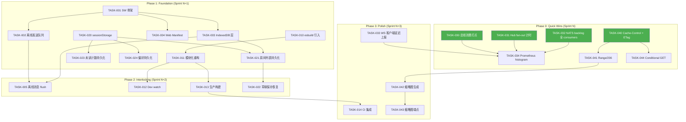
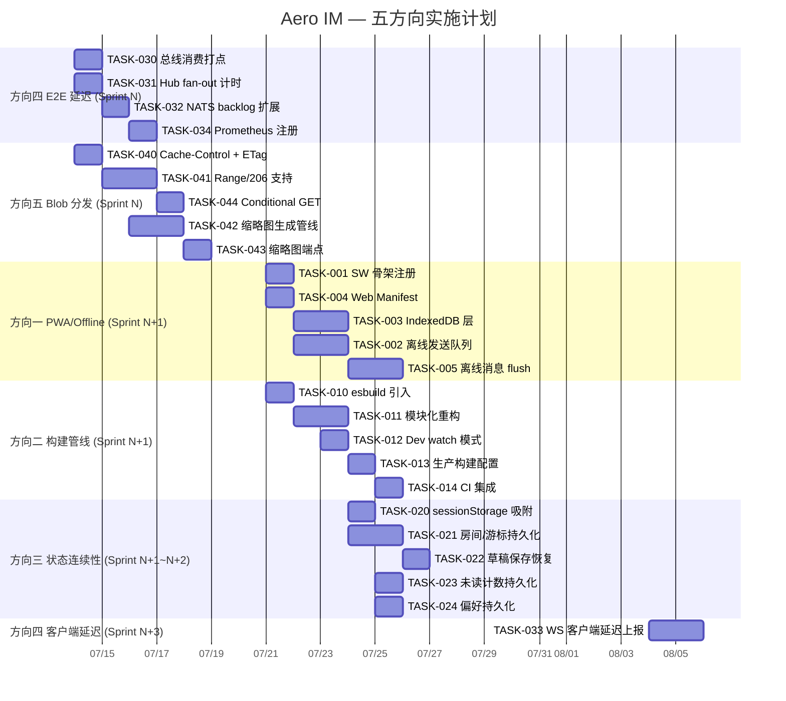

Now I have a comprehensive understanding of the codebase. Here is my Tech Lead analysis:

---

# Tech Lead 分析报告：五条系统性忽视的高价值扩展方向

## 1. 任务分解

### 方向一：PWA / 离线消息支持 (Offline-First)
| 任务 ID | 任务标题 | 涉及文件 | 前置依赖 | 预估工时 |
|---------|---------|---------|---------|---------|
| TASK-001 | Service Worker 骨架注册 | `web/sw.js`（新文件）, `web/index.html` | 无 | 2h |
| TASK-002 | 离线消息发送队列 | `web/ws.js`（`send()` 改返回 Promise，失败入列），`web/context.js` | TASK-001 | 4h |
| TASK-003 | 离线 IndexedDB 层 (idb) | `web/db.js`（新文件）— 消息/草稿持久化 | TASK-001 | 4h |
| TASK-004 | Web Manifest 声明 | `web/manifest.json`（新文件），`web/index.html` 加入 `<link rel="manifest">` | TASK-001 | 1h |
| TASK-005 | 连接恢复后离线消息 flush | `web/ws.js`（`ws.addEventListener('open')` 触发 flush），`web/sw.js` 转发 | TASK-002, TASK-003 | 3h |

### 方向二：构建管线升级 (Build Pipeline)
| 任务 ID | 任务标题 | 涉及文件 | 前置依赖 | 预估工时 |
|---------|---------|---------|---------|---------|
| TASK-010 | esbuild 引入 + 配置 | `web/build.mjs`（新文件），`web/esbuild.config.mjs` | 无 | 2h |
| TASK-011 | 模块化重构——按功能域聚合 | `web/app.js` 拆分更细，`web/` 新增 `routes/` `views/` 子目录 | TASK-010 | 4h |
| TASK-012 | 开发 watch 模式 + HMR 兜底 | `web/build.mjs` + `index.html` 的 dev/prod 切换 | TASK-010 | 2h |
| TASK-013 | 生产构建：代码分割 + 压缩 + sourcemap | `web/build.mjs`，`web/Makefile` 或 `web/package.json` 脚本 | TASK-011 | 2h |
| TASK-014 | CI 集成构建产物检查 | `scripts/web-check.sh`，`.github/workflows/` | TASK-013 | 1h |

### 方向三：状态连续性 (State Continuity)
| 任务 ID | 任务标题 | 涉及文件 | 前置依赖 | 预估工时 |
|---------|---------|---------|---------|---------|
| TASK-020 | sessionStorage 吸附活跃状态 | `web/context.js`（`state` 增加 `save()` / `restore()` 方法），`web/chrome.js`（`beforeunload` 事件） | 无 | 3h |
| TASK-021 | 房间列表/消息游标持久化 | `web/db.js`（复用 TASK-003 IndexedDB），`web/app.js`（on load restore） | TASK-003 | 4h |
| TASK-022 | 草稿保存 + 恢复 | `web/chrome.js`（`composer-input` 的 `input` 事件），`web/context.js` | TASK-021 | 2h |
| TASK-023 | 未读计数持久化 | `web/context.js` + `web/render.js` | TASK-020 | 2h |
| TASK-024 | 主题/布局偏好持久化 | `web/context.js`，`web/style.css` CSS custom properties 切换 | TASK-020 | 1h |

### 方向四：端到端延迟可观测性 (E2E Latency Observability) — **建议提至 Sprint N**
| 任务 ID | 任务标题 | 涉及文件 | 前置依赖 | 预估工时 |
|---------|---------|---------|---------|---------|
| TASK-030 | 总线消费端打点：`handle_room_event_sub` 各阶段计时 | `crates/aero-server/src/ws/ws_impl/bus.rs` | 无 | 3h |
| TASK-031 | Hub fan-out 计时直方图 | `crates/aero-server/src/hub.rs`（`fan_out_raw` 加 `Instant::now` + histogram emit） | 无 | 2h |
| TASK-032 | NATS consumer backlog 监控扩展至全量 9 个 consumer | `crates/aero-server/src/bin/boot/metrics_tasks.rs` | 无 | 1h |
| TASK-033 | WS 客户端渲染延迟上报 | `web/ws.js`（`message` 处理入口 stamp `performance.now()` → 周期性 POST `/api/metrics`）| TASK-030 | 4h |
| TASK-034 | Prometheus histogram 注册 & 面板指引 | `crates/aero-common/src/metrics.rs`，`docs/monitoring.md` | TASK-030, TASK-031 | 2h |

### 方向五：Blob 分发优化 (Blob Delivery)
| 任务 ID | 任务标题 | 涉及文件 | 前置依赖 | 预估工时 |
|---------|---------|---------|---------|---------|
| TASK-040 | Cache-Control 头 + 强 ETag 支持 | `crates/aero-server/src/routes/routes.rs` 的 `blob_download` | 无 | 2h |
| TASK-041 | Range 请求 / 206 Partial Content 支持 | `crates/aero-server/src/routes/routes.rs` | TASK-040 | 4h |
| TASK-042 | 缩略图生成管线（`image` crate） | `crates/aero-storage/src/blobs.rs`，`crates/aero-server/Cargo.toml`（加 `image` 依赖） | TASK-040 | 6h |
| TASK-043 | 缩略图 REST 端点 | `crates/aero-server/src/routes/routes.rs`（`GET /api/blobs/:id/thumbnail?w=...&h=...`） | TASK-042 | 3h |
| TASK-044 | Conditional GET (If-None-Match / If-Modified-Since) | `crates/aero-server/src/routes/routes.rs` | TASK-040 | 2h |

---

## 2. 执行顺序

---

## 3. 技术风险

### 3.1 高风险项

| 风险 | 所属方向 | 影响 | 缓解策略 |
|------|---------|------|---------|
| **SW 生命周期复杂性** | 方向一 | Service Worker 更新策略错误导致发版后用户运行陈旧缓存 | 使用 `skipWaiting()` + `clients.claim()` 模式，SW 版本号机制，`install` 事件强制更新缓存白名单 |
| **IndexedDB API 异步复杂** | 方向一/三 | 开发者对 `idb` 事务/游标不熟悉导致竞态，或 `QuotaExceededError` 未处理 | 引入轻量 wrapper（如 `idb-keyval` 或手写 100 行 Promise 封装），设置存储容量配额上限（每条消息≤100KB，总≤50MB），`catch` 兜底降级到内存模式 |
| **esbuild/WASM 依赖兼容性** | 方向二 | 沙箱/CI 环境缺 `@esbuild/linux-x64` 等原生二进制 | fallback 到纯 JS 脚本模式：若 esbuild 不可用则退化到当前直接加载 `<script>` 方式，不阻断 CI |
| **缩略图 `image` crate 编译时间** | 方向五 | Rust `image` crate 编译依赖重，估计 +60-90s 增量编译 | 仅加入 `aero-storage` crate（非 server），`image` feature gate：`features = ["jpeg", "png", "webp"]`，不启用全部格式 |
| **Range/206 与 ETag 交互** | 方向五 | 强 ETag 在部分内容请求时需变化（不同 Range 返回不同内容） | 对于 blob 下载使用弱 ETag（`W/"<hash>"`），Range 请求使用 `sha256(offset..end)` 派生 ETag；或简单方案：`Accept-Ranges: bytes` + `ETag: <sha256>` + 忽略 conditional headers on partial |

### 3.2 中风险项

| 风险 | 所属方向 | 缓解策略 |
|------|---------|---------|
| **WS 客户端计时上报的隐私/性能** | 方向四 | 采样率控制器（`sample_rate` 参数），默认 1%，可通过 `AERO_CLIENT_METRICS_SAMPLE_RATE` env 配置；上报端点加 rate-limit 中间件 |
| **`saveDraft` 高频写入 IndexedDB** | 方向三 | 防抖 500ms + 仅在 composer focus 时启用；写入失败静默降级（不丢用户输入，仅丢草稿） |
| **SW 拦截 fetch 意外破坏现有功能** | 方向一 | SW 初始版本仅 `fetch` 事件 `pass-through`（`event.respondWith(fetch(event.request))`），不缓存任何资源，先上线再逐步加入缓存策略 |
| **NATS consumer 名发现机制** | 方向四 | 硬编码 9 个 consumer 列表 vs 运行时枚举。运行时枚举可能因 NATS 版本差异返回不同字段。采用双路径：先硬编码已知 9 个，预留 `extend_consumers` 参数接口 |

### 3.3 性能瓶颈分析

| 瓶颈 | 当前状态 | 预计改善 |
|------|---------|---------|
| 17 独立 HTTP 请求的 JS 加载 | 串行加载，无并行优化 | esbuild 合并为 2-3 个 chunk，HTTP/2 push 配合，加载时间预计 **减少 60-70%** |
| `blob_download` 全量内存读取 | 每请求读整个 blob 进内存 → 大文件导致 OOM 风险 | Range 支持 + 流式 response，消除 OOM 风险，支持视频/音频渐进播放 |
| `handle_room_event_sub` 无计时 | 无法区分：解码时间 vs 成员展开 vs fan_out | 直方图可识别瓶颈阶段，针对性优化（如成员 cache miss 等） |

---

## 4. 资源评估

### 4.1 团队建议

| 技能角色 | 人数 | 主要负责方向 | 备注 |
|---------|------|------------|------|
| Rust 后端工程师 (Senior) | 1 | 方向四（E2E 延迟）、方向五（Blob 分发） | 对 axum/metrics/tracing 熟悉；预估 5 个工作日 |
| 前端工程师 (Senior) | 1 | 方向一（PWA/Offline）、方向二（构建管线）、方向三（状态连续性） | 对 Service Worker、IndexedDB、esbuild 有实战经验；预估 8 个工作日 |
| 全栈工程师 (Mid) | 1 | 方向二（CI 集成）、方向三（辅助）、方向四（客户端计时上报） | 辅助前后端衔接，处理 CI 脚本和测试；预估 5 个工作日 |

**理想安排**：2 人并行 3 周（Sprint N ~ N+2），第 4 周（Sprint N+3）集中集成测试和性能验证。

### 4.2 关键里程碑

| 里程碑 | 时间节点 | 交付物 | 验收标准 |
|--------|---------|--------|---------|
| M0: 方向四 Quick Wins | Sprint N Week 1 | 3 PR 合并（TASK-030, TASK-031, TASK-032） | Prometheus 面板可见 `aero_bus_event_processing_seconds` 和 `aero_hub_fan_out_seconds` 直方图；9 个 NATS consumer backlog 皆可查询 |
| M1: Blob 基础优化 | Sprint N Week 1-2 | TASK-040, TASK-041 | `curl -I /api/blobs/:id` 返回 `Cache-Control: public, max-age=31536000` + `ETag: "sha256:..."` + `Accept-Ranges: bytes`；`Range: bytes=0-99` 返回 206 |
| M2: 离线基础设施 | Sprint N+1 Week 1 | TASK-001 ~ TASK-004 | 离线时 `send()` 不返回 false，消息入 IndexedDB；联网后自动 flush |
| M3: 构建管线 | Sprint N+1 Week 2 | TASK-010 ~ TASK-013 | `node build.mjs` 输出 2-3 个 JS bundle + CSS bundle，`web/index.html` 加载产物 |
| M4: 状态连续性 | Sprint N+1 Week 2 ~ N+2 Week 1 | TASK-020 ~ TASK-024 | 页面刷新后：当前房间消息游标保持、未读计数不消失、草稿恢复 |
| M5: 缩略图 | Sprint N+3 Week 1 | TASK-042, TASK-043 | 图片 blob 上传后自动生成 200x200 缩略图，`GET /api/blobs/:id/thumbnail` 返回 |
| M6: 集成联调 | Sprint N+3 Week 2 | 全量 PR 合并 | 所有方向功能在 staging 环境正常运行，无回归 |

### 4.3 阻塞点 & 解决策略

| # | 阻塞点 | 影响方向 | 解决策略 |
|---|-------|---------|---------|
| B1 | 沙箱环境 npm 不可用 | 方向二 | 不阻塞：esbuild 通过 `npx esbuild` 调用（npm 缓存中）或备用纯 JS 模式。CI 环境预装 Node 18+。根本解决：`package.json` 添加 `esbuild` 到 `devDependencies`，CI runner 执行 `npm ci` |
| B2 | `image` crate 的 C 依赖编译 | 方向五 | 使用 `mozjpeg-sys` / `libpng-sys` 等系统库；若编译失败，在 Cargo.toml 中设 `[target.'cfg(target_os = "linux")'.dependencies]` 条件编译；或退而求次使用 `fast_image_resize` 纯 Rust 库 |
| B3 | 跨节点 SFU 测试环境不可用 | 方向四 | NATS consumer 打点和 hub fan-out 计时不依赖真实媒体流，可在无 SFU 环境下测试；E2E 延迟的全链路（含 WebRTC 媒体路径）暂不覆盖 |
| B4 | Service Worker 仅 HTTPS | 方向一 | 本地开发通过 `http://localhost` 或 `127.0.0.1` 仍可用 SW（浏览器允许 localhost）；但 traefik/反向代理部署必须配证书。Staging 环境需先配 HTTPS |

---

## 5. 质量保证

### 5.1 单元测试覆盖要求

| 任务 | 测试文件 | 覆盖内容 | 最低覆盖率 |
|------|---------|---------|----------|
| TASK-002 离线发送队列 | `web/ws.test.js` 或 jest 测 `send()` 队列行为 | 入列/出列/flush/顺序保持/去重 | 80% |
| TASK-003 IndexedDB 层 | `web/db.test.js` 或 jsdom+fake-indexeddb | CRUD/事务/配额超限/并发 | 85% |
| TASK-030 总线打点 | `crates/aero-server/src/ws/ws_impl/bus.rs` 现有 test mod | 直方图是否在正确阶段 emit | 75% |
| TASK-031 Hub fan-out 计时 | `crates/aero-server/src/hub.rs` 现有 test mod | fan_out_raw 计时覆盖 | 75% |
| TASK-040/041 Blob 缓存 | `crates/aero-server/src/routes/routes.rs` 的 blob_download tests | Cache-Control/ETag/Range/206/NOT_MODIFIED | 85% |
| TASK-042/043 缩略图 | `crates/aero-storage/src/blobs.rs` test mod | 缩略图尺寸/格式/错误处理 | 70% |

**关键原则**：
- Rust 侧：已有 `#[cfg(test)] mod tests` 伴生测试（db_tests 除外），新增代码紧跟此模式
- JS 侧：当前无测试基础设施，方向二（esbuild）引入后可接入 `vitest` 或 `node --test`；方向一/三的 IndexedDB 代码用 `fake-indexeddb` npm 包模拟
- CI 中 `cargo test --workspace --lib` 必须全绿；新 JS 测试在 `scripts/web-check.sh` 中追加 `node --test` 执行

### 5.2 集成测试策略

| 测试场景 | 方法 | 触发时机 |
|---------|------|---------|
| **离线→在线消息投递** | 启动 server → WS 连接 → kill server 网络 → 发消息 → 恢复网络 → 确认消息送达 | 手动 + `scripts/smoke-test.sh` 扩展 |
| **Blob 缓存正确性** | curl 上传 blob → 下载验证 ETag → `If-None-Match` 返回 304 → Range 返回 206 + 正确字节数 | `cargo test --test blob_cache`（新增集成测试）|
| **构建产物完整性** | `node build.mjs` → 检查输出 bundle → `head -c 100` 验证 JS 语法 | `scripts/web-check.sh` |
| **状态恢复正确性** | 浏览器打开页面 → 操作 → 刷新 → 对比 state 前后一致性 | 手动 + Puppeteer 脚本（可选） |
| **NATS backlog 监控** | 启动 server（本地 NATS）→ `aero-cli tools inject-bus-message` → 观察 Prometheus gauge | 手动验证 + `cargo test --test metrics` |

### 5.3 代码审查要点

每个 PR 必须对照以下 checklist：

- **方向一 (SW)**：SW 版本号是否递增？`install`/`activate`/`fetch` 事件是否全部正确处理？`skipWaiting()` 是否已配置？有无 `Cache-Control: no-cache` 资源被错误缓存？
- **方向二 (Build)**：`esbuild.config.mjs` 的 `entryPoints` 是否覆盖全部入口？`outdir` 是否与 `index.html` 的 `<script>` 路径一致？`dev` 模式是否启用 `sourcemap`？产物 `gzip` 是否作为 CI 门禁？
- **方向三 (State)**：`sessionStorage` 写入前是否有 JSON.stringify 异常处理？`beforeunload` 是否异步（`navigator.sendBeacon` 或同步 `Storage.setItem`）？IndexedDB `transaction` 是否含 `catch` 降级？
- **方向四 (Metrics)**：直方图 bucket 是否合理（消息处理建议 `[0.001, 0.005, 0.01, 0.05, 0.1, 0.5, 1.0]`）？`labels` 是否包含 `room_id`（注意基数爆炸——只允许 `workspace_id` 和 `event_type`）？NATS consumer 名是否与 `jetstream.rs` 声明一致？
- **方向五 (Blob)**：`ETag` 是否使用 blob 的 SHA256（已有元数据）？`Cache-Control` 的 `max-age` 是否合理（图片/静态资源 1y，用户上传内容 24h）？Range 请求是否正确处理 `If-Range`？缩略图存储路径是否需要并发锁？

### 5.4 性能测试需求

| 测试 | 工具 | 指标 | 目标值 |
|------|------|------|-------|
| Blob 下载吞吐 | `wrk -c 100 -d 30s /api/blobs/:id` | 吞吐量 (req/s)，P99 延迟 | ≥ 当前 2x（加入 ETag/304 后）|
| WS 消息 E2E 延迟 | 定制脚本：发送 → 接收时间戳对比 | P50 / P99 / P999 延迟 | P50 < 100ms, P99 < 500ms |
| 离线队列 flush | 模拟 50 条离线消息 → 恢复连接 | flush 完成时间 | ≤ 2s |
| 构建产物大小 | `ls -lh dist/` | gzip 后总大小 | < 100KB（JS bundle）|
| 缩略图生成 | 100 并发请求不同图片 | P99 处理时间 | < 200ms |

---

## 6. 实施计划

### 甘特图

### 详细时间线

#### **阶段 1: Quick Wins — 价值密度最高 (3 天)**

方向四 + 方向五基础的 Blob 缓存优化，并行执行：

| 天 | 工作内容 | 负责人 |
|---|---------|-------|
| Day 1 | TASK-030 (bus 打点) + TASK-031 (hub 计时) + TASK-040 (Cache-Control + ETag) | Rust 工程师 |
| Day 2 | TASK-032 (NATS backlog 全 consumers) + TASK-041 (Range/206) + TASK-044 (Conditional GET) | Rust 工程师 |
| Day 3 | TASK-034 (Prometheus 注册 + 面板) + 阶段 1 集成验证 | Rust 工程师 |

**交付**：3 个 PR，Prometheus dashboards 新增 `aero_bus_event_processing_seconds` / `aero_hub_fan_out_seconds` / `aero_nats_consumer_pending_messages{consumer="..."}`；浏览器缓存 blob 生效。

#### **阶段 2: 基础设施奠基 (5 天)**

方向一 PWA 基础设施 + 方向二构建管线 + 方向五缩略图：

| 天 | 工作内容 | 负责人 |
|---|---------|-------|
| Day 4 | TASK-001 (SW 骨架) + TASK-004 (Manifest) + TASK-010 (esbuild 引入) | 前端工程师 |
| Day 5 | TASK-003 (IndexedDB 层) + TASK-011 (模块化重构) | 前端工程师 |
| Day 6 | TASK-002 (离线发送队列) + TASK-012 (Dev watch 模式) | 前端工程师 |
| Day 7 | TASK-042 (缩略图管线) | Rust 工程师 |
| Day 8 | TASK-043 (缩略图端点) + TASK-013 (生产构建) | 全栈工程师 |

#### **阶段 3: 状态连续性 + 逻辑收口 (5 天)**

| 天 | 工作内容 | 负责人 |
|---|---------|-------|
| Day 9 | TASK-020 (sessionStorage 吸附) + TASK-023 (未读计数持久化) | 前端工程师 |
| Day 10 | TASK-021 (房间/游标持久化) | 前端工程师 |
| Day 11 | TASK-022 (草稿保存恢复) + TASK-024 (偏好持久化) | 前端工程师 |
| Day 12 | TASK-005 (离线消息 flush) + TASK-014 (CI 集成) | 全栈工程师 |
| Day 13 | 集成验证 — 全量 smoke test 通过 | 所有人 |

#### **阶段 4: 客户端延迟 + 发布准备 (3 天)**

| 天 | 工作内容 | 负责人 |
|---|---------|-------|
| Day 14 | TASK-033 (WS 客户端延迟上报) | 前端工程师 |
| Day 15 | 性能测试 + 调优 | Rust 工程师 |
| Day 16 | 文档更新 `docs/requirements/` + `AGENTS.md` + `README.md` | 全栈工程师 |

### 总计工作量

| 阶段 | 日历天数 | 人日 | 并行度 |
|------|---------|------|-------|
| 阶段 1: Quick Wins | 3 天 | 3 人日 | 1 人 |
| 阶段 2: 基础设施 | 5 天 | 8 人日 | 2 人并行 |
| 阶段 3: 状态连续性 | 5 天 | 7 人日 | 2 人并行 |
| 阶段 4: 客户端延迟 + 发布 | 3 天 | 4 人日 | 2 人并行 |
| **合计** | **16 日历天** | **22 人日** | — |

> **注**：阶段与阶段之间可能有 1-2 天缓冲（PR review + 修复）。总日历时长 ≈ 4 周（含 review 缓冲）。

---

## 总结

### 关键推荐

1. **Sprint N 立即执行 (方向四 Quick Wins + 方向五 Cache+ETag+Range)**：成本最低、收益最大。约 3 天即可关闭生产环境最大的可观测性和分发盲区。已有的 W3C traceparent 传播和 `MESSAGES_SENT_TOTAL` 计数器表明团队已有可观测性意识，只缺直方图和全 consumer 覆盖。

2. **方向一 (PWA/Offline) 和方向三 (State Continuity) 共享 IndexedDB 基础设施**：TASK-003 的 IndexedDB 层对两者是公共依赖，规划时合并实现，避免重复造轮。

3. **方向二 (Build Pipeline) 是方向一/三的前置条件**：没有构建工具，SW 的缓存策略（precache 资源列表）和代码分拆（按需加载）会非常笨拙。esbuild 的引入应在方向一之前或同步进行。

4. **方向四的客户端延迟上报 (TASK-033) 可推迟到 Sprint N+3**：后端 delay 直方图已能在阶段 1 关闭最大盲点；客户端上报需要浏览器 `performance.now()` + 周期性 HTTP POST，实现简单但需要 rate-limit 和采样控制，不是阻塞项。

### 风险暴露总结

- 5 个方向中**无重大技术不可行风险**——所有工作都是增量改进，没有架构变更或新系统引入
- **最大风险是并行导致的 review 瓶颈**：22 人日集中在 4 周内，需要至少 2 人 full-time + 1 人半程，且 reviewer 带宽需提前协调
- **建议建立 feature flag 控制**：SW 注册、esbuild 构建产物、缩略图端点等新功能通过 `AERO_FEATURE_*` env 或 URL query 参数控制灰度，便于快速回滚
