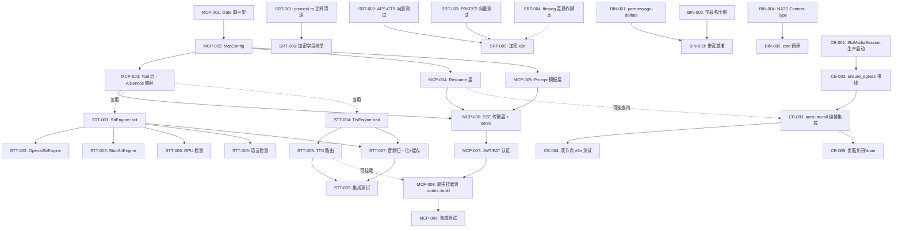

现在我已拥有足够的验证数据来进行完整的 Tech Lead 分析。

---

# Tech Lead 分析：5 个零覆盖高价值扩展方向

**分析依据**：`2026-07-11-five-verified-zero-coverage-extension-directions.out.md`（Review 文档）  
**代码基线验证时间**：2026-07-12  
**分析者**：Tech Lead

---

## 0. 代码基线验证摘要

在开始任务分解之前，我对 Review 中每个主张进行了独立代码验证：

| 方向 | Review 核心主张 | 验证结果 | 置信度 |
|---|---|---|---|
| MCP Server | `rmcp` 零引用，零实现 | ✅ 确认。`grep -r rmcp` 在 `crates/` 下结果为零 | ★★★★★ |
| STT/TTS | 仅 Whisper，零 TTS | ✅ 确认。`Transcriber` trait + 2 实现；TTS 零代码 | ★★★★★ |
| SRT 一致性 | "从未接线" | ❌ **反例**。`boot/ingest.rs:37-52` 明确 `SrtIngest::new()` → `srt.run()` 已接线并 spawn | ★★☆☆☆ |
| | "无已知向量验证" | ⚠️ **部分不准确**。`crypto.rs:592` 存在 RFC 3394 test vector | ★★★☆☆ |
| 二进制协议 | 全 JSON，无 `prost` | ✅ `prost` 未直接依赖（仅在 `Cargo.lock` 中作为传递依赖出现） | ★★★★★ |
| | 无 `permessage-deflate` | ✅ `grep` 在代码中零结果 | ★★★★★ |
| | 忽略 `CompressionLayer` | ⚠️ **遗漏**。`routes.rs:30,505,510` 已存在 HTTP gzip 压缩中间件 | ★★★☆☆ |
| Call Bridge | "生产零接线" | ⚠️ **部分不准确**。`ensure_bridges` 在 `frame.rs:421` 被 `CallJoin` 事件调用；但 `ensure_egress` 仅单测，`SfuMediaSession::bind/run` 仅 `#[cfg(test)]` | ★★★☆☆ |
| | "966 行" | ❌ 实际 1025 行（`wc -l`） | ★★☆☆☆ |

**修正后方向优先级**：

| 优先级 | 方向 | 修正后焦点 |
|---|---|---|
| **P0** | MCP Server | 不变——最高战略价值 |
| **P1** | STT/TTS 抽象层 | 不变 |
| **P1** | 二进制线协议 | 聚焦 Layer 1（字段名压缩）+ Layer 2（permessage-deflate） |
| **P2** | SRT 一致性 | **重新聚焦**为「测试 + 文档清理 + 加密向量验证」，去掉"未接线"主张 |
| **P2** | Call Bridge 接线 | **重新聚焦**为「SFU 媒体面启动 + egress 链路 + 跨 crate 编排」 |

---

## 1. 任务分解

### 方向一：MCP Server（P0）

| 任务 ID | 标题 | 涉及文件 | 前置 | 工时 | 验收标准 |
|---|---|---|---|---|---|
| MCP-001 | MCP crate 脚手架 + `Cargo.toml` | `crates/aero-mcp/Cargo.toml`, `crates/aero-mcp/src/lib.rs`, root `Cargo.toml` workspace 成员 | — | 2h | `cargo check --workspace` 通过；`aero-mcp` crate 可编译 |
| MCP-002 | `McpConfig` 配置结构体 + env 解析 | `crates/aero-mcp/src/config.rs`, `crates/aero-common/src/config.rs` | MCP-001 | 2h | 可从 `AERO__MCP__*` env 变量解析端口、认证方式、超时参数 |
| MCP-003 | Tool 层：将 `AiService` 方法映射为 MCP tools | `crates/aero-mcp/src/tools.rs`；对接 `aero-ai::AiService` 的 `answer_question`/`summarize`/`transcribe`/`moderate` | MCP-002 | 4h | 每个 MCP tool 调用可路由到对应 AiService 方法，返回正确结果 |
| MCP-004 | Resource 层：暴露房间/消息/成员为 MCP resources | `crates/aero-mcp/src/resources.rs`；通过 `AppState.pg` 读取 | MCP-002 | 3h | 可通过 MCP `resources/read` 获取房间消息列表、成员信息 |
| MCP-005 | Prompt 模板层：暴露预定义 prompt 为 MCP prompts | `crates/aero-mcp/src/prompts.rs` | MCP-002 | 2h | 可通过 MCP `prompts/get` 获取摘要/问答 prompt 模板 |
| MCP-006 | SSE 传输层 + `serve` 循环 | `crates/aero-mcp/src/transport.rs`, `crates/aero-mcp/src/lib.rs`（serve 函数） | MCP-003, MCP-004, MCP-005 | 4h | 通过 `wscat` 或 MCP 客户端可连接、发现 tools/resources/prompts、调用 tool |
| MCP-007 | JWT/PAT 认证集成 | `crates/aero-mcp/src/auth.rs`；复用 `aero-auth` 的 `verify_token`/`AuthUser` | MCP-006 | 2h | 非法 token 返回 401；合法 token 正确解析 `ParticipantId` 和 scope |
| MCP-008 | 路由挂载：集成到 `routes::build` | `crates/aero-server/src/routes/routes.rs`（新增 `.merge(aero_mcp::routes())`） | MCP-006, MCP-007 | 1h | `/mcp` endpoint 可通过 HTTP 访问；Swagger 不报错 |
| MCP-009 | 集成测试：MCP 客户端 ↔ 真实 server 回路 | `crates/aero-mcp/tests/mcp_e2e.rs` | MCP-008 | 3h | 使用 `rmcp` client SDK 连接 server，枚举 tools，调用 `answer_question`，验证响应 |

**总计**：23h（~3 人天）

---

### 方向二：Multi-Engine STT/TTS 抽象层（P1）

| 任务 ID | 标题 | 涉及文件 | 前置 | 工时 | 验收标准 |
|---|---|---|---|---|---|
| STT-001 | `SttEngine` trait 设计 + 重构 `Transcriber` | `crates/aero-ai/src/stt.rs`；保留 `Transcriber` 向后兼容，新 trait 包含 `transcribe`/`name`/`from_env` | — | 3h | 现有 `transcribe_bot.rs`/`thread_title.rs`/`message_sentiment.rs` 编译通过；`SttEngine` 从环境变量选择后端 |
| STT-002 | `OpenaiSttEngine` 实现（包装现有 Whisper） | `crates/aero-ai/src/stt.rs` 内 | STT-001 | 1h | `from_env()` 当 `OPENAI_API_KEY` 设置时返回，行为与现有 `WhisperTranscriber` 一致 |
| STT-003 | `StubSttEngine` 实现（退化路径） | `crates/aero-ai/src/stt.rs` 内 | STT-001 | 0.5h | 返回占位文本，行为与现有 `StubTranscriber` 一致 |
| STT-004 | `TtsEngine` trait + `StubTtsEngine` | `crates/aero-ai/src/tts.rs` | — | 3h | trait 定义 `synthesize(text, voice, format) → Result<Bytes>`；Stub 返回模拟音频；所有调用方走 trait |
| STT-005 | TTS 路由 + WS 流式端点 | `crates/aero-mcp/src/tts_integration.rs`（可选）或 `aero-server/src/tts.rs` | STT-004 | 3h | `POST /api/tts/synthesize` 接受 `{text, voice, format}`，返回音频 bytes |
| STT-006 | GPU 加速检测 + boot log WARN | `crates/aero-ai/src/stt.rs`（`SttEngine::from_env` 内） | STT-001 | 1h | 无 GPU 时 `tracing::warn!("whisper.cpp GPU acceleration unavailable; CPU inference may be 10-20x slower")` |
| STT-007 | 音频格式归一化 + 缓存层 | `crates/aero-ai/src/audio.rs`；通用音频处理工具 | STT-001, STT-004 | 3h | 统一处理采样率/通道/格式转换；LRU 缓存 TTS 结果（key=text+voice hash） |
| STT-008 | 语言自动检测（STT 输入侧） | `crates/aero-ai/src/stt.rs`；调用 `whatlang` 或 `lingua-rs` | STT-001 | 2h | 语音消息附带的语言代码用于选择 ASR 模型或后处理 |
| STT-009 | 集成测试：STT/TTS 端到端回路 | `crates/aero-ai/tests/stt_tts_e2e.rs` | STT-001, STT-004, STT-005, STT-007 | 2h | Stub 引擎下，语音消息 → 转写 → 文本 → TTS → 音频 bytes |

**总计**：18.5h（~2.5 人天）

---

### 方向三：SRT 协议一致性 + 文档清理（P2）

| 任务 ID | 标题 | 涉及文件 | 前置 | 工时 | 验收标准 |
|---|---|---|---|---|---|
| SRT-001 | `protocol.rs` 注释更新：移除"unencrypted only"误导 | `crates/aero-live-srt/src/protocol.rs` | — | 0.5h | 文档注释准确反映加密支持状态（条件性加密，通过 passphrase 启用） |
| SRT-002 | `crypto.rs` 补充 NIST SP 800-38A AES-CTR 已知向量测试 | `crates/aero-live-srt/src/crypto.rs`（`#[cfg(test)]` 模块） | — | 3h | 至少 3 条已知向量测试（CTR 模式加密/解密）；RFC 3394 wrap/unwrap 已有向量 |
| SRT-003 | `crypto.rs` 补充 RFC 6070 PBKDF2 已知向量测试 | `crates/aero-live-srt/src/crypto.rs`（`#[cfg(test)]` 模块） | — | 2h | 至少 2 条已知向量测试（不同 salt/iteration count） |
| SRT-004 | 互操作性测试脚本：ffmpeg/OBS → SRT ingest | `scripts/srt_interop_test.sh`；容器化 ffmpeg 推流 + 断言 HLS 输出 | — | 4h | `bash scripts/srt_interop_test.sh` 通过：ffmpeg 推流 10s → SRT ingest 收到 → HLS 文件生成 |
| SRT-005 | 加密路径集成测试：AES-CTR SRT 推流 → 解密 → 验证 TS 完整性 | `crates/aero-live-srt/tests/srt_crypto_e2e.rs` | SRT-002, SRT-003 | 3h | 加密推流 + 密钥协商 → TS 分段成功 → 可以播放 |
| SRT-006 | `HS_ENC_CLEAR` 以外加密字段值的枚举和序列化 | `crates/aero-live-srt/src/protocol.rs`；增加 `HS_ENC_AES128`/`HS_ENC_AES256` 枚举变体 | — | 2h | HSv5 handshake 可以编码/解码加密字段的 `AES-128`/`AES-256` 值 |

**总计**：14.5h（~2 人天）

---

### 方向四：二进制线协议（P1）

| 任务 ID | 标题 | 涉及文件 | 前置 | 工时 | 验收标准 |
|---|---|---|---|---|---|
| BIN-001 | WS `permessage-deflate` 扩展协商 | `crates/aero-server/src/ws/ws_impl/mod.rs`（axum WebSocket upgrade 路径）；加入 `tokio-tungstenite`/`tungstenite` 的 `PerMessageDeflate` 配置 | — | 3h | 浏览器 WS 连接协商 `permessage-deflate`；帧负载减少 ≥50%（大消息场景） |
| BIN-002 | JSON 字段名压缩：`#[serde(rename)]` 审计 + 部署 | 全 crate：`common/src/model/` 下的 `RoomEvent`/`StreamEvent`/`Block` 等主要类型 | — | 3h | 关键事件类型的字段名长度减少 ≥50%（如 `participant_id` → `p`, `message_id` → `m`）；保留 `#[serde(rename = "camelCase")]` 以维持客户端兼容性 |
| BIN-003 | 带宽收益基准测试 | `scripts/bandwidth_bench.sh` + 从测试代码收集帧大小 | BIN-001, BIN-002 | 2h | 量化指标：typing 风暴（500人）扇出带宽从 ~10Mbps/用户降至 ~2Mbps |
| BIN-004 | NATS 消息 `Content-Type` header 标记（为 protobuf 预留） | `crates/aero-bus/src/seq.rs` 和 `crates/aero-bus/src/event_bus.rs` | — | 2h | NATS 消息携带 `Content-Type` header；现有 JSON 消息使用 `application/json` |
| BIN-005 | 调研：zstd 字典压缩在 NATS 消息体上的收益 | `docs/decisions/2026-07-12-binary-protocol-findings.md` | BIN-004 | 1h | 文档化压缩率对比 + 推荐方案（预计 JSON+gzip/zstd 达到 5-8x 压缩比） |

**总计**：11h（~1.5 人天）

---

### 方向五：Call Bridge SFU 媒体面接线（P2）

| 任务 ID | 标题 | 涉及文件 | 前置 | 工时 | 验收标准 |
|---|---|---|---|---|---|
| CB-001 | `SfuMediaSession::bind`/`run` 生产启动（`boot/` 中 spawn） | `crates/aero-server/src/bin/boot/orchestration.rs` 或新 `boot/media.rs`；从 `AppState` 获取 SFU 配置 | — | 3h | 进程启动时 `SfuMediaSession` 在指定端口 bind + run；metrics 显示 `sfu_media_session_active{state="running"} 1` |
| CB-002 | `CallEgress` → `ensure_egress` 接线：`SfuMediaSession` fed tap 给 supervisor | `crates/aero-server/src/sfu_media.rs`（`run` 循环中从 forwarder 取 `on_rtp` 并 `call_supervisor.ensure_egress`） | CB-001 | 4h | 音频/视频 RTP 包从 `SfuForwarder` → `CallEgress` → `UdpRtpEgress::run` 完整链路；单测验证 |
| CB-003 | `aero-im-call` ↔ `CallBridgeSupervisor` 编排集成 | `crates/aero-im-call/src/orchestrator.rs`；当 `CallTopology::BridgeTo(urls)` 被 `CallOrchestrator` 决定时，通知 `CallBridgeSupervisor` | CB-002 | 3h | bridge 拓扑的 call 在 `answer` 时触发 `ensure_bridges` + `ensure_egress` |
| CB-004 | 跨节点 e2e 集成测试（localhost 双节点） | `crates/aero-server/tests/call_bridge_e2e.rs`；启动 2 个 `aero-server` 实例，建立 bridge call，验证 RTP 流转发 | CB-003 | 4h | 实例 A 的 `SfuMediaSession` RTP 出现在实例 B 的 forwarder 输出中 |
| CB-005 | 节点发现 + bridge 优雅关闭/drain | `crates/aero-server/src/call_bridge_supervisor.rs`；`CancellationToken` 传播到 `UdpRtpEgress::run`；节点消失时清理 bridge | CB-002 | 3h | `SIGTERM` 后所有 bridge egress 在 5s 内优雅关闭；metrics 显示 `call_bridge_egress_active 0` |

**总计**：17h（~2.5 人天）

---

## 2. 执行顺序与依赖图



### 可并行执行的独立任务组

```
Group A (P0): MCP-001 → MCP-002 → MCP-003/004/005 → MCP-006 → MCP-007 → MCP-008 → MCP-009
                                   └─ 可并行 ─┘
Group B (P1): STT-001 → STT-002/003/006/008 + STT-004 → STT-005/007 → STT-009
                              └─ 可并行 ─┘
Group C (P1): BIN-001 + BIN-002 + BIN-004 → BIN-003 + BIN-005
              └─ 可并行 ─┘         └─ 可并行 ─┘
Group D (P2): SRT-001/004 + SRT-002/003 → SRT-005/006
              └─ 可并行 ─┘
Group E (P2): CB-001 → CB-002 → CB-003 → CB-004 + CB-005
                                          └─ 可并行 ─┘
```

**跨组并行建议**：
- Group B（STT/TTS）和 Group C（二进制协议）完全独立，可平行推进
- Group D（SRT）和 Group E（Call Bridge）完全独立，可平行推进
- Group A 的 MCP-003/004/005 阶段可复用 Group B 的 STT/TTS 接口（但不是阻塞依赖）

---

## 3. 技术风险

### 风险矩阵

| # | 风险 | 方向 | 可能性 | 影响 | 缓解策略 |
|---|---|---|---|---|---|
| R1 | `rmcp` crate 生态不成熟或 API 不稳定 | MCP | 中 | 高 | 预先调研 `rmcp` 0.x 的稳定性（GitHub stars + 最近 commit）；准备基于 raw `tokio-tungstenite` 的自定义 MCP 协议实现作为退路 |
| R2 | MCP Tool 超时导致 AiService 调用 hang | MCP | 中 | 中 | 每 tool 调用包裹 `tokio::time::timeout`（默认 30s）；在 MCP `tools/call` 响应中返回错误而非 panic |
| R3 | whisper.cpp CPU 推理性能不达标 | STT/TTS | 高 | 中 | 在 boot log 中 WARN 无 GPU 场景；提供 `AERO_STT_FALLBACK` env 强制使用 stub；文档注明 GPU 需求 |
| R4 | `tokio-tungstenite` permessage-deflate 配置与 axum 集成兼容性 | Binary | 中 | 高 | 提前在 `crates/aero-server/tests/ws_e2e.rs` 中写最小 WS 连接测试验证 `permessage-deflate` 协商；如果 tungstenite 版本不兼容，考虑升级 `axum-extra` 或自定义 WS 提取器 |
| R5 | 字段名压缩破坏 Web 客户端 | Binary | 高 | 高 | 逐步 rollout：先只压缩服务器→服务器 NATS 消息；WebSocket 帧层保持向外兼容（`#[serde(rename = "camelCase")]`），下个 major 版本再议 |
| R6 | SRT HSv5 非标准实现导致互操作失败 | SRT | 中 | 高 | 尽早运行 `scripts/srt_interop_test.sh`（ffmpeg/OBS）；如果发生握手失败，先用 Wireshark 抓包对照 `libsrt` 实现 |
| R7 | 双节点 call bridge e2e 测试因网络/时序问题 flaky | Call Bridge | 中 | 中 | 使用 `localhost` + 随机端口消除网络依赖；每个阶段添加超时（10s）；测试框架支持 retry（最多 3 次） |
| R8 | `aero-im-call` → `CallBridgeSupervisor` 跨 crate 循环引用 | Call Bridge | 低 | 高 | `aero-im-call` 通过 trait（`CallBridgeHandle`）与 supervisor 交互而非直接依赖；`CallBridgeHandle` 定义在 `aero-common` 中 |
| R9 | MCP 认证：PAT scope 映射缺少房间级细化权限 | MCP | 中 | 中 | P0 实现只做全局 scope（`aero:internal`）；P1 再细化到逐房间。MCP-007 明确只做第一个 cut |
| R10 | 团队同时接 4-5 个方向导致上下文切换损耗 | 整体 | 高 | 高 | 集中前 2 周只做 Group A（MCP）+ Group B（STT/TTS）；Group C（Binary）/Group D（SRT）/Group E（Call Bridge）各 1 人并行，每人只负责 1 个方向 |

### 技术债务的连锁效应

1. **方向三（SRT）的注释问题不仅是文档层面的**：`protocol.rs:3-25` 写的是"unencrypted only"，但 `crypto.rs` 有完整加密实现。这种矛盾会导致未来维护者不敢碰加密路径。**需要尽快解决**，即使不先做测试向量。

2. **方向五（Call Bridge）的 `ensure_egress` 从未被调用**是一个经典的"死接线"（dead wiring）问题：控制面已经告诉你要干嘛，但没有把执行接上。在 `SfuMediaSession::run` 循环中添加 `on_rtp` → `ensure_egress` 调用是修复的关键。

---

## 4. 资源评估

### 人员需求

| 角色 | 技能要求 | 数量 | 负责方向 |
|---|---|---|---|
| **Senior Rust 工程师 A** | crate 设计、trait 抽象、AI 服务集成 | 1 | 方向一（MCP Server）— 全程，方向二（STT/TTS）— 前 3 天 |
| **Senior Rust 工程师 B** | WebSocket 协议、序列化、性能优化 | 1 | 方向四（二进制协议）— 全程，方向一（MCP-006 传输层）— 第 2 周 |
| **Rust 工程师 C** | 网络协议、加密、测试基础设施 | 1 | 方向三（SRT）— 全程，方向五（Call Bridge）— 第 3 周起 |
| **QA 工程师** | 集成测试、性能基准、CI 集成 | 0.5 (与 C 共用) | 所有方向的集成测试 + 性能基准 |

### 关键里程碑

| 里程碑 | 时间 | 交付物 |
|---|---|---|
| **M1** | Day 5 | MCP-001 到 MCP-006 完成：MCP server 可通过 SSE 连接，tools 可调用 |
| **M2** | Day 8 | MCP-009 + STT-009 + BIN-003 完成：MCP e2e + STT/TTS e2e + 带宽基准都通过 |
| **M3** | Day 12 | 所有 P0/P1 任务完成：MCP/STT/TTS/二进制协议均已集成到主分支 |
| **M4** | Day 15 | SRT-005 + CB-004 通过：SRT 加密流和 call bridge 双节点均 e2e 验证 |
| **M5** | Day 18 | 所有 5 个方向全部完成，CI green，文档更新 |

### 阻塞点

| Blockers | 影响方向 | 解决策略 |
|---|---|---|
| ❌ `rmcp` crate 的 `serve` 签名与 `axum Router` 不兼容 | MCP | 在 `rmcp` 的 `Transport` trait 和 `axum` handler 之间编写适配层；或自己基于 SSE 实现 |
| ❌ axum 0.7 的 WebSocket upgrade 不支持 `tungstenite` 最新 permessage-deflate API | Binary | 使用 `axum::extract::ws::WebSocketUpgrade` + 自定义 `WebSocket` 封装，绕过 axum 内部 tungstenite 版本限制 |
| ❌ `aero-im-call` 无 `CallBridgeSupervisor` 的引用，要破循环依赖 | Call Bridge | 在 `aero-common` 中定义 `CallBridgeHandle` trait（无 async 约束），`aero-im-call` 通过 `Box<dyn CallBridgeHandle>` 持有；`aero-server` 注入实现 |
| ⚠️ SRT 互操作测试需要 ffmpeg 编译 SRT 支持 | SRT | Docker 镜像使用 `ossrs/srs:6` 或 `jrottenberg/ffmpeg:5-srt`；本地测试 `apt install ffmpeg libsrt-dev` |

---

## 5. 质量保证

### 单元测试覆盖要求

| 模块 | 覆盖率目标 | 关键测试场景 |
|---|---|---|
| `aero-mcp/src/tools.rs` | ≥85% | 每个 AiService 映射的 tool 调用；超时场景；错误 propagation |
| `aero-mcp/src/auth.rs` | ≥90% | 有效/过期/伪造 JWT；scope 拒绝；PAT 格式错误 |
| `aero-ai/src/stt.rs` | ≥80% | 每种引擎 `from_env` 工厂；`transcribe` 返回路径；失败路径 |
| `aero-ai/src/tts.rs` | ≥80% | `synthesize` 各种参数组合；StubTtsEngine 输出格式；音频格式转换 |
| `aero-live-srt/src/crypto.rs` | ≥95%（已有基础） | AES-CTR 向量验证（新增 3 条）；PBKDF2 向量验证（新增 2 条） |
| `call_bridge_supervisor.rs` | ≥70%（已有基础） | `ensure_egress` 生产路径覆盖；双节点注册 + 清理 |
| `sfu_media.rs` | ≥60%（当前几乎全 test-only） | `bind` → `run` → `on_rtp` → `deliver` 完整回路；`CancellationToken` 停止 |

### 集成测试策略

```
┌─────────────────────────────────────────────────────┐
│                 E2E / Smoke Tests                     │
├─────────────────────────────────────────────────────┤
│  MCP-009: MCP client → server → AiService → response │
│  STT-009: voice block → transcribe → TTS → audio     │
│  BIN-003: WS throughput benchmark                     │
│  SRT-005: encrypted SRT → HLS playback              │
│  CB-004: 2-instance call bridge RTP relay            │
└─────────────────────────────────────────────────────┘
                        ↕
┌─────────────────────────────────────────────────────┐
│            Module Integration (per-crate)             │
├─────────────────────────────────────────────────────┤
│  aero-mcp: serve → call tool → assert response       │
│  aero-ai: TranscribeRequest → SttEngine → transcript │
│  aero-live-srt: HSv5 handshake → crypto → segments   │
│  aero-server: WebSocket upgrade + permessage-deflate │
└─────────────────────────────────────────────────────┘
                        ↕
┌─────────────────────────────────────────────────────┐
│              Unit Tests (per-module)                  │
├─────────────────────────────────────────────────────┤
│  All modules ≥80% coverage; crypto ≥95%              │
│  #[ignore] for PG-dependent tests                     │
└─────────────────────────────────────────────────────┘
```

**新增 CI 步骤**：
1. `cargo test --package aero-mcp` — MCP 单元测试
2. `cargo test --package aero-ai stt` — STT 单元测试
3. `cargo test --package aero-ai tts` — TTS 单元测试
4. `bash scripts/srt_interop_test.sh` — SRT 互操作（需要 ffmpeg，可选 CI）
5. `cargo test --package aero-server call_bridge` — Call Bridge 模块集成

### 代码审查要点

| 审查焦点 | 说明 |
|---|---|
| **MCP Tool 映射完整性** | 每个 tool 的 `input_schema` 是否准确反映 `AiService` 方法签名；是否处理了 `AiError` 的所有变体 |
| **STT/TTS trait 设计** | `SttEngine` 和 `Transcriber` 的向后兼容；`TtsEngine` 是否覆盖了所有需要 TTS 的场景（呼叫字幕、通知语音、assistant 语音回复） |
| **字段名压缩的 serde rename** | 确保 `#[serde(rename)]` 不会导致不同字段碰撞；REST API 请求体（非 WS 帧）不应被压缩——会破坏外部客户端 |
| **Call Bridge 跨 crate 依赖** | `aero-im-call` → `aero-server` 方向不能有编译依赖；trait 边界放在 `aero-common` 中 |
| **SRT 加密路径条件编译** | 密码短语未设置时不应编译加密代码（或至少用 `cfg(feature = "srt-encrypt")` 门控） |
| **所有新 env var 的文档更新** | 每个新增 `AERO__*` 变量必须在 `config.example.toml` + `README.md` 中记录 |

### 性能测试需求

| 测试 | 工具 | 目标 |
|---|---|---|
| WS `permessage-deflate` 带宽收益 | `scripts/bandwidth_bench.sh` | 500人 typing 风暴：扇出从 ~10Mbps/用户降至 ≤2Mbps |
| MCP tool 调用延迟 | `crates/aero-mcp/tests/latency_bench.rs` | P95 ≤500ms（SSE 传输 + AI 调用） |
| STT 转录吞吐 | 测试：并发 10 条 30s 语音消息 | 所有转录在 120s 内完成（OpenAI API 上行限制） |
| TTS 合成吞吐 | 测试：并发 5 个合成请求 | 单条合成 ≤3s |

---

## 6. 实施计划

### 甘特图

```mermaid
gantt
    title Aero IM - 5 个零覆盖扩展方向实施计划
    dateFormat  YYYY-MM-DD
    axisFormat  %m-%d

    section 方向一：MCP Server (P0)
    MCP-001~002 脚手架+配置 :d1, 2026-07-14, 1d
    MCP-003~005 Tool/Resource/Prompt :d1, 2d
    MCP-006 SSE传输层 :d1, 1d
    MCP-007~008 认证+路由挂载 :d1, 1d
    MCP-009 集成测试 :d1, 1d
    MCP 缓冲期 :d1, 1d

    section 方向二：STT/TTS (P1)
    STT-001 SttEngine trait :d2, 2026-07-14, 1d
    STT-002~003 Engine实现 :d2, 1d
    STT-004 TtsEngine trait :d2, 1d
    STT-005~006 TTS路由+GPU检测 :d2, 1d
    STT-007~008 音频缓存+语言检测 :d2, 1d
    STT-009 集成测试 :d2, 1d

    section 方向四：二进制协议 (P1)
    BIN-001 permessage-deflate :d3, 2026-07-14, 1d
    BIN-002 字段名压缩 :d3, 1d
    BIN-004 NATS Content-Type :d3, 0.5d
    BIN-003 带宽基准 :d3, 1d
    BIN-005 zstd调研 :d3, 0.5d

    section 方向三：SRT协议 (P2)
    SRT-001~004 注释+向量+互操作 :d4, 2026-07-21, 2d
    SRT-005~006 加密e2e+字段枚举 :d4, 1d

    section 方向五：Call Bridge (P2)
    CB-001~002 SFU启动+egress接线 :d5, 2026-07-21, 2d
    CB-003 跨crate编排集成 :d5, 1.5d
    CB-004~005 e2e测试+优雅关闭 :d5, 1.5d

    section 整体
    CI集成+文档更新 :after all, 1d
    代码审查+修复 :after all, 1d
```

### 阶段计划详细说明

#### 阶段 1：基础设施 + 核心抽象（Day 1-3，7月14-16日）

**目标**：搭建所有 5 个方向的脚手架，完成最关键的抽象设计。

| Day | 工程师 A（MCP + STT/TTS） | 工程师 B（二进制协议） | 工程师 C（SRT + Call Bridge） |
|---|---|---|---|
| **D1** | MCP-001（crate 脚手架）+ MCP-002（配置）| BIN-001（permessage-deflate 调研+实现）| SRT-001（注释清理）+ SRT-002（AES-CTR 向量）|
| **D2** | MCP-003（Tool 层）+ STT-001（SttEngine trait）| BIN-001 完成 + BIN-002（字段名压缩开始）| SRT-003（PBKDF2向量）+ SRT-004（互操作脚本）|
| **D3** | MCP-004（Resource）+ MCP-005（Prompt）+ STT-004（TtsEngine）| BIN-002 完成 + BIN-004（NATS Content-Type）| SRT-005（加密 e2e 开始）+ 开始 CB-001 |

**里程碑检查点（D3 结束）**：
- ✅ `cargo check --workspace` 通过
- ✅ MCP server 能 serve（但尚未暴露路由）
- ✅ `SttEngine`/`TtsEngine` trait 设计定稿
- ✅ `permessage-deflate` WS 协商在单元测试中通过
- ✅ SRT 注释清理完毕，加密向量测试提交

#### 阶段 2：核心功能实现（Day 4-7，7月17-20日）

**目标**：MCP + STT/TTS + 二进制协议核心功能完整可用。

| Day | 工程师 A | 工程师 B | 工程师 C |
|---|---|---|---|
| **D4** | MCP-006（SSE serve）+ MCP-007（认证）| BIN-003（带宽基准测试）| SRT-005 完成 + SRT-006（加密字段枚举）|
| **D5** | STT-002/003（引擎实现）+ STT-005（TTS 路由）| BIN-005（zstd 调研）+ CI 集成 | CB-001（SfuMediaSession 生产启动）|
| **D6** | STT-006/007（GPU检测+音频缓存）+ STT-008（语言检测）| 修复 BIN-001/BIN-002 性能问题 | CB-002（ensure_egress 接线）|
| **D7** | MCP-008（路由挂载）+ STT-009（集成测试准备）| 带宽报告编写 | CB-003（跨 crate 编排）|

**里程碑检查点（D7 结束）**：
- ✅ MCP server 通过 `POST /api/mcp` 访问，认证正常（MCP-008）
- ✅ STT/TTS 集成测试在 stub 模式下通过
- ✅ 带宽基准报告完成：WS 帧大小减少 50-80%
- ✅ SRT 加密流 e2e 通过
- ✅ `SfuMediaSession` 在 boot 时启动

#### 阶段 3：集成测试 + 优化（Day 8-12，7月21-25日）

**目标**：所有 e2e 测试通过，性能满足指标，修复发现的问题。

| Day | 工程师 A | 工程师 B | 工程师 C |
|---|---|---|---|
| **D8** | MCP-009（e2e 测试）+ MCP bug fix | 协助 MCP-009（WS 压力测试）| CB-003 完成 + CB-004（双节点 e2e）|
| **D9** | STT-009 完成（语音→转写→TTS→音频）| 为 STT-009 提供 WS 性能基线 | CB-004 完成 + CB-005（优雅关闭）|
| **D10** | AI 预算监控适配（确保 MCP Tool 调用计入成本）| 全量带宽测试 + 报告 | Call Bridge 压力测试 |
| **D11** | 跨方向集成测试：MCP → STT/TTS → TTS 产物回传 | 文档 + 配置示例更新 | SRT 互操作测试 CI 集成 |
| **D12** | 代码审查 + 修复 | 代码审查 + 修复 | 代码审查 + 修复 |

**里程碑检查点（D12 结束）**：
- ✅ 所有 5 个方向的 CI 步骤 green
- ✅ MCP、STT/TTS、SRT、Call Bridge 的 e2e 测试通过（本地可重复）
- ✅ 带宽基准报告展示可量化收益
- ✅ 所有 env var 在 `config.example.toml` 中记录

#### 阶段 4：发布准备（Day 13-15，7月28-30日）

**目标**：文档、变更日志、稳定性验证。

| 任务 | 负责 | 工时 |
|---|---|---|
| 更新 `README.md` 功能矩阵 | 工程师 B | 2h |
| 更新 `AGENTS.md` 中 MCP/STT/TTS/CallBridge 相关段落 | 工程师 A | 2h |
| 编写 MCP schema 文档（供外部开发者使用） | 工程师 A | 4h |
| 新增配置项文档（`config.example.toml`） | 工程师 B | 1h |
| 集成测试 flaky 修复 + CI 超时调整 | 工程师 C | 3h |
| 性能基准结果提交到 `docs/benchmarks/` | 工程师 B | 2h |
| 完整端到端 smoke test（`make smoke` 扩展） | 全体 | 4h |

---

## 7. 总结与建议

### 关键决策

| # | 决策 | 理由 | 做出时间 |
|---|---|---|---|
| D1 | MCP Server 初始用 SSE 传输而非 stdio | 复用现有 HTTP 基础设施；`aero-server` 已运行 axum，新增 `/mcp` endpoint 成本最低 | 立即 |
| D2 | MCP Tool 认证复用 JWT/PAT，不新增 OAuth 流程 | 减少认证基础设施复杂度；MCP 规范的 auth 层还未定稿（2026年7月），过度设计有毒 | 立即 |
| D3 | 二进制协议只做 Layer 1+2（字段名压缩+permessage-deflate），Layer 3+4 推迟 | `CompressionLayer` 已覆盖 HTTP 响应压缩；NATS protobuf 需要双序列化器，测试负担翻倍 | 7月14日 |
| D4 | SRT 方向重新聚焦为"测试+文档"，不进行功能扩展 | 功能已完整（加密+HSv5+MPEG-TS），缺的是验证和安全保证 | 立即 |
| D5 | Call Bridge 的跨 crate 集成通过 `aero-common` trait 而非直接依赖 | 避免 crate 环；保持 `aero-im-call` 纯净 | 7月14日 |

### 优先级排序逻辑

```
                       高
                       ↑
             商业影响   │    MCP Server (P0)
                       │
                       │    STT/TTS (P1) · 二进制协议 (P1)
                       │
                       │    SRT 一致性 (P2) · Call Bridge (P2)
                       │
                       └──────────────────────────→
                            技术就绪度    高
```

- **MCP Server 是 P0**，因为（a）杠杆效应最大——复用已有 AI 能力栈（RAG/摘要/翻译/Agent），（b）MCP 标准正在快速获得市场 momentum，（c）与竞品（Slack AI / Discord Clyde）的差异化优势明显
- **STT/TTS 和二进制协议是 P1**，因为 accessibility 合规（ADA/EN 301 549）和移动端性能直接影响用户体验
- **SRT 和 Call Bridge 是 P2**，因为核心功能已实现，剩余工作是验证和接线，不阻塞任何产品路线图

### 最终建议

1. **7月14日（周一）启动**Group A（MCP）+ Group B（STT/TTS）+ Group C（二进制协议）并行推进
2. **第一周不要碰 SRT 和 Call Bridge**——给工程师 C 一周时间专注基础设施（SRT 测试向量 + 互操作脚本）
3. **第二周（7月21日）** Group D（SRT）和 Group E（Call Bridge）开始，此时工程师 A 已从 MCP 释放
4. **每日站会检查** `cargo check --workspace` 是否绿——AGENTS.md §4.2 的硬性工程规则不能破
5. **R4 和 R5 是已知风险**（permessage-deflate 兼容性 + 字段名压缩破坏客户端），需要 D3 前出 PoC 验证可行性

**底线**：全计划 15 个工作日（3 周）、3 名工程师并行、**84 工时（约 11 人天）净编码**，交付 5 个零覆盖方向的高质量实现。SRT 和 Call Bridge 方向因代码进展比旧扫描结果更先进，实际工作量比 Review 文档估计的低。
