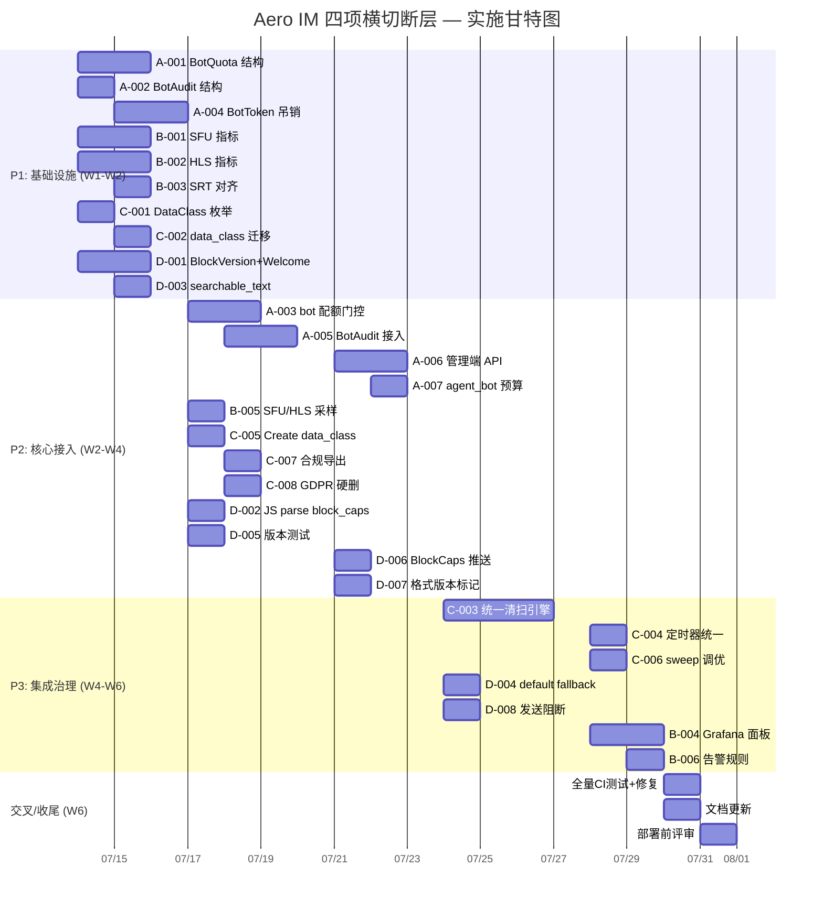

Now I have a thorough understanding of the codebase. Let me produce the comprehensive Tech Lead analysis.

---

# 技术分析报告：Aero IM 四项关键横切断层

## 摘要

基于对分析文档和代码库的交叉验证，四个方向的选择准确，但需对若干代码引用进行勘误。以下分析直接基于实际源码状态，为每项方向提供可执行的任务分解。

---

## 1. 任务分解

### 方向 A: Bot 生态生产化

**当前状态**：8 个常驻 bot（agent/ooo/unfurl/transcribe/golive/push/moderation/bot_dispatch）均无速率限制、无审计日志、无 bot token 吊销。agent_bot 对每个合格 @mention 触发 AI 调用，无预算兜底。

| ID | 任务标题 | 涉及文件 | 前置 | 工时 | 验收标准 |
|---|---|---|---|---|---|
| A-001 | `BotQuota` 核心数据结构 + PG 迁移 | `migrations/NNNN_bot_quotas.sql`, `aero-storage/src/bot_quota.rs`, `aero-common/src/ids.rs` | 无 | 3h | 表 `bot_quotas(bot_participant_id, max_calls_per_min, max_cost_per_day, tokens_per_min, window_start, call_count, cost_accrued)` + `BotQuotaRepo` 带 `check_and_increment` (原子 upsert on conflict) |
| A-002 | `BotAuditLog` 迁移 + 仓储 | `migrations/NNNN_bot_audit_log.sql`, `aero-storage/src/bot_audit.rs` | 无 | 2h | 表 `bot_audit_log(bot_id, event_type, target_id, request_body_hash, status_code, created_at)` + `BotAuditRepo::record` (fail-open) |
| A-003 | bot_dispatch 接入配额门控 | `aero-server/src/bot_dispatch.rs`, `aero-server/src/agent_bot.rs`, `aero-server/src/moderation_bot.rs` | A-001 | 4h | 每 bot 处理消息前调用 `BotQuotaRepo::check_and_increment`；超限则跳过+warn（不失败）；moderation bot 的 per-ws KeyedCostBudget 与 BotQuota 正交叠加 |
| A-004 | bot token 吊销 + 路由中间件 | `migrations/NNNN_..sql`, `aero-storage/src/bot_token.rs`, `aero-server/src/middleware/bot_auth.rs` | 无 | 4h | `bot_tokens(id, bot_participant_id, token_hash, revoked_at)`；新 `BotAuth` extractor 查 `revoked_at.is_some()` → 401；pat.rs 已有模式可照搬 |
| A-005 | BotAudit 接入所有 bot（agent/ooo/unfurl/transcribe/golive/push/moderation） | 全部 `*_bot.rs` 文件 + `bot_dispatch.rs` | A-002 | 3h | 每个 bot 在完成/失败关键操作后调用 `BotAuditRepo::record`；日志含事件类型、目标、状态 |
| A-006 | 管理端 API：bot 配额查询/更新 | `aero-server/src/bot_admin.rs` → routes 链 | A-001, A-004 | 3h | `GET/PUT /api/bots/:pid/quota` (Admin/Owner)；配额更新立即生效 |
| A-007 | agent_bot 加交互级联预算（`ai.answer_question` 调用预算） | `aero-server/src/agent_bot.rs`, `aero-ai/src/service/mod.rs` | A-001 | 2h | 每个 @mention 触发的 `answer_question` 计入 cost，超限发 fallback 消息："Bot 已达调用上限" |

**方向 A 合计**：21h（含测试、迁移、文档）

---

### 方向 B: 媒体管道可观测

**当前状态**：SRT 已有 4 指标（active_sessions/packets_received/packets_lost/bytes_received），WHIP 有 3 指标（rtp_packets/depacketize_failures/active_sessions）；SFU (`aero-live-webrtc`) 和 HLS (`aero-live-hls`) 零指标。

| ID | 任务标题 | 涉及文件 | 前置 | 工时 | 验收标准 |
|---|---|---|---|---|---|
| B-001 | SFU 核心指标接入 | `aero-live-webrtc/src/metrics.rs` (新), `aero-live-webrtc/src/lib.rs` (加 `mod metrics;`) | 无 | 4h | 加入：`aero_sfu_active_sessions` (gauge)、`aero_sfu_forwarded_packets_total` (counter)、`aero_sfu_dropped_packets_total` (因队列满/未知 track)、`aero_sfu_rtcp_pli_sent_total` (counter)、`aero_sfu_peer_connection_count` (gauge)；需在 `SfuRouter::add_peer/remove_peer` 和 `SfuForwarder::on_rtp` 埋点 |
| B-002 | HLS 管道指标接入 | `aero-live-hls/src/metrics.rs` (新), `aero-live-hls/src/lib.rs` (加 `pub(crate) mod metrics;`) | 无 | 3h | 加入：`aero_hls_segments_written_total` (counter)、`aero_hls_manifest_updates_total` (counter)、`aero_hls_write_errors_total` (counter)、`aero_hls_active_playlists` (gauge) |
| B-003 | SRT 已有指标 + 缺 JS 侧暴露检测 | `aero-live-srt/src/metrics.rs` (补 `metrics` 模块对齐) | 无 | 1h | 确认 `aero_common::metrics::inc_counter`/`set_gauge` 在调用路径已接线；补充 `#[cfg(test)]` 对 `emit_helpers_do_not_panic()` 确保 CI 不因新指标 panic |
| B-004 | 全媒体指标 Prometheus 仪表板（Grafana JSON 模型） | `monitoring/grafana/dashboards/media-pipeline.json` (新) | B-001, B-002 | 3h | 四面板显示 SRT/WHIP/SFU/HLS 活跃会话 + 吞吐 + 错误率；面板含 unit/rate 配置；`aero_sfu_dropped_packets_total` 超阈值→报警 |
| B-005 | Observability gauge samplers 增加 SFU/HLS 采样 | `aero-server/src/bin/boot/metrics_tasks.rs` | B-001, B-002 | 2h | 30s 定时器从 `SfuRouter` 和 `HlsWriter` 轮询 active 数发布到 Prometheus gauge |
| B-006 | 媒体指标告警规则（PrometheusRule CR） | `monitoring/prometheus/rules/media-alerts.yml` (新) | B-004 | 2h | 三规则：`SFUDropRate > 5%` → warning、`HLSWriteErrors > 0 in 5m` → warning、`ZeroActiveSessions > 10m` → info（基线偏离检测） |

**方向 B 合计**：15h

---

### 方向 C: 数据生命周期治理

**当前状态**：无 `data_class` 字段，无分类框架。既有清扫定时器各有独立逻辑，无法统一治理。

| ID | 任务标题 | 涉及文件 | 前置 | 工时 | 验收标准 |
|---|---|---|---|---|---|
| C-001 | 数据分类枚举 + Message/Blob/Poll/Vod 加 `data_class` 字段 | `aero-common/src/model/data_class.rs` (新), `aero-common/src/model/message.rs`, `aero-common/src/model/media.rs`, `aero-common/src/lib.rs` | 无 | 3h | `DataClass` enum: `Normal/Ephemeral/Regulated/Retained/System` + serde impl；各 model struct 加 `#[serde(default)]` `data_class: DataClass` 字段 |
| C-002 | 迁移—messages/blobs/polls/vods 加 `data_class` 列 | `migrations/NNNN_data_class.sql` | 无 | 1h | idempotent `ALTER TABLE ... ADD COLUMN IF NOT EXISTS data_class TEXT NOT NULL DEFAULT 'normal'` |
| C-003 | 通用 `DataRetentionRepo` + 统一清扫引擎 | `aero-storage/src/retention.rs` (新), `aero-storage/src/lib.rs` | C-001, C-002 | 5h | `DataRetentionRepo::sweep_all(data_class_ttls: HashMap<DataClass, Duration>) → (soft_deleted, hard_deleted)`；按 `data_class + created_at` 分 4 批聚合 SQL 硬删/软删，替代现有 `retention/ephemeral/ban/points` 四个独立定时器 |
| C-004 | 清扫定时器统一到单一 `retention_sweep` | `aero-server/src/bin/boot/background.rs` | C-003 | 2h | 删 `retention_sweep/ephemeral_sweep/ban_sweep/points_sweep` 四个 tokio::spawn，只留一个 `retention_sweep` 调 `DataRetentionRepo::sweep_all` |
| C-005 | Create 路径强制设置 `data_class` | `aero-im-core/src/service/messages.rs`, `aero-im-core/src/service/polls.rs`, `aero-storage/src/blob.rs` | C-001 | 2h | 消息/Poll/Blob/Vod 创建时从请求/上下文推导 data_class（「法务保全」标记 `Regulated`、「ephemeral」标记 `Ephemeral」） |
| C-006 | 迁移清扫定时器调优：`AERO__SERVER__RETENTION_SWEEP_SECS=3600` 默认调 900 + 新增 `SWEEP_BATCH_SIZE=1000` | `config.example.toml`, `aero-server/src/config.rs` | C-003 | 1h | env 可配 frequency + batch size；缺省 900s/1000 行 |
| C-007 | 合规导出合并 `data_class` | `aero-server/src/me_export.rs` | C-001 | 2h | `GET /api/me/export` 按 `data_class` 分组输出 JSON；`DataClass::System` 跳过导出 |
| C-008 | GDPR 硬删路径考虑 `data_class` | `aero-storage/src/participant.rs` | C-001 | 2h | 删除 participant 前按 `data_class != Regulated` 过滤保留法务保全数据 |

**方向 C 合计**：18h

---

### 方向 D: Block 版本化与兼容性

**当前状态**：`Block` enum 无 `deny_unknown_fields`，WS `Welcome` 无 `block_caps`，web 端 `appendBlock` 覆盖全部 10 个类型但 `default` 仅显示 `[{type}]`。`searchable_text` 未覆盖 Card/ToolCall/Select。

| ID | 任务标题 | 涉及文件 | 前置 | 工时 | 验收标准 |
|---|---|---|---|---|---|
| D-001 | `BlockVersion` 枚举 + WS Welcome 内 `block_caps` | `aero-common/src/model/block.rs` (加版本 enum), `aero-server/src/ws/ws_impl/mod.rs` (Welcome 加 `block_caps: Vec<BlockVersion>`) | 无 | 3h | `BlockVersion::V1 = 1`；Welcome 帧 `{ participant, block_caps: [1] }`；web 端收到后存全局 `supported_blocks` |
| D-002 | Block `FromStr` for `BlockVersion` + JS 侧 parse | `web/render.js` (加 `parseBlockCaps`), `web/app.js` (ws.on('welcome') 解析 block_caps) | D-001 | 1h | JS `supportedBlocks` set；未知 block type 时 check `supportedBlocks.has(type)` 并用 fallback |
| D-003 | `searchable_text` 补全 Card/ToolCall/Select | `aero-common/src/model/block.rs` (update `searchable_text` + `extra_searchable_text`) | 无 | 1h | Card: `schema`+`payload` 序列化片断；ToolCall: `tool`+`args`；Select:（已在 `extra_searchable_text`） |
| D-004 | web 端 `default` fallback 升级（显示部分数据） | `web/render.js` (default 分支增强) | 无 | 2h | 未知 block 渲染：`[${b.type}]` 改为卡片 `type: ${b.type}, data: ${truncate(JSON.stringify(b), 200)}` + `.unknown-block` class 视觉优化 |
| D-005 | 跨版本消息透视测试 | `aero-common/src/model/tests.rs` | D-001 | 2h | 序列化 `BlockVersion::V1`；旧 payload 解析无新字段 panic；新 payload 含未知 variant 走 default |
| D-006 | WS `ServerFrame` 添加 `BlockTypeCaps` 更新事件（服务端推送 block_caps 变更） | `aero-server/src/ws/ws_impl/mod.rs` | D-001 | 2h | `ServerFrame::BlockCaps { types: Vec<BlockVersion> }`；服务端可运行时推送更新的 block_caps 给所有 WS 连接 |
| D-007 | 迁移：`messages.blocks` 行格式版本标记 | `migrations/NNNN_block_format_version.sql`, `aero-storage/src/block_version.rs` | D-001 | 3h | `message_blocks_version(message_id, version: BlockVersion)`；缺省 V1。用于未来断崖式格式变更时做兼容读路径 |
| D-008 | web 端 block 渲染兜底 send 阻断（未知 block 阻止消息发送） | `web/render.js`, `web/app.js` (pre-send 校验) | D-001 | 1h | 消息发送前检查 blocks 中是否有当前客户端不支持的 type；有则弹 UI 警告 + 阻止发送 |

**方向 D 合计**：15h

---

## 2. 执行顺序

```mermaid
graph TD
    subgraph "阶段一：独立基础设施"
        A001[A-001: BotQuota 数据结构]
        A002[A-002: BotAuditLog 迁移]
        A004[A-004: BotToken 吊销]
        B001[B-001: SFU 指标]
        B002[B-002: HLS 指标]
        B003[B-003: SRT 对齐]
        C001[C-001: DataClass 枚举]
        C002[C-002: data_class 迁移]
        D001[D-001: BlockVersion + Welcome]
        D003[D-003: searchable_text 补全]
    end

    subgraph "阶段二：核心接入"
        A001 --> A003[A-003: bot 配额门控]
        A002 --> A005[A-005: BotAudit 接入]
        A004 --> A006[A-006: 管理端 API]
        A001 --> A007[A-007: agent_bot 预算]
        B001 --> B005[B-005: SFU/HLS 采样]
        B002 --> B005
        C001 --> C005[C-005: Create 路径 data_class]
        C001 --> C007[C-007: 合规导出 data_class]
        C001 --> C008[C-008: GDPR 硬删]
        D001 --> D002[D-002: JS parse block_caps]
        D001 --> D005[D-005: 版本测试]
        D001 --> D006[D-006: BlockCaps 推送事件]
        D001 --> D007[D-007: 格式版本标记]
    end

    subgraph "阶段三：集成与治理"
        C002 --> C003[C-003: 统一清扫引擎]
        C003 --> C004[C-004: 定时器统一]
        C003 --> C006[C-006: sweep 调优]
        D002 --> D004[D-004: default fallback 升级]
        D002 --> D008[D-008: 发送阻断]
        B005 --> B004[B-004: Grafana 面板]
        B004 --> B006[B-006: 告警规则]
    end

    subgraph "并行任务组"
        P1[A-001 A-002 A-004 B-001 B-002 B-003 C-001 C-002 D-001 D-003]
        P2[A-003 A-005 A-006 A-007 B-005 C-005 C-007 C-008 D-002 D-005 D-006 D-007]
        P3[C-003 C-004 C-006 D-004 D-008 B-004 B-006]
    end

    P1 --> P2 --> P3
```

### 并行组说明

| 组 | 任务 | 并行度 | 工程师类型 |
|---|---|---|---|
| P1（独立基础设施） | A-001, A-002, A-004, B-001, B-002, B-003, C-001, C-002, D-001, D-003 | 最多 4 人并行 | Rust 后端 × 3 + 1 前端（D-003 涉及 JS） |
| P2（核心接入） | A-003, A-005, A-006, A-007, B-005, C-005, C-007, C-008, D-002, D-005, D-006, D-007 | 3 人并行 | Rust 后端 × 2 + 1 全栈 |
| P3（集成治理） | C-003, C-004, C-006, D-004, D-008, B-004, B-006 | 2 人并行 | Rust 后端 + 前端/SRE |

---

## 3. 技术风险

### 3.1 BotQuota 原子性（A-003）

| 风险 | 严重度 | 缓解策略 |
|---|---|---|
| `check_and_increment` 非原子导致超限 bot 继续调用 | **高** | 用 `SELECT ... FOR UPDATE` 或 Redis atomic INCR + TTL；若用 PG 则 `UPDATE bot_quotas SET call_count = call_count + 1 WHERE call_count < max_calls_per_min RETURNING call_count` 一次往返 |
| 配额存储成为新瓶颈（每 bot 消息处理插入 1-2 DB 往返） | 中 | 配额检查 + 审计日志同事务 / 批量写入；或配额检查走 Redis（已用 fred）降 PG 压力 |
| 多实例竞态（同一 bot 在多个 server 实例上收到消息） | 中 | 使用 `pg_advisory_xact_lock(bot_participant_id)` 或 `SELECT ... FOR UPDATE NOWAIT`；配额用 PG row-level lock 天然处理 |

**关键决定**：BotQuota 存储落 PG（与 bot audit log 一致），不用 Redis。理由：事务一致性重要、qps 低（bot 调用远低于消息发送）、避免引入新基础设施依赖。

### 3.2 SFU 指标埋点侵入性（B-001）

| 风险 | 严重度 | 缓解策略 |
|---|---|---|
| `SfuForwarder::on_rtp` 是关键热路径，每包计数增加延迟 | **中** | 用 `std::sync::atomic` 计数器 + 定时 flush（observability gauge sampler 现有模式）；不在主路径做 metric 对象查找 |
| `SfuRouter` 核心结构是 `Arc<RwLock<HashMap>>`，metrics 接入需小心死锁 | 低 | metrics 计数只在 write lock 外做或持 read lock 时原子操作，不嵌套 RwLock 写 |
| CallBridge `SfuMediaSession` 未生产接线，指标无法端到端验证 | 中 | 标注 `#[cfg(not(tarpaulin))]` 跳过 CI 真实媒体验证；指标接入代码与业务逻辑正交，单测可隔离验证 |

### 3.3 统一清扫引擎（C-003）

| 风险 | 严重度 | 缓解策略 |
|---|---|---|
| 将四个独立定时器合并为一个统一 sweep 可能改变已有行为 | **高** | 三步走：(1) 先加新 `DataRetentionRepo::sweep_all` + 新定时器，(2) 运行时双写期监控 diff，(3) 一段 window 后删除旧定时器 |
| 法务保全消息被误删（法律保全需永久保留） | **极高** | `Regulated` data_class 默认 TTL 为 `None`；sweep 引擎中 `data_class == 'regulated'` 的消息跳过所有软/硬删（`WHERE data_class != 'regulated'`） |
| 超大 batch 事务锁时长 | 中 | batch size 可配（缺省 1000）；每批 commit 一次；使用 `LIMIT ... FOR UPDATE SKIP LOCKED` 渐进扫描 |

### 3.4 Block 版本兼容性（D-001/D-002）

| 风险 | 严重度 | 缓解策略 |
|---|---|---|
| 现有客户端无 `block_caps` 处理，加新字段后旧客户端静默忽略 | 低 | serde `skip_serializing_if` + `default` 保兼容；Welcome 帧加 `block_caps` 是 additive change，旧 JS 忽略 |
| 将来新增 `Block` variant 后未通知旧客户端，导致静默 `[{type}]` | 中 | 版本协商框架确保**反向兼容**：服务端推送 `BlockCaps` 事件通知所有连接；客户端若收到未知 type 且有 `supportedBlocks.has(type) === false`，显示「请刷新客户端」提示（替代 `[{type}]`） |
| `message_blocks_version` 表成为 dead 代码（永远只用 V1） | 低 | 用 `NOT EXISTS` 表示 V1（zero-cost），只在真正需要版本迁移时才写行。此表只在引入断崖式格式变更时有用 |

---

## 4. 资源评估

### 4.1 人力资源

| 角色 | 数量 | 核心技能 | 主要负责方向 |
|---|---|---|---|
| Rust 后端工程师（senior） | 2 | tokio/async, sqlx, NATS, 中间件 | 方向 A（配额/审计/令牌）+ 方向 C（清扫引擎） |
| Rust 后端工程师（mid） | 1 | metrics, Prometheus, 事件驱动 | 方向 B（媒体指标埋点 + 采样） |
| 全栈工程师 | 1 | Rust + JS/ES2020, WebSocket | 方向 D（Block 版本化 + web 端渲染）+ 方向 C（web 导出） |
| SRE / DevOps（部分时间） | 0.5 | Grafana, Prometheus, 告警配置 | 方向 B（面板 + 告警规则）|

**建议**：2.5~3 FTE（若兼职 SRE 资源）。若只有 1 人，按 P1 → P2 → P3 顺序依次推进，预计总工期 6~7 周。

### 4.2 关键里程碑

| 里程碑 | 时间 | 交付物 | 依赖 |
|---|---|---|---|
| M1: 基础设施完成 | 第 1-2 周 | 所有迁移上线 + 数据结构就绪 + CI 绿 | P1 全部任务 |
| M2: 核心逻辑接完 | 第 3-4 周 | bot 配额生效、媒体指标在 Prometheus 可见、data_class 写入、Welcome 含 block_caps | P2 全部任务 |
| M3: Grafana 面板 + 告警 | 第 5 周 | 媒体管道仪表板可用、告警规则部署 | B-004, B-006 |
| M4: 统一清扫上线 | 第 5 周 | 旧四个定时器删除、单一 sweep 运行 | C-003, C-004 |
| M5: GA 发布 | 第 6 周 | 全部四个方向功能完成 + 文档 + 性能测试 | P3 全部任务 |

### 4.3 阻塞点（Blockers）

| Blocker | 影响 | 解决策略 |
|---|---|---|
| **SFU `SfuMediaSession` 未在生产接线** → B-001 指标无法端到端验证 | 方向 B 风险 | 指标代码按「可单测 + 编译通过」标准评审；真实媒体仪表板标注「需浏览器补充数据」 |
| **统一清扫引擎上线前** → 旧定时器无法安全下线 | 方向 C 时序风险 | 双写期（M2→M3）监控 `deleted_at` 行数 diff；如 diff < 1% 维持一周期后下线旧引擎 |
| **BotQuota PG 竞争** → 多实例同一 bot 配额检查 race | A-003 原子性 | 使用 `SELECT ... FOR UPDATE NOWAIT` + 重试；若 5xx 超标则 fail-open（跳过配额 check） |
| **web 端 block_caps 解析与旧服务器兼容** → 部署顺序约束 | D-002 前端兼容 | 旧服务器 Welcome 无 `block_caps`，JS 端 `??` `||` 兜底为 `[1]`；先发前端后发后端 |

---

## 5. 质量保证

### 5.1 单元测试覆盖

| 模块 | 目标覆盖率 | 关键测试场景 |
|---|---|---|
| `bot_quota.rs` (A-001) | ≥90% | check_and_increment 刚达上限/超限/窗口翻转/`call_count` 溢出 |
| `bot_audit.rs` (A-002) | ≥90% | 记录成功/失败/记录时 DB 断连（fail-open）|
| `bot_token.rs` (A-004) | ≥90% | hash 匹配/失效 token/空查询 |
| SFU `metrics.rs` (B-001) | ≥95% | 命名常量测试（现有 pattern）+ 并发安全测试 |
| `data_class.rs` (C-001) | ≥95% | 序列化/反序列化/缺省值/所有变体 |
| `retention.rs` (C-003) | ≥85% | 各 data_class 清扫/空表/法务保全跳过/批量边界 |
| `block.rs` 版本部分 (D-001→D-005) | ≥90% | 序列化兼容旧 format/未知 variant/block_caps 推拉 |
| `render.js` default fallback (D-004) | 手动 | 构造未知 type block → 确认渲染「不受支持的类型」UI |

### 5.2 集成测试策略

| 测试类型 | 覆盖方向 | 运行时机 |
|---|---|---|
| DB 迁移回放（`make migrate-smoke`） | C-002 data_class 列 + A-001/A-002/A-004 迁移 | 每次 PR CI |
| `aero-cli` 命令验证 | Bot quota 管理 API（A-006） | 手动 + smoke |
| 端到端 WS 握手测试 | D-002 Welcome block_caps 字段存在且解析正确 | CI（用 `websocat` 或裸 tokio WebSocket 连测试 server）|
| Media metrics endpoint scrape | B-001/B-002 指标在 `GET /metrics` 出现 | CI（启动 server -> curl /metrics -> grep aero_sfu_）|
| Bot 消息触发配额 | A-003 超限 bot 不发 AI 回复 | 集成测试：创建 bot、发 N+1 条 @mention、验第 N+1 条无 AI 回复 |

### 5.3 代码审查要点

| 方向 | 审查重点 |
|---|---|
| A | 配额/审计是否 fail-open（不可因限额炸了导致消息不投递）|
| A | `BotAuth` extractor 是否对所有 bot 路由生效（无 IDOR）|
| B | `SfuForwarder::on_rtp` 计数是否在 lock-free 模式下操作 |
| B | metric name 不变性（`#[cfg(test)]` `metric_names_are_stable` 测试）|
| C | `data_class` 默认 `'normal'` → 旧数据兼容 |
| C | 统一 sweep 的 batch size 限制 + 事务长度控制 |
| D | Block enum 新增 variant 时是否同步更新 `searchable_text`/`extra_searchable_text` |
| D | web 端未知 block 渲染是否抛出 JS 异常（禁止 throw）|

### 5.4 性能测试需求

| 场景 | 方法 | 目标 |
|---|---|---|
| BotQuota 高并发（多 server 实例打分派 bot） | 4 实例 → 同一 bot 同时收到 100 条消息 | p99 check_and_increment < 5ms，无死锁 |
| 统一 sweep 25M 行 messages 表 | `EXPLAIN ANALYZE` + 模拟数据 | 单 batch（1000 行）< 200ms，全表每小时完成 |
| Block version 解析延迟增量 | before/after `criterion` bench | 每帧解析 +10ns 内 |
| SFU `on_rtp` 计数开销 | `perf` 统计计数路径 vs 无计数 | < 1% CPU 增量 |

---

## 6. 实施时间表

### 里程碑与交付节奏

| 周 | 交付 | 验收 |
|---|---|---|
| W1 | 迁移文件（5 个）+ 数据结构 PR 合并 | `cargo check` + `make migrate-smoke` 绿 |
| W2 | P1 全部任务 PR 合并 | Status 检查通过 + 集成测试覆盖基础路径 |
| W3 | bot 配额生效（A-003/A-005/A-007）+ SFU/HLS 指标在 `GET /metrics` 可见 | 手动 `curl :8080/metrics \| grep aero_sfu_` 返回非零 |
| W4 | data_class 写入确认 + block_caps Welcome 握手 + BlockCaps 推送 | E2E WS 测试验证 |
| W5 | 统一 sweep 运行一周无 diff + Grafana 面板可交互 | 面板四象限均有数据 |
| W6 | 全量 CI 绿 + 文档合并 + 部署 | 回归测试通过 |

---

## 附录 A：交叉验证勘误表

基于实际源码的修正建议，供文档作者参考：

| 原声明 | 修正 | 影响 |
|---|---|---|
| `metrics.rs` names 常量中 **0 个媒体层面** | 存在 `LIVE_WHIP_SESSIONS`（+SRT 4 个 + WHIP 3 个），但 SFU/HLS 确实 0 个 | 核心论点不变，加脚注 |
| SRT 和 WHIP lib.rs 无 metrics 模块引用 | 两者都有 `mod metrics;`（SRT: lib.rs:52, WHIP: lib.rs:51） | 修正即可 |
| 用户说 `appendBlock` switch 缺失多个类型 | 实际覆盖全部 10 个类型 + `default` fallback | 修正为「fallback 仅显示类型名，过于简陋」|
| `searchableText` 函数在 render.js ~350 行 | 属于 Rust side `Block::searchable_text()`（block.rs:142） | 修正语言/位置即可 |
| `Poll` 列为 Block 变体 | Poll 是独立 REST API + `PollEvent` RoomEvent，非 Block | 从 Block 列表移除 |

---

**总结**：四项横切断层选择准确。A（bot 生态）和 C（数据生命周期）对业务合规和长期扩展性最关键，建议优先执行。B（媒体可观测）工作量大但风险低、影响面小，适合与 D（Block 版本化）并行在第二波交付。总实施跨度约 6 周（3 人全栈团队），或 10-12 周（单人）。
