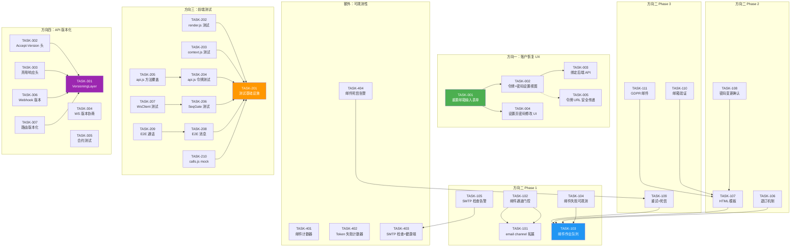
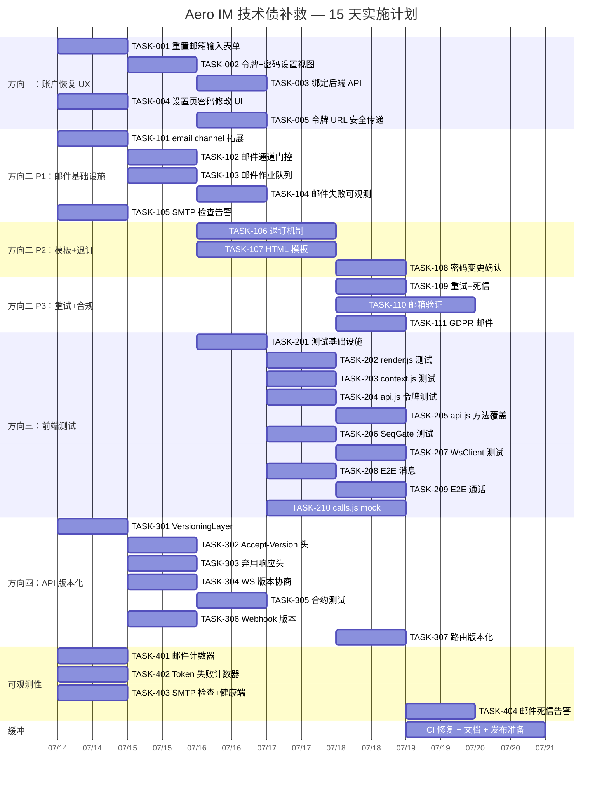

现在，这是完整的 Tech Lead 分析：

---

# Tech Lead 分析：Aero IM 技术债补救计划

## 1. 任务分解

### 方向一（P1）：账户恢复前端 UX

| 任务 ID | 标题 | 涉及文件 | 前置依赖 | 预估工时 | 验收标准 |
|---------|------|---------|---------|---------|---------|
| TASK-001 | 重置邮箱输入表单 | `web/index.html`, `web/auth_ui.js` | 无 | 1.5h | 登录表单下方显示「忘记密码？」链接；点击后切换到邮箱输入视图；提交后显示「已发送，请检查邮箱」 |
| TASK-002 | 令牌解析 + 新密码设置视图 | `web/index.html`, `web/auth_ui.js` | TASK-001 | 2h | 检测 `?token=` URL 参数自动进入重置页面；新密码 + 确认密码字段；密码长度 min=6 客户端校验 |
| TASK-003 | 绑定 `/api/auth/reset-password` 与 `/api/auth/forgot-password` | `web/auth_ui.js`, `web/api.js` | TASK-002 | 1h | 邮箱表单 POST `/api/auth/forgot-password`；令牌表单 POST `/api/auth/reset-password`；成功/失败 toast 通知 |
| TASK-004 | 设置页密码修改 UI | `web/index.html`, `web/auth_ui.js` | TASK-001 | 1.5h | 在用户菜单提供「修改密码」入口；当前密码 + 新密码字段；调用 `/api/auth/change-password` |
| TASK-005 | 令牌 URL 安全传递 | `web/auth_ui.js`, `web/index.html` | TASK-002 | 1h | 重置链接使用 `#token=`（hash 不记录日志）而非 `?token=`；前端在页面加载后从 hash 解析令牌 |

**方向一总计**：7h（约 1 人天）

### 方向二（P1-P3）：事务性邮件基础设施

#### Phase 1（P1 — 2 天）

| 任务 ID | 标题 | 涉及文件 | 前置依赖 | 预估工时 | 验收标准 |
|---------|------|---------|---------|---------|---------|
| TASK-101 | 通知偏好：拓展 `channel` 枚举支持 `email` | `migrations/xxxx_email_channel.sql`, `crates/aero-storage/src/notification_prefs.rs` | 无 | 2h | `notification_prefs` 的 channel 列可设 `email`；`get_channel_pref(pid, channel)` 返回当前状态 |
| TASK-102 | 邮件通道门控：`ImService.dispatch_notifications` 加入 email 通道检查 | `crates/aero-im-core/src/service/orig.rs` | TASK-101 | 2h | 用户禁用了 email 通道时，即使有通知也不走邮件发送路径 |
| TASK-103 | 邮件作业队列：`mpsc` + 后台 drain loop | `crates/aero-server/src/mailer.rs` | 无 | 3h | `Mailer` 内部持 `mpsc::Sender`；HTTP handler 将邮件 job 入队立即返回；后台 tokio::spawn drain 循环逐封 SMTP 发送 |
| TASK-104 | 邮件失败可观测：计数器 + 日志结构化 | `crates/aero-server/src/mailer.rs`, `crates/aero-server/src/metrics.rs` | TASK-103 | 1.5h | 每发一封邮件 `email.sent` 计数；SMTP 失败 `email.failed` 计数；日志带 `to`、`error`、`elapsed_ms` 字段 |
| TASK-105 | `AppState` 启动时 SMTP 配置检查告警 | `crates/aero-server/src/bin/boot/state_builder.rs` | 无 | 0.5h | 无 SMTP 配置时启动日志 `WARN mailer disabled: no SMTP config`（不阻塞启动） |

#### Phase 2（P2 — 3 天）

| 任务 ID | 标题 | 涉及文件 | 前置依赖 | 预估工时 | 验收标准 |
|---------|------|---------|---------|---------|---------|
| TASK-106 | 退订机制：`List-Unsubscribe` 头 + 退订页面 | `crates/aero-server/src/mailer.rs`, `crates/aero-server/src/routes/routes.rs`, `web/index.html` | TASK-103 | 4h | 每封邮件带 `List-Unsubscribe: <https://host/unsubscribe?token=xxx>`；退订页 GET 展示确认；退订后 `channel_prefs` 写为 disabled |
| TASK-107 | HTML 模板引擎集成（`minijinja`） | `crates/aero-server/src/mailer.rs`, `templates/email/` | TASK-103 | 3h | 邮件使用模板渲染；密码重置模板含品牌 logo；邀请模板含工作区名称；纯文本回落 |
| TASK-108 | 密码变更确认邮件 | `crates/aero-server/src/mailer.rs` | TASK-107 | 1.5h | 密码变更后向账户关联邮箱发送确认邮件；包含安全提醒文本 |

#### Phase 3（P3 — 2 天）

| 任务 ID | 标题 | 涉及文件 | 前置依赖 | 预估工时 | 验收标准 |
|---------|------|---------|---------|---------|---------|
| TASK-109 | 邮件重试 + 死信 | `crates/aero-server/src/mailer.rs` | TASK-103 | 3h | SMTP 失败后 3 次重试（指数退避 1s/4s/15s）；3 次均失败入死信队列（`warn!` + metrics + 无告警仅日志） |
| TASK-110 | 邮箱验证流程 | `migrations/xxxx_email_verification.sql`, `crates/aero-server/src/sessions.rs`, `crates/aero-storage/src/` | TASK-107 | 4h | 注册/邮箱变更后发送验证邮件；`POST /api/auth/verify-email?token=xxx`；表 `email_verifications`（token hash + 过期 + participant_id） |
| TASK-111 | GDPR/合规邮件场景 | `crates/aero-server/src/mailer.rs`, `crates/aero-server/src/export.rs` | TASK-107 | 2h | 数据导出完成后发送通知邮件；账户删除确认邮件；新设备登录告警邮件 |

**方向二总计**：Phase 1（9h）+ Phase 2（8.5h）+ Phase 3（9h）= **26.5h（约 3.5 人天）**

### 方向三（P0）：前端测试

| 任务 ID | 标题 | 涉及文件 | 前置依赖 | 预估工时 | 验收标准 |
|---------|------|---------|---------|---------|---------|
| TASK-201 | 测试基础设施搭建 | `web/package.json`, `web/vitest.config.js`, `web/jsdom-setup.js` | 无 | 1.5h | `npm test` 跑 vitest；jsdom 环境；ESM 模块解析成功；首个空测试文件通过 |
| TASK-202 | **L1 纯函数**：`render.js` 工具函数测试 | `web/render.test.js` | TASK-201 | 3h | `escapeHtml`（XSS 向量）；`el()`（标签名/文本/属性）；`appendTextWithSpans`（字节偏移/span 样式）；`sliceByBytes`（中英文混排边界） |
| TASK-203 | **L1 纯函数**：`context.js` 辅助测试 | `web/context.test.js` | TASK-201 | 2h | `formatTime`（各种 ISO 字符串）；`loadingDiv`/`mutedDiv`；`scrollToMessage`（需要 mock DOM） |
| TASK-204 | **L2 API 客户端**：`api.js` 令牌生命周期 | `web/api.test.js` | TASK-201 | 3h | mock `fetch`；`api.login()` 成功/失败路径；token 存储/读取/清除；`ApiError` 构造；并发请求共享 token；`REQUEST_TIMEOUT` 触发 |
| TASK-205 | **L2 API 客户端**：方法覆盖 | `web/api.test.js` | TASK-204 | 2h | 每个方法至少 1 个正例 + 1 个反例（mock fetch）；query 参数编码；FormData 上传路径 |
| TASK-206 | **L3 WS 核心**：`SeqGate` 单元测试 | `web/ws.test.js` | TASK-201 | 2h | 重复 seq 拒绝；seq gap 接受；窗口溢出行为；跨 scope 隔离；`high()` 方法；无 seq 帧放行 |
| TASK-207 | **L3 WS 核心**：`WsClient` 连接/重连/回溯 | `web/ws.test.js` | TASK-206 | 3h | mock `WebSocket`；连接成功→`status:'up'`；token 传递；`_lastSeen` 更新（仅 `message` 帧）；重连 `?since=` 参数；指数退避回退；`closedByUser` 不重连 |
| TASK-208 | **L4 E2E**：Playwright 消息收发 | `e2e/message.spec.js` | TASK-201 | 3h | Playwright 安装 + 配置；注册→登录→发消息→消息出现在列表；删除→消息消失；编辑→内容更新 |
| TASK-209 | **L4 E2E**：通话基础 | `e2e/call.spec.js` | TASK-208 | 2h | 开两个页面；A 发起通话→B 收到邀请；B 应答→A 看到应答；B 挂断→A 收到结束 |
| TASK-210 | **L5 通话**：`calls.js` mock RTCPeerConnection | `web/calls.test.js` | TASK-201 | 4h | mock `RTCPeerConnection` + `RTCSessionDescription`；`negotiate` 成功路径；ICE candidate 交换；`hangup()`；多 peer（群通话 mesh） |

**方向三总计**：25.5h（约 3.5 人天）

### 方向四（P0）：API 版本化

| 任务 ID | 标题 | 涉及文件 | 前置依赖 | 预估工时 | 验收标准 |
|---------|------|---------|---------|---------|---------|
| TASK-301 | `VersioningLayer` 中间件 | `crates/aero-server/src/routes/versioning.rs` | 无 | 2h | 读取 `Accept: application/vnd.aero.v1+json`；当前仅记录日志 + 设置 `X-Api-Version: 1` 响应头；无路由分发变化 |
| TASK-302 | `Accept-Version` 头支持 + 降级测试 | `crates/aero-server/src/routes/versioning.rs` | TASK-301 | 1h | `Accept: application/vnd.aero.v2+json` → 日志 + `X-Api-Version: 2`；无版本头 → `X-Api-Version: 1`（默认） |
| TASK-303 | 弃用响应头基础设施 | `crates/aero-server/src/routes/versioning.rs` | TASK-301 | 1h | 端点可附加 `Deprecation: true; sunset="..."` 和 `Sunset: date` 头；通过扩展属性控制 |
| TASK-304 | WS `ServerFrame` 版本协商 | `crates/aero-server/src/ws/ws_impl/mod.rs` | 无 | 2h | `Welcome` 帧包含 `"version": 1`；客户端可发 `auth` 带 `version` 字段；服务端按版本协商帧结构 |
| TASK-305 | 兼容性合约测试 | `crates/aero-server/tests/api_compat.rs` | 无 | 3h | 对每个公开端点记录 JSON Schema（`serde_json::Value`）；测试验证响应结构不意外变化；用 `serde_json::json!` 匹配器 |
| TASK-306 | Webhook 版本字段 | `crates/aero-storage/src/webhook.rs`, 相关路由 | TASK-301 | 1.5h | webhook payload 带 `"schema_version": 1` 字段 |
| TASK-307 | 路由版本化（P2 扩展） | `crates/aero-server/src/routes/routes.rs` | TASK-301 | 3h | `/api/v1/` 前缀映射到同一 handler（别名）；中间件可决定路由到 v1/v2 的 future handler |

**方向四总计**：13.5h（约 2 人天）

### 额外方向：可观测性盲区（P1）

| 任务 ID | 标题 | 涉及文件 | 前置依赖 | 预估工时 | 验收标准 |
|---------|------|---------|---------|---------|---------|
| TASK-401 | 邮件失败 Prometheus 计数器 | `crates/aero-server/src/metrics.rs` | 无 | 0.5h | `email_sent_total{status="success|failed"}` + `email_send_duration_seconds` histogram |
| TASK-402 | Token 存储失败计数器 | `crates/aero-server/src/metrics.rs`, `crates/aero-server/src/sessions.rs` | 无 | 0.5h | `password_reset_token_store_failed_total`；sessions.rs 中 token 存储失败时 inc |
| TASK-403 | SMTP 配置检查启动告警 + 健康端点 | `crates/aero-server/src/bin/boot/state_builder.rs`, `crates/aero-server/src/routes/health.rs` | 无 | 1h | 无 SMTP 时启动日志 WARN；`/health/ready` 返回 mailer 状态字段 `{"mailer": "ok|disabled|error"}` |
| TASK-404 | 邮件死信告警（日志 + 指标） | `crates/aero-server/src/mailer.rs` | TASK-109 | 0.5h | 死信触发 `email_dead_letter_total`；可配置阈值日志告警 |

**可观测性总计**：2.5h（约 0.5 人天）

---

## 2. 执行顺序

### 可并行的任务组

| 组 | 任务 | 并行依据 |
|----|------|---------|
| **组 A**: 方向一全量 | TASK-001 ~ TASK-005 | 独立于其他方向，只有内部顺序依赖 |
| **组 B**: 方向二 P1 | TASK-101 + TASK-103 + TASK-105 | TASK-101 和 TASK-103 各自独立；TASK-102 依赖 101 |
| **组 C**: 方向三 L1 | TASK-202 + TASK-203 | 独立模块，无交叉依赖 |
| **组 D**: 方向三 L4 与 L5 | TASK-208 + TASK-209 + TASK-210 | E2E 与单元测试并行；TASK-209 依赖 E2E 基础设施 |
| **组 E**: 方向四 | TASK-301 + TASK-304 + TASK-305 | 独立子方向可并行探索 |
| **组 F**: 可观测性 | TASK-401 + TASK-402 + TASK-403 | 各自独立计数器 |

---

## 3. 技术风险

### 高风险项

| 风险 | 影响 | 缓解措施 |
|------|------|---------|
| **前端测试：vitest + jsdom 对 ES2020 原生模块的兼容性** | 测试跑不起来，浪费 1-2 天调试 | 先在 POC 分支验证 vitest 能 import 所有 `.js` 文件（无构建工具的裸 ESM）；备选方案：`node --test` + 手写测试运行器 |
| **WS 重连 `_lastSeen` 跨房间 bug** | 架构级 bug：重连时用一个全局 seq 回溯多房间信息 | 立即提 issue 记录，优先级 P0。测试（TASK-207）必须覆盖多房间场景：加入房间 A（seq=500）→房间 B（seq=2）→重连→验证 B 的消息不丢 |
| **邮件模板在多 locale 下渲染** | `minijinja` 不原生支持 i18n | Phase 1 只出中文模板（与当前 UI 一致），i18n 延后。模板变量用 `{{ display_name }}` 模式。 |
| **RTCPeerConnection mock 的逼真度** | 通话测试可能 fake 通过但在真实浏览器失败 | L5 测试只测控制流（邀请/应答/ICE/挂断），不测媒体流。E2E 测试用 Playwright 的真实 `RTCPeerConnection`。 |
| **API 合约测试的维护成本** | 后端频繁增改字段导致测试频繁更新 | 合约测试只验证「不该变的字段」（id/created_at 的类型、必选字段的存在）。新增字段用 `additionalProperties: true` 放行。 |

### 中风险项

| 风险 | 影响 | 缓解措施 |
|------|------|---------|
| `VersioningLayer` 对 `Accept` 头的处理与现有中间件冲突 | 请求级联失败 | 新中间件放在最外层；`cargo test` 全量路由验证 |
| 邮件队列持久化（进程崩溃丢信） | 密码重置邮件丢失 | Phase 1 用内存队列（重启后用户重试即可）；Phase 2 考虑 `pgmq` 或 NATS 持久化 |
| 前端 SeqGate 边界条件在真实浏览器中与 mock 不同 | 重连后重复帧或丢帧 | 单元测试 + E2E 双重覆盖；E2E 中构造高吞吐场景验证 |
| 邮件退订绕过鉴权 | 安全漏洞 | 退订 token 使用 `hash_token`（与密码重置相同机制）；token 绑定 `participant_id + channel` |

### 零风险（已确定可行）

- `mailer.rs` 改为异步队列：已有 `ai_usage_ledger_drain` 模式可复制
- `notification_prefs` 拓展 email channel：已有 `channel_mutes` 表结构
- `render.js` 纯函数测试：无 DOM 依赖，vitest 可直接 import
- `SeqGate` 逻辑独立测试：纯 JS 类，无需 mock

---

## 4. 资源评估

### 人员技能需求

| 角色 | 技能要求 | 负责方向 | 估算人数 |
|------|---------|---------|---------|
| **全栈工程师 A** | JS/ES2020/DOM API/测试 | 方向三（前端测试）、方向一（前端 UI） | 1 人 |
| **全栈工程师 B** | Rust/Axum/SQL/架构 | 方向四（API 版本化）、方向二（邮件基础设施）、可观测性 | 1 人 |
| **QA 工程师** | Playwright/E2E/手动验证 | E2E 测试、回归验证 | 0.5 人（可兼职） |

> **推荐最低配置**：2 名工程师，1 名兼职 QA。可并行推进前端（方向一 + 方向三 L1-L2）和后端（方向二 + 方向四 + 可观测性）。

### 里程碑

| 里程碑 | 时间 | 交付物 |
|-------|------|--------|
| **M1**: 方向一完成 | 第 2 天结束 | 用户可完成完整的忘记密码→重置密码流程 |
| **M2**: 可观测性上线 | 第 2 天结束 | 邮件/Token 失败 Prometheus 计数器就位；健康端点报告 mailer 状态 |
| **M3**: 测试基础设施完成 | 第 3 天结束 | `npm test` 可用；首个纯函数测试通过 |
| **M4**: 方向二 P1 完成 | 第 5 天结束 | 邮件通过队列发送；email channel 可关闭；失败可观测 |
| **M5**: 方向四 P1 完成 | 第 6 天结束 | `VersioningLayer` 就位；合约测试覆盖主要端点 |
| **M6**: 方向三 L1-L3 完成 | 第 8 天结束 | 纯函数 + API + WS 核心模块测试覆盖 ≥ 80% |
| **M7**: 方向二 P2 完成 | 第 10 天结束 | HTML 模板 + 退订机制 + 密码变更确认 |
| **M8**: E2E 测试基线确立 | 第 12 天结束 | Playwright 消息收发 + 通话 E2E 通过 |
| **M9**: 方向二 P3 + 方向四 P2 完成 | 第 15 天结束 | 重试+死信、邮箱验证、路由版本化 |

### 阻塞点与解决策略

| 阻塞点 | 影响 | 解决策略 |
|--------|------|---------|
| Vitest + 裸 ESM 不兼容 | 方向三延期 | 1 天验证期：开 POC 分支验证。失败则换 `node --test`（Node 22 原生支持）。最坏情况：手写 test runner（1 天额外开销）。 |
| 方向四 WS 版本协商与现有 `ClientFrame` 的兼容 | 方向四 Phase 1 范围缩小 | 决定：WS 版本协商在 Phase 1 只做 `Welcome` 帧加 `version` 字段，不做协议演变。客户端的 `version` 声明放到 Phase 2。 |
| 短信/推送等非邮件通知通道与 email channel 的耦合 | 方向二 P1 范围蔓延 | 明确定义：方向二只做 **email channel** 门控。推送通道（push_bot）已有独立门控不变。 |
| 后端 `dispatch_notifications` 的 email 通道改动影响现有路径 | 方向二 P1 引入回归 | 原路径用 `if channel == "push"` 门控；新增 email channel 只追加，不改既有逻辑。`cargo test` 全部通过。 |

---

## 5. 质量保证

### 单元测试覆盖要求

| 模块 | 覆盖指标 | 关键边界 |
|------|---------|---------|
| `web/render.js`（L1） | ≥ 90% | `escapeHtml`（`&<>"'` XSS 11 种变体）；`appendTextWithSpans`（字节偏移对齐、重叠 span、负值、中文 UTF-8）；`sliceByBytes`（3 字节中文字符在中间分割） |
| `web/context.js`（L1） | ≥ 85% | `formatTime`（ISO 8601 + 各种时区 + 异常输入）；`loadingDiv`/`mutedDiv`（DOM 结构快照） |
| `web/api.js`（L2） | ≥ 90% | token 空状态；token 过期后刷新；并发请求复用同一 token；`REQUEST_TIMEOUT` 触发 AbortError；`ApiError` status=0（网络错误） |
| `web/ws.js`（L3） | ≥ 85% | `SeqGate`：256 满窗口、seq 跳跃回到窗口内、同 scope 重复、跨 scope 隔离；`WsClient._lastSeen`：Message 帧更新但 Edited/Deleted 不更新、字符串 `>` 比较语义（ULID 排序） |
| `crates/aero-server/src/mailer.rs`（方向二） | ≥ 80% | 队列满情况；SMTP 超时；无效邮箱地址；邮件构建失败 |
| `crates/aero-server/src/routes/versioning.rs`（方向四） | ≥ 90% | 各种 Accept 头格式；无 Accept 头；非法 version 值；`Deprecation` 头格式 |

### 集成测试策略

| 测试类型 | 工具 | 覆盖场景 | 运行频率 |
|---------|------|---------|---------|
| **API 合约测试** | `cargo test --test api_compat` | 每个公开端点的 JSON 响应结构 | CI 每次提交 |
| **方向二集成** | `cargo test --test email_integration` | 邮件队列 drain + 数据库持久化 + SMTP mock（`fake-smtp-server`） | CI daily |
| **方向四集成** | `cargo test --test versioning_integration` | `VersioningLayer` 中间件在路由器中的行为 | CI 每次提交 |
| **E2E** | `npx playwright test` | 注册 → 登录 → 消息 CRUD → 通话信令 | CI 每次 PR（耗时 ~3min） |

### 代码审查要点

| 审查焦点 | 关键检查项 |
|---------|-----------|
| **方向一前端** | 令牌是否从 URL hash 读取而非 searchParams；`?since=` 重连光标是否按房间存储；`#token=` hash 是否在页面加载后被读取然后清除 |
| **方向二邮件** | 队列 drain 循环是否持 `CancellationToken` 优雅关闭；死信后是否 metrics inc；`List-Unsubscribe` 头对 SPAM 评分的影响 |
| **方向三测试** | mock 是否漏了恢复（`afterEach` 还原所有 mock）；E2E 测试是否相互依赖（应为独立）；vitest 配置是否覆盖 `*.test.js` |
| **方向四版本化** | `Accept-Version` 头解析是否拒绝非法版本号；`ServerFrame` 新字段是否兼容旧客户端（默认值存在）；合约测试是否只验证稳定字段 |
| **可观测性** | 计数器命名是否遵循 `{domain}_{action}_total` 模式；histogram bucket 是否合适 |

### 性能测试需求

| 场景 | 工具 | 阈值 | 说明 |
|------|------|------|------|
| 邮件队列吞吐 | `cargo bench` | ≥ 1000 jobs/s | 队列 drain 循环的 MPSC 吞吐；单封邮件 SMTP 延迟（网络约束） |
| WS 重连回溯 | k6 + WS | `?since=` 回溯 ≤ 500ms（1000 条消息） | 后端重建回溯窗口的性能；前端 SeqGate 重建开销 |
| VersioningLayer 开销 | `wrk` | 末尾增加延迟 ≤ 1ms | 中间件读取头 + 设置响应头的开销 |

---

## 6. 实施计划

### 甘特图

### 阶段划分

#### 阶段 1：基础设施（第 1-2 天，7 月 14-15 日）

**并行 Track A**（前端工程师）：
- TASK-001 ~ TASK-005（方向一全量，7h）
- TASK-201（测试基础设施，1.5h）

**并行 Track B**（后端工程师）：
- TASK-101 ~ TASK-105（方向二 P1，9h）
- TASK-301 ~ TASK-302（方向四初版，3h）
- TASK-401 ~ TASK-403（可观测性，2h）

**第 2 天结束时**：用户可重置密码；邮件在队列中发送；Prometheus 计数器中；合约测试框架就绪。

#### 阶段 2：核心能力（第 3-6 天，7 月 16-19 日）

**Track A**：
- TASK-202 ~ TASK-207（L1-L3 测试，8h）
- TASK-208 ~ TASK-209（E2E 基础，5h）

**Track B**：
- TASK-106 ~ TASK-108（方向二 P2，8.5h）
- TASK-303 ~ TASK-306（方向四完善，6h）
- TASK-210（calls.js 测试，4h）

**关键验证点**：第 6 天结束时，纯函数 + API + WS 核心测试覆盖 ≥ 80%。

#### 阶段 3：强化 + E2E（第 7-11 天，7 月 20-24 日）

**Track A**：
- TASK-210（继续完成 calls.js mock）
- E2E 测试完善 + 跨浏览器验证

**Track B**：
- TASK-109 ~ TASK-111（方向二 P3，9h）
- TASK-307（方向四路由版本化，3h）
- TASK-404（邮件死信告警，0.5h）

**关键验证点**：全量 `cargo test --workspace` + `npx playwright test` 绿。

#### 阶段 4：发布准备（第 12-15 天，7 月 25-28 日）

- CI 中集成新增测试套件
- 合约测试作为 CI 门禁
- 性能基准验证
- 代码审查循环关闭
- 文档更新（API 变更日志、邮件模板说明、测试实践）

---

## 7. 总工作量汇总

| 方向 | 任务数 | 总工时 | 人天（8h） |
|------|--------|--------|-----------|
| 方向一：账户恢复 UX | 5 | 7h | 0.9 |
| 方向二 P1：邮件基础设施 | 5 | 9h | 1.1 |
| 方向二 P2：模板+退订 | 3 | 8.5h | 1.1 |
| 方向二 P3：重试+合规 | 3 | 9h | 1.1 |
| 方向三：前端测试 | 10 | 25.5h | 3.2 |
| 方向四：API 版本化 | 7 | 13.5h | 1.7 |
| 可观测性盲区 | 4 | 2.5h | 0.3 |
| **总计** | **37** | **75h** | **9.4 人天** |

**2 名工程师 + 兼职 QA → 约 2 周可行日程（含 2 天缓冲）。**
