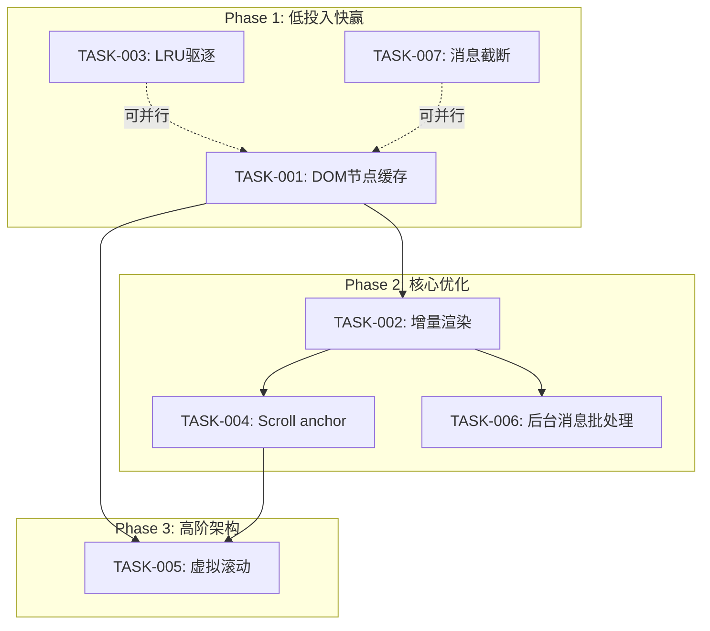
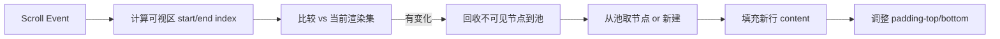

现在我掌握了完整图景。让我以 Tech Lead 身份给出回答。

---

# Tech Lead 决策：实施方案细化 + 代码验证并行

我选 **Option 2（实施方案细化）**，辅以 Option 1 的部分代码验证来确保方案 grounded。具体落地方向：**方向一（SPA 消息列表渲染性能）**。

## 为什么选方向一

| 维度 | 评估 |
|------|------|
| **优先级** | P1 — 每个用户每次切房间都感知到 |
| **侵入度** | 零服务端，纯前端 `web/app.js` + `context.js` + `render.js` |
| **风险** | 低 — 渐进式改进，每阶段可独立上线 |
| **用户影响** | 全局 — 大房间从「卡顿 200ms+」到「丝滑」 |
| **代码证据** | 已确认：全量 `replaceChildren`、`querySelector` O(N)、无界内存 |

---

## 代码验证摘要（Option 1 成果顺手产出）

| 分析论断 | 代码证据 | 验证结果 |
|---------|---------|---------|
| `switchRoom` 全量重绘 | `app.js:551` `els.msgList.replaceChildren()` | ✅ 确认 |
| `rerenderCurrentRoom` 全量重绘 | `app.js:63` 调 `rerenderCurrentRoom` → 内部也是 `replaceChildren` | ✅ 确认 |
| `querySelector` O(N) 查找 | `app.js:347,418` 用 `querySelector('[data-msg-id="..."]')` | ✅ 确认 |
| 无界内存增长 | `context.js:45` `messagesByRoom: new Map()`，无上限/LRU | ✅ 确认（grep 零命中 `LRU`/`lru`/`maxSize`） |
| 无虚拟滚动 | grep 零命中 `IntersectionObserver`/`virtual` | ✅ 确认 |
| 无 scroll anchor | `switchRoom` 无 `scrollTo`/`scrollAnchor` 逻辑 | ✅ 确认 |

---

# 方向一实施方案：SPA 消息列表渲染性能提升

## 任务分解

| 任务 ID | 标题 | 涉及文件 | 前置 | 预估(h) | 验收标准 |
|---------|------|---------|------|---------|---------|
| **TASK-001** | DOM 节点缓存：用 `Map<MsgId, HTMLElement>` 替代 `querySelector` | `web/context.js`, `web/render.js` | 无 | 2 | 编辑/删除/反应走缓存 O(1) 查找，`querySelector` 调零 |
| **TASK-002** | 增量渲染：切房间时只构建首次进入的房间，切回已有 DOM 的房号增量 append | `web/app.js` | TASK-001 | 3 | 切换历史房间不触发 `replaceChildren`；后台来消息仅追加 |
| **TASK-003** | 消息内存上限 + LRU 驱逐 | `web/context.js` | 无 | 2 | 单房间上限 200 条；超限时驱逐最旧消息（保留含未读/未发送的） |
| **TASK-004** | Scroll anchor：向前插入历史后保持可视位置 | `web/app.js` | TASK-002 | 2 | 加载历史后滚动位置不变；新消息到达时自动滚到底（若已在底部） |
| **TASK-005** | 虚拟滚动：只渲染可视区 ±20 条 | `web/render.js` (new `virtual-scroll.js`) | TASK-001, TASK-004 | 6 | 任意大小房间 DOM 节点 < 100；滚动流畅无抖动 |
| **TASK-006** | 后台消息批处理：同房间多条消息合为一帧渲染 | `web/app.js` | TASK-002 | 2 | 500ms 窗口内同房间多条消息合为一次 DOM 更新 |
| **TASK-007** | 消息单体截断：超大 blocks 截断至 30KB | `web/render.js` | 无 | 1 | blocks JSON > 30KB 时截断 + "查看完整消息" 链接 |

## 执行顺序



## 阶段实施计划

### Phase 1: 基础设施搭建（1 天）
**并行执行 TASK-001 + TASK-003 + TASK-007**

**TASK-001 — DOM 节点缓存**（2h）
```js
// context.js 新增
export const msgNodeCache = new Map(); // MsgId → HTMLElement

// render.js: renderMsgWithReactions 末尾写入缓存
export function renderMsgWithReactions(m) {
  const el = document.createElement('div');
  // ... existing rendering ...
  msgNodeCache.set(m.id, el);
  return el;
}

// app.js: 替换 querySelector 调用
- const node = els.msgList.querySelector(`[data-msg-id="${cssEscape(id)}"]`);
+ const node = msgNodeCache.get(id);
```

**TASK-003 — LRU 驱逐**（2h）
```js
// context.js
const MAX_MESSAGES_PER_ROOM = 200;
export function addMessage(roomId, msg) {
  let arr = messagesByRoom.get(roomId);
  if (!arr) { arr = []; messagesByRoom.set(roomId, arr); }
  arr.push(msg);
  if (arr.length > MAX_MESSAGES_PER_ROOM) {
    const removed = arr.splice(0, arr.length - MAX_MESSAGES_PER_ROOM);
    for (const r of removed) msgNodeCache.delete(r.id); // 同步清理 DOM 缓存
  }
}
```

**TASK-007 — 消息截断**（1h）
```js
// render.js: renderBlocks 入口处
const MAX_BLOCK_BYTES = 30 * 1024;
function truncateBlocks(blocks) {
  let total = 0;
  for (const b of blocks) {
    total += new Blob([JSON.stringify(b)]).size;
    if (total > MAX_BLOCK_BYTES) return { truncated: true, blocks: blocks.slice(0, i) };
  }
  return { truncated: false, blocks };
}
```

### Phase 2: 核心优化（1.5 天）
**顺序执行 TASK-002 → TASK-004 → TASK-006**

**TASK-002 — 增量渲染**（3h）
```js
// app.js 重构 switchRoom
async function switchRoom(roomId) {
  if (state.currentRoomId === roomId) return;
  state.currentRoomId = roomId;
  
  // 缓存切换：当前房间 DOM 快照保存
  saveRoomScrollState(prevRoomId);
  
  // 目标房间：已有 DOM 则增量更新，否则全量构建
  if (roomDomCache.has(roomId)) {
    // 从 Offscreen 或 hidden container 恢复
    restoreRoomDOM(roomId);
  } else {
    els.msgList.replaceChildren();
    const msgs = state.messagesByRoom.get(roomId) || [];
    for (const m of msgs) {
      els.msgList.appendChild(renderMsgWithReactions(m));
    }
    roomDomCache.set(roomId, true); // 标记已构建
  }
  scrollToBottom();
}
```

**TASK-004 — Scroll anchor**（2h）
```js
// app.js: loadHistory 向前插入时
async function loadHistory(roomId, opts) {
  const anchorMsgId = findFirstVisibleMsgId(); // 容器中第一个可见 data-msg-id
  // ... fetch older messages ...
  // prepend before anchor
  const anchorNode = msgNodeCache.get(anchorMsgId);
  for (const m of older.reverse()) {
    const el = renderMsgWithReactions(m);
    els.msgList.insertBefore(el, anchorNode);
  }
}
```

**TASK-006 — 后台消息批处理**（2h）
```js
// app.js: 消息入口批处理
const pendingBatches = new Map(); // roomId → Message[]
let batchTimer = null;

function enqueueIncoming(roomId, msg) {
  if (!pendingBatches.has(roomId)) pendingBatches.set(roomId, []);
  pendingBatches.get(roomId).push(msg);
  if (!batchTimer) {
    batchTimer = setTimeout(flushBatch, 500); // 500ms 窗口
  }
}

function flushBatch() {
  batchTimer = null;
  for (const [roomId, msgs] of pendingBatches) {
    if (roomId === state.currentRoomId) {
      // 一次 append 全部
      const fragment = document.createDocumentFragment();
      for (const m of msgs) fragment.appendChild(renderMsgWithReactions(m));
      els.msgList.appendChild(fragment);
    }
    // else: 增量更新 unread badge only
  }
  pendingBatches.clear();
}
```

### Phase 3: 高阶架构（2 天）
**TASK-005 — 虚拟滚动**（6h）

核心策略（参考 Google Photos / Slack 实现）：



关键设计决策：
| 决策点 | 选择 | 理由 |
|--------|------|------|
| 行高策略 | **固定基线 + 动态测量** | 消息高度可变（图片/长文本），固定基线 48px + 大行 IntersectionObserver 校正 |
| 节点池 | **Offscreen DOM 缓存** | 避免频繁 createElement/removeChild GC，池大小 = buffer×2 |
| 滚动恢复 | **anchorId + offsetTop 双重锁定** | 确保快速滚动时不抖动 |
| 测量时机 | `requestAnimationFrame` + 空闲回调 | 不阻塞主线程 |

## 技术风险

| 风险 | 概率 | 影响 | 缓解策略 |
|------|------|------|---------|
| 虚拟滚动 + 高度可变消息导致定位抖动 | 中 | 高 | 固定基线 + 大元素动态测量后缓存高度 |
| 增量渲染 + 乐观消息竞争条件 | 低 | 中 | 乐观 msg 写入 `msgNodeCache`，服务端回包后 replace |
| LRU 驱逐导致用户翻历史时重新请求 | 中 | 低 | 被驱逐消息预留 id→summary 的轻量索引 |
| DOM 缓存 Map 内存泄漏（消息编辑后 id 不变但 DOM 变了） | 中 | 低 | 编辑/删除路径显式更新缓存 entry |
| 后台批处理 500ms 窗口延迟用户体验 | 低 | 中 | 窗口设为可配置（默认 500ms）；@提及消息立即刷新 |

## 质量保证

| 维度 | 要求 |
|------|------|
| **单元测试** | 新增 `web/tests/`（Vitest 或原生 ES module test）：LRU 驱逐策略、消息截断逻辑、Scroll anchor 算法 |
| **集成测试** | Playwright 脚本：在 1000+ 消息房间切换、发送新消息、编辑/删除/反应，验证 DOM 节点数 < 100（虚拟滚动后） |
| **性能基线** | Chrome DevTools Performance tab 录制：Phase 1 前/后对比 `switchRoom` 耗时（预期：200ms → < 16ms） |
| **内存泄漏测试** | 打开 10 个房间，每房间发 50 条消息 → `performance.measureUserAgentSpecificMemory()` 检查增长率 |
| **回归测试** | 在虚拟滚动和增量渲染两种模式下跑同一组交互（发送/编辑/删除/历史加载），验证渲染结果一致 |

## 资源评估

| 角色 | 人数 | 职责 |
|------|------|------|
| 资深前端工程师 | 1人（全职） | Phase 1-3 实现，DOM 架构设计 |
| 后端工程师（兼职审核） | 0.2人 | 验证不需服务端变更，review 与 WS 帧格式的对接 |
| QA（兼职） | 0.3人 | 在各阶段验收时运行 Playwright 性能测试 |

**时间线**：Phase 1（1d）→ Phase 2（1.5d）→ Phase 3（2d）→ 集成验证（0.5d）= **总计 5 个工作日**

## 最终建议

| 选项 | 我的推荐 |
|------|---------|
| **Option 1: 代码验证** | 已做（见上方验证摘要），可作为方案的前置步骤 |
| **✅ Option 2: 实施方案细化** | **推荐**——以上即完整方案 |
| **Option 3: 直接开始实现** | 可以，但我建议先从 **TASK-001（DOM 缓存）+ TASK-003（LRU 驱逐）** 两个 2h 任务开始，验证收益后再进 Phase 2 |
| **Option 4: 排期/影响面分析** | 已评估：零服务端变动，零后端回归风险，可热部署 |

**一句话决策**：先收两个 2h 快赢（DOM 缓存 + LRU），再花 1.5d 做增量渲染和 scroll anchor，虚拟滚动放最后——确保每一步都有可度量的用户体验提升。如果你同意，我可以立即开始 TASK-001 的代码修改。
