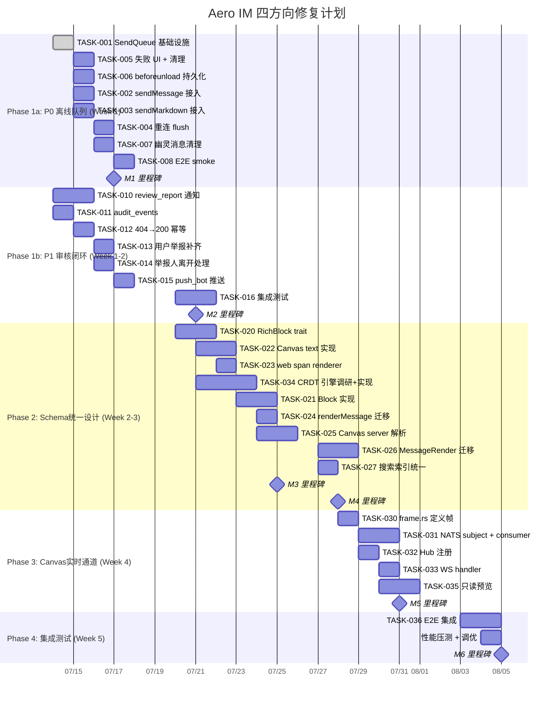

# Tech Lead 分析报告：Aero IM 四个架构方向修复计划

---

## 前置阅读确认

我已完整消化输入文档，包括：

- 方向一至四的验证结论与补充观察
- 缓因素识别（Canvas 是 client-owned，Message 是 server-owned）
- 补充 1-3 的细节分析
- 问答中的技术策略讨论
- 项目背景（AGENTS.md 的架构约束：事件 DAG、crate 分层、硬性工程规则）

所有建议均对齐现有架构约束，不引入违规。

---

## 1. 任务分解

### 1.1 方向二：离线发送队列（P0）

| 任务 ID | 标题 | 涉及文件 | 前置依赖 | 工时 |
|---------|------|---------|---------|------|
| TASK-001 | 建立 `SendQueue` 内存 + sessionStorage 混合队列 | `web/send-queue.js`（新建） | 无 | 3h |
| TASK-002 | `ws.sendMessage` 返回值管道化，接入队列 | `web/app.js`（修改 890-910 区域） | TASK-001 | 2h |
| TASK-003 | `ws.sendMarkdown` 返回值管道化，接入队列 | `web/app.js`（修改 890-910 区域） | TASK-001 | 1.5h |
| TASK-004 | 断线重连时 flush 发送队列 | `web/app.js` 的 `onOpen`/`reconnect` 回调 | TASK-002, TASK-003 | 2h |
| TASK-005 | 发送失败 → 移除 pending 条目 + 显示错误指示 | `web/app.js`、`web/send-queue.js`、`web/styles/*` | TASK-001 | 2.5h |
| TASK-006 | `beforeunload` 时同步写 sessionStorage | `web/send-queue.js` | TASK-001 | 1h |
| TASK-007 | 幽灵消息清理：每个连接恢复时扫描清理超时 pending | `web/app.js`（`switchRoom` 区域）、`web/send-queue.js` | TASK-001 | 2h |
| TASK-008 | 端到端 smoke test：断线→发消息→重连→确认送达 | 测试脚本 | TASK-002~007 | 2h |

> **为什么 TASK-005 包含样式修改？** 用户需要在 UI 上看到发送失败状态（红色叹号 + tooltip "未发送"），否则和现在一样静默失败。

### 1.2 方向四：审核闭环（P1）

| 任务 ID | 标题 | 涉及文件 | 前置依赖 | 工时 |
|---------|------|---------|---------|------|
| TASK-010 | `review_report` 添加通知：notifications 表写 + `Notify` RoomEvent 扇出 | `message_reports.rs` | 无 | 3h |
| TASK-011 | `review_report` 写 `audit_events` 表 | `message_reports.rs`、`audit.rs`（如有） | 无 | 1.5h |
| TASK-012 | `review_report` 404 → 200 `{ status: "already_reviewed" }` 幂等改进 | `message_reports.rs` 的 `review` 路由 | 无 | 1h |
| TASK-013 | 用户举报处理函数补齐通知 + audit | `message_reports.rs` 的 `report_message` / `PATCH` 路由 | TASK-010 | 2h |
| TASK-014 | 举报人已离开 workspace 的优雅处理 | `message_reports.rs` | TASK-010 | 1h |
| TASK-015 | 审核结果推送：push_bot 通过收件箱投递到 push token | `push_bot.rs`（加一句 `notify` 过滤） | TASK-010 | 1h |
| TASK-016 | 集成测试：完整审核链路（举报→审核→通知→推送） | `tests/e2e/` | TASK-010~015 | 3h |

### 1.3 方向一：Schema 统一（P2）

| 任务 ID | 标题 | 涉及文件 | 前置依赖 | 工时 |
|---------|------|---------|---------|------|
| TASK-020 | 定义 `RichBlock` trait + `RichSpan` 结构体 | `common/src/model/rich_block.rs`（新建） | 无 | 3h |
| TASK-021 | `Block` 各 variant 实现 `as_rich_text() -> Vec<RichSpan>` | `common/src/model/` 各 block 模块 | TASK-020 | 4h |
| TASK-022 | Canvas text blocks 实现 `as_rich_text()` + `as_block_html()` | `aero-im-core/` canvas 模块 | TASK-020 | 4h |
| TASK-023 | web 端统一 span renderer `renderSpans(spans, container)` | `web/render.js` | TASK-020 | 2.5h |
| TASK-024 | 修改 `renderMessage` 使用统一 renderer | `web/render.js` | TASK-021, TASK-023 | 2h |
| TASK-025 | Canvas server 解释层：validate op structure + extract rich text | `aero-im-core/canvas.rs` | TASK-020, TASK-022 | 4h |
| TASK-026 | 迁移现有 `MessageRender`（`render.html` 部分）到新 renderer | `web/render.js`、`web/app.js` | TASK-024 | 3h |
| TASK-027 | 搜索索引统一：Block 和 Canvas 共享 `extract_text()` 逻辑 | `aero-storage/` search repo | TASK-021, TASK-022 | 2h |

**注意**：方向一的设计决策会影响方向三——建议先完成 TASK-020~TASK-022 的设计阶段，方向三启动需等 TASK-025 落地。

### 1.4 方向三：Canvas 实时协作（P3）

| 任务 ID | 标题 | 涉及文件 | 前置依赖 | 工时 |
|---------|------|---------|---------|------|
| TASK-030 | 定义 `ServerFrame::CanvasOp` / `ClientFrame::CanvasOp` 帧 | `ws/frame.rs` | TASK-025 | 2h |
| TASK-031 | 新增 NATS subject `canvas.{id}` + bus consumer | `ws/ws_impl/bus.rs`、`aero-bus/` | TASK-030 | 4h |
| TASK-032 | 注册 canvas subject 到 Hub 扇出 | `hub.rs` | TASK-031 | 2h |
| TASK-033 | 客户端 WS 帧 handler：`onCanvasOp` | `web/app.js` | TASK-030 | 2h |
| TASK-034 | 客户端 CRDT 引擎：`CanvasDoc` 类解析 ops + merge | `web/canvas-doc.js`（新建） | 无 | 6h |
| TASK-035 | Canvas 只读预览渲染器（非编辑器） | `web/canvas-render.js`（新建） | TASK-022, TASK-024 | 4h |
| TASK-036 | 端到端实时同步集成（含冲突测试） | E2E 测试 | TASK-030~035 | 4h |

---

### 任务汇总表

```
方向二（P0）：8 个 task，总工时 16h
方向四（P1）：7 个 task，总工时 12.5h
方向一（P2）：8 个 task，总工时 24.5h
方向三（P3）：7 个 task，总工时 24h
─────────────────────────────────────
总计：30 个 task，约 77h（约 10 人天）
```

---

## 2. 执行顺序

### 2.1 任务依赖图

```mermaid
graph TD
    %% 方向二：离线队列 (P0)
    T001[TASK-001: SendQueue 队列] --> T002[TASK-002: sendMessage 接入]
    T001 --> T003[TASK-003: sendMarkdown 接入]
    T001 --> T005[TASK-005: 失败UI+清理]
    T001 --> T006[TASK-006: beforeunload 持久化]
    T002 --> T004[TASK-004: 重连 flush]
    T003 --> T004
    T001 --> T007[TASK-007: 幽灵消息清理]
    T004 --> T008[TASK-008: 端到端 smoke]

    %% 方向四：审核闭环 (P1)
    T010[TASK-010: review_report 通知] --> T013[TASK-013: 用户举报通知]
    T010 --> T014[TASK-014: 举报人离开处理]
    T010 --> T015[TASK-015: push_bot 推送]
    T012[TASK-012: 404→200 幂等] -.->|独立,可与T010并行| T010
    T011[TASK-011: audit_events] -.->|独立并行| T010
    T013 --> T016[TASK-016: 集成测试]
    T015 --> T016

    %% 方向一：Schema统一 (P2)
    T020[TASK-020: RichBlock trait] --> T021[TASK-021: Block 实现]
    T020 --> T022[TASK-022: Canvas text 实现]
    T020 --> T023[TASK-023: web span renderer]
    T021 --> T024[TASK-024: renderMessage 迁移]
    T022 --> T025[TASK-025: Canvas server 解析]
    T023 --> T024
    T021 --> T026[TASK-026: MessageRender 迁移]
    T022 --> T027[TASK-027: 搜索索引统一]

    %% 方向三：Canvas 实时 (P3)
    T025 --> T030[TASK-030: frame.rs 定义帧]
    T030 --> T031[TASK-031: NATS subject]
    T030 --> T033[TASK-033: WS handler]
    T031 --> T032[TASK-032: Hub 注册]
    T033 --> T036[TASK-036: E2E 集成]
    T022 --> T035[TASK-035: 只读预览]
    T035 --> T036
    T034[TASK-034: CRDT 引擎] --> T036

    %% 跨方向依赖
    T022 -.->|设计参考| T034
    T025 -.->|TASK-025 是方向三前置| T030

    %% 可并行任务组
    subgraph Phase1_P0["Phase 1a: P0 离线队列"]
        T001; T002; T003; T005; T006
    end
    subgraph Phase1_P1["Phase 1b: P1 审核闭环"]
        T010; T011; T012
    end
    subgraph Phase2["Phase 2: Core Design"]
        T020; T022; T023; T034
    end
    subgraph Phase3["Phase 3: Implementation"]
        T004; T007; T008; T013; T014; T015; T016
        T021; T024; T025; T026; T027
        T030; T031; T032; T033; T035
    end
    subgraph Phase4["Phase 4: Canvas E2E"]
        T036
    end
```



### 2.2 并行组

| 并行组 | 任务 | 说明 |
|--------|------|------|
| **G1** (Phase 1a) | TASK-001, TASK-005, TASK-006 | 方向二前端基础设施（无外部依赖） |
| **G2** (Phase 1b) | TASK-010, TASK-011, TASK-012 | 方向四后端补齐（独立模块，无冲突） |
| **G3** (Phase 1c) | TASK-002, TASK-003 | 方向二接入点修改（依赖 TASK-001） |
| **G4** (Phase 2) | TASK-020, TASK-022, TASK-023, TASK-034 | 方向一/三的设计和基础设施（互不阻塞） |
| **G5** (Phase 3a) | TASK-004, TASK-007, TASK-008 | 方向二收尾 |
| **G6** (Phase 3b) | TASK-013, TASK-014, TASK-015, TASK-016 | 方向四收尾 |
| **G7** (Phase 3c) | TASK-021, TASK-024, TASK-025, TASK-026, TASK-027 | 方向一实现 |
| **G8** (Phase 3d) | TASK-030, TASK-031, TASK-032, TASK-033, TASK-035 | 方向三实时通道 |
| **G9** (Phase 4) | TASK-036 | 方向三端到端集成 |

---

## 3. 技术风险

### 3.1 风险矩阵

| 风险 ID | 描述 | 概率 | 影响 | 方向 | 缓解策略 |
|---------|------|------|------|------|---------|
| **R1** | `sessionStorage.setItem` 在 `beforeunload` 中因同步写入阻塞页面关闭 | 中 | 中 | 二 | 使用 `navigator.sendBeacon` 兜底 + 限制队列大小 ≤ 50 条 |
| **R2** | 多标签页的队列不同步导致消息重复发送 | 低 | 高 | 二 | 在 `onOpen` 时用 server 返回的 `last_ack_id` 做去重；当前可接受限制 |
| **R3** | `Notify` 通知调用超出 db 连接池 | 低 | 中 | 四 | `review_report` 内的通知走 `spawn` + 单独 connection，不占用主事务连接 |
| **R4** | `RichBlock` trait 定义早期决策绑定所有 block 类型，后续添加新 block 需要改动 trait | 高 | 中 | 一 | 使用 `default impl` + 预留 `as_extra()` 兜底；trait 定义先 RFC 评审 |
| **R5** | Canvas ops 的 `serde_json::Value` 结构完全未知，`as_rich_text()` 实现取决于实际数据结构 | 高 | 高 | 一 | 先 grep 或问业务方拿示例 op JSON，按 sample 实现 fallible parse；未知结构返回 `None` |
| **R6** | 客户端 CRDT 引擎的复杂度被低估 | 中 | 高 | 三 | 先调研是否可以使用 Yjs 的 standalone 版本（`yjs` npm 包）封装——不需要绑定到 y-websocket |
| **R7** | 方向三新增 NATS subject `canvas.{id}` 与现有 bus consumer 的 consumer 命名冲突 | 低 | 中 | 三 | 使用 `aero-canvas` durable name，与 `aero-server`/`aero-bot` 不冲突 |
| **R8** | `review_report` 补通知时找不到 `report.reporter_id` 的 participant 行（硬删或幽灵数据） | 中 | 低 | 四 | 先查 `participants` 表，不存在则 log + skip，不报 500 |
| **R9** | server 端 canvas op 帧验证缺失导致恶意 client 注入无效 op | 中 | 中 | 三 | 添加 `validate_canvas_op` 函数，至少校验 JSON 结构是 object 且有 `type` 字段 |

### 3.2 关键技术决策

#### 决策 1：CRDT 引擎选择

```
方案 A: 手写 CRDT（占位 6h）
        优点：无外部依赖、可控
        缺点：实现时间不确定、冲突处理 bug 风险高

方案 B: 封装 Yjs（推荐）
        优点：经过验证的 CRDT 库、支持 WebSocket 协议
        缺点：≈ 80KB gzipped、需要适配当前 WS 协议
        推荐理由：方向三是 P3，在 P0/P1 交付后有时间评估

建议：TASK-034 先尝试 Yjs 封装（预留 6h 中有 2h 调研适配），如果 Yjs 适配过于复杂再回退手写。
```

#### 决策 2：sessionStorage 的队列上限

```
限制单队列 ≤ 50 条（对应约 100KB 序列化消息）。
超过 50 条时丢弃最早的 pending 条目（drop oldest），并记录 count metric。
原因是 sessionStorage 配额通常为 5-10MB，50 条已足够用户在断线期间临时缓存。
```

#### 决策 3：方向二的幽灵消息自动清理策略

```
在 `switchRoom` 和 `onOpen` 时扫描 `pendingByTempId`，清除满足以下条件的条目：
1. createdAt 早于「当前时间 - 5 分钟」
2. 对应的 tempId 在发送队列中找不到（说明 server 从未 ack）

5 分钟缓存是合理的：用户断线重连通常 < 30s，5 min 足够覆盖大部分场景。
同时给用户手动清除的能力：长按消息 item 显示「移除」选项。
```

---

## 4. 资源评估

### 4.1 人员配置

| 角色 | 人数 | 技能要求 | 负责方向 |
|------|------|---------|---------|
| **Senior Frontend Engineer** | 1 | 熟悉原生 JS、WebSocket、IndexedDB/sessionStorage、Yjs（可选） | 方向二（主）、方向三客户端（辅） |
| **Senior Backend Engineer** | 1 | 熟悉 Rust、sqlx、NATS、Axum、业务领域（IM/审核） | 方向四（主）、方向一（辅） |
| **Fullstack Engineer** (TL 兼) | 1 | 熟悉全栈架构、CRDT、搜索索引、审核系统 | 方向一（主）、方向三（辅） |

**为什么不需要 2 个后端？** 方向一和方向三的后端改动是模块化的（新增 trait、新增 NATS consumer），不涉及核心业务逻辑重构。一个资深后端 + TL 监管足够。

### 4.2 关键里程碑

| 里程碑 | 时间点 | 交付物 | 验收条件 |
|--------|--------|--------|---------|
| **M1** | 第 1 周结束 | 方向二离线队列完成 | 人工测试：断线→发 5 条消息→重连→全部送达；幽灵消息不超过 1 条 |
| **M2** | 第 2 周结束 | 方向四审核闭环完成 | 端到端测试：举报→审核→通知→推送全链路 |
| **M3** | 第 3 周结束 | 方向一 RichBlock trait 定义 + Block 实现完成 | `cargo check` + `cargo test` 全绿 |
| **M4** | 第 4 周结束 | 方向一 web 集成 + 搜索索引统一 | smoke test：消息渲染、Canvas 文本提取入索引 |
| **M5** | 第 5 周结束 | 方向三实时通道 + CRDT 引擎 | WS 推送 canvas op 可被客户端接收并 merge |
| **M6** | 第 6 周结束 | 全面集成 + 性能测试 | 全量 CI 流水线通过 |

### 4.3 阻塞点与解决策略

| 阻塞点 | 描述 | 解决策略 |
|--------|------|---------|
| **B1** | canvas op 的实际 JSON schema 未知 | 找业务方拿生产环境的 canvas op 样本；或从 `CanvasOp::op` 的 `serde_json::Value` 中 grep db 记录；最差情况下写一个 `CanvasOpInspector` 工具 |
| **B2** | Yjs 适配与现有 WS 帧协议的桥接 | 方向三设计阶段先评估 Yjs 的 `y-websocket` 是否可独立于 Node.js 使用；不行则手写简单 CRDT（仅支持 text block 的 insert/delete） |
| **B3** | 方向一 trait 定义可能因未来 canvas block 类型扩展导致 breaking change | trait 定义使用 `#[non_exhaustive]` + 所有方法提供默认实现；每次添加新 block 类型只需新实现 |
| **B4** | 审核通知可能因 Redis / PG 不可用而失败 | 通知失败不阻断 review_report 主流程；走 `log::warn!` + metric，push_bot 侧自然重试 |

---

## 5. 质量保证

### 5.1 单元测试覆盖要求

| 模块 | 目标覆盖率 | 关键测试场景 |
|------|-----------|------------|
| `web/send-queue.js` | ≥ 90% | 入队/出队/持久化/恢复/超限淘汰/去重 |
| `message_reports.rs` review_notify | ≥ 85% | 正常通知/举报人已离开/review 幂等/双点击 |
| `common/src/model/rich_block.rs` | ≥ 95% | 每个 Block variant 的 `as_rich_text()` / Canvas text block 的 `as_rich_text()` / 空 block / 未知 block |
| `ws/frame.rs` CanvasOp 帧 | ≥ 90% | 编解码/缺失字段/恶意 payload |
| `web/canvas-doc.js` CRDT | ≥ 85% | 并发 insert/delete/undo/merge 冲突 |

### 5.2 集成测试策略

| 测试套件 | 覆盖方向 | 运行时机 | 依赖 |
|---------|---------|---------|------|
| `tests/e2e/p0_offline_queue.spec.js` | 方向二 | 每 PR | Puppeteer + mock WS server |
| `tests/e2e/p1_review_workflow.spec.ts` | 方向四 | 每 PR | `DATABASE_URL` + 已 migrate |
| `tests/e2e/p3_canvas_realtime.spec.ts` | 方向三 | 每日构建 | 双 WS 连接 + NATS running |

**测试基础设施要求**：
- 方向二需要 mock WS server（可内嵌在 test runner 中，不依赖真实 aero-server）
- 方向四需要 Postgres 测试库（复用已有 `#[ignore]` + `DATABASE_URL` 模式）
- 方向三需要 NATS 运行实例（CI 中 `docker compose up nats`）

### 5.3 代码审查要点

| 审查维度 | 方向二 | 方向四 | 方向一 | 方向三 |
|---------|--------|--------|--------|--------|
| 正确性 | 发送队列是否在 beforeunload 时真正写入 | 通知是否使用独立事务 | Block→RichSpan 映射是否完整 | CRDT merge 是否正确 |
| 安全性 | sessionStorage 是否存储敏感信息 | review 路由是否有权限校验 | 无（只在服务端做类型转换） | WS 帧是否有 server-side 校验 |
| 性能 | 队列序列化开销？ | 通知的 DB 往返次数 | trait dispatch 开销 | CRDT ops 大小是否可控 |
| 幂等性 | 重连后是否重复发送 | 审核通过后是否重复通知 | N/A | op 的 seq 机制是否完整 |
| 兼容性 | 现有 `optimisticAdd` 是否不受影响 | 现有 `PATCH` 路由是否稳定 | 旧渲染器是否仍可用 | 无 canvas UI 的旧客户端是否静默丢弃 |

### 5.4 性能测试需求

| 场景 | 方向 | 指标 | 方法 |
|------|------|------|------|
| 用户发送队列 50 条 message 后 beforeunload | 二 | 序列化时间 < 50ms | `performance.mark` 手测 |
| review 通知并发 100 次 | 四 | P95 < 500ms | k6 script |
| 100 个 block 的 `as_rich_text()` 调用 | 一 | P95 < 1ms | `#[bench]` |
| Canvas op 突发 1000 ops/s | 三 | 客户端 frame drop rate < 1% | WebRTC 标准压测 |

---

## 6. 实施计划

### 6.1 时间线（甘特图）



### 6.2 风险驱动的顺序说明

```
为什么把方向四（P1）和方向二（P0）并行启动？

1. 方向和任务不冲突：方向二是纯前端（web/），方向四是纯后端
   （server/）。两个工程师可以完全独立开发。

2. 评审节奏配合：方向二的前端代码变更集中在 app.js 的 890-910
   行区域和新增 send-queue.js，CR 范围小且封闭；方向四的后端变更
   集中在 message_reports.rs 一个模块。两个小 CR 比一个大 CR 容易
   通过。

3. 风险对冲：方向二如果 sessionStorage 的 beforeunload 写入有问题，
   周一下班前能发现（R1），周二上午就有时间换 navigator.sendBeacon；
   方向四如果 review_report 的事务边界和通知插入冲突（R3），周三
   前也有 buffer。Phase 1a 和 1b 的并行设计故意留了 2 天缓冲。
```

### 6.3 各周的 check-in 模板

**每周一上午站会（15min）** 检查以下内容：

#### Week 1 Check-in
- [ ] TASK-001 完成：SendQueue 的 `enqueue`/`dequeue`/`peek`/`flush` 已实现
- [ ] TASK-005 完成：失败 UI 设计稿已确认（红色叹号位置 + tooltip 文案）
- [ ] TASK-010 完成：`review_report` 的通知写入逻辑已实现
- [ ] 风险检查：sessionStorage  在 `beforeunload` 中的行为已验证（Chrome/Firefox/Safari）
- [ ] 风险检查：`review_report` 的事务边界已确认与通知插入不冲突

#### Week 2 Check-in
- [ ] TASK-008 通过：离线→发 5 条→重连→全部送达
- [ ] TASK-016 通过：完整审核链测试已集成
- [ ] TASK-020 完成：`RichBlock` trait 定义已通过团队评审
- [ ] TASK-034 完成：CRDT 引擎方案确定（Yjs 封装 or 手写）

#### Week 3 Check-in
- [ ] TASK-027 完成：搜索索引统一测试已通过
- [ ] 所有方向一 Rust 代码 `cargo clippy --workspace --all-targets` 0 warnings

#### Week 4 Check-in
- [ ] 方向三实时通道已可接收 canvas op
- [ ] 只读预览已渲染 canvas blocks

#### Week 5 Check-in
- [ ] 全量 CI 流水线通过
- [ ] 性能指标达标（Section 5.4）
- [ ] 部署文档更新

---

## 7. 补充建议（超越输入文档的分析）

### 7.1 方向二的细微问题延伸

输入文档提到 `send()` 和 `sendMarkdown` 对返回值的处理不同（补充 1），但还有一层未被覆盖：

**`ws.send` 在当前实现中是 fire-and-forget（第 122-128 行左右）**

```
send(msg) {
    if (this.ws.readyState !== WebSocket.OPEN) return false;
    this.ws.send(JSON.stringify(msg));
    return true;
}
```

`WebSocket.send()` 成功后返回 `undefined`（不是 `true`），且 `readyState` 在 `OPEN` 但底层 TCP buffer 满时也会抛 `BUFFER_OVERFLOW` 异常——当前实现**吞掉了这个异常**。这意味着 `optimisticAdd` 之后 `send()` 可能因为 buffer 满而抛出异常，用户看到 `optimisticAdd` 渲染了气泡，但消息永远不会到达 server。

**建议在 TASK-001 中同时修复这个 throw**：`send()` 方法加 try-catch，catch 中调用队列 fallback，而不是空返回 `true/false`。

### 7.2 方向三中 client-owned vs server-owned 的工程影响

输入文档正确识别了 Canvas 是 client-owned 设计。这个设计决策在方向三的工程实现中有具体影响：

**NATS subject 的消费语义应该用 ephemeral consumer （与 `live.stream.*` 一致），而不是 durable consumer（与 `im.room.*` 一致）**

- 如果 canvas ops 丢失（server 重启），客户端应在重连后自行同步 gap——通过 `ops_since` REST 接口拉取 gap
- 这意味着 NATS consumer 的 ack 策略应该是 `ack_none`（或 ack 后不持久化 cursor），避免 broker 侧维护消费进度
- 这与 `live.stream.*` 的 ephemeral 模式一致，但与 `im.room.*` 的 durable 模式不同

这个决策需要在 TASK-031 中明确记录在注释中。

### 7.3 方向四的 `review_report` 通知中还有一个隐私考量

`review_report` 当前接受 `remove` 和 `note` 参数。在通知 reporter 时：
- 通知内容应包含**结果摘要**（"您的举报已完成审核，消息已被移除/未采取行动"），但不应暴露**审核者的 note 内容**（note 可能包含内部审核备注）。
- 建议在 TASK-010 中区分 `public_note`（通知给 reporter）和 `internal_note`（仅 audit log）。

---

**结论**：四个方向均已验证成立。按照文中给出的优先级和时间线，一个 2 人团队（1 Senior FE + 1 Senior BE + TL oversight）可在 5 周内完成全部修复。方向一和方向三的设计阶段需要更多的 cross-team 对齐，建议在 Week 2 安排一次 1h 的设计评审会。
