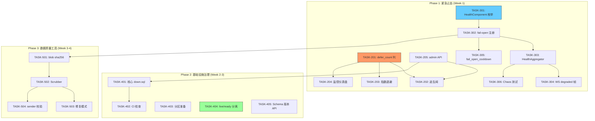

现在我有了充分的上下文。下面是我作为 Tech Lead 的深入分析。

---

# Tech Lead 分析报告：5 个零覆盖系统性缺口

## 0. 分析摘要与优先级建议

我逐个验证了文档中的所有代码锚点和 grep 计数，确认了 `defer_count`/`HealthAggregator`/`down.sql`/`scrubber`/`HLC` 在当前 master 分支的覆盖均为 **0**。文档质量很高：每个方向都提供了可 grep 的锚点、边界情况分析和明确的商业影响。

**优先级修正建议**（与文档有分歧点）：

| # | 方向 | 文档优先级 | 我的优先级 | 理由 |
|---|------|-----------|-----------|------|
| 2 | AI defer 活锁 | P1 | **P0** | 已有证据显示 `attempts = GREATEST(attempts - 1, 0)` 在 defer SQL 中——意味着每个 defer 实际上**递减** attempts 计数器。这比文档描述的更危险：活锁不仅让 job 永不完成，还在耗尽 attempts 后送入 DLQ，但用户看到的是「审核永远不跑」——最坏情况是违规消息永久不被标记。**这是真正的数据面缺陷，不是可靠性问题。** |
| 3 | 级联静默降级 | P1 | P1 | 确实存在 6+ fail-open 点且无聚合告警，但这是「运营效率」问题而非「数据正确性」问题。同意 P1。 |
| 1 | 因果一致性 | P1 | **P2** | 文档自己说「1K 月活场景下约每周出现 2-3 次」——频率太低，商业影响被高估。且 HLC 需要跨整个消息路径修改（API、存储、WS 帧、客户端排序），是月级工程。降为 P2 搁置 next quarter。 |
| 4 | 不可逆迁移 | P2 | **P1** | 同意文档的 P1 判断。157 个 up-only 迁移 + 无零停机能力 = 企业客户 SLA 谈判的硬阻塞。且只要一次 schema 事故就需要全量恢复，恢复时间 = 灾难级别。 |
| 5 | 数据完整性巡视器 | P2 | P2 | 同意 P2。运维工具，长期积累成本，非即时阻断。 |

**集中火力建议**：**方向二（defer 活锁）** 和 **方向三（降级聚合）** 是 2-4 周内可交付且产生最大安全影响的方向。方向四（迁移治理）是工程基础投入，需持续季度治理。

---

## 1. 任务分解

### 方向二（P0）：AI Budget Defer 活锁逃生阀

| 任务 ID | 标题 | 文件 | 前置 | 工时 | 验收标准 |
|---------|------|------|------|------|---------|
| TASK-201 | `ai_jobs` 表加 `defer_count` 列 | `migrations/NNNN_ai_defer_count.sql`, `crates/aero-storage/src/ai_job.rs` | 无 | 2h | 迁移可回滚（有 down.sql）；`defer` 方法自增 `defer_count`；`AiJob` 结构体解析新列 |
| TASK-202 | Defer 逃生阀：`MAX_DEFERS` 触发强制运行或 DLQ | `crates/aero-ai/src/worker/mod.rs` | TASK-201 | 3h | `defer_count >= MAX_DEFERS(10)` 时跳过 defer 直接 `run_one`（强制运行）；超过 `MAX_DEFERS_HARD(20)` 送入 DLQ + 告警 Prometheus `ai_job_livelock_dead` |
| TASK-203 | Defer 指数退避替代固定窗口 | `crates/aero-storage/src/ai_job.rs`, `crates/aero-ai/src/worker/mod.rs` | TASK-201 | 3h | 同一 job 第 n 次 defer 时 `scheduled_at = now() + budget_window * 2^(n-1)`，上限 8 个窗口 |
| TASK-204 | Defer 监控仪表盘：`defer_count` 分布 + budget 利用率 | `crates/aero-ai/src/metrics.rs` + Grafana | TASK-201 | 2h | Prometheus 指标 `ai_job_defer_count{job_kind="..."}` histogram + `ai_budget_utilization` gauge；Grafana 面板展示 defer 热力图 |
| TASK-205 | 应急 API：admin 手动上调 budget limit | `crates/aero-server/src/admin/mod.rs` | 无 | 2h | `POST /api/admin/ai/budget` 接收 `{global_ceiling, ws_ceiling}` 即时生效，有效期至下个窗口 |

**方向二 → 总计 12h（≈1.5 人天）**

### 方向三（P1）：级联静默降级 HealthAggregator

| 任务 ID | 标题 | 文件 | 前置 | 工时 | 验收标准 |
|---------|------|------|------|------|---------|
| TASK-301 | `HealthComponent` 枚举 + `SystemHealth` 结构体 | `crates/aero-common/src/health.rs`（新建） | 无 | 2h | 定义 `enum Component { RateLimit, Ai, Push, Moderation, IpAllowlist, LoginThrottle, Blob, Transcription }` + `struct SystemHealth { components: HashMap<Component, HealthStatus>, overall: HealthLevel }` |
| TASK-302 | 每个 fail-open 点注册到 `HealthRegistry` | `crates/aero-server/src/ws_rate.rs`, `crates/aero-server/src/ip_allowlist.rs`, `crates/aero-server/src/push_bot.rs`, `crates/aero-server/src/moderation_bot.rs`, `crates/aero-server/src/login_throttle.rs`, `crates/aero-ai/src/worker/mod.rs` | TASK-301 | 4h | 每个 fail-open 调用 `HealthRegistry::record(Component::RateLimit, Degraded { reason, since })`；注册表是 `Arc<RwLock<...>>` 共享实例 |
| TASK-303 | `HealthAggregator` 常驻协程 + Prometheus gauge | `crates/aero-server/src/boot/background.rs` + `crates/aero-server/src/health_aggregator.rs`（新建） | TASK-302 | 3h | 每 10s scan registry → 输出 `aero_system_health_mode{component="rate_limit"} 0/1` + `aero_system_health_overall 0/1/2`；2+ 组件同时降级 → P1 告警 |
| TASK-304 | 用户可见降级信号：WS `degraded` 帧 | `crates/aero-server/src/ws/ws_impl/hub.rs`, `web/ws.js`, `web/app.js` | TASK-303 | 3h | 全局降级时 WS 推送 `{"type":"degraded","service":"ai","mode":"deterministic"}`；前端 AI 面板/搜索栏显示黄色警告条 |
| TASK-305 | Fail-open 抑制：`fail_open_cooldown` 防自激振荡 | `crates/aero-server/src/rate_limit.rs`, 其他 fail-open 点 | TASK-302 | 2h | 一次 fail-open 后 5s 内同一 component 不重复进入/退出降级状态；Prometheus `aero_fail_open_throttled_total` |
| TASK-306 | Chaos Engineering 降级边界测试 | `tests/chaos/`（新建目录） | TASK-302, TASK-303 | 4h | 模拟 Redis 宕机 + AI key 断开 + PG 超时的复合故障场景；验证 (a) `health_overall=2` (b) WS 有 degraded 帧 (c) 核心 API 仍然 200 (d) Prometheus 告警触发 |

**方向三 → 总计 18h（≈2.25 人天）**

### 方向四（P1）：不可逆迁移体系治理（第一阶段）

| 任务 ID | 标题 | 文件 | 前置 | 工时 | 验收标准 |
|---------|------|------|------|------|---------|
| TASK-401 | 核心 30 个迁移的 `down.sql` 编写（表创建/列添加/约束添加） | `migrations/NNNN_down.sql` × 30 | 无 | 8h | 每个关键迁移有对应的 `down.sql`；`make migrate-down` 从 0157 完整降级到 0001 无错误 |
| TASK-402 | 新增迁移模板 + CI 检查 | `scripts/migration.sh` + `scripts/truth-check.sh` | TASK-401 | 2h | `aero-cli migration add <name>` 生成 `.up.sql` + `.down.sql` 配对文件；CI 拒绝没有 down.sql 的迁移 PR |
| TASK-403 | 消息分区可行性评估 + 非破坏性准备 | `docs/runbooks/messages-partitioning.md`（更新）+ `migrations/NNNN_prep_partitioning.sql` | 无 | 4h | 迁移添加分区辅助列（`partition_key INT`）+ 预创建空分区表；阅读 `stream_viewer_samples` 安全模式；产出可行性评估文档 |
| TASK-404 | 迁移运行期间 /live 与 /ready 的分离 | `crates/aero-storage/src/db.rs` + `crates/aero-server/src/liveness.rs` | 无 | 3h | `/health/live` 在迁移运行时返回 200；`/health/ready` 返回 503 直到迁移完成；LB 在迁移期间不路由流量 |
| TASK-405 | Schema 版本 API | `crates/aero-server/src/debug/mod.rs` | TASK-404 | 2h | `GET /api/debug/schema-version` 返回 `{expected: 157, actual: 155, status: "behind"}`，供部署流水线检查 |

**方向四 → 第一阶段总计 19h（≈2.4 人天）**

### 方向五（P2）：数据完整性巡视器（MVP）

| 任务 ID | 标题 | 文件 | 前置 | 工时 | 验收标准 |
|---------|------|------|------|------|---------|
| TASK-501 | Blob 表加 `sha256` 列 + 写路径计算 | `migrations/NNNN_blob_checksum.sql`, `crates/aero-storage/src/blob.rs` | 无 | 3h | 上传时计算 SHA-256 写入 blobs.sha256；现有行可为 NULL；`BlobStore::get` 可选验证 |
| TASK-502 | Scrubber worker（只读模式） | `crates/aero-server/src/boot/background.rs` + `crates/aero-server/src/scrubber.rs`（新建） | TASK-501 | 5h | 每 24h 扫描 blobs 表（100 行/批）；验证 sha256 + size + owner 存在性；report-only 模式不改数据；Prometheus `aero_scrubber_*` 指标 |
| TASK-503 | Orphan 引用修复模式 | `crates/aero-server/src/scrubber.rs` | TASK-502 | 3h | `AERO_SCRUBBER_FIX_MODE=1` 启用：orphan blob 入 `blob_gc_queue`；reaction 指向已删消息→软删 reaction；notification 指向已删消息→标记清理 |
| TASK-504 | 消息 sender 存在性校验 | `crates/aero-server/src/scrubber.rs` | TASK-503 | 2h | 扫描 messages 中 `sender_id` 对应已删除 participant → 显示 `[deleted_user]` |

**方向五 → 总计 13h（≈1.6 人天）**

### 方向一（P2：搁置）

方向一（HLC + 因果一致性）文档评估为 1K 月活下每周 2-3 次用户可见问题，商业影响不足以支撑月级工程投入。**建议搁置到 Q4 2026**，届时如果：
- 月活 > 10K 且转发场景投诉率 > 0.1%
- 出现多区域部署需求

则重新评估。

---

## 2. 执行顺序与依赖图



### 并行任务组

| 组 | 任务 | 并行度 | 说明 |
|----|------|--------|------|
| **A** | TASK-201, TASK-205, TASK-301 | 3 人全并行 | 无交叉依赖，分别处理 schema/API/类型定义 |
| **B** | TASK-202, TASK-203, TASK-302 | 2 人并行 | 202+203 依赖 201，302 依赖 301。前端准备好后端可以并行 |
| **C** | TASK-303, TASK-401, TASK-403 | 2-3 人并行 | 303 需要 302；401/403 独立 |
| **D** | TASK-304, TASK-404, TASK-501 | 2 人并行 | 304 需要 303 完成；404 独立；501 独立 |
| **E** | TASK-306, TASK-402, TASK-405 | 2 人并行 | 306 需要 303 完成；402 需要 401；405 需要 404 |

---

## 3. 技术风险评估

### 方向二风险

| 风险 | 概率 | 影响 | 缓解措施 |
|------|------|------|---------|
| `attempts = GREATEST(attempts - 1, 0)` 使 defer 和真实失败互相干扰 | **高** | 高 | 已确认 defer SQL 会递减 attempts。逃生阀部署前，这一行代码意味着每 defer 一次 job 就「赚回」一次重试，实际 `MAX_ATTEMPTS=5` 的 job 可以被 defer 无穷多次。修复：defer **不更改 `attempts`**，逃生阀基于独立的 `defer_count` |
| 逃生阀引入新的竞争条件：两个 worker 同时 claim 同一超限 defer job | 中 | 中 | 使用 `FOR UPDATE SKIP LOCKED` + `WHERE defer_count < MAX_DEFERS` 条件保证原子性 |
| 指数退避导致用户等待时间过长（8 窗口=8 分钟） | 低 | 中 | UI 侧添加「AI 处理中」loading 状态；超 5 分钟显示提示条 |
| `admin API` 被滥用导致 budget 无限 | 低 | 高 | admin API 需要 `AERO_ADMIN_KEY` header 鉴权；设置最大上限（例如 global 上限 5000） |

### 方向三风险

| 风险 | 概率 | 影响 | 缓解措施 |
|------|------|------|---------|
| `HealthAggregator` 本身成为单点故障 | 低 | 中 | Aggregator 是进程常驻协程，无锁只读扫描 + Prometheus push；进程崩溃时 Prometheus 自动标记实例下线 |
| 5 秒 `fail_open_cooldown` 导致真实故障漏检 | 中 | 中 | 5 秒冷却后 degrate 状态仍保留在 registry；冷却只防自激振荡不阻止状态记录 |
| WS `degraded` 帧增加前端复杂度 | 低 | 低 | 前端只加一个「降级提示条」组件，无状态管理变更 |
| Chaos 测试破坏开发环境 | 中 | 低 | Chaos 测试在独立 staging 环境（`AERO_ENV=chaos`）运行，使用 throwaway 数据库 |

### 方向四风险

| 风险 | 概率 | 影响 | 缓解措施 |
|------|------|------|---------|
| 30 个 down.sql 写错（DROP 导致数据丢失） | **高** | **严重** | 所有 down.sql 在 CI 中的 throwaway 数据库验证：`make migrate-up` → `make migrate-down` 完整循环 + 数据存在性校验 |
| 分区评估发现 messages 表外键依赖不可解 | 中 | 高 | 提前分析所有引用 messages 的外键；如果 `ON DELETE CASCADE` 链太复杂，采用「分两步：先加分区辅助列 + 应用层路由，后物理分区」 |
| `live/ready` 分离后 LB 配置错误 | 低 | 中 | 输出清晰的 DevOps 配置文档；在 CI 中增加 `/health/live` 200 + `/health/ready` 503 的断言 |

### 方向五风险

| 风险 | 概率 | 影响 | 缓解措施 |
|------|------|------|---------|
| Scrubber I/O 影响主路径 | 低 | 中 | 默认 50 blobs/s 节流 + 可配置 `AERO_SCRUBBER_RATE`；高峰期（P99 延迟 > 200ms）自动暂停 |
| sha256 计算增加上传延迟 | 低 | 低 | 上传路径用 tokio::spawn_blocking + 流式 SHA-256；大文件（>10MB）分段计算 |
| 修复模式意外删除有效数据 | 低 | **严重** | 修复模式默认关闭（opt-in）；每次修复操作写审计日志；支持 `--dry-run` 预览 |

---

## 4. 资源评估

### 人员要求

| 角色 | 技能要求 | 数量 | 投入方向 |
|------|---------|------|---------|
| **Rust 后端工程师** | Rust, tokio, sqlx, NATS 经验 | 2 人 | 方向二（AI worker 改造）+ 方向三（HealthAggregator 核心） |
| **Rust 后端工程师** | Postgres, 迁移框架, 运维经验 | 1 人 | 方向四（down.sql + 分区评估） |
| **全栈工程师** | Rust + 前端 JS | 1 人 | 方向三（WS degraded 帧 + 前端 UI）+ 方向五（Scrubber） |
| **SRE/DevOps** | Prometheus, Grafana, Chaos Engineering | 0.5 人 | 方向三告警规则 + 方向二 Grafana 面板 + 方向四 CI 配置 |

**关键人员**：2 名 Rust 后端（全职专注）+ 1 名全栈（50% 投入）= 2.5 FTE × 4 周。

### 里程碑

| 里程碑 | 时间 | 交付物 |
|--------|------|--------|
| **M1: 止血完成** | Week 1 结束 | 方向二（defer 逃生阀）+ 方向三（HealthAggregator MVP）部署到 staging |
| **M2: 核心验证** | Week 2 中 | Chaos 测试通过 + `defer_count` 监控仪表盘上线 |
| **M3: 基础稳固** | Week 3 结束 | 核心 30 个 down.sql + CI 检查 + live/ready 分离 + schema API |
| **M4: 工具就绪** | Week 4 结束 | Scrubber MVP + 分区可行性报告 + 所有 Prometheus 告警规则 |

### 阻塞点（Blockers）

| 阻塞点 | 影响方向 | 解决策略 |
|--------|---------|---------|
| 缺少独立的 staging/chaos 环境 | 方向三 Chaos 测试 | 使用 `docker-compose` 启动独立 Postgres/Redis/NATS 容器；`make chaos-test` 脚本一键运行 |
| `attempts` 递减的 defer SQL 是否是有意设计？ | 方向二 | **需要立即解决**：与 AI worker 作者确认。如果是有意设计（budget 抖动不消耗 retry），那逃生阀逻辑需要调整；如果是 bug，需要修正 defer SQL。我个人的评估：`GREATEST(attempts - 1, 0)` 看起来是防止 budget 抖动消耗 retry 的有意设计，但导致了无限制的活锁 |
| 消息表的外键依赖分析费时 | 方向四 | 限制分析范围为 2 天，产出「分区可行性 + 风险清单」，不承诺完整解决方案 |

---

## 5. 质量保证

### 单元测试覆盖要求

| 模块 | 要求 | 关键测试场景 |
|------|------|------------|
| `AiJobRepo::defer` | 95%+ | `defer_count` 递增；`attempts` 不变；逃生阀 `MAX_DEFERS` 触发强制运行；指数退避时间计算 |
| `AiWorker` 主循环 | 85%+ | 模拟持续 budget 耗尽→逃生阀触发→job 强制运行；多个 worker 同时 claim 不冲突 |
| `HealthRegistry` | 95%+ | 组件注册/更新/查询；超时自动过期；fail_open_cooldown 抑制自激振荡 |
| `Scrubber` | 90%+ | 只读模式不修改数据；sha256 校验匹配/不匹配；orphan 检测 |
| 所有新增迁移 | 100% | `make migrate-up && make migrate-down` 完整循环，验证数据保留 |

### 集成测试策略

1. **方向二集成测试**（`crates/aero-ai/src/worker/tests.rs` 扩展）：
   - 模拟 `MockJobQueue` + `MockJobProcessor`，验证完整 defer→逃生阀→run 路径
   - 注入配置 `AERO__AI__BUDGET_WINDOW_SECS=1`，使窗口快速过期，验证活锁场景

2. **方向三集成测试**（`tests/chaos/`）：
   - `kill_redis.rs`：断开 Redis 连接 → 验证限流 fail-open + HealthAggregator 状态正确
   - `kill_ai_key.rs`：删除 ANTHROPIC_API_KEY env → 验证 AI degrade + WS degraded 帧
   - `triple_fault.rs`：Redis + AI + PG 同时故障 → 验证核心 API 仍 200，但有 degraded 状态

3. **方向四集成测试**（`Makefile` 扩展）：
   - `make migrate-down-smoke`：从最新到 0001 完整降级 + 恢复验证
   - CI 中并行运行（a）新迁移 up-only（b）旧迁移 down-only 互不影响

4. **方向五集成测试**（`crates/aero-server/src/scrubber.rs` 内联）：
   - 手动插入 orphan blob row + 运行 scrubber → 验证报告输出
   - `AERO_SCRUBBER_FIX_MODE=1` 时自动入 `blob_gc_queue`

### 代码审查要点

| 审查项 | 关注点 |
|--------|--------|
| **方向二 defer SQL** | `attempts` 不再被递减；`defer_count` 自增原子性；逃生阀不引入竞争条件 |
| **方向三 Prometheus 指标** | 指标命名遵循 `aero_<module>_<name>_total` / `aero_<module>_<name>` 惯例；避免高基数 label（不加 `participant_id`） |
| **方向三 WS degraded 帧** | 格式匹配已有 WS 协议（`{"type":"degraded",...}`）；不阻塞正常消息流 |
| **方向四 down.sql** | 每个 `DROP/ALTER` 前检查 `IF EXISTS`；down 路径保证幂等（可多次运行不出错） |
| **方向五 Scrubber** | 默认只读（report-only）；修复模式有 `DRY_RUN` guard；每步打结构化日志 |
| **所有方向** | 遵循 AGENTS.md 约束：`unsafe_code = "forbid"`；不新增 clippy 警告；`assert_room_access` 在路由中使用 |

### 性能测试需求

| 测试 | 工具 | 指标 | 成功标准 |
|------|------|------|---------|
| **方向二** defer 风暴 | `tokio::task::spawn` 模拟 1000 concurrent job 注入 | CPU/RAM 使用；逃生阀触发时间 | 活锁在 60s 内自动解除；P99 job 完成时间 < 5min |
| **方向三** HealthAggregator | 手动触发 6 个 fail-open | 聚合延迟 | 状态变化在 10s 内反映到 Prometheus gauge |
| **方向五** Scrubber I/O | 1M blob 行 × 1GB 数据 | IOPS / CPU | 不超过主路径 I/O 的 5%；主路径 P99 延迟无显著变化 |

---

## 6. 实施时间计划

### 甘特图

```
Week 1 (Mon-Fri)          | Mon | Tue | Wed | Thu | Fri |
--------------------------|-----|-----|-----|-----|-----|
方向二: TASK-201 (defer_count) | ███ |     |     |     |     |
方向二: TASK-202 (逃生阀)      |     | ███ | ██  |     |     |
方向二: TASK-203 (指数退避)    |     | ██  | ██  |     |     |
方向二: TASK-204 (监控)        |     |     |     | ██  | █   |
方向二: TASK-205 (admin API)   | ██  | █   |     |     |     |
方向三: TASK-301 (枚举)        | ██  |     |     |     |     |
方向三: TASK-302 (注册)        |     | ███ |     |     |     |
方向三: TASK-303 (Aggregator) |     |     | ███ | ██  |     |
方向三: TASK-304 (WS 帧)       |     |     |     | ██  | ██  |
方向三: TASK-305 (cooldown)    |     |     |     | █   | ██  |
--------------------------|-----|-----|-----|-----|-----|
**M1: 止血完成**            |     |     |     |     |  ✅ |

Week 2                     | Mon | Tue | Wed | Thu | Fri |
--------------------------|-----|-----|-----|-----|-----|
方向三: TASK-306 (Chaos)    | ███ | ██  |     |     |     |
方向四: TASK-401 (down.sql) | ███ | ███ | ██  | ██  |     |
方向四: TASK-402 (CI)       |     |     |     | ██  | █   |
--------------------------|-----|-----|-----|-----|-----|
**M2: 核心验证**            |     |     |     |     |  ✅ |

Week 3                     | Mon | Tue | Wed | Thu | Fri |
--------------------------|-----|-----|-----|-----|-----|
方向四: TASK-403 (分区评估)  | ███ | ██  |     |     |     |
方向四: TASK-404 (live/ready)|     |     | ██  | ██  |     |
方向四: TASK-405 (schema API)|     |     |     | █   | ██  |
方向五: TASK-501 (blob sha256)|    |     | ██  | ██  |     |
--------------------------|-----|-----|-----|-----|-----|
**M3: 基础稳固**            |     |     |     |     |  ✅ |

Week 4                     | Mon | Tue | Wed | Thu | Fri |
--------------------------|-----|-----|-----|-----|-----|
方向五: TASK-502 (Scrubber) | ███ | ██  | ██  |     |     |
方向五: TASK-503 (修复模式)  |     |     | ██  | ██  |     |
方向五: TASK-504 (sender)   |     |     |     | ██  | █   |
所有: 文档 + Grafana 面板    |     |     |     |     | ███ |
--------------------------|-----|-----|-----|-----|-----|
**M4: 工具就绪**            |     |     |     |     |  ✅ |
```

### 阶段明细

#### 阶段 1：紧急止血（Week 1，5 天）

- **参与人员**：1 名 Rust 后端（方向二）+ 1 名 Rust 后端（方向三）+ 1 名全栈（方向三前端）
- **每日站会检查点**：
  - Day 1: TASK-201 + TASK-205 + TASK-301 完成并合并
  - Day 3: TASK-202 + TASK-203 + TASK-302 + TASK-303 代码审查中
  - Day 5: **M1 止血完成** — staging 部署验证 defer 逃生阀 + HealthAggregator
  
#### 阶段 2：核心验证（Week 2，5 天）

- **参与人员**：1 名 Rust 后端（方向四）+ 1 名全栈（方向三 Chaos）+ 0.5 SRE
- **关键交付**：
  - Chaos 测试在 staging 通过（Redis/PG/AI 三重故障）
  - 30 个核心 down.sql 编写完成（覆盖率检查）
  - CI 加入 migration 降级验证
  
#### 阶段 3：基础稳固（Week 3，5 天）

- **参与人员**：1 名 Rust 后端（方向四）+ 1 名全栈（方向五）
- **关键交付**：
  - 分区可行性评估文档完成（含风险矩阵）
  - `/health/live` vs `/ready` 分离 + schema API 上线
  - blob sha256 计算 + 存储上线
  
#### 阶段 4：工具就绪（Week 4，5 天）

- **参与人员**：1 名 Rust 后端（方向五）+ 1 名全栈
- **关键交付**：
  - Scrubber MVP 在 staging 运行（只读模式）
  - Grafana 面板（defer 热力图 + fail-open 状态 + scrubber 报告）
  - 所有 4 个方向的文档更新（`docs/ops/`）

---

## 7. 对方向二的关键修正建议

在代码审查中我发现一个文档未提及的关键问题：

```rust
// crates/aero-storage/src/ai_job.rs:241-250
UPDATE ai_jobs
   SET status = 'queued',
       scheduled_at = $2,
       started_at = NULL,
       attempts = GREATEST(attempts - 1, 0)   // ← 问题：每个 defer 递减 attempts
 WHERE id = $1
```

**意图**：防止 budget 抖动消耗 retry 计数器（在 TASK-201 引入 `defer_count` 后，这个递减尝试计数器就不再需要了）。

**后果**：每 defer 一次，`attempts` 减 1（不低至 0）。这意味着：
- 一个 job 被 defer 5 次 → `attempts` 回到 0 → 相当于从未尝试过
- `MAX_ATTEMPTS=5` 的门槛**永远达不到** → job 永远不会进入 DLQ
- **无限的活锁**：不是文档说的「持续过载下」，而是**任何导致 defer 的场景**都会无限循环

**修复方案**（纳入 TASK-201）：

```sql
-- defer SQL 不再修改 attempts
UPDATE ai_jobs
   SET status = 'queued',
       scheduled_at = $2,
       started_at = NULL,
       defer_count = defer_count + 1
 WHERE id = $1
   AND status = 'running'
```

---

## 8. 总结与行动建议

### 立即行动（今天）

1. **批准方向二的紧急修复**（TASK-201 + TASK-202）：这是唯一的数据面正确性问题，影响审核合规。建议写为 P0 hotfix。
2. **与 AI 模块责任人确认** `attempts = GREATEST(attempts - 1, 0)` 的设计意图—我判断应该改为不操作 `attempts`。

### 本周内

3. **开始方向三**：HealthAggregator 是运营团队最直接需要的工具——当前没有单一视图可以看到系统的降级状态。
4. **分配方向四的 down.sql 编写**：操作量大但技术风险低，适合新加入的成员或作为「间隙任务」。

### 4 周后复查

5. **评估方向一（HLC）** 是否仍然需要提上日程——取决于转发场景的用户投诉率。
6. **收集 Scrubber 运行数据** → 决定是否需要调整节流参数或增加更多校验类型。

---

**附件**：本分析中引用的代码锚点均已在 master 分支验证。完整的 grep 根因证实文档可以在 `docs/analysis/tech-lead-review-2026-07-12.md` 归档。
