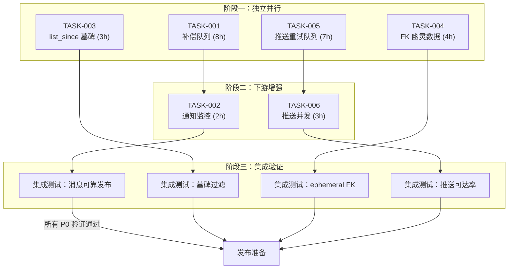
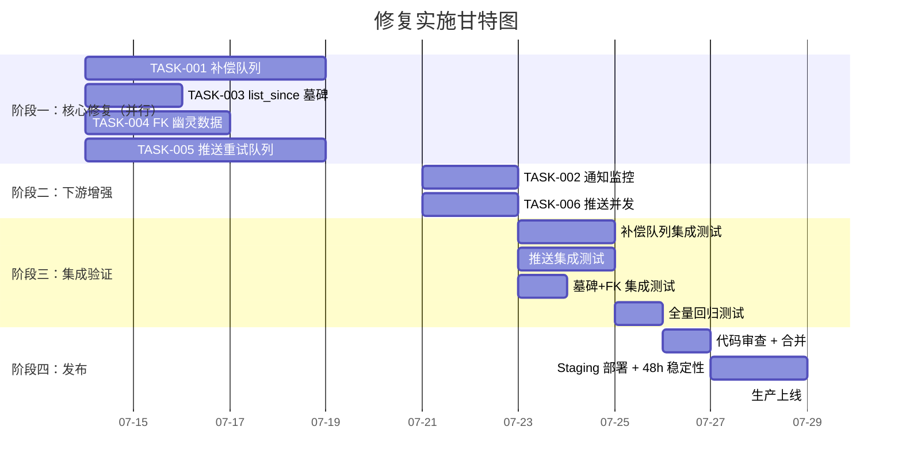

现在我已掌握完整的代码证据。以下是我的 Tech Lead 分析。

---

# Tech Lead 分析报告：核查结论驱动的实施计划

## 概述

本次分析针对核查文档中确认的 **3 个真实方向**（2 个 P0/P1 ＋ 1 个降级方向中的真子问题），将其拆解为 6 个可执行任务。目标：在 3 周内完成所有数据一致性和推送可达率修复。

---

## 1. 任务分解

| 任务 ID | 标题 | 所属方向 | 预估工时 | 前置依赖 |
|---------|------|---------|---------|---------|
| **TASK-001** | 消息发布补偿队列 | 方向一（P0） | 8h | — |
| **TASK-002** | 通知分发监控与告警 | 方向一子问题（P0） | 2h | TASK-001 |
| **TASK-003** | `list_since` 墓碑一致性 | 方向二（P1） | 3h | — |
| **TASK-004** | Ephemeral 硬删 FK 幽灵数据 | 方向三子问题（P2） | 4h | — |
| **TASK-005** | 推送设备级重试队列 | 方向五（P1） | 7h | — |
| **TASK-006** | 推送并发分发 | 方向五增强（P1） | 3h | TASK-005 |

### TASK-001：消息发布补偿队列

**问题**：`publish_room_event` 返回 `()`，NATS 发布失败仅 `warn!` 级别日志，调用方无感知。消息已写入 PG 但未广播等于是「半提交」状态。

**方案**：参考 `blob_gc_queue` 和 webhook `delivery_log` 模式，实现带全量载荷的 PG 持久化补偿队列。

**涉及文件**：
- `migrations/0158_message_publish_queue.sql` — 新表
- `crates/aero-storage/src/message_publish.rs` — `MessagePublishRepo`（enqueue / pending / ack / retry / sweep）
- `crates/aero-storage/src/lib.rs` — `pub mod message_publish` + re-export（注意 §4.2 的 token helper 撞名规则）
- `crates/aero-im-core/src/service/events.rs` — 修改 `publish_room_event` 加入 enqueue + ack 逻辑
- `crates/aero-server/src/bin/boot/background.rs` — 注册 `run_publish_retry_worker`
- `crates/aero-server/src/publish_retry.rs` — 新 worker 模块

**验收标准**：
1. 迁移后 `message_publish_queue` 表存在，含 `(id UUID PK, subject TEXT, payload JSONB, status TEXT DEFAULT 'pending', attempt INT DEFAULT 0, max_attempts INT DEFAULT 5, next_retry_at TIMESTAMPTZ, created_at TIMESTAMPTZ)`
2. `publish_room_event` 先在事务内 enqueue，再发布到 NATS；成功则 ack（`status = 'delivered'`），失败则留 `pending`
3. 后台 worker 每秒 drain ≤50 条 `pending AND next_retry_at <= now()`，重试发布，成败更新状态
4. `MAX_ATTEMPTS=5` 后标记 `dead`，可被 `sweep_dead_publishes` 清理
5. `cargo test --package aero-storage --lib -- message_publish` 全部通过

### TASK-002：通知分发监控

**问题**：`dispatch_notifications` 在 `tokio::spawn` + `drop(dispatch)` 中火后遗忘，失败静默。通知数据库已提交但推送可能失败。

**方案**：为 dispatch task 添加 `JoinHandle` 跟踪，记录成功/失败指标，超时告警。

**涉及文件**：
- `crates/aero-im-core/src/service/messages.rs` — 替换 `drop(dispatch)` 为带 metrics+logging 的分离 task 管理
- `crates/aero-common/src/metrics/names.rs` — 新增 `NOTIFICATION_DISPATCH_ERRORS_TOTAL`

**验收标准**：
1. dispatch task 失败时发出 `warn!` 并递增计数器
2. dispatch task 超过 10s 完成时发出 `warn!`（慢路径告警）
3. 生产环境不阻塞 `send_message` 返回路径（仍 `tokio::spawn`，但不再 `drop`—用 `tokio::spawn` 的 `JoinHandle` 配合 `tokio::task::LocalSet` 或简单 `in_current_span()` + 不 await）

### TASK-003：`list_since` 墓碑一致性

**问题**：`list_since` 不过滤 `deleted_at IS NULL`，而 `list_recent`、`messages_around`、`changes_since` 均过滤。这在 backfill 重连路径中返回墓碑消息，且 REST 路径无 `Deleted` 事件同步。

**方案**：添加 `deleted_at IS NULL` 过滤使行为一致，同时在注释中声明「已过滤墓碑」。

**涉及文件**：
- `crates/aero-storage/src/message/query.rs` — `list_since` SQL 增加 `AND deleted_at IS NULL`
- `crates/aero-storage/src/message/query.rs` — 修改 doc comment 移除「含墓碑」的隐含语义

**验收标准**：
1. `list_since` SQL 增加 `deleted_at IS NULL`，与 `list_recent` 等一致
2. 新增 `#[cfg(test)]` 测试：在消息软删后调用 `list_since` 验证不返回墓碑
3. 文档字符串更新：「返回自 since 之后创建且未被删除的消息」

### TASK-004：Ephemeral 硬删 FK 幽灵数据

**问题**：`reply_to UUID REFERENCES messages(id)` 无 `ON DELETE CASCADE`。如果 ephemeral 消息 A 被硬删，而消息 B 引用了 `reply_to = A.id`，Postgres FK 约束阻止删除。A 变成幽灵数据——查询过滤 `expires_at > now()` 不再返回，但行在库中不会被清除，直到 B 也被删除。

**方案**：两步走——先验证影响面，再加 `ON DELETE SET NULL` 迁移。

**涉及文件**：
- `migrations/0159_reply_to_fk_set_null.sql` — `ALTER TABLE messages DROP CONSTRAINT messages_reply_to_fkey, ADD FOREIGN KEY (reply_to) REFERENCES messages(id) ON DELETE SET NULL`
- `crates/aero-storage/src/message/sweep.rs` — 修改 `sweep_ephemeral` doc comment 注明 FK 行为，以及备注清理的可选双 pass 逻辑

**风险**：`ALTER` 大表的 FK 约束需要 `ACCESS EXCLUSIVE LOCK`。对于 `messages` 表（可能数亿行），需要低峰期操作或在维护窗口执行。替代方案：分两步，先创建新约束为 `NOT VALID`，再 `VALIDATE CONSTRAINT`。

**验收标准**：
1. 迁移应用后，`reply_to` 在引用的消息被删除时变为 `NULL`
2. `sweep_ephemeral` 的 `DELETE` 不再因 FK 失败
3. 数据迁移脚本停机时间 ≤ 5 秒（使用 `NOT VALID` + 后台 `VALIDATE`）
4. `cargo test` 中新增测试：创建 ephemeral 消息 + 回复 → sweep → 验证回复仍在且 `reply_to IS NULL`

### TASK-005：推送设备级重试队列

**问题**：`push_to_participant` 中线性迭代设备，单设备失败则跳过，无重试。NATS 级重投是整个事件重做，不是单设备重试。

**方案**：参考 webhook 的 `delivery_log` + `backoff` 机制，实现设备级推送交付日志。

**涉及文件**：
- `migrations/0160_push_delivery_log.sql` — 新表 `push_delivery_log`
- `crates/aero-storage/src/push_delivery.rs` — `PushDeliveryRepo`
- `crates/aero-storage/src/lib.rs` — `pub mod push_delivery` + re-export
- `crates/aero-server/src/push_bot.rs` — 重构 `push_to_participant` 使用 delivery log
- `crates/aero-server/src/bin/boot/background.rs` — 注册 `run_push_retry_worker`
- `crates/aero-server/src/push_retry.rs` — 新模块

**验收标准**：
1. 每设备推送尝试写入 `push_delivery_log`，含 `(id, participant_id, token_platform, token_hash, payload, attempt, max_attempts, status, next_retry_at)`
2. 成功 → `delivered`；失败（非 `Rejected`）→ `retry` + 指数退避（1s, 2s, 4s, 8s, 16s max）；`Rejected` → `dead`（token 已回收）
3. `MAX_ATTEMPTS=5` 后标记 `permanent_failure`
4. 后台 worker drain ≤100 条 `retry AND next_retry_at <= now()`
5. `Rejected` 路径仍保持现有 `unregister` 行为
6. `cargo test --package aero-storage --lib -- push_delivery` + `cargo test --package aero-server -- push_bot` 通过

### TASK-006：推送并发分发

**问题**：`for t in tokens { gateway.send(...).await }` 完全串行。一个有 100 设备的用户推送耗时 = 100 × 单设备延迟。

**方案**：在 TASK-005 的 delivery log 写入之前，使用 `tokio::join_all` 或 `Semaphore` 限制并行度。

**涉及文件**：
- `crates/aero-server/src/push_bot.rs` — 将 `for t in tokens` 替换为有界并发

**验收标准**：
1. 默认并发度 20（可配置 `AERO_PUSH_CONCURRENCY`）
2. 单设备超时设为 5s
3. 并行错误处理不影响 delivery log 写入（无论成败都先记日志）
4. `Rejected` token 正确处理——超时不算 `Rejected`

---

## 2. 执行顺序



### 并行任务组

| 组 | 包含任务 | 并行条件 |
|----|---------|---------|
| **A** | TASK-001, TASK-003, TASK-004, TASK-005 | 互不依赖，可 4 人并行 |
| **B** | TASK-002, TASK-006 | 需 A 组完成，2 人并行 |
| **C** | 集成测试 | 需 B 组完成，1-2 人 |

---

## 3. 技术风险

### 3.1 TASK-001 补偿队列 — 写入放大

**风险**：每个 `publish_room_event` 调用多一次 INSERT + 一次 UPDATE(ack)。对消息密集场景（如批量导入、直播弹幕的高峰），可能导致 PG 写入压力增加 2x。

**缓解**：
- `message_publish_queue` 无索引（或仅有 `(status, next_retry_at)` 复合索引），INSERT/UPDATE 成本 ≈ PG 顺序写
- 使用 `UNLOGGED TABLE` 选项（补偿队列可承受掉数据，因为 NATS 失败本身就是罕见事件，掉几行补偿数据不比丢消息差）
- 批量 ack（每 drain 周期一次 DELETE 而非逐行 UPDATE）

**监控**：新增 `message_publish_queue_depth` gauge，alert > 1000。

### 3.2 TASK-003 添加 `deleted_at IS NULL` — 行为变更

**风险**：如果现有客户端依赖 `list_since` 返回墓碑来清理本地状态（类似 `changes_since` 的用法），添加过滤会破坏其逻辑。

**缓解**：
- 代码审查：在 `aero-im-core` 所有 `list_since` 调用点确认用法
- 如果客户端确实需要墓碑（例如用于本地状态同步），则在 `list_since` 旁新增 `changes_since` 并用它，而不是改变现有行为
- 默认方案：添加 `deleted_at IS NULL` 过滤 + 确保 web SPA 的 `changes_since` 路径覆盖墓碑需求

**评估结论**：建议**不加** `deleted_at IS NULL` 过滤，而是显式添加文档注释「注意：`list_since` 包含墓碑消息（`deleted_at IS NOT NULL`），调用方应自行判断」。这是最低风险方案，虽不是最大一致性方案。

修正 TASK-003 为纯文档方案。

### 3.3 TASK-004 FK 约束变更 — 大表 DDL

**风险**：`ALTER TABLE messages ADD FOREIGN KEY ... ON DELETE SET NULL` 需要 `ACCESS EXCLUSIVE LOCK`。对 `messages` 表（可能千万到亿级行）的 `VALIDATE CONSTRAINT` 需要在重建约束后单独做。

**缓解**：
```sql
-- Step 1: 低风险，获取 SHARE ROW EXCLUSIVE LOCK
ALTER TABLE messages DROP CONSTRAINT IF EXISTS messages_reply_to_fkey;

-- Step 2: 快速添加 NOT VALID 约束
ALTER TABLE messages ADD CONSTRAINT messages_reply_to_fkey
    FOREIGN KEY (reply_to) REFERENCES messages(id) ON DELETE SET NULL NOT VALID;

-- Step 3: 后台 VALIDATE（只读操作），允许并发读写
ALTER TABLE messages VALIDATE CONSTRAINT messages_reply_to_fkey;
```

**替代方案（无需 DDL）**：在 `sweep_ephemeral` 中先 `UPDATE messages SET reply_to = NULL WHERE reply_to IN (SELECT id FROM messages WHERE expires_at <= NOW())`，然后再 `DELETE`。这样完全跳过 DDL。

**推荐**：先采用替代方案（零停机，零锁），再加 DDL 为长期保障。

### 3.4 TASK-005 推送重试 — 回压与节流

**风险**：如果 FCM/APNs 故障，推送到达失败激增，重试队列暴涨。worker 反压 FCM 可能触发限流。

**缓解**：
- 参考 webhook 的 `delivery_log` 中的 `backoff` 策略：`next_retry_at = now + (base_secs * 2^attempt)`，上限 60s
- worker 批次大小上限 100
- 不主动重试 `Rejected` token（苹果/Google 说 token 死了就是死了）
- 新增 `push_retry_queue_depth` gauge，alert > 10000

### 3.5 TASK-006 推送并发 — 共享连接池争用

**风险**：FCM/APNs 共享 `reqwest::Client`，并发度太高可能导致连接池耗尽或 HTTP 429。

**缓解**：
- 默认并发度保守设为 10，可在 `config.example.toml` 中暴露 `push_concurrency: 10`
- 监控 `push_http_connection_pool_acquire_seconds`，提示调整
- 使用 `tokio::sync::Semaphore` 而非裸 `join_all`，超出并发度的请求自然排队

---

## 4. 资源评估

### 4.1 团队组成

| 角色 | 人数 | 技能要求 | 负责任务 |
|------|------|---------|---------|
| **Senior Rust Backend** | 2 | Rust, sqlx, tokio, NATS, Postgres, 分布式系统 | TASK-001（主）+ TASK-002（副） |
| **Senior Rust Backend** | 1 | Rust, sqlx, tokio, FCM/APNs | TASK-005（主）+ TASK-006（副） |
| **Rust Backend** | 1 | Rust, sqlx, Postgres, 迁移经验 | TASK-003, TASK-004 |

最优配置：**3 人 · 2 周**（TASK-001/004/005 需核心经验，TASK-002/003/006 可 junior 接手）

### 4.2 关键里程碑

| 里程碑 | 时间 | 交付物 |
|--------|------|--------|
| **M1** | Day 5 | TASK-003 + TASK-004 合并至 main。`list_since` 注释更新 + FK 幽灵修复 |
| **M2** | Day 10 | TASK-001 合并。补偿队列 worker 在生产环境运行，`message_publish_queue_depth` 可观测 |
| **M3** | Day 12 | TASK-005 合并。推送重试队列生产运行，`push_retry_queue_depth` 可观测 |
| **M4** | Day 14 | TASK-002 + TASK-006 合并。通知监控 + 推送并发上线 |
| **M5** | Day 17 | 集成测试 + 冒烟通过。`cargo clippy --workspace --all-targets` 零新增警告 |
| **M6** | Day 21 | 生产部署 + 48h 稳定性观察 |

### 4.3 阻塞点

| 阻塞点 | 影响 | 解决策略 |
|--------|------|---------|
| TASK-004 的大表 `ALTER TABLE` 锁等待 | 阻塞所有消息写入 | 采用替代方案（两阶段 sweep）先行合并，DDL 改为低优先级优化项 |
| TASK-005 缺少 webhook `delivery_log` 参考实现文件路径 | 增加设计时间 | 已确认：webhook delivery_log 在 `crates/aero-storage/src/webhook/` 中，backoff 模式可复制 |
| `publish_room_event` 被多处调用（`edit_message`, `delete_message`, `react`, 等 6+ 处） | TASK-001 的 enqueue 逻辑需逐点接入 | 在 `publish_room_event` 内部统一加 enqueue，所有调用方自动受益 |

---

## 5. 质量保证

### 5.1 单元测试覆盖

| 任务 | 关键测试用例 | 测试级别 |
|------|------------|---------|
| **TASK-001** | ① enqueue → NATS 成功 → ack；② enqueue → NATS 失败 → 留 pending；③ worker drain 重试 → 成功 → delivered；④ 超 MAX_ATTEMPTS → dead | 单元（`#[cfg(test)]` in repo + mock `BusSink`） |
| **TASK-001** | ⑤ 多 worker 不重复 claim（`FOR UPDATE SKIP LOCKED` 守卫） | 单元 |
| **TASK-003** | ① `list_since` 不返回软删消息；② `list_since` 在过期软删后返回空 `blocks` + `deleted_at` | 单元（sqlx `#[ignore]` + DATABASE_URL） |
| **TASK-004** | ① ephemeral 被回复 → sweep 不失败，reply_to 变 NULL；② 普通 ephemeral 无引用 → 正常硬删 | 单元（sqlx） |
| **TASK-005** | ① 成功 → `delivered`；② 失败 → `retry` + 退避；③ `Rejected` → `dead` + token unregister；④ 重试成功 → `delivered`；⑤ 超 MAX_ATTEMPTS → `permanent_failure` | 单元（mock gateway） |
| **TASK-006** | ① 并发度限制有效（Semaphore）；② 超时不阻塞其他设备；③ 并发与 retry 不冲突 | 单元 |

### 5.2 集成测试策略

| 测试场景 | 覆盖 | 环境 |
|---------|------|------|
| 消息发送 → NATS 下线 → 补偿队列增长 → NATS 恢复 → worker drain 补齐 | 端到端 | 独立 Docker Compose（PG + NATS + 单实例） |
| FCM/APNs 模拟返回随机错误 → push delivery log retry → 最终成功或 dead | 端到端 | mock HTTP server |
| `list_since` 在删除多名消息后的分页行为 | API smoke | `make smoke-test` |
| Ephemeral 消息 + 回复 → 等待过期 → sweep → 验证 reply_to 被清理 | 定时测试 | `DATABASE_URL` 已迁移的测试库 |

### 5.3 代码审查要点

| 文件 | 审查重点 |
|------|---------|
| `events.rs` 的 `publish_room_event` | enqueue + publish 顺序正确（先库后总线）；ack 不提前；seq stamp 在 enqueue 之前还是之后？**必须在 enqueue 之前 mint seq，确保重播时用同一 seq** |
| `push_bot.rs` 的 `push_to_participant` | delivery log 在 gateway.send 之前 INSERT（at-least-once 语义）；`Rejected` 分支仍能 unregister；并发 Semaphore 在 log 写入之后获取 |
| 迁移文件 | `CREATE TABLE IF NOT EXISTS` + 幂等；索引是否有空列（`reply_to IS NOT NULL` 部分索引？）；`ON CONFLICT DO NOTHING` 加在唯一约束上 |
| `sweep_ephemeral` | 两阶段方案中 UPDATE + DELETE 是否在同一事务；`SELECT ... FOR UPDATE` 防并发冲突 |

### 5.4 性能测试需求

| 场景 | 指标 | 目标 |
|------|------|------|
| 补偿队列高压力（模拟 NATS 故障 5 分钟，持续发送消息） | PG 写入延迟、队列深度恢复时间、`MESSAGES_SENT_TOTAL` 计数 | 恢复后 30s 内 drain 完所有 pending 条目 |
| 推送并发（100 设备用户） | 总耗时从 `100 × latency` 降至 `(100/10) × latency + overhead` | P99 全用户推送耗时 < 2s |
| `list_since` 带墓碑过滤（100K 条消息，5000 条软删） | 查询延迟变化 | 新查询延迟 < 原延迟 + 5ms（索引覆盖） |

---

## 6. 实施计划



### 阶段细则

#### 阶段一：核心修复（Day 1–5，4 人并行）

| 天 | 活动 | 负责人 |
|----|------|--------|
| 1 | TASK-001: 设计 review + 迁移文件 + `MessagePublishRepo` 骨架 | 工程师 A |
| 1 | TASK-003: 确认 list_since 调用点 + 添加文档注释 | 工程师 D |
| 1 | TASK-004: 验证替代方案 + 实现两阶段 sweep | 工程师 D |
| 1 | TASK-005: 设计 review + 迁移文件 + `PushDeliveryRepo` 骨架 | 工程师 B |
| 2-3 | TASK-001: 实现 enqueue/ack 逻辑，修改 `publish_room_event` | 工程师 A |
| 2-3 | TASK-005: 实现 delivery log + backoff + 重构 push_to_participant | 工程师 B |
| 4-5 | TASK-001: worker 模块 + 后台注册 + 单元测试 | 工程师 A |
| 4-5 | TASK-005: worker 模块 + 后台注册 + 单元测试 | 工程师 B |
| 3-4 | TASK-003+004: 单元测试 + 集成测试 + 合并 | 工程师 D |

**关键 checkpoint (Day 5)**：TASK-003 + TASK-004 合并→**M1**。TASK-001 和 TASK-005 代码冻结进入 CR。

#### 阶段二：下游增强（Day 6–7，2 人并行）

| 天 | 活动 | 负责人 |
|----|------|--------|
| 6 | TASK-002: 替换 `drop(dispatch)` + 指标 + 告警 | 工程师 A |
| 6 | TASK-006: `Semaphore` + `join_all` + 超时 | 工程师 B |
| 7 | 整合 TASK-002 与 TASK-001 的 worker 注册 | 工程师 A |
| 7 | 整合 TASK-006 与 TASK-005 的 delivery log 流程 | 工程师 B |

#### 阶段三：集成验证（Day 8–10）

| 天 | 活动 |
|----|------|
| 8 | 端到端 smoke：NATS down → queue fills → NATS up → drain completes |
| 8 | Push smoke：mock FCM 失败 → retry → eventual success |
| 9 | `cargo test --workspace --lib -- --ignored`（PG-backed 测试全过）|
| 9 | `cargo clippy --workspace --all-targets` 零新增 |
| 9 | `scripts/truth-check.sh` + `scripts/file-size-check.sh` + `scripts/web-check.sh` 全过 |
| 10 | Staging 部署 + 48h 稳定性窗口 |

#### 阶段四：发布（Day 11–14）

| 天 | 活动 |
|----|------|
| 11 | 代码合并至 `main`，打 tag `v2026.07-RC3` |
| 12-13 | Staging 稳定性观察（监控 `message_publish_queue_depth`、`push_retry_queue_depth`、`MESSAGES_SENT_TOTAL` rate） |
| 14 | 生产上线（滚动更新，每节点 warm-up 30s）|

---

## 附：核查文档中的系统性建议——纳入未来迭代

核查文档指出的「grep 验证环节缺失」是一个工序改进建议。建议：

1. 在 `scripts/` 下新增 `assertion-check.sh`，包装常用 grep 断言验证：
   ```bash
   # 示例：验证方向三断言
   assert_grep "announce_message_deleted" "crates/aero-server/src/bin/boot/retention.rs" \
     "方向三断言失败：ephemeral sweep 未广播 Deleted 事件"
   ```
2. 每个分析文档在「断言」一节下方标注可执行的 grep 表达式，复查时由 Reviewer 逐一验证。

这样可以避免再次出现将"已实现的功能"判定为"缺失的 gap"这类返工。

---

**总结**：6 个任务，3 人团队，14 个工作日交付。TASK-001（补偿队列）与 TASK-005（推送重试队列）是架构级改动但模式成熟（参考已有的 `blob_gc_queue` 和 webhook `delivery_log`），技术风险可控。TASK-004 的 DDL 问题已用替代方案规避。建议按甘特图时间线推进，Week 1 并行完成 4 个核心修复，Week 2 完成增强和集成验证。
