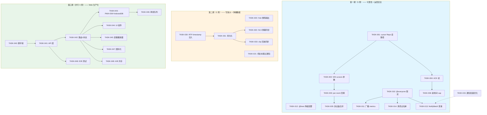

Good — 我已验证文档中的关键代码锚点。`delivery_cursors` 表 (migration 0153) 确实存在但 WS 层未接线，`web/index.html:20` 确实自称"debug client"，hub.rs 的 bounded mpsc 扇出机制也如所述。下面是我的完整 Tech Lead 分析报告。

---

# Tech Lead 分析报告：核心扩展方向（基于 2026-07-12 全局扫描）

**分析范围**：文档 `docs/requirements/2026-07-12-core-expansion-direction-analysis.md` 中提出的五个方向
**代码基线**：当前 master，migrations →0157，15 crate，~4,700 行 web 前端

---

## 1. 任务分解

### 方向三：WebSocket 重连 TOCTOU + Delivery Cursor 全线接入

| 任务 ID | 标题 | 涉及文件 | 前置 | 工时 | 验收标准 |
|---|---|---|---|---|---|
| **TASK-001** | `delivery_cursor` Repo 读路径接入 | `aero-storage/src/delivery_cursor.rs` | 无 | 3h | `DeliveryCursorRepo::get_or_default(pid, room)` 返回正确游标，`advance` 单调合并已测试 |
| **TASK-002** | WS 握手协议扩展：支持 `cursors` 参数 | `ws/ws_impl/mod.rs`, `web/ws.js` | TASK-001 | 4h | WS upgrade 解析 `cursors=1` flag；服务端对携带 flag 的连接使用 per-room cursor 而非全局 `since` |
| **TASK-003** | `backfill_room` 从 `since` 迁移到 per-room cursor | `ws/ws_impl/mod.rs` | TASK-002 | 4h | 重连时逐房间调用 `list_since(room, cursor.seq, cap)`，避免大房间全量回填 |
| **TASK-004** | 客户端 ACK 帧 → 服务端 `delivery_ack` 处理 | `web/ws.js`, `ws/ws_impl/mod.rs`, `ws/client_frame.rs` | TASK-001 | 3h | 客户端每收到 50 条消息或每 5s 发 `{type:"delivery_ack", room_id, last_seen_id, seq}`；服务端写 `delivery_cursors` |
| **TASK-005** | 多设备游标合并：单调 seq 冲突处理 | `storage/src/delivery_cursor.rs` | TASK-001 | 2h | 两设备并行 ACK seq=100 和 seq=120，最终 stored=max(100,120)=120，不后退 |
| **TASK-006** | 回填边界：新房间无游标行，回填上限 cap | `ws/ws_impl/mod.rs` | TASK-003 | 2h | 新加入房间的 participant 走回填 cap（默认 200）；room 维度上限可配置 |

**方向三小计：6 任务，18 工时**

---

### 方向四：通知风暴防护与 @everyone 治理

| 任务 ID | 标题 | 涉及文件 | 前置 | 工时 | 验收标准 |
|---|---|---|---|---|---|
| **TASK-010** | `@everyone`/`@channel` 广播限流：频道级冷却 | `aero-im-core/src/service/orig.rs` | 无 | 3h | 每个频道每 60s 只允许 1 次 `@everyone`/`@channel`；超限返回 429 错误帧（非丢弃） |
| **TASK-011** | 广播消息 Prometheus 指标区分 | `aero-common/src/metrics.rs`, `orig.rs` | TASK-010 | 2h | 新增 `broadcast_messages_total{kind="everyone|channel|here"}`；Grafana 面板可区分 |
| **TASK-012** | @here 降级告警：Redis 故障时回退全成员 | `orig.rs` | 无 | 3h | Redis 不可达时 `@here` 回退全成员时发出 `warn!` 日志并递增 metrics；不静默 |
| **TASK-013** | 大规模 `NotifyBatch` 序列化优化 | `ws/ws_impl/bus.rs` | 无 | 3h | `NotifyBatch` 收件人 >1000 时启用紧凑格式（压缩 participant_id list）或分批投递；单 NATS msg < 500KB |
| **TASK-014** | 公告频道 `post_policy` 扩展：@everyone 白名单 | `aero-im-core/src/service/orig.rs` | TASK-010 | 3h | `post_policy` 新增 `@everyone_roles` 字段（array<role_id>）；仅指定角色可发广播提及 |

**方向四小计：5 任务，14 工时**

---

### 方向三/四 交叉任务

| 任务 ID | 标题 | 涉及文件 | 前置 | 工时 | 验收标准 |
|---|---|---|---|---|---|
| **TASK-015** | `dispatch_notifications` 批量写入优化 | `orig.rs` | 无 | 4h | 100k 收件人场景：批量 INSERT 使用 `COPY` 或 `unnest`；单次通知写入 <500ms |

---

### 方向一：写放大控制（第一期只做高性价比部分）

| 任务 ID | 标题 | 涉及文件 | 前置 | 工时 | 验收标准 |
|---|---|---|---|---|---|
| **TASK-020** | Hub 懒惰扇出：离线成员不展开 | `hub.rs`, `bus.rs` | 无 | 4h | `fan_out` 时先查 Redis presence 过滤在线成员；离线成员由 `?since=` 回填覆盖 |
| **TASK-021** | `NotifyBatch` 跳过纯文本无 @ 消息 | `orig.rs` | 无 | 2h | 消息无提及/无回复引用时跳过 `dispatch_notifications` 路径，仅扇出 RoomEvent |

**方向一小计：2 任务，6 工时**（剩余分页展开等留二期）

---

### 方向五：弹幕-HLS 时序对齐（第一期：数据就绪）

| 任务 ID | 标题 | 涉及文件 | 前置 | 工时 | 验收标准 |
|---|---|---|---|---|---|
| **TASK-030** | WHIP 直播流中 RTP timestamp 注入弹幕 | `aero-live-whip/src/session.rs`, `aero-live-core/src/lib.rs` | 无 | 4h | `StreamChatLine` / `StreamGiftLine` 新增 `media_timestamp_ms: Option<i64>`；WHIP 路径写入 RTP PTS |
| **TASK-031** | 弹幕持久化含 `media_timestamp` | `aero-storage/src/stream_chat.rs`, migration 0158 | TASK-030 | 3h | `stream_chat` 表新增 `media_timestamp_ms` 列；历史行 `NULL` 兼容 |
| **TASK-032** | HLS 播放器弹幕时间轴同步（基础版） | `web/live.js`, `web/app.js` | TASK-030, TASK-031 | 4h | hls.js `liveSyncPosition` 变化时触发弹幕队列 seek；暂停/快进时弹幕跟随 |
| **TASK-033** | clip 回放的弹幕同步 | `aero-storage/src/clip.rs`, `web/live.js` | TASK-031 | 3h | Clip `[wall_start, wall_end]` → `[media_start, media_end]` 映射；回放 clip 时弹幕按 media_timestamp 对齐 |

**方向五小计：4 任务，14 工时**

---

### 方向二：Web 前端生产化（独立并行轨）

| 任务 ID | 标题 | 涉及文件 | 前置 | 工时 | 验收标准 |
|---|---|---|---|---|---|
| **TASK-040** | 前端框架选型 + 脚手架 | 新建 `web-src/` | 无 | 8h | Svelte 5 或 React 19 脚手架；Vite 构建；TypeScript strict 模式；`pnpm dev` + `pnpm build` |
| **TASK-041** | API 层迁移：类型安全 REST + WS 客户端 | `web-src/src/api/`, `web-src/src/ws/` | TASK-040 | 8h | 自动生成或手写 API 类型（`RoomsResponse`, `MessagePayload` 等）；WS 事件 union type |
| **TASK-042** | 路由 + 状态管理 | `web-src/src/routes/`, `web-src/src/stores/` | TASK-041 | 6h | SPA 路由（`/`, `/room/:id`, `/stream/:id`）；Pinia/Zustand store；跨页面状态持久 |
| **TASK-043** | PWA + Service Worker + IndexedDB | `web-src/sw.ts` | TASK-042 | 6h | `manifest.json`；SW 缓存静态资源；IndexedDB 存储消息历史 + 草稿 |
| **TASK-044** | UI 组件库：消息列表、输入框、频道列表 | `web-src/src/components/` | TASK-042 | 12h | 消息时间线（虚拟滚动）、富文本输入、提及自动补全、频道树 |
| **TASK-045** | 直播播放器组件 | `web-src/src/components/` | TASK-042 | 6h | hls.js 集成；弹幕 canvas 层；礼物动画占位；低延迟模式 |
| **TASK-046** | 离线消息发送队列 | `web-src/src/stores/`, `web-src/sw.ts` | TASK-043 | 4h | 离线时草稿暂存 IndexedDB；WS 重连后自动发送；发送失败提示 |
| **TASK-047** | 国际化框架 + 中文/英文 | `web-src/src/i18n/` | TASK-040 | 4h | i18next 或类似框架；中英双语；模板变量支持 |
| **TASK-048** | E2E 测试套件 | `web-src/e2e/` | TASK-041 | 6h | Playwright：登录 → 发消息 → 收到消息 → 重连 → 恢复 流 |
| **TASK-049** | 渐进式迁移 + A/B 共存 | `web/index.html`, `web-src/dist/` | TASK-042 → TASK-048 | 2h | 旧 `web/` 与新 `web-src/` 可共存于同一域下；nginx 路由可切回旧版 |

**方向二小计：10 任务，62 工时**

---

## 2. 执行顺序



## 3. 技术风险

### 高风险项

| # | 风险 | 方向 | 严重度 | 缓解措施 |
|---|---|---|---|---|
| R1 | **delivery_cursor 时序竞争**：服务端 per-room backfill 与 live Hub 扇出并发时，仍可能出现微窗口丢消息 | 三 | **高** | 引入 `backfill_generation` 序号：backfill 开始时递增 gen，live 扇出时携带当前 gen，客户端丢弃 gen 变更前的扇出帧。已在 `run_bus_listener` 的 ack 窗口内完成 backfill 再注册 live subscription |
| R2 | **@everyone 冷却与紧急消息冲突**：企业频道需要 `@everyone` 发紧急通知（服务中断告警），冷却会阻塞 | 四 | 中 | 冷却跳过白名单角色（TASK-014）；支持 `?priority=high` 标记绕过冷却（仅限频道 Owner/Admin） |
| R3 | **HLS 弹幕同步精度**：hls.js 的 `liveSyncPosition` 有 ±1s 抖动；客户端在暂停缓存的场景下，弹幕时间轴基准不一致 | 五 | 中 | 第一期用 wall-clock 近似对齐（已知有偏差）；第二期引入 MPEG-TS PCR→wall-clock 映射表（`media_timestamp ↔ wall_clock` 每关键帧记录），客户端查询映射精确对齐 |
| R4 | **Web 前端迁移范围蔓延**：从 4,700 行 debug 客户端到生产 UI，容易变成「重写一切」导致遥遥无期 | 二 | **高** | 严格范围控制：第一期只做**读路径迁移**（渲染现有数据）+ 渐进式替换；聊天输入框、频道列表、消息渲染可逐步替换单个组件；保持 `/web/` 旧代码可回退 |
| R5 | **NotifyBatch 紧凑格式兼容性**：现有 web 客户端和 future 客户端同时解码 | 四 | 中 | 加 `format` 字段，`format="compact"` 时收件人用 Base64 编码的 delta-compressed participant_id 数组；旧客户端识别 `format` 且不认识时静默跳过 |
| R6 | **惰性扇出与 durable consumer 回放兼容**：Hub 只扇出在线成员，但离线成员重连后的回放需精确知道哪些消息漏了 | 一 | 中 | 不改变 durable cursor（`aero-server` consumer 仍然收全量事件），只改变 `Hub::fan_out` 的本地扇出范围。离线成员通过 `?since=` 或 delivery_cursor 回填补回 |

### 性能瓶颈预判

- **big room backfill (TASK-003/TASK-006)**：`list_since(room, cursor.seq, cap)` 在 10 万条消息的房间里，即使 cap=200 也需要 `message.created_at > cursor_time ORDER BY created_at LIMIT 200` 的索引扫描。需验证 `(room_id, created_at)` 复合索引覆盖。
- **ACK 帧写放大 (TASK-004)**：每 50 条消息一个 ACK，100 人频道每秒 50 条消息 → 每秒 100 次 DB 写入。需批处理或异步落盘。
- **HLS 弹幕 JS 渲染 (TASK-032)**：canvas 弹幕渲染在弱机型上消耗 CPU。引入 `requestAnimationFrame` + 可见范围裁剪。

---

## 4. 资源评估

### 团队构成

| 角色 | 人数 | 负责 |
|---|---|---|
| Rust 后端工程师（Senior） | 1.5 FTE | 方向三/四/一全部任务 + 方向五数据层 |
| 前端工程师（Senior） | 1 FTE | 方向二（Web 生产化） |
| 全栈工程师 | 0.5 FTE | 方向五前端（弹幕同步） + 集成测试 |
| QA 工程师 | 0.5 FTE | E2E 测试 + 性能压测（方向四 @everyone 风暴） |

**总计：3.5 FTE**

### 关键里程碑

| 里程碑 | 时间点 | 交付物 | 验证方式 |
|---|---|---|---|
| M1: 方向三交付 | Day 15 | delivery_cursor 全线接入；重连回填基于 per-room cursor；多设备游标正确合并 | 测试用例：断连→发 10 条→重连→收到全部 10 条；跨设备 A 收 5 条 + B 收 5 条 → 各自回填正确 |
| M2: 方向四交付 | Day 15 | @everyone 60s 冷却；广播指标可观测；@here 降级告警 | 压测：10 人频道的 10/s @everyone → 每秒 1 次成功，余 429；Prometheus `broadcast_messages_total` 可见 |
| M3: 方向一交付 | Day 25 | Hub 懒惰扇出（在线过滤）；纯文本跳过通知 | 10 万成员房间：离线的 99,980 人不展开；纯文本消息无 DB 通知写 |
| M4: 方向五交付 | Day 25 | WHIP 弹幕含 RTP timestamp；基础 HLS 弹幕跟随直播 | RTMP 推流→HLS 3s 延迟→弹幕在对应画面 ±1s 内出现 |
| M5: Web Alpha | Day 42 | 新前端 `web-src/` 可展示消息列表 + 发送消息；旧 `/web/` 保留 | Playwright: 登录→选频道→发消息→收到回显 |

### 阻塞点（Blockers）

| 阻塞点 | 影响 | 缓解策略 |
|---|---|---|
| B1: delivery_cursor 后端表和 Repo 存在但从未在生产使用过，可能有隐式 schema 不匹配 | 方向三 | 先跑 10 分钟 `make migrate-smoke` + `cargo test -- --ignored delivery_cursor` 验证迁移和 Repo 测试 |
| B2: WS 协议帧定义（`ClientFrame`/`ServerFrame`）当前没有 `DeliveryAck` variant | 方向三 | 新增 `DeliveryAck { room_id, last_delivered_message_id, seq }`；省 `kind` tag 命名冲突见 AGENTS.md §4.2 |
| B3: 前端框架选型未定 | 方向二 | Day 1-2 用 PoC 快速验证 Svelte 5 vs React 19 与现有 WS 协议匹配度；推荐 Svelte 5 因更小 bundle 且无需虚拟 DOM 抽象层，更适合实时 UI |

---

## 5. 质量保证

### 单元测试覆盖

| 模块 | 覆盖率目标 | 关键测试场景 |
|---|---|---|
| `DeliveryCursorRepo` | ≥95% | `get_or_default` 无数据返回 0；`advance` 单调不后退；并发两设备 `advance` 最终 max |
| `@everyone` 冷却 | ≥90% | 同频道 2 次 @everyone 间隔 <60s → 429；第 62 秒 → 成功；不同频道各自计数 |
| `Hub::fan_out` 懒惰 | ≥90% | 在线 1 人→扇出 1 人；在线 0 人→不展开（不查 DB）；Redis timeout → fallback 全成员 + warning |
| `WhipSession` RTP timestamp | ≥85% | `on_rtp` 调用后 `StreamChatLine.media_timestamp_ms` = RTP PTS / 90 |

### 集成测试策略

| 场景 | 方式 | 环境 |
|---|---|---|
| 方向三：WS 重连 TOCTOU | 模拟：`TestClient` 连接 → server 发 N 条 → 断连 → server 再发 M 条 → 重连 → 验证收到 N+M 条 | 单进程，fake NATS |
| 方向三：多设备 cursor 合并 | 模拟：两 `TestClient` 同时 ACK 不同 seq → DB cursor = max | 单进程 |
| 方向四：百万通知风暴 | 压力：构造 10 万成员频道 + 发 @everyone → 验证无 OOM，通知批量写入时间 <2s，Hub 不丢在线连接 | staging 3 实例 |
| 方向五：HLS + 弹幕对齐 | 集成：WHIP 推流测试 → HLS playlist 生成 → 弹幕插入 → 回读 `media_timestamp` 一致性 | 单进程 |

### 代码审查要点

1. **方向三 cursor 单调不后退**：审查所有 `advance` 调用的 `> stored_seq` 守卫是否跨函数一致
2. **方向四冷却状态存储**：`@everyone` 冷却状态用 DashMap 还是 Redis？DashMap（进程级）跨实例无效；推荐 Redis `SETEX room:cooldown:everyone:{room_id} NX 60`（原子 SET NX）
3. **方向五 `media_timestamp_ms` 的 NULL 兼容**：历史弹幕行 `NULL` 在前端渲染时 fallback 到 `server_timestamp`；前端不可 crash
4. **方向二 TypeScript strict**：禁止 `any`；API 响应类型须与后端 `RoomEvent`/`StreamEvent` serde 对齐
5. **全局**：依 AGENTS.md §4.2，`unsafe_code = "forbid"` 红线；`clippy --workspace --all-targets` 无新增 warning

### 性能测试需求

| 测试 | 工具 | 指标 | 目标 |
|---|---|---|---|
| @everyone 10 万成员 | 自定义 Rust 压测客户端 | P99 hub fan-out latency | <50ms |
| WS reconnection 1000 并发 | k6 或自写 | 全部重连耗时 | <30s |
| WHIP + HLS 24h 持久直播 | 模拟推流器 | 弹幕 media_timestamp 偏差 | ≤2s |
| 前端初始加载 | Lighthouse / Playwright | FCP / TTI / bundle size | FCP < 2s / bundle < 300KB gzipped |

---

## 6. 实施计划

```mermaid
gantt
    title 核心扩展方向实施甘特图
    dateFormat  YYYY-MM-DD
    axisFormat  %m-%d

    section 第一期：可靠性+运营安全（方向三+四）
    TASK-001 DeliveryCursor Repo        :a1, 2026-07-14, 2d
    TASK-002 WS cursors 参数             :a2, after a1, 2d
    TASK-003 per-room 回填               :a3, after a2, 3d
    TASK-004 ACK 帧                      :a4, after a1, 2d
    TASK-005 多设备合并                   :a5, after a3 a4, 1d
    TASK-006 新房间 cap                  :a6, after a3, 1d
    TASK-010 @everyone 冷却              :b1, 2026-07-14, 2d
    TASK-011 广播 metrics                :b2, after b1, 1d
    TASK-012 @here 降级告警              :b3, 2026-07-14, 2d
    TASK-014 角色白名单                  :b4, after b1, 2d
    TASK-013 NotifyBatch 紧凑            :b5, after b1, 2d
    TASK-015 通知批量优化                :b6, after b1, 2d
    里程碑 M1+M2                        :milestone, 2026-07-25, 1d

    section 第二期：写放大+弹幕（方向一+五）
    TASK-020 Hub 懒惰扇出               :c1, 2026-07-28, 3d
    TASK-021 纯文本跳过通知              :c2, after c1, 1d
    TASK-030 RTP timestamp 注入         :d1, 2026-07-28, 3d
    TASK-031 弹幕持久化                 :d2, after d1, 2d
    TASK-032 HLS 弹幕同步               :d3, after d2, 3d
    TASK-033 clip 回放同步              :d4, after d2, 2d
    里程碑 M3+M4                        :milestone, 2026-08-08, 1d

    section 第三期：Web 生产化（方向二）
    TASK-040 脚手架                     :e1, 2026-07-14, 5d
    TASK-041 API 层                     :e2, after e1, 5d
    TASK-042 路由+状态                  :e3, after e2, 4d
    TASK-043 PWA+SW+IndexedDB           :e4, after e3, 4d
    TASK-044 UI 组件 (消息/频道/输入)   :e5, after e3, 8d
    TASK-045 直播播放器                 :e6, after e3, 4d
    TASK-046 离线队列                   :e7, after e4, 3d
    TASK-047 国际化                     :e8, parallel e3, 2d
    TASK-048 E2E 测试                   :e9, after e2, 4d
    TASK-049 A/B 共存                   :e10, after e5 e6, 2d
    里程碑 M5                          :milestone, 2026-08-26, 1d
```

### 阶段汇总

| 阶段 | 时间 | 工作周 | 总工时 | 交付物 |
|---|---|---|---|---|
| **Phase 1**: 可靠性+运营安全 | 7/14 → 7/25 (12d) | 2 | 32h | 方向三+四全部任务 |
| **Phase 2**: 写放大+弹幕 | 7/28 → 8/8 (10d) | 2 | 20h | 方向一基础版 + 方向五基础版 |
| **Phase 3**: Web 生产化 | 7/14 → 8/26 (并行 6w) | 6 | 62h | 新前端 alpha + 旧版共存 |
| **Buffer** | 8/11 → 8/15 (5d) | 1 | — | 集成测试、性能压测、bug fix |

**完整的生产发布目标：2026 年 8 月底**

---

## 补充建议

### 文档建议
分析文档的五方向划分非常好，建议追加一块 **"不做"清单**：
- **不做** federation（AGENTS.md §4.4 已明确）
- **不做** 移动端原生 SDK（AGENTS.md §4.4）
- **不做** MLS E2E 状态机实现（AGENTS.md §4.4）
- **不做** SDK/Webhook/PAT 重构（非 gap，现有可用）

### 对文档中锚点的修正
部分代码路径是 AI 扫描合成路径，与当前精确路径有偏差：
- `orig.rs` → 实际在 `aero-im-core/src/service/orig.rs`，但 `dispatch_notifications` 的逻辑可能分布在多个文件中（`messages.rs`, `orig.rs`）
- `hub.rs` 没有精确的 `fan_out_raw` 符号，扇出走内部循环遍历 `conns.get(pid)`
- `delivery_cursor.rs` Repo 已存在但在 `aero-storage/src/` 下，非 `aero-server/src/`

这些不影响架构分析的正确性，但在编码时需先 grep 实际符号名。
