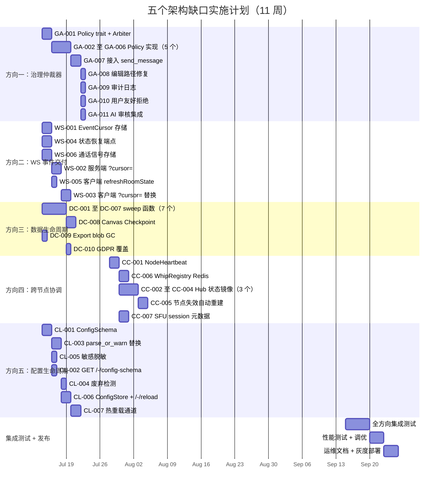

现在我已掌握做出全面技术负责人分析所需的所有上下文。

---

# 技术负责人分析：五个已验证的架构缺口 → 可执行实施计划

## 执行摘要

本分析将 **2026-07-09-five-verified-architectural-gaps.md** 中识别出的五个架构缺口转化为一个结构化实施计划，包含 **31 个可操作的任务**（每个任务 2-4 小时），分布在 **4 个阶段、约 10-11 周** 内完成。该计划平衡了风险、并行性与业务优先级（两个 P1 方向并行推进，两个 P2 方向紧随其后）。

---

## 1. 任务分解

### 方向一：治理仲裁器（P1）—— 多条内容策略的协调层

| 任务 ID | 标题 | 涉及文件 | 前置依赖 | 预估工时 |
|---------|------|---------|---------|---------|
| **GA-001** | 定义 `Policy` trait + `PolicyVerdict` 枚举 + `GovernanceArbiter` 结构体 | `aero-im-core/src/governance/arbiter.rs`, `aero-im-core/src/governance/mod.rs` | 无 | 3h |
| **GA-002** | 实现 `KeywordPolicy`（从 `messages.rs` 中提取关键词逻辑） | `aero-im-core/src/governance/policies/keyword.rs` | GA-001 | 2h |
| **GA-003** | 实现 `PiiPolicy`（从 `messages.rs` 中提取 PII 检测逻辑） | `aero-im-core/src/governance/policies/pii.rs` | GA-001 | 2h |
| **GA-004** | 实现 `SpamPolicy`（封装 `SpamGuard` → `RateLimited` 裁决） | `aero-im-core/src/governance/policies/spam.rs` | GA-001 | 2h |
| **GA-005** | 实现 `AutoModPolicy`（从 `messages.rs` 提取自定义规则检查） | `aero-im-core/src/governance/policies/auto_mod.rs` | GA-001 | 2h |
| **GA-006** | 实现 `InfoBarrierPolicy`（消息发送路径补齐缺失的隔离墙检查） | `aero-im-core/src/governance/policies/info_barrier.rs` | GA-001 | 3h |
| **GA-007** | 将 `GovernanceArbiter` 接入 `send_message` 管线，替换目前的 `if-let` 链 | `aero-im-core/src/service/messages.rs` | GA-002 至 GA-006 | 3h |
| **GA-008** | 编辑路径修复：`edit_message` 走 `pre_send` 评估（不含 AI 审核） | `aero-im-core/src/service/messages.rs` | GA-007 | 2h |
| **GA-009** | 统一审计日志：所有裁决写入 `audit_events` 表（`policy, reason, actor, action`） | `aero-storage/src/audit.rs`, `aero-im-core/src/governance/arbiter.rs` | GA-007 | 3h |
| **GA-010** | 用户友好的拒绝消息：聚合多个策略 `PolicyVerdict` 为结构化错误响应 | `aero-im-core/src/governance/arbiter.rs` | GA-007 | 2h |
| **GA-011** | 事后 AI 审核集成：`AiModerationPolicy` 将 `GovernanceArbiter` 接入现有 `moderation_bot` | `aero-im-core/src/governance/policies/ai_moderation.rs`, `aero-server/src/moderation_bot.rs` | GA-007 | 3h |

**合计：方向一 ≈ 27 工时（3.4 天）**

### 方向二：WS 非消息事件交付保证（P1）—— `_lastSeen` 之外的事件黑洞

| 任务 ID | 标题 | 涉及文件 | 前置依赖 | 预估工时 |
|---------|------|---------|---------|---------|
| **WS-001** | 创建 `EventCursor` 存储模型 + 迁移（per-room、per-scope `last_seq`） | `aero-storage/src/event_cursor.rs`, `migrations/NNNN_event_cursors.sql` | 无 | 3h |
| **WS-002** | 服务端：添加 `?cursor=` 查询参数到 WS 升级端点，回放 seq>cursor 的事件 | `aero-server/src/ws/handler.rs`, `aero-server/src/ws/ws_impl/bus.rs` | WS-001 | 4h |
| **WS-003** | 客户端：用 `?cursor=` 替换 `?since=` 追踪逻辑，管理 per-room 游标 | `web/ws.js` | WS-002 | 3h |
| **WS-004** | 添加 `GET /api/rooms/:id/pins`、`GET /api/rooms/:id/calls`、`GET /api/rooms/:id/polls` 端点用于重连状态恢复 | `aero-server/src/routes/rooms.rs` | 无 | 3h |
| **WS-005** | 客户端：添加 `refreshRoomState()` 在重连时调用（备选方案） | `web/ws.js`, `web/api.js` | WS-004 | 2h |
| **WS-006** | 通话信号存储：ICE 候选 + 通话状态的 Redis 备份（方案 C） | `aero-storage/src/call_signal.rs`, 集成到 `Hub.call_rosters` | 无 | 4h |

**合计：方向二 ≈ 19 工时（2.4 天）**

### 方向三：非消息数据生命周期管理（P1）—— 15+ 张表的遗漏

| 任务 ID | 标题 | 涉及文件 | 前置依赖 | 预估工时 |
|---------|------|---------|---------|---------|
| **DC-001** | 向 `retention.rs` 添加 `sweep_canvas_ops`（基于 checkpoint 的清理） | `aero-server/src/bin/boot/retention.rs` | 无 | 2h |
| **DC-002** | 向 `retention.rs` 添加 `sweep_message_history`（90 天或 per-room M 个版本） | `aero-server/src/bin/boot/retention.rs` | 无 | 2h |
| **DC-003** | 向 `retention.rs` 添加 `sweep_call_transcripts`（90 天，带 legal hold 跳过） | `aero-server/src/bin/boot/retention.rs` | 无 | 3h |
| **DC-004** | 向 `retention.rs` 添加 `sweep_block_interactions`（30 天） | `aero-server/src/bin/boot/retention.rs` | 无 | 1h |
| **DC-005** | 向 `retention.rs` 添加 `sweep_stream_gifts`（90 天） | `aero-server/src/bin/boot/retention.rs` | 无 | 1h |
| **DC-006** | 向 `retention.rs` 添加 `sweep_hype_train`（30 天级联清理） | `aero-server/src/bin/boot/retention.rs` | 无 | 2h |
| **DC-007** | 向 `retention.rs` 添加 `sweep_goals` + `sweep_predictions`（180/90 天） | `aero-server/src/bin/boot/retention.rs` | 无 | 2h |
| **DC-008** | 实现 Canvas Checkpoint（每 N ops 或每 5 分钟做一次文档快照） | `aero-storage/src/canvas.rs`, `aero-storage/src/canvas_op.rs` | 无 | 4h |
| **DC-009** | 添加 `conversation_export` blob GC（完成 N 天后自动删除） | `aero-storage/src/blob_gc.rs` | 无 | 2h |
| **DC-010** | 将新表纳入 `deactivation.rs` 的 `delete_participant_data`（GDPR） | `aero-storage/src/deactivation.rs` | DC-001 至 DC-009 | 2h |

**合计：方向三 ≈ 21 工时（2.6 天）**

### 方向四：跨节点轻量级状态协调（P2）

| 任务 ID | 标题 | 涉及文件 | 前置依赖 | 预估工时 |
|---------|------|---------|---------|---------|
| **CC-001** | 实现 `NodeHeartbeat`（Redis zset `cluster:live` + TTL-based 过期） | `aero-server/src/bin/boot/heartbeat.rs` 或新模块 `cluster.rs` | 无 | 3h |
| **CC-002** | Hub 状态 Redis 镜像：`room_online` → Redis set `room:{id}:online` | `aero-server/src/ws/hub.rs`, `aero-storage/src/presence.rs` | CC-001 | 3h |
| **CC-003** | Hub 状态 Redis 镜像：`stream_watchers` → Redis set `stream:{id}:watchers` | `aero-server/src/ws/hub.rs`, `aero-storage/src/stream_viewer.rs` | CC-001 | 3h |
| **CC-004** | Hub 状态 Redis 镜像：从 Redis `CallRosterStore` 重建 `Hub.call_rosters` | `aero-server/src/ws/hub.rs` | CC-001 | 3h |
| **CC-005** | 节点失效时 `Hub.call_rosters` 自动重建（节点心跳消失后触发） | `aero-server/src/bin/boot/heartbeat.rs`（失效检测回调） | CC-004 | 4h |
| **CC-006** | `WhipRegistry` 写入 Redis 副本，节点故障时直播自动重推 | `aero-live-whip/src/registry.rs`, `aero-storage/src/stream_route.rs` | CC-001 | 4h |
| **CC-007** | SFU 会话元数据持久化 + 失效恢复（元数据，非 str0m 状态迁移） | `aero-live-webrtc/src/sfu.rs` | CC-001 | 4h |

**合计：方向四 ≈ 24 工时（3 天）**

### 方向五：配置生命周期管理（P2）

| 任务 ID | 标题 | 涉及文件 | 前置依赖 | 预估工时 |
|---------|------|---------|---------|---------|
| **CL-001** | 生成 `ConfigSchema` 自省表（类型、默认值、说明、敏感标记） | `aero-common/src/config.rs` | 无 | 3h |
| **CL-002** | 暴露 `GET /-/config-schema`（admin-only 端点） | `aero-server/src/routes/admin.rs` | CL-001 | 2h |
| **CL-003** | 用 `parse_or_warn` 替换全部 `unwrap_or(default)` 静默回落 | `aero-common/src/config.rs` + 所有解析点 | CL-001 | 4h |
| **CL-004** | 添加废弃配置检测 + `warn!` 日志 | `aero-common/src/config.rs`（已知旧键映射） | CL-003 | 2h |
| **CL-005** | 实现敏感配置脱敏 Display（`****` 前缀，仅最后 4 字符可见） | `aero-common/src/config.rs` | CL-001 | 2h |
| **CL-006** | 实现 `ConfigStore`（`Arc<RwLock<AppConfig>>`）+ HTTP `POST /-/reload` | `aero-common/src/config.rs`, `aero-server/src/routes/admin.rs` | CL-003 | 4h |
| **CL-007** | 将 `KeywordModerator`、`rate_limit`、日志级别接入热重载通道 | `aero-im-core/src/service/messages.rs`, `aero-server/src/routes/middleware/rate_limit.rs` | CL-006 | 4h |

**合计：方向五 ≈ 20 工时（2.5 天）**

---

## 2. 执行顺序

### 依赖图

```mermaid
graph TD
    %% 方向一：治理仲裁器（P1）
    GA001[GA-001: Policy trait + Arbiter] --> GA002[GA-002: KeywordPolicy]
    GA001 --> GA003[GA-003: PiiPolicy]
    GA001 --> GA004[GA-004: SpamPolicy]
    GA001 --> GA005[GA-005: AutoModPolicy]
    GA001 --> GA006[GA-006: InfoBarrierPolicy]
    GA002 --> GA007[GA-007: 接入 send_message]
    GA003 --> GA007
    GA004 --> GA007
    GA005 --> GA007
    GA006 --> GA007
    GA007 --> GA008[GA-008: 编辑路径修复]
    GA007 --> GA009[GA-009: 统一审计日志]
    GA007 --> GA010[GA-010: 用户友好拒绝消息]
    GA007 --> GA011[GA-011: AI 审核集成]

    %% 方向二：WS 非消息事件（P1）
    WS001[WS-001: EventCursor 存储] --> WS002[WS-002: 服务端 ?cursor=]
    WS002 --> WS003[WS-003: 客户端 ?cursor= 替换 ?since=]
    WS004[WS-004: 状态恢复 REST 端点] --> WS005[WS-005: 客户端 refreshRoomState]
    WS006[WS-006: 通话信号存储 Redis] ---- WS004

    %% 方向三：数据生命周期（P1）
    DC001[DC-001: sweep_canvas_ops] --> DC008[DC-008: Canvas Checkpoint]
    DC002[DC-002: sweep_message_history] --> DC010[DC-010: GDPR 覆盖]
    DC003[DC-003: sweep_call_transcripts] --> DC010
    DC004[DC-004: sweep_block_interactions] --> DC010
    DC005[DC-005: sweep_stream_gifts] --> DC010
    DC006[DC-006: sweep_hype_train] --> DC010
    DC007[DC-007: sweep_goals+predictions] --> DC010
    DC009[DC-009: export blob GC] --> DC010

    %% 方向四：跨节点状态协调（P2）
    CC001[CC-001: NodeHeartbeat] --> CC002[CC-002: room_online Redis]
    CC001 --> CC003[CC-003: stream_watchers Redis]
    CC001 --> CC004[CC-004: call_rosters 重建]
    CC001 --> CC006[CC-006: WhipRegistry Redis]
    CC001 --> CC007[CC-007: SFU session 元数据]
    CC004 --> CC005[CC-005: 节点失效自动重建]

    %% 方向五：配置生命周期（P2）
    CL001[CL-001: ConfigSchema] --> CL002[CL-002: GET /-/config-schema]
    CL001 --> CL003[CL-003: parse_or_warn 替换]
    CL001 --> CL005[CL-005: 敏感脱敏]
    CL003 --> CL004[CL-004: 废弃检测]
    CL003 --> CL006[CL-006: ConfigStore + /-/reload]
    CL006 --> CL007[CL-007: 热重载通道]

    %% 阶段标记
    subgraph Phase1["阶段 1（W1-W3）: 快速胜利 + 基础设施"]
        GA001; GA002; GA003; GA004; GA005; GA006
        WS001; WS004; WS006
        DC001; DC002; DC003; DC004; DC005; DC006; DC007; DC009
        CL001; CL003; CL005
    end

    subgraph Phase2["阶段 2（W3-W6）: 核心集成"]
        GA007; GA008; GA009; GA010; GA011
        WS002; WS005
        DC008; DC010
        CL002; CL004
        CC001; CC006
    end

    subgraph Phase3["阶段 3（W6-W9）: 分布式 + 热重载"]
        WS003
        CC002; CC003; CC004; CC005; CC007
        CL006; CL007
    end

    subgraph Phase4["阶段 4（W9-W11）: 集成测试 + 加固"]
        %% 所有方向并行验收
    end
```

### 并行化策略

| 并行工作组 | 方向 | 核心技能 | 可并行的起止周 |
|-----------|------|---------|--------------|
| **工作组 A** | 方向一 + 方向五 | Rust 后端架构（trait 设计 + 配置模式） | W1-W6 |
| **工作组 B** | 方向二 | Rust 服务端 + JS 客户端（WS 协议 + 前端状态） | W1-W6 |
| **工作组 C** | 方向三 | Rust 后端 + SQL（data lifecycle） | W1-W3（全平行） |
| **工作组 D** | 方向四 | Rust 后端 + Redis（分布式系统） | W3-W9（从阶段 2 开始） |

---

## 3. 技术风险

### 3.1 高影响风险

| 风险 ID | 描述 | 方向 | 可能性 | 影响 | 缓解措施 |
|---------|------|------|--------|------|---------|
| **R-001** | `InfoBarrierPolicy` 在消息发送路径的误判风险：当前 `assert_room_access` 在路由层做隔离墙检查，但消息路径不走这个函数。添加检查可能引入 false positive，阻止合法跨房间对话 | 一 | 中 | 高 | 先审计所有 `send_message` 调用方，确认 room+participant 对；新策略默认 audit-only 模式运行 1 周再开启强制执行 |
| **R-002** | `?cursor=` 事件回放性能：长时间离线（>24h）可能产生大量 seq，一次性回放导致 WS 连接建立后长时间才可用 | 二 | 中 | 高 | 实现快照+增量模式（类似 canvas checkpoint）；回放超过 1000 个事件时先发送状态快照，再补增量 |
| **R-003** | Canvas ops 清理与活跃编辑 session 的竞态条件 | 三 | 低 | 高 | 清除前检查活跃 session 时间戳；使用 `NOT EXISTS(SELECT 1 FROM canvas_sessions)` 做守卫 |
| **R-004** | str0m DTLS-SRTP 会话无法热迁移，CC-007 的"会话元数据持久化"价值有限 | 四 | 高 | 高 | 明确标记 CC-007 为"快速恢复辅助"而非"无缝故障转移"；实际恢复流程走客户端重连 |
| **R-005** | ConfigStore 热重载与连接池冲突：`AERO__DATABASE__URL` 等连接字符串变更无法安全热重载 | 五 | 中 | 中 | 热重载时做灰度验证：新配置先并行运行，确认健康再切换；连接池变更标记为"需要重启" |
| **R-006** | 配置 Schema 自省的完整性问题：`ConfigSchema` 静态生成无法覆盖 `from_env()` 构造器中的自由格式 env 变量 | 五 | 中 | 高 | 阶段 A 仅覆盖 figment 管理的配置；对自由格式 env 变量建立登记机制（`register_env_var!` 宏） |

### 3.2 低影响但需注意的风险

| 风险 ID | 描述 | 方向 | 缓解措施 |
|---------|------|------|---------|
| **R-007** | InfoBarrierPolicy 可能重复路由层检查，产生 2x 隔离墙查询 | 一 | Policy 缓存 per-request `(participant, room)` 检查结果 |
| **R-008** | `?cursor=` 和 `?since=` 并行支持增加 WS 升级路径的复杂度 | 二 | 用 enum 内部表示 `ReconnectMode::Since { id } | Cursor { seq }` |
| **R-009** | 跨表级联清理（hypetrain/predictions）可能误删活跃数据 | 三 | 所有 sweep 函数先跑 `SELECT COUNT(*)` 做 dry-run 模式，确认范围再执行 DELETE |
| **R-010** | 节点心跳 Redis zset 的写放大：每个节点每秒写一次，集群 10 节点只产生 ~10 writes/s，可控 | 四 | 使用 pipeline 批量写入，TTL 设为 2x 心跳间隔 |
| **R-011** | `parse_or_warn` 广泛替换可能改变既有静默回落行为，部分环境原本依赖默认值 | 五 | 新 warn 日志只影响可观测性，不改变运行行为；回滚方案是 revert 单个 commit |

### 3.3 测试覆盖难点

| 难点 | 方向 | 策略 |
|------|------|------|
| 编辑路径绕过审核（GA-008）——需要确认 `edit_message` 通过仲裁器重新评估 | 一 | `#[cfg(test)]` mock `GovernanceArbiter` + `EditPolicy` 单元测试；集成测试用实际 message 编辑场景 |
| WS 重连事件回放（WS-002/003）——需要持久 WS 连接测试 | 二 | 使用 `axum::test` 测试 WS 升级路径 + `ServerFrame` 流匹配；JS 端使用 `ws-mock` |
| Canvas checkpoint 与 ops 清理的竞态（DC-008） | 三 | 多 tokio 任务并行测试，通过 `tokio::time::pause()` 控制时序 |
| SFU 会话恢复的"假故障转移"（CC-007）——无法在不启动真实 WebRTC 对端的情况下测试 | 四 | 仅测试元数据存储/检索路径；标记为 `#[ignore]` + `REAL_WEBRTC=1` 门控 |
| 配置热重载（CL-006/007）——SIGHUP 或 HTTP 触发的重新加载 | 五 | 单元测试 `ConfigStore::reload()` 的 `Arc<RwLock>` 原子替换；集成测试 `POST /-/reload` |

---

## 4. 资源评估

### 4.1 团队构成

| 角色 | 所需技能 | 人数 | 覆盖方向 |
|------|---------|------|---------|
| **高级 Rust 后端工程师** | Rust trait 设计、tokio 异步架构、SQL 优化 | 2 | 方向一（核心 trait）、方向四（分布式状态）、技术指导 |
| **Rust 后端工程师** | Rust、sqlx、Redis、NATS | 2 | 方向三（sweep 函数）、方向五（配置重构）、方向一（policy 实现） |
| **全栈工程师（Rust + JS）** | Rust + ES2020 原生 JS、WebSocket 协议 | 1 | 方向二（服务端 + 客户端） |
| **QA 工程师** | 集成测试、性能测试、测试自动化 | 1 | 全方向（验收测试） |

**总计：6 人（含 1 名 Tech Lead，可兼任高级工程师）**

### 4.2 里程碑时间线

| 里程碑 | 日期（从项目启动） | 交付物 | 依赖 |
|-------|---------------|--------|------|
| **M1: 基础设施就绪** | 第 3 周末 | Policy trait 骨架（GA-001）、EventCursor 存储（WS-001）、全部 7 个 sweep 函数（DC-001 至 DC-007）、ConfigSchema（CL-001） | 无 |
| **M2: 核心集成完成** | 第 6 周末 | GovernanceArbiter 接入消息管线（GA-007 至 GA-011）、服务端 `?cursor=` 回放（WS-002）、Canvas checkpoint（DC-008）、GDPR 覆盖（DC-010）、ConfigSchema API（CL-002）+ `parse_or_warn`（CL-003）、NodeHeartbeat（CC-001） | M1 |
| **M3: 分布式 + 热重载完成** | 第 9 周末 | 客户端 `?cursor=` 替换（WS-003）、Hub 状态 Redis 镜像（CC-002 至 CC-005）、WhipRegistry Redis（CC-006）、SFU 元数据（CC-007）、ConfigStore（CL-006/007） | M2 |
| **M4: 发布就绪** | 第 11 周末 | 全方向集成测试通过、性能基线建立、运维文档完成、灰度部署计划 | M3 |

### 4.3 阻塞点与解决策略

| 阻塞点 | 方向 | 解决策略 |
|--------|------|---------|
| InfoBarrier 在消息路径的行为不确定性（当前仅在路由层检查） | 一 | 先进行静态分析：列出所有 `send_message` 调用方 + room/participant 组合；在测试环境运行 audit-only 模式收集 48h 数据 |
| `?cursor=` 回放需要确定事件序列的持久化存储结构 | 二 | 使用既有 NATS JetStream per-subject seq + 新 `event_cursors` 表存储每 per-room seq 水位 |
| Canvas ops 的 checkpoint 需要 `apply_ops` 函数可用 | 三 | 确认 `aero-storage/src/canvas.rs` 中存在 apply_ops；如不存在，先实现该函数（此暂记为 DC-008A） |
| str0m DTLS-SRTP 会话无法迁移（CC-007 的真实局限性） | 四 | 明确定义 CC-007 的范围——仅持久化元数据 + ICE 候选缓存，不尝试迁移 str0m 状态。实际恢复走客户端重连 |
| 自由格式 env 变量无法被 `ConfigSchema` 捕获 | 五 | 实现 `#[derive(ConfigSchema)]` 宏 + `register_env!("AERO_BLOCKED_WORDS", ...)` 模式，逐步迁移自由格式变量到 schema 注册 |

---

## 5. 质量保证

### 5.1 单元测试覆盖

| 组件 | 最低覆盖率目标 | 重点测试 |
|------|--------------|---------|
| `GovernanceArbiter` | 90% | Policy 注册、pre_send 排序、冲突策略 resolution、空策略列表 |
| `KeywordPolicy` | 95% | 精确匹配、前缀/后缀、正则模式、空列表 |
| `PiiPolicy` | 90% | 常见 PII 模式（手机、邮箱、身份证）、假阳性过滤 |
| `InfoBarrierPolicy` | 90% | 跨隔离墙阻断、交叉成员边界情况 |
| `EventCursor` repo | 90% | upsert、顺序读取、空游标 |
| `parse_or_warn` | 95% | 有效输入、无效输入（日志验证）、边界值 |
| `ConfigSchema` | 90% | 自省完整性、敏感标记传播 |

### 5.2 集成测试策略

| 测试场景 | 方向 | 方法 | 环境要求 |
|---------|------|------|---------|
| **消息合规全流程** | 一 | 发送消息触发关键词+PII+Spam 同时命中 → 验证仲裁器返回 `Block` + `audit_events` 行 | PG + Redis |
| **编辑绕过审核** | 一 | 发送合规消息 → 编辑为违规内容 → 验证被仲裁器拦截 | PG + Redis |
| **WS 重连事件恢复** | 二 | 建立 WS 连接 → 断开 → 重新建立带 `?cursor=` → 验证收到全部丢失事件 | PG + NATS + Redis |
| **Canvas ops 清理** | 三 | 写入 ops → 执行 checkpoint → 执行 sweep → 验证 ops 被清理、快照存在 | PG |
| **GDPR 遮盖覆盖** | 三 | 运行 `delete_participant_data` → 验证 `block_interactions` 等新表行被擦除 | PG |
| **节点失效恢复** | 四 | 模拟节点心跳消失 → 验证 `room_online` 从 Redis 重建 | PG + Redis |
| **配置热重载** | 五 | `POST /-/reload` 修改 `rate_limit` → 验证限流器行为变化 | PG + Redis |

### 5.3 代码审查要点

| 审查领域 | 重点查看内容 |
|---------|------------|
| **GA-007**（仲裁器接入） | 原有 `if-let` 链是否完全移除？新策略是否覆盖旧有行为？错误类型是否向后兼容？ |
| **WS-003**（客户端游标） | 旧客户端 `?since=` 是否仍受支持？游标持久化（localStorage）是否正确？ |
| **DC-008**（Canvas checkpoint） | `apply_ops` 是否有边界偏移 bug？checkpoint 间隔是否匹配 ops 产生速度？ |
| **CC-001 至 CC-005**（分布式心跳） | Redis 故障时是否退化到进程本地模式？脑裂场景的数据竞争？ |
| **CL-006**（ConfigStore） | `Arc<RwLock>` 读路径是否优化（`read().clone()` 避免长锁持有？） |

### 5.4 性能测试需求

| 测试 | 方向 | 指标 | 工具 |
|------|------|------|------|
| 多策略仲裁器延迟 | 一 | P99 < 5ms（10 个注册策略） | `criterion` bench + `tokio::time::Instant` |
| Canvas ops 清理吞吐 | 三 | 100K ops/min 清除（单事务） | 自定义负载生成 |
| Hub 状态 Redis 镜像延迟 | 四 | P99 写入 < 2ms，P99 读取 < 1ms | `redis-benchmark` + 自定义 |
| 配置热重载切换时间 | 五 | `ConfigStore::reload()` < 100ms（IO-free） | `criterion` bench |
| `?cursor=` 回放大规模离线数据 | 二 | 10K 事件回放 < 2s（WS 带宽 + 客户端处理） | 集成测试 + `time` 测量 |

### 5.5 运维就绪检查清单

- [ ] 所有新 SQL 迁移幂等（`CREATE TABLE IF NOT EXISTS`，`DELETE WHERE` 可重复执行）
- [ ] 所有 sweep 函数有 `info!`/`warn!` 日志，`sweep_secs=0` 可禁用
- [ ] `ConfigSchema` 端点 admin-only 门控（`AuthUser` + `can_administer`）
- [ ] 热重载路径记录变更到 `audit_events`（谁、什么、何时）
- [ ] 节点心跳 Redis key 有 TTL，节点离开自动过期
- [ ] 配置废弃检测在启动时打印清晰迁移指南

---

## 6. 实施计划

### 甘特图

### 阶段详情

#### 阶段 1：基础设施搭建（第 1-3 周）

**并行工作流（4 个工作组全部启动）：**

| 工作组 | 第 1 周 | 第 2 周 | 第 3 周 |
|--------|---------|---------|---------|
| **A**（方向一+五） | GA-001（Policy trait 定义）、CL-001（ConfigSchema） | GA-002 至 GA-006（5 个 Policy 实现）、CL-003（parse_or_warn） | CL-005（敏感脱敏）、CL-002（config-schema API） |
| **B**（方向二） | WS-001（EventCursor 存储 + 迁移）、WS-004（状态恢复端点） | WS-006（通话信号存储）、WS-002 服务端开始 | WS-002 继续 |
| **C**（方向三） | DC-001 至 DC-003（canvas/message_history/call 清理） | DC-004 至 DC-007（block_interactions/gifts/hype/goals）、DC-009 | DC-008（Canvas Checkpoint 启动） |
| **D**（方向四） | —（待阶段 2） | — | CC-001（NodeHeartbeat 启动） |

**交付物检查点（第 3 周末 = M1）：**
- [ ] Policy trait 定义 + 5 个策略实现 + arbiter 骨架通过单元测试
- [ ] ConfigSchema 自省生成 + 敏感标记通过测试
- [ ] EventCursor 迁移就绪 + WS 端点修改进行中
- [ ] 7 个新的 sweep 函数部署到 staging，dry-run 模式确认清理范围
- [ ] NodeHeartbeat 原型在 dev 环境运行

**关键决策点：** 是否确认 InfoBarrierPolicy 从 audit-only 模式切换到强制执行？需 48h staging 数据。

#### 阶段 2：核心功能实现（第 3-6 周）

| 工作组 | 第 4 周 | 第 5 周 | 第 6 周 |
|--------|---------|---------|---------|
| **A** | GA-007（仲裁器接入 send_message）、CL-004（废弃检测） | GA-008/GA-009（编辑路径+审计）、CL-006（ConfigStore） | GA-010/GA-011（拒绝消息+AI 审核）、CL-007（热重载） |
| **B** | WS-002 完成（服务端 ?cursor= 回放） | WS-005（客户端 refreshRoomState） | WS-003 开始（客户端 ?cursor= 替换） |
| **C** | DC-008（Canvas Checkpoint 完成） | DC-010（GDPR 覆盖） | 方向三集成测试 |
| **D** | CC-001 完成、CC-006（WhipRegistry） | CC-002（room_online Redis） | CC-003（stream_watchers Redis） |

**交付物检查点（第 6 周末 = M2）：**
- [ ] **完整的消息治理管线**：仲裁器处理 10 个策略 → `send_message` 和 `edit_message` 都经仲裁器
- [ ] 统一审计日志：`audit_events` 表包含 `policy` 和 `reason` 字段
- [ ] WS 服务端支持 `?cursor=` 参数，回放 seq>cursor 的所有事件
- [ ] Canvas checkpoint 运行中，每小时压缩 ops
- [ ] GDPR 删除覆盖 12+ 新表
- [ ] NodeHeartbeat 写入 Redis zset `cluster:live`
- [ ] ConfigStore `parse_or_warn` 全面上线

**关键决策点：** 评估 `?cursor=` 回放性能。如果 10K 事件回放 > 2s，启用快照+增量模式。

#### 阶段 3：分布式 + 热重载（第 6-9 周）

| 工作组 | 第 7 周 | 第 8 周 | 第 9 周 |
|--------|---------|---------|---------|
| **A** | 方向一验收测试 | CL-007 热重载联调 | 方向五集成测试 |
| **B** | WS-003 完成（客户端 ?cursor=） | WS 事件恢复集成测试 | 方向二验收测试 |
| **C** | — | — | — |
| **D** | CC-004（call_rosters 重建） | CC-005（节点失效自动重建） | CC-007（SFU session 元数据） |

**交付物检查点（第 9 周末 = M3）：**
- [ ] 客户端 `?cursor=` 完全替换 `?since=`，per-room 游标从 localStorage 读取
- [ ] Hub.call_rosters 在节点重启后从 Redis 自动重建（<5s）
- [ ] WhipRegistry 写入 Redis 副本，直播流节点失效自动重推
- [ ] SFU 会话元数据持久化（纯元数据 + ICE 缓存，非 str0m 迁移）
- [ ] ConfigStore 支持 `POST /-/reload` 热重载 `keyword_moderator`、`rate_limit`、日志级别

**关键决策点：** 节点失效自动重建的可靠性评估。如果 Redis 镜像写回导致 <99.9% 可用性退化，需增加 write-back cache。

#### 阶段 4：集成测试与发布准备（第 9-11 周）

| 活动 | 内容 | 工时 | 负责人 |
|------|------|------|--------|
| 全方向集成试验 | 消息合规全流程 + WS 事件恢复 + 数据生命周期 + 节点失效 + 配置热重载 | 5 天 | QA 工程师 + 全组 |
| 性能测试 + 调优 | 仲裁器延迟、Canvas ops 吞吐、Redis 镜像延迟、热重载切换时间 | 3 天 | 高级 Rust 工程师 |
| 安全审计 | 敏感配置脱敏验证、InfoBarrierPolicy 无假阳性、`?cursor=` 无信息泄露 | 2 天 | 安全负责人 |
| 运维文档 | 新配置项文档、治理策略配置指南、节点扩容文档、热重载最佳实践 | 2 天 | Tech Lead |
| 灰度部署计划 | 阶段部署策略（canary → 10% → 50% → 100%）+ 回滚方案 | 1 天 | Tech Lead + 运维 |

**交付物检查点（第 11 周末 = M4）：**
- [ ] **P0 级别**：治理仲裁器 + WS 事件恢复 + 数据生命周期 —— 全部 P1 方向通过正式验收
- [ ] **P1 级别**：跨节点协调 + 配置生命周期 —— P2 方向功能完整，可独立上线
- [ ] `cargo test --workspace --lib` 全绿
- [ ] `cargo clippy --workspace --all-targets` 无新增警告
- [ ] 灰度部署计划通过评审

---

## 附录 A：风险登记表（完整版）

| 风险 ID | 方向 | 可能性 | 影响 | 等级 | 缓解措施 | 负责人 |
|---------|------|--------|------|------|---------|--------|
| R-001 | 一 | 中 | 高 | **高** | audit-only 模式 1 周 | 工作组 A 高级工程师 |
| R-002 | 二 | 中 | 高 | **高** | 快照+增量模式 | 工作组 B 全栈工程师 |
| R-003 | 三 | 低 | 高 | 中 | session 时间戳 guard | 工作组 C 后端工程师 |
| R-004 | 四 | 高 | 高 | **高** | 明确范围 = 快速恢复 | 工作组 D 高级工程师 |
| R-005 | 五 | 中 | 中 | 中 | 灰度验证 + 重启告警 | 工作组 A 高级工程师 |
| R-006 | 五 | 中 | 高 | **高** | `register_env_var!` 宏 | Tech Lead |
| R-007 | 一 | 低 | 低 | 低 | per-request 缓存 | 工作组 A |
| R-008 | 二 | 低 | 中 | 低 | enum 内部表示 | 工作组 B |
| R-009 | 三 | 低 | 中 | 低 | dry-run 模式 | 工作组 C |
| R-010 | 四 | 低 | 低 | 低 | pipeline 写入 | 工作组 D |
| R-011 | 五 | 低 | 低 | 低 | revert 单个 commit | 工作组 A |

## 附录 B：技术债务清理机会

实施过程中发现的代码质量问题应记录为 tech debt item，**不纳入本次时间线**，但应创建 GitHub Issue：

| 债务项 | 来源 | 方向 | 描述 |
|--------|------|------|------|
| `send_message` 函数 body 长度 | 方向一 | 一 | 当前 ~300 行，抽取治理逻辑后应可降至 ~150 行 |
| `retention.rs` 配置项重复模式 | 方向三 | 三 | 15 个 `env::var(...).unwrap_or(default)` 可提取为宏 `sweep_retention_days!("AERO__X_DAYS", 90)` |
| `Hub.conns` DashMap 无上限 | 方向四 | 四 | 应添加 per-node 连接上限 + `backpressure` 通知 |
| WS 升级路径函数签名膨胀 | 方向二 | 二 | `?cursor=` + `?since=` + `?token=` 可选参数已 >5 个，应使用 builder 模式 |

---

*本分析依据 `docs/requirements/2026-07-09-five-verified-architectural-gaps.md` + 当前 `master` 分支源码（2026-07-12）编制。所有任务估时基于单人首次实现，熟练开发者可缩减 20-30%。*
