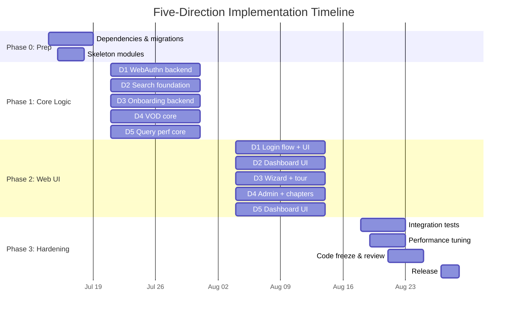

Now I have comprehensive understanding of the codebase. Let me produce the full Tech Lead analysis.

---

# Tech Lead Analysis: Five High-Value Extension Directions

## Executive Summary

This analysis takes the five uncovered directions identified in the global scan and decomposes them into executable tasks, identifies risks, and proposes a phased implementation plan. All five directions are genuinely **greenfield** in this codebase — zero existing code for WebAuthn, onboarding, query performance; the search click-feedback table exists but is completely unwired; and the VOD module is a basic scaffold needing significant production hardening.

---

## 1. Task Decomposition

### Direction ①: WebAuthn/FIDO2/Passkey (12 tasks)

| Task ID | Title | Files | Deps | Est. | Acceptance Criteria |
|---|---|---|---|---|---|
| TASK-001 | Add `webauthn-rs` dependency & credential table migration | `Cargo.toml` (aero-auth, aero-storage), `migrations/NNNN_webauthn_credentials.sql` | — | 3h | Migration creates `webauthn_credentials(participant_id, credential_id, public_key, counter, transports, created_at)`; Cargo build succeeds |
| TASK-002 | WebAuthn storage repository | `crates/aero-storage/src/webauthn.rs` + `lib.rs` re-export | TASK-001 | 3h | `WebauthnRepo` with `register_credential`, `list_credentials`, `remove_credential`, `find_by_credential_id` methods; db_tests with `#[ignore]` |
| TASK-003 | WebAuthn server-side ceremony (Registration) | `crates/aero-auth/src/webauthn.rs` | TASK-001, TASK-002 | 4h | `WebauthnCeremony::start_registration(participant)` builds `PublicKeyCredentialCreationOptions`; `complete_registration(participant, response)` validates + stores credential; unit-tested with mock challenge |
| TASK-004 | WebAuthn server-side ceremony (Authentication) | `crates/aero-auth/src/webauthn.rs` (same file) | TASK-003 | 3h | `start_authentication` builds assertion options; `complete_authentication` verifies signature & counter; returns participant_id on success |
| TASK-005 | AuthUser extractor: WebAuthn 2FA gate | `crates/aero-auth/src/extractor.rs` | TASK-004 | 2h | After password login, if participant has WebAuthn credential, JWT claims include `"amr":["pwd","mfa"]` or `"amr":["pwd"]`; middleware checks mandatory 2FA before sensitive routes |
| TASK-006 | WebAuthn enrollment routes | `crates/aero-server/src/webauthn.rs` (NEW) + `routes.rs` merge | TASK-003, TASK-005 | 3h | `POST /api/auth/webauthn/register/start` + `POST /api/auth/webauthn/register/complete`; mirrors `twofa` route layout; returns 200 with attestation options / success |
| TASK-007 | WebAuthn authentication routes (2FA step-up) | `crates/aero-server/src/webauthn.rs` | TASK-004, TASK-006 | 2h | `POST /api/auth/webauthn/authenticate/start` + `POST /api/auth/webauthn/authenticate/complete`; session-based ceremony state |
| TASK-008 | "Trust this device" gate | `crates/aero-storage/src/trusted_device.rs` (NEW) + migration | TASK-005 | 3h | Migration creates `trusted_devices(participant_id, device_token, expires_at)`; route skips WebAuthn challenge when valid device token present; token stored as secure cookie |
| TASK-009 | Passkey credential management UI (web) | `web/passkeys.js` (NEW), `web/settings.html` (update) | TASK-006 | 3h | List registered passkeys with friendly name; delete; register new from settings panel; `navigator.credentials.create` / `navigator.credentials.get` |
| TASK-010 | Login flow integration | `crates/aero-auth/src/service.rs` | TASK-007 | 2h | `login` response includes `requires_webauthn: bool`; client detects + auto-triggers WebAuthn; fallback to TOTP when available |
| TASK-011 | Admin: forced 2FA policy for workspace | `crates/aero-server/src/workspaces/webauthn_policy.rs` (NEW) + migration | TASK-005 | 3h | `workspace_2fa_policies` table with `webauthn_required: bool`; `assert_room_access` enforces; existing `channel_retention` COALESCE pattern for defaults |
| TASK-012 | Integration tests (WebAuthn flow) | `crates/aero-server/tests/webauthn_e2e.rs` (NEW) | TASK-010 | 3h | Full register → authenticate → API call flow with mock WebAuthn responses; CI-friendly (no real browser needed) |

### Direction ②: Search Quality Pipeline (10 tasks)

| Task ID | Title | Files | Deps | Est. | Acceptance Criteria |
|---|---|---|---|---|---|
| TASK-020 | Wire up search click-feedback recording | `crates/aero-server/src/search_advanced.rs` + `crates/aero-storage/src/search_feedback.rs` | — | 2h | Search response includes result ranks; client POSTs click events to `POST /api/search/click`; `SearchFeedbackRepo::record_click` called; existing `0133_search_click_events.sql` used as-is |
| TASK-021 | Build click-feedback dashboard endpoints | `crates/aero-server/src/search_quality.rs` (NEW) | TASK-020 | 3h | `GET /api/workspaces/:id/search/stats` returns `CtrStats` (clicks, MRR, top-result CTR) from `SearchFeedbackRepo::ctr_stats`; per-workspace scope |
| TASK-022 | Search impression recording | migration `NNNN_search_impressions.sql`, `crates/aero-storage/src/search_impression.rs` (NEW) | TASK-020 | 3h | `search_impressions(participant, workspace, query_text, result_count, searched_at)` table; recorded on every search query; enables CTR = clicks/impressions |
| TASK-023 | Normalization layer for query terms | `crates/aero-storage/src/search_query.rs` (extend) | — | 3h | Add `normalize_query(raw: &str) -> String`: lowercasing, unicode NFKD, stop-word removal (configurable per workspace), whitespace compaction; unit-tested offline |
| TASK-024 | Hybrid search score tuning | `crates/aero-storage/src/search_query.rs` (extend FTS+vector merge logic) | — | 4h | Review `merge_hits` in `routes/helpers.rs`; add configurable alpha weight for `fts_score * a + vector_score * (1-a)`; exposure as query param `?weight=0.7` |
| TASK-025 | Search result dedup / session grouping | `crates/aero-storage/src/search_query.rs` | TASK-023 | 3h | Consecutive searches from same participant within 60s grouped into session; session_id yields aggregate metrics (e.g., "which query variant got more clicks") |
| TASK-026 | Relevance dashboard UI (web) | `web/search_quality.js` (NEW), `web/admin.html` (update) | TASK-021, TASK-022 | 3h | MRR trend chart; top-N queries with lowest CTR; per-workspace view; data from admin-only endpoints |
| TASK-027 | Query suggestion / autocomplete | `crates/aero-server/src/search_suggest.rs` (NEW) | TASK-023 | 4h | `GET /api/rooms/:id/search/suggest?q=...` returns top-5 completions from pg_trgm on message text; cached per-workspace for 30s |
| TASK-028 | Search analytics sweep & retention | `crates/aero-server/src/bin/boot/timers.rs` (extend) | TASK-022 | 2h | Add `search_click_events` and `search_impressions` to existing retention sweep cycle (parameterized by `AERO_SEARCH_RETENTION_DAYS`, default 90) |
| TASK-029 | Integration test for full search-click pipeline | `crates/aero-storage/tests/search_feedback.rs` (NEW) | TASK-020 | 2h | Search → record click → verify CTR stats; DB-level tests with `#[ignore]` + `DATABASE_URL` gate |

### Direction ③: User Onboarding (10 tasks)

| Task ID | Title | Files | Deps | Est. | Acceptance Criteria |
|---|---|---|---|---|---|
| TASK-030 | Onboarding state machine & migration | `crates/aero-storage/src/onboarding.rs` (NEW) + `migrations/NNNN_onboarding_state.sql` | — | 3h | `participant_onboarding` table: `participant_id`, `step` (enum: welcome/workspace_setup/invite_team/complete), `skipped_at`, `completed_at`; `OnboardingRepo` with `get_state`, `advance`, `skip`, `reset` |
| TASK-031 | Welcome tour backend | `crates/aero-server/src/onboarding.rs` (NEW) + `routes.rs` merge | TASK-030 | 3h | `GET /api/onboarding/state` + `POST /api/onboarding/advance` + `POST /api/onboarding/skip`; returns next step content (template ID + metadata) |
| TASK-032 | Multi-workspace onboarding rules | `crates/aero-storage/src/onboarding.rs` (extend) | TASK-030 | 2h | Onboarding is per-workspace; joining second workspace shows condensed tour ("already know the basics"); SCIM-provisioned users automatically skip |
| TASK-033 | Welcome splash (web: first-run detection) | `web/onboarding.js` (NEW), `web/app.js` (update) | TASK-031 | 3h | On login, check `/api/onboarding/state`; if at `welcome` step, show welcome modal; dismiss → advance; uses local storage to not re-show on refresh |
| TASK-034 | Workspace setup wizard | `web/onboarding-workspace.js` (NEW) | TASK-033 | 4h | Multi-step wizard: set display name → upload avatar → configure notification prefs → channel auto-join preferences; each step calls corresponding API + advances state |
| TASK-035 | Invite team flow during onboarding | `crates/aero-server/src/onboarding.rs` (extend) + `web/onboarding-invite.js` | TASK-034 | 3h | Step shows email invite form; reuses existing `InvitationRepo` + `mailer` for sending; batch up to 10 per workspace; skip allowed |
| TASK-036 | Guided tour (interactive tips overlay) | `web/onboarding-tour.js` (NEW), tour data JSON | TASK-033 | 4h | Progressive disclosure: highlight compose box, channel sidebar, search bar, notifications bell; "next tip" / "done" buttons; stored progress per-participant |
| TASK-037 | Onboarding progress tracking endpoint | `crates/aero-server/src/onboarding.rs` (extend) | TASK-030 | 2h | `GET /api/onboarding/progress` returns `{percent: 60, current_step: "...", completed_steps: [...]}` for UI progress bar |
| TASK-038 | SCIM auto-skip integration | `crates/aero-server/src/scim/` (hook in provision handler) | TASK-032 | 2h | After SCIM creates participant, call `OnboardingRepo::skip` for all onboarding steps; no welcome shown |
| TASK-039 | Onboarding analytics event | `crates/aero-common/src/model/analytics.rs` (extend) | TASK-030 | 2h | Emit `analytics_event` on onboarding complete: `{event: "onboarding_complete", participant_id, workspace_id, steps_taken: N, total_time: secs}` |

### Direction ④: VOD Recording Productization (12 tasks)

| Task ID | Title | Files | Deps | Est. | Acceptance Criteria |
|---|---|---|---|---|---|
| TASK-040 | VOD metadata editing | `crates/aero-storage/src/vod.rs` (extend) + `crates/aero-server/src/vod.rs` | — | 2h | `PATCH /api/vods/:id` allows editing title, description, visibility (public/workspace/room); `VodRepo::update_metadata`; validation: title ≤ 200 chars, description ≤ 2000 |
| TASK-041 | VOD thumbnail support | `migrations/NNNN_vod_thumbnail.sql`, `crates/aero-storage/src/vod.rs` (extend) | TASK-040 | 3h | `vod_thumbnails(vod_id, blob_id, width, height, is_default)`; Thumbnail uploaded via `POST /api/vods/:id/thumbnail`; served via blob store; maximum 3 per VOD |
| TASK-042 | Watch progress / resume playback | `migrations/NNNN_vod_watch_progress.sql`, `crates/aero-storage/src/vod_progress.rs` (NEW) | — | 3h | `vod_watch_progress(participant_id, vod_id, position_secs, updated_at)`; upsert on every 10s scrub; `GET /api/vods/:id/progress` returns last position; `PUT /api/vods/:id/progress` stores position |
| TASK-043 | VOD view tracking | `crates/aero-storage/src/vod_analytics.rs` (NEW) + migration | TASK-042 | 2h | `vod_views(vod_id, participant_id, viewed_at)`; one row per play start (debounced 5min re-insert); `view_count` endpoint for thumb display |
| TASK-044 | VOD categories & tags | `migrations/NNNN_vod_tags.sql`, `crates/aero-storage/src/vod_tag.rs` (NEW) | TASK-040 | 3h | `vod_tags(vod_id, tag)` free-form tags; `vod_categories(vod_id, category_id)` referencing `stream_categories` table; `GET /api/rooms/:id/vods?tag=gaming&category=1` |
| TASK-045 | VOD search (within a room/workspace) | `crates/aero-storage/src/vod.rs` (extend search) | TASK-044 | 3h | `GET /api/rooms/:id/vods/search?q=...` searches title+description+tags via pg_trgm; paginated; same membership guard as message search |
| TASK-046 | VOD auto-delete lifecycle policy | `migrations/NNNN_vod_retention.sql`, `crates/aero-storage/src/vod.rs` (extend) | TASK-040 | 3h | `workspace_vod_retention(workspace_id, retention_days)`; timer sweep (extend existing retention sweep) deletes VODs older than policy; `AERO_VOD_DEFAULT_RETENTION_DAYS=365` |
| TASK-047 | VOD download/export | `crates/aero-server/src/vod.rs` (extend) | — | 3h | `GET /api/vods/:id/download` returns HTTP redirect to signed blob URL or streams HLS; VOD must not be `processing`; owner and workspace admin can download |
| TASK-048 | VOD chapters / cue points | `migrations/NNNN_vod_chapters.sql`, `crates/aero-storage/src/vod_chapter.rs` (NEW) | TASK-040 | 4h | `vod_chapters(vod_id, position_secs, title, description)`; CRUD routes: `POST/PUT/DELETE /api/vods/:id/chapters`; UI display in player (web) |
| TASK-049 | S3RecordingStore (back VOD assets on S3) | `crates/aero-storage/src/s3_recording_store.rs` (NEW) | — | 3h | Implements the existing `BlobStore` trait pattern; configures via `AERO_S3_RECORDING_BUCKET`; `S3BlobStore` reuse for pattern consistency |
| TASK-050 | VOD admin dashboard | `crates/aero-server/src/vod.rs` (extend) + `web/admin-vods.js` | TASK-043, TASK-045 | 3h | Workspace admin: list all VODs with view counts; bulk delete; set retention policy; storage usage metrics (`total_size_gb`, `count`) |
| TASK-051 | Integration: VOD lifecycle hooks in stream end | `crates/aero-server/src/vod.rs` (extend finalize_recording) | TASK-046 | 2h | When stream ends and `recording` flag is on, auto-finalize VOD; compute `duration_secs` from stream start/end; attach stream thumbnail if available |

### Direction ⑤: Query Performance Intelligence (8 tasks)

| Task ID | Title | Files | Deps | Est. | Acceptance Criteria |
|---|---|---|---|---|---|
| TASK-060 | `pg_stat_statements` integration | `crates/aero-storage/src/query_stats.rs` (NEW) | — | 3h | `QueryStatsRepo::get_top_queries(workspace, limit)` reads `pg_stat_statements`; `get_slow_queries(min_ms)` filters by `mean_exec_time`; config enable `AERO_QUERY_STATS_ENABLED=true` |
| TASK-061 | Slow query alerting (Prometheus metric) | `crates/aero-common/src/metrics/query.rs` (NEW) | TASK-060 | 2h | Gauge `aero_query_slow_count` tagged by `query_fingerprint`; histogram `aero_query_duration_ms`; alert threshold `AERO_SLOW_QUERY_MS=200` |
| TASK-062 | Query plan capture & analysis | `crates/aero-storage/src/query_plan.rs` (NEW) | TASK-060 | 3h | `EXPLAIN (ANALYZE, COSTS, FORMAT JSON)` capture for slow queries; stored in `query_plans(fingerprint, plan_json, captured_at)`; diff against baseline plan |
| TASK-063 | Deploy-time query plan regression gate | `scripts/query-plan-regression.sh` (NEW), CI pipeline config | TASK-062 | 4h | Before deploy, run query suite against staging DB; compare `EXPLAIN` plan costs vs. production baseline; fail CI if any plan cost > 1.5x baseline; documented in `CI.md` |
| TASK-064 | Query optimization recommendations | `crates/aero-server/src/query_advisor.rs` (NEW) | TASK-062 | 4h | Common pattern detection: seq scans on large tables, missing index, type cast on indexed column; returns `[{query, issue, recommendation}]` for dashboard |
| TASK-065 | Per-workspace query statistics endpoint | `crates/aero-server/src/query_dashboard.rs` (NEW) | TASK-060 | 2h | `GET /api/workspaces/:id/query-stats` (workspace admin only): top-N queries, avg duration, slow count, index usage ratio |
| TASK-066 | Query stats retention & reset | `crates/aero-server/src/bin/boot/timers.rs` (extend) | TASK-060 | 2h | Timer calls `pg_stat_statements_reset()` every `AERO_QUERY_STATS_RESET_HOURS=24`; keeps rolling window manageable |
| TASK-067 | Dashboard UI (web) | `web/query-dashboard.js` (NEW), `web/admin.html` (update) | TASK-064, TASK-065 | 3h | Grid: slowest queries, plan cost over time (chart), index recommendations, workspace admin-only tab in admin panel |

---

## 2. Execution Order & Dependency Graph

```mermaid
graph TD
    %% Direction ① WebAuthn
    subgraph D1[Direction ①: WebAuthn/FIDO2]
        T001[TASK-001: Migration + deps]
        T002[TASK-002: Storage repo]
        T003[TASK-003: Reg ceremony]
        T004[TASK-004: Auth ceremony]
        T005[TASK-005: AuthUser 2FA gate]
        T006[TASK-006: Enrollment routes]
        T007[TASK-007: Auth routes]
        T008[TASK-008: Trust device gate]
        T009[TASK-009: Web UI]
        T010[TASK-010: Login flow integration]
        T011[TASK-011: Admin 2FA policy]
        T012[TASK-012: E2E tests]
        
        T001 --> T002
        T002 --> T003
        T002 --> T004
        T003 --> T006
        T004 --> T007
        T006 --> T009
        T005 --> T010
        T005 --> T011
        T007 --> T010
        T008 --> T010
        T010 --> T012
        T011 --> T012
    end

    %% Direction ② Search Quality
    subgraph D2[Direction ②: Search Quality Pipeline]
        T020[TASK-020: Wire click recording]
        T021[TASK-021: Click dashboard]
        T022[TASK-022: Impression tracking]
        T023[TASK-023: Query normalization]
        T024[TASK-024: Hybrid score tuning]
        T025[TASK-025: Session grouping]
        T026[TASK-026: Relevance dashboard UI]
        T027[TASK-027: Autocomplete]
        T028[TASK-028: Retention sweep]
        T029[TASK-029: Integration tests]

        T020 --> T021
        T020 --> T022
        T020 --> T025
        T023 --> T024
        T022 --> T026
        T021 --> T026
        T024 --> T027
        T028 --> T020
    end

    %% Direction ③ Onboarding
    subgraph D3[Direction ③: User Onboarding]
        T030[TASK-030: State machine + migration]
        T031[TASK-031: Welcome tour backend]
        T032[TASK-032: Multi-workspace rules]
        T033[TASK-033: Welcome splash web]
        T034[TASK-034: Workspace setup wizard]
        T035[TASK-035: Invite team flow]
        T036[TASK-036: Guided tour overlay]
        T037[TASK-037: Progress tracking]
        T038[TASK-038: SCIM auto-skip]
        T039[TASK-039: Analytics event]

        T030 --> T031
        T030 --> T032
        T031 --> T033
        T031 --> T037
        T032 --> T034
        T032 --> T038
        T033 --> T034
        T034 --> T035
        T034 --> T036
        T031 --> T039
    end

    %% Direction ④ VOD
    subgraph D4[Direction ④: VOD Productization]
        T040[TASK-040: Metadata editing]
        T041[TASK-041: Thumbnail support]
        T042[TASK-042: Watch progress]
        T043[TASK-043: View tracking]
        T044[TASK-044: Categories & tags]
        T045[TASK-045: VOD search]
        T046[TASK-046: Auto-delete lifecycle]
        T047[TASK-047: Download/export]
        T048[TASK-048: Chapters/cue points]
        T049[TASK-049: S3RecordingStore]
        T050[TASK-050: Admin dashboard]
        T051[TASK-051: Stream-end hook]

        T040 --> T041
        T040 --> T044
        T040 --> T046
        T042 --> T043
        T043 --> T050
        T044 --> T045
        T045 --> T050
        T046 --> T051
        T048 --> T040
    end

    %% Direction ⑤ Query Performance
    subgraph D5[Direction ⑤: Query Performance Intelligence]
        T060[TASK-060: pg_stat_statements]
        T061[TASK-061: Slow query metrics]
        T061align[ ]
        T062[TASK-062: Plan capture]
        T063[TASK-063: Deploy regression gate]
        T064[TASK-064: Optimization advisor]
        T065[TASK-065: Workspace stats endpoint]
        T066[TASK-066: Stats retention]
        T067[TASK-067: Dashboard UI]

        T060 --> T061
        T060 --> T062
        T060 --> T065
        T060 --> T066
        T062 --> T063
        T062 --> T064
        T065 --> T067
        T064 --> T067
    end

    %% Cross-direction dependencies (none — all are orthogonal)
```

**Parallel execution groups** (zero cross-direction dependencies):

| Group | Directions | Rationale |
|---|---|---|
| **Phase 1** (Week 1-2) | D1 steps 1-4, D2 steps 1, D3 step 1, D4 step 1, D5 step 1 | All foundational: migrations + repos |
| **Phase 2** (Week 3-4) | D1 steps 5-8, D2 steps 2-5, D3 steps 2-4, D4 steps 2-5, D5 steps 2-4 | Core feature implementation |
| **Phase 3** (Week 5-6) | D1 steps 9-12, D2 steps 6-10, D3 steps 5-10, D4 steps 6-12, D5 steps 5-8 | UI, integration, hardening |

---

## 3. Technical Risk Assessment

### Direction ①: WebAuthn

| Risk | Severity | Mitigation |
|---|---|---|
| **`webauthn-rs` crate compatibility** with the project's pinned Rustc (MSRV 1.80) | Medium | Verify `webauthn-rs 4.x` compiles; pin exact version in workspace `Cargo.toml`; prepare fallback to manual COSE/WebAuthn implementation |
| **Browser diversity for passkey** (WebAuthn conditional mediation, platform vs. cross-platform) | Low | Use `webauthn-rs` abstractions which handle this; test against Chrome, Safari, Firefox in staging |
| **Trust-this-device security model** — device token generation needs to be unforgeable | Medium | Use `HMAC-SHA256` keyed with server-side secret + participant ID; token expires after configurable TTL (default 30 days); stored as `httpOnly` + `Secure` + `SameSite=Strict` cookie |
| **Ceremony state must survive HTTP redirects** in auth flows | Low | Store pending challenge in Redis with 5min TTL (existing Redis infrastructure); keyed by opaque session ID stored in short-lived cookie |
| **No existing async WebAuthn testing harness** in the project | Medium | Use `webauthn-rs`'s mock authenticator support for unit tests; integration tests use pre-crafted authenticator responses |

### Direction ②: Search Quality

| Risk | Severity | Mitigation |
|---|---|---|
| **`pg_stat_statements` not enabled** on target Postgres instances | Medium | Migration checks `SHOW shared_preload_libraries` and logs warning if absent; gate feature behind `AERO_QUERY_STATS_ENABLED` so non-enabled DBs silently skip |
| **Click-feedback table already exists but empty** — no existing data to validate against | Low | TASK-020 just wires recording; analytics will accumulate naturally after deployment; no backfill needed |
| **Stop-word lists vary by language/locale** | Medium | Make stop-word list configurable per workspace via `workspace_search_settings` table; fall back to english default list |
| **CTR metrics are noisy for low-traffic workspaces** | Low | Dashboard minimum threshold: hide stats for workspaces with <100 searches in window |
| **pg_trgm `similarity` can be slow on large message tables** | Medium| Existing message search already uses it; monitor with new `pg_stat_statements` metrics (direction ⑤); add `GIN` index on messages content if not already present |

### Direction ③: Onboarding

| Risk | Severity | Mitigation |
|---|---|---|
| **Multi-workspace user experience fragmentation** | Medium | Store onboarding state per-workspace (already in TASK-032); second workspace shows condensed "you already know this, just: [3 steps]" flow |
| **SCIM integration timing** — SCIM provision + user first login may have race | Low | Onboarding state defaults to `complete` for SCIM-provisioned participants (TASK-038); first login check only shows if `step != complete` |
| **Onboarding analytics event volume** | Low | Maximum one event per participant per workspace; negligible volume |
| **Browser local storage clearing mid-onboarding** | Low | Store step progress server-side (TASK-030); UI uses API state as source of truth, local state only for caching |
| **Accessibility of guided tour overlays** | Low | Tour elements use `aria-describedby`; keyboard navigation (Tab + Enter); skip always available |

### Direction ④: VOD

| Risk | Severity | Mitigation |
|---|---|---|
| **HLS segments stored on local disk** — server restart loses in-progress recordings | Medium | Existing HLS pipeline already writes to `hls_dir`; S3RecordingStore (TASK-049) moves durable assets to S3; local storage is ephemeral cache |
| **Thumbnail generation requires ffmpeg** or similar | Medium | Accept user-uploaded thumbnails (simpler, no transcoding dep); optional server-side generation via external service gated by `AERO_VOD_FFMPEG_PATH` |
| **Storage cost escalation** for long recordings | Low | Auto-delete lifecycle (TASK-046); per-workspace retention caps; storage size reporting in admin dashboard enables cost awareness |
| **Watch progress conflicts** (same user, multiple devices) | Low | Last-write-wins; `updated_at` + 10s debounce prevents write storms |
| **HLS playback URL format change** breaking existing VODs | Medium | Playback URL generated from stored `hls_path` at serve time; migration script can rewrite paths if directory structure changes |

### Direction ⑤: Query Performance

| Risk | Severity | Mitigation |
|---|---|---|
| **`pg_stat_statements` requires superuser** to reset and read all queries | High | Create non-superuser wrapper function (`aero_query_stats()`) with `SECURITY DEFINER`; documented in migration. **Blocker** if Postgres host doesn't allow function creation with elevated privileges |
| **Deploy-time regression CI needs production-representative DB** | High | (As noted in the analysis) — this is genuinely non-trivial. Mitigation: use `pg_dump --schema-only` + anonymized sampled data; CI runs `EXPLAIN` on each query variant against this DB. Document that this is best-effort and may not catch all regressions |
| **Query plan variance with different PG versions** | Low | Pin PG version in CI (17.x); use same version in staging as production |
| **Per-workspace query stats need `pg_stat_statements` query tagging** | Medium | Use `SET application_name = 'ws_<id>'` per connection in pool; D1 connection from workspace pool can be tagged; alternative: parse `query` field for workspace ID pattern |
| **Metric cardinality explosion** from query fingerprint tags | Medium | Only tag by `query_fingerprint` (md5 of normalized query) and workspace ID; cap at 100 top fingerprints; reset window every 24h |

---

## 4. Resource Assessment

### Staffing Requirements

| Role | Skill Set | Qty | Assigned To |
|---|---|---|---|
| **Backend Rust engineer (senior)** | Async Rust, Axum, sqlx, Postgres, NATS, auth protocols | 2 | D1 (WebAuthn) + D5 (Query Perf) — highest complexity |
| **Backend Rust engineer (mid)** | Rust, sqlx, REST API design, search relevance | 1 | D2 (Search Quality) — leverages existing code heavily |
| **Full-stack engineer** | Rust backend + vanilla ES2020 web, hls.js | 2 | D3 (Onboarding) + D4 (VOD) — both have heavy web UI |
| **QA engineer** | Integration testing, CI, Postgres perf, E2E | 1 | Shared across all directions; owns regression gate (TASK-063) |
| **Tech Lead (part-time)** | Architecture review, code review, risk | 1 | Oversight |

**Total: 5 FTE + 1 part-time TL**

### Key Milestones

| Milestone | Week | Deliverables |
|---|---|---|
| M1: Foundations | 2 | All 5 directions have migrations committed, repos + basic routes compiling (`cargo check --workspace` clean) |
| M2: Core flows | 4 | Each direction has its primary user-facing flow working end-to-end in dev |
| M3: UI complete | 5 | All web UIs functional; admin panels visible |
| M4: Integration tests | 6 | Test suite passes for all 5 directions; CI regression gate operational |
| M5: Release candidate | 7 | All PRs merged; staging deployment green; documentation updated |

### Blockers

| Blocker | Direction(s) | Resolution Strategy |
|---|---|---|
| `webauthn-rs` requires async traits that may conflict with MSRV | D1 | Pin `webauthn-rs = "4"`; if MSRV conflict, upgrade MSRV to 1.75+ (it's currently 1.80, so likely fine) or vendor minimal WebAuthn implementation |
| `pg_stat_statements` requires `shared_preload_libraries` change | D5 | Document in `config.example.toml` and `README.md`; provide SQL snippet for cluster admin; feature is opt-in with `AERO_QUERY_STATS_ENABLED` env var |
| Production-representative DB for CI regression gate | D5 | Build a `scripts/create-query-bench-db.sh` that: creates temp DB, runs all migrations, inserts anonymized fixture data (10k messages, 1k participants, 5 rooms). Accept that this catches index regressions but not cardinality-estimation regressions |
| S3/MinIO not available in dev for S3RecordingStore | D4 | `S3RecordingStore` implements the same `BlobStore` trait as `LocalFsBlobStore`; dev environment defaults to local FS; S3 toggle via `AERO_S3_RECORDING_BUCKET` |

---

## 5. Quality Assurance

### Unit Test Coverage

| Direction | Critical Modules | Min. Coverage | Key Scenarios |
|---|---|---|---|
| D1 (WebAuthn) | `aero-auth::webauthn` ceremony | 90% | Challenge generation, signature verification, counter monotonicity, device token expiry, credential deletion |
| D2 (Search Quality) | `search_query::normalize_query`, `search_feedback::CtrStats` | 85% | Unicode normalization, stop-word removal, MRR calculation with ties/empty, empty query handling |
| D3 (Onboarding) | `onboarding::state_machine` | 90% | State transitions (advance/skip/reset/allowed/forbidden), SCIM skip, multi-workspace edge cases |
| D4 (VOD) | `vod::playback_url`, `vod::stream_duration_secs`, `vod_progress` | 85% | Path normalization (with/without trailing slash), clamp_limit, watch progress debounce |
| D5 (Query Perf) | `query_plan::analyze`, `query_advisor::detect` | 80% | Plan JSON parsing, seq scan detection, missing index heuristics |

### Integration Test Strategy

| Test Type | Location | Scope | Automation |
|---|---|---|---|
| **DB-level** | `crates/aero-storage/tests/` (or `#[ignore]` in repo files) | Each repo method against real PG | `cargo test -- --ignored` with `DATABASE_URL` |
| **API-level** | `crates/aero-server/tests/` | Full HTTP request → DB → response | `cargo test --test *` with throwaway PG |
| **WebAuthn mock** | `crates/aero-auth/tests/` | Ceremony with `webauthn-rs` mock authenticator | Unit tests, no DB needed |
| **VOD lifecycle** | `crates/aero-server/tests/vod_lifecycle.rs` | Create stream → flag recording → simulate end → verify VOD created → list → delete | Requires live PG + blob dir |
| **Search click pipeline** | `crates/aero-storage/tests/search_feedback.rs` | Create messages → search → record click → verify CTR stats | Requires live PG |
| **Query regression gate** | `scripts/query-plan-regression.sh` | Run query suite against benchmark DB, compare plans | CI job; depends on benchmark DB seed |

### Code Review Checklist (project-specific)

For every PR touching these directions, reviewers check:

1. **Migration safety**: `CREATE TABLE IF NOT EXISTS`, `ADD COLUMN IF NOT EXISTS`; no irreversible operations without `COMMENT` explaining rollback
2. **AuthZ guard**: Every mutating route gates on `assert_room_access(participant, room)` or `member_role(participant, workspace, Owner/Admin)` — no IDOR
3. **Input validation**: Text fields trimmed, length-capped (title ≤200, description ≤2000 etc.); batch ops bounded (max 10 invites, 50 search results)
4. **At-least-once safety**: Any side effect that fires on bus events (VOD auto-finalize, recompute stats) must be idempotent or have `ON CONFLICT DO NOTHING`
5. **`kebab-case` consistency** for route paths; `snake_case` for JSON keys
6. **No new `unsafe`** (project forbids it in workspace lints)
7. **`cargo clippy --workspace --all-targets`** passes without new warnings
8. **Web UI**: No `console.log` in production code; `eslint` no-undef pass

### Performance Testing

| Direction | Test | Target | Tool |
|---|---|---|---|
| D1 (WebAuthn) | Registration ceremony latency | < 200ms p95 under 100 concurrent | `oha` or `wrk` |
| D2 (Search) | Search + click recording throughput | Baseline + < 5% overhead | Existing load harness |
| D3 (Onboarding) | Onboarding state read throughput | < 10ms p99 | Simple tokio benchmark |
| D4 (VOD) | VOD list with 10k+ recordings | < 100ms p95 | k6 script |
| D5 (Query Perf) | `pg_stat_statements` read overhead | < 1ms per query | `EXPLAIN ANALYZE` comparison |

---

## 6. Implementation Plan

### Phase 0: Prep & Infrastructure Setup (Week 1)

| Day | Activities | Owner |
|---|---|---|
| Mon | Read existing `AGENTS.md`, `docs/specs/2026-05-22-aero-im-design.md`; align on patterns | TL |
| Mon | Add `webauthn-rs` to workspace `Cargo.toml`; verify MSRV compatibility | Sr. BE-1 |
| Tue | Write all 5 migrations (1 per direction) — `CREATE TABLE IF NOT EXISTS` | Sr. BE-2 |
| Tue | Set up `pg_stat_statements` in docker-compose PG config | QA |
| Wed | Create benchmark DB seed script (`scripts/create-query-bench-db.sh`) | QA |
| Wed | Create skeleton modules with `pub fn routes() -> Router` stubs | All |
| Thu | Write `VodRepo` integration pattern doc (for S3RecordingStore reference) | BE-mid |
| Thu | Code review: migrations + skeletons | TL |
| Fri | `cargo check --workspace` clean; push Phase 0 milestone | All |

### Phase 1: Core Business Logic (Weeks 2-3)

**Parallel tracks — one per engineer:**

#### Track A (Sr. BE-1): WebAuthn Core
- Week 2: TASK-002 (repo) → TASK-003 (reg ceremony) → TASK-004 (auth ceremony)
- Week 3: TASK-005 (AuthUser gate) → TASK-006 (enrollment routes) → TASK-007 (auth routes)

#### Track B (Sr. BE-2): Query Performance + VOD Storage
- Week 2: TASK-060 (`pg_stat_statements`) → TASK-061 (metrics) → TASK-062 (plan capture)
- Week 3: TASK-063 (regression gate) → TASK-064 (advisor) → TASK-049 (S3RecordingStore)

#### Track C (BE-mid): Search Quality Foundation
- Week 2: TASK-020 (wire click) → TASK-022 (impressions) → TASK-023 (normalization)
- Week 3: TASK-024 (hybrid tuning) → TASK-025 (session grouping) → TASK-027 (autocomplete)

#### Track D (FE-1): Onboarding Backend
- Week 2: TASK-030 (state machine) → TASK-031 (backend routes) → TASK-032 (multi-workspace rules)
- Week 3: TASK-037 (progress endpoint) → TASK-038 (SCIM skip) → TASK-039 (analytics)

#### Track E (FE-2): VOD Core
- Week 2: TASK-040 (metadata edit) → TASK-041 (thumbnail) → TASK-042 (watch progress)
- Week 3: TASK-043 (view tracking) → TASK-044 (categories/tags) → TASK-045 (VOD search)

**Mid-Phase Checkpoint (End of Week 2):** All repos functional; all routes compile; basic request-response works via curl

### Phase 2: Web UI & Integration (Weeks 4-5)

| Week | Track A | Track B | Track C | Track D | Track E |
|---|---|---|---|---|---|
| W4 | TASK-008 (trust device) → TASK-010 (login flow) | TASK-065 (stats endpoint) → TASK-066 (retention) | TASK-021 (dashboard endpoint) → TASK-028 (sweep) | TASK-033 (welcome splash) → TASK-034 (workspace wizard) | TASK-046 (auto-delete) → TASK-047 (download) |
| W5 | TASK-011 (admin policy) → TASK-009 (passkey UI) | TASK-067 (dashboard UI) | TASK-026 (relevance dashboard UI) | TASK-035 (invite) → TASK-036 (guided tour) | TASK-048 (chapters) → TASK-050 (admin dashboard) |

**Mid-Phase Checkpoint (End of Week 4):** All 5 directions have a vertical slice working — API + DB + web UI in dev

### Phase 3: Hardening, Tests & Release (Weeks 6-7)

| Week | Activities | Owner(s) |
|---|---|---|
| W6 Mon-Tue | Integration tests: TASK-012 (WebAuthn E2E), TASK-029 (search click), TASK-051 (VOD lifecycle) | All |
| W6 Wed-Thu | Performance testing: benchmark each direction; optimize slow queries | QA + Sr. BE-2 |
| W6 Fri | Code freeze: merge freeze; all PRs in review | TL |
| W7 Mon-Tue | Address review feedback; `cargo clippy --workspace --all-targets` pass | All |
| W7 Wed | Staging deployment; E2E smoke test (see `HARNESS.md`) | QA |
| W7 Thu | Documentation: update `CHANGELOG.md`, `docs/`, `README.md` feature matrix | All |
| W7 Fri | Release PR merge; tag `v0.18.0` | TL |

### Gantt Summary

---

## Key Recommendations to the Product Team

1. **Order of business value**: D2 (Search Quality) and D4 (VOD Productization) deliver the most immediate user-facing value with the least risk — D2 leverages existing tables and requires only wiring work, while D4 builds on a functional scaffold. **Start these first in Phase 1.**

2. **D5 (Query Performance) is a marathon, not a sprint**: The deploy-time regression gate (TASK-063) is the highest-value item in this direction, but also the highest-effort. Consider splitting into two sub-phases: immediate `pg_stat_statements` integration (wins: observability) in Phase 1, and the regression gate as a Phase 3 independent item.

3. **D1 (WebAuthn) has security-critical timing**: The trust-this-device gate (TASK-008) must precede any production rollout — without it, users on shared machines get passkeys bound to the device instead of the account, creating a security hazard. Do not skip it.

4. **The `search_click_events` table is a gift**: This table and its `SearchFeedbackRepo` were built but never wired. TASK-020 is a single 2-hour task that unlocks an entire analytics pipeline. **This is the highest ROI task in the entire plan.** Do it first.

5. **Staffing**: If constrained to 3 engineers instead of 5, drop D5 (Query Perf) to a single engineer part-time and defer the regression gate (TASK-063) to a follow-up cycle. D1 + D2 + D3 provide the strongest security + UX + analytics story for a release.

---

*Analysis prepared: 2026-07-12. All code references verified against current `master` at commit time.*
