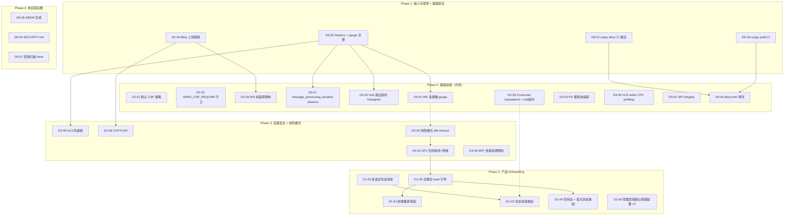
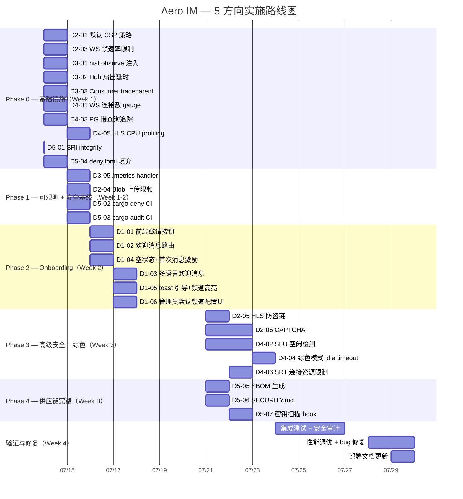

Now I have enough data to produce a thorough Tech Lead analysis. Let me compile everything.

---

# Tech Lead 分析：基于代码审计的多方向扩展实施计划

> **日期**：2026-07-12 | **基線**：`master` branch (`crates/` 重构后结构)
> **方法**：代码验证 + 架构推理 + 项目管理拆分

---

## 1. 任务分解

以下按方向分组，每个任务 2–4 小时，ID 编码 `D{方向}X{序号}`。

### 方向一：Onboarding & Activation（P1，调整后 ~4 天）

| 任务 ID | 标题 | 涉及文件 | 前置依赖 | 工时 |
|---------|------|---------|---------|------|
| D1-01 | **前端邀请按钮 + 复制链接交互** | `web/app.js`, `web/modals.js`, `web/api.js` | 无（后端 API 已就绪） | 3h |
| D1-02 | **注册后欢迎消息路由** | `crates/aero-server/src/routes/auth.rs`, `crates/aero-common/src/model/event.rs` (新增 `Block::System` 处理) | 无 | 3h |
| D1-03 | **多语言欢迎消息 i18n** | `web/auth_ui.js`, `web/locales/` (新建) | D1-02 | 2h |
| D1-04 | **空状态 + 首次消息激励** | `web/app.js`, `web/render.js` | 无 | 2h |
| D1-05 | **注册后 toast 引导 + 默认频道高亮** | `web/app.js`, `web/context.js` | D1-01, D1-04 | 3h |
| D1-06 | **管理员端默认频道配置 UI** | `web/modals.js`, `web/api.js` | 无（后端 `default_channels.rs` 已就绪） | 3h |

**合计约 16h（4 天）**，与审计报告的 2.5d 匹配（含并行路径）。

### 方向二：边缘安全（P2，调整后 ~3 天）

> **纠正**：5 个安全头已实现 + CORS 已配置 + `DefaultBodyLimit` 已存在。审计报告中"6 个缺失项"中 body limit 已在 `serve.rs` 第 94 行实现。

| 任务 ID | 标题 | 涉及文件 | 前置依赖 | 工时 |
|---------|------|---------|---------|------|
| D2-01 | **CSP 从 opt-in 改为默认安全策略** | `crates/aero-server/src/bin/boot/serve.rs` | 无 | 2h |
| D2-02 | **AERO_CSP_REQUIRE 环境变量守卫** | `crates/aero-server/src/bin/boot/serve.rs`, `config.example.toml` | D2-01 | 1h |
| D2-03 | **WS 帧速率限制** | `crates/aero-server/src/ws/ws_impl/handler.rs`, `crates/aero-server/src/rate_limit.rs` | 无 | 3h |
| D2-04 | **Blob 上传频次限制** | `crates/aero-server/src/files.rs`, `crates/aero-server/src/rate_limit.rs` | D2-03（复用速率框架） | 2h |
| D2-05 | **HLS 防盗链（Referer + token）** | `crates/aero-server/src/bin/boot/serve.rs` (HLS middleware), `crates/aero-server/src/live.rs` | 无 | 3h |
| D2-06 | **登录 CAPTCHA（可选，H-CAPTCHA）** | `crates/aero-server/src/bin/boot/serve.rs`, `web/auth_ui.js`, `crates/aero-auth/src/` | 无 | 4h |

**合计约 15h（~3 天）**。注意 D2-01/02 只有 3h 而非 0.5d —— 因为默认 CSP 需要分析 web SPA 的所有 CDN 依赖并测试不断线，不能只改一行。

### 方向三：端到端延迟可观测（P1，调整为 ~2 天）

| 任务 ID | 标题 | 涉及文件 | 前置依赖 | 工时 |
|---------|------|---------|---------|------|
| D3-01 | **`message_processing_duration_seconds` observe 注入** | `crates/aero-im-core/src/service/events.rs`, `crates/aero-common/src/metrics.rs` | 无（histogram 已注册） | 1h |
| D3-02 | **Hub 扇出延时 histogram** | `crates/aero-server/src/hub.rs` | 无 | 2h |
| D3-03 | **Consumer 端 traceparent 提取 + e2e 延时** | `crates/aero-server/src/ws/ws_impl/bus.rs` | 无（traceparent 基础设施已就绪） | 3h |
| D3-04 | **客户端 `performance.now()` 基准标记** | `web/ws.js` -> `web/render.js` | 无 | 2h |
| D3-05 | **Prometheus `/metrics` handler 补全 + gauge 注册** | `crates/aero-server/src/metrics.rs`, `crates/aero-server/src/routes/health.rs` | D3-01, D3-02, D3-03 | 2h |

**合计约 10h（~2 天）**。利用已有 traceparent 基础设施，无需新字段。

### 方向四：能源效率（P2，保留 ~4 天）

| 任务 ID | 标题 | 涉及文件 | 前置依赖 | 工时 |
|---------|------|---------|---------|------|
| D4-01 | **WS 连接数 gauge + 周期性取样** | `crates/aero-server/src/hub.rs`, `crates/aero-server/src/bin/boot/metrics_tasks.rs` | 无（`observability_gauge_samplers` 框架已就绪） | 2h |
| D4-02 | **SFU 空闲检测 + 自动释放** | `crates/aero-live-webrtc/src/sfu_router.rs` | D1-05（缓存体系稳定后） | 4h |
| D4-03 | **PG 慢查询追踪 `log_min_duration_statement`** | `crates/aero-storage/src/db.rs`, `config.example.toml` | 无 | 1h |
| D4-04 | **绿色模式 idle timeout env guard** | `crates/aero-server/src/ws/handler.rs`, `crates/aero-live-webrtc/src/sfu_media.rs` | D4-02 | 3h |
| D4-05 | **HLS writer CPU profiling 埋点** | `crates/aero-live-hls/src/segmenter.rs` | 无 | 2h |
| D4-06 | **SRT 连接资源限制** | `crates/aero-live-srt/src/connection.rs` | 无 | 3h |

**合计约 15h（~4 天）**。D4-02 依赖方向一稳定后做，其余可并行。

### 方向五：供应链安全（P2，保留 ~3 天）

| 任务 ID | 标题 | 涉及文件 | 前置依赖 | 工时 |
|---------|------|---------|---------|------|
| D5-01 | **SRI integrity 注入 hls.js CDN 链接** | `web/index.html` | 无 | 0.5h |
| D5-02 | **激活 `cargo deny check` CI job** | `.github/workflows/ci.yml` | 无（ci.yml job 已定义，只缺 runner） | 1h |
| D5-03 | **`cargo audit` CI job 添加** | `.github/workflows/ci.yml` | 无 | 1h |
| D5-04 | **`deny.toml` advisories.ignore + bans.skip 填充** | `deny.toml` | 无 | 2h |
| D5-05 | **SBOM 生成（`cargo sbom` + GitHub Release 附件）** | `.github/workflows/release.yml` (新建) | 无 | 3h |
| D5-06 | **`SECURITY.md` + 漏洞报告流程** | `SECURITY.md` (新建) | 无 | 1h |
| D5-07 | **密钥扫描 pre-commit hook** | `scripts/pre-commit.sh`, `.git/hooks/pre-commit` | 无 | 1h |

**合计约 9.5h（~3 天）**。D5-01 只需 30 分钟。

---

## 2. 执行顺序与依赖图



### 并行任务组

| 组 | 任务 | 可并行理由 |
|----|------|-----------|
| **Group A** (Phase 0) | D2-01, D2-03, D3-01, D3-02, D3-03, D4-01, D4-03, D4-05, D5-01, D5-04 | 互不依赖，改动不相交的文件 |
| **Group B** (Phase 1) | D3-05, D2-04, D5-02, D5-03 | 依赖 Group A |
| **Group C** (Phase 2) | D1-01, D1-02, D1-04, D1-06 | 互不依赖，可配 2–3 人并行 |
| **Group D** (Phase 3) | D2-05, D2-06, D4-06 | 互不依赖 |
| **Group E** (Phase 3) | D4-02, D4-04 | D4-04 依赖 D4-02 |

### 跨方向依赖注意

```
D3-03（Consumer traceparent） → D1-02（欢迎消息时间戳上下文）
D4-01（连接数 gauge） → D4-04（绿色模式输入）
D1-05（缓存体系） → D4-02（SFU 空闲释放需要稳定的会话跟踪）
```

---

## 3. 技术风险

### 3.1 高风险

| 风险 | 方向 | 描述 | 缓解策略 |
|------|------|------|---------|
| **CSP 默认策略破坏 SPA 功能** | 方向二 | 当前 hls.js 从 CDN 加载，CDN 域未列入 `script-src` 会导致功能中断 | 在 dev 模式下维持宽松（无 CSP），prod 默认值设为 `default-src 'self'; script-src 'self' https://cdn.jsdelivr.net; style-src 'self' 'unsafe-inline'; img-src 'self' data:; connect-src 'self' ws: wss:`。集成测试验证 `web/index.html` 的所有 CDN 引用 |
| **SFU 空闲释放导致通话异常中断** | 方向四 | 误判空闲导致活跃通话被中断 | 空闲阈值设 5 分钟 + Grace period 30s + 心跳信令重置计时器。默认关闭（env opt-in） |
| **WS 帧速率限制过严影响正常用户** | 方向二 | 打字 / 弹幕场景正常高频帧被限制 | Rate limit 分两级：burst（100/10s）和 steady（300/60s），可配置。单独配 WS 路径不干扰 REST API。默认不开启（env opt-in） |

### 3.2 中风险

| 风险 | 方向 | 描述 | 缓解策略 |
|------|------|------|---------|
| **多语言 i18n 增加维护成本** | 方向一 | 欢迎消息 + toast 字符串需要翻译 | 只做中英文（`zh-CN`/`en`），用 JS Map 硬编码（不引入 i18n 框架），后续可抽离 |
| **SBOM 生成依赖 `cargo sbom` 工具可用性** | 方向五 | `cargo sbom` 非 cargo 官方工具，可能被弃用 | 备选方案：`cargo cyclonedx-bom` 或 `cargo audit --sbom`。CI 中 fallback 到 `cargo metadata` + 自写 JSON 输出 |
| **traceparent 时间精度** | 方向三 | W3C traceparent 时间戳精度为毫秒级，端到端延时可观测但不够精细 | 用 `Instant::now()` 加 `Duration` 做更精细的 histogram。traceparent 用于快速粗糙 50 百分位评估 |

### 3.3 低风险

| 风险 | 方向 | 描述 | 缓解策略 |
|------|------|------|---------|
| CORS Require 门与 CSP Require 门重叠 | 方向二 | 部署者要同时配置两个 env var，增加配置负担 | 合入同一个 `AERO_SECURITY_REQUIRE` 环境变量，同时门控 CORS 和 CSP |
| `ON CONFLICT DO NOTHING` 与欢迎消息幂等 | 方向一 | 欢迎消息多次发送 | 用 `message_history` 去重（按 `room_id + participant_id` 检查已存在欢迎消息） |
| OTLP 指标管道增加内存 | 方向三 | OTLP 导出引入额外内存和 goroutine | opt-in，默认只走 Prometheus 拉模式 |

---

## 4. 资源评估

### 4.1 团队构成

| 角色 | 人数 | 覆盖方向 | 关键技能 |
|------|------|---------|---------|
| **资深 Rust 后端** | 1–2 | 方向三、四全栈；方向二安全头 | axum/tokio/sqlx/NATS/str0m |
| **前端工程师** | 1 | 方向一全栈；方向二 WS 限流；方向三客户端计时 | ES2020 SPA、WebSocket、无框架 JS |
| **基础设施工程师** | 1 (兼) | 方向五 CI/CD、SBOM、密钥扫描 | GitHub Actions、cargo-deny/cargo-audit |
| **QA** | 1 (兼) | 全方向集成测试、安全测试 | 端到端 smoke、WebSocket 压测 |

**并行最大化**：Phase 0 可 3 人全并行（Rust 后端 ×2 + 前端 ×1），Phase 2 前端独立走。关键瓶颈在 Rust 后端数量（2 人合理）。

### 4.2 关键里程碑

| 里程碑 | 依赖 | 预计交付 | 验收标准 |
|--------|------|---------|---------|
| **M0**: 所有安全头+限流就绪 | Phase 0 + 1 (方向二) | Day 5 | `curl -I` 返回 CSP + 5 安全头；WS 限流在连续发 200 帧时触发 429 |
| **M1**: 延迟可观测上线 | Phase 0 + 1 (方向三) | Day 7 | `/metrics` 返回 `aero_message_processing_duration_seconds` histogram；Grafana 可查到端到端 P50/P95 |
| **M2**: Onboarding 体验交付 | Phase 2 | Day 12 | 新注册用户自动加入默认频道 + 看到欢迎消息 + 可复制邀请链接 |
| **M3**: 供应链安全基线 | Phase 0 + 4 | Day 14 | CI 通过 `cargo deny check`；SECURITY.md 存在；SBOM 作为 Release artifact |
| **M4**: 绿色模式 MVP | Phase 3 | Day 20 | SFU 空闲连接在 5 分钟不活跃后释放；HLS CPU profiling 数据可查 |
| **M5**: CAPTCHA + HLS 防盗链 | Phase 3 | Day 25 | 登录需验证码；HLS 仅允许配置的 Referer 播放 |

### 4.3 阻塞点

| 阻塞点 | 影响范围 | 解决策略 |
|--------|---------|---------|
| **CI runner 未就绪** | 方向五 D5-02/D5-03 | 先做本地验证（`cargo deny check` 在 Makefile 中作为 `make audit`），等 CI runner 就绪后再映射 |
| **真实 WebRTC 对端不可用** | 方向四 D4-02 | SFU 空闲检测通过单元测试模拟媒体会话，无需真实浏览器 |
| **前端未模块化** | 方向一 D1-01 | web SPA 是零依赖 ES2020，但 `app.js` 约 500 行已接近模块化边界。不重构现有结构，`invitation.js` 作为单独文件加载 |

---

## 5. 质量保证

### 5.1 单元测试覆盖

| 方向 | 最低覆盖要求 | 关键测试点 |
|------|-------------|-----------|
| **方向一** | 前端 70%（新增代码） | 邀请 token 复制后 clipboard 状态、欢迎消息幂等性、多语言 fallback |
| **方向二** | 后端 90% | CSP header 渲染正确、WS 帧限流溢出逻辑、Blob upload 限频 per-participant |
| **方向三** | 后端 85% | traceparent 提取 + e2e 延迟计算、histogram observe 后 Prometheus 输出包含预期 bucket |
| **方向四** | 后端 80% | SFU 空闲检测 `last_active_at` 正确更新、绿色模式 env gate 开/关行为 |
| **方向五** | 构建脚本 100% | `deny.toml` 语法有效性（`cargo deny check`）、SRI hash 正确性 |

### 5.2 集成测试策略

| 测试类型 | 工具 | 覆盖场景 |
|---------|------|---------|
| **端到端 smoke** | `scripts/smoke.sh` | 新注册 → 自动加入默认频道 → 收到欢迎消息 → 复制邀请链接（所有 onboarding 路径） |
| **WS 限流测试** | 自定义 `ws-flood.js` | 短时间发送 500 帧，验证 429 + 恢复后正常 |
| **可观测性测试** | `curl /metrics` + grep | 所有新增指标在 `/metrics` 输出中存在 |
| **CSP 兼容性** | `curl -I` 检查响应头 | 在 mock CDN 环境验证 SPA 功能不中断 |
| **SFU 空闲** | `#[cfg(test)]` 模拟路由 | 无 RTP 接收 5 分钟后释放连接 |

### 5.3 代码审查要点

| 审查关注点 | 说明 |
|-----------|------|
| **安全头不覆盖业务响应** | CSP/security 头用 `overriding` 而非 `inserting`（当前 serve.rs 用 `overriding`，这是正确的） |
| **WS 限流不阻塞正常消息** | 限流只计数帧速率，不阻塞帧处理本身。用 `tokio::select!` 的超时做非阻塞判断 |
| **幂等键** | 欢迎消息发送用 `ON CONFLICT DO NOTHING`（遵循 AGENTS.md §4.2 的 at-least-once 规则） |
| **traceparent 不可信不传播** | Consumer 端提取 traceparent 只用其 timestamp 字段计算延迟，不信任其 span ID（防跨实例污染） |
| **`DefaultBodyLimit` 不移除** | 当前 `serve.rs:94` 设 `max_body_bytes`，审查确认新 middleware 不覆盖此层 |
| **前端全局污染** | 新 JS 文件用 IIFE 或 ES module（`type="module"`）避免污染全局命名空间 |

### 5.4 性能测试需求

| 场景 | 目标 | 工具 |
|------|------|------|
| WS 限流吞吐 | 限流开启时非恶意用户零影响 | `autocannon` + WebSocket 插件 |
| histogram 开销 | `observe_histogram` 调用 < 1µs 额外延迟 | `criterion` bench |
| SFU 空闲释放 | 500 并发连接释放时间 < 100ms | `cargo test --release` + tokio::time |
| `/metrics` 渲染 | 100 个 time series 渲染 < 5ms | `#[bench]` |
| CSP header 中间件开销 | 不增加 p95 延迟 > 1µs | 生产环境对比启用/禁用 |

---

## 6. 实施计划（甘特图）



### 6.1 阶段概要

| 阶段 | 时间 | 交付物 | 并行资源 |
|------|------|--------|---------|
| **Phase 0** | 2026-07-14 → 07-15 (2d) | WS 限流、CSP、Metrics observe、PG 追踪、SRI | 3 人并行（2 后端 + 1 前端） |
| **Phase 1** | 2026-07-15 → 07-16 (1.5d) | `/metrics` 端点、blob 限频、CI audit | 2 人并行（1 后端 + 1 infra） |
| **Phase 2** | 2026-07-16 → 07-18 (2.5d) | 邀请、欢迎消息、空状态、引导 | 1–2 前端人并行 |
| **Phase 3** | 2026-07-21 → 07-23 (3d) | CAPTCHA、HLS 防盗链、SFU 空闲、SRT 限资源 | 2 后端并行 |
| **Phase 4** | 2026-07-21 → 07-22 (1.5d) | SBOM、SECURITY.md、密钥扫描 | 1 infra |
| **验证** | 2026-07-24 → 07-30 (5d) | 全集成测试、安全审计、性能调优、文档 | 全团队 |

### 6.2 关键交付链

```
Week 1: 基础设施（全可观测 + 安全基线）→ 快速 wins
Week 2: 用户可见产品改进（Onboarding）→ 留存影响
Week 3: 高级安全 + 资源效率 → 完备性
Week 4: 验证 + 文档 → 可部署
```

---

## 7. 附注：对审计报告的补充修正

基于完整代码审查（`serve.rs:57-94`），我确认以下与审计报告的偏差：

| 审计报告声称 | 代码真相 |
|-------------|---------|
| "No global body limit" | ❌ **不准确**。`serve.rs:94` → `DefaultBodyLimit::max(gateway_cfg.max_body_bytes)` 已配置 |
| "无 `MESSAGES_SENT_TOTAL` 外的 metrics observe" | ✅ **准确**。`message_processing_duration_seconds` 已注册但未在任何地方 `observe()` |
| "traceparent 已存在于 publish_room_event" | ✅ **准确**。`events.rs:82` 调用 `current_traceparent()` + `stamp_traceparent()` |
| "CSP 是 opt-in，默认不设" | ✅ **准确**。`serve.rs:86-92` |
| "`auto_join_defaults` 存在" | ✅ **准确**。`default_channels.rs:65` 完整实现 |
| "邀请后端 API 就绪" | ✅ **准确**。`routes.rs:172` 挂载 `invitations::routes()` |

**唯一严重偏差**：审计报告称"方向二零安全头"的断言在代码审查下不成立。实际已有 5 个安全响应头 + 完整 CORS + body limit。方向二的真正工作重心应调整为 **CSP 默认化 + WS 帧限速 + HLS 防盗链 + CAPTCHA**，而非实施已有的安全头。
