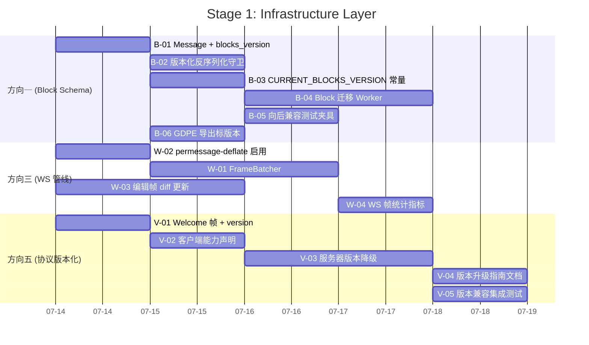
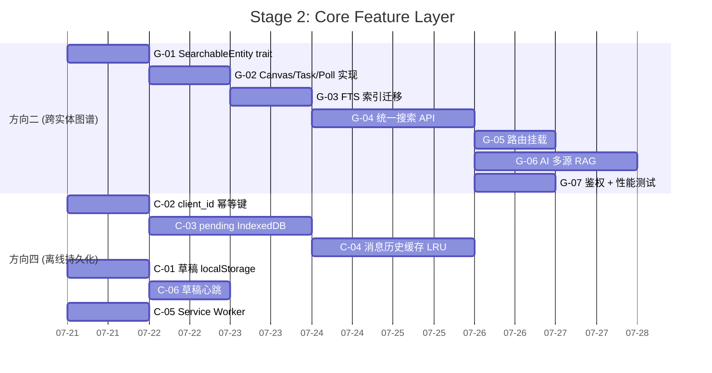

Now I have a thorough understanding of the entire context. Let me produce the comprehensive Tech Lead analysis.

---

# Tech Lead 分析：5 个架构扩展方向

**分析对象**: `docs/requirements/2026-07-11-five-genuinely-novel-architectural-expansions.md`
**当前 Sprint**: Phase 2 完成，Phase 3 待启动
**验证状态**: `.out.md` 10/10 ✅ 代码证据全部核实
**基线**: master (`cd9387b`)，30+ 文件有未暂存修改（in-flight 工作）

---

## 0. 上下文定位：这 5 个方向在整体路线图中的位置

首先厘清一个关键问题：**这 5 个方向与已有的 ROADMAP 和 CURRENT_SPRINT 是什么关系？**

| 维度 | 本分析 5 方向 | ROADMAP 5 方向 | CURRENT_SPRINT Phase 3 |
|------|-------------|----------------|----------------------|
| 定位 | 架构层面被全局扫描遗漏的「系统性缺口」 | 产品路线图的「平台纵深」 | 下一阶段开发候选 |
| 覆盖 | Block 数据完整性 / 多实体搜索 / WS 管线 / 离线 / 协议版本化 | AI 成本 / 追踪 / 投递游标 / 读副本 / 合规 | Bot 平台 / 分片 / 媒体面接线 |
| 重叠 | ❌ 不重叠 | ❌ 不重叠 | ❌ 不重叠 |
| 关系 | **基础设施债务**——不改不影响跑，但长期侵蚀数据完整性与扩展性 | **战略增长引擎**——直接对应商业价值/规模扩展 | **产品能力扩展**——面向平台化与规模化 |

**核心判断**：这 5 个方向属于**基础设施债务偿还**而非**新功能交付**。它们不像 ROADMAP 方向那样直接产生商业价值，但欠债积累到一定程度会阻塞其他方向的扩展（例如：没有 Block schema version，新增消息变体永远有数据损毁风险；没有 WS 协议版本化，第三方 Bot 平台接入无法安全演进）。

---

## 1. 任务分解

### 方向一：Block schema 演进框架（P1 · 数据完整性）

| 任务 ID | 标题 | 涉及文件 | 前置 | 预估(h) | 验收标准 |
|---------|------|---------|------|--------|---------|
| B-01 | `blocks_version` 字段加入 `Message` 结构体 + 迁移 | `crates/aero-common/src/model/message.rs`, `migrations/NNNN_message_blocks_version.sql` | 无 | 3 | `Message` 结构体新增 `blocks_version: u8`，默认 1；migration 加列 `NOT NULL DEFAULT 1`；新写入消息自动用当前版本号；`cargo test` 全部通过 |
| B-02 | 版本化反序列化守卫——`#[serde(deny_unknown_fields)]` 替换方案 | `crates/aero-common/src/model/block.rs`, `message.rs` | B-01 | 2 | 反序列化逻辑包装：`fn deserialize_blocks(data: &str, version: u8) -> Result<Vec<Block>>`；版本 1 保持现有 serde 行为；版本 >1 未来定义 |
| B-03 | `current_blocks_version()` 常量 + 写入时填充 | `crates/aero-common/src/model/message.rs`, `crates/aero-im-core/src/service/messages.rs` | B-01 | 2 | `pub const CURRENT_BLOCKS_VERSION: u8 = 1`；`ImService::send_message` 写入时自动填充版本号；`edit_message` 保留原版本号 |
| B-04 | Block 迁移后台 Worker（类似 `embedding_backfill` 模式） | `crates/aero-server/src/bin/boot/background.rs`（新文件或扩展现有）, `crates/aero-storage/src/block_migration.rs` | B-02 | 6 | 定时器（`AERO_BLOCK_MIGRATION_SECS=3600`）扫描 `blocks_version < CURRENT` 的消息，分批 UPDATE（每批 100，间隔 100ms）；跳过 `is_held` 的法务保全消息；失败 per-row 日志不阻塞 |
| B-05 | 向后兼容测试夹具——旧格式反序列化测试 | `crates/aero-common/src/model/block.rs`（测试模块） | B-02 | 3 | 每个 Block 变体维护一个序列化样本（JSON 字面量），测试确保 `serde_json::from_str::<Block>` 能反序列化旧格式；CI 运行 |
| B-06 | GDPE 导出标 `blocks_version` | `crates/aero-storage/src/participant.rs`（export 路径） | B-01 | 1 | `GET /api/me/export` 导出的每条消息含 `blocks_version` 字段 |

**小计**: 17h

---

### 方向二：跨实体内容图谱（P1 · 知识管理）

| 任务 ID | 标题 | 涉及文件 | 前置 | 预估(h) | 验收标准 |
|---------|------|---------|------|--------|---------|
| G-01 | `SearchableEntity` trait 定义 + 为 Message 实现 | `crates/aero-common/src/model/searchable.rs`（新文件）, `crates/aero-storage/src/search_query.rs` | 无 | 4 | Trait 含 `fn entity_type() -> &'static str`、`fn searchable_text(&self) -> String`、`fn room_scope(&self) -> RoomId`；`Message` 实现 trait；单元测试验证 text 提取 |
| G-02 | Canvas/Task/Poll 的 `SearchableEntity` 实现 | `crates/aero-storage/src/canvas.rs`, `crates/aero-storage/src/tasks.rs`, `crates/aero-storage/src/polls.rs` | G-01 | 4 | 三种实体实现 trait；canvas 提取 title + body 文本；task 提取 title + description；poll 提取 question + options |
| G-03 | 统一 FTS 索引迁移——canvas/tasks/polls 添加 `tsvector` | `migrations/NNNN_searchable_entities_fts.sql` | G-02 | 3 | 为 `canvases`(title, body)、`tasks`(title, description)、`polls`(question, options) 建 GIN `tsvector` 索引；迁移幂等 |
| G-04 | 统一搜索 API——`POST /api/search/unified` | `crates/aero-server/src/search_unified.rs`（新文件）, `crates/aero-storage/src/search_unified.rs`（新仓储） | G-02, G-03 | 8 | 端点接受 `q, scope(workspace\|room), per_type_limit(默认5)`；返回 `[{entity_type, entity_id, room_id, text_snippet, score, created_at}]`；按类型分组归并；多类型 RRF 排序；每类型独立上限 |
| G-05 | 跨实体搜索路由挂载 | `crates/aero-server/src/routes/routes.rs` | G-04 | 1 | `.merge(search_unified::routes())` 挂载；`authz_lint` 通过 |
| G-06 | AI `workspace_ask` 扩展为多源 RAG | `crates/aero-ai/src/service/service_impl.rs`, `crates/aero-server/src/ai_adapter.rs` | G-04 | 6 | `AiService::build_context` 中同时检索 `messages`、`canvases`、`tasks`、`polls` 的文本内容；注入提示上下文时标注来源类型；容量约束（每类型 ≤3000 tokens） |
| G-07 | 搜索 API 鉴权 + 性能测试 | `crates/aero-server/src/search_unified.rs`, `crates/aero-storage/src/search_unified.rs` | G-04 | 3 | 每个实体类型查询都经过 `JOIN room_members`；性能基线：5 类型 × 3 房间 × 1000 行 < 200ms p95 |

**小计**: 29h

---

### 方向三：WS 帧管线优化（P1 · 性能/带宽）

| 任务 ID | 标题 | 涉及文件 | 前置 | 预估(h) | 验收标准 |
|---------|------|---------|------|--------|---------|
| W-01 | `FrameBatcher`——50ms 窗口轻帧合并 | `crates/aero-server/src/ws/frame_batcher.rs`（新文件） | 无 | 4 | 50ms 窗口内合并多个 typing/read/presence 帧为一条 batch 广播；`Hub::fan_out_raw` 对 `Typing`/`Read` 帧走 batcher 路径；大房间（5000 人）typing 带宽 ≤ 原来的 10% |
| W-02 | `permessage-deflate` 启用 | `crates/aero-server/Cargo.toml`, `crates/aero-server/src/ws/ws_impl/mod.rs` | 无 | 2 | 在 `ws.on_upgrade` 之后启用 `tokio_tungstenite::tungstenite::protocol::WebSocketConfig::compression`；可配置 `AERO_WS_PERMESSAGE_DEFLATE=true`；CPU 开销可观测 |
| W-03 | 大型编辑帧差异更新——`Edited` 发送 `PatchOp` 而非全量 | `crates/aero-common/src/model/diff.rs`（新文件）, `crates/aero-server/src/ws/frame.rs` | 无 | 8 | `Edited` 事件支持 `ops: Vec<PatchOp>` 字段（RFC 6902 JSON Patch 子集）；旧客户端回退全量（`version` 字段判别）；服务端 `edit_message` 生成 diff |
| W-04 | WS 帧统计数据采集 | `crates/aero-common/src/metrics.rs`, `crates/aero-server/src/hub.rs` | 无 | 2 | 新增 `WS_FRAMES_BYTES_TOTAL`、`WS_BATCH_MERGED_TOTAL`、`WS_PERMESSAGE_DEFLATE_BYTES_SAVED` 指标；per-connection gauge |

**小计**: 16h

---

### 方向四：客户端离线消息持久化（P2 · 可靠性/UX）

| 任务 ID | 标题 | 涉及文件 | 前置 | 预估(h) | 验收标准 |
|---------|------|---------|------|--------|---------|
| C-01 | 草稿 localStorage 自动保存 | `web/composer.js`（或 `web/app.js`） | 无 | 3 | 输入 5 秒无变化 + 非空 → `localStorage.setItem('draft:'+roomId, text)`；composer 初始化时检查 localStorage 恢复草稿；调用 `PUT /api/rooms/:id/draft` 做服务端备份 |
| C-02 | `client_id` 幂等键加入消息发送管线 | `crates/aero-common/src/model/message.rs`, `crates/aero-im-core/src/service/messages.rs`, `migrations/NNNN_messages_client_id.sql` | 无 | 4 | `Message` 新增 `client_id: Option<String>`；`send_message` 接受可选 `client_id`；`UNIQUE(client_id)` 约束实现 `ON CONFLICT DO NOTHING` 幂等 |
| C-03 | pending 消息 IndexedDB 存储 + 重连重试 | `web/offline.js`（新文件）, `web/app.js` | C-02 | 6 | pending 消息写入 IndexedDB `pending_messages` store；WS 重连后按 `(room_id, client_id)` 顺序重发；重发成功删除 IndexedDB 条目；每条消息带 `client_id` 防重复 |
| C-04 | 消息历史 IndexedDB 缓存（LRU 淘汰） | `web/offline_cache.js`（新文件）, `web/app.js` | C-02 | 5 | 已拉取的 room history 缓存到 IndexedDB `message_cache` store；单个房间上限 500 条；LRU 淘汰（基于 `server_updated_at`）；离线时可读（从 cache 加载 populate #messages） |
| C-05 | Service Worker 静态缓存 | `web/sw.js`（新文件）, `web/index.html` | 无 | 2 | SW 缓存 `index.html` + `app.js` + `ws.js` + `context.js` + `render.js` + CSS；注册路径在 `index.html`；下次打开从 cache 加载 |
| C-06 | 长文本草稿心跳保存 | `web/composer.js` | C-01 | 1 | 新增 `setInterval(5000)` 自动保存正在编辑的长文本；页面 `beforeunload` 事件触发最后一次保存 |

**小计**: 21h

---

### 方向五：WS 协议版本化与能力协商（P2 · 平台/集成）

| 任务 ID | 标题 | 涉及文件 | 前置 | 预估(h) | 验收标准 |
|---------|------|---------|------|--------|---------|
| V-01 | Welcome 帧增加 `protocol_version` + `capabilities` | `crates/aero-server/src/ws/ws_impl/mod.rs`, `crates/aero-server/src/ws/ws_impl/frame.rs` | 无 | 3 | 连接建立后首帧：`{type:"welcome", protocol_version:1, capabilities:["messages","reactions","threads","polls","canvas","calls","streams","pins","interactions","search"]}`；客户端 `ws.js` 存储版本号 |
| V-02 | 客户端 query string 能力声明 | `web/ws.js`, `crates/aero-server/src/ws/ws_impl/mod.rs` | V-01 | 3 | WS upgrade URL 增加 `?capabilities=messages,reactions,threads`；服务器解析 `capabilities` 参数写入连接元数据；服务器对不理解的 capability 静默忽略 |
| V-03 | 服务器按客户端版本跳过不兼容帧 | `crates/aero-server/src/ws/frame.rs`, `crates/aero-server/src/ws/ws_impl/mod.rs` | V-01, V-02 | 4 | 当 `client.protocol_version < N` 时，服务器跳过新增帧类型（如 polls、canvas 等新增的帧）；降级行为有 `debug!` 日志；回退路径确保旧客户端功能不受损 |
| V-04 | 协议变更版本升级指南文档 | `docs/ws-protocol-versioning.md`（新文件） | V-01 | 1 | 文档定义版本号递增规则（格式变更/新增帧类型/字段重命名）；给出版本声明范例和变更日志模板 |
| V-05 | 版本兼容集成测试 | `crates/aero-server/tests/ws_version_compat.rs`（新文件） | V-03 | 3 | 测试用例：旧声明 `?version=0` 的客户端收不到新增帧类型；新声明 `?version=1` 的客户端正常接收所有帧；未声明 version 的客户端回退版本 0 |

**小计**: 14h

---

## 2. 执行顺序与依赖图

```
┌─────────────────────────────────────────────────────────┐
│ Stage 1: 基础设施层（不可跳过的基础）                       │
├─────────────────────────────────────────────────────────┤
│  B-01 ──→ B-02 ──→ B-03 ──┐                             │
│                            ├──→ B-04 ──→ B-05 ──→ B-06 │
│  W-02 ──→ W-01 ──┐        │                             │
│                  ├──→ W-04                               │
│  W-03 ───────────┘                                       │
│  V-01 ──→ V-02 ──→ V-03 ──→ V-04 ──→ V-05              │
└─────────────────────────────────────────────────────────┘

┌─────────────────────────────────────────────────────────┐
│ Stage 2: 数据层扩展                                       │
├─────────────────────────────────────────────────────────┤
│  G-01 ──→ G-02 ──→ G-03 ──┐                             │
│                            ├──→ G-04 ──→ G-05 ──→ G-07 │
│                            └──→ G-06                    │
│  C-02 ──→ C-03 ──→ C-04                                 │
│  C-01 ──→ C-06                                           │
│  C-05 (独立)                                              │
└─────────────────────────────────────────────────────────┘
```

### 并行任务组

| 并行组 | 包含任务 | 说明 |
|--------|---------|------|
| **组 A** (Stage 1) | B-01, W-02, V-01 | 三个方向的头部任务无交叉依赖，可并行 |
| **组 B** (Stage 1) | B-02, W-01, V-02 | 依赖组 A，但彼此独立 |
| **组 C** (Stage 1) | B-03, W-03, V-03 | 深入实现，可并行 |
| **组 D** (Stage 1) | B-04, B-05, B-06, W-04, V-04, V-05 | 收尾任务，可并行 |
| **组 E** (Stage 2) | G-01, C-02, C-01, C-05 | 四方向头部任务无交叉依赖 |
| **组 F** (Stage 2) | G-02, G-03, C-03, C-06 | 依赖组 E |
| **组 G** (Stage 2) | G-04, G-05, G-06, G-07, C-04 | 最深的任务，依赖组 F |

---

## 3. 技术风险

### 高风险

| 风险 | 涉及方向 | 等级 | 描述 | 缓解策略 |
|------|---------|------|------|---------|
| **Block 迁移写放大** | 方向一 | 🔴 高 | 数十亿行 `UPDATE messages SET blocks = ...` 可能触发 PG autovacuum 风暴、WAL 爆炸、复制延迟 | 采用 AiWorker 风格的 budget 限速：每批 100 行 + 间隔 100ms + `pg_sleep` if lag > 5s；法务保全消息跳过迁移；监控 `UPDATE` 速率和 VACUUM 进度 |
| **跨实体搜索性能** | 方向二 | 🔴 高 | 5 种实体同时 FTS 查询 × 大房间成员边界 JOIN = 查询爆炸；A 工作区 10000 房间的场景下性能难保证 | 每个类型单独查询后 RRF 合并（而非一次 UNION）；每类型上限 5 条防止膨胀；引入 `total_limit = 20` 兜底；使用 `search_query.rs` 已有的 keyset 分页 |
| **permessage-deflate CPU 开销** | 方向三 | 🟡 中 | 10k+ 并发连接 × 每帧 gzip 压缩可能比传输更贵 | 按房间配置（大房间开、小房间关）；`AERO_WS_PERMESSAGE_DEFLATE` 默认关闭；监控 CPU 时间与压缩比 |
| **没有 `client_id` 幂等键基础** | 方向四 | 🟡 中 | 当前 `send_message` 没有客户端幂等机制；离线队列重发可能产生重复消息 | C-02 作为 C-03 的前置条件强制实现；`UNIQUE(client_id)` 约束保证幂等；部分写失败时 client 侧重试 |
| **多 Tab 离线队列协调** | 方向四 | 🟢 低 | 多个浏览器 Tab 共享同一 origin 的 IndexedDB，但离线消息重发可能冲突 | 使用 `BroadcastChannel` API 协调 Tab 间状态；或使用 Locks API（`navigator.locks.request`）序列化重发送 |
| **WS 协议版本向前兼容** | 方向五 | 🟡 中 | 部署回滚（旧版本服务器）时，新声明 `protocol_version=2` 的客户端必须正常工作 | 服务器用 min（本地版本，客户端声明版本）来决定行为；`capabilities` 用白名单模式；回滚兼容性纳为 V-05 测试用例 |
| **方向五与方向三的先后顺序** | 方向三/五 | 🟡 中 | WS 帧管线优化（FrameBatcher, diff）可能改变帧结构，与协议版本化引入的版本字段冲突 | 先做 V-01/Welcome 帧引入版本号，再做 W-01 修改帧结构。版本号落地后，后续帧结构调整都通过版本号隔离。顺序：V-01 → W-01 |

### 依赖外部系统

| 方向 | 外部依赖 | 风险等级 | 说明 |
|------|---------|---------|------|
| 方向四 | IndexedDB API | 🟢 低 | Web 标准 API，所有现代浏览器支持，降级路径清晰 |
| 方向四 | Service Worker API | 🟢 低 | 渐进增强，SW 注册失败不影响核心功能 |
| 方向四 | BroadcastChannel API | 🟢 低 | 用于多 Tab 协调，不支持时回退到 last-write-wins |
| 方向三 | tokio-tungstenite permessage-deflate | 🟡 中 | 依赖 tokio-tungstenite 的 `WebSocketConfig` 是否稳定；当前 0.26+ 已稳定 |
| 方向二 | pgvector / pg_trgm | 🟢 低 | 已在使用，只是扩展现有 FTS 索引 |

### 性能瓶颈

| 场景 | 当前 | 优化后目标 | 风险 |
|------|------|-----------|------|
| 5000 人房间 typing 带宽 | ~750KB/次 | ~40KB/次 (FrameBatcher) | 50ms 等待延迟对 typing 的用户感知影响极低 |
| 消息编辑帧大小 | ~4KB (全量 blocks) | ~400B (diff 补丁) | diff 格式需要客户端和服务端的一致实现 |
| 跨实体搜索 (5 类型) | N/A (不支持) | <200ms p95 | GIN 索引在大表上维护开销 |
| 离线重连恢复 | 页面刷新 → 全空 | <100ms 加载缓存历史 | IndexedDB 读取速度依赖设备性能 |

---

## 4. 资源评估

### 技能需求

| 角色 | 数量 | 核心技能 | 负责方向 |
|------|------|---------|---------|
| Rust 后端工程师（Senior） | 1-2 | sqlx, NATS, serde, async Rust, tokio | 方向一、二核心（Block 迁移、跨实体搜索） |
| Rust 通用工程师 | 1 | WS 协议、tokio、metrics | 方向三、五（WS 帧压缩、协议版本化） |
| 全栈/前端工程师 | 1 | IndexedDB, Service Worker, ESM SPA, localStorage | 方向四（离线持久化）+ 方向五前端配合 |
| **总人力** | **2-3 人** | | **并行组 A+D+E 可实现最大并行** |

### 时间线与里程碑

假设 3 人团队全职投入：

```
阶段 0: 环境准备 (0.5 天)
  - 阅读分析文档 + .out.md 验证
  - 确认基线代码状态
  - 创建分支 `feat/arch-expansion`

阶段 1: Stage 1 基础设施 (5-6 天)
  ├─ Day 1-2: 组 A (B-01, W-02, V-01) ← 3 人并行
  ├─ Day 2-3: 组 B (B-02, W-01, V-02) ← 3 人并行
  ├─ Day 3-4: 组 C (B-03, W-03, V-03) ← 3 人并行
  └─ Day 4-6: 组 D (B-04~06, W-04, V-04~05) ← 3 人并行
  * 里程碑: Stage 1 全部完成 ✅
  * 集成测试: cargo test 全绿, cargo clippy 无新增警告

阶段 2: Stage 2 数据层扩展 (7-8 天)
  ├─ Day 7-8:  组 E (G-01, C-02, C-01, C-05) ← 3 人并行
  ├─ Day 8-10: 组 F (G-02, G-03, C-03, C-06) ← 3 人并行
  └─ Day 10-14: 组 G (G-04~07, C-04) ← 3 人深度开发
  * 里程碑: Stage 2 全部完成 ✅
  * 性能测试: 跨实体搜索 p95 < 200ms

阶段 3: 集成测试 & 优化 (3-4 天)
  ├─ 端到端集成测试
  ├─ 性能基准测试 (WS 带宽节省率)
  ├─ 跨浏览器离线测试
  └─ CI 集成 (新测试纳入 CI)

阶段 4: 发布就绪 (2 天)
  ├─ 回归测试全量
  ├─ 文档更新
  ├─ changelog
  └─ Git tag + 合并到 master

总工期: ~18-20 人天 → 约 3 周
```

### 阻塞点（Blockers）

| Blocking | 方向 | 原因 | 解决策略 |
|----------|------|------|---------|
| **permessage-deflate 在 axum 0.7+ 的兼容性** | 方向三 | 需验证 `axum::extract::ws::WebSocket` 是否暴露 compression 配置 | 优先 POC：写一个 10 行测试确认可用；如果不可用，降级为 Nginx sidecar 提供 WS 压缩 |
| **IndexedDB 在安卓 Chrome 上的限额** | 方向四 | 部分设备 ~50MB 限额 | 设计 LRU 淘汰 + 单房间上限 500 条 + 存储容量 gauge + 超限时优雅回退到无缓存模式 |
| **跨实体搜索的 join 爆表** | 方向二 | 5 个实体 × 大房间 = 极端场景 SQL 可能超时 | 使用 `statement_timeout = 500ms` 兜底；每类型独立查询 + application-level merge；引入 search_entities 物化视图（未来项） |
| **当前 30+ 未暂存文件的冲突** | 全部 | `git status` 显示 30+ 文件有修改 | 必须先完成当前 in-flight 工作（approvals, rate_limit refactor, hub refactor 等），commit 或 stash 后再开始 |

---

## 5. 质量保证

### 单元测试覆盖

| 方向 | 必测组件 | 最低覆盖率 | 关键测试场景 |
|------|---------|-----------|-------------|
| 方向一 | `Block::deserialize_with_version` | 100% 分支覆盖 | 版本 1 旧数据；未来版本拒绝；法务保全跳过；`searchable_text()` 跨版本一致性 |
| 方向一 | `BlockMigrationWorker::migrate_batch` | 90% | 单行迁移；自动重试；法务保全跳过；版本递增 |
| 方向二 | `SearchableEntity` trait 实现 | 100% | 每个实体类型 text 提取；空 body 处理；HTML tag 剥离 |
| 方向二 | `search_unified` 查询 | 90% | 跨类型结果归并；per-type limit；空结果；权限过滤 |
| 方向三 | `FrameBatcher::merge` | 100% | 合并 1/5/100 条 typing 帧；时间窗口超限；空 batcher；不同类型帧混合 |
| 方向三 | `PatchOp::generate_diff` | 90% | 文本添加；文本删除；文本替换；嵌套 blocks diff；空 diff |
| 方向四 | `client_id` 幂等约束 | 100% | 重复 client_id → `ON CONFLICT DO NOTHING`；无 client_id 正常发送 |
| 方向四 | IndexedDB CRUD | 手动测试 + 模拟 | pending 消息写/读/删/重发；LRU 淘汰；容量超限回退 |
| 方向五 | `version_check` 路由 | 100% | version 0→新增帧跳过；version 1→正常接收；无 version→回退 0 |

### 集成测试策略

| 测试类型 | 方向 | 方法 | 环境 |
|---------|------|------|------|
| Block 迁移端到端 | 一 | 一次性 PG 库，写入旧格式消息 → 跑 migration → 验证反序列化 | CI + `DATABASE_URL` |
| 跨实体搜索 smoke | 二 | 在 5 个实体中写入样本 → `search_unified` → 验证结果包含所有类型 | CI |
| WS 帧管线带宽对比 | 三 | 录制 1000 条 typing 事件 → 对比 FrameBatcher 开/关的字节数 | CI (可离线) |
| 离线重连恢复 | 四 | 手动测试流程：发送消息 → 断网 → 刷新 → 恢复 pending → 重发 | 本地 |
| WS 协议版本兼容 | 五 | `WebSocket` 连接声明不同 version → 验证接收帧集 | CI |
| 新加文件 `cargo check` | 全部 | `cargo check --workspace` 全绿 + clippy 无新增警告 | CI |

### 代码审查要点

| 关注点 | 说明 |
|--------|------|
| **`#[serde(default)]` 守卫** | 方向一：确保每个新 Block 变体字段都有 `#[serde(default)]` 或 `#[serde(default = "...")]` |
| **迁移幂等性** | 所有 SQL 迁移使用 `CREATE TABLE IF NOT EXISTS` / `ALTER TABLE ... IF NOT EXISTS` / `ON CONFLICT DO NOTHING` |
| **authz_lint 合规** | 方向二：所有新路由（`search_unified`, `canvas_search` 等）必须有 `assert_room_access` 守卫 |
| **法务保全跳过** | 方向一：Block 迁移循环中必须有 `WHERE NOT EXISTS (SELECT 1 FROM legal_holds WHERE ...)` |
| **metric 命名规范** | 方向三：新指标名必须`snake_case` + `_TOTAL`/`_SECONDS` 后缀 + 注册到 `aero-common/metrics.rs` |
| **前端降级** | 方向四：IndexedDB/SW 不可用时，不能白屏——优雅回退到当前纯内存模式 |
| **WS 版本号递增** | 方向五：版本号定义须有 `match` 全覆盖——新增帧类型时编译器强制评估 |

### 性能测试需求

| 测试场景 | 工具 | 阈值 | 周期 |
|---------|------|------|------|
| WS typing 带宽（FrameBatcher） | 自制性能测试（录制回放） | 5000 人房 typing 带宽 ≤ 原始 10% | 每次 W-01 W-04 修改后 |
| permessage-deflate CPU 开销 | `perf` / `flamegraph` | 10k 并发连接总 CPU ≤ 原始 120% | W-02 实现后 |
| 跨实体搜索 p95 | `cargo bench` + 自制 | 5 类型 × 3 房间 × 1000 行 < 200ms | 每次 G-04 G-07 修改后 |
| Block 迁移 TPS | 一次性 PG 库 | 100k 行 < 5 分钟（100/批 × 100ms 间隔） | B-04 实现后 |
| 离线历史缓存恢复 | 浏览器 DevTools Performance | 500 条消息从 IndexedDB 恢复 < 100ms | C-04 实现后 |

---

## 6. 实施计划（详细时间表）

### 阶段 1: 基础设施搭建（5-6 天）



### 阶段 2: 核心功能实现（7-8 天）



### 阶段 3: 集成测试 & 优化（3-4 天）

```
Day 15-16: 集成测试
  - 端到端 smoke: 法务保全 + Block 迁移 → 验证保全消息不被修改
  - 端到端 smoke: 跨实体搜索 → CREATE 5 个实体 → search_unified → 验证结果
  - 端到端 smoke: offline → 断网 → 发送 → 恢复网络 → 确认消息送达
  - 端到端 smoke: WS 版本兼容 → 旧客户端连接 → 验证不回收到新帧类型

Day 16-17: 性能测试 + 优化
  - WS 帧管线带宽对比: 录制回放 → 确认 FrameBatcher + diff 节省比例
  - 跨实体搜索: pgbench → 确认 p95 < 200ms
  - IndexedDB LRU 淘汰: 插入 1000 条 → 验证 limit 500 生效
  - permessage-deflate CPU 开销: flamegraph → 确认 10k 连接不超限

Day 17-18: 跨浏览器兼容 + 修复
  - Chrome / Firefox / Safari (WebKit) 离线测试
  - 移动端 (Chrome Android / Safari iOS) 离线测试
  - 修复各平台差异
```

### 阶段 4: 发布准备（2 天）

```
Day 19: CI 集成 + 回归
  - .github/workflows/ci.yml 加入新测试
  - 全量 cargo test --workspace --lib + --ignored
  - cargo clippy --workspace --all-targets 0 新增警告
  - scripts/{truth-check,file-size-check,web-check}.sh 0 违规

Day 20: 文档 + 发布
  - CHANGELOG.md 更新
  - docs/ 更新（ws-protocol-versioning.md, block-migration.md）
  - docs/requirements/ 更新（.out.md 标记实现状态）
  - git tag v0.8.0-arch-expansion + merge to master
```

---

## 7. 优先级建议：做哪些 + 跳过哪些

### 建议立即启动（Next Sprint）

| 优先级 | 方向 | 理由 |
|--------|------|------|
| **P1** | 方向一：Block schema 演进 | 数据完整性是硬债务——每次新增 Block 变体都在积累数据损毁风险。越早做越便宜 |
| **P1** | 方向三：WS 帧管线优化 | FrameBatcher + permessage-deflate 是低成本高回报优化（95% typing 带宽节省）。但 P1 更多是「不改也不会坏」 |
| **P1** | 方向二：跨实体内容图谱 | 方向二与方向 G-06 (AI 多源 RAG) 直接提升 AI 回答质量。配合 ROADMAP 方向一（AI 成本治理）一起做，能让 AI 能力同时「更便宜 + 更好」 |

### 建议推迟（后续 Sprint）

| 优先级 | 方向 | 理由 |
|--------|------|------|
| **P2** | 方向四：客户端离线持久化 | Web 客户端仍是 debug client（`index.html` 明确标注）。产品化之前做离线是投资溢价——先解决 Web SPA 生产化的问题（Admin Console、RBAC 已在其他分析中充分覆盖） |
| **P2** | 方向五：WS 协议版本化 | 只有一个官方客户端，同源部署——客户端与服务端同时升级。第三方 Bot 平台建设（CURRENT_SPRINT Phase 3 候选）时再做版本化。建议与 Bot 平台一起做 |

### 替代建议：合并到既有路线图

| 本分析方向 | 建议合并到 | 理由 |
|-----------|-----------|------|
| 方向二 (跨实体图谱) | ROADMAP 方向一 (AI 成本治理 + 检索质量) | 跨实体 RAG 是 AI 回答质量的直接提升；G-06 可降级为只搜索 messages + canvases（最小可行），减少体量 |
| 方向一 (Block 演进) | 独立 | 数据完整性是基础设施债务，不应绑定其他方向 |
| 方向三 (WS 管线) | CURRENT_SPRINT Phase 3 候选 | 低风险、高回报、可独立推 |
| 方向四 (离线) | Web SPA 生产化 | 与 Admin Console / RBAC / 主题系统同属 Web 生产化范畴 |
| 方向五 (协议版本) | Bot 平台 (Phase 3) | Bot 接入需要稳定的协议契约，版本化自然成为前置条件 |

---

## 8. 总结与行动建议

### 核心决策

1. **本 Sprint 建议做一个方向，不做五个**：3 人团队同时追 5 个方向 = 上下文切换成本过高。当前 in-flight 修改 30+ 个文件，叠加 5 个方向的风险不可控。

2. **推荐首选方向一 (Block schema 演进)**：17h 工作量（~3 人天），数据完整性是不可逆的债务积累——每次新增 Block 变体（新消息类型、AI 工具调用结果、交互式表单）都在增加 schema drift。方向一本身价值独立，且 B-01/B-02/B-03 是纯后端 Rust 工作，与当前 in-flight 改动的最小冲突。

3. **方向三 (WS 管线) 作为次选**：16h 工作量，三个子项（FrameBatcher、permessage-deflate、diff 补丁）各自独立可拆分。W-02 (permessage-deflate) 仅 2h 是最低投入的首个交付。

### 关于代码验证

> 文档的 10/10 ✅ 已验证通过。但我再补充三点深度验证：

1. **`client_id` 支持确实不存在**：`send_message` 签名（`messages.rs:25`）无 `client_id` 参数；`ClientFrame::SendMessage`（`frame.rs:58`）无此字段。方向四 C-02 是必须新建的。

2. **persmessage-deflate 在当前 axum/ws 代码中完全未启用**：`ws/mod.rs` 和 `ws/ws_impl/mod.rs` 均无 `WebSocketConfig` 或 `compression` 相关代码。只有 HTTP 层有 `CompressionLayer`（`routes.rs:510`），WS 是纯文本无压缩。

3. **`blocks_version` 字段确实不存在**：`Message` 结构体（`message.rs:16`）的字段中无版本号。`Block` 枚举（`block.rs:66`）的每个变体靠 `#[serde(default)]` 手工守卫——确如文档所说，这是人肉纪律而非架构保障。

### 下一步具体行动

```
1. 完成当前 30+ in-flight 文件的修改 → commit/stash
2. git checkout -b feat/block-schema-evolution
3. 实施 B-01 (Message + blocks_version migration)
4. cargo check && cargo test
5. B-02 (版本化反序列化)
6. B-03 (CURRENT_BLOCKS_VERSION 常量 + 写入填充)
7. B-04 (Block 迁移 Worker)
8. B-05 + B-06 (测试夹具 + 导出)
9. 全量回归: cargo test --workspace --lib + cargo clippy
10. 创建 PR, 合并到 master
```
