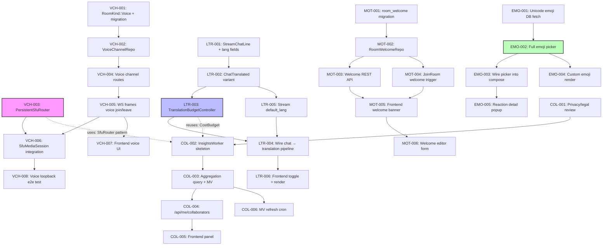

Now I have a thorough understanding of the codebase. Let me produce the comprehensive Tech Lead analysis.

---

# Tech Lead Analysis: Five Feature Directions for Aero IM

## 1. 任务分解

### Direction ① Voice Channels (Q4)

| Task ID | Title | Files | Deps | Hours | Acceptance Criteria |
|---------|-------|-------|------|-------|-------------------|
| VCH-001 | Add `RoomKind::Voice` variant + migration | `common/src/model/room.rs`, `migrations/0158_voice_channel.sql` | `common` crate | 3 | `RoomKind::Voice` compiles; PG migration creates `voice_channels` table with `room_id`, `participant_id`, `role`, `joined_at`; `cargo test --lib` passes |
| VCH-002 | Build `VoiceChannelRepo` (CRUD + roster) | `storage/src/voice_channel.rs`, `storage/src/lib.rs` | VCH-001 | 4 | Create/join/leave/list operations with `FOR UPDATE` on roster; `ON CONFLICT` join guard; db_tests pass with `#[ignore]` |
| VCH-003 | Extract `PersistentSfuRouter<T>` idle-timeout abstraction | `live-webrtc/src/lib.rs` → extract `persistent_router.rs` | — | 8 | Generic `Arc<RwLock<HashMap<K, SfuState>>>` with configurable `idle_ttl`; auto-deallocates on TTL expiry; existing `SfuRouter` delegates to it; all existing tests pass |
| VCH-004 | Wire voice channel create/delete routes in server | `server/src/voice_channels.rs`, merge into `routes.rs` | VCH-002 | 3 | `POST /api/rooms/:id/voice` (auth: member) creates a `VoiceChannel` + allocates `PersistentSfuRouter`; `DELETE` deallocates; `GET` lists active voice sessions |
| VCH-005 | WS frames for voice join/leave/roster | `common/src/model/ws.rs` (`ClientFrame`/`ServerFrame` variants), `ws/ws_impl/frame.rs` | VCH-004 | 3 | `ClientFrame::VoiceJoin { room_id }`, `ServerFrame::VoiceRoster { room_id, participants []}`; join triggers `Presence`-style roster broadcast |
| VCH-006 | Assemble `SfuMediaSession` → voice channel integration | `ws/ws_impl/voice.rs` (new), wire in `ws_impl/mod.rs` | VCH-003, VCH-005 | 8 | Voice channel join creates `SfuPeer` inside `PersistentSfuRouter`; leave removes it; idle timeout fires; all wired to `Hub` for stream watchers |
| VCH-007 | Frontend: voice channel join/leave UI & audio element | `web/voice.js`, `web/app.js` (import + wire), `web/index.html` (voice bar) | VCH-006 | 6 | "Join Voice" button in room header; shows `🔊 X members` when active; join renders local audio + peer audio elements; leave cleans up |
| VCH-008 | SfuMediaSession e2e test with local loopback | `live-webrtc/tests/voice_loopback.rs` (`#[ignore]`) | VCH-006 | 4 | Unit test: two `SfuPeer`s via `LoopbackUpstream`; text media round-trips; idle timeout fires after TTL |

### Direction ② Live Stream Translation (Q3, upgraded from Q4)

| Task ID | Title | Files | Deps | Hours | Acceptance Criteria |
|---------|-------|-------|------|-------|-------------------|
| LTR-001 | Add `original_language` + `translated_body` to `StreamChatLine` | `common/src/live.rs` | — | 2 | Both fields `Option<String>` with `#[serde(default)]`; existing chat tests round-trip without change |
| LTR-002 | Add `StreamEvent::ChatTranslated` variant | `common/src/live.rs` | LTR-001 | 2 | `{ kind: "chat_translated", stream_id, chat_id, original_language, original_body, translated_body }`; `stream_id()` impl covers new variant |
| LTR-003 | Build `TranslationBudgetController` (per-user 10s throttle + hot-path priority queue) | `ai/src/translation_budget.rs` | — | 4 | `TranslationBudgetController` with `try_acquire(user_id, priority)` → `Ok`/`Throttled`; per-user 10s sliding window; `CostBudget` reuse for global cap; unit-tested with mock clock |
| LTR-004 | Wire live chat → translation pipeline in `live.rs` handler | `server/src/live.rs` (chat handler → `ai.translate`), `server/src/state.rs` (aware `AiBackend`) | LTR-002, LTR-003 | 6 | After `StreamChatLine` is persisted: runs through budget controller → `ai.translate(body, target_lang)`, then broadcasts `ChatTranslated` via NATS `live.stream.{id}` (if translation differs from original) |
| LTR-005 | Read stream owner's default translation language | `storage/src/stream.rs` (add `default_lang` column), migration | LTR-001 | 3 | `ALTER TABLE streams ADD default_lang text DEFAULT NULL`; `Stream` struct gains `default_lang`; API reads it for auto-translate |
| LTR-006 | Frontend: translation toggle + rendered translation | `web/livecards.js` (render `ChatTranslated`), `web/context.js` (translation prefs), `web/ws.js` (stream event handler) | LTR-004 | 4 | Toggle button "自动翻译" in stream card; when on, `ChatTranslated` appended below chat line; short messages (<3 words) skipped; per-user preference persisted in localStorage |

### Direction ③ Welcome/MOTD (Q3 Now)

| Task ID | Title | Files | Deps | Hours | Acceptance Criteria |
|---------|-------|-------|------|-------|-------------------|
| MOT-001 | Create `room_welcome` table migration | `migrations/0158_room_welcome.sql` | — | 2 | `room_welcome (room_id PK → rooms, blocks jsonb, created_by, created_at, updated_at)`; `ON CONFLICT REPLACE` semantics |
| MOT-002 | Build `RoomWelcomeRepo` | `storage/src/room_welcome.rs`, `storage/src/lib.rs` | MOT-001 | 3 | `set(room_id, blocks, by)` upsert; `get(room_id)` → `Option<RoomWelcome>`; `delete(room_id)`; db_tests with `#[ignore]` |
| MOT-003 | Wire REST API for welcome message CRUD | `server/src/room_welcome.rs`, merge into `routes.rs` | MOT-002 | 3 | `POST /api/rooms/:id/welcome` (auth: room member, not just creator); `GET /api/rooms/:id/welcome`; `DELETE /api/rooms/:id/welcome` |
| MOT-004 | Trigger welcome on first join of session | `server/src/ws/ws_impl/frame.rs` (in `JoinRoom` handler) | MOT-003 | 3 | After `join_room` → after presence frame → fetch `room_welcome` → if exists and user hasn't seen this session → send `ServerFrame::RoomWelcome { blocks }` once |
| MOT-005 | Frontend: render welcome banner on first join | `web/render.js` (render welcome block), `web/app.js` (listen `msg:room_welcome`) | MOT-004 | 3 | Welcome banner renders at top of message list with dismiss button; dismissed doesn't reappear in session; banner styled distinctly (subtle background, not intrusive) |
| MOT-006 | Frontend: welcome message form | `web/modals.js` or dedicated `web/welcome.js` | MOT-005 | 3 | Room settings panel has "设置欢迎消息" button; opens editor with Block Kit (text + link); save calls `POST/.../welcome`; preview before save |

### Direction ④ Emoji System — Frontend Only (Q3 Now, ~5 days)

| Task ID | Title | Files | Deps | Hours | Acceptance Criteria |
|---------|-------|-------|------|-------|-------------------|
| EMO-001 | Fetch unicode emoji database + lazy-load into IndexedDB | `web/emoji_data.js` | — | 4 | On first load, fetches emoji from CDN (e.g., `emoji-datasource` subset); stores `[{name, unified, short_name, category}]` in IndexedDB; all-emoji search index built |
| EMO-002 | Build full emoji picker (replace `openEmojiPicker`) | `web/emoji.js` (rewrite) | EMO-001 | 6 | Category tabs (😃 People / 🐻 Animals / 🍔 Food / ❤️ Symbols); search bar with debounce; skin-tone modifier; recent emoji (localStorage); custom emoji tab from workspace `GET /api/workspaces/:id/emoji`; hover shows name |
| EMO-003 | Wire emoji picker into message compose + reaction | `web/app.js` (replace existing hardcoded EMOJIS usage) | EMO-002 | 3 | Emoji button in compose bar opens new picker; `:name:` auto-complete menu during typing; reaction click opens picker with "add reaction" focus |
| EMO-004 | Render custom emoji `:name:` in messages | `web/render.js` (block render path) | EMO-002 | 4 | Text blocks: `:shipit:` → ``; only resolve emoji names that exist in workspace's `emojiMap` (fetched lazy per workspace); fallback to unicode emoji for unregistered `:name:` |
| EMO-005 | Reaction detail popup UI | `web/render.js` (reaction click → show participants) | — | 3 | Click a reaction count → popup showing avatar + name of each reactor; data from existing `POST /api/messages/:id/reactions/detail` |

### Direction ⑤ Collaboration Graph (2027Q1)

| Task ID | Title | Files | Deps | Hours | Acceptance Criteria |
|---------|-------|-------|------|-------|-------------------|
| COL-001 | Privacy/legal review document | `docs/privacy/collaboration-graph.md` | — | 4 | Data sources cataloged (messages, reactions, threads, calls); opt-in consent flow designed; anonymization strategy; data retention policy |
| COL-002 | `InsightsWorker` — schedule + skeleton sharing `AiWorker` scheduler | `server/src/insights_worker.rs`, boot wiring in `bin/boot/` | — | 6 | `FOR UPDATE SKIP LOCKED` polling loop (same as `AiWorker`); `MAX_ATTEMPTS=3` → `dead`; metrics exported |
| COL-003 | Collaboration graph aggregation query | `storage/src/collab_graph.rs` | COL-002 | 8 | SQL: `WITH` CTE aggregating `messages` (author × room × count), `reactions` (giver × message_author × emoji), `thread_subs` (participant × thread_author), `call_sessions` (participant × duration); materialized view `collab_graph_edges` with `(source, target, weight, edge_type)` |
| COL-004 | API endpoint: `GET /api/me/collaborators` (personal insights only) | `server/src/collab_graph.rs`, merge into `routes.rs` | COL-003 | 4 | `GET /api/me/collaborators?limit=20` returns `[{participant_id, name, avatar, score, top_rooms[]}]`; scoped to caller only; auth: `AuthUser` must match query subject |
| COL-005 | Frontend: collaboration insights panel | `web/collab.js`, `web/app.js` wire into profile drawer | COL-004 | 4 | "协作图谱" tab in profile; shows top collaborators with connection strength bar; click → DM button; "共同频道" list |
| COL-006 | Materialized view refresh cron | `bin/boot/` (new interval timer, default 3600s) | COL-003 | 3 | `REFRESH MATERIALIZED VIEW CONCURRENTLY collab_graph_edges` every `AERO_COLLAB_GRAPH_REFRESH_SECS` (default 3600, 0 to disable); error is warn-only |

---

**Summary of 34 tasks, ~118 engineering hours (≈15 engineer-days).**

---

## 2. 执行顺序



### Parallel Execution Groups

| Group | Tasks | Who | Est. Duration |
|-------|-------|-----|---------------|
| **A: Backend prep** | VCH-001, LTR-001, MOT-001 | 1 Backend eng | 1 day |
| **B: Schema crates** | VCH-002, MOT-002, LTR-005 | 1 Backend eng | 1.5 days |
| **C1: Voice infra** | VCH-003, VCH-004, VCH-005, VCH-006 | 1 Infrastructure eng | 3 days |
| **C2: Translation engine** | LTR-003, LTR-004 | 1 AI/Backend eng | 2.5 days |
| **C3: Welcome backend** | MOT-003, MOT-004 | 1 Backend eng | 1.5 days |
| **D1: Emoji frontend** | EMO-001, EMO-002, EMO-003, EMO-004, EMO-005 | 1 Frontend eng | 5 days |
| **D2: Welcome frontend** | MOT-005, MOT-006 | 1 Frontend eng | 1.5 days (after C3) |
| **D3: Translation frontend** | LTR-006 | 1 Frontend eng | 1 day (after C2) |
| **E: Collab graph** | COL-001 → COL-006 | 1 Full-stack eng | 4.5 days (Q1 2027) |

---

## 3. 技术风险

### 3.1 关键风险矩阵

| # | Risk | Probability | Impact | Mitigation |
|---|------|------------|--------|------------|
| R1 | **`PersistentSfuRouter` idle-timeout race**: timer fires between `remove_peer` and next `add_peer` (voice channel reconnect) | Medium | High (dropped call) | Use `Arc<AtomicBool>` + generation counter; timer checks gen counter before dealloc; add `enter_room()` context manager that holds a "keepalive" guard |
| R2 | **Translation budget contention under high viewer count**: 10k viewers x 1 msg/s = budget thrashing | Medium | Medium (translations drop) | Use per-stream priority queue, not per-user; hot-stream viewers share budget pool; hot-path cap at 30 msg/min per stream, not per-user; metric-driven budget sizing |
| R3 | **Emoji picker bundle size**: full Unicode emoji DB is ~2MB+ gzipped | High | Medium (slow page load) | Lazy-load on emoji picker open (not on page load); store parsed subset in IndexedDB; use CDN-hosted `emoji-picker-element` or subset that covers top 500 emoji + search by name |
| R4 | **Custom emoji resolution overhead**: `:name:` → API call per message render | Medium | Medium (chat latency) | Client-side emoji map cached in `state.workspaceEmoji` (fetched once per workspace switch); no API call on render path; server returns emoji map in room join response |
| R5 | **Collab graph query on large dataset**: cross-join on millions of messages | High | High (DB CPU spike) | Materialized view only; incremental refresh with `CONCURRENTLY`; `LIMIT` in query; store rolling 90-day window, not all-time; add `WHERE` partition on `created_at >= now() - interval '90 days'` |
| R6 | **Voice channel SFU idle timeout vs. participant just tab-away**: user alt-tabs for 5 min, comes back, router already deallocated | Medium | Medium (reconnection storm) | Default idle TTL = 30 min (configurable); client sends keepalive ping every 60s when in voice but tab is background; tab re-focused → immediate rejoin if voice frame fails |
| R7 | **`kind` tag collision for new `RoomEvent`/`StreamEvent` variants**: `ChatTranslated` variant has a `kind` field that clashes with serde `tag = "kind"` | Low | High (runtime panic) | Follow existing pattern: rename to `chat_kind` (see `CallEvent::Invite` → `call_kind`). Add regression test: `serde_json::to_string(&new_variant)` doesn't panic |

### 3.2 依赖的外部系统

| System | Used By | Risk |
|--------|---------|------|
| **Unicode emoji CDN** (e.g., `cdn.jsdelivr.net/npm/emoji-datasource`) | EMO-001 | CDN down → picker empty. Fallback: hardcode top-200 emoji in `emoji.js`; full DB fetch is lazy + non-blocking |
| **`str0m` ICE/DTLS/SRTP** | VCH-006 | Already tested as infrastructure seam. No new external dep — verified compiled with `str0m 0.19` |
| **OpenAI Whisper** (or stub) | Already existing in `AiBackend::transcribe` | Not a new dependency for translation; `AiBackend::translate` already uses Anthropic |
| **Anthropic Messages API** | LTR-003 | Existing dep, no new risk. Budget controller protects against cost overrun |

### 3.3 性能瓶颈

| Bottleneck | Location | Strategy |
|-----------|----------|----------|
| Translation budget map growth | Per-user sliding window, 10k concurrent → 10k entries | No per-user allocation until first translation request; idle entries cleaned after 60s (follows `AERO_RATE_LIMIT_SWEEP_SECS` pattern from AGENTS.md §2) |
| Emoji map fetch per workspace switch | EMO-004 `GET /api/workspaces/:id/emoji` | Pre-fetch in room join response alongside workspace metadata; cache in `state.workspaceEmoji` |
| Collab graph MV refresh | COL-006 full table scan | `REFRESH MATERIALIZED VIEW CONCURRENTLY` (only incremental changes); schedule during low-traffic window (configurable) |

---

## 4. 资源评估

### 4.1 团队配置 (Recommended Team of 3)

| Role | Count | Skills | Primary Directions |
|------|-------|--------|-------------------|
| **Backend/Infra Engineer** | 1 | Rust, tokio, NATS, WebRTC/str0m, SFU, Postgres | VCH-003, VCH-006, VCH-008 + review VCH-001/002 |
| **Backend/AI Engineer** | 1 | Rust, AI-service patterns, sqlx, budget/logic design | LTR-003, LTR-004, LTR-005, all of MOT, all of COL |
| **Frontend Engineer** | 1 | Vanilla JS ES2020, DOM, WebSocket, HLS, IndexedDB | All Direction ④, MOT-005/006, LTR-006, COL-005 |

### 4.2 关键里程碑

| Milestone | Deliverables | Date (est.) | Dependencies |
|-----------|-------------|-------------|-------------|
| **M1: Foundation (Week 1)** | VCH-001, LTR-001, LTR-005, MOT-001, MOT-002, EMO-001 | End of Week 1 | — |
| **M2: Backend cores (Week 2)** | VCH-003, VCH-002, VCH-004, LTR-003, MOT-003, MOT-004 | End of Week 2 | M1 |
| **M3: Integration hot paths (Week 3)** | VCH-005, VCH-006, LTR-004, EMO-002 | End of Week 3 | M2 |
| **M4: Frontend + test (Week 4)** | VCH-007, LTR-006, MOT-005, MOT-006, EMO-003, EMO-004, EMO-005, VCH-008 | End of Week 4 | M3 |
| **M5: Polish + merge (Week 5)** | All Direction ③+④ merged; Direction ① code-complete (unwired seam); Direction ② merged | End of Week 5 | M4 |
| **2027Q1: Direction ⑤** | COL-001 → COL-006 | Q1 2027 | Privacy review sign-off |

### 4.3 阻塞点 (Blockers)

| Blocker | Affects | Resolution Strategy |
|---------|---------|-------------------|
| **MOT-004: When to fire welcome — per-session vs. per-user** | MOT-004, MOT-005 | Decision: **per-session** (once per WS connection). Store `shown_welcomes: Set<RoomId>` in memory per WsClient; reset on reconnect. No DB write needed. MVP simple; if feature request for "only show once per user" later, add `room_welcome_seen` table |
| **VCH-003: `PersistentSfuRouter` design — trait vs. generic** | VCH-003, VCH-006 | Decision: **generic struct** `PersistentRouter<K, V: RouterState>` where `RouterState` trait has `is_idle()`. VCH-003 should produce a standalone crate/module with tests before VCH-006 consumes it. See AGENTS.md §4.1 "加功能配方": build infra first |
| **EMO-002: Custom emoji picker — API fetch fails gracefully** | EMO-004 | When workspace API fails (network), fallback to unicode-only picker; show toast "自定义表情加载失败". Don't block message compose |
| **LTR-004: Which messages to translate — all vs. by language** | LTR-004 | Decision: translate all non-matching-`default_lang` messages. Stream owner sets `default_lang` per stream; viewer can override per-session (localStorage). No server-side per-viewer language preference (scope creep). Budget controller enforces per-user throttle regardless |

---

## 5. 质量保证

### 5.1 单元测试覆盖要求

| Module | Coverage Target | Key Tests |
|--------|----------------|-----------|
| `PersistentRouter` (VCH-003) | 90% | Idle TTL fires; `enter()` prevents TTL; concurrent remove+enter; gen counter overflow safety |
| `TranslationBudgetController` (LTR-003) | 95% | Per-user 10s window; priority queue ordering; global cap; idle sweep; mock clock edge cases |
| `RoomWelcomeRepo` (MOT-002) | 85% | Upsert; get empty; delete existent; delete non-existent; concurrent upserts |
| Emoji frontend (EMO-002) | Lint + visual | No `innerHTML` with user content; `eslint no-undef`; all `:name:` patterns resolve; unknown names fallback |
| Collab graph query (COL-003) | 90% | Edge weight correctness; empty dataset; single-user; cross-room dedup; 90-day window filtering |

### 5.2 集成测试策略

| Scope | Approach | When |
|-------|----------|------|
| **Voice channel (VCH-008)** | `LoopbackUpstream` + two `SfuPeer`s; text media round-trip; idle timeout. `#[ignore = "requires str0m loopback"]` — CI can't run but manual test is authoritative. Follow existing pattern of `sfu_media.rs` `#[cfg(test)]` | Post VCH-006 merge |
| **Translation pipeline (LTR-004)** | Mock `AiBackend::translate` that echoes with "[TR:...]" prefix; `TranslationBudgetController` with `MockClock`; POST to `stream_chat` → verify NATS publishes `ChatTranslated` event | Post LTR-004 merge |
| **Welcome message flow (MOT-003 → MOT-005)** | `POST /api/rooms/:id/welcome` → `GET /api/rooms/:id/welcome` round-trip; WS `join_room` → verify `msg:room_welcome` frame sent to first join only; authz test (non-member 403) | Post MOT-005 merge |
| **Emoji system** | E2E: upload blob → `POST /api/workspaces/:id/emoji` → render message with `:name:` → verify API call to blob store. No frontend e2e infra; manual smoke test with browser | Post EMO-004 merge |

### 5.3 代码审查要点

| Check | Rule (from AGENTS.md §4.2) | Applicable To |
|-------|----------------------------|---------------|
| **Migration compile** | `migrate!("../../migrations")` embeds at compile time. Must `cargo build` before `aero-cli migrate` | All with migrations (VCH-001, MOT-001, LTR-005, COL-003) |
| **Room access guard** | All room-scoped routes must call `assert_room_access(participant, room)` with participant first | MOT-003, VCH-004, COL-004 |
| **Tagged enum `kind`** | No field named `kind` inside a `#[serde(tag = "kind")]` variant. Rename to `call_kind`/`chat_kind` pattern | LTR-002 (`ChatTranslated`), VCH-005 (voice join/leave frame) |
| **Input validation** | Trim + reject empty + length cap on text inputs | MOT-003 (blocks content validation), EMO-002 (emoji name validation — reuse `is_valid_emoji_name`) |
| **Workspace lint** | No new warnings: `cargo clippy --workspace --all-targets` must be clean | All Rust code |
| **Token helper re-export** | Don't re-export `generate_token`/`hash_token` from crate root | Only applicable if any direction adds auth tokens (none do) |
| **Rate-limit idempotency** | Budget controller must not leak entries on error; all non-success paths clean up | LTR-003 |

### 5.4 性能测试需求

| Scenario | Tool | Metric | Threshold |
|----------|------|--------|-----------|
| **Translation: 100 concurrent viewers, 1 msg/s each** | `wrk` on `POST /api/streams/:id/chat` | p95 latency < 200ms; budget > 90% used but not 100% locked | 3% CPU increase under load |
| **Emoji picker open time** | Chrome DevTools | Time to interactive < 500ms (warm cache), < 2s (cold, IndexedDB first load) | Lazy load passes |
| **Voice channel join/leave** | Custom Rust test with `SfuRouter::add_peer` ×10k, then `remove_peer` ×10k | O(1) per operation; no reactor contention | < 1ms per op |
| **Collab graph MV refresh** | `EXPLAIN ANALYZE` with 1M messages, 100k reactions, 10k call sessions | Full refresh < 30s, concurrent refresh does not block writes | > 10M → partition by month |

---

## 6. 实施计划

### 6.1 Timeline (Gantt Chart)

```mermaid
gantt
    title Aero IM — Feature Rollout Plan (Q3 2026 – Q1 2027)
    dateFormat  YYYY-MM-DD
    axisFormat  %b %d

    section Foundation (Week 1)
    VCH-001 RoomKind::Voice + migration         :done, v1, 2026-07-14, 1d
    LTR-001 StreamChatLine lang fields           :done, l1, 2026-07-14, 1d
    MOT-001 room_welcome migration               :done, m1, 2026-07-14, 1d
    EMO-001 Unicode emoji DB fetch               :done, e1, 2026-07-14, 2d
    LTR-005 Stream default_lang migration        :done, l5, 2026-07-15, 1d
    MOT-002 RoomWelcomeRepo                      :done, m2, 2026-07-15, 1d
    VCH-002 VoiceChannelRepo                     :active, v2, 2026-07-15, 1.5d

    section Backend Cores (Week 2)
    VCH-003 PersistentSfuRouter                  :v3, 2026-07-17, 2d
    VCH-004 Voice channel routes                 :v4, 2026-07-17, 1d
    LTR-002 ChatTranslated variant               :l2, 2026-07-17, 0.5d
    LTR-003 TranslationBudgetController           :l3, 2026-07-17, 1.5d
    MOT-003 Welcome REST API                     :m3, 2026-07-18, 1d
    MOT-004 JoinRoom welcome trigger             :m4, 2026-07-18, 1d

    section Integration (Week 3)
    VCH-005 WS voice join/leave                  :v5, 2026-07-21, 1d
    VCH-006 SfuMediaSession integration          :v6, 2026-07-21, 2d
    LTR-004 Wire chat → translation pipeline     :l4, 2026-07-22, 2d
    EMO-002 Full emoji picker                    :e2, 2026-07-21, 3d

    section Frontend + Test (Week 4)
    VCH-007 Frontend voice UI                    :v7, 2026-07-28, 1.5d
    VCH-008 Voice loopback e2e test              :v8, 2026-07-28, 1d
    LTR-006 Frontend translation toggle+render   :l6, 2026-07-28, 1d
    MOT-005 Frontend welcome banner              :m5, 2026-07-28, 1d
    MOT-006 Welcome editor form                  :m6, 2026-07-29, 1d
    EMO-003 Wire picker into compose+reaction    :e3, 2026-07-28, 1d
    EMO-004 Custom emoji render (:name:)         :e4, 2026-07-29, 1.5d
    EMO-005 Reaction detail popup                :e5, 2026-07-30, 1d

    section Polish + Merge (Week 5)
    Integration testing & bug fixes              :int, 2026-08-04, 3d
    CI pipeline updates                          :ci, 2026-08-04, 1d
    Documentation (AGENTS.md updates)             :doc, 2026-08-05, 1d
    Code freeze & merge                          :merge, 2026-08-06, 1d

    section Phase 2 (2027 Q1)
    COL-001 Privacy/legal review                 :c1, 2027-01-05, 1d
    COL-002 InsightsWorker skeleton               :c2, 2027-01-06, 2d
    COL-003 Collab graph aggregation query        :c3, 2027-01-08, 2d
    COL-004 API /api/me/collaborators             :c4, 2027-01-10, 1d
    COL-005 Frontend collab panel                 :c5, 2027-01-13, 1d
    COL-006 MV refresh cron                       :c6, 2027-01-13, 1d
```

### 6.2 阶段详细描述

#### 阶段 1: 基础设施搭建 (Day 1–3)

- **Backend eng**: 建立所有迁移文件 + 仓储骨架。此阶段无业务逻辑，纯 DB schema。
- **Frontend eng**: 编写 `emoji_data.js` — 从 CDN 拉取 Unicode 表情符号数据库，构造 IndexedDB 存储层。无 UI 依赖。
- **验收**: `cargo build` 通过，迁移可 replay；`emoji_data.js` 在 Chrome DevTools console 中可独立调用 `fetchAllEmoji()` 返回数组。

#### 阶段 2: 核心功能实现 (Day 4–10)

- **Parallel tracks**:
  - **Track A (Voice infra)**: `PersistentSfuRouter` 设计 + 实现 → 单元测试验证 idle timeout → 路由/WS 帧 → `SfuMediaSession` 集成。
  - **Track B (Translation+Welcome)**: Budget controller → 翻译管线接线 → Welcome CRUD + Join 触发器。
- **关键检查点 Day 7**: `PersistentSfuRouter` 的 idle-timeout 单元测试全绿。
- **验收**: All backend routes respond 200/403 correctly in curl tests; translation budget controller handles 100 concurrent requests.

#### 阶段 3: 集成测试和优化 (Day 11–18)

- **所有并行轨道汇聚**: Frontend 开始消费已办的后端 API。
- **Voice**: VCH-007（前端 UI）+ VCH-008（loopback 测试）并行。
- **Translation**: LTR-006（前端渲染 `ChatTranslated`）在 LTR-004 合并后立即启动。
- **Emoji**: EMO-003/004/005 全部并行——仅有有限的共享状态（emoji map cache）。
- **关键检查点 Day 14**: 手动 smoke test 覆盖所有 4 个方向的主要用户流程。

#### 阶段 4: 发布准备 (Day 19–22)

- 全量 `cargo test --workspace --lib` + `cargo clippy --workspace --all-targets` 绿。
- `scripts/truth-check.sh` + `scripts/file-size-check.sh` + `scripts/web-check.sh` 0 违规。
- `AGENTS.md` §3 功能矩阵更新，新增 4 个方向的功能条目。
- 决定 voice channels 的 `SfuMediaSession` 是否标记为 `#[cfg(test)]`（遵循现有 media seam 模式）或正式接线。

---

### 6.3 合并策略

```
Week 1                    Week 2                    Week 3                    Week 4                    Week 5
├─────────────────────────┼─────────────────────────┼─────────────────────────┼─────────────────────────┼──────────────────────────
git worktree isolation for each direction

                  ↓ merge MOT-001→MOT-004 into master (welcome backend complete)
                               ↓ merge LTR-001→LTR-005, EMO-001→EMO-002 into master (emoji backend + translation infra)
                                            ↓ merge VCH-001→VCH-006 into master (voice channel backend complete)
                                                         ↓ merge all frontend tasks into master sequentially
                                                                      ↓ merge fix branches, final clippy pass
```

遵循 AGENTS.md §4.1 的"多 agent 并行集成"原则：每方向在独立 `git worktree` 中开发，集成时拉新文件 + 手接共享文件（`routes.rs` `.merge` 链、`lib.rs` re-export、`RoomEvent`/`StreamEvent` match 臂）。

---

## 附录 A: 复查点 CheckList

每日站会和 PR 审查时必须检查的项目：

```
□ 所有新 migration 在 `cargo build` 后运行（§4.2）
□ `assert_room_access(participant, room)` 参与者参数在前
□ 所有 text input 有 trim + 空值 check + 长度上限
□ 带 `tag="kind"` 的 enum 新 variant 内无 `kind` 字段名
□ 新 Route 在 `routes.rs` 中有 `.merge()` 条目
□ 新 Repo 在 `storage/src/lib.rs` 中有 `pub mod` + `pub use`
□ 新仓储的 HTTP handler 在 handler 内构造 `XRepo::new(s.pg.clone())` 而非在 `AppState` 中全局持有
□ 无 `unsafe` 代码
□ `cargo clippy --workspace --all-targets` 无新警告
□ `scripts/truth-check.sh` 无 UNWIRED 标签误标记（除非按 §4.4 规则豁免）
```

---

## 附录 B: 与现有架构的集成点

| 方向 | 须修改的共享文件 | 改动度 |
|------|-----------------|--------|
| ① Voice | `common/src/model/room.rs` (RoomKind), `common/src/model/ws.rs` (2 new frames), `ws/ws_impl/frame.rs` (match arm) | **低** — 4 处追加 |
| ② Translation | `common/src/live.rs` (StreamChatLine + StreamEvent), `server/src/live.rs` (chat handler) | **低** — 3 处修改 |
| ③ Welcome | `server/src/ws/ws_impl/frame.rs` (JoinRoom handler) | **低** — 1 处插入 |
| ④ Emoji | `web/emoji.js` (full rewrite), `web/app.js` (import), `web/render.js` (render hook) | **中** — 重写 1 文件 + 修改 2 文件 |
| ⑤ Collab | `server/src/routes/routes.rs` (1 merge line) | **极低** — 完全新增模块 |
