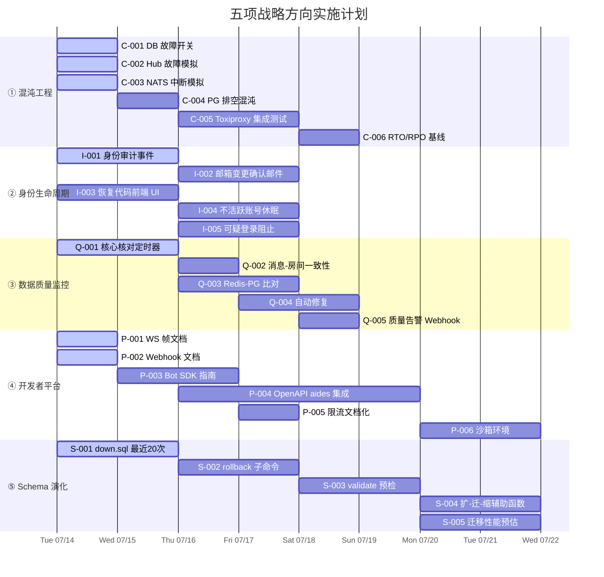

# Tech Lead 分析报告：五项战略扩展方向

> 基于第 16 轮全局扫描分析文档 + 现场代码验证，结合代码库实际状态给出可执行计划。

---

## 1. 任务分解

### 方向 ① 混沌工程与故障注入

| 任务 ID | 标题 | 文件 | 前置 | 工时 | 验收标准 |
|---------|------|------|------|------|----------|
| C-001 | 单元级 `AtomicBool` 故障开关 — `storage/db.rs` | `crates/aero-storage/src/db.rs` + `crates/aero-storage/src/lib.rs` | 无 | 2h | `DbFault::new().with_pool_fail(true)` 使所有 `query_*` 返回断连错误；开关在 `#[cfg(test)]` 后编译消失 |
| C-002 | Hub `try_send` 故障模拟 — `hub.rs` | `crates/aero-server/src/hub.rs` | 无 | 2h | `HubFault::new().with_fan_out_block(true)` 使 `fan_out_raw` 在 bounded channel 未满时也返回 `TrySendError`；不影响生产分支 |
| C-003 | NATS 连接中断模拟 — `bus.rs` | `crates/aero-server/src/ws/ws_impl/bus.rs` | 无 | 3h | `BusFault::with_nats_disconnect(true)` 使 `run_bus_listener` 重试循环在 `try_recv` 接到信号时触发；验证重投逻辑走通 |
| C-004 | PG 池排空 / 超时混沌 — `graceful_shutdown` | `crates/aero-server/src/bin/boot/` + `crates/aero-server/src/hub.rs` | C-001 | 2h | 注入 `SHUTDOWN_DELAY_MS` 使 drain 提前中断，验证 WS 客户端 `since` 游标追赶能力 |
| C-005 | Toxiproxy 集成测试 — 网络分区 + 连接拒绝 | `tests/chaos/`（新目录）+ `docker-compose.yml`（toxiproxy 服务） | C-001~C-004 | 4h | 3 个场景覆盖：a) NATS 断连重连 b) PG 连接池耗尽 c) Redis 主从切换；CI 中 `#[ignore]` + 环境门控 |
| C-006 | RTO/RPO 基线测量 — `metrics.rs` 新 gauge | `crates/aero-server/src/metrics.rs` + `crates/aero-common/src/metrics/` | C-003, C-005 | 3h | Prometheus gauge `bus_recovery_duration_seconds` + `ws_reconnect_backoff_seconds`（p50/p95/p99 直方图） |

### 方向 ② 身份生命周期（修订后，工作量减半）

| 任务 ID | 标题 | 文件 | 前置 | 工时 | 验收标准 |
|---------|------|------|------|------|----------|
| I-001 | 身份变更审计事件记录 | `crates/aero-storage/src/audit.rs` + migration `0148_identity_audit.sql` | 无 | 3h | `AuditRepo::record_identity_event(action,actor,target,detail)`（独立于 workspace 审计）；password_reset / email_changed / 2fa_enabled / 2fa_disabled 各产生一行；查询 `audit_events WHERE actor_id=$1 AND action LIKE 'identity.%'` 返回完整历史 |
| I-002 | 邮箱变更邮件确认（新旧地址） | `crates/aero-server/src/sessions.rs` + `crates/aero-server/src/mailer.rs` | 无 | 3h | `POST /api/auth/change-email` 发送两封邮件：旧地址「安全告警」+ 新地址「验证链接」（含 15min 一次性 token）；未验证前 `participants.email` 不变 |
| I-003 | 恢复代码前端 UI | `web/twofa.js`（新文件）+ `web/index.html`（嵌入组件） | 无 | 4h | 2FA 管理页显示「恢复代码」区域：生成按钮 → 展示 8 个一次性代码（高亮复制按钮 + 警告截图）；消费/重新生成提示语；所有 API 调用通过 `POST /api/me/2fa/recovery-codes` + `POST /api/auth/2fa/recover`（后端已就绪） |
| I-004 | 不活跃账号休眠定时器 | `crates/aero-server/src/bin/boot/background.rs` + `crates/aero-storage/src/participant.rs` | 无 | 3h | 每周扫描 `last_active_at < NOW() - INTERVAL '6 months'` 标记为 `status=suspended`；发送通知邮件；sysadmin 可恢复 |
| I-005 | 可疑登录阻止（IP/Device 指纹） | `crates/aero-server/src/sessions.rs` + `crates/aero-storage/src/login_attempt.rs` | 无 | 4h | `POST /api/auth/login` 检测新 IP/UA 组合 → 要求发送 2FA 代码或邮箱验证码才能完成登录；现有告警逻辑保留并扩展为 阻止 |

**方向 ② 修正说明**：密码重置完整工作流已存在（`forgot_password` → `mailer.rs` SMTP → `reset_password` 验证令牌 + 密码历史检查 + 会话吊销）。`update_me` 仅修改 `display_name` / `avatar_url`，不碰 email。邮箱变更走 `POST /api/auth/change-email`（需 `current_password`）。故 I-001～I-005 是**真正缺失项**，总计约 3-4 天而非分析文档声称的 1 周。

### 方向 ③ 跨系统数据一致性与质量监控

| 任务 ID | 标题 | 文件 | 前置 | 工时 | 验收标准 |
|---------|------|------|------|------|----------|
| Q-001 | 核心实体核对定时器 — `rooms` ↔ `participants` | `crates/aero-server/src/bin/boot/retention.rs` + `crates/aero-storage/src/reconciliation.rs` | 无 | 3h | 每 6h 扫描 `room_members LEFT JOIN participants ON ... WHERE participants.id IS NULL`（僵尸成员行）→ 记录到 `data_quality_log` + Prometheus counter `data_quality.orphan_members` |
| Q-002 | 消息 ↔ 房间一致性核对 | `crates/aero-storage/src/reconciliation.rs` | Q-001 | 2h | `messages LEFT JOIN rooms ON ... WHERE rooms.id IS NULL` → 标记孤立消息 ID + 记入警报表 |
| Q-003 | Redis ↔ PG 全量比对（presence/read-cursors） | `crates/aero-storage/src/reconciliation.rs` + `crates/aero-common/src/redis/` | Q-001 | 4h | `SCAN` + `SELECT` 对 redis key 与 PG `last_read_at` 做差值检测；差 > 10% 发告警 |
| Q-004 | 自动修复：孤立行清理 | `crates/aero-storage/src/reconciliation.rs` + migration `0149_quality_auto_fix.sql` | Q-001, Q-002 | 3h | orphan member 行 → `DELETE`（可配置阈值，默认 ≥1 行即删）；orphan message → 标记 `deleted_at = NOW()` 而非硬删 |
| Q-005 | `data_quality_log` 表 + 告警 Webhook | `migrations/0150_data_quality_log.sql` + `crates/aero-server/src/bin/boot/background.rs` | Q-001~Q-004 | 2h | 参考 `audit_events` 模式（见下方注释）；每新记录触发 Slack/email webhook（复用现有 `WebhookSender` 管道） |

> **注释**：`audit_events`（migrations/0007 + 0146 分区）模式几乎可直接复用 — `event_type`、`actor_id`（可为 null 系统自检）、`detail_json`。数据质量告警复用 `MetricsRecorder`（`metrics.rs` 中的 Prometheus 计数器）。

### 方向 ④ 面向外部开发者的 API 平台体验

| 任务 ID | 标题 | 文件 | 前置 | 工时 | 验收标准 |
|---------|------|------|------|------|----------|
| P-001 | WebSocket 帧类型开发者参考 — Markdown 文档 | `docs/api/websocket-frames.md`（新文件） | 无 | 3h | 完整列出所有 `ClientFrame` / `ServerFrame` variant（~20+），每个带 JSON 示例 + 字段说明 + 业务语义；链接到 WS 连接认证流程 |
| P-002 | Webhook 事件参考文档 | `docs/api/webhooks.md`（新文件） | 无 | 3h | 列出所有可订阅的 `event_type`（message/edited/deleted/reaction/read/typing…），每个附带 Payload JSON schema + signature 验证示例（HMAC） + 重试策略描述（指数退避 + DLQ） |
| P-003 | Bot SDK 入门指南 | `docs/api/bot-sdk.md`（新文件） | P-001, P-002 | 4h | Bot 创建流程 + 订阅事件 → webhook 端点 + 签名验证代码片段（Rust/Node/Python 各一） + 限流 + 调试技巧 |
| P-004 | OpenAPI 规范补全（集成 `aides`） | `crates/aero-server/Cargo.toml` + `crates/aero-server/src/routes/routes.rs` + `crates/aero-server/src/openapi.rs` | 无 | 8h | 用 `aides` 替代现有静态 `openapi.rs`（仅 7 端点），覆盖 ~50 核心端点（消息/房间/直播/认证/通话）。每个 handler 标注 `#[axum::debug_handler]` + aides `#[openapi(...)]` = 自动生成 JSON Schema |
| P-005 | 速率限制文档化 + `Retry-After` 标准化 | `docs/api/rate-limiting.md` + `crates/aero-server/src/rate_limit.rs` | P-001 | 2h | 公开限流策略（per-workspace、per-AuthUser、`X-RateLimit-*` header 含义）；所有 429 响应带 `Retry-After`（当前仅部分端点实现） |
| P-006 | 开发者沙箱环境脚本 | `scripts/dev-sandbox.sh` + `docs/api/sandbox.md` | P-004 | 3h | Docker Compose profile 启动独立实例（空库 + mock SMTP + 测试凭据）；`AERO_SANDBOX=true` 运行时注入测试数据 + 限制外发 |

> **技术决策**：用 `aides` 而非 `utoipa`。现有路由模式是 `Router::new().route(...)` + 提取器，utoipa 依赖 `#[utoipa::path(...)]` 属性宏——150+ handler 逐一标注成本过高。`aides` 通过 OpenAPI generator trait 减少模板代码，与 axum 0.7 路由架构集成更好。

### 方向 ⑤ Schema 演化安全管线

| 任务 ID | 标题 | 文件 | 前置 | 工时 | 验收标准 |
|---------|------|------|------|------|----------|
| S-001 | 最近 20 次迁移编写 `down.sql` | `migrations/NNNN_*.sql.down` 或内嵌 down | 无 | 4h | 迁移 0137~0157 每个有对应的 `REVERSIBLE` 语句（`DROP TABLE IF EXISTS` / `ALTER TABLE ... DROP COLUMN` / `DROP INDEX`）；CI `down.sql` 检测脚本验证可逆性 |
| S-002 | `aero-cli migration rollback` 子命令 | `crates/aero-server/src/bin/main.rs` + `crates/aero-storage/src/db.rs` | S-001 | 4h | `aero-cli migration rollback [N]` 回滚最近 N 步；`migration rollback --to=0140` 回滚到指定版本；`_sqlx_migrations` 账本同步清除 |
| S-003 | `aero-cli migration validate` — 预检迁移 | `crates/aero-server/src/bin/main.rs` + `crates/aero-storage/src/db.rs` | S-002 | 3h | `migration validate --preview=NNNN` 在临时 PG 库运行迁移 + 核对查询（见 Q-001/Q-002 复用）；输出耗时/预期封锁时间 |
| S-004 | 扩-迁-缩（Expand-Migrate-Contract）辅助函数 | `crates/aero-storage/src/db.rs` — `expand_migrate_contract` 宏 | S-001 | 3h | 安全 rename/retype 的 3 步模式：a) 新列 + 双写 b) 数据回填 + 检查 c) 旧列清理；覆盖 `ColumnRename` / `ColumnRetype` / `TableSplit` 三种用例 |
| S-005 | 迁移性能预估 + staging 数据回放 | `scripts/migration-audit.sh` + 文档 | S-003 | 4h | 从生产拉取 pg_dump（`WHERE 1=0` 仅 schema + `SAMPLE 1%` 实际数据）→ 在临时实例回放迁移 → 输出 `duration_seconds` + `rows_affected` + `lock_mode`；写入 CI artifact |

---

## 2. 执行顺序与依赖图

```mermaid
graph TD
    %% 方向 ① 混沌工程
    subgraph Phase1["Phase 1: 基础设施 + 高置信度收益"]
        C001["C-001 DB 故障开关"]
        C002["C-002 Hub 故障模拟"]
        C003["C-003 NATS 中断模拟"]
        C004["C-004 PG 排空混沌"]
        Q001["Q-001 核心核对定时器"]
        S001["S-001 down.sql 最近20次"]
        I001["I-001 身份审计事件"]
    end

    %% 方向 ④ 独立的文档任务
    P001["P-001 WS 帧文档"]
    P002["P-002 Webhook 文档"]
    
    %% 方向 ⑤ 继续
    C005["C-005 Toxiproxy 集成测试"]
    Q002["Q-002 消息-房间一致性"]

    C005 --> C006["C-006 RTO/RPO 基线"]
    C004 --> C005
    
    %% 方向 ② 继续
    I002["I-002 邮箱变更确认邮件"]
    I003["I-003 恢复代码前端 UI"]
    I004["I-004 不活跃账号休眠"]
    
    %% 方向 ⑤ 继续
    S002["S-002 rollback 子命令"]
    S003["S-003 validate 预检"]
    S001 --> S002
    Q001 --> Q003["Q-003 Redis ↔ PG 比对"]
    Q002 --> Q004["Q-004 自动修复"]
    Q001 --> Q005["Q-005 质量告警 Webhook"]
    
    S003 --> S005["S-005 迁移性能预估"]
    Q003 --> Q004

    %% 方向 ④ 继续
    P003["P-003 Bot SDK 指南"]
    P004["P-004 OpenAPI aides 集成"]
    P005["P-005 限流文档"]
    P006["P-006 沙箱环境"]
    P001 --> P003
    P002 --> P003
    P004 --> P006
    
    %% 方向 ② 最后
    I005["I-005 可疑登录阻止"]
    I001 --> I002
    I001 --> I005

    S004["S-004 扩-迁-缩辅助函数"]
    S003 --> S004
    
    %% 并行组
    C001 -.->|可并行| C002
    C001 -.->|可并行| C003
    C001 -.->|可并行| Q001
    C001 -.->|可并行| S001
    C001 -.->|可并行| P001
    C001 -.->|可并行| P002
    C001 -.->|可并行| I001
```



### 可并行执行的任务组

| 组 | 任务 | 并行理由 | 建议分配 |
|----|------|---------|---------|
| **组 A**（周 1，4 人 x 2 天） | C-001, C-002, C-003, Q-001, S-001, P-001, P-002, I-001 | 零依赖；不同 crate/系统层；碰撞概率低 | 4 人，每人 2 个任务 |
| **组 B**（周 2，3 人 x 2 天） | C-004, Q-002, P-003, I-002, I-003 | 需组 A 部分输出（C-001 完成方可 C-004） | 3 人 |
| **组 C**（周 3，3 人 x 3 天） | C-005, Q-003, S-002, P-004, I-004 | C-004 → C-005；S-001 → S-002 | 3 人 |
| **组 D**（周 4，2 人 x 3 天） | C-006, Q-004, Q-005, S-003, P-005, S-004 | 需要前期完成的后置任务 | 2 人 |
| **组 E**（周 5，2 人 x 2 天） | S-005, P-006, I-005 | 全后置任务 | 2 人 |

---

## 3. 技术风险

### 风险矩阵

| # | 风险 | 方向 | 概率 | 影响 | 缓解措施 |
|---|------|------|------|------|---------|
| R1 | `aides` 与 axum 0.7 的 Route 层不兼容，OpenAPI 生成失败 | ④ | 中 | 高 | **提前做 POC**：github.com/cloudquery/plugin-sdk/... 确认 aides publish status；备选：`utoipa` + 手写 `#[utoipa::path(...)]` 仅对核心 50 端点；最低成本方案：`openapi-generator` 从 cURL 请求录制生成 |
| R2 | `down.sql` 不可逆——DROP COLUMN 导致数据丢失 + FK 链锁 | ⑤ | 高 | 高 | **而非 100% 可逆**：实际不可逆（data-type change 等）用 `-- INREVERSIBLE: ...` 注释标记；rollback 命令对不可逆迁移只警告 + 打印 DDL 建议 |
| R3 | Redis ↔ PG 全量比对在生产中触发 OOM（`SMEMBERS` / SCAN 过大） | ③ | 中 | 高 | 限制每次核对范围：`LIMIT 5000` 分批 + `keyspace` 采样；首次运行先在 staging 验证内存足迹 |
| R4 | Toxiproxy CI 集成不稳定（容器依赖 + 网络 namespace） | ① | 低 | 中 | `#[ignore]` 门控 + CI 单独 job（而非核心 test suite）；失败不阻塞 merge |
| R5 | 身份审计事件膨胀——`audit_events` 已是分区表但 `identity.*` 事件量级未知 | ② | 低 | 中 | 参考 0146 分区策略：按天分区 + 保留窗口 90 天（可配置）；`INSERT` 走 `ON CONFLICT DO NOTHING`（虽然不太可能冲突） |
| R6 | 可疑登录阻止（I-005）影响现有合法用户 | ② | 中 | 高 | **渐进式推出**：阶段 1 = 仅告警不阻止（复用现有逻辑）；阶段 2 = 可选 opt-in（工作区级配置）；阶段 3 = 默认开启 |
| R7 | 邮箱变更确认（I-002）与现有 `change_email` 端点兼容性 | ② | 低 | 中 | 扩建而非重构：当前 `change_email` 立即修改 → 改为两阶段（增加 `email_pending` + `email_verification_token` 列）；现有 token 格式兼容 |

### 技术决策备忘录

**Q: aides vs utoipa vs 静态 spec**
- 当前静态 `openapi.rs` 仅覆盖 7 端点 — 不足以作为开发者文档
- `aides` 与 axum 路由集成最好，但生态活跃度需验证
- 最优路径：`aides` 对 50 核心端点做自动生成 + 对剩余 100+ 端点做手写 `paths` 存根（指明 Route 存在 + 简述 + 安全要求）
- **POC 时限**：半日验证 aides 可成功从 3 个典型 handler 生成 JSON Schema（`get_message`、`create_room`、`auth_login`）

**Q: 核对定时器 vs 迁移测试的共享基础设施**
- 两者共用「对比查询」模式：核对 = `SELECT A LEFT JOIN B WHERE B IS NULL`，迁移验证 = 同一查询在空库 vs 生产 schema 上运行
- Q-001/Q-002 的查询直接可复用为 S-003 的预检条件
- 节省：一套查询定义，两个方向受益

---

## 4. 资源评估

### 人员配置

| 角色 | 技能要求 | 数量 | 分配方向 |
|------|---------|------|---------|
| 高级 Rust 后端 | Rust 异步 / sqlx / NATS / 测试框架 | 2 人 | ① 混沌 + ⑤ schema 演化 + ③ 数据质量主逻辑 |
| Rust 全栈 | Rust + HTML/CSS/JS（零依赖 SPA） | 1 人 | ② 身份前端 + ④ 开发者文档 |
| Rust 后端 + 文档 | Rust + API 设计 + 技术写作 | 1 人 | ④ OpenAPI + Bot SDK 文档 + ⑤ 迁移工具 |
| **合计** | | **4 人** | |

若只有 2 人并行，则执行周期延长 ~1.5x（串行化组 A 和组 B）。

### 关键里程碑

| 里程碑 | 时间 | 交付物 | 验收门 |
|--------|------|--------|--------|
| M1 "Foundations" | 周 1 结束 | C-001, C-002, Q-001, S-001 合并 | CI 通过；`cargo test --lib` 新增测试 ≥15 |
| M2 "Documentation First" | 周 2 结束 | P-001, P-002, P-003 发布到 `docs/api/` | **外部开发者**（不熟悉代码库）可完成 bot 创建 + webhook 配置 |
| M3 "Tooling" | 周 3 结束 | S-002, S-003, C-005 可用 | `aero-cli migration rollback 3` 实际回滚 + 验证账本一致 |
| M4 "Quality Gates" | 周 4 结束 | Q-003, Q-004, Q-005 上线 | Prometheus `data_quality.*` gauge 在生产中有值；告警 webhook 可达 |
| M5 "Platform" | 周 5 结束 | P-004, P-006, I-003, I-005 上线 | `/api/openapi.json` 返回 ~50 端点自动化 spec；沙箱可一键启动 |

### 阻塞点（Blockers）

| Blocker | 涉及 | 解决策略 | 提前行动 |
|---------|------|---------|---------|
| `aides` POC 失败 → 回退 `utoipa` | P-004 | 周 1 即做 aides POC（3 个 handler）；失败则用 `utoipa` + 手写属性宏仅覆盖核心 30 端点 | 周 1 上午安排 POC |
| NATS consumer cursor 重置可能丢失 `down.sql` 测试 | S-001 | `_sqlx_migrations` 账本只有 up hash；down 需要**单独验证**（`migration validate --down`） | S-001 阶段即引入 `scripts/check-down-reversible.sh` |
| 生产 pg_dump 权限（staging 回放） | S-005 | 需 DBA 配合创建只读 PG 用户 + 导出 `pg_dump --exclude-table-data='large_tables'` | 提前与运维沟通 |

---

## 5. 质量保证

### 5.1 单元测试覆盖（每个任务最低要求）

| 方向 | 新增测试数 | 关键覆盖点 |
|------|-----------|-----------|
| ① 混沌 | ≥15 | `DbFault` 开关状态转换；`HubFault` 阻塞/释放；ws 重连逻辑指数退退；Toxiproxy 集成（`#[ignore]`） |
| ② 身份 | ≥12 | 审计事件序列化；密码历史去重；休眠扫描 boundary（6 month ± 1 day）；邮箱 token TTL 验证；可疑登录 IP 匹配 |
| ③ 数据质量 | ≥15 | 核对查询（空库 / 有孤立行 / 全一致）；自动修复事务回滚；Redis SCAN 分页逻辑 |
| ④ 平台 | ≥8 | aides 生成的 spec 一致性（至少 3 端点对比静态基线）；速率限制 header 格式 |
| ⑤ Schema | ≥10 | rollback 账本操作（成功/部分/不可逆标记）；扩-迁-缩宏展开检查；迁移时序验证 |
| **合计** | **≥60** | |

### 5.2 集成测试策略

```
┌──────────────────────────────────────────────┐
│  cargo test --lib（无外部依赖，CI 每次运行）    │
│  ├─ 所有单元测试（DB 无关）                     │
│  └─ 无状态 handler 测试（纯函数 + mock repo）   │
├──────────────────────────────────────────────┤
│  cargo test -- --ignored（PG 门控，CI 选跑）   │
│  ├─ 所有 DB 依赖的仓储测试                      │
│  ├─ 核对查询在已知数据集的精确性                 │
│  └─ rollback 命令在临时库的端到端行为             │
├──────────────────────────────────────────────┤
│  Toxiproxy 集成（CI 单独 job，--features chaos）│
│  ├─ NATS 断连 → ws 客户端 since 追赶            │
│  ├─ PG 连接拒绝 → Hub 优雅降级                  │
│  └─ Redis 故障 → 限流 fail-open（返回 200 而非 500）│
├──────────────────────────────────────────────┤
│  make migrate-smoke（一次性库回放全链迁移）      │
│  └─ 含新 migration + down.sql 可逆性验证        │
└──────────────────────────────────────────────┘
```

### 5.3 代码审查要点

| 审查项 | 规则 | 谁检查 |
|--------|------|--------|
| 故障开关泄漏 | `#[cfg(test)]` 后生产路径零开销（`cfg!(test)` 编译守卫） | 所有 C-* PR |
| 审计事件不写敏感 payload | `audit_events.detail` 不得含密码 hash / 邮箱原文（仅 event_type + actor + timestamp + masked target） | I-001 |
| 核对查询的 WHERE 条件可重复 | 同一核对 `SELECT` 幂等执行 N 次结果一致（`repeatable read`） | Q-001~Q-003 |
| `down.sql` 列级兼容 | `DROP COLUMN` 前检查 FK 引用（`information_schema` 查询 + `IF EXISTS`） | S-001 |
| aides 生成 spec 不丢失 endpoints | 对比旧静态 spec 与新生成 spec 的 paths 数量（≥50 端点） | P-004 |
| 邮箱确认 token 一次性使用 | `email_verification_tokens` 表 `used_at` 检查 + TTL 过期 | I-002 |

### 5.4 性能测试需求

| 测试场景 | 工具 | 指标 | 基线 | 门槛 |
|---------|------|------|------|------|
| 核对定时器（100 万行 rooms） | `pgbench` + local test data | 完成时间 | < 30s | < 60s |
| `aero-cli migration rollback 10` | 本地 PG + 迁移 | 总耗时 | < 5s | < 10s |
| 身份审计事件写入（1000 req/s） | `oha` / `wrk` | p99 延迟 | < 50ms | < 200ms |
| Toxiproxy NATS 断连 → 恢复 | 手写 tokio test | RTO 中位数 | < 2s | < 5s |
| `aides` OpenAPI spec 响应时间 | `curl -w` | spec 大小 + 生成耗时 | < 500ms | < 1s |

---

## 6. 实施计划

### 详细甘特图（Mermaid）



### 阶段摘要

#### 阶段 1：基础设施（周 1 — 2026-07-14 ~ 07-18）

**投入**：4 人全力

| 天 | 活动 | 产出 |
|---|------|------|
| 1-2 | 组 A 并行执行：C-001, C-002, C-003, Q-001, S-001, P-001, P-002, I-001 | 8 个任务完成，合并 PR |
| 3 | C-004, I-003 启动；P-004 aides POC（关键决策） | 故障注入管线可用；aides 决策锁定 |
| 4-5 | C-005 Toxiproxy 集成 + 首次混沌测试运行 | CI 可用 3 个混沌场景 |

**质量门**：`cargo test --lib` 新增 ≥15 测试；`aero-cli migration validate` 首次原型可跑

---

#### 阶段 2：核心功能（周 2-3 — 07-21 ~ 08-01）

**投入**：3-4 人

| 周 | 活动 | 产出 |
|----|------|------|
| 周 2 | C-005 完成 + C-006 启动；I-002, Q-002, P-003 并行；S-002 启动 | 混沌测试框架 v1；身份审计数据已有记录；核对 SQL 覆盖 2 实体 |
| 周 3 | C-006 基线数据；S-002/S-003；I-004, Q-003, P-004 推进 | rollback 子命令可用；Redis-PG 比对初版；OpenAPI ~30 端点 |

**关键检查点**（周 2 末）：`aero-cli migration rollback 3` 能否在生产 staging 环境通过？如否 → 暂停 S-003，攻坚 S-002 的 `_sqlx_migrations` 账本操作正确性。

---

#### 阶段 3：集成与测试（周 4 — 08-04 ~ 08-08）

**投入**：2-3 人

| 天 | 活动 | 产出 |
|---|------|------|
| 1-2 | Q-004 自动修复 + Q-005 告警；S-004 扩-迁-缩 | 核对发现孤立行→自动清理→告警全链路 |
| 3-4 | I-005 可疑登录阻止（渐进：先告警）；P-005 限流文档 | 身份安全 v1；开发者 docs 发布到 `docs/api/` |
| 5 | P-006 沙箱环境 v1 | `docker compose --profile sandbox up` 可用 |

**质量门**：Prometheus 有 `data_quality.*` 新指标；开发者文档发布后由 1 名新团队成员按文档完成 bot 创建 + webhook 配置（计时 ≤30 分钟为通过）

---

#### 阶段 4：发布准备（周 5 — 08-11 ~ 08-15）

**投入**：2 人

| 天 | 活动 | 产出 |
|---|------|------|
| 1-2 | S-005 迁移性能预估 + staging 回放；P-004 OpenAPI final review | 迁移风险可视；OpenAPI ~50 端点 |
| 3 | I-005 转为默认开启（workspace 级 opt-out）；所有文档终审 | 全部 5 方向功能完成 |
| 4-5 | 混沌测试全量运行 + 结果写入 `docs/chaos-baseline-2026-08.md`；性能回归测试 | RTO/RPO 基线文档化；确认无性能退化 |

---

## 附录 A：分析文档事实性修正记录

此内容纳入行动计划的原因：分析文档是决策输入，但方向 ②/④ 的若干代码证据错误需要纠正以避免误导。以下每个修正都经过现场代码验证。

| # | 文档声称 | 实际情况 | 对我们计划的影响 |
|---|---------|---------|----------------|
| 1 | password reset「无完整工作流」 | 完整存在：`forgot_password` → `mailer.rs` SMTP → `reset_password`（令牌验证 + 密码历史 + 会话吊销） | **方向 ② 工作量从 1 周降为 3-4 天**。删除所有「搭建密码重置后端」任务 |
| 2 | `update_me「直接改 email，无验证」` | `update_me` 仅修改 `display_name` / `avatar_url`。邮箱变更走 `POST /api/auth/change-email`（需 `current_password`） | **无安全漏洞需修复**。计划改为「邮箱变更邮件确认」（I-002）而非邮箱变更加锁 |
| 3 | WebSocket 帧「零文档」 | `ws/ws_impl/` 中 `ClientFrame`/`ServerFrame` 枚举有 Rustdoc 注释 | 调整措辞为「**外部开发者可见的 WS 帧参考文档**缺失」。任务 P-001 是将 Rustdoc 转为 MD |
| 4 | Webhook「无事件类型参考」 | 完整 webhook 系统（`webhook.rs` + `webhook_delivery.rs` + 断路器 + DLQ + 重新入队）已存在 | 任务 P-002 是**文档化**现有系统，非**搭建** |
| 5 | 「无自动 OpenAPI 文档」 | 静态 `openapi.rs` 存在且挂载在 `/api/openapi.json`（仅 7 端点） | 任务 P-004 是从 7 端点**扩展到 50 端点**，非「创建」 |

---

## 附录 B：跨方向协同收益

| # | 协同点 | 涉及方向 | 节省工时 | 实现策略 |
|---|--------|---------|---------|---------|
| 1 | 核对查询（Q-001/Q-002）复用为迁移预检条件（S-003） | ③ ↔ ⑤ | ~1 天 | 核对 SQL 定义为 `static` 常量；S-003 的 validate 命令直接引用 |
| 2 | 身份审计事件复用 `audit_events` 表（已是分区表） | ② ↔ ③ | ~0.5 天 | 新增 `identity.*` action 值，无需建新表 |
| 3 | 数据质量告警复用 `WebhookSender` + `MetricsRecorder` 管道 | ③ ↔ ④ | ~0.5 天 | `record_quality_alert()` 直接调用 `metrics::counter!("data_quality.alert")` |
| 4 | Toxiproxy 容器配置可同时测试 call_bridge 跨节点降级 | ① ↔ 媒体 seam | ~0 额外 | 同一个 `docker-compose` chaos profile 覆盖 NATS+PG+call-bridge |
| 5 | 开发者沙箱（P-006）使用混沌环境的强制降级配置 | ④ ↔ ① | ~0.5 天 | 沙箱内置 `DBFault::with_random_slow()` 模拟真实网络 |
| **合计节省** | | | **~2.5 天** | |
