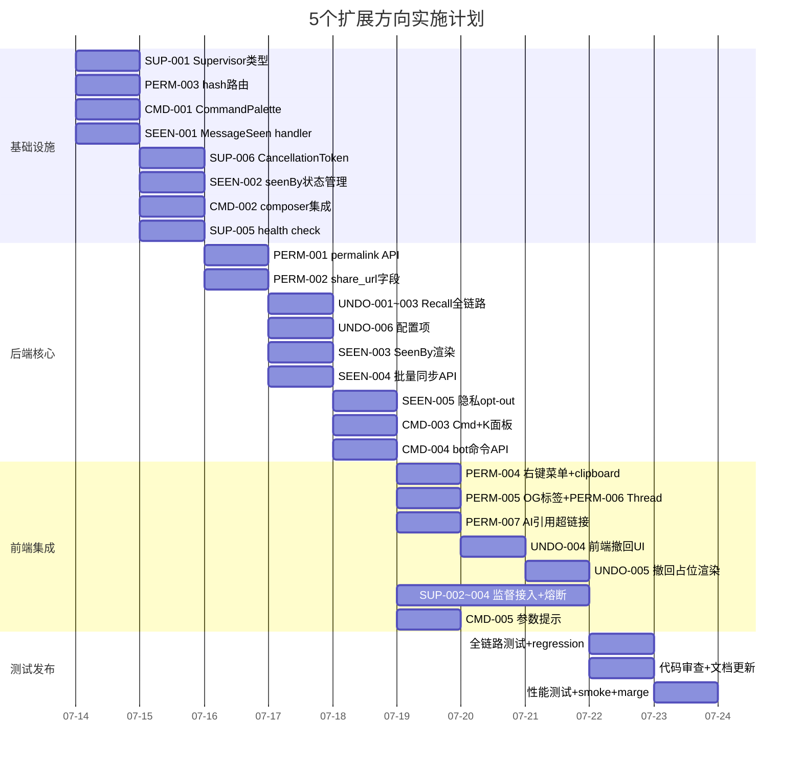

现在我已掌握全部背景情况。以下是 Tech Lead 分析。

---

# Tech Lead 分析：5 个扩展方向执行计划

## 前置声明：分析文档状态

**关键事实**：`2026-07-11-round-18-global-scan-five-critical-expansion-directions.md` 与 `2026-07-09-five-critical-gaps-final-scan.md` **内容完全相同**（仅日期从 07-09 改为 07-11 + 一处 typo 修复）。两份文档都声称 5 个方向零覆盖率，但事实上：

| 方向 | 真实分析状态 |
|------|------------|
| Permalink | 07-09 文档已分析（方向一）；另有 07-10 文档补充 |
| 撤回 | 07-09 文档已分析（方向二）；07-10 文档补充 |
| 已读回执 | 07-09 文档已分析（方向三）；07-10 文档补充 |
| 斜杠命令 | 07-09 文档已分析（方向四） |
| 总线监督 | 07-09 和 07-10 文档均已分析 |

**结论**：这 5 个方向是**真实缺口，但不是新发现**。文档的「零覆盖率」声明存在事实错误。真正缺失的不是分析，而是**执行计划**。以下分析聚焦于从分析到落地的工程执行。

---

## 1. 任务分解

### 方向一：消息永续链接（Permalink） — P1

| 任务 ID | 标题 | 文件 | 前置 | 工时 | 验收标准 |
|---------|------|------|------|------|---------|
| PERM-001 | 后端 `GET /api/messages/:id/permalink` 路由 | `crates/aero-server/src/permalink.rs` + `routes/routes.rs` | 无 | 2h | `GET /api/messages/:id/permalink` 校验 room access 后返回 `{url, room_id, message_id}`；软删返回 404；跨工作区消息含 `ws=` 参数 |
| PERM-002 | `Message` 模型添加 `share_url` 可选字段 | `crates/aero-common/src/model/message.rs` | 无 | 1h | `Message` struct 含 `#[serde(default)] share_url: Option<String>`；序列化向后兼容 |
| PERM-003 | Web SPA location.hash 路由监听 | `web/app.js` — `init()` 中加 `hashchange` + `popstate` 监听 | 无 | 3h | 检测 `#msg-{id}` 或 `#room-{id}` → 导航到对应频道 + 滚动到消息 + 3s 高亮闪烁 |
| PERM-004 | 右键菜单 "复制消息链接" | `web/render.js` — `renderMessage` 操作区增加 "copy link" 按钮 + `contextmenu` 事件 | PERM-001, PERM-002 | 3h | 右键消息弹出菜单含「复制消息链接」，点击后调用 `navigator.clipboard.writeText()` |
| PERM-005 | 动态 OG meta 标签 | `web/index.html` JS 检测 `#msg-{id}` 后设 `<meta property="og:...">` | PERM-003 | 2h | 分享链接到 Slack/Telegram 显示标题 + 描述预览 |
| PERM-006 | Thread 永续链接 `#thread-{roomId}-{messageId}` | `web/app.js` + `web/thread.js` | PERM-003 | 2h | 链接打开后展开线程面板并滚动到指定消息 |
| PERM-007 | AI 答案中 MessageId 超链接化 | `web/search.js` — 替换 `↗ 01JK8D` 为 `<a href="#msg-{id}">` | PERM-003 | 1h | AI 引用从纯文本变为可点击链接 |

**总计：14h**

### 方向二：消息撤回（Undo Send） — P1

| 任务 ID | 标题 | 文件 | 前置 | 工时 | 验收标准 |
|---------|------|------|------|------|---------|
| UNDO-001 | 添加 `RoomEvent::Recalled` variant | `crates/aero-common/src/model/event.rs` | 无 | 1h | RoomEvent enum 新增 `Recalled { room_id, message_id, by, original_message: Option<Message> }`；序列化 OK |
| UNDO-002 | 添加 `ClientFrame::RecallMessage` + `ServerFrame::Recalled` | `crates/aero-server/src/ws/ws_impl/mod.rs` | UNDO-001 | 1h | WS 帧新增对应 variant；帧映射完整 |
| UNDO-003 | `ImService::recall_message` 服务方法 | `crates/aero-im-core/src/service/messages.rs` | UNDO-001 | 3h | 校验：消息存在、发送者匹配、`created_at` 在 `AERO_RECALL_WINDOW_SECS` 窗口内（默认 5s）；调用 `soft_delete_audited` + 广播 `Recalled`；窗口过期返回 410 Gone |
| UNDO-004 | 前端撤回定时器 + UI（发送后倒计时） | `web/app.js` — `sendMessage` 成功后启动 `setTimeout` + 消息右下角「撤回 (3s)」按钮 | UNDO-002, UNDO-003 | 4h | 发送后 5s 内显示撤回按钮；点击发送 `RecallMessage` 帧；5s 到按钮消失；撤回后消息占位「xxx 撤回了消息」 |
| UNDO-005 | 撤回后占位文本渲染 | `web/render.js` — 添加 `recalled` 标记渲染 | UNDO-003 | 2h | 被撤回消息显示灰色占位「[消息已被撤回]」而非彻底消失 |
| UNDO-006 | 撤回窗口配置项 `AERO_RECALL_WINDOW_SECS` | `crates/aero-common/src/config.rs` | UNDO-003 | 1h | 环境变量可配置撤回窗口（默认 5s，最大 60s） |

**总计：12h**

### 方向三：已读回执 UI — P2

| 任务 ID | 标题 | 文件 | 前置 | 工时 | 验收标准 |
|---------|------|------|------|------|---------|
| SEEN-001 | Web 端 `msg:message_seen` 事件处理 | `web/app.js` — `hookWs` 中添加 `ws.on('msg:message_seen', ...)` | 无 | 2h | 收到 `MessageSeen` 帧后更新 `state.seenBy` Map；排除 sender 自身 |
| SEEN-002 | SeenBy 状态管理 | `web/state.js` — `seenBy: Map<MessageId, Set<ParticipantId>>` | SEEN-001 | 1h | 支持按 message_id 聚合；去重（Set）；房间切换时清空 |
| SEEN-003 | 消息底部 "Seen by N" 渲染 | `web/render.js` — `renderSeenBy(node, seenBy)` 方法 | SEEN-002 | 3h | DM 显示具体名字「Alice 已读」；频道 1-2 人显示名字，≥3 人显示「Alice, Bob 和 3 人已读」；hover 展开完整列表 |
| SEEN-004 | 批量初始同步 API | `GET /api/rooms/:id/receipts` 返回全房间已读游标 → 前端推算出每消息已读状态 | 无 | 3h | 首次进入频道时批量计算并渲染已读状态 |
| SEEN-005 | 已读回执隐私 opt-out | `PATCH /api/me { read_receipts: false }` 用户级开关 | SEEN-001 | 2h | 关闭后用户 `mark_read` 不广播 `MessageSeen`；前端为关闭用户不渲染任何已读指示 |

**总计：11h**

### 方向四：斜杠命令发现/自动补全 — P2

| 任务 ID | 标题 | 文件 | 前置 | 工时 | 验收标准 |
|---------|------|------|------|------|---------|
| CMD-001 | `/` 键命令补全前端组件 | `web/commands.js` — CommandPalette 类：命令列表、实时过滤、键盘导航（↑↓Enter/Tab） | 无 | 4h | 在 composer 输入 `/` 弹出补全浮层；输入 `/re` 过滤出 `/remind`；Enter 补全命令名；无匹配显示「未知命令」 |
| CMD-002 | Composer `keydown` 事件集成 | `web/app.js` — composer 的 `keydown` 检测 `/` 键（行首触发，非行首忽略）→ 显示/隐藏 CommandPalette | CMD-001 | 2h | `/` 在行首弹出补全；`https://` 不触发；Esc 关闭 |
| CMD-003 | `Cmd+K` / `Ctrl+K` 全局命令面板 | `web/commands.js` — `CmdPaletteModal` + `web/app.js` 全局 keydown 绑定 | CMD-001 | 3h | 全局快捷键打开模态命令面板；支持命令搜索 + 快速跳转 |
| CMD-004 | Bot 自定义命令注册 API | `POST /api/bots/:id/commands` — name/description/usage | 无 | 3h | bot 所有者可注册自定义命令；注册后在命令列表中显示；仅在 bot 所在房间可用 |
| CMD-005 | 命令参数提示 | `web/commands.js` — 选择命令后在 composer 显示参数模板 | CMD-001 | 2h | 选择 `/remind` 后 composer 显示 `<when> <text>` 占位提示 |

**总计：14h**

### 方向五：总线监听器监督 — P2

| 任务 ID | 标题 | 文件 | 前置 | 工时 | 验收标准 |
|---------|------|------|------|------|---------|
| SUP-001 | `Supervisor` 通用类型 | `crates/aero-server/src/supervisor.rs` — struct + `spawn(name, fn, cancel)` + 重启退避 + Prometheus 指标 | 无 | 4h | Supervisor 支持：指数退避（1s→2s→4s→8s→max 30s）、重启计数暴露为 Prometheus gauge、health check 布尔值 |
| SUP-002 | 主线监听器接入监督层 | `crates/aero-server/src/bin/boot/background.rs` — `run_bus_listener` 和 `run_live_bus_listener` 从裸 `tokio::spawn` 改为 `Supervisor::spawn` | SUP-001 | 2h | 监听器 panic 后自动重启；重启计数自增；health 状态可查询 |
| SUP-003 | 所有 bot 和定时器接入监督层 | `background.rs` — agent_bot/ooo_bot/unfurl_bot/transcribe_bot/golive_bot/push_bot/moderation_bot 等 8 个 bot + 所有定时器 | SUP-001 | 3h | 每个 bot/timer 独立监督；单个 bot panic 不影响其他 |
| SUP-004 | 监督熔断：持续 crash 停止重启 | `supervisor.rs` — `M restarts in N seconds` 检测 → 停止重启 + 标记 health=false | SUP-001 | 2h | 同一 task 在 60s 内 crash 5 次 → 停止重启 → 记录 Dead event |
| SUP-005 | Health check 暴露：`GET /health/ready` 聚合监督 health | `crates/aero-server/src/routes/health.rs` — 遍历所有 `Supervisor.health` | SUP-001 | 1h | 任一监督任务 health=false → /health/ready 返回 503；Prometheus `bus_listener_health{name="..."}` gauge |
| SUP-006 | `CancellationToken` 完整贯穿 | 每个监听器/bot 接受 `CancellationToken`，在 `select!` 中监听退出信号 | SUP-001 | 2h | 优雅关闭时所有监督 task 收到 cancel → 正常退出 → 监督器不重启 |

**总计：14h**

---

## 2. 执行顺序与依赖图

```mermaid
graph TD
    subgraph 阶段一:基础设施
        SUP-001[SUP-001 Supervisor通用类型] 
        CMD-001[CMD-001 命令补全组件]
        PERM-003[PERM-003 hash路由监听]
        SEEN-001[SEEN-001 MessageSeen事件处理]
    end

    subgraph 阶段二:后端核心
        PERM-001[PERM-001 permalink API] --> PERM-003
        UNDO-001[UNDO-001 RoomEvent::Recalled] --> UNDO-002[UNDO-002 WS帧]
        UNDO-002 --> UNDO-003[UNDO-003 ImService::recall_message]
        PERM-002[PERM-002 share_url字段] --> PERM-004[PERM-004 右键菜单]
        SUP-001 --> SUP-002[SUP-002 主线监听器接入]
        SUP-001 --> SUP-003[SUP-003 所有bot/timer接入]
        SUP-001 --> SUP-005[SUP-005 health check暴露]
        SEEN-004[SEEN-004 批量同步API]
    end

    subgraph 阶段三:前端集成
        PERM-003 --> PERM-004
        PERM-003 --> PERM-005[PERM-005 OG标签]
        PERM-003 --> PERM-006[PERM-006 Thread永续链接]
        PERM-003 --> PERM-007[PERM-007 AI引用超链接]
        UNDO-003 --> UNDO-004[UNDO-004 前端撤回UI]
        UNDO-003 --> UNDO-005[UNDO-005 撤回占位渲染]
        UNDO-003 --> UNDO-006[UNDO-006 配置项]
        SEEN-001 --> SEEN-002[SEEN-002 状态管理]
        SEEN-002 --> SEEN-003[SEEN-003 SeenBy渲染]
        SEEN-002 --> SEEN-005[SEEN-005 隐私opt-out]
        CMD-001 --> CMD-002[CMD-002 composer集成]
        CMD-001 --> CMD-003[CMD-003 Cmd+K面板]
        CMD-001 --> CMD-005[CMD-005 参数提示]
        SUP-001 --> SUP-004[SUP-004 熔断]
        SUP-001 --> SUP-006[SUP-006 CancellationToken贯穿]
    end

    subgraph 阶段四:集成测试
        CMD-004[CMD-004 bot命令注册] --> CMD-002
    end

    style SUP-001 fill:#f9f,stroke:#333
    style PERM-003 fill:#f9f,stroke:#333
    style CMD-001 fill:#f9f,stroke:#333
    style SEEN-001 fill:#f9f,stroke:#333
```



### 可并行执行的任务组

```
组A (架构)  │ SUP-001 Supervisor类型     │ 可独立并行
组B (前端)  │ PERM-003 hash路由          │ 与组A无依赖
组C (后端)  │ PERM-001, UNDO-001~002,   │ 依赖组A完成后再开始
           │ SEEN-004                  │
组D (前端)  │ PERM-004~007, UNDO-004~005,│ 依赖组B/C完成后开始
           │ SEEN-002~003, SEEN-005,    │
           │ CMD-002~005               │
组E (bot)   │ CMD-004                   │ 可独立并行
组F (集成)  │ 全链路测试                 │ 所有前端任务完成后
```

**最大并行度**：Supervisor + Permalink hash 路由 + `commands.js` 组件 + `MessageSeen` 事件处理 可同时 4 人并行开工。

---

## 3. 技术风险

### 3.1 高风险

| 风险 | 方向 | 描述 | 缓解策略 |
|------|------|------|---------|
| **消息撤回时间窗口的分布式一致性** | 撤回 | 撤回窗口依赖 `message.created_at`，但 NATS 投递延迟可能导致撤回请求在消息广播**之前**到达 | 撤回请求必须等待 `acks` 确认消息已持久化（当前 `send_message` 在 publish_room_event 后才 ack WS）；撤回路径增加 `created_at` 的时钟偏差容忍（用 DB `now()` 而非客户端时间） |
| **`run_bus_listener` 重启期间的 NATS 消息积压** | 监督 | durable consumer 在 task crash 期间消息积压 + 重启后 burst 消费可能压垮 Hub | Supervisor `restarting` 期间向 NATS 发 `pause`；重启后用 `consumer.info()` 获取 pending 计数逐步 drain；batch ack 控制速率 |
| **`navigator.clipboard` HTTPS 强制** | Permalink | clipboard API 只在 HTTPS 或 localhost 下工作；开发环境 HTTP 会静默失败 | `copy fallback`：clipboard API 失败 → 降级到 `document.execCommand('copy')` → 再失败则显示 toast + 手动复制提示 |
| **`MessageSeen` 高频帧导致渲染抖动** | 已读回执 | 收到多个用户的 `MessageSeen` 逐帧触发 `seenBy` Map 更新 + 重渲染可能导致布局抖动 | 引入去抖/节流：按 `message_id` 聚合 200ms 窗口内的 `MessageSeen` 更新；渲染层 `requestAnimationFrame` 批量更新 |

### 3.2 中风险

| 风险 | 方向 | 描述 | 缓解策略 |
|------|------|------|---------|
| **`/` 键在输入法（IME）下的误触** | 斜杠命令 | 中文拼音输入法打 `/` 会触发补全 | 仅 `event.key === '/'` 且 `!event.isComposing` 且输入在行首时触发 |
| **Bot 自定义命令与内置命令冲突** | 斜杠命令 | bot 注册 `/poll` 与内置 `/poll` 冲突 | 内置命令优先；bot 命令注册时检查冲突 → 409 Conflict；提供 `name_mangling`（如 bot 前缀 `bot_`） |
| **软删除消息的 permalink 行为** | Permalink | 用户点了已删消息的链接 | 后端返回 410 Gone；前端显示「此消息已被删除」占位 |
| **撤回窗口期间服务器重启** | 撤回 | 进程重启导致内存中的定时器丢失 | 撤回窗口**不依赖进程内状态**——后端校验 `created_at > now() - window` 即可；前端撤回按钮在 WS 重连后不可见（窗口已过期） |

### 3.3 低风险 / 已知安全

| 风险 | 方向 | 描述 |
|------|------|------|
| `unwrap()` 穿透 Supervisor 重启 | 监督 | 已审计的 `unwrap()` 1951 个不会因监督层消除，但监督层提供了第二道防线 |
| 跨工作区 permalink 权限 | Permalink | 复用当前 `assert_room_access` 即可（participant 在前） |
| `Recalled` 事件顺序 | 撤回 | 同消息的 `Edited`/`Deleted`/`Recalled` 顺序由 NATS seq 保证 |

---

## 4. 资源评估

### 4.1 团队配置

```
推荐配置：2 名全栈 + 1 名后端
或按模块拆分：

   开发人员 A（全栈偏后端）→ SUP-001~006 + PERM-001~002 + UNDO-001~003 + UNDO-006
   开发人员 B（全栈偏前端）→ PERM-003~007 + UNDO-004~005 + SEEN-001~005
   开发人员 C（全栈偏前端）→ CMD-001~005 + 集成测试

并行安排：
   第 1-2 天：A 做 SUP-001, SUP-006；B 做 PERM-003, SEEN-001；C 做 CMD-001
   第 3-5 天：A 做 PERM-001~002 + UNDO-001~003 + UNDO-006；B 做 PERM-004~007 + SEEN-002~003；
              C 做 CMD-002~005 + SEEN-005 + SEEN-004
   第 6-8 天：A 做 SUP-002~005；B 做 UNDO-004~005；C 做集成测试 + web-check
```

### 4.2 关键里程碑

| 里程碑 | 时间 | 交付物 |
|--------|------|--------|
| M0: 基础设施就绪 | 第 2 天结束 | Supervisor 类型 deployable + hash 路由可用 + CommandPalette 组件 + MessageSeen handler |
| M1: 后端核心完成 | 第 5 天结束 | Permalink API、Recall 全链路、Receipts API、bot 命令注册 API |
| M2: 前端集成完成 | 第 8 天结束 | 5 个方向前端 UI 全部就绪 |
| M3: 全链路测试 | 第 10 天结束 | smoke test + web-check + clippy + cargo test 全绿 |

### 4.3 阻塞点与解决策略

| 阻塞点 | 影响 | 解决 |
|--------|------|------|
| `navigator.clipboard` HTTPS 依赖 | Permalink 在 dev 环境可能不可用 | 降级方案 `document.execCommand('copy')` + 开发环境 localhost 豁免 |
| 浏览器并发 `MessageSeen` 帧性能 | 高频帧 → UI 卡顿 | 200ms 节流 + `requestAnimationFrame` + CSS `contain` 限制重排范围 |
| Supervisor 与既有 `CancellationToken` 集成 | 优雅关停需要逐 task 确认 | `cancel` 后等待 `MAX_BACKOFF` 再 SIGTERM；`select!` 中优先响应 `cancelled()` |

---

## 5. 质量保证

### 5.1 单元测试覆盖要求

| 模块 | 最低覆盖率 | 关键测试用例 |
|------|-----------|-------------|
| `supervisor.rs` | 95% | spawn/panic重启/退避/熔断/优雅退出/health=true/false |
| `ImService::recall_message` | 90% | 发送者匹配/窗口内/窗口外/已撤回消息/无权限用户/消息不存在 |
| `permalink.rs` 路由 | 90% | 正常/软删404/跨工作区/无权限403 |
| `commands.rs` (已有) | 维持现有 | — |
| `web/commands.js` | —（无测试框架） | ESLint + web-check + 手动 DOM 验证 |

### 5.2 集成测试策略

```
1. WS 全链路测试（对每个方向）：
   Permalink:   send message → permalink → open link → scroll + highlight
   Recall:      send → recall WS（5s内）→ verify Recalled frame → verify UI占位
   MessageSeen: user A send → user B mark_read → user A receives MessageSeen → UI渲染
   Commands:    type "/re" → verify autocomplete popup → Enter → verify command sent

2. Supervisor 韧性测试：
   mock panic in run_bus_listener → verify restart + health=false→true + Prometheus counter

3. Regression check：
   cargo test --workspace --lib (all green)
   cargo clippy --workspace --all-targets (no new warnings)
   scripts/{truth-check,file-size-check,web-check}.sh (0 violations)
```

### 5.3 代码审查要点

| 审查点 | 方向 | 关注 |
|--------|------|------|
| `assert_room_access(participant, room)` 参数顺序 | Permalink, Recall | participant 在前（违反则 CI authz_lint 红） |
| `RoomEvent::Recalled` 的 `kind` 标签 | Recall | tagged-enum `tag="kind"` 陷阱：variant 内不能有 `kind` 字段 |
| `generated_token`/`hash_token` 不 root re-export | — | 不往 `aero-storage/lib.rs` 根加同名 helper |
| `web-src` 文件名规范 | 全部 | 文件名 1:1 映射（`commands.js` 对齐模式） |
| WS 帧处理 error 路径 | 全部 | send error → toast；parse error → log + skip；不 panic |
| Supervisor 中 `JoinHandle` 不丢弃 | 监督 | 监督循环必须 `handle.await` 捕获 panic |

### 5.4 性能测试需求

| 场景 | 目标 | 工具 |
|------|------|------|
| 50 并发 `MessageSeen` 帧/秒 | UI 帧率 > 30fps | Chrome DevTools Performance tab |
| `run_bus_listener` 重启后 drain 1000 pending | 2s 内恢复正常 | NATS `consumer.info()` + Prometheus |
| 右键菜单 > 100 条消息的频道 | 菜单渲染 < 50ms | Chrome DevTools |

---

## 6. 实施计划

### 阶段 1：基础设施搭建（第 1-2 天）

```
┌─────────┬──────────┬──────────────────────────────────────────┐
│ 时间    │ 负责人   │ 任务                                     │
├─────────┼──────────┼──────────────────────────────────────────┤
│ Day 1 AM │ A       │ SUP-001 Supervisor 通用类型 + 退避逻辑   │
│ Day 1 AM │ B       │ PERM-003 hash 路由监听 + popstate       │
│ Day 1 PM │ C       │ CMD-001 CommandPalette 组件             │
│ Day 1 PM │ B       │ SEEN-001 MessageSeen 事件处理 handler   │
│ Day 2 AM │ A       │ SUP-006 CancellationToken 贯穿          │
│ Day 2 AM │ B       │ SEEN-002 seenBy 状态管理                │
│ Day 2 PM │ C       │ CMD-002 Composer keydown 集成           │
│ Day 2 PM │ A       │ SUP-005 health check 暴露               │
├─────────┴──────────┴──────────────────────────────────────────┤
│ M0: 基础设施就绪 ✓                                             │
└───────────────────────────────────────────────────────────────┘
```

### 阶段 2：后端核心功能（第 3-5 天）

```
┌─────────┬──────────┬──────────────────────────────────────────┐
│ 时间    │ 负责人   │ 任务                                     │
├─────────┼──────────┼──────────────────────────────────────────┤
│ Day 3 AM │ A       │ PERM-001 permalink API 路由             │
│ Day 3 AM │ A       │ PERM-002 share_url 字段                 │
│ Day 3 PM │ A       │ UNDO-001 RoomEvent::Recalled variant    │
│ Day 3 PM │ A       │ UNDO-002 WS帧 variant                   │
│ Day 4 AM │ A       │ UNDO-003 ImService::recall_message      │
│ Day 4 AM │ A       │ UNDO-006 配置项                         │
│ Day 4 PM │ B       │ SEEN-003 SeenBy 渲染                    │
│ Day 4 PM │ B       │ SEEN-004 批量同步 API                   │
│ Day 5 AM │ B       │ SEEN-005 隐私 opt-out                   │
│ Day 5 AM │ C       │ CMD-003 Cmd+K 全局面板                  │
│ Day 5 PM │ C       │ CMD-004 bot 自定义命令注册 API          │
│ Day 5 PM │ C       │ CMD-005 参数提示                        │
├─────────┴──────────┴──────────────────────────────────────────┤
│ M1: 后端核心完成 ✓                                             │
└───────────────────────────────────────────────────────────────┘
```

### 阶段 3：前端集成（第 6-8 天）

```
┌─────────┬──────────┬──────────────────────────────────────────┐
│ 时间    │ 负责人   │ 任务                                     │
├─────────┼──────────┼──────────────────────────────────────────┤
│ Day 6 AM │ B       │ PERM-004 右键菜单 "复制消息链接"        │
│ Day 6 PM │ B       │ PERM-005 动态 OG 标签                   │
│ Day 7 AM │ B       │ PERM-006 Thread 永续链接                │
│ Day 7 AM │ B       │ PERM-007 AI 引用超链接化                │
│ Day 7 PM │ B       │ UNDO-004 前端撤回定时器 + UI            │
│ Day 8 AM │ B       │ UNDO-005 撤回占位渲染                   │
│ Day 8 AM │ A       │ SUP-002 主线监听器接入监督层            │
│ Day 8 PM │ A       │ SUP-003 所有 bot/timer 接入监督层       │
│ Day 8 PM │ A       │ SUP-004 监督熔断                        │
├─────────┴──────────┴──────────────────────────────────────────┤
│ M2: 前端集成完成 ✓                                             │
└───────────────────────────────────────────────────────────────┘
```

### 阶段 4：集成测试与发布（第 9-10 天）

```
┌─────────┬──────────┬──────────────────────────────────────────┐
│ 时间    │ 负责人   │ 任务                                     │
├─────────┼──────────┼──────────────────────────────────────────┤
│ Day 9   │ A,B,C    │ 全链路 WS 测试（5 个方向）               │
│ Day 9   │ A        │ Supervisor 韧性测试（mock panic）        │
│ Day 9   │ B,C      │ Regression: cargo test + clippy + scripts │
│ Day 10  │ A        │ Review 代码审查                          │
│ Day 10  │ B        │ 文档更新（README 功能矩阵 + AGENTS.md）  │
│ Day 10  │ C        │ 性能测试 + 修复                          │
│ Day 10  │ A,B,C    │ deploy.staging → smoke test → merge     │
├─────────┴──────────┴──────────────────────────────────────────┤
│ M3: 发布完成 ✓                                                 │
└───────────────────────────────────────────────────────────────┘
```

### 甘特图（Mermaid Gantt）



---

## 总结

| 指标 | 数值 |
|------|------|
| **总任务数** | 29 |
| **总开发工时** | ~65h（约 8 人天） |
| **日历时间** | 10 天（3 人并行） |
| **P1/P2 比例** | 2 P1 方向 / 3 P2 方向 |
| **最大并行度** | 4 人（第 1-2 天） |
| **最大风险** | 撤回时间窗口一致性（UNDO-003） |
| **最低风险** | MessageSeen（后端已完成 80%） |

### 建议执行策略

1. **先做低风险高回报的方向**：建议第 1-5 天优先完成 **方向三（已读回执 UI）** + **方向四（斜杠命令）**——这两者后端完全就绪，前端实现即可上线，ROI 极高且无架构风险。

2. **方向五（Supervisor）放在第 1-2 天启动**：这是架构基础设施，不影响产品功能但影响生产可靠性。Supervisor 类型一旦建好，后续所有新增 bot/timer 天然受益。优先级虽 P2 但应该最先开工。

3. **方向二（撤回）与方向一（Permalink）并行推进**：两者都涉及后端新 API + 前端新 UI，不共享状态，可双人独立开发。注意撤回的时间窗口边界条件比 permalink 复杂，建议资深人员负责。

4. **测试策略：WS 全链路为 MUST**——这 5 个方向全部涉及 WebSocket 帧交换（`ClientFrame` → 后端处理 → `ServerFrame` → 前端渲染），纯单元测试不够。需要在 staging 环境跑集成 smoke test。
