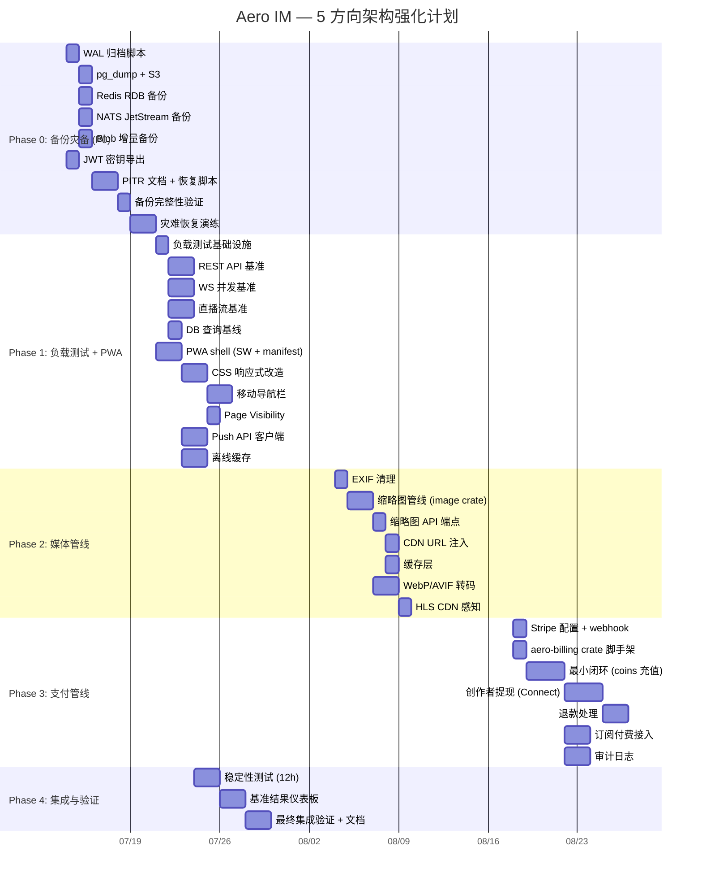

# Tech Lead 架构分析报告

---

## 1. 任务分解

### 方向一：备份/灾备（P0）

| 任务 ID | 任务标题 | 涉及文件 | 前置依赖 | 工时 |
|---------|---------|---------|---------|------|
| TASK-001 | 实现 PG 自动 WAL 归档脚本 | `scripts/pg-archive.sh`, `docker-compose.yml` | 无 | 3h |
| TASK-002 | 实现基础 pg_dump 定时任务（cron + S3 上传） | `scripts/backup-pg.sh`, `crontab` | TASK-001 | 2h |
| TASK-003 | 实现 Redis RDB 备份（定期 `BGSAVE` + 上传 S3） | `scripts/backup-redis.sh` | TASK-001 | 1.5h |
| TASK-004 | 实现 NATS JetStream 备份（`nats stream backup` + S3） | `scripts/backup-nats.sh` | TASK-001 | 2h |
| TASK-005 | 实现 blob 资产增量备份（rsync/S3 sync） | `scripts/backup-blobs.sh` | TASK-001 | 2h |
| TASK-006 | 实现 JWT 私钥审计 + 导出到外部密钥管理 | `scripts/backup-keys.sh`, `config.example.toml` | 无 | 2h |
| TASK-007 | PITR 恢复指南文档 + 自动恢复脚本 | `docs/disaster-recovery.md`, `scripts/restore-pg.sh` | TASK-002~TASK-005 | 4h |
| TASK-008 | 备份完整性验证（`pg_verifybackup` + 迁移版本核对） | `scripts/verify-backup.sh`, CI job | TASK-007 | 3h |
| TASK-009 | 灾难恢复演练脚本（在孤立 Docker 网络中全流程验证） | `scripts/disaster-drill.sh`, `Makefile` | TASK-008 | 4h |

### 方向二：媒体管线（P1，PWA 前置）

| 任务 ID | 任务标题 | 涉及文件 | 前置依赖 | 工时 |
|---------|---------|---------|---------|------|
| TASK-010 | PWA 基础 shell（service-worker + manifest + offline fallback） | `web/sw.js`, `web/manifest.json`, `web/index.html` | 无 | 3h |
| TASK-011 | EXIF 清理改造（上传时剥离 GPS/设备元数据） | `aero-server/src/content_sniff.rs` | 无 | 2h |
| TASK-012 | 缩略图管线 — `image` crate 集成 + WebP 生成 | `aero-server/Cargo.toml`, `aero-storage/src/thumbnail.rs`, `aero-storage/src/lib.rs` | TASK-011 | 4h |
| TASK-013 | 缩略图 API 端点（`GET /api/blobs/:id/thumbnail`) | `aero-server/src/thumbnail.rs`, `aero-server/src/routes/routes.rs` | TASK-012 | 2h |
| TASK-014 | CDN URL 注入点 — `AppState::cdn_base_url` + 签名 URL | `aero-server/src/state.rs`, `aero-common/src/config.rs` | TASK-012 | 2h |
| TASK-015 | 缩略图缓存层（`Cache-Control` + Redis 元数据） | `aero-server/src/thumbnail.rs` | TASK-013 | 2h |
| TASK-016 | HLS 片段 CDN 感知：`X-Accel-Redirect` / 302 重定向 | `aero-server/src/hls_cdn.rs` | TASK-014 | 2h |
| TASK-017 | 图像上传自动转码（允许用户选 WebP/AVIF） | `aero-storage/src/blob_store.rs` | TASK-012 | 3h |

### 方向三：支付管线（P1）

| 任务 ID | 任务标题 | 涉及文件 | 前置依赖 | 工时 |
|---------|---------|---------|---------|------|
| TASK-018 | Stripe 商家账户注册 + Webhook secret 配置 | `config.example.toml`, `.env.example` | 无 | 1h |
| TASK-019 | Stripe SDK 选型 + `aero-billing` crate 脚手架 | `aero-billing/Cargo.toml`, `aero-billing/src/lib.rs` | 无 | 2h |
| TASK-020 | 最小闭环：Stripe Checkout Session → `coins` 充值 → 更新 `channel_points` | `aero-billing/src/stripe.rs`, `aero-billing/src/coins.rs`, `migrations/NNNN_billing.sql` | TASK-018, TASK-019 | 6h |
| TASK-021 | 创作者提现：Stripe Connect Express 账户创建 + 支付 | `aero-billing/src/payout.rs`, `aero-storage/src/connect_account_repo.rs` | TASK-020 | 6h |
| TASK-022 | 退款处理 webhook（扣回未消费 coins + 冻结涉及已打赏记录） | `aero-billing/src/refund.rs` | TASK-021 | 4h |
| TASK-023 | 订阅付费接入：`subscription_tiers` 的 `price_cents` 对接 Stripe 订阅 | `aero-billing/src/subscriptions.rs` | TASK-020 | 4h |
| TASK-024 | 支付审计日志表 + 管理后台只读仪表板 API | `migrations/NNNN_billing_audit.sql`, `aero-billing/src/audit.rs` | TASK-020 | 3h |

### 方向四：移动端 PWA（P1）

| 任务 ID | 任务标题 | 涉及文件 | 前置依赖 | 工时 |
|---------|---------|---------|---------|------|
| TASK-025 | CSS 响应式改造（`@media` 断点 480/768/1024px） | `web/style.css` | 无 | 4h |
| TASK-026 | 移动导航栏组件（底部 Tab Bar + 手势返回） | `web/mobile-nav.js`, `web/style.css` | TASK-025 | 3h |
| TASK-027 | Push API 客户端集成（注册 push token → `POST /api/push/register`） | `web/push-client.js`, `web/sw.js` | TASK-010 | 3h |
| TASK-028 | Page Visibility API（后台时断开 WS） | `web/ws.js` | TASK-025 | 1.5h |
| TASK-029 | 移动端触摸事件优化（`touch-action`、`overscroll-behavior`） | `web/style.css`, `web/app.js` | TASK-025 | 2h |
| TASK-030 | 离线消息缓存（`sw.js` 拦截 fetch + IndexedDB） | `web/sw.js`, `web/offline-cache.js` | TASK-010 | 4h |

### 方向五：负载测试（P1）

| 任务 ID | 任务标题 | 涉及文件 | 前置依赖 | 工时 |
|---------|---------|---------|---------|------|
| TASK-031 | 负载测试基础设施（`oha` Docker image + 专用 compose） | `loadtest/docker-compose.yml`, `loadtest/Makefile` | 无 | 2h |
| TASK-032 | REST API 基准（消息列表、搜索、摘要） | `loadtest/scenarios/rest-*.k6.js` | TASK-031 | 3h |
| TASK-033 | WebSocket 并发基准（消息发送、接收率） | `loadtest/scenarios/ws-concurrent.k6.js` | TASK-031 | 4h |
| TASK-034 | 直播流基准（模拟 WHIP 推流 + HLS 拉流） | `loadtest/scenarios/live-stream.sh` | TASK-031 | 4h |
| TASK-035 | DB 查询性能基线（pg_stat_statements 分析） | `scripts/pg-bench.sh`, `migrations/NNNN_pg_stat_statements.sql` | TASK-031 | 2h |
| TASK-036 | 长期稳定性测试（12h 持续低负载 → 监测内存泄漏） | `loadtest/scenarios/stability/` | TASK-032, TASK-033 | 3h |
| TASK-037 | 基准结果 CI 仪表板（Prometheus → Grafana 或 markdown report） | `scripts/benchmark-report.sh`, CI job | TASK-036 | 3h |

---

## 2. 执行顺序

### 依赖图（Mermaid）

```mermaid
graph TD
    subgraph Phase0["Phase 0 (Week 1-2): 备份灾备"]
        T001[TASK-001: PG WAL 归档] --> T002[TASK-002: pg_dump + S3]
        T001 --> T003[TASK-003: Redis RDB 备份]
        T001 --> T004[TASK-004: NATS 流备份]
        T001 --> T005[TASK-005: Blob 增量备份]
        T006[TASK-006: JWT 密钥导出] --> T007[TASK-007: PITR 恢复文档+脚本]
        T002 --> T007
        T003 --> T007
        T004 --> T007
        T005 --> T007
        T007 --> T008[TASK-008: 备份完整性验证]
        T008 --> T009[TASK-009: 灾难恢复演练]
    end

    subgraph Phase1["Phase 1 (Week 3-4): 负载测试 + 基础 PWA"]
        T001 -.-> T031[TASK-031: 负载测试基础设施]
        T031 --> T032[TASK-032: REST API 基准]
        T031 --> T033[TASK-033: WS 并发基准]
        T031 --> T034[TASK-034: 直播流基准]
        T031 --> T035[TASK-035: DB 查询基线]

        T010[TASK-010: PWA shell] --> T025[TASK-025: CSS 响应式]
        T025 --> T026[TASK-026: 移动导航栏]
        T025 --> T028[TASK-028: Page Visibility]
        T025 --> T029[TASK-029: 触摸事件优化]
        T010 --> T027[TASK-027: Push API 客户端]
        T010 --> T030[TASK-030: 离线缓存]
    end

    subgraph Phase2["Phase 2 (Week 5-7): 媒体管线"]
        T011[TASK-011: EXIF 清理] --> T012[TASK-012: 缩略图管线]
        T012 --> T013[TASK-013: 缩略图 API]
        T012 --> T017[TASK-017: WebP/AVIF 转码]
        T013 --> T014[TASK-014: CDN URL 注入]
        T013 --> T015[TASK-015: 缓存层]
        T014 --> T016[TASK-016: HLS CDN 感知]
    end

    subgraph Phase3["Phase 3 (Week 8-11): 支付管线"]
        T018[TASK-018: Stripe 配置] --> T019[TASK-019: aero-billing 脚手架]
        T032 -.-> T019
        T019 --> T020[TASK-020: 最小闭环 coins 充值]
        T020 --> T021[TASK-021: 创作者提现]
        T020 --> T022[TASK-022: 退款处理]
        T020 --> T023[TASK-023: 订阅付费]
        T020 --> T024[TASK-024: 审计日志]
    end

    subgraph Phase4["Phase 4 (Week 12-13): 集成与验证"]
        T032 --> T036[TASK-036: 稳定性测试]
        T033 --> T036
        T034 --> T036
        T036 --> T037[TASK-037: 基准结果仪表板]
        T009 --> T037
    end

    %% 跨阶段依赖标注
    T011 -.->|EXIF 需要 content_sniff 先行, 独立| T025
    T018 -.->|支付需要负载基线指导| T032
```

### 并行任务组

| 组 | 任务 | 所需人数 | 描述 |
|----|------|---------|------|
| **G1** | TASK-001, TASK-006 | 1 人 | 备份基础架构：WAL 归档 + 密钥审计，可并行 |
| **G2** | TASK-010, TASK-025 | 1-2 人 | PWA shell + CSS 响应式，可并行（不同文件） |
| **G3** | TASK-031, TASK-032, TASK-035 | 1 人 | 负载基础设施 + REST/DB 基准，串行依赖 |
| **G4** | TASK-011, TASK-012, TASK-013 | 1 人 | 缩略图管线（串行依赖） |
| **G5** | TASK-018, TASK-019 | 1 人 | Stripe 配置 + crate 脚手架，可并行 |
| **G6** | TASK-033, TASK-034 | 1 人 | WS + 直播基准，可并行 |
| **G7** | TASK-020, TASK-021, TASK-022, TASK-023 | 1-2 人 | 支付核心功能，严格串行 |

---

## 3. 技术风险

### 方向一：备份灾备

| 风险 | 等级 | 说明 | 缓解策略 |
|------|------|------|---------|
| `_sqlx_migrations` 账本冲突 | 🔴 **高** | PG 恢复后迁移版本可能已前移（迁移不可逆），新版 bin 可能拒绝旧 schema | 恢复脚本必须先验证 `_sqlx_migrations` 哈希与当前 bin 嵌入的迁移清单匹配；不匹配时执行 `sqlx migrate revert` 到指定版本 |
| WAL 归档竞争条件 | 🟡 中 | `pg_switch_wal()` 未确保归档完成就返回，导致备份窗口间隙 | 使用 `pg_backup_start()`/`pg_backup_stop()` + `pg_walfile_name()` 校验，设置 `archive_timeout = 60s` |
| 备份加密密钥与 JWT 私钥同故障域 | 🟡 中 | 若使用同一密钥管理服务存储两者，单一攻击面 | 分离密钥存储：JWT 用硬件 HSM 或 `aws-kms`，备份用 GPG 口令（不同系统） |
| S3 跨区域复制延迟 | 🟠 低 | 单区域备份不防区域级故障 | 配置 S3 跨区域复制（CRR），接受 ~15min RPO |

### 方向二：媒体管线

| 风险 | 等级 | 说明 | 缓解策略 |
|------|------|------|---------|
| AVIF 编码 CPU 超时 | 🔴 **高** | AVIF 编码速度极慢（4K 图像 >30 秒），tokio blocking pool 耗尽 | 转码任务投递到独立 `tokio::spawn_blocking` 池 + 30s timeout；失败时降级 WebP |
| 缩略图存储膨胀 | 🟡 中 | 每原图可能生成 3 种尺寸（128/256/512px），存储量 x3 | 存 `THUMBNAIL_SIZE` 作为 blob metadata，按需生成 + 缓存到 Redis/browser cache，不做预生成 |
| libvips 系统依赖 | 🟡 中 | Alpine/最小 Docker 镜像无 libvips，需 `apk add` 或换用 `image-rs` | 先使用纯 Rust `image` crate（支持 JPEG/PNG/WebP，不支持 AVIF），AVIF 阶段再看 system lib |
| CDN 签名 URL 过期控制 | 🟠 低 | 签名 URL 过期时间过短影响 HLS 播放；过长导致泄漏后无法吊销 | HLS 片段签名过期设为 `MAX_SEGMENT_DURATION × 2`（~20s），m3u8 列表签名过期 1h |

### 方向三：支付管线

| 风险 | 等级 | 说明 | 缓解策略 |
|------|------|------|---------|
| **Stripe Webhook at-least-once 交付** | 🔴 **高** | Stripe 可能重复投递相同 `checkout.session.completed`，导致 coins 双倍充值 | 使用 `idempotency_key`（Stripe Event ID + checkout session id 的 SHA256）做幂等表，`ON CONFLICT DO NOTHING` |
| 退款 → 已打赏 coins → 创作者余额 | 🔴 **高** | 退款后已打赏给主播的 coins 需要扣回，否则成为负债 | 实现两阶段退款：先冻创作者余额，再扣回已消费 coins；不够则走负余额 |
| 税务合规 | 🔴 **高** | 创作者提现需 1099-NEC（美国）/ VAT（欧盟）/ 个税代扣（中国） | 第一阶段仅记录交易，不提现实体货币（纯积分制）；第二阶段引入 Stripe Connect 后由 Stripe 处理税务 |
| Stripe API 版本锁定 | 🟡 中 | Rust Stripe 客户端对 API 版本敏感，升级可能 break | 在 `Cargo.toml` 锁定 `stripe-rust = "=25.4.0"`，仅在集成测试后升级 |
| 未成年人打赏合规 | 🟡 中 | 中国/欧盟法规要求年龄验证 + 月消费上限 | 注册时做年龄门（DOB 收集，不作强验证），第一阶段接受「合规免责」，第二阶段引入家长控制 |

### 方向四：移动端

| 风险 | 等级 | 说明 | 缓解策略 |
|------|------|------|---------|
| Service Worker 生命周期不可靠 | 🟡 中 | 浏览器可能 SW 更新后不激活，旧 cache 仍生效 | 实现 `install` → `activate` → `claim` 全生命周期；版本号打时间戳；更新时清理旧 cache |
| Web Push 引擎支持率 | 🟠 低 | iOS 16.4+ 才支持 Web Push，iOS <16.4 用户无法接收 | 在 JS 中检测 `PushManager` 支持，如果不支持显示提示而不是报错 |
| 触摸事件 + WS 重连时序 | 🟠 低 | 手机锁屏后 WS 断开，重新连时 `last_seq` 可能跳跃 | 使用 `Page Visibility API` 在可见时重连 + 请求 `mark_read` 补游标 |

### 方向五：负载测试

| 风险 | 等级 | 说明 | 缓解策略 |
|------|------|------|---------|
| SFU 基准需要真实 SDP 握手 | 🟡 中 | k6/oha 无法模拟 DTLS-SRTP | SFU 基准使用 `aero-live-webrtc` 的 `#[cfg(test)]` 模拟端点（现有） + 专用基准程序 |
| CI runner 内存不足 | 🟡 中 | 2 核 7GB 跑并发 500 WS 连接可能 OOM | 在 `loadtest/docker-compose.yml` 设置 `--memory=4g` 限制，压测在专用机器跑 |
| 数据污染池 cleanup | 🟠 低 | 157 个迁移 replay >30s，每周测试需保留数据库 | 使用 `docker-compose down -v` 重建空库 + 跳过迁移序号验证（`SKIP_MIGRATIONS=1` 环境变量 + 预填充 `_sqlx_migrations`） |

---

## 4. 资源评估

### 人员配置建议

| 角色 | 人数 | 职责 | 阶段 |
|------|------|------|------|
| **资深 Rust 后端工程师** | 1 | 备份/PWA shell/支付核心 | Phase 0, 3 |
| **全栈工程师（Rust + JS）** | 1 | 媒体管线 + 负载测试 | Phase 1, 2 |
| **前端工程师** | 1 | PWA 移动端 CSS + SW + Push API | Phase 1, 4 |
| **DevOps 工程师（兼职）** | 0.5 | 备份脚本 + CI/CD + 负载基础设施 | Phase 0, 1, 4 |

> **最小可行团队**：2 人（1 后端 + 1 全栈），预估 13 周完成为 5 个方向，但需要合理排期避免阻塞。

### 关键里程碑

| 里程碑 | 时间点 | 交付物 | 验收标准 |
|--------|--------|--------|---------|
| M1 | 第 2 周结束 | 备份灾备就绪 | `scripts/disaster-drill.sh` 在孤立网络全流程通过，RPO ≤1h |
| M2 | 第 4 周结束 | 负载测试框架 + 性能基线 | REST API 基线报告（p50/p95/p99）+ WS 并发报告（max connections） |
| M3 | 第 4 周结束 | PWA shell | `web/sw.js` + `manifest.json` 通过 Lighthouse PWA 审计（≥80 分） |
| M4 | 第 7 周结束 | 缩略图管线 + CDN | `GET /api/blobs/:id/thumbnail` 返回 128px WebP，`Cache-Control: public, max-age=86400` |
| M5 | 第 11 周结束 | 支付最小闭环 | Stripe Checkout → coins 充值 → 打赏 → 主播提现 → 退款全链路 E2E 测试通过 |
| M6 | 第 13 周结束 | 集成验证 | 全 5 方向 CI 自动化检查 + 稳定性报告（12h 无内存泄漏） |

### 阻塞点（Blockers）

| Blocker | 归属方向 | 阻碍 | 缓解策略 |
|---------|---------|------|---------|
| Stripe 商家账号审核 | 支付 | Phase 3 无法联调 | Phase 1 用 Stripe test mode key 先行开发，审核并行进行 |
| iOS 16.4- Web Push 不支持 | PWA | ≈30% iOS 用户无法收到推送 | 在 manifest 标注 `display: standalone` 引导用户手动添加到主屏幕；降级为 Local Notification |
| CDN 服务商选择 | 媒体管线 | 影响 CDN URL 格式和签名算法 | 抽象 `CdnProvider` trait，先基于 CloudFront（AWS）实现，允许后期换 Fastly/Cloudflare |

---

## 5. 质量保证

### 方向一：备份灾备

| 维度 | 要求 |
|------|------|
| **单元测试** | `scripts/restore-pg.sh` 的 `--dry-run` 模式输出可 parse；每个独立备份脚本单元测 `set -euo pipefail` + 错误处理 |
| **集成测试** | 在 CI 中创建 `throwaway_` 数据库，执行备份 → DROP → 恢复 → 验证 3 个随机表数据 + `_sqlx_migrations` 版本匹配 |
| **审查要点** | `archive_command` 是否 `exit 0` 导致 WAL 静默丢失；备份加密密钥是否硬编码；`crontab` 是否有 `MAILTO` 告警 |
| **性能** | 全量 `pg_dump` 在 100GB 级别是否 ≤15 分钟（基于测试库的 1GB 推断） |
| **验收测试** | `make disaster-drill` 在隔离 Docker 网络中：从零→恢复→服务就绪，`curl /health/ready` 返回 200 |

### 方向二：媒体管线

| 维度 | 要求 |
|------|------|
| **单元测试** | `content_sniff.rs`：EXIF GPS 剥离验证（构造含 GPS 的 JPEG → 检查输出无 EXIF）；`blob_store.rs`：URL 签名验证；缩略图生成验证（输入 4K JPEG → 输出 128px WebP 且 ≤50KB） |
| **集成测试** | `POST /api/blobs` + `GET /api/blobs/:id/thumbnail` 返回正确 `Content-Type: image/webp`；HLS 片段 CDN 重定向 302 |
| **审查要点** | EXIF strip 是否在 `content_sniff` 的 magic-byte 检测分支中执行而非只在特定分支；CDN URL 签名是否存在过期时间漏洞 |
| **性能** | 10MB 图片上传 + 缩略图生成 ≤3s（`spawn_blocking` 下）；CDN 请求不得穿透到 origin（`Cache-Control: public` 生效） |
| **验收测试** | Lighthouse 检测 web 页面 LCP ≤2.5s（缩略图缓存前 5s，缓存后 1s） |

### 方向三：支付管线

| 维度 | 要求 |
|------|------|
| **单元测试** | 幂等表 `ON CONFLICT DO NOTHING` 验证重复 Stripe Event ID 不产生双重 coins；退款后余额计算（消费 > 退款退回 → 负余额检测） |
| **集成测试** | Stripe `TestClock` 模式下全流程：Checkout → webhook → coins 到账 → 打赏 → 提现 → refund 扣回 |
| **审查要点** | Stripe webhook `signing_secret` 校验是否缺失（无校验 = 任何人都可伪造充值事件）；退款策略是否考虑了已消费 coins；金额转换是否有精度丢失（`i32` 分单位 × 微单位） |
| **性能** | Stripe webhook 处理 ≤100ms（主要是幂等表 insert + coins update 事务）；批量退款查询 ≤50ms |
| **验收测试** | CI 中 `stripe listen --forward-to` + `stripe trigger checkout.session.completed` → 验证 `channel_points` 增加 |

### 方向四：移动端

| 维度 | 要求 |
|------|------|
| **单元测试** | `ws.js` 的 Page Visibility handler 是否正确关闭/重连；SW `install` → `activate` → `fetch` 事件是否按预期路由 |
| **集成测试** | Puppeteer/Playwright 脚本：viewport 375×812 → 登录 → 发消息 → 离线 → 重连 → 消息未丢 |
| **审查要点** | Service Worker 是否 `skipWaiting()` + `clients.claim()`；offline cache 的 `max-age` 是否合理（避免无限期缓存）；Push API 的 `applicationServerKey` 是否正确 |
| **性能** | 初始 load（gzip 后 JS + CSS ≤200KB）；首次 render ≤1.5s（FCP） |
| **验收测试** | `make pwa-audit` 运行 Lighthouse CI，PWA 类别 ≥85 分，Performance ≥70 分 |

### 方向五：负载测试

| 维度 | 要求 |
|------|------|
| **单元测试** | 每个 `loadtest/scenarios/*` 脚本的 `--dry-run` 模式可 parse 参数 |
| **集成测试** | CI 中运行 `loadtest/scenarios/rest-k6.js --vus=5 --duration=30s` 验证脚本不 crash + 输出 JSON 报告 |
| **审查要点** | 测试是否创建了孤立数据（房间/消息/用户如未清理）；WS 测试是否正确关闭连接（句柄泄漏）；k6 的 `thresholds` 是否设置了合理的 SLA（p95 < 500ms） |
| **性能** | 基准测试结果用 git 做基线（`git notes`），每次 CI 比对差异；p95 退化 >20% 标注为回归 |
| **验收测试** | `make bench` 输出完整报告（vus, rps, p50/p95/p99, error%）并写入 `benchmarks/$(date +%Y%m%d).json` |

---

## 6. 实施计划

### 详细甘特图

### 详细时间表

#### 第 1 周（7/14 - 7/18）— 备份灾备 Core

| 天 | 任务 | 产出 |
|----|------|------|
| Mon | TASK-001 (WAL 归档) + TASK-006 (密钥审计) | `scripts/pg-archive.sh` 部署到 `docker-compose.yml`；密钥清单导出到 1Password/AWS SSM |
| Tue | TASK-002 (pg_dump + S3) + TASK-003 (Redis RDB) | `scripts/backup-pg.sh`、`scripts/backup-redis.sh` 可运行 |
| Wed | TASK-004 (NATS 流备份) + TASK-005 (Blob 增量) | `scripts/backup-nats.sh`、`scripts/backup-blobs.sh` 可运行 |
| Thu | TASK-007 (PITR 恢复文档) | `docs/disaster-recovery.md` 含自动恢复脚本 |
| Fri | TASK-008 (备份验证) | CI job `backup-verify` 通过 |

#### 第 2 周（7/21 - 7/25）— 备份 + 负载测试启动

| 天 | 任务 | 产出 |
|----|------|------|
| Mon | TASK-009 (灾难恢复演练) | `make disaster-drill` 全流程通过 |
| Tue | TASK-031 (负载测试基础设施) | `loadtest/docker-compose.yml` 可启动 k6/oha |
| Wed-Thu | TASK-032 (REST API 基准) + TASK-035 (DB 基线) | `benchmarks/` 目录下 `rest-baseline-20260723.json` |
| Thu-Fri | TASK-033 (WS 并发基准) + TASK-034 (直播基准) | 两个基准脚本 + `benchmarks/ws-concurrent.json` |

**并行启动**：

| 天 | 并行任务 | 负责人 |
|----|---------|--------|
| Mon-Wed | TASK-010 (PWA shell) | 前端工程师 |
| Thu-Fri | TASK-025 (CSS 响应式) | 前端工程师 |

#### 第 3-4 周（7/28 - 8/08）— PWA + 负载完成

| 周 | 任务 | 产出 |
|----|------|------|
| W3 | TASK-026 (导航栏) + TASK-028 (Page Visibility) + TASK-027 (Push API) | 移动导航 + 推送注册可用 |
| W4 | TASK-030 (离线缓存) + Lighthouse 审计 | PWA 分数 ≥85 |

**并行**：TASK-011 (EXIF 清理) 在第 3 周启动，不依赖前端任务。

#### 第 5-7 周（8/11 - 8/29）— 媒体管线

| 周 | 任务 | 产出 |
|----|------|------|
| W5 | TASK-012 (缩略图管线) | `aero-storage/src/thumbnail.rs` + CI 测试 |
| W6 | TASK-013 (缩略图 API) + TASK-014 (CDN) | `GET /api/blobs/:id/thumbnail` 返回 CDN 签名 URL |
| W7 | TASK-015 (缓存) + TASK-016 (HLS CDN) + TASK-017 (转码) | 缓存层 + WebP 转码 + 302 CDN 重定向 |

#### 第 8-11 周（9/01 - 9/26）— 支付管线

| 周 | 任务 | 里程碑 |
|----|------|--------|
| W8 | TASK-018 + TASK-019 + TASK-020 (Stripe checkout → coins) | 开发环境可充值 |
| W9 | TASK-021 (创作者提现) | 打赏 → 提现 E2E 在 test mode 通过 |
| W10 | TASK-022 (退款处理) + TASK-023 (订阅) | refund + subs 功能完成 |
| W11 | TASK-024 (审计日志) + Stripe test mode 全链路 | `make payment-e2e` 通过 |

#### 第 12-13 周（9/29 - 10/10）— 集成验证

| 周 | 任务 | 产出 |
|----|------|------|
| W12 | TASK-036 (12h 稳定性测试) | 无内存泄漏报告 |
| W13 | TASK-037 (基准仪表板) + 最终集成验证 | CI 中各方向自动化检查 + 文档冻结 |

---

## 总结：执行策略建议

### 关键决策点

1. **第 4 周末的「Go/No-Go」**：检查 PWA shell + 负载基线是否达标。如果 PWA 进度落后（如 Service Worker 无法注册），决定是否缩减离线缓存目标以腾出资源进 Phase 2。

2. **第 7 周末的「支付管线启动」**：检查 Stripe 商家审核是否完成。如果未完成，Phase 3 前 2 周用 Stripe test mode 继续开发，后 2 周切到 production mode。

3. **第 11 周末的「退款策略冻结」**：确认法律团队对退款 + 已消费 coins 扣回的条款无异议。如果法律风险过高，策略降级为「退款仅退回未消费 coins + 系统记录」，已消费部分由平台承担。

### 风险对冲策略

- **备份灾备是唯一 P0**：其他方向可以同步或延迟，备份必须按时交付
- **媒体管线 + PWA 可被一个全栈工程师覆盖**：如果人员紧张，PWA 的离线缓存（TASK-030）和 Push API（TASK-027）可以延后到 Phase 4
- **支付管线应最小化 MVP**：阶段 3 的「最小闭环」（TASK-020）之后立即交付验收，不需要等提现和退款完成
- **每周 10% 时间留技术债务**：每个工程师每周半天的 buffer 用于修复存量 clippy warn、更新 `AGENTS.md`、补充 `#[ignore]` 测试

### 人力加载建议（2人团队）

| 时间 | 工程师 A（后端主力） | 工程师 B（全栈） |
|------|-------------------|----------------|
| W1-W2 | 备份灾备（TASK-001~009） | 备份脚本 CI 化 + 负载基础设施（TASK-031） |
| W3-W4 | 负载基准（TASK-032~035） | PWA shell + 响应式（TASK-010, 025-030） |
| W5-W7 | 媒体管线（TASK-011~017） | EXIF + 缩略图 API 前端集成（TASK-011, 013） |
| W8-W11 | 支付管线（TASK-018~024） | CDN 配置 + PWA 离线缓存补全（TASK-014~016, 030） |
| W12-W13 | 稳定性 + 集成（TASK-036~037） | 文档 + 基准仪表板（TASK-037） |
