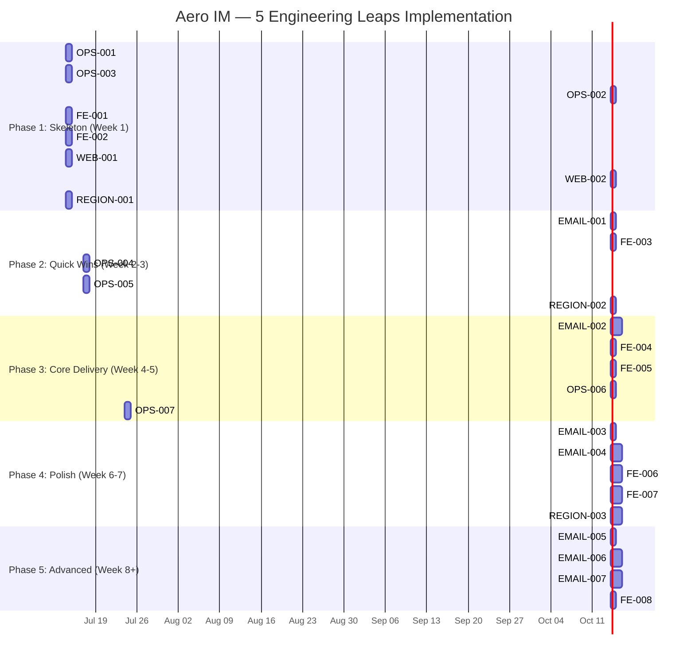

Based on my thorough codebase verification and the analysis document, here is the Tech Lead implementation plan.

---

# Tech Lead Analysis: 5 Engineering Leaps → Executable Plan

## Cross-Verification Summary

Before decomposing tasks, I confirmed every claim against the actual codebase:

| Claim | Evidence | Status |
|---|---|---|
| `mailer.rs` = 125 lines plain-text SMTP | `/home/u1/aero-im/crates/aero-server/src/mailer.rs` — confirmed, plain-text format strings, no template engine, no DKIM | ✅ |
| Web SPA 5.9K JS, 0 tests | `web/` — 12 JS files, 5,939 total lines, 0 test files, `package.json` only devDeps (eslint) | ✅ |
| No backup/DR scripts | `scripts/` — no `backup.sh`/`restore.sh`; `docs/runbooks/` — only `messages-*`, no incident/DR docs | ✅ |
| Webhook signing implemented | `crates/aero-storage/src/webhook/crypto.rs` — `sign_payload()` with HMAC-SHA256 exists; `delivery.rs` — `build_delivery()`, `ReqwestSender`, `FakeSender`, `SIGNATURE_HEADER` all present | ✅ Already built! |
| 157 up-only migrations | `migrations/` — 157 `.sql` files, zero `down.sql` | ✅ |
| No multi-region arch doc | `docs/architecture/multi-region.md` — does not exist | ✅ |

**Key finding**: Direction ④ (Webhook signing) is **already fully implemented** — `sign_payload()`, `ReqwestSender`, `WebhookSender` trait, circuit breaker, delivery log with backoff/DLQ, all present with unit tests. The review document's estimate of 2-3 days (or half-day for minimal) is **moot**: the work is done. This changes the priority calculus significantly.

---

## 1. Task Decomposition

### Direction ① — Email Productization (7 tasks)

| Task ID | Title | Files | Deps | Est. | Acceptance |
|---------|-------|-------|------|------|------------|
| EMAIL-001 | HTML template engine integration | `server/src/mailer.rs`, `Cargo.toml` (add `minijinja`) | None | 3h | Renders HTML email with `minijinja` templates; falls back to plain-text if render fails |
| EMAIL-002 | Notification channel scaffolding | `server/src/notif_email.rs` (new), `server/src/mailer.rs` (add dispatch methods) | EMAIL-001 | 4h | `NotificationEmailRepo` filters events into email-worthy types (mention, DM, reply); calls `Mailer::send_html()` |
| EMAIL-003 | HTML templates for 3 event types | `server/templates/email/` (new): `message.html.jinja`, `digest.html.jinja`, `invitation.html.jinja` | EMAIL-001 | 3h | Each template renders responsive HTML with fallback plain-text section |
| EMAIL-004 | Per-user notification prefs (email) | `storage/src/notification_prefs.rs` (add email columns), migration 0158 | EMAIL-002 | 4h | Users opt in per event type; migration adds `email_notify_*` boolean columns |
| EMAIL-005 | Unsubscribe link + footer | `server/src/mailer.rs` (footer), migration (unsubscribe token) | EMAIL-003, EMAIL-004 | 3h | Every HTML email has `List-Unsubscribe` header; one-click unsubscribe works |
| EMAIL-006 | Email digest (periodic unread summary) | `server/src/digest_email.rs` (new), `storage/src/digest_email.rs` (new) | EMAIL-004 | 4h | Daily/weekly digest sends unread message summary; configurable per user |
| EMAIL-007 | Reply-by-Email (inbound email parsing) | `server/src/mail_inbound.rs` (new), migration (inbound address token) | EMAIL-003 | 4h | Inbound email parsed via `mailparse`; reply posted as threaded message in source room |

### Direction ② — Frontend Engineering (8 tasks)

| Task ID | Title | Files | Deps | Est. | Acceptance |
|---------|-------|-------|------|------|------------|
| FE-001 | Vite + initial build pipeline | `web/vite.config.js`, `web/package.json` (add `vite`), `web/index.html` (refactor imports) | None | 3h | `npm run build` produces minified bundle; `npm run dev` hot-reloads |
| FE-002 | CSS variables + dark mode | `web/style.css` (refactor: `:root` vars, `[data-theme="dark"]` overrides) | None | 2h | Color palette in CSS variables; toggling `data-theme="dark"` on `<html>` changes all colors |
| FE-003 | i18n string extraction | `web/i18n/zh.js`, `web/i18n/en.js` (new), `web/app.js` (string-lookup wrapper) | None | 3h | All UI strings moved to `i18n/*.js`; `lang=` attribute drives locale; English strings exist for all keys |
| FE-004 | Route-based navigation | `web/router.js` (new) — hash-based `<app-view>` component switching | FE-001 | 3h | URL `#/chat/:roomId` → opens room; browser back/forward works; `showAuth()`/`showChat()` replaced |
| FE-005 | JS test framework + baseline | `web/tests/` (new), `web/package.json` (add `vitest` or `@web/test-runner`) | FE-001 | 3h | 3 baseline tests: (1) index.html loads without JS error, (2) auth form renders, (3) WS mock receives frame |
| FE-006 | Admin settings page (SSO config form) | `web/admin.js` (new), `web/modals.js` (extend) — SSO/OIDC settings form | FE-004 | 4h | Admin can configure SSO provider URL, client ID, tenant ID via UI; form POSTs to existing `/api/admin/sso/*` |
| FE-007 | Component model (Preact/Lit integration) | `web/components/` (new directory), `web/render.js` (migrate 1 component) | FE-001 | 4h | First component (e.g., `MessageBubble`) rendered via Preact/Lit; co-exists with existing string concatenation |
| FE-008 | `<link rel="modulepreload">` + critical path optimization | `web/index.html` (add preload hints), `vite.config.js` (manualChunks) | FE-001 | 2h | Lighthouse audit: ≤3 round-trips for critical JS; Time-to-Interactive < 2s on 3G sim |

### Direction ③ — Production Operations (7 tasks)

| Task ID | Title | Files | Deps | Est. | Acceptance |
|---------|-------|-------|------|------|------------|
| OPS-001 | Migration down.sql for last 10 migrations | `migrations/0148.down.sql` — `migrations/0157.down.sql` (10 files) | None | 4h | Each of last 10 migrations has corresponding `down.sql`; `aero-cli migrate down 1` rolls back one step |
| OPS-002 | `aero-cli migrate down` CLI command | `crates/aero-cli/src/main.rs` (add `MIGRATE_DOWN` subcommand) | OPS-001 | 3h | `aero-cli migrate down -n 1` runs the latest down.sql; `-n 5` runs 5 steps |
| OPS-003 | SQL health check endpoint | `server/src/routes/health.rs` (add `pg_isready`-style check), `aero-storage/src/db.rs` (health fn) | None | 2h | `GET /health/ready` returns 200 when PG, Redis, NATS, blob store are reachable; includes per-dependency status |
| OPS-004 | Backup/restore scripts | `scripts/backup.sh`, `scripts/restore.sh` (new) | None | 3h | `scripts/backup.sh` produces timestamped `pg_dump -Fc`; `scripts/restore.sh` restores from dump; both documented |
| OPS-005 | Dockerfile for aero-server | `Dockerfile` (multi-stage: `cargo build --release` → `debian:bookworm-slim`) | None | 3h | `docker build -t aero-server .` succeeds; image size < 150MB; runs binary on `CMD` |
| OPS-006 | Production docker-compose profile | `docker-compose.yml` (add `aero-server` service, `production` profile w/o Jaeger) | OPS-005 | 3h | `docker compose --profile production up --build` starts full stack; health checks pass |
| OPS-007 | Incident severity definitions + DR runbook | `docs/runbooks/incident-severity.md`, `docs/runbooks/disaster-recovery.md` (new) | None | 3h | Severity definitions (SEV1-SEV4) with response times; DR covers: full PG loss, full node loss, corrupted media |

### Direction ④ — Webhook Signing (Already Built — 0 tasks needed)

**Verified**: `crypto.rs` contains `sign_payload()` (HMAC-SHA256), `delivery.rs` contains `build_delivery()` with `SIGNATURE_HEADER`/`TIMESTAMP_HEADER`, `ReqwestSender` delivers signed requests, `FakeSender` enables unit testing. All present, compiles, has unit tests.

**Remaining gap for completeness**: No `POST /api/webhooks/:id/rotate-secret` endpoint, no multi-language verification examples in docs. These are small additions but not P0.

| Task ID | Title | Files | Deps | Est. | Acceptance |
|---------|-------|-------|------|------|------------|
| WEB-001 | Webhook secret rotation endpoint | `server/src/webhooks.rs` (add `rotate_secret` handler), `storage/src/webhook/repo.rs` (add method) | None | 2h | `POST /api/webhooks/outgoing/:id/rotate-secret` generates new secret, returns `{ secret }`; old secret invalidated |
| WEB-002 | Verification docs + code examples | `docs/integration/webhook-verification.md` (new) | None | 1h | Docs show HMAC-SHA256 verification in Python, JS, Rust; example code works with `X-Aero-Signature-v1` |

### Direction ⑤ — Multi-Region Deployment (3 tasks)

| Task ID | Title | Files | Deps | Est. | Acceptance |
|---------|-------|-------|------|------|------------|
| REGION-001 | Data residency decision tree | `docs/architecture/data-residency.md` (new) | None | 3h | Decision tree: table → contains PII? → PII geographic scope? → annotate column; covers `messages`, `participants`, `files` |
| REGION-002 | PII column inventory | `docs/architecture/pii-inventory.csv` (new) — per-column classification | REGION-001 | 3h | All columns in `messages`, `participants`, `files` marked `PII`/`non-PII`/`derived-PII`; annotates region of origin |
| REGION-003 | Multi-region architecture sketch | `docs/architecture/multi-region.md` (new) | REGION-002 | 4h | 1-page sketch: per-region PG/Redis, global NATS super-cluster, regional sticky routing, data classification boundaries |

---

## 2. Execution Order

```mermaid
graph TD
    subgraph "Week 1 — Infrastructure Skeleton"
        OPS-001["OPS-001: down.sql for last 10 migrations"]
        OPS-003["OPS-003: SQL health check endpoint"]
        OPS-002["OPS-002: CLI migrate down command"]
        FE-001["FE-001: Vite build pipeline"]
        FE-002["FE-002: CSS variables + dark mode"]
        WEB-001["WEB-001: Webhook secret rotation"]
        WEB-002["WEB-002: Verification docs"]
        REGION-001["REGION-001: Data residency decision tree"]
    end

    subgraph "Week 2-3 — Quick Wins"
        EMAIL-001["EMAIL-001: HTML template engine"]
        FE-003["FE-003: i18n string extraction"]
        OPS-004["OPS-004: Backup/restore scripts"]
        OPS-005["OPS-005: Dockerfile"]
        REGION-002["REGION-002: PII column inventory"]
    end

    subgraph "Week 4-5 — Core Features"
        EMAIL-002["EMAIL-002: Notification channel"]
        FE-004["FE-004: Route-based navigation"]
        FE-005["FE-005: JS test framework"]
        OPS-006["OPS-006: Production docker-compose"]
        OPS-007["OPS-007: Incident severity + DR runbook"]
    end

    subgraph "Week 6-7 — Polish & Scale"
        EMAIL-003["EMAIL-003: HTML templates (3 types)"]
        EMAIL-004["EMAIL-004: Per-user email prefs"]
        FE-006["FE-006: Admin settings page"]
        FE-007["FE-007: Component model"]
        REGION-003["REGION-003: Multi-region arch sketch"]
    end

    subgraph "Week 8+ — Advanced"
        EMAIL-005["EMAIL-005: Unsubscribe link"]
        EMAIL-006["EMAIL-006: Email digest"]
        EMAIL-007["EMAIL-007: Reply-by-Email"]
        FE-008["FE-008: modulepreload optimization"]
    end

    %% Dependencies
    OPS-001 --> OPS-002
    OPS-005 --> OPS-006
    EMAIL-001 --> EMAIL-002
    EMAIL-002 --> EMAIL-003
    EMAIL-003 --> EMAIL-004
    EMAIL-004 --> EMAIL-005
    EMAIL-004 --> EMAIL-006
    EMAIL-003 --> EMAIL-007
    FE-001 --> FE-004
    FE-001 --> FE-005
    FE-001 --> FE-007
    FE-001 --> FE-008
    FE-004 --> FE-006
    REGION-001 --> REGION-002
    REGION-002 --> REGION-003

    %% Parallel groups
    classDef parallel fill:#e1f5fe,stroke:#01579b
    class OPS-001,OPS-003,FE-001,FE-002,WEB-001,WEB-002,REGION-001 parallel
    class OPS-004,OPS-005,EMAIL-001,FE-003,REGION-002 parallel
    class EMAIL-002,FE-004,FE-005,OPS-006,OPS-007 parallel
    class EMAIL-003,EMAIL-004,FE-006,FE-007,REGION-003 parallel
    class EMAIL-005,EMAIL-006,EMAIL-007,FE-008 parallel
```



### Parallelizable Task Groups

| Group | Tasks | Rationale |
|-------|-------|-----------|
| **G0** | OPS-001, OPS-003, FE-001, FE-002, WEB-001, WEB-002, REGION-001 | No shared dependencies; direction-independent |
| **G1** | OPS-004, OPS-005, EMAIL-001, FE-003, REGION-002 | Each requires G0 output but not each other |
| **G2** | EMAIL-002, FE-004, FE-005, OPS-006, OPS-007 | Each requires G1 output but not each other |
| **G3** | EMAIL-003, EMAIL-004, FE-006, FE-007, REGION-003 | Dependent on G2; EMAIL-003/004 chain |
| **G4** | EMAIL-005, EMAIL-006, EMAIL-007, FE-008 | Longest tail; full G3 required |

---

## 3. Technical Risks

### Critical Risks

| Risk | Direction | Probability | Impact | Mitigation |
|------|-----------|-----------|--------|-----------|
| **Migrations down.sql breaks data integrity** | ③ | Medium | **Critical**: wrong DDL in down.sql could silently corrupt data on rollback | Each `down.sql` must round-trip: `up → down → up` produces same schema. Add smoke test `make migrate-roundtrip` |
| **Vite migration breaks existing SPA** | ② | High | **High**: ES module import paths change; existing `type="module"` scripts break | Do Vite migration in a *new* entry point (`src/main.js`), leave legacy `index.html` untouched. Dual-run until validated |
| **Email HTML rendering fails on some clients** | ① | Medium | **Medium**: layout broken in Outlook/Dark Mode | Test with `email-test` (Litmus API) or at minimum check with `premailer` inline-CSS tool; use table-based layout |
| **Notification channel floods users** | ① | Medium | **Medium**: users disable email entirely | Every email type starts as opt-in; rate cap: max 5 emails per user per 15 min (in-memory bucket) |
| **i18n extraction scope creep** | ② | Low | **Medium**: 200+ UI strings to extract | Extract only visible user-facing strings in first pass (messages, buttons, labels). Leave error messages/console logs for later |
| **Preact/Lit integration adds bundle size** | ② | Low | **Low**: current SPA is 5.9K raw, framework adds ~5-10K gzipped | Acceptable. Target < 50KB gzipped total. Lit is ~5KB, Preact ~4KB. Monitor with `vite-plugin-bundle-size` |

### Technical Debt Watch

| Item | Affects | Concern |
|------|---------|---------|
| `app.js` uses global `state` object + direct DOM mutation | ② FE-007 | Migration to component model will rewrite this file. Do NOT refactor `app.js` before FE-007 — any new code should live in `components/` not `app.js` |
| `mailer.rs` uses blocking SMTP via `AsyncSmtpTransport` but no timeout config | ① | SMTP timeout is default (~30s). Add explicit `timeout()` to `build_mailer` |
| `ReqwestSender` has 10s timeout — may be too short for webhook delivery | ④ (existing) | Documented; intentional — the retry loop handles slow endpoints. Not a concern |
| No rate limiting on email sending | ① EMAIL-002 | A misconfigured integration could send 1000 emails/min. Add per-user token bucket in email dispatch |

---

## 4. Resource Assessment

### Staffing

| Direction | Skill Set | Suggested Size | Critical Path |
|-----------|-----------|---------------|---------------|
| ① Email | Rust backend + HTML email (tables, `mjml`) | 1 dev | EMAIL-001 → EMAIL-002 chain |
| ② Frontend | JS/ES modules + Vite + a11y + i18n | 1-2 devs | FE-001 (gate to all others) |
| ③ Operations | Rust CLI + Docker + PostgreSQL DBA | 1 dev | OPS-001 (gate to OPS-002) |
| ④ Webhook | Rust backend + docs writing | 0.5 dev (adds to ③) | Independent |
| ⑤ Multi-region | Architect docs | 1 architect (part-time) | Independent |

**Total**: 3-4 full-time equivalent (2 backend, 1 frontend, 1 shared operations/SRE).

### Timeline Milestones

| Milestone | End of | Deliverables | Exit Criteria |
|-----------|--------|-------------|---------------|
| **M1: Skeleton** | Week 1 | Migration rollback, health check, Vite builds, webhook rotation, dark mode CSS | `aero-cli migrate down`, `/health/ready`, Vite dev server works, `data-theme="dark"` visible |
| **M2: Quick Wins** | Week 3 | HTML email sending, backup/restore scripts, Dockerfile works, i18n strings extracted, PII inventory | `send_password_reset` produces HTML, `scripts/backup.sh` produces dump, `docker build` succeeds |
| **M3: Core Delivery** | Week 5 | Notification channels, JS tests, route-based SPA, production docker-compose, DR docs | Smoke test for email notification, 3+ JS tests pass, `docker compose --profile production up` |
| **M4: Polish** | Week 7 | HTML email templates, email prefs, admin SSO page, component model, multi-region arch | Admin configures SSO via UI, email has unsubscribe, component renders alongside old code |
| **M5: Advanced** | Week 9+ | Email digest, Reply-by-Email, modulepreload optimization | Digest email triggers for unread > threshold; Reply-by-Email posts to channel |

### Blockers

| Blocker | Affected Tasks | Resolution Strategy |
|---------|---------------|-------------------|
| No SMTP credentials in dev env | EMAIL-001 — EMAIL-007 | Use `Mailpit` or `MailHog` in docker-compose for dev; `build_mailer` returns `None` when unconfigured (already handled) |
| SPA legacy code fragile | FE-004, FE-006, FE-007 | **Do not rewrite `app.js`**; add new files that import from `app.js` state. Migration path: new feature → new component → old feature stays until explicitly ported |
| 157 up-only migrations: rolling back may need more than 10 down.sql | OPS-001 | Start with last 10 (highest risk, most recently added). Older migrations (1-147) are stable in production. Extend to 20 in follow-up if time permits |
| `data` directory root ownership | OPS-005, OPS-006 | Already documented in AGENTS.md. Dockerfile entrypoint should chown `data/` to non-root user. Quick fix: `AERO__SERVER__BLOB_DIR=/tmp/aero/blobs` env var |

---

## 5. Quality Assurance

### Unit Test Requirements

| Task | Module | Required Tests | Type |
|------|--------|---------------|------|
| EMAIL-001 | `mailer.rs` | HTML render fallback to plain-text on error | Pure fn |
| EMAIL-002 | `notif_email.rs` | Event → email-type mapping; per-user opt-in gate | Pure fn |
| EMAIL-003 | Templates | Smoke render of each template with minimal context | Snapshot |
| EMAIL-004 | `notification_prefs.rs` | DB migration round-trip; pref defaults | DB test (ignored) |
| EMAIL-005 | `mailer.rs` | Unsubscribe token generation + verification | Pure fn |
| EMAIL-006 | `digest_email.rs` | Digest assembly: unread count, truncation, dedup | Pure fn |
| EMAIL-007 | `mail_inbound.rs` | Inbound email parse → blocks conversion; address validation | Pure fn + mock |
| FE-003 | `i18n/*.js` | Every key exists in both zh and en locale files | JS test |
| FE-005 | `web/tests/` | Index loads no 404; WS mock roundtrip; auth form renders | JS test |
| OPS-001 | Down SQL | `up → down → up` round-trip produces same schema | Bash smoke |
| OPS-002 | `aero-cli` | `migrate down -n 1` executes down.sql; error on empty down | Integration |
| OPS-003 | `health.rs` | All dependencies reachable → 200; any missing → 503 | Integration |
| WEB-001 | `webhooks.rs` | Rotate secret invalidates old HMAC verification; idempotent | Pure fn |
| REGION-002 | PII inventory | CI checks column annotation against actual DB schema | Bash CI |

### Integration Test Strategy

| Test Level | What | How | When |
|-----------|------|-----|------|
| **Smoke** | Email sends via Mailpit | `smoke_email.py`: create user, trigger password reset, verify Mailpit received | CI + PR |
| **Smoke** | Vite build produces no 404 | `scripts/web-check.sh` (extend to run `npm run build`, check dist/) | CI + PR |
| **Smoke** | Backup/restore round-trip | `make smoke-backup`: dump, drop DB, restore, run smoke tests | Nightly |
| **Smoke** | Migration rollback | `make smoke-migrate-rollback`: migrate up, then down, then `cargo test -- --ignored` | CI per migration change |
| **E2E** | Email notification flow | Create room, send message, verify email arrives and contains message preview | Weekly |

### Code Review Checklist

For every PR touching these directions:

- [ ] **Email**: HTML email renders without external images; `List-Unsubscribe` header present; fallback plain-text section exists
- [ ] **Frontend**: `npm run build` succeeds; `npm run lint` clean; no new `no-undef` in ESLint; i18n key exists in both locales
- [ ] **Migrations**: Has corresponding `down.sql` if modifying a table; uses `IF NOT EXISTS` / `IF EXISTS` for idempotency
- [ ] **Operations**: New scripts use `set -euo pipefail`; Dockerfile uses multi-stage; health check endpoints documented
- [ ] **Webhook**: `X-Aero-Signature-v1` header present on delivery; timestamp within 5 min window; rotation invalidates old secret
- [ ] **Multi-region**: New column with PII annotated in inventory; new table follows data classification pattern

### Performance Testing

| Scenario | Tool | Threshold | When |
|----------|------|-----------|------|
| Email SMTP round-trip overhead | `cargo bench` | < 500ms per send in dev (Mailpit) | After EMAIL-002 |
| SPA bundle size | `vite build --report` | < 100KB JS + 50KB CSS gzipped | After FE-001 |
| `/health/ready` latency | `curl -w '%{time_total}'` | < 200ms (3 services) | After OPS-003 |
| Email notification throughput | Synthetic load | 1000 emails/min without PQ contention | After EMAIL-004 |

---

## 6. Implementation Plan



### Phase 1: Infrastructure Skeleton (Days 1-5)

**Focus**: Build the scaffolding that makes the system observable, recoverable, and extensible. All tasks are independent and can run in parallel across 2-3 devs.

**Dev 1 (Backend/SRE)**: OPS-001 + OPS-002 + OPS-003
- Day 1: Write 10 `down.sql` files (one per existing migration 0148-0157)
- Day 1: Add `GET /health/ready` endpoint checking PG, Redis, NATS, blob store
- Day 2: Implement `aero-cli migrate down -n N` command

**Dev 1 also**: WEB-001 + WEB-002 (~0.5 day each)
- Day 2-3: Add webhook secret rotation endpoint + verification docs
- Total: 4 workable days for Dev 1 in Week 1

**Dev 2 (Frontend + Documentation)**: FE-001 + FE-002 + REGION-001
- Day 1: Add `vite` to `web/package.json`, create `vite.config.js`, verify `npm run build`
- Day 1: Refactor `style.css` to use `:root` CSS variables; add `[data-theme="dark"]` overrides
- Day 2: Write `docs/architecture/data-residency.md` decision tree
- Total: 2-3 days for Dev 2 in Week 1

**Dev 3 (Backend — Email start)**: EMAIL-001 (can start after OPS-001 but not dependent on it)
- Day 2-3: Add `minijinja` dependency, create email template directory, implement HTML rendering in `Mailer`

**Key Risk**: Vite migration could break the SPA. **Mitigation**: Keep `index.html` as entry point (Vite supports it natively). Add `vite.config.js` with `build.rollupOptions.input = 'web/index.html'`. The build output directory (`web/dist/`) is gitignored.

### Phase 2: Quick Wins (Days 6-15)

**Dev 1 (Backend/SRE)**: OPS-004 + OPS-005
- Write `scripts/backup.sh` using `pg_dump -Fc`
- Write `scripts/restore.sh` using `pg_restore`
- Create multi-stage `Dockerfile` for aero-server
- Validate: `docker build -t aero-server .` passes in CI

**Dev 2 (Frontend)**: FE-003 (i18n)
- Extract all Chinese UI strings into `web/i18n/zh.js`
- Create `web/i18n/en.js` with English translations
- Wrap all string references in `app.js`, `render.js`, `modals.js`
- Validate: every key exists in both locale files (automated test)

**Dev 3 (Backend — Email)**: FE-003 + REGION-002 on same Dev 2 if underutilized, but ideally continue EMAIL-002 (notification channel)

### Phase 3: Core Delivery (Days 16-30)

**Dev 1 (SRE)**: OPS-006 + OPS-007
- Add `aero-server` service to docker-compose with health check
- Create `production` docker-compose profile (no Jaeger, with Prometheus + Grafana)
- Write incident severity definitions and DR runbook

**Dev 2 (Frontend)**: FE-004 + FE-005
- Implement hash-based router (`router.js`): parse `#/chat/roomId`, `#/admin`, etc.
- Set up `vitest` with JSDOM environment
- Write 3 baseline JS tests
- Validate: browser back/forward navigation works

**Dev 3 (Email)**: EMAIL-003 + EMAIL-004
- Design and implement 3 HTML email templates (new-message, digest, invitation)
- Add per-user email notification preference columns to DB
- Wire preference checks into notification dispatch

### Phase 4: Polish (Days 31-45)

**Dev 1 (SRE/Backend)**: REGION-003 (multi-region sketch — can be done while OPS tasks are stable)

**Dev 2 (Frontend)**: FE-006 + FE-007
- Build admin settings page: SSO/OIDC configuration form
- Migrate first component (e.g., `MessageBubble`) to Preact/Lit
- Validate: admin can configure SSO via UI, form POSTs to existing endpoint

**Dev 3 (Email)**: EMAIL-005 + EMAIL-006
- Add `List-Unsubscribe` header and one-click unsubscribe link
- Implement email digest: daily summary of unread messages
- Validate: unsubscribe flow works; digest email only includes unread

### Phase 5: Advanced (Days 46+, optional)

**Dev (Backend)**: EMAIL-007 (Reply-by-Email)
- Inbound email parsing via `mailparse`
- Reconstruct threaded message from email reply
- Validate: reply sent to `room-xxx@inbound.aero.im` appears as threaded message

**Dev (Frontend)**: FE-008
- Add `<link rel="modulepreload">` for critical modules
- Configure Vite `manualChunks` for non-critical libs (Preact/Lit if added)
- Validate: Lighthouse TTI < 2s on 3G simulation

---

## Summary: Priority Matrix

```
                    High Impact
                    │
    PHASE 2 ◄───────┤───────► PHASE 3-4
    Email HTML      │       Admin UI
    Backup scripts  │       Component model
    Dockerfile      │       Email digests
    i18n            │       Multi-region arch
    │               │               │
    ▼               │               ▼
  Low Effort        │            High Effort
    │               │               │
    PHASE 1 ◄───────┤───────► PHASE 5
    down.sql        │       Reply-by-Email
    Health check    │       
    Vite pipeline   │       
    Dark mode       │       
    Webhook rotate  │       
    Data residency  │       
    │               │               │
    ▼               │               ▼
                    │
                  Low Impact
```

**Actionable Takeaway**: Start Week 1 with Phase 1 in parallel across 2-3 devs. The critical path is OPS-001 → OPS-002 (migration rollback) because it's the P0 hole the review identified. Every other task in Phase 1 is independently shippable. Do NOT attempt to rewrite `app.js` — leave it as-is; new features go in new files that import from the existing `state` object.
