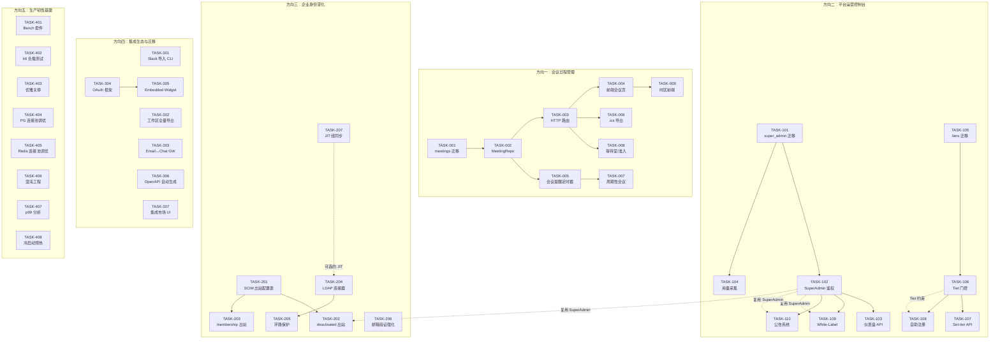
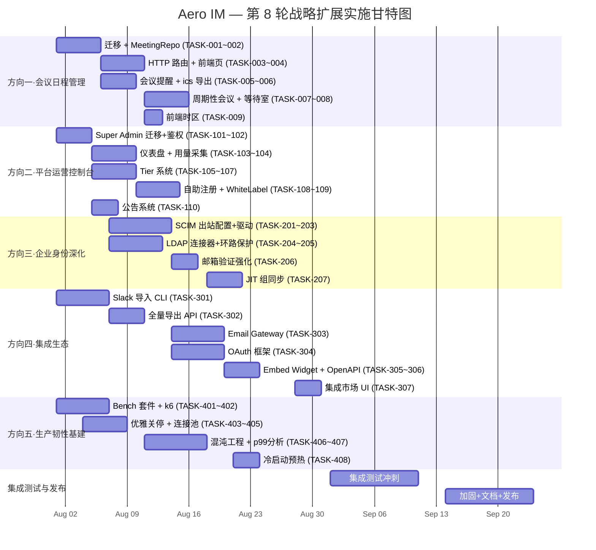

# Tech Lead 分析报告：第 8 轮全局扫描 — 5 个战略扩展方向

> **基于**: `docs/requirements/2026-07-11-round-8-global-scan-five-strategic-expansion-directions.md`
> **代码基线**: 上述文件所述时间点的源码树（16 crate, ~157 migrations, `aero-server` 为主入口）
> **分析日期**: 2026-07-12
> **角色**: Tech Lead

---

## 1. 任务分解（Task Decomposition）

### 方向一：会议日程管理（Meeting Scheduler & Calendar Integration）

| 任务 ID | 标题 | 涉及文件 | 前置依赖 | 工时 | 验收标准 |
|---------|------|----------|----------|------|----------|
| **TASK-001** | 迁移：`meetings` 表 + `meeting_participants` 表 | `migrations/0158_meetings.sql` | — | 2h | `CREATE TABLE IF NOT EXISTS meetings (id UUID PK, room_id, creator_id, title, start_at, end_at, timezone, recurring TEXT, status TEXT, created_at)`；`meeting_participants` 联表；幂等重跑 |
| **TASK-002** | 仓储：`MeetingRepo`（CRUD + list by room/participant + upcoming） | `crates/aero-storage/src/meeting.rs` + `lib.rs` | TASK-001 | 4h | 各方法 DB unit test（`#[ignore]` PG）；`list_upcoming` 按 start_at 排序；`create` 返回新 ID |
| **TASK-003** | HTTP 路由：`POST/GET /api/rooms/:id/meetings` + `GET/PATCH/DELETE /api/meetings/:id` | `crates/aero-server/src/meetings.rs` + `routes/routes.rs` `.merge` | TASK-002 | 4h | `assert_room_access` 守卫；创建校验 title ≤128/start_at>now；响应包含 `meeting_link: /meet/<id>`；路由在 `routes.rs` 注册 |
| **TASK-004** | 会议加入页：`GET /meet/:id` → 会议信息（录制入口/字幕/状态） | `web/meeting.js` + `web/index.html` 路由 | TASK-003 | 3h | 未登录跳认证；已登录显示会议元信息 + 加入按钮；过期会议显示状态 |
| **TASK-005** | 会议提醒：`run_meeting_reminder` 定时器（复刻 `scheduled.rs` 模式） | `crates/aero-server/src/meetings.rs` + `boot/background.rs` | TASK-002 | 3h | 会议前 N 分钟（默认 15、60）发通知收件箱推送 + WS 事件；`CancellationToken` 优雅关停 |
| **TASK-006** | `.ics` 日历导出：`GET /api/meetings/:id/ical` → iCal text | `crates/aero-server/src/meetings.rs`（加导出端点） | TASK-003 | 2h | 返回 `Content-Type: text/calendar`；含 `DTSTART/DTEND/RRULE`；中文标题 UTF-8 |
| **TASK-007** | 周期性会议：`recurring = weekly` → `run_meeting_recurrence` 定时器 | `crates/aero-server/src/meetings.rs` + `storage/src/meeting.rs` | TASK-005 | 4h | 下次发生时间计算；频率支持 daily/weekly/monthly；自动创建下一场并发送通知 |
| **TASK-008** | 等待室/准入控制：`meeting.status` 状态机 + 主持人审批 | `crates/aero-server/src/meetings.rs` + WS 事件 | TASK-003 | 4h | 状态流转 `pending→waiting→live→ended`；主持人 `POST /api/meetings/:id/admit`；参会者入场前收到 `waiting` 状态 |
| **TASK-009** | 跨时区感知：前端本地化 start_at 显示 | `web/meeting.js` | TASK-004 | 2h | 后端 UTC 存；前端用 `Intl.DateTimeFormat` 渲染；冲突检测警告 |

### 方向二：平台运营控制台（Platform Administration Console）

| 任务 ID | 标题 | 涉及文件 | 前置依赖 | 工时 | 验收标准 |
|---------|------|----------|----------|------|----------|
| **TASK-101** | 迁移：`super_admin_participants` 表 | `migrations/0159_super_admin.sql` | — | 1h | `participant_id PK REFERENCES participants`；启用时 seed 第一个 super admin |
| **TASK-102** | Super Admin 鉴权中间件 + AuthUser 扩展 | `crates/aero-server/src/admin.rs` + `crates/aero-auth/src/lib.rs` | TASK-101 | 3h | `SuperAdminGuard` 查询 Redis cache 或 PG；请求注入 `super_admin_id`；审计日志包含 `super_admin_id` |
| **TASK-103** | 平台仪表盘只读 API：全工作区聚合 MAU/DAU/存储/AI 消耗/消息量 | `crates/aero-server/src/admin.rs` + `routes/routes.rs` | TASK-102 | 4h | `GET /api/admin/dashboard` → 总工作区数、总用户数、24h 消息量、AI token 消耗、存储 bytes；走 SQL 聚合 |
| **TASK-104** | 迁移：`workspace_usage_hourly` 表 + 采集管线 | `migrations/0160_usage_metering.sql` + `crates/aero-server/src/admin.rs` | TASK-101 | 4h | 按工作区每小时聚合 API 调用/消息/存储/AI token；`run_usage_collector` 定时器每小时写入；REST 端点查询 |
| **TASK-105** | 迁移：`subscription_tiers` + `workspace_tier` 表 | `migrations/0161_tiers.sql` | — | 2h | `tiers`（free/pro/enterprise）+ `workspaces.tier_id FK` + 功能 flag 列 |
| **TASK-106** | Tier 功能门控中间件 | `crates/aero-server/src/admin.rs` + `crates/aero-common/src/...` | TASK-105 | 3h | 按 tier 限制 AI 调用上限/存储上限/最大成员数；中间件拦截超过限额的路由返回 402 |
| **TASK-107** | 管理员设置工作区 tier：`POST /api/admin/workspaces/:id/set-tier` | `crates/aero-server/src/admin.rs` | TASK-106 | 2h | super admin 专用端点；变更记入 `audit_log`；级联功能 flag 更新 |
| **TASK-108** | 自助注册/试用流程：`POST /api/auth/register` + 验证邮件 + 免费 tier 关联 | `crates/aero-auth/src/register.rs` + `crates/aero-server/src/auth.rs` | TASK-106 | 4h | 邮箱验证 token 24h 过期；注册后自动创建 free tier 工作区；`registration` 配置项（`invite_only`/`verified_email`/`open`） |
| **TASK-109** | White-Label 自定义品牌：租户 logo/favicon/主题色/自定义域名 | `migrations/0162_white_label.sql` + `crates/aero-server/src/admin.rs` + `web/` 主题 CSS | TASK-102 | 4h | `workspace_branding` 表；`GET /api/workspaces/:id/branding` → 返回配置；前端加载自定义 CSS 变量 |
| **TASK-110** | 公告系统：平台级 `platform_announcements` 表 + REST + 通知 | `migrations/0163_announcements.sql` + `crates/aero-server/src/admin.rs` | TASK-102 | 3h | super admin 创建公告；工作区管理员在仪表盘看到；推送通知收件箱 |

### 方向三：企业身份深化（Enterprise Identity Deepening）

| 任务 ID | 标题 | 涉及文件 | 前置依赖 | 工时 | 验收标准 |
|---------|------|----------|----------|------|----------|
| **TASK-201** | SCIM 出站回调配置表 + 驱动点 | `migrations/0164_scim_outbound.sql` + `crates/aero-storage/src/scim.rs` | — | 3h | `scim_outbound_configs` 表（workspace_id, scim_base_url, bearer_token）；`POST /api/admin/workspaces/:id/scim-outbound` 配置 |
| **TASK-202** | SCIM 出站：participant deactivated → 调用 IdP SCIM 端点 | `crates/aero-server/src/admin.rs` + `crates/aero-server/src/deactivation.rs` | TASK-201 | 4h | `participant.deactivated_at` 设置时 → `DELETE /scim/v2/Users/:external_id`；幂等（webhook_delivery_log 模式）；重试+backoff |
| **TASK-203** | SCIM 出站：workspace_membership removed → 调用 IdP | `crates/aero-server/src/channels.rs`（成员移除路径）+ `crates/aero-storage/src/scim.rs` | TASK-201 | 2h | 工作区成员移除/频道踢出时触发出站；错误不阻塞移除主流程 |
| **TASK-204** | LDAP/AD 同步连接器（可选 env gate） | `crates/aero-server/src/ldap_sync.rs` + `Cargo.toml`（加 `ldap3` crate） | — | 4h | `AERO_LDAP_*` env 配置；`run_ldap_sync` 定时器每 15min 同步；比对邮箱创建/启用/停用工作区成员；环路保护（`aero-origin` 标记） |
| **TASK-205** | LDAP 同步的环路保护 + 增量同步 | 同 TASK-204 | TASK-204 | 3h | Aero 侧变更带 `aero_origin` 标记；LDAP 入站跳过该标记；增量通过 `usnChanged` 或 `modifyTimestamp` |
| **TASK-206** | 邮箱验证流程强化 + 注册门控配置 | `crates/aero-auth/src/verify.rs` + `crates/aero-server/src/auth.rs` | — | 3h | 新注册邮箱验证 token；`GET /api/auth/verify/:token` 激活；门控三种模式；允许重新发送过期验证链接 |
| **TASK-207** | JIT 组同步：OIDC 登录时 groups claim → 工作区 user_group → channel membership | `crates/aero-server/src/sso.rs` + `crates/aero-storage/src/user_groups.rs` | — | 4h | OIDC `groups` claim 解析；匹配工作区的 `user_groups` → 自动加入关联房间；不覆盖手动设置的频道角色 |

### 方向四：集成生态与数据可移植性（Integration Ecosystem & Data Portability）

| 任务 ID | 标题 | 涉及文件 | 前置依赖 | 工时 | 验收标准 |
|---------|------|----------|----------|------|----------|
| **TASK-301** | Slack 导入 CLI 工具（离线） | `crates/aero-cli/src/import_slack.rs` + `aero-storage/src/import.rs` | — | 6h | 读取 Slack `export.zip`（channels.json/users.json/messages/*.json）；幂等跳过相同 `ts`；邮箱匹配作者 → Aero participant；不匹配 → import-bot 代理；CLI 输出进度和统计 |
| **TASK-302** | 工作区级全量导出 API | `crates/aero-server/src/export.rs` + 后台异步生成 | — | 4h | `POST /api/workspaces/:id/export` 创建导出任务；`GET /api/exports/:id/status` 查询进度；完成后生成 .tar.gz 下载；包含全部房间/消息/成员/文件元数据 |
| **TASK-303** | Email ↔ Chat Gateway | `migrations/0165_gateways.sql` + `crates/aero-server/src/gateways.rs` | — | 6h | 配置邮箱（IMAP/POP3）；发邮件到 `channel@aero.im` → 以 bot 身份发消息到频道；频道回复 → 回邮件给原始发件人；邮箱地址匿名化 |
| **TASK-304** | OAuth Client 注册表 + 鉴权框架 | `migrations/0166_oauth_clients.sql` + `crates/aero-server/src/oauth.rs` | — | 6h | `POST /api/oauth/clients` 注册；授权码流程（`authorization_code` + `client_credentials`）；scope 最小化原则；token 吊销 UI；`GET /api/oauth/authorize` 界面 |
| **TASK-305** | 嵌入式 Widget：路由 + JS SDK | `crates/aero-server/src/embed.rs` + `web/embed.js` | TASK-304（可选） | 4h | `GET /embed/:room_id` → 会话 token 注入 + 聊天组件；iframe-compatible；CSP friendly |
| **TASK-306** | OpenAPI 文档自动生成（从 Axum 路由） | —（引入 `utoipa` 或 `aide` crate） | — | 4h | 引入 `utoipa`；核心路由注解；`GET /api/openapi.json` 返回完整契约；CI 检查变更导致 API 不同步 |
| **TASK-307** | 集成市场 UI：工作区管理员浏览/启用/禁用集成 | `web/integrations.html` + `crates/aero-server/src/integrations.rs` | TASK-304, TASK-303 | 3h | `/workspace/:id/integrations` 页面；展示可用集成（OAuth apps / Email gateway / Webhook）；提供启用/禁用开关 |

### 方向五：生产韧性基建（Production Resilience Infrastructure）

| 任务 ID | 标题 | 涉及文件 | 前置依赖 | 工时 | 验收标准 |
|---------|------|----------|----------|------|----------|
| **TASK-401** | `cargo bench` 基准测试套件 | `crates/aero-server/benches/` + `crates/aero-common/benches/` | — | 4h | 消息序列化/反序列化 `#[bench]`；DB 查询吞吐（mock/real）；AI 嵌入延迟；CI 门禁 >20% 退化 red |
| **TASK-402** | k6 负载测试脚本 + 场景 | `scripts/load/k6/` + `scripts/load/Makefile` | — | 4h | 「1k WS 连接+持续消息」场景；「500 并发搜索+AI」场景；「1000 WS 并发连接」资源场景；输出 p50/p95/p99 延迟 |
| **TASK-403** | 优雅关停系统性加固 | `crates/aero-server/src/boot/shutdown.rs` + `crates/aero-server/src/boot/serve.rs` | — | 4h | 关停时序文档化：1. 停新连接 → 2. WS 发 `GOING_AWAY` → 3. drain in-flight → 4. 停总线 → 5. 关 DB；集成测试验证 |
| **TASK-404** | PG 连接池调优 + 指标导出 | `crates/aero-storage/src/db.rs` + `crates/aero-server/src/metrics.rs` | — | 2h | `aero_pg_connections{state="idle|used|max"}`；`aero_pg_acquire_wait_seconds` 直方图；基于负载测试结果调优 `max_connections`/`acquire_timeout` |
| **TASK-405** | Redis 连接池调优 + 指标 | `crates/aero-storage/src/db.rs`（fred config） | — | 2h | `aero_redis_connections` 指标；`pool_size`/`min_idle` 基于负载测试配置 |
| **TASK-406** | 混沌工程工具 + 演练脚本 | `scripts/chaos/` | — | 6h | PG down → `SELECT 1` 重试+降级；Redis down → 限流/presence 降级；NATS 不可达 → 本地缓存；磁盘满 → blob 上传 graceful 降级；演练后清理 |
| **TASK-407** | p99 尾延迟结构化分析 | `crates/aero-server/src/metrics.rs`（已有直方图 → 加路由级标签） | — | 3h | 每条路由 `path` label + `method`；Grafana 看板显示 top-N 最慢路由；DB query 延迟标签 |
| **TASK-408** | 冷启动预热 | `crates/aero-server/src/boot/serve.rs` | — | 3h | 启动时预热：SELECT 1 预热连接池；预热常见 redis key；预热 NATS consumer 不抢占；等待 3s 后才开始接受流量 |

---

## 2. 执行顺序（Execution Order & Dependency Graph）

### 并行执行组

| 组 | 任务 | 并行理由 |
|----|------|----------|
| **组 A（可立即启动）** | TASK-001, TASK-101, TASK-105, TASK-201, TASK-301, TASK-401, TASK-402, TASK-403 | 均为独立任务——新迁移/Cargo deps/脚本，无跨方向依赖 |
| **组 B（仓储层）** | TASK-002, TASK-102, TASK-106, TASK-202, TASK-302 | 各自依赖自身的迁移，互不交叉（`MeetingRepo` vs `SuperAdminMiddleware` vs `TierMiddleware` 不冲突） |
| **组 C（HTTP + 前端层）** | TASK-003+004, TASK-103, TASK-107+108, TASK-203, TASK-303+304 | 依赖各自的仓储层，但无跨方向耦合 |
| **组 D（基础设施无状态）** | TASK-404, TASK-405, TASK-407, TASK-408 | 完全不依赖其他方向——纯配置/指标优化 |

> **关键路径**: 方向一约 24h（TASK-001→002→003→004→005→007→008 顺序）+ 方向二约 22h（TASK-101→102→103→104→105→106→107→108）+ 方向三约 18h（TASK-201→202→203 + 204→205 并行）。方向四/五无关键路径串联，最大链条 6h。

---

## 3. 技术风险（Technical Risks）

### 3.1 严重风险（High Risk）

| 风险 | 方向 | 概率 | 影响 | 缓解策略 |
|------|------|------|------|----------|
| **SCIM 出站调用 IdP 端点不可靠** | 三 | 高 | 员工停用不被 IdP 知悉 → 安全合规漏洞 | 类似 `webhook_delivery_log` 的重试+backoff 机制；失败降级但不回滚主体操作；人工重试面板 |
| **LDAP 同步环路** | 三 | 中 | Aero → AD 停用用户 → AD 同步回 Aero → 重新启用 | 所有 Aero 出站变更打 `aero-origin` 标记；LDAP 入站同步硬跳该标记；文档化说明单向同步限制 |
| **OAuth 授权框架安全设计错误** | 四 | 中 | 第三方 app 越权获取数据；CSRF/token 泄露 | 遵循 RFC 6749 严格实现；scope 最小化（`profile:read` 不附带 `messages:read`）；强制 PKCE；安全评审 |
| **用量采集写入导致 PG 写入放大** | 二 | 中 | 大量工作区每小时一条写入 → 大租户 30 天数据膨胀 | 按小时原始表保留 30 天→聚合到日表后删除原始数据；分区表设计；写入压力在非高峰时段 |
| **方向五完全不做验证即提 PR** | 五 | 高 | 所有方向五任务均「非功能」，部分不可集成测试 | 方向五的每项产出必须有独立验证手段：bench 必须可在 CI 运行（非门禁，但可手动触发）；k6 必须能 locally run；优雅关停必须能集成测试 |
| **会议与现有 scheduled 调度器重叠** | 一 | 低 | 重复实现轮询/claim 机制 | 复用 `run_scheduled_dispatcher` 模式（`tokio::select! + CancellationToken`）；不重构现有调度器 |

### 3.2 外部依赖风险

| 依赖 | 方向 | 状态 | 方案 |
|------|------|------|------|
| `ldap3` / `ldap-utils` crate | 三 | 需新增 | 生态活跃但非主流——试验性引入；`AERO_LDAP_*` env 完全 OPT-IN；错误处理宽限 |
| OAuth 实现（`openidconnect` / `oauth2`） | 四 | 需评估 | 检查已有 `aero-auth` 的 OIDC 实现能否复用；优先自建轻量实现而非引入重 crate |
| `utoipa`（OpenAPI 自动生成） | 四 | 需新增 | 需要大量注解改已有路由——渐进式注解核心路由（~20 条），非全量；CI 确保不退化 |
| IMAP/SMTP crate（`async-imap`, `lettre`） | 四 | 需新增 | 邮件网关需要；现有 `aero-server` 已有 `mailer.rs`（smtp 发送）；IMAP 读取是新增 |

### 3.3 性能与扩容风险

| 场景 | 风险 | 指标 | 策略 |
|------|------|------|------|
| 仪表盘全工作区 SQL 聚合（方向二 TASK-103） | 大租户场景下查询慢 | 100 工作区 < 50ms | 物化视图或缓存（Redis sorted-set 聚合中间值，每 5min 刷） |
| Slack 导入数百万消息（方向四 TASK-301） | 批量 INSERT 撑爆 PG 连接池 | 100K msg/min | 批次提交（每 1000 条 COMMIT）；`COPY FROM` 代替 INSERT；后台进度报告 |
| 会议提醒广播（方向一 TASK-005） | 会议开始前 N 分钟大批提醒同时发送 | 每个提醒一次 notify | 不扇出——用通知收件箱模式（`notification_bundle` 表）批处理 |
| Tier 门控中间件每次请求查 DB（方向二 TASK-106） | 每请求一次 PG 查询 | < 1ms | `Redis` 缓存 tier 信息（TTL 60s）；本地 `HashMap` 兜底 |

---

## 4. 资源评估（Resource Assessment）

### 4.1 人员技能需求

| 角色 | 技能 | 人数 | 主要负责 |
|------|------|------|----------|
| **Backend Rust Engineer（中级）** | Rust/axum/sqlx/NATS/AI | 2 | 方向一（全栈）、方向二（迁移+路由+鉴权）、方向三（仓储+驱动）、方向四（部分仓储+路由） |
| **Backend Rust Engineer（高级）** | 同上 + 安全/OAuth/身份协议 | 1 | 方向三（SCIM 出站+LDAP）、方向四（OAuth 框架+安全评审）、方向二（Tier 体系设计） |
| **SRE / 基础设施工程师** | k6/Grafana/Prometheus/Rust | 1 | 方向五全栈；方向二（用量采集管道设计）；方向四（Email Gateway 运维考量） |
| **前端工程师** | 原生 JS ES2020/WebSocket/CSS 变量 | 0.5-1 | 方向一前端会议页（TASK-004/009）；方向二 White-Label 前端（TASK-109 主题）；方向四集成市场 UI（TASK-307） |

> **总人力**: 3-4 人 × 2 个月（分阶段实施）
> **瓶颈**: 高级 Rust 安全工程师（方向三/四的安全敏感部分）和 SRE（方向五需要独立环境）

### 4.2 关键里程碑

| 里程碑 | 耗时 | 交付物 |
|--------|------|--------|
| **M1** 方向一 Phase A（核心会议） | ~2 周 | 可创建/查询/加入会议；`.ics` 导出；三端完整链路 |
| **M2** 方向二 Phase A + B（Super Admin + 用量） | ~2.5 周 | Super Admin 登录 + 仪表盘 + 用量数据管线就绪 |
| **M3** 方向二 Phase C（Tier 系统） | ~1.5 周 | Tier 门控生效；自助注册流程闭合 |
| **M4** 方向三 Phase A + B（SCIM 出站 + LDAP） | ~3 周 | SCIM 出站驱动点接线；LDAP 同步（OPT-IN）可用 |
| **M5** 方向四 Phase A + B（Slack 导入 + 全量导出） | ~2.5 周 | Slack 导入 CLI 可用；全量导出功能发布 |
| **M6** 方向五 Phase A + B + C（Bench + 负载 + 优雅关停） | ~2 周 | Bench 套件 CI 可手动触发；k6 场景记录基线；优雅关停集成测试 |
| **M7** 全部方向剩余功能 + 集成测试 | ~3 周 | 所有任务完成 + 系统集成测试 + 性能回归验证 |

**总预估**: **12-14 周**（3 个月），3-4 人全时投入

### 4.3 阻塞点（Blockers）

| 阻塞点 | 方向 | 阻塞影响 | 解决策略 |
|--------|------|----------|----------|
| **LDAP 同步需 ldap3 crate 选型验证** | 三 | TASK-204 无法启动 | pre-spike: 在独立沙箱编译 `ldap3` + 连接本地 OpenLDAP Docker；1 天验证期 |
| **OAuth 框架设计决策** | 四 | TASK-304 前置 | 1.5 天设计文档 + 安全评审：自建轻量 OAuth vs `oauth2-rs`；明确 scope 模型 |
| **方向五需要独立 staging 环境** | 五 | 负载测试/混沌工程无法在共享 dev 库跑 | `docker-compose.yml` 已可用——`make load-test-env` 一键拉起专用环境；数据测试后清空 |
| **CI 门禁因 bench/load 耗时过长变慢** | 五 | 开发者体验下降 | Bench 和 k6 仅 manual trigger（`workflow_dispatch`）；CI 只跑 check/test/clippy |
| **方向一与现有 scheduled.rs 设计协作** | 一 | 若不统一调度模式，代码散乱 | 遵循相同架构模式：`run_meeting_reminder` 就像 `run_scheduled_dispatcher` |

---

## 5. 质量保证（Quality Assurance）

### 5.1 单元测试覆盖要求

| 任务类型 | 最低覆盖 | 工具/方法 | 关键测试场景 |
|----------|----------|-----------|-------------|
| **新 Repo（TASK-002/104/201 等）** | 所有 CRUD 方法 + 1 正 1 反 | `#[sqlx::test]` 或 `#[ignore]` DB test | 边界：空列表、分页、重复创建、无效 FK |
| **新 HTTP 路由** | 核心路径 + 鉴权 | `axum::test` + `tower::ServiceExt` | 200/400/403/404；无 auth → 401；超限 → 402/429 |
| **新中间件** | 每种 gate 条件 | `TestApp` 模式（已有） | 有权限/无权限/过期资源；tier 门控边界（free 超限） |
| **SCIM 出站驱动** | 事件→HTTP 调用链 | mock HTTP（`wiremock` 或 mock `reqwest`） | IdP 200/404/500 三种响应；超时重试；幂等 key |
| **LDAP 同步** | 连接 + 查询 + 映射 | ad-hoc OpenLDAP Docker | 新增/修改/删除用户；大量用户（5000+）分页；连接超时 |
| **Slack 导入** | 解析 + 映射 + 幂等 | Slack export 样例文件（small/medium） | 空频道、超大消息、不匹配邮箱、重复运行 |
| **OAuth 授权码流程** | 全部状态 | mock server + client | CSRF token 校验、scope 溢出、token 过期刷新、吊销 |

### 5.2 集成测试策略

| 集成测试套件 | 范围 | 环境要求 | 触发时机 |
|-------------|------|---------|---------|
| **方向一 E2E** | 创建会议 → 查询 → 加入 → 提醒 → 周期性 | PG + Redis + NATS | 方向一全完成 |
| **方向二 E2E** | Super Admin 登录 → 管控工作区 → Tier 变更 → 用量查看 | PG + Redis | 方向二全完成 |
| **方向三 E2E** | SCIM 出站实际调用 IdP mock；LDAP 实际连接 OpenLDAP | PG + Docker（OpenLDAP/IdP mock） | 方向三全完成 |
| **方向四 E2E** | Slack 导入 → 数据一致性检查；OAuth 授权→API 调用 | PG + Redis | 方向四全完成 |
| **方向五 Integration** | 优雅关停验证（signal → drain → 落盘）；连接池 failover | PG + Redis + NATS | 每个任务独立验证 |

### 5.3 代码审查要点

| 审查关注点 | 高风险文件 | 审查人 |
|-----------|-----------|--------|
| **鉴权正确性**（Super Admin 不破坏已有 RBAC） | `admin.rs`, `routes.rs`, `oauth.rs` | 高级工程师 |
| **事务边界**（deactivate + SCIM 出站的事务一致性） | `deactivation.rs`, `scim.rs` | Tech Lead |
| **幂等设计**（Slack 导入、SCIM 出站重试、用量采集） | `import.rs`, `scim.rs`, `admin.rs` | 高级工程师 |
| **SQL 注入 / ORM 滥用** | `storage/src/*.rs` | 所有变更必审 |
| **前端安全性**（embed widget 的 CSP/CORS） | `embed.rs`, `embed.js` | 安全专家 |
| **性能关键路径**（仪表盘聚合 SQL、用量采集 batch） | `admin.rs` | Tech Lead |
| **迁移幂等性**（`CREATE TABLE IF NOT EXISTS` + 不可变历史迁移） | `migrations/*.sql` | 所有人 |

### 5.4 性能测试需求

| 测试场景 | 工具 | 指标 | 阈值 |
|---------|------|------|------|
| 仪表盘聚合（100 工作区） | locust / wrk | p95 响应 < 200ms | 物化视图/缓存 |
| 会议提醒并发（500 条同时发送） | k6 WS | 25% 以内 CPU 增长 | 通知收件箱批处理 |
| Slack 导入吞吐 | CLI 计时 | > 10K msg/min | COPY FROM 优化 |
| OAuth token 验证 | wrk | p99 < 5ms | Redis cache |
| LDAP 同步（10K 用户） | 定时器计时 | < 30s 完成全量 | 分页查询，增量同步 |
| 方向五基准 | `cargo bench` | CI 手动触发 | > 20% 退化拦 CI |

---

## 6. 实施计划（Implementation Plan）

### 阶段 1：基础设施 + 独立先行（2 周）

> 目标：搭建所有方向的独立基础件，确保不相互阻塞

| 周 | 并行任务组 | 交付物 |
|----|-----------|--------|
| **W1** | 组 A（TASK-001, TASK-101, TASK-105, TASK-401, TASK-403）+ 安全预研（LDAP crate 验证, OAuth 设计文档） | 5 个新 migration + bench 套件骨架 + 优雅关停单元测试 + LDAP/OAuth 可行性报告 |
| **W2** | TASK-002（MeetingRepo）+ TASK-102（SuperAdmin）+ TASK-106（Tier 门控）+ TASK-402（k6 脚本）+ TASK-404（PG 调优）+ TASK-405（Redis 调优） | MeetingRepo 通过 db_test；SuperAdmin 中间件通过 auth 测试；k6 基线场景可跑；连接池指标导出 |

**检查点①**（W2 末）：
- ✅ MeetingRepo 可以创建/查询会议
- ✅ Super admin 可通过 middleware 鉴别
- ✅ k6 「1k WS 连接」场景跑通且记录基线
- ✅ PG 连接池指标在 Grafana 可见

---

### 阶段 2：核心功能实现（4 周）

> 目标：方向一 + 方向二全链路闭合；方向三/四/五核心功能可用

| 周 | 并行任务组 | 交付物 |
|----|-----------|--------|
| **W3-W4** | **方向一**: TASK-003（HTTP 路由）+ TASK-004（前端页）+ TASK-005（提醒定时器）+ TASK-006（.ics 导出） **方向二**: TASK-103（仪表盘）+ TASK-104（用量采集）+ TASK-107（Set-tier）+ TASK-108（自助注册） | 会议全 CRUD + 前端页面 + 提醒可用；Super Admin 仪表盘展示 5 个关键指标；Tier 系统对接注册流程 |
| **W5** | **方向三**: TASK-201（SCIM 出站配置）+ TASK-202（deactivated 驱动）+ TASK-204（LDAP 连接器） **方向四**: TASK-301（Slack 导入）+ TASK-302（全量导出） **方向五**: TASK-406（混沌工程）+ TASK-407（p99 分析） | SCIM 出站在事件点触发；LDAP 同步（OPT-IN）可跑；Slack CLI 导入 + 导出端点可用；混沌脚本注入 PG down 场景 |
| **W6** | **方向一余**: TASK-007（周期性）+ TASK-008（等待室）+ TASK-009（时区） **方向二余**: TASK-109（White-Label）+ TASK-110（公告） **方向四**: TASK-303（Email↔Chat）+ TASK-304（OAuth 框架） | 周期性会议创建 + 等待室审批流程；White-Label logo/主题生效；平台公告展示；Email Gateway 单链跑通；OAuth 授权码流程闭合 |

**检查点②**（W6 末）：
- ✅ 用户可以创建、查看周期性会议并收到提醒
- ✅ Super Admin 可以在仪表盘查看全平台用量
- ✅ 自助注册→验证邮件→创建 free tier 工作区
- ✅ Slack 导出文件移植到 Aero 房间有消息
- ✅ OAuth 第三方 app 可通过授权码调用 API

---

### 阶段 3：次级功能 + 集成测试（3 周）

> 目标：所有剩余任务完成；系统集成测试通过

| 周 | 并行任务组 | 交付物 |
|----|-----------|--------|
| **W7** | TASK-203（SCIM membership 出站）+ TASK-205（LDAP 环路保护）+ TASK-206（邮箱验证门控）+ TASK-207（JIT 组同步） | SCIM 出站在成员移除时也触发；LDAP 同步环路保护测试通过；邮箱三种门控模式可选；OIDC 登录自动加入频道 |
| **W8** | TASK-305（Embedded Widget）+ TASK-306（OpenAPI 自动生成）+ TASK-307（集成市场 UI）+ TASK-408（冷启动预热） | Embed widget iframe 可用；OpenAPI 文档 20+ 核心路由注解；集成市场管理页面；冷启动预热延迟验证 |
| **W9** | **集成测试集中冲刺**：方向一→五所有 E2E 场景 + 性能回归 + 安全预研清单闭环 | 全系统集成测试报告；性能基线记录进入文档；安全审核签署 |

**检查点③**（W9 末）：
- ✅ JIT 组同步 + SCIM 出站 + LDAP 同步形成完整的企业身份闭环
- ✅ Embed widget 在外部 iframe 加载 Aero 聊天
- ✅ OpenAPI 文档至少覆盖核心突变/查询路由
- ✅ 冷启动预热后 p99 优于冷启动 50%

---

### 阶段 4：加固 + 文档 + 发布（2 周）

> 目标：生产就绪验证；文档补齐；发布候选

| 周 | 工作项 | 交付物 |
|----|--------|--------|
| **W10** | Bug 修复 + 性能优化 + 混沌工程完整演练 | 所有检测到的性能回归已修复；混沌演练报告（PG down / Redis down / NATS down） |
| **W11** | 更新 README.md + ROADMAP + 迁移计数；API 变更文档；CHANGELOG | 新增功能文档化；迁移索引更新到 0157+N；发布说明 |

**检查点④（发布门禁）**：
- ✅ `cargo check --workspace` 干净
- ✅ `cargo test --workspace --lib` 全绿（含 `--ignored` PG 测试）
- ✅ `cargo clippy --workspace --all-targets` 无新增警告
- ✅ `scripts/truth-check.sh` + `file-size-check.sh` + `web-check.sh` 0 违规
- ✅ 所有新方向默认为 OPT-IN 或 env gate（不破坏既有工作区）
- ✅ 方向五基准退化的 20% 阈值未被触发

---

### 全貌甘特图

---

## 7. 技术负责人总结建议

### 7.1 执行优先级重排序

> 基于实际依赖关系和风险暴露，建议调整原文档优先级表述：

| 原优先级 | 建议执行顺序 | 理由 |
|---------|-------------|------|
| P1 方向一（会议） | **第 2 波** | 体量最大（~9 任务/26h），但无外部阻塞；可等方向二 Super Admin 架子搭好后再启动 |
| P1 方向二（运营控制台） | **第 1 波** | Super Admin 是后续多个方向的鉴权基座（方向三 SCIM 出站路由、方向四 OAuth 管理端）；先搭省去后面改鉴权的成本 |
| P2 方向三（身份深化） | **第 3 波** | LDAP + SCIM 出站有外部 crate 依赖，需要**第 0 周安全预研** |
| P2 方向四（集成生态） | **穿插第 2-3 波** | Slack 导入 CLI 独立无阻塞（第 1 周就启动）；OAuth 框架需安全设计 |
| P2 方向五（韧性基建） | **第 0 波** | Bench + k6 + 优雅关停 + 连接池调优完全无功能依赖——可随时并行。**建议 W1 就做**，让负载测试基线产出在后续方向的功能开发中直接受益 |

**建议前 2 周投入分配**：
- **50%**：方向五（TASK-401→403→404→405）— 建立生产韧性基线
- **30%**：方向二（TASK-101→102→105）— Super Admin + Tier 基础
- **20%**：安全预研（LDAP/OAuth crate 验证、OAuth 设计文档）

### 7.2 避免「功能工程师」陷阱

原分析文档尖锐指出「60 份分析都以功能工程师视角而非平台运营视角」。作为 Tech Lead，我补充：

1. **方向二的用量采集是方向四计费的命脉** — 如果 TASK-104（用量采集）做得不够精细化（缺少 AI token 按模型分拆、缺少文件存储按类型分拆），后面的 Tier 控制（TASK-106）会缺数据决策。**建议在 W3 用量采集设计时，由高级工程师评审维度覆盖度**。
2. **方向一的「会议产品」vs「通话功能」** — 不要在现有 `calls.rs` 中加字段实现会议。会议是 `meetings` 表 + `room_events` 调度通知 + 独立前端页面，而非 `calls` 表的扩展。避免与通话系统耦合。
3. **方向五的「韧性」需要文化改变** — Bench/k6/优雅关停/混沌工程不会修复任何用户可见的 bug，但会阻止上线后灾难。**需要创始人/CTO 在团队中明确背书这些非功能任务的重要性**（否则 sprint planning 时总被功能任务挤掉）。

### 7.3 向后兼容与 OPT-IN 策略

所有方向必须遵守以下红线：

| 方向 | OPT-IN 策略 | 对既有工作区的影响 |
|------|-----------|-----------------|
| 一 | 新 `meetings` 表不影响既有房间；路由 `/api/rooms/:id/meetings` 对未使用会议的房间静默 | 无；不开会就不产生数据 |
| 二 | Super Admin 不自动创建；需要 `AERO_SUPER_ADMIN_ID` env 或首次注册 seed | 无；不配置就没有 super admin |
| 三 | SCIM 出站需手动配置端点；LDAP 需 `AERO_LDAP_*` env；注册门控默认 `invite_only` | 无；默认行为不改变 |
| 四 | Slack 导入 CLI 独立运行；Email Gateway 需要配置；OAuth 默认不开放 | 无；功能不被动激活 |
| 五 | Bench/k6/混沌工程是开发/CI 工具，不改变运行时 | 无；连接池参数默认值不变 |

### 7.4 关键 Metric 跟踪

团队应每日跟踪以下量化指标来掌控进度：

| 指标 | 频率 | 目标 |
|------|------|------|
| 待完成任务数 | 每日 | 持续下降至 0 |
| 新增代码行 | 每周 | ≤ 5K 新 Rust 代码（10 crate 平均）|
| 新迁移数 | 每迁移 | 每次 `cargo build` 验证 |
| 新测试覆盖率 | 每周 | 每方向至少 3 个集成测试场景 |
| k6 性能基线退化 | 每次方向一/二提交 | p95 延迟 < 基线 20% |

---

*本分析基于 `AGENTS.md` 全局约束 + 源码目录结构 + 现有 `scheduled.rs`/`background.rs`/`routes.rs` 模式，确保每项建议可贯彻执行。所有新增模块均遵循「迁移→仓储→路由→鉴权→实时通知」的五步配方。*
