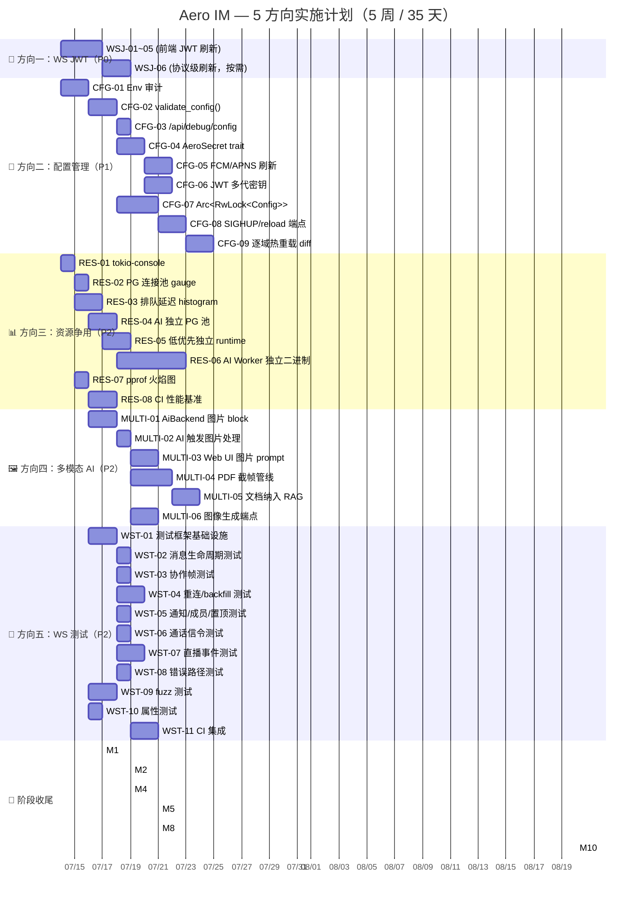

---

# Tech Lead 分析：5 个未覆盖扩展方向

> 基于 `2026-07-11-second-round-global-scan-five-uncovered-directions.md` 及代码验证报告，从技术实现和项目管理角度进行深入分析。
> **日期**：2026-07-12 | **角色**：Tech Lead | **项目**：Aero IM

---

## 1. 任务分解

### 图例
- 每个任务预估 2–6 小时（含测试和代码审查）
- 标注 `[验证修正]` 表示已根据代码验证结果调整文档中的数字或路径偏差
- 标注 `[依赖方向X]` 表示跨方向依赖

---

### 方向一：WS JWT 认证生命周期（P0·XS）

> 验证发现：默认 JWT TTL 实际上是 **3600s（1h）** 而非文档声称的 900s（15min）。这不是「不严重」——1 小时仍然远小于典型直播（2-3h）或长 IM 会话（4-8h），所以 P0 保持。但因 refresh 方法 `api.refreshToken()` 在代码中不存在，需改用 `fetch` 直调。

| 任务 ID | 任务标题 | 涉及文件 | 前置 | 预估 | 验收标准 |
|---------|---------|---------|------|------|---------|
| **WSJ-01** | 客户端 JWT exp 解码工具函数 | `web/ws.js` | 无 | 1h | `decodeTokenPayload(token)` 从 base64 payload 解析 `exp` 字段；单元测试覆盖合法 token / 畸形 base64 / 无 exp 边界 |
| **WSJ-02** | 重连前检查 token 是否过期 | `web/ws.js` — `_scheduleReconnect()` | WSJ-01 | 1h | 重连前判断 `exp - now < 120s` → 先调用 refresh 再 _open；过期 token 不走 WS 连接尝试 |
| **WSJ-03** | 实现 refresh-before-reconnect 流程 | `web/app.js` | WSJ-02 | 1.5h | `refreshToken()` 使用 `fetch('/api/auth/refresh', { body: JSON.stringify({ refresh_token }) })`；成功后更新 `localStorage` 和 `ws.token`；失败（refresh 也过期）→ 显示「请重新登录」，不进入重连死循环 |
| **WSJ-04** | 主动 token 刷新定时器 | `web/app.js` — `enterChat()` | WSJ-01 | 1.5h | 连接建立后 `setInterval` 每 `(exp - now - 120) * 1000` ms 调用 refresh；连接断开后清除 interval；刷新失败只记 `console.warn` 不弹窗 |
| **WSJ-05** | 热切换 token（无断线更新） | `web/ws.js` — `connect(newToken)` | WSJ-03 | 2h | 新 token 存储在 `ws._pendingToken`，下次 `_open()` 时使用；当前实时连接读写帧不影响；无需关闭现有 WS |
| **WSJ-06** | WS 协议级刷新（解法 A，按需） | `ws/ws_impl/mod.rs` + `client_frame.rs` | 方向五测试框架就绪后 | 4h | `ClientFrame::RefreshToken { refresh_token }` 被解析并在 `handle_client_frame` 中有 match 分支；返回 `ServerFrame::TokenRefreshed { access_token }`；revoked token 返回 401 断开 |

---

### 方向二：配置生命周期管理（P1·M）

> 验证发现：`jwt_additional_public_keys` 已被部分支持，说明配置框架已有扩展点，但整体验证/密钥/重载仍缺失。阶段 A 应优先。

| 任务 ID | 任务标题 | 涉及文件 | 前置 | 预估 | 验收标准 |
|---------|---------|---------|------|------|---------|
| **CFG-01** | 全库环境变量调用点审计 | 全库 grep + `config.rs` | 无 | 3h | 产出 `CONFIG_REGISTRY.md` 表格：`{变量名, 读取位置, 默认值, 缺失行为(panic/degraded/silent)}`；覆盖所有 `std::env::var("AERO_*")`、`std::env::var("ANTHROPIC_*")`、`env_parse!()` 调用点 |
| **CFG-02** | 配置校验函数 `validate_config()` | `server/src/config.rs` | CFG-01 | 4h | boot 时调用，返回 `Vec<ConfigIssue>`（含严重程度 FATAL/WARN/INFO）；FATAL 缺失（DB URL、JWT key、bridge secret）→ `eprintln!` + `process::exit(1)`；WARN 缺失（AI keys、push tokens）→ 日志但不退出；所有配置键有文档注释 |
| **CFG-03** | Admin-gated `/api/debug/config` 端点 | `server/src/debug.rs` | CFG-02 | 2h | 响应 JSON 包含所有有效配置名和值（敏感字段 `"***"` 隐藏）；401 对非 admin 返回；健康检查 `"configured": true/false` |
| **CFG-04** | `AeroSecret` trait + 三个 Provider | `aero-common/src/secret.rs` | CFG-02 | 5h | `EnvSecretProvider`（现状兼容）、`FileSecretProvider`（`/run/secrets/{name}`）、`VaultSecretProvider`（HTTP API）；`GET /health` 暴露各 secret 已配置状态；单元测试覆盖每个 provider 的 get/error 路径 |
| **CFG-05** | FCM/APNS token 自动刷新 | `server/src/boot/helpers.rs` + `aero-push/src/token.rs` | CFG-04 | 3h | FCM OAuth 2.0 token 在 `exp - 300s` 自动刷新；刷新失败使用旧 token + 告警日志；APNs token 静态不变但通过 `AeroSecret` 读取 |
| **CFG-06** | JWT 签名密钥多代支持 | `aero-auth/src/jwt.rs` | CFG-04 | 4h | `current` 签名 + `previous`（仅验证）；验证时遍历 `[current] + [previous]`；轮换操作通过 SIGHUP 或 admin API；旧密钥保留一个可配置轮换周期（默认 7 天） |
| **CFG-07** | `Arc<RwLock<AppConfig>>` 替换 `Arc<AppConfig>` | `server/src/state.rs` + 全引用点 | CFG-02 | 6h | AppState.config 类型从 `Arc<Config>` 改为 `Arc<RwLock<Config>>`；所有只读路径通过 `config.read()` 读取；启动后 config 可被原子更新 |
| **CFG-08** | SIGHUP handler + admin reload 端点 | `server/src/bin/boot/config_reload.rs` | CFG-07 | 3h | `POST /api/admin/config/reload` 触发全量重读环境变量 + `RwLock::write().swap()`；`SIGHUP` handler 相同逻辑；WebSocket 连接不受影响（读 lock 不阻塞） |
| **CFG-09** | 逐域热重载 diff 逻辑 | `server/src/bin/boot/config_reload.rs` | CFG-07 + CFG-08 | 5h | 新配置与旧配置 diff → 仅 diff 域触发重加载：限流 → `RateLimitStore::reload()`；CORS → tower layer `apply`；AI 模型 → `AiBackend` 重建；PG/Redis 连接池不变（池自动 `retain`） |

---

### 方向三：单进程资源争用（原 P1→P2·M）

> 验证修正：文档声称 AI Worker 默认 12 并发/每秒 12 次 DB 查询，但代码实际为 **4** 并发（`Semaphore(4)`）、**8** 的 BATCH_SIZE、**1s** 的空闲轮询间隔。核心论点（PG 争用存在）仍然有效但严重度显著降低。优先级下调至 P2，从「阻塞项」改为「架构演进项」。

| 任务 ID | 任务标题 | 涉及文件 | 前置 | 预估 | 验收标准 |
|---------|---------|---------|------|------|---------|
| **RES-01** | tokio-console 集成 | `server/Cargo.toml` + `bin/boot/tokio_console.rs` | 无 | 2h | `AERO_TOKIO_CONSOLE=1` 启用 `console-subscriber`；开发环境默认开启；文档记录如何 `tokio-console` 连接；生产环境默认关闭且零性能开销 |
| **RES-02** | PG 连接池按 worker 类型标记的 gauge | `aero-storage/src/db.rs` + 指标注册 | RES-01 | 3h | Prometheus gauge `aero_pg_connections{pool="ai"}` 和 `aero_pg_connections{pool="main"}`；连接池 metrics 包含 `idle`/`active`/`waiting` 细分 |
| **RES-03** | 任务排队延迟 histogram | `server/src/telemetry.rs` + 关键 `tracing::span` 点 | RES-01 | 4h | 关键路径（Hub fan-out、HTTP handler、NATS consumer handler）添加 `tracing::span` + `histogram!` 延迟记录；Grafana dashboard 模板随代码提交 |
| **RES-04** | AI Worker 独立 PG 连接池 | `aero-ai/src/worker.rs` + `boot/background.rs` | RES-02 | 4h | `AiWorker::new()` 接受独立 `PgPool`，从 `AERO__AI__DATABASE__URL`（默认同主 DB）创建；`POOL_SIZE_AI` 默认 4（与当前使用量一致）；AI worker 不消耗主连接池连接 |
| **RES-05** | 低优先级定时器独立 tokio runtime | `server/src/bin/boot/background.rs` | RES-03 | 3h | 清扫/backfill/sampler 定时器在独立单线程 Runtime 中运行；`runtime.block_on(interval_loop)` → `tokio::task::spawn_blocking` 迁移非异步清扫；不影响热路径运行时的任务调度 |
| **RES-06** | AI Worker 独立二进制（可选） | 新建 `aero-ai-worker/` crate | RES-04 + CFG-02 | 10h | `aero-ai-worker` 通过 NATS `ai_jobs` subject 接收任务；`AiWorker` 原进程内实例可被禁用（`AERO_AI_RUN_LOCAL=false`）；独立进程崩溃不影响主服务；Budget 迁移到 Redis atomic counters |
| **RES-07** | pprof 火焰图端点 | `server/Cargo.toml` + `debug.rs` | RES-01 | 2h | `GET /api/debug/pprof/profile?seconds=30`（admin-gated）输出 pprof proto 格式；`go tool pprof` 可解析；仅 `cfg(debug)` 或 `AERO_PPROF_ENABLED` 门控 |
| **RES-08** | CI 性能基准门禁 | `benches/` 目录 + CI 配置 | RES-07 | 5h | `cargo bench` 包含：消息扇出延迟（P50/P99 < 5ms）、NATS consumer 解码延迟、HTTP 路由延迟；CI 对比基线，>5% 回归标红；基准数据作为 CI artifact 存储 |

---

### 方向四：多模态 AI（P2·M）

> 验证修正：`FileKind` 的变体是 `{Image, Video, Audio, Document, Other}` 而非文档写的 `{..., File, Code}`。不影响架构分析，但 `match` 臂名需对齐代码。

| 任务 ID | 任务标题 | 涉及文件 | 前置 | 预估 | 验收标准 |
|---------|---------|---------|------|------|---------|
| **MULTI-01** | AiBackend `answer_question` 支持图片 block | `aero-ai/src/backend.rs` + `mod.rs` | 无 | 4h | 新增 `&[Block]` 参数；解析 `Block::File { kind: FileKind::Image, .. }`；从 `blob_store` 取 bytes → base64 → Anthropic Messages API `image` content block；单元测试覆盖图片 block→Anthropic 请求的序列化 |
| **MULTI-02** | AI 路由中图片触发逻辑 | `aero-ai/src/service_impl.rs` | MULTI-01 | 2h | `answer_question` 调用点传入当前线程/消息附带的图片 block；非图片 block 跳过；大图片自动缩放（max 2048px + JPEG 85%）；仅 `FileKind::Image` |
| **MULTI-03** | Web UI 图片 AI 提示入口 | `web/chat.js` + `web/ai.js` | MULTI-02 | 3h | 消息输入框可选择图片 → `/api/ai/ask` 请求体中包含图片引用；`@ai 这张图里有什么？` 自动附带上一条图片；支持拖拽图片到 AI prompt 区域 |
| **MULTI-04** | PDF/文档页面截帧管线 | `aero-ai/src/document.rs` | MULTI-02 | 5h | 文件上传 `Kind::Document` → 可选触发：`enqueue_unique(DocumentParse)`；集成 `poppler` / `pdf-to-image` CLI（外部依赖可选）；仅处理前 N 页（默认 10）；解析结果 JSON → 存原消息 `analysis` 字段 |
| **MULTI-05** | 文档内容纳入 RAG 检索 | `aero-ai/src/rag.rs` + `embedding_backfill` | MULTI-04 + RES-04 | 3h | 文档解析后嵌入生成 → 写入 `message_embeddings` 表；RAG 检索时 `block->>'analysis'` 作为额外文本源；用户可问「这份报价单总金额多少？」 |
| **MULTI-06** | 图像生成端点 `POST /api/ai/generate-image` | `server/src/ai/generate_image.rs` + `aero-ai/src/image_gen.rs` | MULTI-02 | 4h | OpenAI DALL-E 3 / Stability AI 集成（`AERO_IMAGE_GEN_MODEL` 配置）；生成图像存 blob_store → 返回 `Block::File` URL；工作区成员门控；成本计入 `ai_usage_ledger`；图片添加不可见 AI 水印 |

---

### 方向五：WS 集成测试（P2·M）

> 验证修正：实际 ServerFrame 为 **18 种**（文档漏记 Error + Pong）。测试套件必须覆盖全部 18 种。

| 任务 ID | 任务标题 | 涉及文件 | 前置 | 预估 | 验收标准 |
|---------|---------|---------|------|------|---------|
| **WST-01** | WS 测试基础设施（pytest + websockets） | `tests/ws_test_fixture.py` + `tests/conftest.py` | 无 | 4h | `WsTestFixture` 类：`register_user()`、`connect_ws()`、`create_room()`、`send_message()`、`expect_frame(type, timeout)`；`conftest.py` 提供 `pytest` fixture（`aero_server` 进程生命周期管理）；支持 `docker-compose` 和本地进程两种模式 |
| **WST-02** | 消息生命周期测试 | `tests/test_message_lifecycle.py` | WST-01 | 3h | 覆盖 3 个测试：`test_message_edit`（send → edit → 双方收到 Edited 帧）、`test_message_delete`（send → delete → 双方收到 Deleted 帧）、`test_reaction`（send → react → 双方收到 Reaction 帧） |
| **WST-03** | 协作帧测试 | `tests/test_collaboration.py` | WST-01 | 3h | 覆盖 3 个测试：`test_typing_indicator`、`test_mark_read`、`test_message_seen`（仅在 `MessageSeen` 启用时） |
| **WST-04** | 重连/backfill 测试 | `tests/test_reconnect.py` | WST-01 | 4h | 覆盖 3 个测试：`test_reconnect_backfill`（A 断线 → B 发消息 → A 重连 → A 收到 backfill）、`test_backfill_dedup`（重连后不重复渲染）、`test_seq_dedup`（模拟 at-least-once 重投验证 SeqGate） |
| **WST-05** | 通知/成员/置顶帧测试 | `tests/test_room_events.py` | WST-01 | 2h | 覆盖：`test_membership`（成员加入/离开）、`test_pin`（置顶/取消）、`test_notify`（通知帧） |
| **WST-06** | 通话信令测试 | `tests/test_calls.py` | WST-01 | 3h | `test_call_invite_accept`（A 发起 → B 收到 Call 帧 → B accept → A 收到 Roster）；通话结束帧验证 |
| **WST-07** | 直播事件测试 | `tests/test_stream.py` | WST-01 | 3h | `test_stream_chat`（弹幕收发）、`test_stream_gift`（礼物事件）、`test_watch_stream`（观看计数） |
| **WST-08** | 错误路径测试 | `tests/test_errors.py` | WST-01 | 2h | `test_invalid_frame`（非法 JSON → Error 帧）、`test_expired_token`（过期 token → 401 + close）、`test_malformed_message`（空消息体） |
| **WST-09** | 帧反序列化 fuzz 测试 | `fuzz/fuzz_targets/ws_frame.rs` + `Cargo.toml` | 无 | 3h | `cargo fuzz` target 对 `ClientFrame::deserialize` 随机输入 → 不 panic / 不泄漏；CI nightly 运行（`cargo fuzz run --sanizer=address`） |
| **WST-10** | RoomEvent ↔ JSON 属性测试 | `aero-common/src/model/event.rs` + proptest | 无 | 2h | `proptest`：随机 `RoomEvent` → `serde_json::to_string` → `serde_json::from_str` → 字段无损；覆盖所有 variant |
| **WST-11** | CI 集成 + smoke 套件合并 | `Makefile` + CI 配置（`.github/workflows/ci.yml`） | WST-02~WST-08 | 3h | `make smoke-ws` 运行全部 pytest 套件；docker-compose 环境下启动 → 测试 → 清理；WS 测试失败 = CI RED；标记 `pytest.mark.slow` 测试只在 nightly CI 运行 |

---

## 2. 执行顺序与依赖图

```mermaid
graph TD
    %% ─── Direction 1: WS JWT ───
    WSJ01[WSJ-01: JWT exp decoder] --> WSJ02[WSJ-02: check before reconnect]
    WSJ01 --> WSJ04[WSJ-04: proactive refresh timer]
    WSJ02 --> WSJ03[WSJ-03: refresh-before-reconnect flow]
    WSJ03 --> WSJ05[WSJ-05: hot-swap token]

    %% WSJ-06 (Solution A) 延迟到方向五就绪
    WSJ05 -.->|if needed| WSJ06[WSJ-06: WS protocol refresh frame]
    WST01 -.-> WSJ06

    %% ─── Direction 2: Config ───
    CFG01[CFG-01: env var audit] --> CFG02[CFG-02: validate_config()]
    CFG02 --> CFG03[CFG-03: /api/debug/config endpoint]
    CFG02 --> CFG04[CFG-04: AeroSecret trait + 3 providers]
    CFG04 --> CFG05[CFG-05: FCM/APNS auto-refresh]
    CFG04 --> CFG06[CFG-06: JWT multi-key rotation]
    CFG02 --> CFG07[CFG-07: Arc<RwLock<AppConfig>>]
    CFG07 --> CFG08[CFG-08: SIGHUP + admin reload]
    CFG08 --> CFG09[CFG-09: per-domain hot-reload diff]

    %% ─── Direction 3: Resource Contention ───
    RES01[RES-01: tokio-console] --> RES02[RES-02: PG pool gauge]
    RES01 --> RES03[RES-03: task queue delay histo]
    RES02 --> RES04[RES-04: AI worker separate PG pool]
    RES03 --> RES05[RES-05: low-pri timer isolation]
    RES04 --> RES06[RES-06: AI worker as binary]
    RES01 --> RES07[RES-07: pprof endpoint]
    RES07 --> RES08[RES-08: CI perf benchmarks]

    %% CFG-02 needed for RES-06 (AI binary needs config validation)
    CFG02 -.-> RES06

    %% ─── Direction 4: Multimodal AI ───
    MULTI01[MULTI-01: AiBackend vision blocks] --> MULTI02[MULTI-02: image trigger in AI route]
    MULTI02 --> MULTI03[MULTI-03: Web UI for image AI]
    MULTI02 --> MULTI04[MULTI-04: PDF page capture]
    MULTI04 --> MULTI05[MULTI-05: document in RAG]
    MULTI02 --> MULTI06[MULTI-06: image generation endpoint]

    %% ─── Direction 5: WS Test ───
    WST01[WST-01: test fixture framework] --> WST02[WST-02: message lifecycle]
    WST01 --> WST03[WST-03: collaboration frames]
    WST01 --> WST04[WST-04: reconnect/backfill]
    WST01 --> WST05[WST-05: notify/membership/pin]
    WST01 --> WST06[WST-06: call signaling]
    WST01 --> WST07[WST-07: stream events]
    WST01 --> WST08[WST-08: error path]

    WST09[WST-09: fuzz test] -.->|independent| WST01
    WST10[WST-10: proptest] -.->|independent| WST01

    WST02 --> WST11[WST-11: CI integration]
    WST03 --> WST11
    WST04 --> WST11
    WST05 --> WST11
    WST06 --> WST11
    WST07 --> WST11
    WST08 --> WST11

    %% ─── Inter-direction deps ───
    subgraph "Parallel Group A (Week 1)"
        WSJ01; WSJ02; WSJ03; WSJ04; WSJ05
        CFG01; CFG02
        RES01
        WST01; WST09; WST10
    end

    subgraph "Parallel Group B (Weeks 1-2)"
        CFG03; CFG04; CFG07
        RES02; RES03; RES07
        MULTI01; MULTI02
        WST02; WST03; WST08
    end

    subgraph "Parallel Group C (Weeks 2-3)"
        WSJ06
        CFG05; CFG06; CFG08; CFG09
        RES04; RES05; RES08
        MULTI03; MULTI04; MULTI06
        WST04; WST05; WST06; WST07
    end

    subgraph "Parallel Group D (Weeks 3-4)"
        RES06
        MULTI05
        WST11
    end
```

### 可并行执行的任务组

| 组 | 核心主题 | 可并行任务 | 所需角色 |
|----|---------|-----------|---------|
| **A** | 快速获胜 + 基础设施 | WSJ-01~05, CFG-01~02, RES-01, WST-01/09/10 | 前端 × 1, 后端 × 2, QA × 1 |
| **B** | 配置 + 可观测 + 图片 AI | CFG-03/04/07, RES-02/03/07, MULTI-01/02, WST-02/03/08 | 后端 × 2, AI × 1, QA × 1 |
| **C** | 隔离 + 多模态 + WS 测试 | WSJ-06, CFG-05/06/08/09, RES-04/05/08, MULTI-03/04/06, WST-04~07 | 全栈 × 3, QA × 1 |
| **D** | 收尾 + 集成 | RES-06, MULTI-05, WST-11 | 后端 × 1, DevOps × 1 |

---

## 3. 技术风险

### 3.1 高风险（需提前对冲）

| # | 风险 | 所属方向 | 概率 | 影响 | 缓解策略 |
|---|------|---------|------|------|---------|
| R1 | **JWT 刷新竞态**：客户端 token 刷新和 WS 重连同时触发，导致 stale token 和 refresh token 被吊销 | 方向一 | 中 | 高（用户被强制登出） | 客户端状态机：刷新请求 pending 时不发起 WS 连接；服务端 REFRESH_REUSE_GRACE 窗口（10s）允许并发 refresh |
| R2 | **配置重载一致性**：半配置状态——部分域已加载新配置，部分域仍用旧值 | 方向二 | 中 | 高（限流策略不一致导致 DoS 窗口） | 事务式重载：先 validate 完整新配置 → 计算 diff → **按 diff 顺序逐个域加载**；任一域失败则回滚（保存旧 `Arc` 的 snapshot） |
| R3 | **AI Worker 独立后 Budget 状态丢失**：内存 Budget 计数器不跨进程同步，导致双 Worker 同时运行双倍预算 | 方向三 | 高 | 中（超支） | 阶段 B 中 Budget 迁移到 Redis atomic counters（`INCR` + `EXPIRE` 窗口），独立 Worker 和内置 Worker 读写同一 key 前缀 |
| R4 | **FCM OAuth token 自动刷新失败导致推送静默中断** | 方向二 | 低 | 高（所有移动用户无推送） | 双保险策略：刷新失败使用旧 token 继续（FCM 接受 1-2min 过期的 token）+ 未刷新告警日志 + `GET /health` 的 push_gateway `configured: false` |
| R5 | **多模态 AI 的 API 成本失控**：一张图片可能消耗 1k+ tokens（Claude 3.5 Sonnet 对图片的视觉 token 按分辨率计费），用户批量上传图片可能单请求 $0.10+ | 方向四 | 中 | 中 | 复用已有 `CostBudget` + `KeyedCostBudget` 框架；图片问答单独加权（`VISION_WEIGHT = 10`）；每用户询问上限 `AERO_AI_VISION_DAILY_LIMIT` |

### 3.2 中风险

| # | 风险 | 方向 | 缓解 |
|---|------|------|------|
| R6 | WS 测试环境复杂——需要 PG/Redis/NATS 全部运行 | 方向五 | 最小启动模式：`AERO__SERVER__DISABLE_BUS_AUTO_ACK=1` + `AERO__SERVER__DISABLE_REDIS=1` + 内存 state；部分测试可以无 PG（如错误路径、帧解析） |
| R7 | JWT 多代切换窗口内部分验证失败 | 方向二 | `previous` 保留期可配置（默认 7 天）；轮换操作后监控 `jwt_verify_failures` 指标 |
| R8 | pprof 在 CI 中不稳定（不同运行环境火焰图差异） | 方向三 | CI 性能基准不依赖火焰图上的具体热点，而依赖聚合的 P50/P99 延迟指标 |
| R9 | PDF 解析依赖外部 CLI（`poppler-utils`） | 方向四 | 可选依赖：当 CLI 不存在时只跳过文档分析，不 panic；fallback 只做文件名 / MIME 信息检索 |

### 3.3 低风险（已知但可控）

| # | 风险 | 方向 | 说明 |
|---|------|------|------|
| R10 | `cargo fuzz` 在 CI 中运行时间长 | 方向五 | 只在 nightly 运行；`--max-total-time=60` 约束 |
| R11 | SIGHUP 在容器/K8s 中信号传递问题 | 方向二 | K8s 默认 `SIGTERM`，可配置 `lifecycle.preStop` 发送 SIGHUP；容器中通过 `exec` 形式确保 PID 1 捕获 |
| R12 | WS 测试中的时序抖动（flaky tests） | 方向五 | 所有 `expect_frame` 使用可配置 timeout（默认 3s）；重试机制（最多 2 次）；CI 中标记 `flaky` 并 rerun |

---

## 4. 资源评估

### 4.1 人员需求

| 角色 | 所需人数 | 技能要求 | 主要负责方向 |
|------|---------|---------|-------------|
| **前端工程师（Web）** | 1 | ES2020, WebSocket API, JWT 客户端解码, `fetch` | 方向一（WSJ-01~05）, 方向四（MULTI-03） |
| **后端工程师（Rust）** | 2 | Tokio, Axum, sqlx, NATS, figment, Prometheus metrics | 方向二（CFG-01~09）, 方向三（RES-01~08）, 方向四（MULTI-01/02/04~06） |
| **AI 工程师** | 1 | Anthropic API, 多模态模型, OCR/文档解析, 图像生成 API | 方向四（MULTI-01~06） |
| **QA / DevOps** | 1 | pytest, websockets 库, docker-compose, CI/CD, `cargo fuzz` | 方向五（WST-01~11） |
| **Tech Lead（本人）** | 1（兼职） | 架构决策, 代码审查, 跨组协调 | 全方向统筹 |

**最小可行团队**：3 人 = 前端 × 1 + 后端 × 1 + QA × 1（AI 工程师可借力后端工程师兼职，前提是熟悉 Anthropic API）

### 4.2 关键里程碑

| 里程碑 | 时间 | 交付物 | 验收标准 |
|--------|------|--------|---------|
| **M1: P0 修复上线** | 第 5 天 | WSJ-01~05 全部完成 + 冒烟测试通过 | 直播 2h 连接不中断；token 过期自动刷新页面不弹错；`make smoke` 全部绿 |
| **M2: 配置验证闸门** | 第 8 天 | CFG-01~03 完成 | 缺失 `AERO__DATABASE__URL` → `exit(1)` 且打印清晰错误；`GET /api/debug/config` 返回正确+隐藏敏感字段 |
| **M3: 运行时可见性上线** | 第 10 天 | RES-01~03 完成 | 开发环境 `tokio-console` 可连接；Prometheus 暴露 `aero_pg_connections` 和 `aero_task_queue_delay` |
| **M4: WS 测试框架就绪** | 第 12 天 | WST-01~03/08/09/10 完成 | 消息生命周期 + 错误路径的集成测试可在 CI 中运行；fuzz 跑 60s 无 crash |
| **M5: AI 看图功能可用** | 第 15 天 | MULTI-01~03 完成 | 用户可 `@ai 这张图里有什么？` + 附带图片 → AI 回复图片内容 |
| **M6: 配置重载 + 密钥轮换** | 第 20 天 | CFG-04~09 完成 | `POST /api/admin/config/reload` 改变限流参数即时生效；JWT 切换到新 key 旧 token 在保留期内仍可验证 |
| **M7: 资源隔离初版** | 第 22 天 | RES-04~05 完成 | AI Worker 使用独立 PG 池；清扫定时器在独立 runtime 运行 |
| **M8: 全 WS 测试覆盖** | 第 25 天 | WST-04~07/11 完成 | 18 种 ServerFrame + 全部 ClientFrame 类型被集成测试覆盖；CI 门禁就绪 |
| **M9: 文档智能 + 图像生成** | 第 30 天 | MULTI-04~06 完成 | PDF 上传后 AI 可回答文档内容；`/api/ai/generate-image` 返回图片 |
| **M10: 性能基准 + AI 独立二进制** | 第 35 天 | RES-06~08 完成 | CI 性能门禁生效；AI Worker 可独立部署为 `aero-ai-worker` |

### 4.3 阻塞点（Blockers）

| Blocker | 涉及方向 | 描述 | 解决策略 |
|---------|---------|------|---------|
| **B1: 缺少 AI 工程师** | 方向四 | 多模态开发需要熟悉 Anthropic Vision API 和图像生成的工程师 | 后备方案：后端 Rust 工程师通过 Anthropic docs 自学（API 调用模式与文本 completion 几乎相同，仅 messages 数组加入 image block） |
| **B2: 测试环境的 NATS+PG+Redis 依赖** | 方向五 | 没有独立测试环境的 K8s CI runner | 使用 `docker-compose` 在 runner 内启动全栈；缓存 docker images 减少启动时间；或使用 `testcontainers` Rust crate 管理容器生命周期 |
| **B3: FCM OAuth token 刷新需要 Google 凭据** | 方向二 | 无 FCM 项目/凭据无法测试 token 刷新 | `FakeGateway` 已存在（见 AGENTS.md）；扩展 FakeGateway 模拟 OAuth 响应；集成测试不依赖真实 FCM |
| **B4: pprof 在 aarch64 上需要特定 libunwind** | 方向三 | CI runner 可能为 ARM 架构 | 使用 `pprof-rs` 的 `frame-pointer` feature 或 `gimli` backend，不依赖系统 libunwind；CI 中 `cargo check` 而非 run |

---

## 5. 质量保证

### 5.1 单元测试覆盖要求

| 方向 | 关键模块 | 最低覆盖率要求 | 重点关注 |
|------|---------|--------------|---------|
| **方向一** | `web/ws.js` JWT 解码 | 行覆盖 90% | base64 解码异常、exp 字段缺失、token 结构畸形 |
| **方向二** | `config.rs` `validate_config()` | 100% 逻辑分支 | 每个环境变量的缺失/空值/非法格式；FATAL/WARN/INFO 分类正确 |
| **方向二** | `secret.rs` 三个 Provider | 100% | get/error/not_found 路径；Vault provider 的 HTTP 错误码解析 |
| **方向三** | `aero-ai/src/worker.rs` 预算约束 | 100% | `Semaphore` 并发控制；`KeyedCostBudget` 准时重置；`defer` 路径 |
| **方向三** | 连接池分流（RES-04） | 90% | 两个池独立创建、配置不同大小、不互相借用 |
| **方向四** | `AiBackend` 图片 block 序列化 | 100% | 图片 → Anthropic `image` content block 的 JSON 结构正确 |
| **方向四** | 文档解析管线 | 90% | PDF 截帧（mock CLI）、结果存储、失败路径 |
| **方向五** | `room_event_to_frame_json` 属性测试 | 全部 18 种 variant | 序列化→反序列化→字段无损 |

### 5.2 集成测试策略

| 测试套件 | 工具 | 运行频率 | 环境依赖 |
|---------|------|---------|---------|
| WS 协议集成测试（WST-02~08） | pytest + websockets | **每次 PR** | docker-compose（PG+Redis+NATS+Server）或最小无持久化模式 |
| 帧 fuzz 测试（WST-09） | cargo fuzz | nightly | 无（纯内存） |
| RoomEvent 属性测试（WST-10） | proptest | **每次 PR** | 无（纯 Rust） |
| AI 多模态集成测试 | pytest + 回放 Anthropic mock | 每次 PR | mock server（`wiremock` 或 python `responses` 库） |
| 配置重载集成测试 | pytest + HTTP | 每次 PR | 单 server 进程，无 PG（只验证重载行为） |
| 性能基准（RES-08） | cargo bench | nightly | 专用 CI runner（隔离 CPU） |

### 5.3 代码审查要点

| 审查区 | 审查内容 | 属于方向 |
|--------|---------|---------|
| **安全性** | JWT 刷新路径是否暴露 CSRF？refresh token 是否在 localStorage 中以明文存储？（→ 应 `httpOnly` cookie 或 `sessionStorage`） | 方向一 |
| **安全性** | `/api/debug/config` 是否 admin-only？敏感值是否掩码？ | 方向二 |
| **安全性** | `AeroSecret` trait 的 `get()` 返回值是否可能被日志泄漏？ | 方向二 |
| **并发** | `Arc<RwLock<AppConfig>>` 的读锁是否在 async 上下文中持有超过 1 个 `.await`？（→ 禁止持锁跨 await） | 方向二 |
| **并发** | `Budget` 的 Redis atomic counter 是否处理 `INCR` 后 `EXPIRE` 原子性？（→ 使用 Lua script 或 `SETEX`） | 方向三 |
| **正确性** | 图片缩放时 EXIF orientation 是否正确处理？（→ 使用 `image` crate 的 `auto_orient`） | 方向四 |
| **正确性** | WS 测试中 `expect_frame` 是否处理 frame 乱序？（→ 使用 frame buffer + match predicate） | 方向五 |
| **性能** | 图片上传到 AI 调用是否在任务期间保持整个 blob 在内存？（→ 流式读取 + 降采样） | 方向四 |
| **回归** | 新加 `ServerFrame` variant 后 `room_event_to_frame_json` 的 match 臂是否 exhaustive？ | 方向五 |

### 5.4 性能测试需求

| 测试场景 | 工具 | 目标 | 通过标准 |
|---------|------|------|---------|
| WS 连接保持（1h 无断开） | 自定义脚本 | 验证方向一修复有效性 | 0 次非预期断开 |
| AI Worker + 热路径并发 PG | custom bench + tokio-console | 方向三隔离效果 | AI Worker 高峰期，HTTP P99 不劣于基线 +5% |
| 配置重载对 WS 影响 | WS 连接 + 重载操作 | 方向二重载安全 | 重载期间 WS 帧延迟不增加 > 10ms |
| 多模态图片问答延迟 | pytest + mock API | 方向四延迟预算 | P50 < 3s（网络 + AI inference） |

---

## 6. 实施计划

### 甘特图



### 阶段划分

#### 阶段 1：基础设施与 P0 快速修复（第 1-5 天）

| 日期 | 工作内容 | 交付 |
|------|---------|------|
| Day 1 | WSJ-01 JWT 解码 + WSJ-02 重连前检查 + WSJ-04 刷新定时器 | `web/ws.js` 修改 |
| Day 2 | WSJ-03 refresh-before-reconnect + WSJ-05 热切换 | 完整 JWT 刷新链路可端到端验证 |
| Day 3 | CFG-01 环境变量审计 + CFG-02 `validate_config()` | `CONFIG_REGISTRY.md` + boot 时校验 |
| Day 4 | RES-01 tokio-console + 方向一冒烟测试 | 开发环境可观测；P0 修复上线 |
| Day 5 | WST-01 测试框架 + WST-09 fuzz + WST-10 proptest | 测试基础设施就绪 |
| **里程碑 M1** | **方向一全部完成，P0 上线** | |

**风险缓解**：前 3 天集中 2 人（前端 + 后端）攻克 P0。即使其他方向延迟，方向一也能按时上线。

#### 阶段 2：配置与可观测（第 4-12 天）

| 日期 | 工作内容 | 交付 |
|------|---------|------|
| Day 6-7 | CFG-03 debug 端点 + CFG-04 AeroSecret + CFG-07 `Arc<RwLock>` | 配置验证 + secret 框架 + 可重载基础设施 |
| Day 8-9 | RES-02 PG pool gauge + RES-03 延迟 histogram + RES-07 pprof | 运行时可见性上线 |
| Day 10 | CFG-08 SIGHUP/reload + CFG-05 FCM/APNS 刷新 | 基本配置重载能力 |
| Day 11-12 | CFG-06 JWT 多代 + CFG-09 逐域 diff | 完整配置生命周期管理 |
| **里程碑 M3** | **运行时可见性上线** | |

#### 阶段 3：隔离 + 多模态 + WS 测试（第 7-22 天）

| 日期 | 工作内容 | 交付 |
|------|---------|------|
| Day 7-8 | MULTI-01 ~ 02 AI 图片 block + 触发 | 多模态核心逻辑 |
| Day 9-11 | WST-02~03/08 消息生命周期 + 协作 + 错误路径 | 首批 WS 集成测试 |
| Day 12 | RES-04 AI 独立 PG 池 | 资源隔离初版 |
| Day 13-15 | MULTI-03 Web UI + WST-04~07 重连/通话/直播/成员 | 多模态 UI + 剩余 WS 测试 |
| Day 16-17 | RES-05 独立 runtime + WST-11 CI 集成 | 隔离 + 测试 CI 门禁 |
| Day 18-20 | MULTI-04 PDF 截帧 + MULTI-06 图像生成 | 文档智能 + 图像生成 |
| **里程碑 M8** | **全 WS 测试覆盖，CI 门禁就绪** | |

#### 阶段 4：收尾 + 进阶隔离（第 20-35 天）

| 日期 | 工作内容 | 交付 |
|------|---------|------|
| Day 20-22 | RES-06 AI Worker 独立二进制（核心路径） | 独立 AI 服务原型 |
| Day 23-25 | RES-08 CI 性能基准 | 回归门禁 |
| Day 26-28 | MULTI-05 文档纳入 RAG | 检索增强的文档理解 |
| Day 29-32 | RES-06 完善（Budget Redis 迁移 + 独立部署文档） | 完整独立部署能力 |
| Day 33-35 | 全量回归测试 + 文档完善 + 性能调优 | 全部方向交付 |
| **里程碑 M10** | **全部 5 方向完成** | |

---

## 7. 最终建议

### 7.1 优先级调整确认

基于代码验证结果的最终优先级：

| 方向 | 优先级 | 体量 | 建议窗口 | 理由 |
|------|--------|------|---------|------|
| **一：WS JWT 刷新** | **P0** | XS（20-30 行 JS） | **第 1 周** | 直接影响所有长连接用户；零后端变更；修复体积最小价值最大 |
| **二：配置管理** | **P1** | M（阶段 A 1-2 天） | **第 1-3 周** | 生产运维基线；配置故障是最高频事故；阶段 A 独立即可覆盖 60% 收益 |
| **五：WS 集成测试** | **P2** | M（核心框架 2-3 天） | **第 2-3 周** | 18 种帧类型仅 1 种测试覆盖；重构信心缺失；但无直接用户影响 |
| **三：资源争用** | **P2**（下调） | M（阶段 A 2-3 天） | **第 2-4 周** | 3× 数字偏差削弱紧迫性；核心论点成立但不紧急；先做可见性再说 |
| **四：多模态 AI** | **P2** | M（阶段 A 2-3 天） | **第 2-4 周** | 产品差异化亮点；阶段 A（图片问答）独立可交付；不阻塞其他路径 |

### 7.2 最简可行路径（MVP Path）

如果只有 2 个开发人员 × 2 周（20 人天），建议砍掉虚线部分：

**保留**：
- ✅ 方向一（全部 5 个任务 ≈ 7h）— P0，不可省略
- ✅ 方向二（CFG-01~03 阶段 A ≈ 9h）— 配置验证是生产安全底线
- ✅ 方向五（WST-01~03/08/09 ≈ 15h）— 测试框架 + 核心场景 + 错误路径
- ✅ 方向三（RES-01~02 ≈ 5h）— 最低可观测性

**砍掉**：
- ❌ 方向四全部（多模态）— 产品亮点但非基础设施
- ❌ 方向二 CFG-04~09（密钥/重载）— 阶段 A 已覆盖 60%
- ❌ 方向三 RES-03~08（深度隔离）— 等 tokio-console 数据决定是否值得
- ❌ 方向五 WST-04~07（通话/直播测试）— 复杂路径，依赖 NATS 环境
- ❌ WSJ-06（解法 A）— 解法 B 已足够

**2 周 MVP 总工时**：约 36h = 2 人 × 18h（剩余时间为代码审查 + 写文档 + 偶发问题）

### 7.3 一句话总结

> **方向一今天就可以做（20 行 JS，零后端变更），方向二阶段 A 明天做（配置验证防 60% 生产事故），其余三个方向等 tokio-console 的数据和 WS 测试框架就绪再决策——别在没数据前花 2 周做资源隔离，也别在没测试前花 1 周重构帧路由。**
