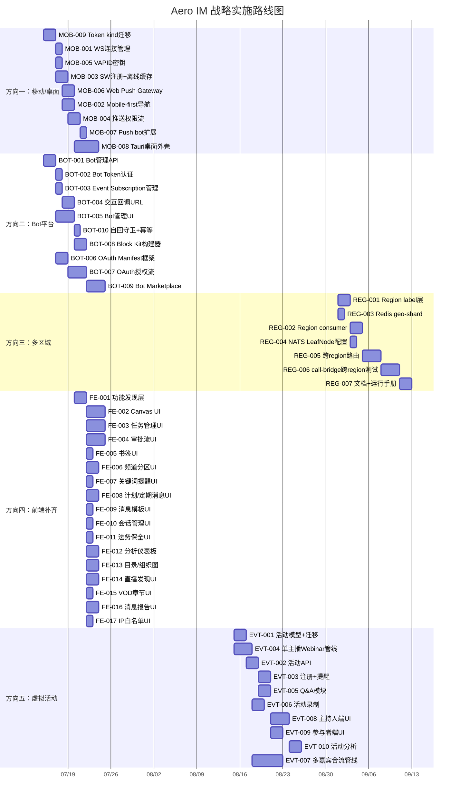

# Tech Lead 分析报告：Aero IM 战略方向落地

> 基于反馈文档中的数据验证结果和代码库实际情况，将五个战略方向分解为可执行的任务，并给出执行顺序、风险评估和实施计划。

---

## 1. 任务分解

### 方向一：移动/桌面客户端（🔥🔥🔥🔥🔥）

| 任务 ID | 任务标题 | 涉及文件 | 前置依赖 | 工时 | 验收标准 |
|---|---|---|---|---|---|
| MOB-001 | WebSocket 移动生命周期管理 | `web/ws.js` | 无 | 4h | `pagehide` 时优雅关闭、`pageshow` 重建、`visibilitychange` 调整心跳间隔；无内存泄漏 |
| MOB-002 | Mobile-first 导航重新架构 | `web/style.css`, `web/index.html`, `web/app.js` | 无 | 8h | 底部 tab bar（Channels/DMs/Search/Notifications/Profile）；触摸友好的 44px 最小可点击区域；`<meta name=viewport>` 已有但需配套 |
| MOB-003 | Service Worker 注册 + 离线缓存 | `web/sw.js`（新）, `web/index.html` | 无 | 6h | SW 注册成功；`install` 事件缓存核心资产（`ws.js`, `api.js`, `style.css`, `index.html`）；`fetch` 事件服务缓存优先 |
| MOB-004 | 浏览器推送权限流 + `pushManager.subscribe()` | `web/notifications.js`, `web/sw.js` | MOB-003 | 6h | 用户同意后获取 PushSubscription JSON；POST 到 `/api/push/register`；`push` 事件处理 + `notificationclick` 处理 |
| MOB-005 | VAPID key 生成 + 服务端配置 | `aero-push/src/vapid.rs`（新） | 无 | 4h | `aero-cli generate-vapid` 命令；环境变量 `AERO_VAPID_PUBLIC_KEY`/`AERO_VAPID_PRIVATE_KEY`；key 对本地生成并持久化 |
| MOB-006 | Web Push Gateway impl + 集成 | `aero-push/src/web_push.rs`（新）, `aero-push/Cargo.toml`（加 `web-push` crate） | MOB-005 | 8h | `WebPushGateway` 实现 `PushGateway` trait；`PushPayload → Web Push JSON` 转换；FakeGateway 风格测试 double |
| MOB-007 | Push bot Web Push 路由 + push_bot 扩展 | `aero-server/src/bin/boot/push_bot.rs` | MOB-006 | 4h | `push_bot` 按 token `kind` 字段选择网关；Web Push token 注册/发送完整链路 |
| MOB-008 | Tauri 桌面外壳（Electron 替代） | `src-tauri/`（新）, `web/` 适配 | MOB-002 | 16h | `cargo tauri dev` 启动加载 web SPA；系统通知集成；托盘图标；窗口状态持久化 |
| MOB-009 | Push Token schema `kind` 字段迁移 | `migrations/0158_push_token_kind.sql`（新）, `aero-storage/src/push_token.rs` | 无 | 4h | `push_tokens` 表加 `kind VARCHAR NOT NULL DEFAULT 'fcm'`；`PushToken` 模型加 `kind`；API 接受 `kind` 参数 |

**方向一小计：60h（1.5 人周）**；Tauri 外壳 16h 可独立并行。

### 方向二：Bot/App 平台（🔥🔥🔥🔥🔥）

| 任务 ID | 任务标题 | 涉及文件 | 前置依赖 | 工时 | 验收标准 |
|---|---|---|---|---|---|
| BOT-001 | Bot 管理 API 扩展（CRUD 管理端） | `aero-server/src/bot_admin.rs`（新）, `crates/aero-storage/src/bot.rs` | 无 | 6h | Workspace Owner/Admin 可用 REST API 创建/列出/更新/删除 bot；token 可旋转；响应含 `id`/`name`/`icon_url`/`has_token` |
| BOT-002 | Bot token 认证中间件 | `aero-server/src/bot_auth.rs`（新） | BOT-001 | 4h | `AuthUser` extractor 识别 `bot_` 前缀 token 并 resolve；Bot 请求以 `ParticipantId` 身份进入已有鉴权管线 |
| BOT-003 | Bot Event Subscription 管理 API | `aero-server/src/bot_subs.rs`（新） | BOT-001 | 4h | `POST /api/bots/:id/subscriptions`（event_type + filters + webhook_url）；`GET/DELETE`；`filters` JSON schema 校验（room_id/workspace_id/action_id） |
| BOT-004 | Bot 交互回调 URL 管线 | `aero-server/src/interactions.rs`, `aero-storage/src/block_interaction.rs`, `bot_dispatch.rs` | BOT-003 | 8h | button/select 点击后 POST 到订阅 bot 的 `webhook_url`（含原始 interaction payload + 签名）；超时 5s；结果记录到 `bot_subscription_deliveries` |
| BOT-005 | Bot 管理前端 UI | `web/bots.js`（新）, `web/index.html`, `web/app.js` | BOT-001, MOB-002 | 10h | Workspace Settings → Bots tab；列表/创建表单/编辑/删除；token 创建后一次性显示 |
| BOT-006 | OAuth app manifest 框架 | `aero-server/src/oauth.rs`（新）, `aero-storage/src/oauth_app.rs`（新） | BOT-001 | 8h | `apps` 表（id, name, icon, redirect_uris, bot_id）；`POST /api/apps` 创建；manifest JSON 校验 |
| BOT-007 | OAuth 授权流（Authorization Code） | `aero-server/src/oauth_flow.rs`（新） | BOT-006 | 12h | `GET /oauth/authorize`（用户确认）+ `POST /oauth/token`（code exchange）；授权码生命周期 10min；refresh token 支持 |
| BOT-008 | Block Kit 构建器 & 交互调试 | `web/block_kit.js`（新）, `web/interactions.js`（新） | BOT-005 | 8h | 可视化构建 `Button`/`Select`/`Input` block；发送测试消息；查看交互日志 |
| BOT-009 | Bot Marketplace 框架 | `web/marketplace.js`（新）, `aero-server/src/marketplace.rs`（新） | BOT-007 | 10h | bot 目录页；安装确认流；manifest 驱动的权限声明 |
| BOT-010 | 自回守卫增强 + 幂等键完善 | `aero-server/src/bot_dispatch.rs`, `aero-storage/src/bot.rs` | 无 | 4h | bot 不响应自身事件；`X-Aero-Idempotency-Key` 支持；delivery 日志去重 |

**方向二小计：74h（约 2 人周）**；MVP 可以裁剪到 BOT-001~BOT-005（32h，4 人天）。

### 方向三：多区域/边缘部署（🔥🔥🔥）

| 任务 ID | 任务标题 | 涉及文件 | 前置依赖 | 工时 | 验收标准 |
|---|---|---|---|---|---|
| REG-001 | Region label 层加到 EventBus trait | `aero-bus/src/lib.rs`, `aero-bus/src/event_bus.rs`, `aero-im-core/src/service/events.rs` | 无 | 6h | `publish_room_event(region, ...)` 新签名；subject 为 `{region}.im.room.{id}`；向后兼容默认 region |
| REG-002 | Region-aware durable consumer | `aero-server/src/ws/ws_impl/bus.rs`（`run_bus_listener`） | REG-001 | 8h | consumer name `aero-server-{region}`；每个 region 独立 cursor；跨 region 不竞争 |
| REG-003 | Redis presence geo-shard key | `aero-storage/src/live_presence.rs`, `aero-storage/src/presence.rs` | 无 | 4h | presence key `presence:{region}:workspace:{ws_id}`；region 来自配置 |
| REG-004 | NATS LeafNode 配置模板 | `docker-compose.yml`, `config.example.toml`（加 `nats.leafnode_url`） | REG-001 | 4h | leafnode 连接配置；`AERO__NATS__LEAFNODE_URL` env；启动时验证连接 |
| REG-005 | 跨 region 请求路由层（sticky routing） | `aero-server/src/routes/region_router.rs`（新） | REG-002 | 10h | 请求头 `X-Aero-Region`；region 亲和性 cookie；跨 region 转发 fallback |
| REG-006 | 区域间 call-bridge 测试 | `aero-live-webrtc/src/call_bridge.rs`, 集成测试 | REG-001 | 12h | 两节点 localhost 测试：RTP 跨 region 转发；延迟 <50ms 额外开销；丢包率不显著增加 |
| REG-007 | 区域间一致性的文档和运行手册 | `docs/operations/multi-region.md`（新） | REG-006 | 6h | 部署拓扑图；故障转移步骤；数据一致性保证声明 |

**方向三小计：50h（1.25 人周）**；但是设计和测试需要迭代——建议标 10-16 周日历时间。

### 方向四：前端补齐（🔥🔥🔥🔥）

| 任务 ID | 任务标题 | 涉及文件 | 前置依赖 | 工时 | 验收标准 |
|---|---|---|---|---|---|
| FE-001 | 功能发现层 + 导航入口 | `web/index.html`, `web/app.js`, `web/style.css` | MOB-002 | 6h | 统一的"功能抽屉"面板；每个已实现功能有图标+入口+状态指示器；按类别分组（IM/AI/Live/Admin） |
| FE-002 | Canvas 协作 UI | `web/canvas.js`（新）, `web/canvas.html`（内联模板） | 无 | 12h | 创建/编辑/查看 canvas 文档；实时光标（collab）；版本历史；`RoomEvent::CanvasUpdate` WS 处理 |
| FE-003 | 任务管理 UI | `web/tasks.js`（新） | 无 | 10h | 任务列表/创建/分配/状态转换/截止日期；`my tasks` 视图；按频道过滤；`RoomEvent::TaskUpdate` 处理 |
| FE-004 | 审批流 UI | `web/approvals.js`（新） | 无 | 10h | 审批请求/待审批列表/历史；提交表单；批准/拒绝操作；`RoomEvent::ApprovalUpdate` 处理 |
| FE-005 | 频道书签 UI | `web/bookmarks.js`（新） | 无 | 4h | 频道 header 书签栏；增删改；打开链接；拖拽排序 |
| FE-006 | 频道分区 UI | `web/sections.js`（新） | MOB-002 | 6h | 侧栏频道分组；展开/折叠；拖拽；创建/编辑/删除分区 |
| FE-007 | 关键词提醒 UI | `web/keywords.js`（新） | 无 | 4h | 添加/编辑/删除关键词；匹配高亮；通知偏好设置 |
| FE-008 | 定期/计划消息 UI | `web/scheduled.js`（新）, `web/recurring.js`（新） | 无 | 8h | 创建定期/计划消息；日历视图；预览/编辑/取消 |
| FE-009 | 消息模板 UI | `web/templates.js`（新） | 无 | 4h | 创建/编辑/使用模板；变量替换（`{name}`, `{date}`） |
| FE-010 | 会话管理 UI | `web/sessions.js`（新） | 无 | 4h | 活跃会话列表；远程登出；会话详情（IP/设备/最后活跃） |
| FE-011 | 法务保全 UI | `web/legal_holds.js`（新） | 无 | 4h | 创建/解除保全；禁止消息编辑/删除提示；被保全消息标识 |
| FE-012 | 分析仪表板 UI | `web/analytics.js`（新） | 无 | 8h | 消息量/活跃用户/频道增长图；时间范围选择；导出 CSV |
| FE-013 | 目录/组织图 UI | `web/directory.js`（新）, `web/org_chart.js`（新） | 无 | 8h | 人员搜索+过滤器；组织图展开/收起；联系人卡片 |
| FE-014 | 直播发现 + 订阅等级 UI | `web/stream_discovery.js`（新）, `web/tiers.js`（新） | 无 | 6h | 直播列表/分类/搜索；订阅等级管理 |
| FE-015 | VOD 章节 UI | `web/vod.js`（新） | 无 | 4h | 章节标记/跳转；章节编辑 |
| FE-016 | 消息报告/自动审核 UI | `web/reports.js`（新）, `web/auto_mod.js`（新） | 无 | 6h | 报告消息；审核队列；通过/拒绝/软删操作 |
| FE-017 | IP 白名单 UI | `web/ip_allowlist.js`（新） | 无 | 4h | 添加/编辑/删除 IP 规则；启用/禁用；按工作区配置 |

**方向四小计：108h（约 2.7 人周）**；但这是最大独立方向，建议 3 人并行 1 周完成。

### 方向五：虚拟活动/网络研讨会（🔥🔥🔥）

| 任务 ID | 任务标题 | 涉及文件 | 前置依赖 | 工时 | 验收标准 |
|---|---|---|---|---|---|
| EVT-001 | 活动/Webinar 核心模型 + 迁移 | `migrations/0158_events.sql`（新）, `aero-storage/src/event.rs`（新） | 无 | 8h | `events` 表（title, description, start/end time, host_id, max_attendees, status, recording_enabled）；活动 CRUD 仓储 |
| EVT-002 | 活动 API（REST） | `aero-server/src/events.rs`（新） | EVT-001 | 8h | 创建/编辑/列出/取消活动；RSVP API（注册/取消/等待列表）；检查冲突 |
| EVT-003 | 活动注册 + 提醒触发 | `aero-server/src/event_reminder.rs`（新）, `aero-storage/src/event_reminder.rs` | EVT-002 | 6h | 定时触发（活动前 1h/15min/5min）；邮件/push/站内通知；未注册禁止入会 |
| EVT-004 | 单主播 Webinar 管线（切换 feed → HLS） | `aero-live-core/src/webinar.rs`（新） | 无 | 12h | `LiveIngest` 扩展支持"主播切换"；HLS 片段标签指示当期主播 |
| EVT-005 | Q&A 模块 | `aero-server/src/event_qa.rs`（新）, `web/event_qa.js`（新） | EVT-002 | 8h | 提问提交/投票/标记已回答；主持人审核；排序（最新/最热） |
| EVT-006 | 活动录制管理 | `aero-storage/src/event_recording.rs`, `aero-server/src/vod.rs` 扩展 | EVT-004 | 6h | 录制开始/停止触发器；VOD 与活动关联；章节自动标记 |
| EVT-007 | 多嘉宾合流管线（Phase 2） | `aero-live-webrtc/src/multistream.rs`（新）, `aero-live-hls/src/muxer.rs` 扩展 | EVT-004 | 20h | 画中画合成；嘉宾 feed 切换 UI；多源 TS 合并；延迟优化 |
| EVT-008 | 活动 UI（主持人端） | `web/event_host.js`（新） | EVT-002, EVT-005 | 12h | 创建/编辑活动表单；嘉宾管理；开始/结束直播；Q&A 审核面板；屏幕共享控制 |
| EVT-009 | 活动 UI（参与者端） | `web/event_attendee.js`（新） | EVT-002, EVT-005 | 8h | 活动列表/日历；注册按钮；入会（直播/通话）；Q&A 提交；投票参与 |
| EVT-010 | 活动分析仪表板 | `web/event_analytics.js`（新）, `aero-server/src/event_analytics.rs` | EVT-008 | 8h | 参与人数/时长/留存；Q&A 统计；录制观看统计 |

**方向五小计：96h（约 2.4 人周）**；Phase 1（单主播）约 60h + Phase 2（多嘉宾）额外 36h。

---

## 2. 执行顺序

### 总依赖图

```mermaid
graph TD
    %% 方向一：移动/桌面
    MOB001[MOB-001 WS连接管理] --> MOB002[MOB-002 Mobile-first导航]
    MOB003[MOB-003 Service Worker注册] --> MOB004[MOB-004 推送权限流]
    MOB005[MOB-005 VAPID密钥] --> MOB006[MOB-006 Web Push Gateway]
    MOB004 --> MOB007[MOB-007 Push bot扩展]
    MOB006 --> MOB007
    MOB009[MOB-009 Token kind迁移] --> MOB007
    MOB002 --> MOB008[MOB-008 Tauri桌面外壳]
    MOB003 --> MOB008

    %% 方向二：Bot平台
    BOT001[BOT-001 Bot管理API] --> BOT002[BOT-002 Bot Token认证]
    BOT001 --> BOT003[BOT-003 Event Subscription管理]
    BOT001 --> BOT005[BOT-005 Bot管理UI]
    BOT003 --> BOT004[BOT-004 交互回调URL]
    BOT004 --> BOT010[BOT-010 自回守卫+幂等]
    BOT005 --> BOT008[BOT-008 Block Kit构建器]
    BOT001 --> BOT006[BOT-006 OAuth Manifest框架]
    BOT006 --> BOT007[BOT-007 OAuth授权流]
    BOT007 --> BOT009[BOT-009 Bot Marketplace]
    BOT008 --> BOT009

    %% 方向三：多区域
    REG001[REG-001 Region label层] --> REG002[REG-002 Region consumer]
    REG001 --> REG004[REG-004 NATS LeafNode]
    REG002 --> REG005[REG-005 跨region路由]
    REG005 --> REG006[REG-006 call-bridge跨region测试]
    REG003[REG-003 Redis geo-shard] --> REG005
    REG006 --> REG007[REG-007 文档+运行手册]

    %% 方向四：前端补齐
    MOB002 --> FE001[FE-001 功能发现层]
    FE001 --> FE002[FE-002 Canvas UI]
    FE001 --> FE003[FE-003 任务管理UI]
    FE001 --> FE004[FE-004 审批流UI]
    FE001 --> FE005[FE-005 书签UI]
    FE001 --> FE006[FE-006 频道分区UI]
    FE001 --> FE007[FE-007 关键词提醒UI]
    FE001 --> FE008[FE-008 计划/定期消息UI]
    FE001 --> FE009[FE-009 消息模板UI]
    FE001 --> FE010[FE-010 会话管理UI]
    FE001 --> FE011[FE-011 法务保全UI]
    FE001 --> FE012[FE-012 分析仪表板]
    FE001 --> FE013[FE-013 目录/组织图]
    FE001 --> FE014[FE-014 直播发现UI]
    FE001 --> FE015[FE-015 VOD章节UI]
    FE001 --> FE016[FE-016 消息报告UI]
    FE001 --> FE017[FE-017 IP白名单UI]

    %% 方向五：虚拟活动
    EVT001[EVT-001 活动模型+迁移] --> EVT002[EVT-002 活动API]
    EVT002 --> EVT003[EVT-003 注册+提醒]
    EVT002 --> EVT005[EVT-005 Q&A模块]
    EVT004[EVT-004 单主播Webinar管线] --> EVT006[EVT-006 活动录制]
    EVT002 --> EVT008[EVT-008 主持人端UI]
    EVT005 --> EVT008
    EVT004 --> EVT007[EVT-007 多嘉宾合流管线]
    EVT002 --> EVT009[EVT-009 参与者端UI]
    EVT005 --> EVT009
    EVT008 --> EVT010[EVT-010 活动分析]
    EVT004 --> EVT008

    %% 跨方向依赖
    MOB002 --- FE001
    BOT005 --- FE001
    BOT009 --- FE001
    MOB004 --- BOT007
```



### 并行任务组

```
组 A (可先启动，无依赖): MOB-001, MOB-003, MOB-005, MOB-009, BOT-001, REG-001, REG-003, EVT-001, EVT-004
组 B (组 A 完成后):      MOB-002, MOB-004, MOB-006, BOT-002..BOT-004, REG-002, REG-004, EVT-002
组 C (组 B 完成后):      MOB-007, MOB-008, BOT-005..BOT-007, REG-005, REG-006, FE-001..FE-017, EVT-005..EVT-006
组 D (组 C + 长工期):    BOT-008..BOT-010, REG-007, EVT-007..EVT-010
```

**关键路径**：`MOB-003 → MOB-004 → MOB-007`（推送完整链路）和 `BOT-001 → BOT-003 → BOT-004`（交互回调管线）是两个最短的关键路径。活动方向的关键路径最长：`EVT-001 → EVT-002 → EVT-008 → EVT-010`。

---

## 3. 技术风险

### 3.1 高风险（需前置验证）

| 风险 | 相关任务 | 风险描述 | 缓解策略 |
|---|---|---|---|
| **Web Push VAPID 密钥管理** | MOB-005, MOB-006 | VAPID key 需要安全存储 + 定期轮换；`web-push` crate 的 Rust 生态成熟度需要验证 | MVP 用 env 变量注入；写 `aero-cli generate-vapid` 工具；检查 `web-push` crate 的依赖树和审计历史 |
| **OAuth 授权流安全性** | BOT-007 | CSRF、redirect_uri 验证绕过、authorization code 劫持、refresh token 旋转 | 严格遵循 RFC 6749/6819；使用 PKCE（S256）强制；redirect_uri 精确匹配（非前缀匹配）；state 参数加 CSRF token |
| **多区域 NATS LeafNode 行为差异** | REG-001, REG-002, REG-006 | Durable consumer 在 leafnode 上 cursor 分离；跨区域 at-least-once 语义变化 | 在 CI 中搭建两节点 leafnode 测试；consumer 命名包含 region；写故障转移运行手册 |
| **多流合一的 HLS 管线** | EVT-007 | 当前 `HlsWriter` 单输入；多嘉宾需要合流/画中画；实时合流延迟开销 | Phase 1 只做单主播切换；Phase 2 评估 ffmpeg 子进程 vs Rust 原生 `video-rs` 方案 |

### 3.2 中风险（需设计评审）

| 风险 | 相关任务 | 风险描述 | 缓解策略 |
|---|---|---|---|
| **WS 移动端连接风暴** | MOB-001 | 移动端进出电梯/隧道频繁断连→reconnect→断连；大量客户端同时重连 | 指数退避（已有）；增加"waiting for network"状态而非仅 binary retry；加 jitter |
| **Bot 交互回调超时/背压** | BOT-004 | bot webhook 响应慢阻塞 dispatch 循环；恶意 bot 慢响应 DoS | 每个 webhook 独立 `tokio::spawn` + 5s timeout；`Semaphore` 限并发；delivery 日志 trace |
| **前端 JS 体积膨胀** | FE-002~FE-017 | 17 个新 JS 模块暴增加载时间；无 code splitting | 按需加载（`import()`）；内联 critical CSS；`manifest.json` 预缓存 |
| **活动 Q&A 实时性** | EVT-005 | 高并发提问时 WS 帧风暴；主持人端需要实时更新 | paginate REST + WS 增量通知；主持人端 2s poll fallback |

### 3.3 低风险（常规工程）

| 风险 | 相关任务 | 风险描述 | 缓解策略 |
|---|---|---|---|
| Canvas 协作 OT/CRDT | FE-002 | 多用户实时编辑冲突 | 当前 `collab.rs` 已有基础；PR 加基于版本向量的冲突解决；MVP 允许最后写入胜出 |
| 审批流状态机 | FE-004 | 复杂审批链（顺序/并行/会签） | 第一阶段只做单级审批（批准/拒绝）；`approvals.rs` 已有 `status` 枚举扩展 |
| Tauri 跨平台构建 | MOB-008 | CI 中 macOS/Linux/Windows 构建环境 | GitHub Actions matrix build；macOS 签名证书管理 |

### 3.4 性能瓶颈和优化策略

| 瓶颈 | 场景 | 当前限制 | 优化策略 |
|---|---|---|---|
| `bot_dispatch` 全表订阅查询 | 高事件率房间 | 每次事件查询 `bot_event_subscriptions` 全表 | 加 `(event_type)` 索引；事件类型分区缓存；分批 `FOR UPDATE SKIP LOCKED` |
| WS fan-out 内存占用 | 万人直播间 | `hub.stream_watchers` DashMap 的 `Vec<ParticipantId>` 在离线时累积 | 定期 GC 清理断开的 watcher（已有 `stream_route` heartbeat 辅助） |
| 前端 DOM 更新 | Canvas/Tasks 实时更新 | 每次 WS 帧触发全列表重渲染 | virtual scrolling（仅渲染可见行）；mutation batching；`requestAnimationFrame` 节流 |
| 活动录制存储 | 长时间 webinar | `HlsWriter` 每段写入磁盘；录制文件持续增长 | 录制分段（每 15min 一段）；S3 multipart upload；录制 TTL 配置 |

---

## 4. 资源评估

### 4.1 人员配置

| 角色 | 技能要求 | 建议人数 | 负责方向 |
|---|---|---|---|
| **Rust 后端工程师**（Senior） | tokio/axum/sqlx/async-nats/str0m | 2 | 方向二三/跨方向基础设施/Bot 平台核心 |
| **Rust 后端工程师**（Mid） | Axum/Postgres/Redis | 1 | 方向五（event 模型 + API）/方向二（storage 层） |
| **前端工程师**（Senior） | 原生 JS/WS/CSS/Service Worker/Tauri | 1-2 | 方向一（Web Push + Tauri）/方向四（FE 补齐） |
| **前端工程师**（Mid） | JS/WebSocket/CSS/Canvas API | 1 | 方向四（Canvas/Tasks/Approvals UI）/方向五（活动 UI） |
| **DevOps/QA** | Docker/NATS/Redis/k6/Cypress | 1（兼职） | 方向三（多区域部署测试）/集成测试/CI |

**建议团队规模**：5-6 人全职 + 1 人兼职 DevOps。

### 4.2 关键里程碑

| 里程碑 | 时间 | 交付物 | 依赖 |
|---|---|---|---|
| **M1: Bot MVP** | 第 4 周 | 三方 bot 可注册/token/订阅/接收事件；block 交互回调 URL 完整链路 | BOT-001~BOT-005 |
| **M2: Web Push 上线** | 第 6 周 | Service Worker 注册 + VAPID + 桌面通知 + 推送完整链路 | MOB-003~MOB-007 |
| **M3: 功能发现层上线** | 第 7 周 | 统一功能抽屉；Canvas/Tasks/Approvals/Polls 等入口可见 | FE-001 |
| **M4: 移动端就绪** | 第 8 周 | Mobile-first 导航 + WS 生命周期管理 + 基础响应式重架构 | MOB-001, MOB-002 |
| **M5: 活动 Phase 1** | 第 12 周 | 单主播 Webinar（创建/注册/Q&A/录制） | EVT-001~EVT-006, EVT-008~EVT-010 |
| **M6: 前端覆盖率 60%** | 第 14 周 | Canvas、Tasks、Approvals、Bookmarks、Sessions 等 10+ 功能完成 UI | FE-002~FE-017 |
| **M7: OAuth Marketplace** | 第 16 周 | OAuth 授权流 + Bot Marketplace UI + 三方 bot 安装流 | BOT-006~BOT-010 |
| **M8: 多区域验证** | 第 20 周 | 两区域部署 + 跨区域 call-bridge + 区域亲和路由 | REG-001~REG-007 |
| **M9: 活动 Phase 2** | 第 24 周 | 多嘉宾合流 + 画中画 + 屏幕共享 | EVT-007 |
| **M10: Tauri 桌面客户端** | 第 28 周 | 桌面外壳 + 系统通知 + 托盘 + 自动更新 | MOB-008 |

### 4.3 阻塞点（Blockers）

| 阻塞点 | 阻塞的任务 | 解决策略 | 后备方案 |
|---|---|---|---|
| **`web-push` crate 审计未过** | MOB-006 | 自研轻量 VAPID + Web Push 协议实现（RFC 8292），~200 行 | MVP 只做 FCM/APNs——Web Push 后置 |
| **NATS LeafNode 跨区域延迟 >50ms** | REG-006 | 评估 NATS 超级集群拓扑 vs LeafNode；考虑区域间只做最终一致性 | 降低数据一致性要求（"滞后 5s 可接受"） |
| **多流合流无纯 Rust 成熟方案** | EVT-007 | 用 ffmpeg 子进程做合流转码 | 维持单主播 Phase 1 无限期 |
| **Tauri 2.x API 不兼容** | MOB-008 | 锁版本 `tauri=1.x`；评估 WRY 直接嵌入 | Electron（已知成本，但重） |
| **OAuth 安全审计耗时** | BOT-007 | 外聘安全研究员做白盒审计 | 先发布仅限受信任 bot（内部平台），OAuth 后置 |

---

## 5. 质量保证

### 5.1 单元测试覆盖要求

| 模块 | 目标覆盖率 | 关键测试边界 | 验证方式 |
|---|---|---|---|
| `aero-push/src/web_push.rs` | ≥90% | `PushPayload → Web Push JSON` 映射；VAPID 签名计算；token 无效/过期 | `#[cfg(test)]` 纯函数 + `FakeGateway` |
| `aero-storage/src/bot.rs` | ≥85% | `create` 事务回滚；`verify_token` 参与者软删除；`subscribe` filters 边界 | `#[ignore]` DB test + sqlx mock |
| `aero-bus/src/event_bus.rs` | ≥90% | region label 拼接；默认 region 向后兼容；subject 格式 | 纯函数测试 |
| `aero-server/src/bot_dispatch.rs` | ≥90% | `filter_matches` 全分支；`needs_workspace` 布尔组合；event_type 映射 | 纯函数（已写） |
| `aero-server/src/interactions.rs` | ≥85% | 消息 block 验证；action_id 存在性；race condition | mock `BlockInteractionRepo` |
| `aero-storage/src/event.rs` | ≥80% | 时间冲突检测；RSVP 容量限制；状态机转换 | DB test |
| 前端新 JS 模块 | ≥70% | WS 帧处理；DOM 更新；错误恢复 | `eslint` + `web-check.sh` + playwright（可选） |

### 5.2 集成测试策略

| 测试场景 | 工具 | 频率 | 覆盖范围 |
|---|---|---|---|
| Bot 注册 → token 认证 → 订阅 → 事件投递 | `cargo test --test bot_flow -- --ignored`（DB test） | CI + PR | 完整链路：`BotRepo::create` → `rotate_token` → `verify_token` → `subscribe` → `dispatch` |
| Web Push → Service Worker → 通知点击 | Playwright | CI（无头浏览器） | 浏览器端：SW 注册 → push 订阅 → 服务端推送 → SW `push` 事件 → `notificationclick` |
| 多区域消息同步 | `docker compose -f compose.multiregion.yml up` | 每周 | 两 NATS leafnode + 2 server 实例 + 同一条消息在两个 WS 可见 |
| 活动注册 → 入会 → Q&A → 录制 | Playwright + `cargo test` | CI | 浏览器创建活动 → REST 注册 → WS 实时入会 → 提问 → 录制检查 |
| 前端功能覆盖率自动化 | `scripts/web-check.sh` 扩展 | CI（`make precommit`） | grep 121 route 模块 → 查 `web/` 对应 `.js` → 输出覆盖率 % |

### 5.3 代码审查要点

| 审查领域 | 重点检查项 | 违反即阻断 |
|---|---|---|
| **Bot 安全** | 自回守卫；token 哈希存储；signature 验证；OAuth redirect_uri 精确匹配 | 无自回守卫或 IDOR |
| **多区域** | region label 拼写错误；consumer 名冲突；Redis key 无 region 前缀 | 无幂等键的外部副作用 |
| **前端** | 未转义用户输入 XSS；`import()` 动态加载失败处理；`visibilitychange` 漏处理 | DOM 插入未 escape 的数据 |
| **活动** | 注册后取消等待列表不公；录制不完整；Q&A 审核 bypass | 非 owner 可删除活动 |
| **通用** | §4.2 硬规则：`assert_room_access` 缺失；`kind` 字段撞名；`unsafe_code` 违规 | 违反 AGENTS.md §4.2 任意一条 |

### 5.4 性能测试需求

| 测试 | 场景 | 目标 | 工具 |
|---|---|---|---|
| Bot dispatch 吞吐 | 每小时 10 万事件 × 5000 订阅 | `bot_dispatch` < 5ms 额外延迟 | `cargo bench` + tokio console |
| WS fan-out 内存 | 万人直播间扇出 | 每个连接 < 10KB 额外内存 | `heaptrack` 或 `tokio-console` |
| 活动注册并发 | 10 万用户同时注册 | p99 注册延迟 < 500ms | k6 脚本 |
| Web Push 吞吐 | 每分钟 6000 推送（100/s） | 排队时间 < 1s | 自制 push gateway bench |
| 前端首次加载 | Service Worker + code splitting | LCP < 3s (桌面) / < 5s (移动) | Lighthouse CI |

---

## 6. 实施计划

### 甘特图（基于上面 Mermaid 依赖图）



### 阶段计划

#### 阶段 1：基础设施 + 高 ROI MVP（第 1-4 周）

| 周 | 目标 | 并行任务 | 交付物 |
|---|---|---|---|
| W1 | 基线 + Bot 后端 | BOT-001, BOT-002, BOT-003, MOB-009, REG-001 | Bot 管理 API + Token 认证 + 订阅管理 + push token kind 迁移 + Region label |
| W2 | Bot MVP + Web Push 起点 | BOT-004, BOT-010, MOB-003, MOB-005, EVT-001 | 交互回调管线 + 自回守卫 + SW 注册 + VAPID key + 活动模型 |
| W3 | Bot UI + Web Push + 活动起点 | BOT-005, MOB-001, MOB-006, EVT-004 | Bot 管理 UI + WS 移动管理 + Web Push Gateway + 单主播管线 |
| W4 | **里程碑 M1+M2** | MOB-004, MOB-007, EVT-002 | Web Push 完整链路；Bot MVP 完成；活动 CRUD API |

**阶段 1 验证标准**：
- ✅ 三方 bot 注册 → 创建订阅 → 接收事件（`cargo test --test bot_flow -- --ignored`）
- ✅ 浏览器收到 Web Push 通知并点击打开链接
- ✅ Activity 模型可创建/列出/RSVP（Postman/curl）

#### 阶段 2：核心功能扩展（第 5-8 周）

| 周 | 目标 | 并行任务 | 交付物 |
|---|---|---|---|
| W5 | 功能发现 + Canvas + Tasks | FE-001, FE-002, FE-003, MOB-002 | 功能抽屉 + Canvas 协作 UI + 任务管理 UI + Mobile-first 导航 |
| W6 | 审批 + 书签 + 分区 | FE-004, FE-005, FE-006, EVT-003, EVT-005 | 审批流 + 书签/分区 UI + 活动注册/提醒 + Q&A |
| W7 | 关键词 + 计划 + 模板 | FE-007, FE-008, FE-009, EVT-006 | 关键词提醒 + 计划/定期消息 + 消息模板 + 活动录制 |
| W8 | **里程碑 M3+M4** | FE-010, FE-011, BOT-006, BOT-008 | 会话/保全 UI + OAuth Manifest + Block Kit 构建器 |

**阶段 2 验证标准**：
- ✅ 功能抽屉展示所有已实现功能入口（≥15 个）
- ✅ Canvas 可创建/编辑/多人协作
- ✅ 活动 Q&A 实时流转
- ✅ WebSocket 在 iOS Safari `pagehide` 时优雅关闭

#### 阶段 3：深度功能 + 集成测试（第 9-14 周）

| 周 | 目标 | 并行任务 | 交付物 |
|---|---|---|---|
| W9 | 分析 + 目录 + 直播发现 | FE-012, FE-013, FE-014, EVT-008 | 分析仪表板 + 目录/组织图 + 直播发现 UI + 活动主持人端 |
| W10 | VOD + 报告 + IP 白名单 + OAuth 流 | FE-015, FE-016, FE-017, BOT-007 | VOD 章节 + 消息报告/审核 + IP 白名单 + OAuth 授权流 |
| W11 | 活动主持人/参与者 UI 联调 | EVT-009, EVT-010, REG-002, REG-003 | 参与者端 UI + 活动分析 + Region consumer + Redis geo-shard |
| W12 | **里程碑 M5+M6** | BOT-009, REG-004 | Bot Marketplace + NATS LeafNode 配置；活动 Phase 1 完成；前端覆盖率达 60% |

**阶段 3 验证标准**：
- ✅ 活动完整流程：创建 → 注册 → 开播 → Q&A → 录制 → 分析
- ✅ 外部开发者可通过 Marketplace 安装 bot
- ✅ 服务端 121 个 route 模块中 web UI 覆盖 ≥72 个（60%）

#### 阶段 4：高阶特性 + 生产化（第 13-20 周）

| 周 | 目标 | 并行任务 | 交付物 |
|---|---|---|---|
| W13 | 多区域路由 + 跨 region 测试 | REG-005, REG-006 | 跨 region 请求路由 + call-bridge 跨 region 测试 |
| W14 | 多区域文档 + 移动端 Tauri | REG-007, MOB-008 (start) | 运行手册 + Tauri 桌面外壳（启动） |
| W15 | Tauri 集成 + 事件录制 | MOB-008 (finish), EVT-007 (start) | Tauri 客户端 + 多嘉宾合流管线设计 |
| W16 | **里程碑 M7+M8** | 综合集成测试 | OAuth Marketplace 上线；两区域部署验证完成 |
| W17-20 | 多嘉宾合流 + 跨区域稳定性 | EVT-007 (finish), 综合优化 | 画中画 + 屏幕共享 + 跨区域 50ms p99 |

**阶段 4 验证标准**：
- ✅ 两区域部署：消息 pub/sub 跨 region 到达
- ✅ Tauri 桌面客户端可启动 + 系统通知 + 自动更新
- ✅ 多嘉宾 Webinar 合流延迟 < 5s

---

## 总结

### 资源汇总

| 方向 | 总工时 | 建议并行 | 日历时间 | 优先级调整后 |
|---|---|---|---|---|
| 方向一：移动/桌面 | 60h | 2 人 | 4-8 周 | 🔥🔥🔥🔥🔥（不变） |
| 方向二：Bot 平台 | 74h（MVP: 32h） | 2 人 | 4-6 周 | 🔥🔥🔥🔥🔥（从🔥🔥🔥🔥上调） |
| 方向三：多区域 | 50h | 1-2 人 | 10-16 周 | 🔥🔥🔥（向下调整） |
| 方向四：前端补齐 | 108h | 3 人 | 3-4 周 | 🔥🔥🔥🔥（从🔥🔥🔥上调） |
| 方向五：虚拟活动 | 96h（Phase1: 60h） | 2 人 | 10-14 周 | 🔥🔥🔥（向下调整） |
| **总计** | **388h** | **5-6 人** | **28 周** | — |

### 核心建议

1. **立即启动（W1）**：BOT-001（Bot 管理 API）+ MOB-009（push token kind 迁移）+ REG-001（region label）。这三个方向的头任务无外部依赖，且为后续所有工作建立基础。

2. **第 2-4 周集中火力打 Bot MVP**：BOT-001→BOT-005 仅需 32h（4 人天），交付一个可演示的"三方 bot 平台"。ROI 最高。

3. **前端补齐采用"发现层优先"策略**：先做 FE-001（功能抽屉）让所有已有服务端功能暴露入口，再按用户需求依次补齐。避免"做了 UI 没人用"。

4. **多区域和活动 Phase 2 后置**：技术复杂度和时间线都被反馈文档修正为更长周期（10-16 周和 10-14 周）。建议 Q4 之后再投入。

5. **自动化覆盖率监控**：扩展 `scripts/web-check.sh` 为 `scripts/coverage-check.sh`，将覆盖率作为 CI 门禁。目标：每季度提升 10 个百分点。
