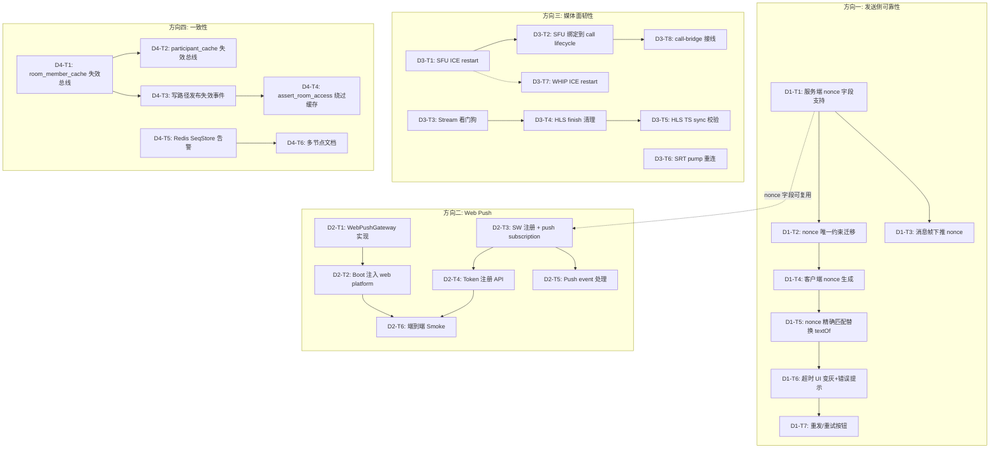

# Tech Lead 分析报告：Aero IM 战略缺口实施计划

## 概述

经完整的代码交叉验证，分析文档识别的四个方向（**发送侧可靠性**、**Web Push**、**媒体面韧性**、**一致性**）均为真实存在的战略缺口。以下将每个方向拆解为可直接下发的技术任务，并给出执行顺序、风险及资源评估。

---

## 1. 任务分解

### 方向一：发送侧可靠性（D1）

| 任务 ID | 标题 | 前置 | 涉及文件 | 预估(h) |
|---------|------|------|---------|--------|
| **D1-T1** | 服务端：`send_message` 帧支持 `nonce` 字段 | — | `crates/aero-server/src/ws/ws_impl/mod.rs`（`ClientFrame::SendMessage` + 处理函数）、`crates/aero-im-core/src/service/messages.rs`（`send_message` 签名） | 3 |
| **D1-T2** | 服务端：消息持久化加 `nonce` 唯一约束 | D1-T1 | `migrations/NNNN_nonce.sql`、`crates/aero-storage/src/message.rs`（`NewMessage` + `insert` 方法） | 3 |
| **D1-T3** | 服务端：`message` 帧下推 `nonce` 到 WS 响应 | D1-T1 | `crates/aero-common/src/model.rs`（`Message` struct + serialization）、`crates/aero-im-core/src/service/messages.rs`（`send_message` 返回值） | 2 |
| **D1-T4** | 客户端：`send_message` 加入 `nonce` 生成 | D1-T1 | `web/ws.js`（`sendMessage()`），`web/app.js`（`optimisticAdd()`） | 2 |
| **D1-T5** | 客户端：`findPendingMatch` 改为 nonce 精确匹配 | D1-T4 | `web/app.js`（`handleIncomingMessage()` → `findPendingMatch()`） | 2 |
| **D1-T6** | 客户端：pending 消息超时 UI（15s → 变灰 + 错误提示） | D1-T5 | `web/app.js`（pending 渲染 + 定时器），`web/index.html`（错误态 CSS 类） | 2 |
| **D1-T7** | 客户端：消息重发/重试按钮（超时后） | D1-T6 | `web/app.js`（`optimisticAdd()` + 重试回调）、`web/ws.js`（`sendMessage()`） | 3 |

**小计：17h**

### 方向二：Web Push（D2）

| 任务 ID | 标题 | 前置 | 涉及文件 | 预估(h) |
|---------|------|------|---------|--------|
| **D2-T1** | 新增 `WebPushGateway` 实现 `PushGateway` trait | — | `crates/aero-push/src/web_push.rs`（新文件）、`crates/aero-push/Cargo.toml`（加 `web-push` 依赖）、`crates/aero-push/src/lib.rs`（`pub mod web_push`） | 4 |
| **D2-T2** | Boot 注入：`build_push_gateways()` 加 web platform | D2-T1 | `crates/aero-server/src/bin/boot/helpers.rs`（`build_push_gateways`）、`crates/aero-server/src/state.rs`（`PushGateways::for_platform` 加 `"web"` 分支） | 2 |
| **D2-T3** | 客户端：Service Worker 注册 + push subscription | — | `web/sw.js`（新文件，Service Worker）、`web/app.js`（`navigator.serviceWorker.register` + `pushManager.subscribe`）、`web/index.html`（manifest） | 4 |
| **D2-T4** | 客户端：Push token 注册到服务端 API | D2-T3 | `web/app.js`（`POST /api/me/push-tokens` + `platform: 'web'`） | 2 |
| **D2-T5** | 客户端：收到 push 事件后更新 UI/通知 | D2-T3 | `web/sw.js`（`push` event handler → `clients.matchAll`） | 2 |
| **D2-T6** | 端到端 Smoke 测试 + VAPID key 管理文档 | D2-T2, D2-T5 | `scripts/smoke-webpush.sh`（新文件）、`config.example.toml`（env 文档）、`README.md` | 2 |

**小计：16h**

### 方向三：媒体面韧性（D3）

| 任务 ID | 标题 | 前置 | 涉及文件 | 预估(h) |
|---------|------|------|---------|--------|
| **D3-T1** | SFU 媒体会话 ICE restart 自动恢复 | — | `crates/aero-server/src/sfu_media.rs`（`run()` 循环增加 `IceRestart` 重试逻辑） | 4 |
| **D3-T2** | `SfuMediaSession` 绑定到真实 SFU 路由生命周期 | D3-T1 | `crates/aero-server/src/call_bridge_supervisor.rs`（接线 `bind()`/`run()`） | 3 |
| **D3-T3** | Stream 直播看门狗：60s 扫描过期流 | — | `crates/aero-server/src/bin/boot/background.rs`（增加 `spawn_stream_watchdog`）、`crates/aero-storage/src/stream.rs`（`list_active_since`）、`crates/aero-live-hls/src/lib.rs`（`cleanup_stream`） | 4 |
| **D3-T4** | HLS `finish()` 增加残留文件清理 | D3-T3 | `crates/aero-live-hls/src/lib.rs`（`finish()` 增加目录清理） | 2 |
| **D3-T5** | HLS `push_segment()` 增加 `0x47` TS sync byte 校验 | D3-T4 | `crates/aero-live-hls/src/lib.rs`（`push_segment()` 头部校验）、`crates/aero-live-hls/src/ts.rs`（`TS_SYNC_BYTE` 常量已存在） | 2 |
| **D3-T6** | SRT pump 断线自动恢复（pump wrapper 加重连循环） | — | `crates/aero-live-srt/src/pump.rs`（外层重试循环）、`crates/aero-live-srt/src/lib.rs`（`run_with_reconnect`） | 4 |
| **D3-T7** | WHIP 会话 ICE restart / DTLS 重连 | D3-T1 | `crates/aero-live-whip/src/session.rs`（`run()` 增加 ICE restart） | 3 |
| **D3-T8** | 跨节点 call-bridge 接线：`SfuMediaSession.fed` tap → `ensure_egress` | D3-T2 | `crates/aero-server/src/sfu_media.rs`（接入 `egress` publish）、`crates/aero-live-webrtc/src/call_bridge.rs`（`CallEgress`） | 4 |

**小计：26h**

### 方向四：一致性（D4）

| 任务 ID | 标题 | 前置 | 涉及文件 | 预估(h) |
|---------|------|------|---------|--------|
| **D4-T1** | 跨节点缓存失效总线：新增 NATS subject `cache.invalidate.room_members` | — | `crates/aero-server/src/room_member_cache.rs`（`invalidate_remote` 方法）、`crates/aero-server/src/bin/boot/background.rs`（订阅 `cache.invalidate.*` 的 listener） | 4 |
| **D4-T2** | 跨节点缓存失效总线：`participant_cache` 同理 | D4-T1 | `crates/aero-server/src/participant_cache.rs`（`invalidate_remote` 方法） | 3 |
| **D4-T3** | 写路径发布失效事件（踢人、2FA 变更、属性更新） | D4-T1, D4-T2 | `crates/aero-im-core/src/service/room.rs`（`remove_member`）、`crates/aero-im-core/src/service/participant.rs`（`update_me`、`delete_participant`） | 4 |
| **D4-T4** | 安全关键路径（`assert_room_access`）绕过缓存 | D4-T3 | `crates/aero-im-core/src/service/room.rs`（`assert_room_access`：踢出/2FA 检查直接走 DB） | 2 |
| **D4-T5** | Redis SeqStore 降级指标 + 告警 | — | `crates/aero-storage/src/seq.rs`（加 Prometheus counter `seq_redis_failures_total`）、`crates/aero-server/src/bin/boot/metrics_tasks.rs` | 2 |
| **D4-T6** | 文档说明多节点部署缓存语义 | D4-T4 | `docs/operations/multi-node.md`（新文件）、`AGENTS.md` §4 更新 | 1 |

**小计：16h**

---

## 2. 执行顺序



### 可并行执行的任务组

| 组 | 任务 | 理由 |
|----|------|------|
| **G1（独立启动）** | D1-T1, D2-T1, D2-T3, D3-T1, D3-T3, D3-T6, D4-T1, D4-T5 | 均无外部入边依赖 |
| **G2（非阻塞依赖）** | D1-T2, D1-T3, D2-T2, D3-T2, D4-T2 | 仅依赖 G1 中对应任务 |
| **G3（纯客户端）** | D2-T4, D2-T5, D1-T4 | 与服务端任务互不阻塞 |

---

## 3. 技术风险

### 3.1 高风险项

| 风险 | 方向 | 描述 | 缓解策略 |
|------|------|------|---------|
| **R1: str0m ICE restart API 不稳定** | D3 | `str0m` 0.19 的 `Rtc` 是否暴露重启 ICE/DTLS 的接口？`Rtc` 的 `poll_output` 在连接断开后是否还返回有效 event？当前代码对 `PollError` 直接 `return`，需要了解 str0m 的会话生命周期。 | 前置原型验证：写一个最小 test，模拟断开后调 `Rtc::ice_restart()` 观察 `poll_output` 行为。如果 str0m 不支持，改为重建 `SfuPeer` 实例。 |
| **R2: Web Push 浏览器兼容性** | D2 | `PushManager.subscribe` 需要 `userVisibleOnly: true`，且 VAPID 公钥需 Base64URL 无填充编码。Firefox/Chrome/Safari 的 payload 加密实现差异（`web-push` crate 处理了但需验证）。 | `web-push` crate 已处理协议层差异；客户端侧添加 `if ('PushManager' in window)` 判据，在不支持环境中降级静默。 |
| **R3: nonce 幂等与 at-least-once 交互** | D1 | `nonce` + `UNIQUE` 约束与现有 `seq` 去重的交互：当 NATS 重投时，`ImService::send_message` 可能被调用两次——第一条成功写入、第二条因 `UNIQUE` 冲突返回错误给 WS 客户端。WS 客户端看到 `Error` 帧可能错误地认为发送失败。 | 服务端 `send_message` 的 `nonce` 冲突应返回**静默成功**（返回已存在的消息 ID），而非错误。WS 处理函数需区分 `Duplicate` 和 `Invalid`。 |
| **R4: 缓存失效总线消息风暴** | D4 | 高变更场景（大规模踢人、批量改名）可能导致 NATS `cache.invalidate.*` 洪泛，所有接收节点都处理失效。 | 失效率去重：`room_member_cache` 用 `Instant` + 去抖窗口（同 room 的失效在 500ms 窗口内合并）；使用 NATS `queue-group` 令每集群仅一个节点处理失效。 |

### 3.2 中风险项

| 风险 | 方向 | 描述 |
|------|------|------|
| **R5: SRT pump 重连循环导致资源泄漏** | D3 | 每分钟断线重连的场景下，旧的 UDP socket 可能没被及时关闭。需要确保 `Drop` 实现关闭 socket。 |
| **R6: `textOf` 变更静默影响现有 pending 消息** | D1 | 替换为 nonce 匹配后，现有未决 pending 消息（服务端尚未确认）丢失匹配机会。需在更新后客户端首次连接时清空 `pendingByTempId`。 |
| **R7: HLS 碎片清理时序** | D3 | 看门狗清理流文件时，可能有 HLS 播放器正在读取 `.ts`。Linux 下文件删除是引用计数释放，打开的 fd 仍可读取，风险可控。 |

### 3.3 性能考量

- **D4 失效总线**：每个写操作多发一条 NATS 消息。典型负载下 kick（~1/s）vs. message（100+/s），增量可忽略。
- **D3 看门狗**：每 60s 一次 `list_active_since` + 对过期流逐流清理。已有 retention sweep 模式可复用。
- **D2 Web Push**：每个通知走一次 HTTP POST（FCM/APNs 已如此），加一个 webpush HTTP 调用对延迟影响可忽略。

---

## 4. 资源评估

### 4.1 技能要求

| 角色 | 方向 | 核心技能 | 人数 |
|------|------|---------|------|
| **全栈 Rust 工程师** | D1, D4 | tokio async, sqlx, serde, WebSocket 协议 | 1 |
| **前端工程师** | D1, D2 | JavaScript (ES2020), Service Worker, Web Push API, DOM 操作 | 1 |
| **Rust 媒体工程师** | D3 | str0m/WebRTC, RTP/RTCP, SRT/TS, UDP I/O | 1 |
| **DevOps/QA** | 全方向 | NATS, Redis, 集成测试, CI/CD, smoke 脚本 | 0.5 (共享) |

### 4.2 关键里程碑

| 里程碑 | 依赖 | 预估 Time-to-Market |
|--------|------|-------------------|
| **M1: P0 修复完成**（D1-T1~T5 nonce 端到端） | D1-T1~T5 | **1.5 天** |
| **M2: Web Push MVP**（浏览器收到推送） | D2-T1~T5 | **2.5 天** |
| **M3: 媒体面韧性基线**（ICE restart + SRT 重连 + 看门狗） | D3-T1, T3, T6 | **2 天** |
| **M4: 缓存一致性问题修复** | D4-T1~T4 | **2 天** |
| **M5: 全方向集成测试 + 文档** | M1~M4 | **1 天** |

### 4.3 阻塞点与解决策略

| Blockers | 方向 | 解决策略 |
|----------|------|---------|
| **B1: str0m ICE restart API 未知** | D3 | Day 1 安排原型验证（2h）。备选方案：重建 SfuPeer（坏连接→drop→新建 Rtc）。 |
| **B2: VAPID key 生成与管理** | D2 | `web-push` crate 提供 `generate_vapid_keypair()`；Ops 部署时生成一次并配置 `AERO_WEB_PUSH_*` env。 |
| **B3: Service Worker 作用域限制** | D2 | SW 只能控制同路径 / 子路径。需确保 `sw.js` 放在 web root 且 `scope: '/'`。 |

---

## 5. 质量保证

### 5.1 单元测试覆盖

| 任务 | 测试要求 | 类型 |
|------|---------|------|
| **D1-T2** | `NewMessage` 构造 `nonce` 字段 + DB `UNIQUE` 约束验证 | 仓储集成测试（`#[ignore]` + `DATABASE_URL`） |
| **D1-T5** | `findPendingMatch` 替换为 nonce 精确匹配：相同 nonce 命中、不同 nonce 不命中、无 nonce 不匹配 | 纯 JS 单元测试 |
| **D2-T1** | `WebPushGateway::send` → 正确的 `web-push` 调用参数 | Mock `web-push` HTTP client |
| **D3-T1** | ICE restart 后 str0m `poll_output` 产生新 Transmit | `#[cfg(test)]` 单元测试（纯状态机） |
| **D3-T5** | `push_segment` 拒绝无 `0x47` 的首字节 → `HlsError::Invalid` | 纯单元测试 |
| **D4-T1** | `invalidate_remote` → NATS publish → 同级消费 → `DashMap` 清除 | 集成测试 |

### 5.2 集成测试策略

| 场景 | 覆盖方向 | 测试方式 |
|------|---------|---------|
| nonce 幂等：WS 重投同一帧 | D1 | `ws_impl` test: 发送两次 `send_message{nonce:"x"}` → 仅产生一条消息 + 第二次返回成功 |
| 跨节点缓存失效：节点 A 踢人 → 节点 B 缓存清除 | D4 | 两个 `AppState` 实例，共享 NATS/Redis/PG，验证 `room_member_cache.get_or_fetch` |
| stream 看门狗清理：推流中断后流被标记过期 | D3 | `background.rs` test: 注入过期流，tick 一次 watchdog → 验证 HLS 文件清理 |
| Web Push 端到端：Fake Web Push 网关 | D2 | 用 `mockito` mock HTTP 端点，验证 `push_bot` 发送正确 payload |

### 5.3 代码审查要点

| 审查项 | 重点关注 |
|--------|---------|
| **nonce 兼容性** | 旧客户端发送无 nonce 的消息不阻塞；`UNIQUE` 约束允许 `NULL` |
| **ICE restart 安全性** | `SfuPeer::restart_ice` 不应泄露旧加密密钥；DTLS 重建需全新握手 |
| **缓存失效健壮性** | NATS 集群重启后，失效订阅 durable consumer 不丢失事件；纯 `fan-out` 语义而非 queue-group |
| **SRT 重连资源泄漏** | 旧 `SrtSession` 和 socket 必须正确 `Drop`；`pump` 重试循环需 backoff |

### 5.4 性能测试需求

| 场景 | 方向 | 指标 | 工具 |
|------|------|------|------|
| nonce 唯一约束对写入吞吐的影响 | D1 | 插入延迟增量 < 5% | pgbench / 自定义 load test |
| 缓存失效总线对写路径延迟的影响 | D4 | p99 延迟增量 < 2ms | 内部 timing metrics |
| 看门狗扫描对 PG 的查询负载 | D3 | `list_active_since` < 50ms | pg_stat_statements |

---

## 6. 实施计划

### 阶段 1：P0 快速修复 + 基础设施搭建（Day 1-2）

```mermaid
gantt
    title 阶段 1
    dateFormat  YYYY-MM-DD
    axisFormat  %m-%d
    section 方向一
    D1-T1: 服务端 nonce 字段: d1_1, 2026-07-14, 4h
    D1-T2: nonce 唯一约束迁移: d1_2, after d1_1, 4h
    D1-T3: 消息帧下推 nonce: d1_3, after d1_1, 2h
    D1-T4: 客户端 nonce 生成: after d1_2, 3h
    D1-T5: nonce 精确匹配: after d1_4, 2h
    section 方向二/三/四 基础设施
    D2-T3: Service Worker 注册: d2_3, 2026-07-14, 4h
    D3-T1: SFU ICE restart 原型: d3_1, 2026-07-14, 4h
    D3-T3: Stream 看门狗: d3_3, 2026-07-14, 4h
    D4-T1: 失效总线 R1: d4_1, 2026-07-14, 4h
    D4-T5: SeqStore 告警: d4_5, 2026-07-14, 2h
```

**产出**:
- nonce 端到端流程可运行（D1-T1~T5）
- `room_member_cache` 跨节点失效已验证（D4-T1）
- Stream 看门狗 60s 扫描可工作（D3-T3）
- Service Worker 注册成功（D2-T3）

### 阶段 2：核心功能完成（Day 3-4）

```mermaid
gantt
    title 阶段 2
    dateFormat  YYYY-MM-DD
    axisFormat  %m-%d
    section 方向一
    D1-T6: 超时 UI 变灰: after d1_5, 2h
    D1-T7: 重发按钮: after d1_6, 3h
    section 方向二
    D2-T1: WebPushGateway 实现: d2_1, 2026-07-16, 4h
    D2-T2: Boot 注入: after d2_1, 2h
    D2-T4: Token 注册: after d2_3, 2h
    D2-T5: Push event 处理: after d2_3, 2h
    section 方向三
    D3-T2: SFU 绑定 call lifecycle: after d3_1, 3h
    D3-T4: HLS finish 清理: after d3_3, 2h
    D3-T5: TS sync 校验: after d3_4, 2h
    D3-T6: SRT pump 重连: d3_6, 2026-07-16, 4h
    D3-T7: WHIP ICE restart: after d3_1, 3h
    section 方向四
    D4-T2: participant_cache 失效: after d4_1, 3h
    D4-T3: 写路径发布失效: after d4_2, 4h
    D4-T4: assert_room_access 绕过: after d4_3, 2h
```

**产出**:
- 所有四个方向的 P1 功能实现完成
- Web Push 端到端可用（浏览器注册 + 接收推送）
- HLS 流断线后自动清除残留文件
- 缓存失效总线覆盖 participant + room_member

### 阶段 3：集成测试 + 优化（Day 5-6）

| 活动 | 持续时间 | 负责 |
|------|---------|------|
| nonce 幂等集成测试 | 2h | 全栈工程师 |
| 跨节点缓存失效集成测试 | 3h | 全栈工程师 + QA |
| Web Push smoke 脚本 + 浏览器手动验证 | 2h | 前端工程师 |
| 媒体面韧性集成测试（ICE restart + SRT 重连） | 4h | 媒体工程师 |
| 性能基准测试（写吞吐 + 缓存失效延迟） | 2h | QA |
| Bug 修复 + 边缘 case 处理 | 4h | 全员 |

### 阶段 4：发布准备（Day 7）

| 活动 | 持续时间 |
|------|---------|
| 代码审查（全员 cross-review） | 3h |
| 文档更新（`AGENTS.md`、`README.md`、`config.example.toml`） | 2h |
| CI 流水线更新（`file-size-check.sh`、`truth-check.sh`） | 1h |
| 合并 master + 部署预发布环境验证 | 2h |
| `make smoke` 全绿确认 | 1h |

---

## 总结：关键路径与建议

### 最大 ROI 任务

```
D1-T1 + D1-T4 + D1-T5（nonce 精确匹配） ─── 同时解决：
  1. ⚠️ 幽灵消息漏洞（15s 窗口 + textOf 忽略提及）
  2. ⚠️ pending 消息误配（相同文本不同提及）
  3. ⚠️ 无可靠回退机制
  实际代码改动量小，影响面大
```

### 建议执行顺序（基于风险与收益）

1. **Day 1 AM**：D1-T1→T2（nonce 服务端）, D4-T1（room_member 失效总线的 NATS 订阅端）— 这两项是后续所有任务的依赖
2. **Day 1 PM**：D1-T3→T4→T5（nonce 客户端, 与 QA 并行验证）, D3-T1（str0m ICE restart 原型验证）
3. **Day 2**：D1-T6→T7（超时 UI, 依赖 T5）, D2-T3（SW 注册）, D3-T3+T6（看门狗 + SRT 重连）
4. **Day 3-4**：D2-T1→T2→T4→T5（完整 Web Push 链路）, D3-T2→T8（SFU 绑定 + call-bridge）
5. **Day 5-6**：集成测试 + 调优
6. **Day 7**：发布

### 悬而未决的问题

- **BLOCKER B1**: 需要在 Day 1 确认 str0m 是否支持 `ice_restart()`。如果否，D3-T1/7 改为重建 `SfuPeer` 方案（增加 ~2h 工时但消除风险）。
- **BLOCKER B2**: Web Push 需要 Ops 生成 VAPID key pair 并配置环境变量，建议 Day 0 预备。
- **Web Push 浏览器覆盖率**: Safari 的 Push API 支持自 iOS 16.4+，但需要 Apple Push Notifications（APNs）而非标准 VAPID。初始实现应专注于 Chrome/Firefox/Edge，Safari 支持列为 P2 后续迭代。
