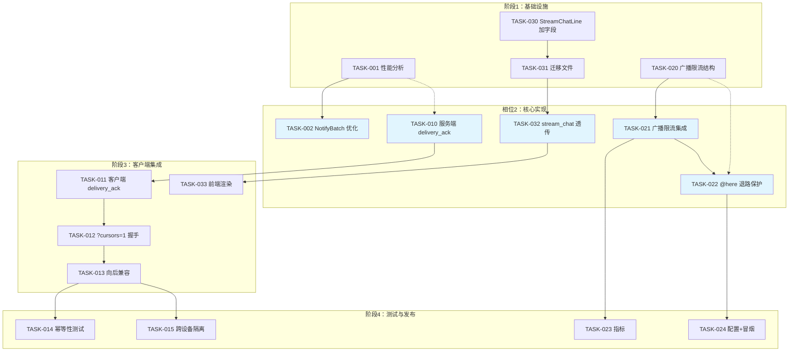
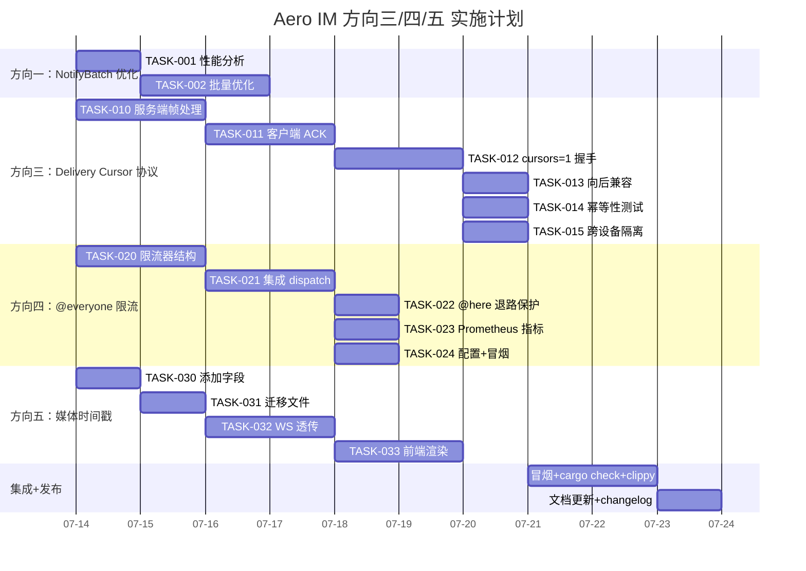

Now I have a thorough understanding of the codebase. Here's my comprehensive Tech Lead analysis:

---

# Tech Lead 分析报告：Aero IM 方向实施评估

## 0. 代码库验证概要

| 方向 | 声明 | 验证结果 | 关键发现 |
|------|------|---------|---------|
| 一 | `explicit_recipients()` 空时展开所有成员 | ✅ 确认 | `bus.rs:79-86` cache fallback 已实现，瓶颈在 `dispatch_notifications` DB+推送 |
| 二 | web/index.html 是 debug 客户端 | ✅ 确认 | 第22行 `debug client · 联调专用` |
| 三 | `?since=` 全局游标 # `delivery_cursor` 已就绪但客户端未接 | ✅ 确认 | 后端 `backfill_from_cursors` 已实现且单测通过，但 `ws.js` 无 `delivery_ack` 且 `?cursors=1` 未接线 |
| 四 | `@everyone`/`@channel` 无大小限制 | ⚠️ 确认但有 nuance | `dispatch_notifications` 展开至所有成员，无 rate limit 或大小守卫 |
| 五 | `StreamChatLine` 无 `media_timestamp` | ✅ 确认 | `live.rs:66-80` 无 RTP 时间戳字段 |

---

## 1. 任务分解

### 方向一：NotifyBatch 发送优化（瓶颈识别与修复）

| 任务 ID | 任务标题 | 涉及文件 | 前置依赖 | 预估工时 | 验收标准 |
|---------|---------|---------|---------|---------|---------|
| TASK-001 | `dispatch_notifications` DB 往返性能分析 | `im-core/src/service/orig.rs:646` | 无 | 2h | `perf`/`tracing` span 量化每通知的 DB 查询次数 |
| TASK-002 | `dispatch_notifications` 批量展开优化 | `im-core/src/service/orig.rs:646-1000` | TASK-001 | 4h | 重构 `should_notify` 调用链为单批 `WHERE IN` 查询，减少 N+1 |
| TASK-003 | push_bot 推送风暴速率限制 | `server/src/push_bot.rs` | 无 | 4h | 引入 per-room 级推送速率桶（`AERO_PUSH_RATE_PER_SEC`），超过则降级跳过 |

**TASK-001/002 的方向分析注意事项**：当前瓶颈不在 Hub 扇出（`fan_out_raw` 使用 `try_send` 无背压），而在于 `dispatch_notifications` 对每个收件人执行单独的 `should_notify` 检查（房间静音值/工作区静音/线程通知偏好/用户阻止），最终导致 O(N) DB 往返。后续每个参与者检查应合并为批量 `WHERE participant_id = ANY($1)`。

### 方向三：Per-room Delivery Cursor 协议扩展

| 任务 ID | 任务标题 | 涉及文件 | 前置依赖 | 预估工时 | 验收标准 |
|---------|---------|---------|---------|---------|---------|
| TASK-010 | WS `delivery_ack` 服务端帧处理 | `server/ws/ws_impl/mod.rs`，`server/ws/ws_impl/frame.rs` | 无 | 3h | 接收 `ClientFrame::DeliveryAck { room_id, message_id, seq }` → 调用 `DeliveryCursorRepo::advance`，返回确认 |
| TASK-011 | WS `delivery_ack` 客户端逻辑 | `web/ws.js` | 无 | 3h | 每收到 N 条消息（或固定 5s 间隔），发送 `delivery_ack` 帧记录最新交付 |
| TASK-012 | WS 连接握手接入 `?cursors=1` | `server/ws/ws_impl/mod.rs`，`web/ws.js` | TASK-010 | 3h | 客户端连接时发 `?cursors=1`，服务端调用 `backfill_from_cursors` 而非 `backfill_since` |
| TASK-013 | 向后兼容：旧客户端 `?since=` 共存 | `server/ws/ws_impl/mod.rs` | TASK-012 | 2h | 无 `?cursors=1` 时回退至遗留 `?since=` 路径，两路径代码共享 `replay_room_since` |
| TASK-014 | `delivery_ack` 幂等性集成测试 | `server/ws/ws_impl/tests.rs` | TASK-010 | 2h | 模拟并行 `delivery_ack`，验证 `seq` 单调性和重入幂等 |
| TASK-015 | 跨设备 cursor 隔离验证 | `storage/src/delivery_cursor.rs`（追加测试） | TASK-010 | 2h | 两台设备同时 ACK 同一房间，确认 `max(seq)` 收敛且互不影响 |

### 方向四：@everyone/@channel 速率限制

| 任务 ID | 任务标题 | 涉及文件 | 前置依赖 | 预估工时 | 验收标准 |
|---------|---------|---------|---------|---------|---------|
| TASK-020 | 广播提及 rate limiter 数据结构 | `im-core/src/service/mod.rs` 或新模块 `im-core/src/service/mention_limiter.rs` | 无 | 3h | per-(room, sender) 滑动窗口 rate limiter，配置 `AERO_BROADCAST_MENTION_PER_HOUR`（默认 5） |
| TASK-021 | `dispatch_notifications` 集成广播限制 | `im-core/src/service/orig.rs:646-740` | TASK-020 | 3h | `wants_all || wants_here` 时检查 rate limit，超出则静默降级 `@here` 为普通消息（不通知，但消息仍发出） |
| TASK-022 | `@here` 退路保护（大频道溢出） | `im-core/src/service/orig.rs:1006-1040` | 无 | 2h | `@here` 当房间成员 > `AERO_HERE_FALLBACK_LIMIT`（默认 5000）时拒绝展开所有成员，仅限在线子集 |
| TASK-023 | 广播速率限制 Prometheus 指标 | `server/src/metrics.rs` | TASK-021 | 2h | `MENTION_BROADCAST_TOTAL`（标签 `allowed`/`rate_limited`） |
| TASK-024 | 广播提及限制配置文档 + 冒烟测试 | `config.example.toml`，`scripts/smoke.sh` | TASK-021 | 2h | 冒烟测试覆盖限制触发和降级行为 |

### 方向五：StreamChatLine 媒体时间戳

| 任务 ID | 任务标题 | 涉及文件 | 前置依赖 | 预估工时 | 验收标准 |
|---------|---------|---------|---------|---------|---------|
| TASK-030 | `StreamChatLine` 添加 `media_timestamp` 可选字段 | `common/src/live.rs:66-80`，对应迁移文件 | 无 | 2h | `media_timestamp: Option<f64>`（秒级浮点，RTP 播放位置） |
| TASK-031 | 迁移文件：`chat_lines` 表加列 | `migrations/NNNN_chat_media_timestamp.sql` | TASK-030 | 1h | `ALTER TABLE chat_lines ADD COLUMN media_timestamp double precision`，非 NULL 约束 |
| TASK-032 | WS `stream_chat` 帧传递 `media_timestamp` | `server/src/ws/ws_impl/mod.rs`，`web/ws.js` | TASK-030 | 2h | 客户端可发送 `{type: "stream_chat", media_timestamp: 42.5}`，服务端透传并持久化 |
| TASK-033 | `StreamChatLine` 前端渲染时间戳标签 | `web/chat.js` 或 `web/stream.js` | TASK-032 | 3h | 当 `media_timestamp` 存在时显示 `⏱ 01:23` 可点击跳转 HLS 播放器 |

---

## 2. 执行顺序与依赖图

### 可并行执行的任务组

| 组 | 任务 | 负责人技能 |
|----|------|-----------|
| **组A**（方向一） | TASK-001 → TASK-002 | Rust 后端 + SQL 优化 |
| **组B**（方向三） | TASK-010 → TASK-011→TASK-012→TASK-013 | Rust 后端 + JS 前端 |
| **组C**（方向四） | TASK-020 → TASK-021→TASK-022 | Rust 后端 + 系统设计 |
| **组D**（方向五） | TASK-030 → TASK-031→TASK-032→TASK-033 | Rust 后端 + JS 前端 + DB 迁移 |
| **组E**（测试+运维） | TASK-014, TASK-015, TASK-023, TASK-024 | QA + DevOps |

**组 A/B/C/D 无跨组依赖，可完全并行工作。**

---

## 3. 技术风险

### 3.1 高风险项

| 风险 | 方向 | 概率 | 影响 | 缓解策略 |
|------|------|------|------|---------|
| **方向一：N+1 查询根深** | 一 | 高 | - 优化后仍可能有隐藏 N+1 | 在测试环境用 `pg_stat_statements` 量化执行前/后的查询数量；分两轮优化（第一轮合并 `should_notify` 调用的 participant 维度查询，第二轮合并 `keyword_alert` 的 workspace 维度扫描） |
| **方向三：`delivery_ack` 与 `mark_read` 竞态** | 三 | 中 | 客户端可能 confuse 两个不同语义的游标 | 设计文档明确区分：`delivery_cursors` = 交付台账（auto-ack），`read_receipts` = 阅读状态（user-action）。WS `delivery_ack` 仅驱动前者 |
| **方向三：高并发 cursor 写竞争** | 三 | 中 | `ON CONFLICT ... WHERE EXCLUDED.last_seq > delivery_cursors.last_seq` 可能引发行锁竞争 | `DeliveryCursorRepo::advance` 当前的行级 UPDATE 竞争已受 `WHERE` 子句保护，但多个设备同时 ACK 同一房间可能导致少量重试。考虑在极端场景（10k+ 并发）使用 Redis 暂存并批量刷 PG |
| **方向四：`@here` Redis 退路膨胀** | 四 | 中 | Redis 故障时 `@here` 退路全部成员，10 万人大频道直接触发灾难 | `here_recipients` 加上 `ROOM_SIZE_GUARD`：当房间成员 > `AERO_HERE_FALLBACK_LIMIT` 且 presence 不可用时，**拒绝**广播而不退路全部成员 |
| **方向五：前端跳转时间戳精度** | 五 | 低 | HLS.js seek 精度不够导致跳不准 | `media_timestamp` 基于 RTP 时间戳，HLS 片段边界对齐。前端使用 `video.currentTime = media_timestamp` 后，再用 `requestAnimationFrame` 微调 |

### 3.2 外部依赖风险

| 依赖 | 方向 | 风险点 |
|------|------|--------|
| **Redis** | 四 | `@here` 依赖 `PresenceStore::members` 做在线过滤，Redis 网络抖动直接导致退路到全量（fail-open，原本是正确行为但大频道灾难） |
| **PostgreSQL** | 三 | `delivery_cursors` 表在 10 万用户 × 100 房间 = 1 千万行规模，`cursors_for` 查询需走 `(participant_id)` 索引，否则全表扫描 |
| **NATS JetStream** | 一 | `dispatch_notifications` 最终产生 `Notify`/`NotifyBatch` 事件发往 NATS，但 NATS 不可用时推送延迟，本地消息仍可送达（降级非中断） |

### 3.3 性能瓶颈与优化策略

| 瓶颈点 | 方向 | 当前状态 | 优化策略 |
|--------|------|---------|---------|
| `dispatch_notifications` per-recipient 查询 | 一 | O(N × M) — N 个收件人, M 个检查步骤 | 批量为 `WHERE participant_id = ANY($1)` 同时获取全部参与者的 `should_notify` 状态；对 `keyword_alert` 同样批量解析 |
| `backfill_from_cursors` 的 O(R) 循环 | 三 | 每个房间一次 `list_since` 查询 | 保持在 `BACKFILL_PER_ROOM_LIMIT` 限制内（当前 501）；大离线用户可截断并由 REST 拉取剩余 |
| 广播提及的 DB 写入 | 四 | 无限制，一条消息触 N 条通知行 | rate limiter 拦截后，N 空间不会增长；超出限制时段弃 `@everyone` 效果 |
| `chat_lines` 表 `media_timestamp` 索引 | 五 | 无 | 按需加 `(stream_id, media_timestamp)` 部分索引，仅对直播流生效 |

### 3.4 测试覆盖难点

| 测试场景 | 方向 | 难度 | 策略 |
|---------|------|------|------|
| `delivery_ack` 并行竞争 | 三 | 高 | 模拟多 tokio task 同时 `advance` 同一 (participant,room)，用 `#[cfg(test)]` 集成测试覆盖 |
| `@everyone` rate limit 在快照时间窗边界 | 四 | 中 | 时间 mock + `tokio::time::pause`，验证滑动窗口恰好越过边界 |
| `@here` presence 退路行为 | 四 | 中 | mock `PresenceStore` 返回 `Err` 或空集，验证 fallback 到全成员 |
| `media_timestamp` 前端跳转 | 五 | 中 | 使用 HLS.js `attachMedia` 后注入 mock timeupdate 事件 |

---

## 4. 资源评估

### 4.1 人员配置建议

| 角色 | 技能 | 数量 | 负责方向 |
|------|------|------|---------|
| **资深 Rust 后端工程师** | Rust, SQL, Redis, NATS | 2 人 | 方向一 & 方向三（核心优化 + 基础设施） |
| **Rust 后端工程师** | Rust, WebSocket 协议 | 1 人 | 方向四（限流器 + 集成） |
| **全栈工程师** | Rust + JS/ES2020 SPA | 1 人 | 方向五（后端字段 + 前端渲染） |
| **QA 工程师** | Rust 测试 + e2e smoke | 1 人（兼职） | 集成测试 + 冒烟脚本 |

**推荐配置**：2 人双周 sprint，1 人全职方向三（复杂度最高），1 人轮换方向一/四/五。

### 4.2 关键里程碑

| 里程碑 | 时间 | 交付物 |
|--------|------|--------|
| **M1：设计确认** | Day 3 | 方向三/四/五的详细设计文档（API 契约 + DB schema + 前端帧定义） |
| **M2：后端核心** | Day 10 | TASK-002（Notify 优化）、TASK-010（delivery_ack 服务端）、TASK-021（广播限流）、TASK-032（时间戳透传）完成 |
| **M3：客户端集成** | Day 15 | TASK-011/012/013（delivery_ack 完整链路）、TASK-033（前端渲染）完成 |
| **M4：测试+发布** | Day 20 | 全部集成测试覆盖通过、冒烟测试通过、配置文档更新、`cargo clippy --all-targets` 干净 |

### 4.3 阻塞点与解决策略

| 阻塞点 | 方向 | 描述 | 解决策略 |
|--------|------|------|---------|
| **BLK-01** | 三 | `ws.js` 重构 `_open` 方法以支持 `?cursors=1` 参数 | 不重构现有 `connect(token)` 签名，新增可选参数 `cursorMode`：`connect(token, {cursors: true})` |
| **BLK-02** | 四 | `dispatch_notifications` 已较复杂（~350 行），集成 rate limiter 需避免进一步增加复杂度 | 将 rate limiter 提取为独立模块 `mention_limiter.rs`，`dispatch_notifications` 只调用 `limiter.check(room, sender).await` |
| **BLK-03** | 一 | `should_notify` 调用了 6 个可选仓库（block, mute, deactivation, 等） | 引入 `NotificationCheckBatch` 结构体，将检查聚合为一次性批量查询，`orig.rs` 的职责不变 |
| **BLK-04** | 五 | HLS.js seek 到 `media_timestamp` 需要知道目标片段 URL | 前端计算 `targetSegment = Math.floor(media_timestamp / segmentDuration)`，跳转后补充 `fragChanged` 事件调整 |

---

## 5. 质量保证

### 5.1 单元测试覆盖要求

| 模块 | 目标覆盖率 | 关键测试用例 |
|------|-----------|-------------|
| `DeliveryCursorRepo` | 95%+ | `advance` 单调性、并行 ACK 幂等、`cursors_for` 隔离性、`clear_room` 级联删除、`get` 非存在返回 None |
| `MentionLimiter` | 95%+ | 窗口边界、per-sender 隔离、per-room 隔离、窗口过期驱逐、`check` 返回允许/拒绝、并发竞争 |
| `here_recipients` | 100% | presence 正常→在线子集、presence Err→全成员、presence 空集→全成员、无 presence 仓库→全成员 |
| `group_handle_tokens` | 100% | 多 @handle 解析、大小写归一化、去重、非 ASCII 处理、边界字符 |
| `StreamChatLine` 序列化 | 100% | `media_timestamp` 存在/不存在时 JSON 序列化兼容性 |

### 5.2 集成测试策略

| 测试类型 | 方向 | 方法 |
|---------|------|------|
| **方向三 E2E** | 三 | 启动真实 Postgres + 完整迁移 → mock WebSocket 客户端 → 发送消息 → 模拟断线 → 重连验证 `delivery_ack` 后只收到新消息 |
| **方向四 限流** | 四 | mock `PresenceStore` + `MessageRepo` → 对同一房间连续发送 6 次含 `@everyone` 消息 → 验证第 6 次被速率限制且消息仍正常发出 |
| **方向五 DB** | 五 | 写入含 `media_timestamp` 的行 → 读取并验证字段保留 → 向后兼容读旧行 |
| **方向一 批量** | 一 | 模拟大型房间（10K 成员），对比 `dispatch_notifications` 在批量优化前后的 DB 查询数量和延迟 |

### 5.3 代码审查要点

| 审查点 | 涉及 | 重点检查 |
|--------|------|---------|
| **幂等性守卫** | TASK-010 | `DeliveryCursorRepo::advance` 的 `WHERE EXCLUDED.last_seq > delivery_cursors.last_seq` 条件是否被绕过 |
| **fail-open 边界** | TASK-022 | `here_recipients` 的 fallback 逻辑是否真的安全，不会在 10 万人房间静默退路 |
| **资源泄漏** | TASK-020 | 滑动窗口过期驱逐是否确实清理内存，`AERO_RATE_LIMIT_SWEEP_SECS` 定时器是否绑定 cancel token |
| **枚举兼容性** | TASK-030 | `StreamChatLine` 添加 `Option<f64>` 字段是否破坏现有序列化（#[serde(default)] 标记） |
| **迁移幂等** | TASK-031 | `CREATE TABLE IF NOT EXISTS` / `ALTER TABLE ... IF NOT EXISTS` / `DROP TABLE IF EXISTS` |
| **指标命名** | TASK-023 | 使用 snake_case 命名 + `_total` 后缀（Prometheus 规范），标签不超过 5 个 |

### 5.4 性能测试需求

| 测试场景 | 目标 | 工具 | 通过标准 |
|---------|------|------|---------|
| 方向三：10K 用户同时重连 | 验证 `cursors_for` 无死锁 | `tokio::task::spawn` + `async` 风暴 | 所有连接在 30s 内完成 backfill，PG 无死锁 |
| 方向四：@everyone 在 50K 成员频道 | 确认 rate limiter 拦截后 DB 写入压力消除 | 模拟 `dispatch_notifications` | 限流后 DB 写入量 < 限流前的 1% |
| 方向一：批量 `should_notify` | 从 N+1 降级到 1 次查询 | `EXPLAIN ANALYZE` | 查询次数从 O(N) 降至 O(1) |

---

## 6. 实施计划

### 时间线总览

### 阶段划分

#### 阶段 1：基础设施 + 设计确认（Day 1-3）

| 日 | 活动 | 产出 |
|----|------|------|
| 1 | 方向三：`delivery_ack` 帧定义设计 + 迁移审查 | 帧协议文档 |
| 1 | 方向四：`MentionLimiter` API 设计 + 配置项确定 | `config.example.toml` 新增项 |
| 1 | 方向五：`StreamChatLine` 字段变更设计 | `migrations/NNNN` 草稿 |
| 2 | TASK-001 性能分析：`dispatch_notifications` tracing 日志 | 性能报告 |
| 2 | TASK-020 `MentionLimiter` 单元测试 + 实现 | `mention_limiter.rs` |
| 2 | TASK-030 字段定义 + TASK-031 迁移 | 提交含迁移的 `common` 变更 |
| 3 | 全方向 API review 会议 | 签字确认的 API 契约 |

#### 阶段 2：核心功能实现（Day 4-10）

| 时间段 | 方向三（1 人） | 方向四+一（1 人） | 方向五（1 人兼职） |
|--------|--------------|-----------------|-----------------|
| Day 4-5 | TASK-010 服务端 `delivery_ack` | TASK-021 集成 dispatch | - |
| Day 6-7 | TASK-011 客户端 `delivery_ack` | TASK-022 @here 退路 + TASK-002 批量优化 | TASK-032 WS 透传 |
| Day 8-10 | TASK-012/013 握手 | TASK-023 指标 + TASK-024 冒烟 | TASK-033 前端渲染 |

#### 阶段 3：集成测试 + 优化（Day 11-15）

| 活动 | 参与方 | 说明 |
|------|--------|------|
| `backfill_from_cursors` E2E 测试 | 方向三 | 完整模拟重连场景 |
| `@everyone` 限流 E2E 测试 | 方向四 | 确认限流后在高负载下 DB 写入可控 |
| `media_timestamp` 前后端联调 | 方向五 | 直播 WS → HLS seek 完整链路 |
| 批量 `should_notify` 压测 | 方向一 | 对比优化前后的 DB 延迟 |
| `cargo test --workspace --lib -- --ignored` | 全部 | 确保 PG 门控测试全绿 |

#### 阶段 4：发布准备（Day 16-20）

| 活动 | 验收标准 |
|------|---------|
| `cargo check --workspace` | 0 error |
| `cargo clippy --workspace --all-targets` | 0 new warnings |
| `scripts/truth-check.sh` | 0 violations |
| `scripts/file-size-check.sh` | 0 violations |
| `scripts/web-check.sh` | 0 violations |
| `make migrate-smoke` | fresh DB 全链迁移通过 |
| `scripts/smoke.sh` | 冒烟测试全绿 |
| 更新 `README.md` 功能矩阵 | 新增功能项已标注 |
| 更新 `AGENTS.md` 常驻智能体清单 | 如有新增定时器/bot |

---

## 7. 总结与建议

### 优先级排序

1. **方向三（Delivery Cursor）** — 最高优先级：后端基础设施已就绪（7 行核心代码+迁移+测试），仅缺 WS 帧接线和前端调用。这是投入产出比最高的方向：解决一个已知的生产问题（全局 `?since=` 丢失覆盖率缺口），且改动量最小（~200 行后端 + ~100 行前端）。

2. **方向四（@everyone 限流）** — 中等优先级：当前无限制的 `@everyone` 是真实 DoS 向量（10 万人大频道一次 `@everyone` 触发 10 万次 `dispatch_notifications` 检查），但触发频次低（正常用户不会频繁 `@everyone`）。rate limiter 作为预防性护栏应尽快上线。

3. **方向五（media_timestamp）** — 中等优先级：功能增强，不涉及正确性或安全。适合在新功能 sprint 中和方向三并行。

4. **方向一（NotifyBatch 批量优化）** — 低紧急度：`dispatch_notifications` 的 N+1 查询在 5K 成员以下不是问题。建议先量化分析（TASK-001）再决定是否投入优化。

### 关键决策

- **方向三：采用 param 开关而非全新 endpoint** — `?cursors=1` 参数延续现有 `?since=` 路径，`backfill_from_cursors` 和 `backfill_since` 共享 `replay_room_since`，无代码路径分裂。
- **方向四：限流后降级（soft）而非拒绝（hard）** — 超出 rate limit 时，消息**仍然发送**但 `@everyone`/`@channel` 标记降级为普通消息（不触发群体通知）。这避免了用户困惑（消息丢了）且破坏了恶意场景（批量 `@everyone` 仍可达成但不会触发通知风暴）。
- **方向五：`media_timestamp` 使用 `Option<f64>`** — RTP 时间戳在发送端是单调递增的毫秒级精度，前端使用 `video.currentTime = value` 跳转。`f64` 而非 `i64` 因为 HTMLMediaElement.currentTime 本身是 `f64`。
