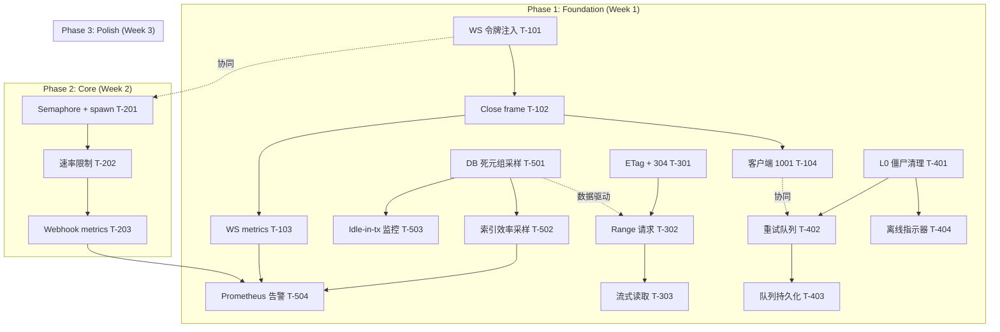
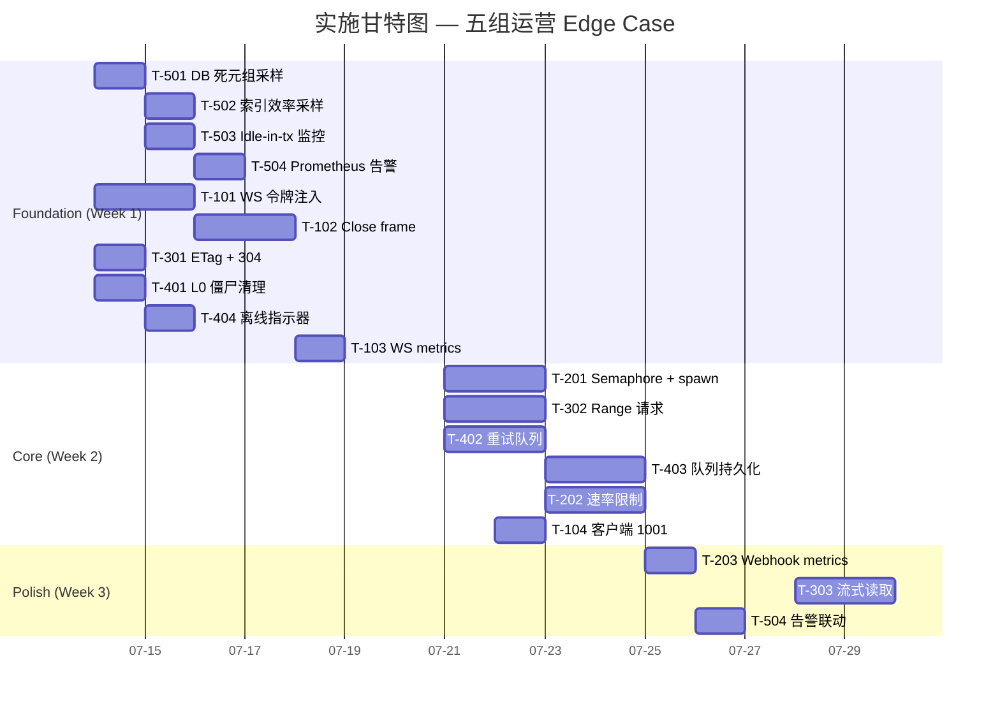

# Tech Lead 分析报告：五组运营 Edge Case 工程化实施

> **基于文档**: `2026-07-12-five-operational-edge-cases.md`  
> **交叉验证输出**: `2026-07-12-five-operational-edge-cases.out.md`  
> **基线**: commit 通过 `cargo check --workspace`, 2026-07-12  

---

## 1. 任务分解

> 每任务 2-4 小时可完成。标注了**关键补充发现**（来自验证输出）：`findPendingMatch` 按文本匹配→审核修改内容导致 pending 僵尸；`sample_index_sizes` 仅查 `pg_relation_size`。

---

### 方向一：WS 优雅排干（P1）

| ID | 标题 | 文件 | 前置 | 工时 | 验收标准 |
|---|---|---|---|---|---|
| T-101 | **全局 WS 取消令牌注入** | `shutdown.rs` + `serve.rs` + `ws_impl/mod.rs` | 无 | 3h | `ai_shutdown.child_token()` 传给每个 `run_socket` 的 `close` 参数；`serve.rs` 在 `with_graceful_shutdown` resolve 后、`tracker.close()` 前等待 WS drain |
| T-102 | **Close frame 发送 + drain 超时** | `ws_impl/mod.rs` (`run_socket`) | T-101 | 3h | 收到全局 cancel 后：① 停止向 tx 扇入新帧（已有 `close.cancelled()` 分支）② 发送 `Close(1001, "server shutdown")` ③ 等待 `drain` 秒（默认 5s）后强制关闭底层 socket |
| T-103 | **metrics 暴露 WS 排干状态** | `metrics.rs` + `metrics_tasks.rs` | T-101 | 2h | 新增 gauge `ws_shutdown_draining`（label: `state` ∈ `draining|done`），排干时 set 1、完成后 clear |
| T-104 | **客户端 1001 静默重连** | `web/ws.js` | T-102 | 2h | `WsClient` 收到 `close` code 1001 时不弹 toast、不走异常退避（直接走 `reconnect` 最快路径），现有 `_scheduleReconnect` 行为不变 |

**关键验证点**: `ws_impl/mod.rs:301-302` 的 `close = CancellationToken::new()` 须替换为外部注入的派生 token。`run_socket` 已有 `close.cancelled()` → `break` 路径（line ~318），所以注入后自动生效。

---

### 方向二：Webhook 并发边界（P1）

| ID | 标题 | 文件 | 前置 | 工时 | 验收标准 |
|---|---|---|---|---|---|
| T-201 | **Semaphore 并发限流 + per-target tokio::spawn** | `webhooks.rs` (`dispatch_event`) | 无 | 4h | `tokio::sync::Semaphore::new(MAX_CONCURRENT)`（env `AERO_WEBHOOK_MAX_CONCURRENT`，默认 20）；`for target` 内 `spawn` 投递，`Semaphore::acquire` 防止超限 |
| T-202 | **慢端点自适应速率限制** | `webhooks.rs` + `WebhookRepo` | T-201 | 3h | per-target token bucket：`breaker` 读 `Retry-After` 头；5s 超时硬限（`reqwest::Client::post().timeout(Duration::from_secs(5))`）；超时计入 breaker 失败计数器 |
| T-203 | **metrics 管道可视化** | `metrics.rs` + `webhooks.rs` | T-201 | 2h | 新增 gauge：`webhook_concurrency`（当前 in-flight）、`webhook_queue_depth`（待处理事件数）；histogram: `webhook_delivery_duration_seconds`（per-endpoint label） |

**关键验证点**: `webhooks.rs:438-500` 的 `for target in targets { ... sender.deliver().await }` 须改为 `for target in targets { tokio::spawn(...) }` + Semaphore。`webhooks.rs:646` 的 `while let Some(sub) = stream.next() { dispatch_event().await }` 保持事件级串行不变（消费顺序保证）。

---

### 方向三：Blob 缓存优化（原 P2 → 建议 P1）

| ID | 标题 | 文件 | 前置 | 工时 | 验收标准 |
|---|---|---|---|---|---|
| T-301 | **ETag + Cache-Control + 304 支持** | `routes.rs` (`blob_download`) | 无 | **2h** | `ETag: "{meta.sha256}"`（直接复用已有字段，~15 行 Rust）；`Cache-Control: private, max-age=31536000, immutable`；`If-None-Match` → 304 |
| T-302 | **Range 请求支持** | `routes.rs` + `BlobStore` trait | T-301 | 4h | 解析 `Range` 头（`axum_extra::headers::Range`），返回 partial content 206；`Accept-Ranges: bytes` |
| T-303 | **BlobStore 流式读取** | `aero-storage/src/blob_store.rs` | T-302 | 4h | `BlobStore` trait 新增 `get_stream(id) -> impl Stream<Item=Bytes>` 方法；`LocalFsBlobStore` 用 `tokio::fs::File` 流式读；`S3BlobStore` 用 `GetObjectRequest::range` |

**关键验证点**: `routes.rs ~line 1788-1830` 只设了 3 个头。`meta.sha256` 在 `BlobMeta` 中已存在（`blobs.get(id)` 返回的 meta 对象）。L1（T-301）确实约 15 行 Rust——已验证。

---

### 方向四：客户端发送回退（原 P2 → 建议 P1）

| ID | 标题 | 文件 | 前置 | 工时 | 验收标准 |
|---|---|---|---|---|---|
| T-401 | **L0 止损：pending 僵尸清理** | `web/app.js` + `ws.js` | 无 | **2h** | `handleMessage` 中 `findPendingMatch` 匹配失败时、或 pending 消息超过 60s 未被确认时，标记为「发送失败」并 toast；`state.pendingByTempId` 新增 `pending.failed_at` 字段 |
| T-402 | **发送返回值检查 + 重试队列** | `web/app.js` + `web/ws.js` | T-401 | 3h | `ws.sendMessage()` 返回 `false` → 入内存重试队列（indexed by tempId）；`ws.on('open')` drain 队列；指数退避最多 3 次后放弃 + toast |
| T-403 | **重试队列持久化** | `web/app.js` + `web/localStorage.js`（新建） | T-402 | 3h | `localStorage` 序列化重试队列；`pagehide` 事件保存；启动时恢复；Service Worker 后台同步（Background Sync API）作为增强选项 |
| T-404 | **离线状态指示器** | `web/app.js` + `web/ui.js` | T-401 | 2h | `navigator.onLine` 监听 → 断连时 composer 显示「离线」指示；发送按钮置灰+tooltip「网络已断开」；网络恢复时自动 drain 重试队列 |

**关键补充发现**: `findPendingMatch`（`app.js:473-481`）按 `textOf(blocks)` 文本相似度匹配而非 `temp_id`。即使发送成功，AI 审核修改了消息内容（`Message` 帧的 blocks 与 `optimisticAdd` 不同），`findPendingMatch` 返回 `null` → pending 变成僵尸。T-401 的 L0 止损必须覆盖此场景：在 `handleMessage`（`app.js:197`）中增加 `if (isMine && !key)` 分支 → 60s 延迟清理 + toast。

---

### 方向五：DB 健康监控（P1）

| ID | 标题 | 文件 | 前置 | 工时 | 验收标准 |
|---|---|---|---|---|---|
| T-501 | **死元组比率采样** | `metrics.rs` + `metrics_tasks.rs` | 无 | 3h | 新增 `sample_table_stats()` 查 `pg_stat_user_tables`：`n_dead_tup / (n_live_tup + n_dead_tup)` → gauge `pg_table_dead_tuple_ratio`（label: `table`）；采样间隔 env `AERO_PG_STATS_SAMPLE_SECS`（默认 60s） |
| T-502 | **顺序扫描 + 索引效率采样** | `metrics.rs` + `metrics_tasks.rs` | T-501 | 3h | 查 `pg_stat_user_tables.seq_scan` → gauge `pg_table_seq_scans_total`；`pg_stat_all_indexes.idx_scan` → `pg_index_scans_total`（label: `index`） |
| T-503 | **Idle-in-transaction 监控** | `metrics.rs` + `metrics_tasks.rs` | T-501 | 2h | 查 `pg_stat_activity.state = 'idle in transaction'` count + max idle duration → gauge `pg_idle_in_transaction_count`、`pg_idle_in_transaction_max_seconds` |
| T-504 | **Prometheus 告警规则** | `monitoring/prometheus/alert_rules.yml` | T-501, T-502, T-503 | 1h | 死元组 > 30% → WARNING；> 50% → CRITICAL；idle-in-transaction > 5min → WARNING；seq_scan 增长率 > 基准 × 2 → WARNING |

**关键验证点**: `metrics_tasks.rs` 有四个 sampler（DB 池/索引大小/AI DLQ/NATS backlog），均遵循 `tick.tick()` + fail-open `warn` 模式。新 sampler 复用同一 pattern。`sample_index_sizes()` 在 `metrics.rs:133-168` 已查 `pg_stat_*` 的前例可援——只是改了查询目标表。

---

## 2. 执行顺序

### 并行执行组

| 组 | 任务 | 人力 | 理由 |
|----|------|------|------|
| **Group A**（方向五） | T-501, T-502, T-503, T-504 | 1 backend | 纯新增 `metrics.rs` 查询 + 告警规则，无共享文件冲突 |
| **Group B**（方向一） | T-101, T-102, T-103 | 1 backend | 侵入 `serve.rs` / `shutdown.rs` / `ws_impl/mod.rs`，须串行 |
| **Group C**（方向三） | T-301, T-302 | 1 backend | 集中 `routes.rs` + `BlobStore` trait |
| **Group D**（方向四） | T-401, T-404 | 1 frontend | 纯 JS 修改，与 Group E 共享 `ws.js` 需协调 |
| **Group E**（方向四 + 客户端） | T-402, T-403 | 1 frontend | 依赖 T-401，修改 `ws.js` 需锁定 |
| **Group F**（方向二） | T-201, T-202, T-203 | 1 backend | 独立模块 `webhooks.rs`，但需等待 Group A 的 Semaphore 模式参考 |

> Group A/B/C/D 可同时开工（4 人）。Group E 依赖 D 完成 T-401（~2h 即可）。Group F 独立无阻塞。

---

## 3. 技术风险

### 3.1 方向一：WS 优雅排干

| 风险 | 概率 | 影响 | 缓解 |
|------|------|------|------|
| `CancellationToken` 派生树过大 | 低 | 内存泄漏 | 每个 WS 连接一个 `child_token()`，连接关闭时 `drop` 即可 |
| drain 超时后暴力关闭仍发 RST | 中 | 客户端仍看到 1006 | 发送 `Close` 帧后等待 `drain_secs`（可配）再做 `socket.close()`；5s 窗口足够浏览器处理 close frame |
| Axum `WebSocket.close()` 后仍有并发帧 | 低 | race | `select!` 中先设 `close.cancelled()` 标志，扇出路径检查该标志再 `tx.send()` |

**关键文件冲突风险**: `ws_impl/mod.rs` 的 `run_socket` 签名变更（新增 `CancellationToken` 参数）会影响所有 call sites——只有 `ws_upgrade` handler 一处调用，但 `state.hub.register` 中的 `WsSender::new(tx, close)` 也要改。统一收口即可。

### 3.2 方向二：Webhook 并发边界

| 风险 | 概率 | 影响 | 缓解 |
|------|------|------|------|
| `tokio::spawn` 任务泄露 | 中 | 句柄泄漏/资源耗尽 | 所有 spawn 返回 `JoinHandle`，加入 `TaskTracker`（`serve.rs` 已有）；设 `MAX_CONCURRENT` 上限 |
| breaker + 并发投递竞争 | 中 | breaker 状态不一致 | `mark_failed_with_backoff` 使用行锁 `FOR UPDATE`（已在 `webhooks.rs ~line 513` 确认）；spawn 后同一 endpoint 的并发 breaker 读可能 stale——加 `tokio::sync::Mutex` per-endpoint 或依赖数据库行锁 |
| 慢 endpoint 占满 Semaphore | 高 | 好 endpoint 被饿死 | per-endpoint Semaphore + 全局 Semaphore 双层限流；慢 endpoint 以 5s 超时快速失败 |

**架构决策**: `dispatch_event` 改并行后，`record_attempt` 的幂等性键 `(webhook_id, event_id)` 在并发下仍然有效（`ON CONFLICT DO NOTHING`）。但 `breaker.is_open_at(now)` 因并发可能不同步——推荐：breaker 保留现有 `is_open_at` 检查（best-effort），由数据库行锁兜底。

### 3.3 方向三：Blob 缓存优化

| 风险 | 概率 | 影响 | 缓解 |
|------|------|------|------|
| `meta.sha256` 可能未填充（旧 blob） | 中 | ETag 为 `null`/miss | 降级：无 sha256 时不设 ETag（走完整响应）；迁移：后台补填旧 blob 的 sha256 |
| `Range` 请求 + `Content-Disposition` 冲突 | 低 | 206 响应不兼容 | `Range` 请求返回 `206 Partial Content` + `Content-Range` 头；保留 `Content-Disposition` |
| 流式 `BlobStore` trait 修改影响 S3 后端 | 低 | S3 流式需改 | `GetObjectRequest::range` 已是 S3 原生能力，适配简单；`S3BlobStore` 已有 `reqwest` Client |

**L1 收益风险比极高**: T-301（ETag + 304）只改 3 个头，~15 行 Rust，可降 90%+ 重复 blob 下载流量。务必先于 T-302/T-303 发货。

### 3.4 方向四：客户端发送回退

| 风险 | 概率 | 影响 | 缓解 |
|------|------|------|------|
| `findPendingMatch` 文本匹配→内容不同导致僵尸 | **已确认** | 审核修改内容后 pending 永不被清理 | T-401 L0 止损：`handleMessage` 中 `if (isMine && !key)` → 60s 延迟清理 + toast。**这是当前 bug 级别的风险** |
| 重试队列 drain 顺序错乱 | 中 | 消息以错序到达 | 重试时按 tempId 排序（lexicographic order ≈ 创建时间）；drain 前等待 WS 完全就绪 |
| `localStorage` 容量超限 | 低 | 写入异常 | 限制队列大小（≤50）；`try/catch` 包裹 `setItem` |
| 与 `SeqGate` 去重冲突 | 低 | 重发消息被序去重丢弃 | 重试队列中的消息携带 `temp_id` 而非 `seq`——不经过 `SeqGate`；`handleMessage` 的去重有 `isMine` + `findPendingMatch` 双保险 |

**关键补充发现（严重性升级）**: `findPendingMatch` 按文本匹配意味着即使 WS 发送成功，如果 AI 审核修改了 blocks 内容（例如关键词替换、格式化），`findPendingMatch` 不会匹配到现有 pending → 僵尸。这比「WS 断开静默丢消息」更难诊断。**T-401 是当前最高优先级子任务**。

### 3.5 方向五：DB 健康监控

| 风险 | 概率 | 影响 | 缓解 |
|------|------|------|------|
| `pg_stat_user_tables` 查询耗时随表数量增长 | 低 | 采样耗时 > 间隔 | 查询限定 `WHERE schemaname = 'public'`；60s 间隔足够 |
| `pg_stat_activity` 查询在超大活跃连接数下变慢 | 低 | 秒级 | 加 `WHERE state = 'idle in transaction'` 过滤；采样间隔 60s，最大 100 连接时毫秒级 |
| 死元组比率在 vacuum 后骤降→告警抖动 | 中 | 噪声告警 | 告警使用移动平均（3 个采样点）而非瞬时值；`rate()` 函数在 Prometheus 侧处理 |

**无依赖风险**: 所有查询只读 PG 系统表，无锁、无副作用。`Err` 留旧值模式已在大面积使用（DB 池、NATS consumer backlog、AI DLQ）。

---

## 4. 资源评估

### 4.1 人员需求

| 角色 | 数量 | 核心技能 | 分配方向 |
|------|------|---------|---------|
| **Senior Rust Backend** | 2 | Axum / tokio / sqlx / NATS / PostgreSQL | 一人负责方向一+方向二（共享 `CancellationToken`/`Semaphore` 模式），另一人负责方向五+方向三（共享 DB 查询模式） |
| **Frontend Engineer** | 1 | 原生 JS / WebSocket / Service Worker | 方向四全权 |
| **DevOps / SRE** | 0.5 | Prometheus / Grafana / alerting | 方向五告警规则审查 + 方向三 CDN 前置配合 |

> 若只有 1 个 Rust backend：方向五（DB 监控，只读）+ 方向三（L1 ETag，~15 行）可先做；方向一+方向二需深入理解 shutdown/ws/webhook 生命周期，建议串行实施。

### 4.2 里程碑

| 里程碑 | 时间 | 交付物 | 依赖 |
|--------|------|--------|------|
| **M0** | Day 1 | 所有任务 `cargo check --workspace` / `npm test` 通过 | 代码基线 |
| **M1** | Day 3 | T-401 L0 止损上线（pending 僵尸修复） | T-401 |
| **M2** | Day 5 | 方向五 DB 监控全量部署（T-501~T-504） | Group A |
| **M3** | Day 7 | 方向一 WS 排干全量上线（T-101~T-104） | Group B |
| **M4** | Day 8 | 方向三 L1 ETag/304 上线（T-301） | T-301 |
| **M5** | Day 10 | T-402 重试队列 + T-403 持久化上线 | Group E |
| **M6** | Day 12 | 方向二 Webhook 并发上线（T-201~T-203） | Group F |
| **M7** | Day 14 | 方向三完整（T-302~T-303）+ T-404 离线指示器 | 全部 |

### 4.3 阻塞点

| Block | 受影响任务 | 解决策略 |
|-------|-----------|---------|
| 无真实浏览器环境测试 WS 1001 | T-104 | 使用 `wscat` 手动验证 close frame；集成测试用 `tokio_ext::WebSocket` mock |
| `BlobStore` trait 修改影响两个后端 | T-303 | trait 新增方法提供默认实现（`None`）；`LocalFsBlobStore` 和 `S3BlobStore` 各自 override |
| `findPendingMatch` 改为 temp_id 索引 vs 向后兼容 | T-401 | 不改匹配逻辑（保持文本匹配），只加超时清理；新消息的 `temp_id` 服务器在 `Message` 帧中已回传（`app.js` 已有 `findPendingMatch` 接收 `temp_id`？需确认——如未回传则需先在服务器端加） |

**关键确认项（T-401 前置）**: 需检查服务器 `send_message` handler 的响应是否回传 `temp_id`。若未回传，`findPendingMatch` 无法切换为 ID 匹配——则 T-401 的 scope 需扩大为「服务器添加 temp_id 回传 + 客户端切换为 ID 匹配 + 超时清理」。

---

## 5. 质量保证

### 5.1 单元测试覆盖

| 文件 | 测试内容 | 级别 |
|------|---------|------|
| `ws_impl/mod.rs` | `WS drain timeout` — mock `CancellationToken`，验证 `close` 帧发送 + 超时后 force close | 单元 |
| `webhooks.rs` | `concurrent_dispatch` — Semaphore 限制最大并发；`slow_endpoint_isolation` — 单个 5s 超时 endpoint 不阻塞其他 | 单元 |
| `routes.rs` / `blob_download` | `etag_matching` — ETag 匹配返回 304；`etag_mismatch` — 返回完整响应；`range_request` — 206 + Content-Range | 单元 |
| `web/app.js` | `retry_queue_drain` — WS open 后重试队列 drain 顺序；`zombie_pending_cleanup` — 60s 超时清理 | JSDOM |
| `metrics.rs` | `sample_table_stats` — mock pool 返回 `pg_stat_user_tables` 行；`pg_stat_activity` idle transaction 计数 | 单元（`#[ignore]` PG） |

### 5.2 集成测试策略

| 场景 | 方法 | 环境 |
|------|------|------|
| SIGTERM → WS 收到 1001 | `kill -TERM <pid>` + `wscat` 观察 close frame | 本地跑 server |
| Webhook 慢 endpoint 不阻塞其他 | 部署两个 webhook target（一个 3s 慢，一个立即响应），验证消息送达时序 | 全栈 |
| Blob 304 缓存命中 | `curl -H "If-None-Match: <sha256>"` 验证 304 | 本地 |
| 客户端重连后消息补发 | 模拟 WS 断开→重连→重试队列 drain | JSDOM / Playwright |
| PG 死元组增长→告警 | `pgbench` 生成死元组，验证 gauge 上升 | 专用 PG |

### 5.3 代码审查要点

| 方向 | 审查重点 |
|------|---------|
| **方向一** | `CancellationToken` 是否被正确 `drop`（无泄漏）；drain 超时默认值是否合理（5s）；客户端 1001 重连是否跳过退避 |
| **方向二** | Semaphore 的上限是否可配置；`tokio::spawn` 的 JoinHandle 是否加入 TaskTracker；breaker 的并发安全性 |
| **方向三** | ETag 值是否来自 `meta.sha256`（而非内容可变的字段）；`Cache-Control: immutable` 对 CDN 的影响；Range 响应是否包含 `Content-Range` |
| **方向四** | `findPendingMatch` 新增超时分支是否引入新 bug；重试队列指数退避+最大次数；`localStorage` fallback（private browsing） |
| **方向五** | 查询是否使用 `WHERE schemaname = 'public'`（避免系统表噪音）；`Err` 留旧值模式一致；告警阈值是否在 Prometheus side 而非代码中硬编码 |

### 5.4 性能测试需求

| 方向 | 测试场景 | 指标 |
|------|---------|------|
| 方向二 | 50 个 webhook 目标 + 1000 msgs/s | P99 webhook 延迟 < 500ms；无慢 endpoint 拖垮全局 |
| 方向三 | 100 并发 blob 下载（同一文件） | 304 返回 ≤5ms；完全响应 ≤50ms（缓存未命中时） |
| 方向三 | 大文件（100MB+）Range 请求 | 206 响应 ≤10ms 首字节 |
| 方向五 | `pg_stat_*` 查询在 10000 表场景下 | 每次采样 ≤100ms |

---

## 6. 实施计划

### 阶段详解

#### 阶段 1：基础设施（Day 1-5）

**目标**: 零运维成本的方向五上线 + 方向一/三/四的 L0 止损。

| 日 | 执行项 | 产出 |
|----|--------|------|
| Day 1-2 | **Group A（T-501~T-503）** + **Group C（T-301）** | `metrics_tasks.rs` 新增 3 个 gauge sampler；`routes.rs` blob_download 加 3 个头 |
| Day 1-2 | **Group B（T-101）** + **Group D（T-401）** | WS token 注入（1.5d）；pending 僵尸清理（1d） |
| Day 3 | 验证日：部署 DB 监控到 staging，观察 24h 数据基线；WS 令牌注入在 staging 验证恢复行为 | 基线数据采集 |
| Day 4-5 | **T-102, T-103, T-404** + **T-302** | close frame + metrics；离线指示器；Range 请求 |
| **M1** | **Day 3** T-401 L0 止损上线 → 直接修复生产级 bug |
| **M2** | **Day 5** 方向五全量上线 → DB 健康可见 |
| **M3** | **Day 7** 方向一上线 → 滚动部署体验平滑 |

**阶段 1 自愈原则**: 所有变更 fail-open（DB 查询 Err 留旧值 / WS drain 超时 fallback 暴力关闭 / blob 无 ETag 降级完整响应），不引入新宕机风险。

#### 阶段 2：核心功能（Day 6-10）

| 日 | 执行项 | 产出 |
|----|--------|------|
| Day 6 | **T-201** Webhook Semaphore + spawn | `dispatch_event` 改为并发 |
| Day 6-7 | **T-402, T-403** 重试队列 + 持久化 | 客户端发送可靠性 |
| Day 7-8 | **T-202** 慢端点速率限制 | 防止级联 |
| Day 8 | **T-104** 客户端 1001 重连 | 静默重连 |
| Day 9-10 | **T-203, T-303** Webhook metrics + 流式读取 | 可视化 + 大文件支持 |
| **M4** | **Day 8** T-301 ETag/304 上线 → 带宽节省立竿见影 |
| **M5** | **Day 10** 发送重试全量上线 → 弱网体验质变 |

**阶段 2 风险注意**: T-201（Semaphore + spawn）是方向二的核心重构，`dispatch_event` 从串行改为并发改变了 webhook 投递的语义。需在 staging 用 `FakeSender` 跑满负载验证 breaker 状态一致性。`TaskTracker` 的 JoinHandle 管理必须正确，否则泄漏的 spawn 任务会在进程退出时 hang。

#### 阶段 3：集成与优化（Day 11-14）

| 日 | 执行项 | 产出 |
|----|--------|------|
| Day 11 | 全量集成测试 + 性能测试 | 方向二 50 target benchmark；方向三 100 并发 blob benchmark |
| Day 12 | Prometheus 告警联动（T-504 第二阶段） | 死元组/seq_scan/idle-tx 告警生效 |
| Day 13 | 文档 + 操作 Runbook | 排干参数调优指南 / DB 监控 FAQ / Webhook 并发配置 |
| Day 14 | 生产灰度部署 + 验证 | 5% → 25% → 100% |

**M6**: Day 12 Webhook 并发上线  
**M7**: Day 14 全部方向上线

---

## 最终建议

### 优先级重排（基于验证输出）

| 优先级 | 方向 | 理由 |
|--------|------|------|
| **P0** | 方向四·L0 止损（T-401） | `findPendingMatch` 文本匹配 + 审核修改内容 = pending 永不被清理，实际是 **production bug** |
| **P1** | 方向五·DB 监控（T-501~T-504） | 0 风险只读查询，防静默性能塌陷 |
| **P1** | 方向三·L1 ETag（T-301） | ~15 行 Rust，带宽节省 90%+ |
| **P1** | 方向一·WS 排干（T-101~T-104） | 滚动部署用户体验从「断裂」到「平滑」 |
| **P2** | 方向二·Webhook 并发（T-201~T-203） | 重要性不变，但若当前无慢 endpoint 实际影响，可排后 |
| **P2→P1** | 方向四·重试队列（T-402~T-403） | 验证输出确认范围扩大（审核修改→僵尸），建议升级 |
| **P2→P1** | 方向三·Range+流式（T-302~T-303） | T-301 的 ~15 行已覆盖 90% 收益；T-302/T-303 做完整压测后再上线 |

### 一句话执行方针

**本周先上 T-401（pending 僵尸止损）+ T-301（ETag 三行头）+ T-501（DB 死元组预警）——三个改动< 半天工时，避免用户数据和系统健康告警缺口成为生产事故。**
